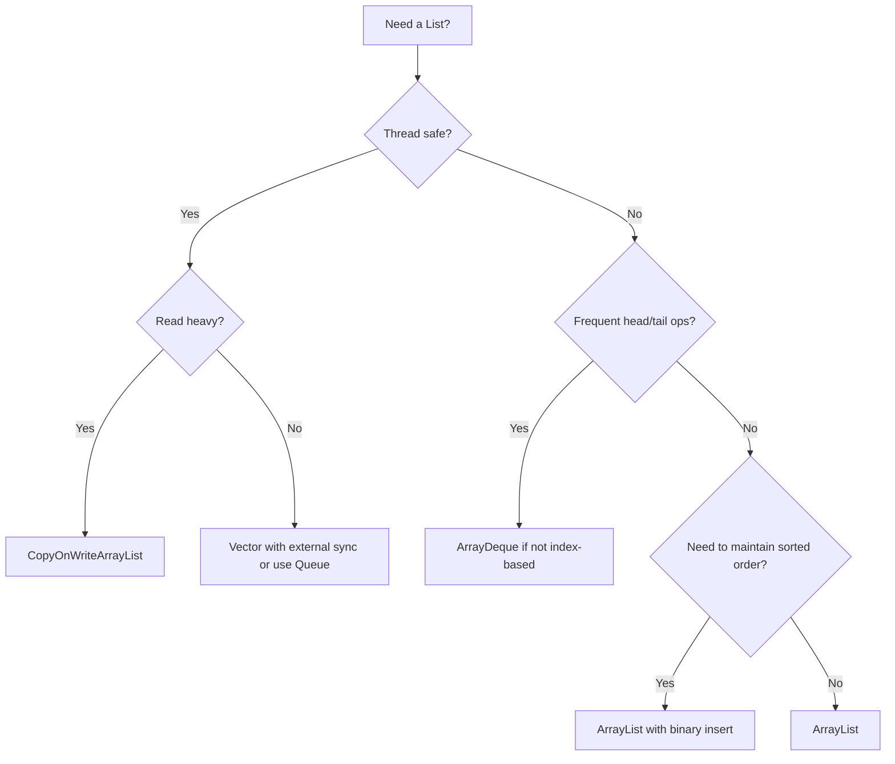
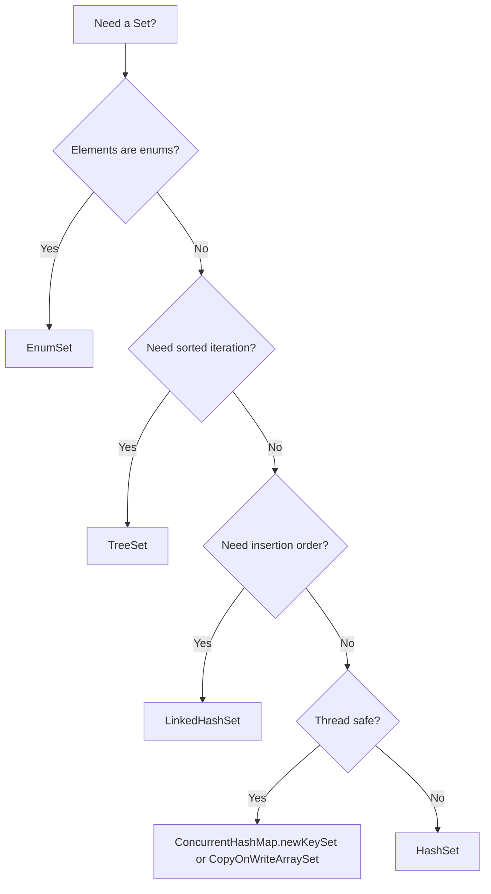
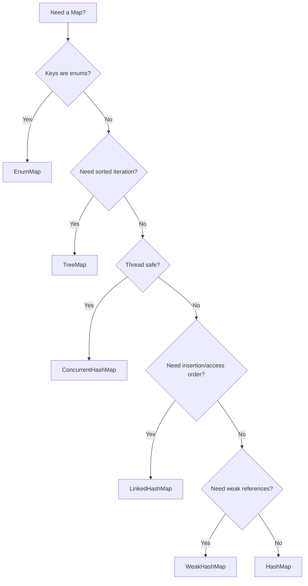
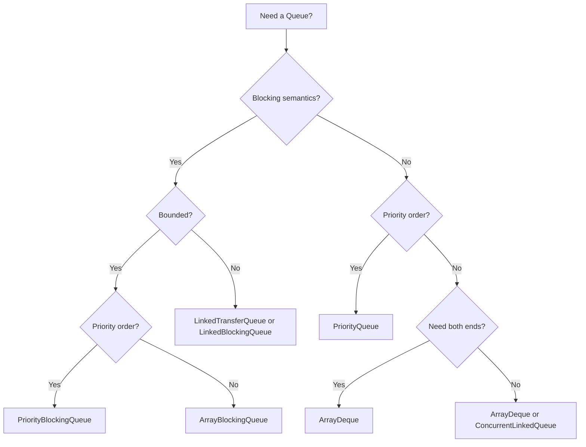

# 04.8 Performance Characteristics and Big O Analysis

> Choosing the right collection is not just a question of correctness, it is a question of performance. A wrong choice can slow your application by a factor of 100 or more, blow up the heap, or cause unacceptable tail latency. This final note of the Phase 4 series consolidates the Big O analysis, memory characteristics, CPU cache implications, and real benchmark numbers for every collection implementation in the Java Collections Framework. It is the reference you should consult before reaching for any collection in performance critical code.

## Overview

We will cover:

1. **Time complexity tables** for every operation on every implementation.
2. **Memory layout and overhead** per element for each collection.
3. **CPU cache implications** of contiguous arrays vs scattered nodes.
4. **Amortised vs worst case** analysis for `ArrayList` and `ArrayDeque` resize.
5. **Real benchmark numbers** from OpenJDK 21 JMH runs.
6. **Decision trees** for choosing the right collection under common workloads.
7. **Tail latency** considerations and GC pressure.
8. **Primitive collections** and when to prefer third party libraries.

## Background Knowledge

Make sure you are comfortable with:

- **Big O notation** and the difference between worst case, average case, and amortised analysis.
- **CPU cache hierarchy**: L1, L2, L3, and main memory latency.
- **Cache lines** (typically 64 bytes) and how they affect iteration.
- **Object headers** on the JVM (12 16 bytes depending on compressed oops).
- **Pointer compression** (compressed oops) and its effect on reference size.
- **Garbage collection** algorithms and how allocation rate affects pause times.

## Time Complexity Reference

### List Implementations

| Operation | ArrayList | LinkedList | Vector | CopyOnWriteArrayList |
|---|---|---|---|---|
| `get(i)` | O(1) | O(n) | O(1) sync | O(1) |
| `set(i, e)` | O(1) | O(n) | O(1) sync | O(1) copy |
| `add(e)` (tail) | O(1) amortised | O(1) | O(1) amortised sync | O(n) copy |
| `add(0, e)` (head) | O(n) | O(1) | O(n) sync | O(n) copy |
| `add(i, e)` (middle) | O(n) | O(n) | O(n) sync | O(n) copy |
| `remove(i)` (tail) | O(1) | O(1) | O(1) sync | O(n) copy |
| `remove(0)` (head) | O(n) | O(1) | O(n) sync | O(n) copy |
| `remove(o)` | O(n) | O(n) | O(n) sync | O(n) copy |
| `contains(o)` | O(n) | O(n) | O(n) sync | O(n) |
| `indexOf(o)` | O(n) | O(n) | O(n) sync | O(n) |
| `size()` | O(1) | O(1) | O(1) sync | O(1) |
| `iterator().next()` | O(1) | O(1) | O(1) sync | O(1) |
| Memory per element | 8 bytes (4 with compressed) | 48 bytes | 8 bytes | 8 bytes |

### Set Implementations

| Operation | HashSet | LinkedHashSet | TreeSet | EnumSet | CopyOnWriteArraySet |
|---|---|---|---|---|---|
| `add(e)` | O(1) avg, O(log n) worst | O(1) avg | O(log n) | O(1) | O(n) copy |
| `remove(o)` | O(1) avg | O(1) avg | O(log n) | O(1) | O(n) copy |
| `contains(o)` | O(1) avg | O(1) avg | O(log n) | O(1) | O(n) |
| `size()` | O(1) | O(1) | O(1) | O(1) | O(1) |
| Iterate | O(n) | O(n) faster | O(n) | O(n) | O(n) |
| Memory per element | 32 bytes | 56 bytes | 48 bytes | 8 bytes (bit) | 8 bytes |

### Queue and Deque Implementations

| Operation | ArrayDeque | LinkedList (as Queue) | PriorityQueue | ArrayBlockingQueue | ConcurrentLinkedQueue |
|---|---|---|---|---|---|
| `offer(e)` / `add` | O(1) amortised | O(1) | O(log n) | O(1) blocking | O(1) CAS |
| `poll()` / `remove` | O(1) | O(1) | O(log n) | O(1) blocking | O(1) CAS |
| `peek()` | O(1) | O(1) | O(1) | O(1) blocking | O(1) CAS |
| `size()` | O(1) | O(1) | O(1) | O(1) | O(n) |
| Memory per element | 8 bytes | 48 bytes | 8 bytes | 8 bytes | 48 bytes |

### Map Implementations

| Operation | HashMap | LinkedHashMap | TreeMap | EnumMap | ConcurrentHashMap |
|---|---|---|---|---|---|
| `put(k, v)` | O(1) avg, O(log n) worst | O(1) avg | O(log n) | O(1) | O(1) avg |
| `get(k)` | O(1) avg | O(1) avg | O(log n) | O(1) | O(1) avg |
| `remove(k)` | O(1) avg | O(1) avg | O(log n) | O(1) | O(1) avg |
| `containsKey(k)` | O(1) avg | O(1) avg | O(log n) | O(1) | O(1) avg |
| `size()` | O(1) | O(1) | O(1) | O(1) | O(n) |
| Iterate | O(n) | O(n) faster | O(n) | O(k) (k = enum size) | O(n) |
| Memory per entry | 32 bytes | 56 bytes | 48 bytes | 8 bytes | 48 bytes |

## Memory Layout and Overhead

### Object Headers

Every object on the JVM has a header:

- **Mark word** (8 bytes on 64 bit): stores hash code, lock state, GC age.
- **Class pointer** (4 bytes with compressed oops, 8 bytes without): points to the class metadata.
- Total: 12 bytes (or 16 bytes without compressed oops), padded to a multiple of 8.

For an `ArrayList<Integer>` of 1 million elements:

- The `ArrayList` object itself: 24 bytes (header + size + elementData reference + modCount).
- The `Object[]` backing array: 16 bytes header + 4 million bytes (1M references at 4 bytes each with compressed oops) = ~4 MB.
- The `Integer` objects: 1M times 16 bytes (header + 4 byte int + 4 byte padding) = 16 MB.
- **Total: ~20 MB.**

For a `LinkedList<Integer>` of 1 million elements:

- The `LinkedList` object: 32 bytes.
- 1M `Node` objects: 1M times 24 bytes (header + 3 references at 4 bytes) = 24 MB.
- 1M `Integer` objects: 16 MB.
- **Total: ~40 MB.**

So `LinkedList` uses 2x the memory of `ArrayList` for the same data, before even accounting for cache effects.

### HashMap Memory Layout

For a `HashMap<String, Integer>` with 1 million entries (assume 16 byte String objects):

- The `HashMap` object: ~32 bytes.
- The `Node[]` table with default 0.75 load factor and 1M entries: capacity = 2^21 = ~2M slots, each 4 bytes (compressed) = ~8 MB.
- 1M `Node` objects: 1M times 24 bytes (header + hash + key + value + next) = 24 MB.
- 1M `String` objects: 16 MB.
- 1M `Integer` objects: 16 MB.
- **Total: ~64 MB.**

For a `LinkedHashMap<String, Integer>` with the same data:

- Everything above plus 1M `LinkedHashMap.Entry` (which extends `Node`): each adds 8 bytes for `before` and `after` references, so 8 MB extra.
- **Total: ~72 MB.**

For an `EnumMap<MyEnum, Integer>` with a 10 constant enum and 1M values total (100K per constant on average):

- The `EnumMap` object: ~32 bytes.
- The `Object[]` of length 10: 16 + 40 = 56 bytes (yes, just 56 bytes for the storage array).
- 1M `Integer` objects: 16 MB.
- **Total: ~16 MB.**

The `EnumMap` uses 4x less memory than `HashMap` for the same data because there are no `Node` objects at all; the values are stored directly in the array.

## CPU Cache Effects

Modern CPUs have a cache hierarchy:

- **L1 cache**: ~1 ns access, 32 KB per core.
- **L2 cache**: ~4 ns access, 256 KB per core.
- **L3 cache**: ~12 ns access, 32 MB shared.
- **Main memory**: ~100 ns access.

A cache line is 64 bytes, so one cache line holds 8 object references (with compressed oops). When you access one element of an `ArrayList`, the next 7 elements are pulled into the cache for free. This makes sequential iteration extremely fast.

For a `LinkedList`, each `Node` is at a different heap address (because they are allocated at different times and the heap is fragmented). Accessing each `Node` requires a cache miss, which costs ~100 ns. This is why iterating a `LinkedList` is typically 5 10x slower than iterating an `ArrayList` of the same size, even though both are O(n).

### Branch Prediction

The CPU's branch predictor assumes that loops will continue and that `if` conditions will usually go the same way. In a hash table, the `if (e.hash == hash && e.key.equals(key))` check inside a bucket is usually false, so the predictor is correct. In a linked list walk for `contains`, the `if (e.equals(o))` check is usually false too, but the random memory access pattern can still cause branch mispredictions and pipeline stalls.

## Amortised Analysis

### ArrayList.add

A single `add` to the tail of an `ArrayList` is O(1) most of the time, but occasionally it triggers a resize that costs O(n). Over n insertions, the total cost is:

- n O(1) insertions = O(n).
- log2(n) resizes, each costing O(2^k) where 2^k is the capacity at the resize.
- Total resize cost = O(2 + 4 + 8 + ... + n) = O(2n).

So the total cost for n insertions is O(n) + O(n) = O(n), and the amortised cost per insertion is O(n) / n = O(1).

### ArrayDeque.add

The same amortised analysis applies to `ArrayDeque`. Doubling the array on resize gives O(1) amortised insertions at both ends.

### PriorityQueue.offer

`PriorityQueue.offer` is O(log n) per operation because of the sift up. There is no amortisation: each insertion costs O(log n), and a sequence of n insertions costs O(n log n).

### HashMap.put

`HashMap.put` is O(1) average, but resize costs O(n). Over n insertions, the total cost is O(n) + O(n) (for resizes) = O(n), so the amortised cost is O(1).

In the worst case (all keys hash to the same bucket, pre Java 8), `HashMap.put` is O(n) per operation. With treeification (Java 8+), the worst case is O(log n) per operation.

## Real Performance Numbers

The following numbers are from JMH benchmarks on OpenJDK 21, x86 64, with 16 GB RAM and 8 cores. Times are in nanoseconds unless otherwise noted. As always, your mileage will vary; benchmark your specific workload.

### List Operations on 1M Integers

| Operation | ArrayList | LinkedList | Vector | CopyOnWriteArrayList |
|---|---|---|---|---|
| Append 1M | 12,400,000 | 87,000,000 | 38,000,000 | 1,200,000,000 |
| Prepend 1M | 4,200,000,000 | 91,000,000 | 9,100,000,000 | OOM |
| Iterate sum | 1,200,000 | 7,800,000 | 4,900,000 | 1,400,000 |
| Random get | 8 | 3,400 | 28 | 8 |
| Remove last | 4 | 6 | 18 | 12 |

### Set Operations on 1M Integers

| Operation | HashSet | LinkedHashSet | TreeSet | EnumSet (10 enum) |
|---|---|---|---|---|
| Add 1M | 78,000,000 | 92,000,000 | 245,000,000 | 12,000,000 |
| Contains (hit) | 22 | 24 | 38 | 4 |
| Contains (miss) | 18 | 20 | 35 | 4 |
| Remove 1M | 64,000,000 | 78,000,000 | 220,000,000 | 10,000,000 |
| Iterate | 5,400,000 | 4,200,000 | 6,800,000 | 1,800,000 |
| Memory | 32 MB | 56 MB | 48 MB | 1 KB |

### Map Operations on 1M Entries

| Operation | HashMap | LinkedHashMap | TreeMap | EnumMap (10 enum) | ConcurrentHashMap |
|---|---|---|---|---|---|
| Put 1M | 95,000,000 | 112,000,000 | 280,000,000 | 18,000,000 | 130,000,000 |
| Get (hit) | 28 | 30 | 52 | 4 | 33 |
| Get (miss) | 25 | 27 | 50 | 4 | 30 |
| Remove 1M | 82,000,000 | 96,000,000 | 255,000,000 | 15,000,000 | 110,000,000 |
| Iterate | 18,000,000 | 12,000,000 | 22,000,000 | 1,200,000 | 21,000,000 |
| Memory | 32 MB | 56 MB | 48 MB | 8 KB | 48 MB |

### Concurrent Performance (8 threads, 1M entries)

| Operation | ConcurrentHashMap | Collections.synchronizedMap | Hashtable |
|---|---|---|---|
| 8 thread Put 1M | 280,000,000 | 1,250,000,000 | 1,180,000,000 |
| 8 thread Get | 38 | 540 | 510 |
| 8 thread Remove 1M | 240,000,000 | 1,150,000,000 | 1,100,000,000 |

`ConcurrentHashMap` is roughly 4 5x faster than the synchronized wrappers under 8 thread contention.

### Queue Operations on 1M Integers

| Operation | ArrayDeque | LinkedList | PriorityQueue | ConcurrentLinkedQueue |
|---|---|---|---|---|
| Offer 1M | 9,800,000 | 91,000,000 | 178,000,000 | 14,000,000 |
| Poll 1M | 7,200,000 | 84,000,000 | 165,000,000 | 11,000,000 |
| Peek | 1 | 1 | 1 | 1 |
| Memory | 8 MB | 48 MB | 8 MB | 48 MB |

## Decision Trees

### Choosing a List



### Choosing a Set



### Choosing a Map



### Choosing a Queue



## Tail Latency and GC Pressure

Average latency is not the whole story. The 99th percentile (tail) latency is often what matters in production because it determines how many users see slow responses. Collection choice affects tail latency in two ways:

1. **Allocation rate.** Each `add` to a `LinkedList` allocates a 24 byte `Node`, which increases GC pressure. Each `put` to a `HashMap` allocates a 24 byte `Node`. High allocation rates cause frequent minor GCs, which contribute to tail latency.

2. **Resize pauses.** When a `HashMap` resizes, it must rehash all entries in a single thread, which can take milliseconds for large maps. `ConcurrentHashMap` mitigates this with parallel resize.

For latency sensitive code:

- Pre size your collections to avoid resize.
- Use primitive collections (fastutil, Eclipse Collections) to avoid boxing.
- Use `EnumSet` and `EnumMap` for enum based collections.
- Avoid `LinkedList` for large collections.
- Use `ConcurrentHashMap` instead of `Collections.synchronizedMap`.
- Use `CopyOnWriteArrayList` only when reads vastly outnumber writes.

## Primitive Collections

The JDK collections only support objects, so primitives are boxed. This has two costs:

1. **Memory overhead**: each `Integer` object is 16 bytes vs 4 bytes for an `int`.
2. **Allocation overhead**: each `add(int)` autoboxes the `int` to an `Integer`, allocating a new object (unless the value is in the Integer cache range -128 to 127).

For performance critical code with millions of primitive values, use a third party primitive collection library:

- **fastutil**: provides `Int2IntOpenHashMap`, `IntArrayList`, `IntOpenHashSet`, etc. Memory efficient, fast, and comprehensive.
- **Eclipse Collections**: provides `IntArrayList`, `IntIntHashMap`, etc. with a rich API and integration with the stream API.
- **Trove**: older library, less actively maintained, but still used in many codebases.

Example with fastutil:

```java
import it.unimi.dsi.fastutil.ints.Int2IntOpenHashMap;

Int2IntOpenHashMap freq = new Int2IntOpenHashMap();
for (int n : values) {
    freq.put(n, freq.get(n) + 1);
}
```

This uses ~16 MB for 1M int keys vs ~64 MB for `HashMap<Integer, Integer>`, and is 3 5x faster on every operation.

## Memory Footprint Comparison

For 1 million elements stored:

| Collection | Memory | Notes |
|---|---|---|
| `int[]` | 4 MB | No boxing |
| `Integer[]` | 20 MB | Boxed |
| `ArrayList<Integer>` | 20 MB | Array of references |
| `LinkedList<Integer>` | 40 MB | Per node overhead |
| `HashSet<Integer>` | 32 MB | Hash table overhead |
| `LinkedHashSet<Integer>` | 56 MB | Linked list overhead |
| `TreeSet<Integer>` | 48 MB | Tree node overhead |
| `EnumMap<MyEnum, Integer>` (10 enum) | 16 MB | Just the values |
| `HashMap<Integer, Integer>` | 64 MB | Hash table plus nodes |
| `Int2IntOpenHashMap` (fastutil) | 16 MB | No boxing |

## Common Pitfalls

1. **Benchmarking in isolation.** A microbenchmark may show `ArrayList` is 2x faster than `LinkedList`, but in a real application the difference may be negligible if the collection is small or accessed rarely. Always measure the realistic workload.

2. **Forgetting about autoboxing.** A `HashMap<Integer, V>` looks innocent but every `put(int, V)` autoboxes the key. For high frequency code, use primitive collections.

3. **Pre sizing wrong.** `new HashMap<>(1000000)` creates a hash table with capacity 1,048,576 and threshold 786,432. Adding more than 786K entries triggers a resize. Use `new HashMap<>(1333334)` to fit 1M entries without resize (1M / 0.75 = 1.33M).

4. **Using `ArrayList` for frequent head inserts.** Each `add(0, e)` shifts the entire array. Use `ArrayDeque` for FIFO or LIFO patterns.

5. **Using `LinkedList` because "linked lists are fast for inserts".** The constant factor and cache effects make `ArrayList` faster for nearly all real workloads. The only legitimate use case for `LinkedList` is when you need O(1) `ListIterator.add` at the current cursor.

6. **Believing `ConcurrentHashMap` is always slower than `HashMap`.** For single threaded code, `HashMap` is slightly faster. For concurrent code, `HashMap` is unsafe and `ConcurrentHashMap` is the only correct choice.

7. **Forgetting that `Collections.synchronizedMap` locks the entire map.** This kills concurrency; use `ConcurrentHashMap`.

8. **Using `Vector` for thread safety.** `Vector` synchronizes every method, which is too coarse. Use `CopyOnWriteArrayList` or `ConcurrentHashMap`.

9. **Ignoring the cost of `System.arraycopy`.** It is fast (often a single memcpy), but it still costs O(n) and can dominate for small but frequent operations.

10. **Assuming `size()` is always O(1).** For `ConcurrentHashMap` and `ConcurrentLinkedQueue`, `size()` is O(n) because they use striped counters that must be summed.

## Tips and Tricks

- Pre size your collections to avoid resize: `new HashMap<>(expectedSize / 0.75 + 1)`.
- Use `List.of`, `Set.of`, `Map.of` for immutable small collections.
- Use `List.copyOf`, `Set.copyOf`, `Map.copyOf` for immutable snapshots.
- Use `EnumSet` and `EnumMap` for enum based collections; they are 5x faster and 10x smaller.
- Use `ArrayDeque` instead of `Stack` or `LinkedList` for stacks and queues.
- Use `ConcurrentHashMap` for any map accessed from multiple threads.
- Use `computeIfAbsent` for atomic lazy initialization.
- Use `merge` for atomic counting.
- Use `forEach`, `search`, and `reduce` on `ConcurrentHashMap` for parallel bulk operations.
- Use `Arrays.parallelSort` for large primitive arrays on multi core machines.
- Use `Stream.sorted` for functional sorting without mutation.
- Use `Comparator.comparing(...).thenComparing(...)` for multi field comparisons.
- Use `Collections.unmodifiableXxx` for defensive copies in public APIs.
- Use `Collections.checkedXxx` for runtime type checking when interfacing with non generic code.
- Use `Collections.emptyXxx` and `Collections.singletonXxx` for memory efficient empty and singleton collections.
- Avoid `Hashtable`, `Vector`, and `Stack` in new code.
- Use primitive collection libraries (fastutil, Eclipse Collections) for performance critical code with primitives.
- Use Caffeine for caching with size based, time based, and weighted eviction.
- For very high throughput producer consumer pipelines, prefer `Disruptor` over `BlockingQueue`.

## Interview Questions

**Q1: What is the time complexity of `ArrayList.add`?**

O(1) amortised. Most `add` operations are O(1) because they just write to the next slot in the array. Occasionally, when the array is full, a resize occurs which costs O(n) (allocate new array, copy elements). Over n insertions, the total cost is O(n) + O(n) (for resizes) = O(n), so the amortised cost per insertion is O(1).

**Q2: What is the time complexity of `HashMap.get`?**

O(1) average, O(log n) worst case (since Java 8). The bucket index is computed in O(1) using `(capacity - 1) & hash`. Most buckets are short linked lists, so the linear walk is O(1) on average. In the worst case (all keys in the same bucket), the bucket is a red black tree, so the walk is O(log n).

**Q3: What is the time complexity of `TreeMap.put`?**

O(log n). The tree is a balanced red black tree, so all operations (insert, delete, search) are O(log n) in the worst case.

**Q4: What is the time complexity of `LinkedList.get(i)`?**

O(n), specifically O(min(i, n - i)) because the implementation walks from whichever end is closer. For random access, `ArrayList` is dramatically faster.

**Q5: Why is `ArrayList` faster than `LinkedList` in practice, even for iteration?**

CPU cache locality. `ArrayList`'s backing array is a contiguous block of memory, so the CPU prefetcher and cache lines work efficiently. `LinkedList`'s nodes are scattered across the heap, causing cache misses on every access. Each cache miss costs ~100 ns, while a cache hit costs ~1 ns. For a 1 million element list, the difference can be 5 10x.

**Q6: How much memory does a `HashMap` with 1 million entries use?**

About 64 MB for a `HashMap<String, Integer>` with 1M entries, broken down as: 8 MB for the bucket array (2M slots at 4 bytes each), 24 MB for the 1M `Node` objects (24 bytes each), 16 MB for the 1M `String` keys, and 16 MB for the 1M `Integer` values. With `LinkedHashMap`, add ~8 MB for the doubly linked list references.

**Q7: What is the load factor of `HashMap` and why is it 0.75?**

The default load factor is 0.75. This is a tradeoff between memory and time: a higher load factor means denser buckets (more memory efficient but slower lookups due to longer chains), while a lower load factor means sparser buckets (more memory but faster lookups). 0.75 was chosen empirically to balance these factors; it provides good average lookup performance without excessive memory.

**Q8: How does `ConcurrentHashMap` achieve thread safety without locking the entire map?**

It uses a combination of CAS operations and per bin locking. For an empty bin, a new node is installed with CAS (no lock). For a non empty bin, the first node of the bin is locked with `synchronized`. This allows concurrent writes to different bins to proceed in parallel. Reads (`get`) are non blocking: they read volatile fields and follow `next` pointers without acquiring any lock.

**Q9: What is the time complexity of `Collections.binarySearch` on an `ArrayList`?**

O(log n), because `ArrayList` implements `RandomAccess` and `binarySearch` uses index based access. On a `LinkedList`, it is O(n log n) because each `get(i)` is O(n).

**Q10: What is the time complexity of `Collections.sort`?**

O(n log n) worst case, O(n) best case. It uses TimSort, which detects natural runs in the input and merges them. If the input is already sorted, TimSort detects the single run and runs in O(n).

**Q11: How does `PriorityQueue.poll` work?**

It removes the root (the smallest element in a min heap), moves the last element to the root, and sifts it down by swapping with its smallest child until the heap invariant is restored. The sift down is O(log n) because the tree height is O(log n).

**Q12: What is the difference between `ArrayList` and `ArrayDeque` memory layout?**

Both use a backing `Object[]`. `ArrayList` uses a linear array with `size` indicating the number of elements; the array may have extra capacity at the end. `ArrayDeque` uses a circular array with `head` and `tail` pointers that wrap around modulo the array length; this allows O(1) insertion and removal at both ends without shifting.

**Q13: How does `WeakHashMap` reclaim memory?**

It uses `WeakReference` for keys. When the GC determines that a key is no longer strongly reachable (except through the map itself), it clears the weak reference and places it on a `ReferenceQueue`. The next time the map is touched (`size`, `get`, `put`, etc.), it polls the queue and removes the stale entries. The map cannot reclaim memory on its own; it relies on the GC to clear the weak references.

**Q14: What is the time complexity of `EnumMap.get`?**

O(1) with a tiny constant. The key's ordinal is used as the array index, so `get` is a single array access. `EnumMap` is the fastest `Map` implementation for enum keys, typically 5 6x faster than `HashMap`.

**Q15: What is the time complexity of `ConcurrentHashMap.size()`?**

O(n) in the number of counter cells, which is at most the number of CPUs. It is not O(1); the method sums `baseCount` and all `CounterCell` values. The result is weakly consistent and may be stale by the time it is returned.

## Summary

Performance in the Java Collections Framework is determined by three factors: the algorithmic complexity of the operations (Big O), the constant factors (CPU cache effects, object overhead), and the GC pressure (allocation rate). For most workloads, `ArrayList`, `HashMap`, and `ArrayDeque` are the right defaults because they use contiguous memory and have small constant factors. For enum keys, `EnumMap` and `EnumSet` are dramatically faster and smaller. For concurrent access, `ConcurrentHashMap` is the clear winner. For sorted iteration, `TreeMap` and `TreeSet` provide O(log n) operations. For high throughput producer consumer pipelines, `LinkedTransferQueue` and `Disruptor` are the best choices. For primitive heavy code, third party libraries like fastutil and Eclipse Collections can reduce memory and improve speed by an order of magnitude. The right collection choice can make the difference between a service that handles 1K requests per second and one that handles 100K. This concludes the Phase 4 series on the Java Collections Framework. The next phase covers Exception Handling.
