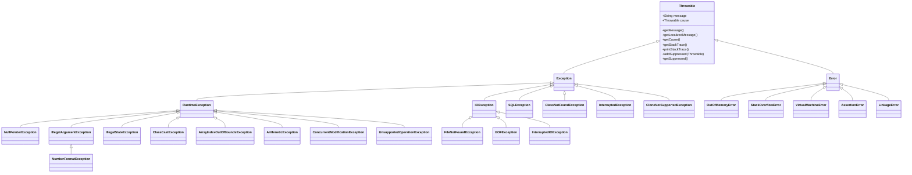
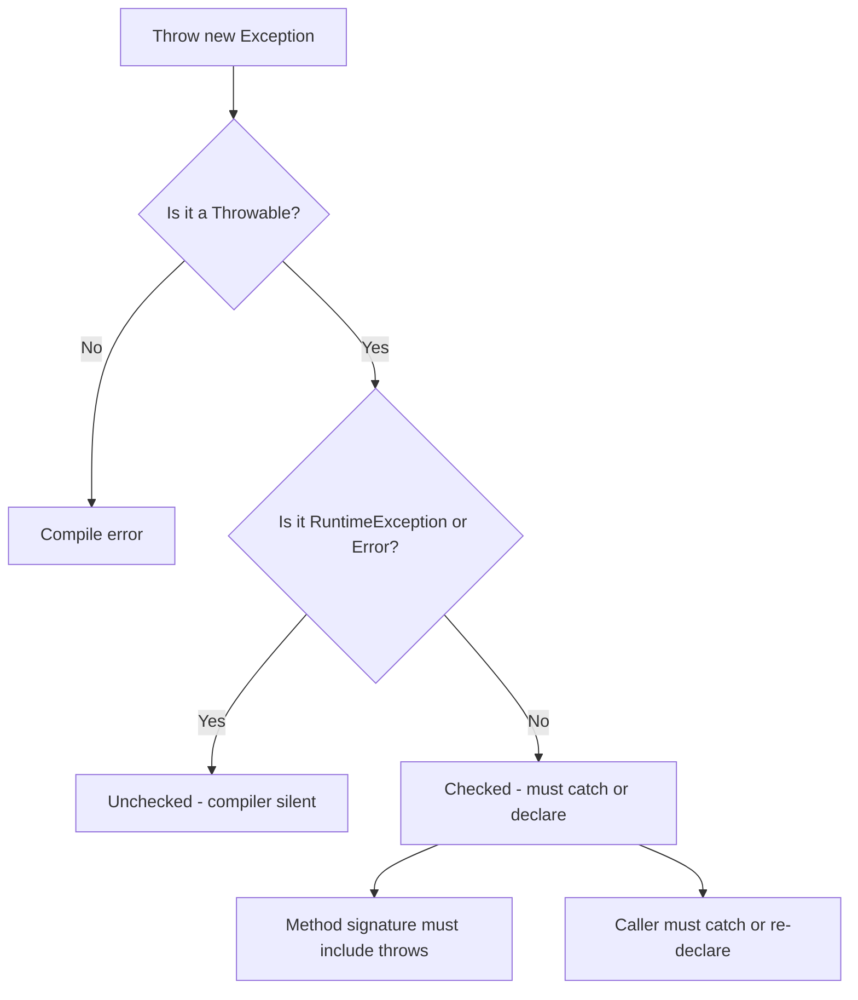
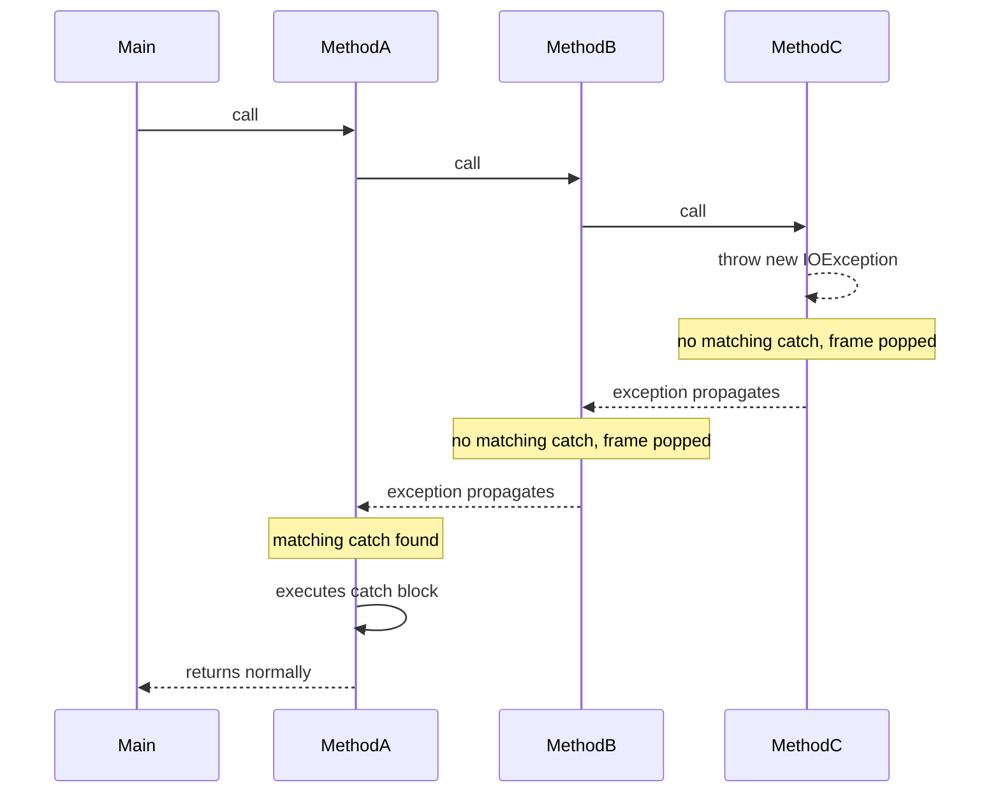

# 05.1. Exception Hierarchy Checked vs Unchecked

## Overview

Exceptions are the JVM's mechanism for signaling that something has gone wrong at runtime. Every Java developer must internalize the exception hierarchy, the difference between checked and unchecked exceptions, and the precise rules the compiler enforces. This note is the deep-dive companion to the rest of Phase 5. By the end you will understand the Throwable family tree, why Java is one of the few languages with checked exceptions, why `Error` exists as a separate branch, what `RuntimeException` is really saying, and how to reason about exception design in your own APIs.

We will cover the historical context of exceptions in Java, walk through every important class in `java.lang`, build a mental model of how an exception travels up the call stack, and finish with a debate about checked vs unchecked exceptions that has consumed the Java community for almost thirty years.

## Background Knowledge

Before Java popularized the modern exception model in 1995, languages like C used return codes (`-1`, `NULL`, `errno`) and the programmer had to remember to check every call site. C++ introduced `try`/`catch`/`throw` but did not require declarations. Java's designers, led by James Gosling, decided to do something radical: they would force the caller of a method to acknowledge the failure modes documented by that method. This is the checked exception mechanism, and it is one of the most polarizing language design decisions ever made.

Three things you must keep in mind while reading this note:

1. Exceptions are objects. They live on the heap, have type identity, can carry state, and can be subclassed like any other class.
2. Exceptions unwind the call stack. When a method throws, the JVM walks up the call frames looking for a matching `catch` clause; if it reaches `Thread.run` without finding one, the thread's uncaught exception handler is invoked.
3. The compiler only enforces checked exceptions. Unchecked exceptions (`RuntimeException` and `Error` subtypes) propagate silently.

## The Throwable Family Tree

Everything that can be thrown is a `Throwable`. The hierarchy splits into two main branches: `Error` and `Exception`. Within `Exception` there is a further split: `RuntimeException` and all other exceptions (the "checked" ones).



### Throwable Itself

`Throwable` is the abstract root. Every instance has:

- A `message` (set via constructor, retrieved with `getMessage()`).
- An optional `cause` (another Throwable that triggered this one, retrieved with `getCause()`). The cause is the foundation of exception chaining.
- A `stackTrace` array of `StackTraceElement` objects, captured automatically by the JVM at construction time.
- An optional list of `suppressed` exceptions, added in Java 7 to support try-with-resources.

You should almost never subclass `Throwable` directly. The convention is to extend `Exception` (checked) or `RuntimeException` (unchecked).

### Error

`Error` represents conditions that are so severe the application cannot reasonably recover. These include:

- `OutOfMemoryError` - the JVM ran out of heap and could not allocate an object even after a full GC.
- `StackOverflowError` - a thread exhausted its stack, typically from unbounded recursion.
- `VirtualMachineError` - the JVM itself is broken.
- `LinkageError` - a class has a binary incompatibility with another class it depends on (e.g., a method was removed from a dependency).
- `AssertionError` - thrown by the `assert` keyword.

Errors are unchecked. You should never catch them (with the rare exception of `StackOverflowError` in test harnesses for recursive parsers). If your code throws an `Error`, the right response is usually to let the JVM die and let the orchestrator (k8s, systemd, supervisord) restart you.

### Exception

`Exception` is the parent of every "normal" failure your program might want to handle. It itself is checked, which means any method that throws `new Exception("boom")` must declare `throws Exception` on its signature. Most concrete subclasses you create should extend `Exception` only if you believe callers should be forced to handle the failure.

### RuntimeException

`RuntimeException` is the special subclass of `Exception` that is unchecked. It represents programming errors: things the developer did wrong, not things the environment did wrong. Examples:

- `NullPointerException` - you dereferenced a null reference.
- `IllegalArgumentException` - you passed an invalid argument.
- `IllegalStateException` - you called a method at the wrong time (e.g., `Iterator.remove` before `next`).
- `ArrayIndexOutOfBoundsException` - you indexed past an array's length.
- `ArithmeticException` - integer division by zero (floating-point division by zero returns `Infinity` or `NaN`).
- `ClassCastException` - you cast to the wrong type.
- `NumberFormatException` - you parsed a malformed number string.
- `ConcurrentModificationException` - a thread mutated a collection while another was iterating.
- `UnsupportedOperationException` - you called a method that the implementation deliberately does not support (e.g., `List.of().add(1)`).

The compiler does not force callers to declare or catch these because they can happen almost anywhere; requiring declarations would make the entire Java type signature system unusable.

## Checked vs Unchecked: The Core Distinction

A checked exception is any subclass of `Throwable` (other than `RuntimeException` and `Error`) that the compiler insists you either catch or declare in your `throws` clause. An unchecked exception is any subclass of `RuntimeException` or `Error`; the compiler does not require you to acknowledge it.



### The Rule, Restated

The JLS (Java Language Specification, section 11.2) says:

> The checked exception classes named in the throws clause are part of the contract between the implementor and user of the method or constructor.

In plain English: if your method body throws a checked exception, your method signature must declare it. If you call a method that declares a checked exception, your method must either catch it or declare it. The compiler enforces this with error messages like:

```
error: unreported exception IOException; must be caught or declared to be thrown
```

### Example: Checked Exception Flow

```java
import java.io.IOException;
import java.nio.file.Files;
import java.nio.file.Path;

public class FileLoader {

    // Files.readString throws IOException, which is checked.
    // We must declare it on our signature.
    public String load(Path path) throws IOException {
        return Files.readString(path);
    }

    // Here we choose to catch the exception instead of propagating.
    public String loadSafely(Path path) {
        try {
            return Files.readString(path);
        } catch (IOException e) {
            // Log and return a fallback. We are absorbing the exception,
            // which is sometimes the right call and sometimes a bug.
            System.err.println("Could not read " + path + ": " + e.getMessage());
            return "";
        }
    }

    // Here we rethrow as an unchecked exception to keep the call site clean.
    public String loadUnchecked(Path path) {
        try {
            return Files.readString(path);
        } catch (IOException e) {
            throw new RuntimeException("Failed to read " + path, e);
        }
    }
}
```

Note three things about the example:

1. The `catch` block always catches a specific type (here, `IOException`). Catching `Throwable` or `Exception` is almost always a bug.
2. When rethrowing, we always pass the original exception as the `cause` so the stack trace is preserved.
3. Wrapping a checked exception in `RuntimeException` is a deliberate and legitimate design choice, often called "exception translation."

### Example: Unchecked Exception Flow

```java
public class Calculator {

    public int divide(int a, int b) {
        // No throws clause needed. The compiler does not require callers
        // to handle ArithmeticException. It can happen anywhere arithmetic does.
        return a / b;
    }

    public int parse(String s) {
        // NumberFormatException is also unchecked. The caller has no way to
        // guarantee the string is parseable at compile time.
        return Integer.parseInt(s);
    }
}
```

The compiler is silent here. If a caller wants to be defensive, they can wrap the call in `try`/`catch`, but nothing forces them to.

## The Stack Unwinding Model

When an exception is thrown, the JVM immediately stops normal execution of the current method and walks up the call stack frame by frame. For each frame it asks: does this method have an enclosing `try` block whose `catch` clause matches the exception's type? If yes, control jumps to that catch block. If no, the frame is popped and the next frame up is examined. If the walk reaches `Thread.run` without finding a match, the thread's `UncaughtExceptionHandler` is invoked, which by default prints the stack trace to `System.err` and terminates the thread.



The cost of this walk is essentially zero until an exception is actually thrown. The JIT compiler optimizes the non-throwing path aggressively. The cost of constructing the exception (specifically, the `fillInStackTrace` call that captures the stack) is non-trivial: typically a few microseconds and an allocation. This is why exceptions should not be used for ordinary control flow.

You can opt out of stack capture by overriding `fillInStackTrace` to return `this`, but this is almost never the right call except in extremely high-throughput libraries like Netty or JEP 230-era reactive runtimes.

## The Cause Field and Exception Chaining

Real-world failures often have layers. The JDBC driver cannot connect to the database; it wraps the underlying `java.net.ConnectException` in a `java.sql.SQLException`. The service layer catches the `SQLException` and wraps it in a `UserServiceException`. Each layer preserves the underlying cause so the final stack trace looks like a layered onion.

```java
public class UserService {

    public User findById(long id) throws UserServiceException {
        try {
            return userDao.find(id);
        } catch (SQLException e) {
            // Exception chaining: pass the original as cause.
            // The new exception's stack trace will list itself first,
            // then a "Caused by:" section with the original.
            throw new UserServiceException("Failed to load user " + id, e);
        }
    }
}

class UserServiceException extends Exception {
    public UserServiceException(String message, Throwable cause) {
        super(message, cause);
    }
}
```

There are two ways to chain:

1. Pass the cause to the constructor (preferred).
2. Call `initCause(Throwable)` after construction.

Always prefer the constructor. The `initCause` API exists only because some legacy classes (like `Throwable` itself before Java 4) did not have cause-aware constructors.

## Suppressed Exceptions

Java 7 introduced suppressed exceptions to handle a corner case in try-with-resources: what happens if the `close()` method itself throws? Without suppression, the original exception would be lost. With suppression, the close-time exception is attached to the original as a suppressed exception, and you can inspect it via `getSuppressed()`.

```java
try (Resource r = new Resource()) {
    throw new IOException("Body failure");
    // When the try block exits, r.close() runs and throws its own IOException.
    // The "Body failure" exception is the primary; the close-time exception
    // is added to its suppressed list.
} catch (IOException e) {
    System.out.println("Primary: " + e.getMessage());
    for (Throwable suppressed : e.getSuppressed()) {
        System.out.println("Suppressed: " + suppressed.getMessage());
    }
}
```

You can manually add suppressed exceptions via `addSuppressed(Throwable)`, which is useful in your own resource management code.

## Stack Trace and StackTraceElement

Every Throwable captures a `StackTraceElement[]` at construction. Each element has:

- `className` - the fully-qualified class name.
- `methodName` - the method name.
- `fileName` - the source file (may be null).
- `lineNumber` - the source line number (may be negative if unknown).

```java
try {
    throw new IllegalStateException("test");
} catch (IllegalStateException e) {
    for (StackTraceElement frame : e.getStackTrace()) {
        System.out.printf("%s.%s(%s:%d)%n",
            frame.getClassName(), frame.getMethodName(),
            frame.getFileName(), frame.getLineNumber());
    }
}
```

In Java 9, the stack walking API (`StackWalker`) gives you a lazy, filtered walk of the stack that is dramatically cheaper than `Throwable.getStackTrace()` or `Thread.currentThread().getStackTrace()`. Use `StackWalker` for diagnostic and security checks.

The JVM's stack trace generation can be slow because it must symbolicate native addresses back to class and method names. For hot paths where you only need the type of the exception, you can override `fillInStackTrace`:

```java
public class FastException extends RuntimeException {
    @Override
    public synchronized Throwable fillInStackTrace() {
        // Skip the expensive stack capture. Use only when you really need it.
        return this;
    }
}
```

Netty, for example, does this for its `EncoderException` family because they are thrown extremely frequently.

## Why Checked Exceptions Are Controversial

The debate is almost as old as Java. The pro-checked camp (James Gosling, Josh Bloch) argues:

- Forces API designers to document failure modes.
- Makes "I can fail" part of the type signature.
- Encourages callers to think about recovery.
- The compiler catches forgotten error paths at build time.

The anti-checked camp (Bruce Eckel, Anders Hejlsberg of C#, the entire Scala community) argues:

- Checked exceptions fail at scale. A low-level method adding a new checked exception forces every transitive caller to recompile.
- They are awkward with lambdas and streams (the `Function` interface cannot declare checked exceptions).
- They get swallowed by lazy coders writing `catch (Exception e) {}`.
- They do not survive across async boundaries (CompletableFuture, reactive streams).
- Modern Java frameworks (Spring, Jakarta EE) have largely standardized on unchecked exceptions.

The pragmatic middle ground most production codebases adopt:

- Use checked exceptions for recovable, business-meaningful failures where the caller genuinely has a choice: "file not found, retry on another node?" or "user not authenticated, prompt for credentials?"
- Use unchecked exceptions for programming errors (`IllegalStateException`, `IllegalArgumentException`) and for environmental failures that callers cannot meaningfully recover from at the call site (database down, network timeout).

Spring's `DataAccessException` hierarchy is the textbook example of this middle ground: it wraps the checked `SQLException` in an unchecked runtime exception, because almost no caller can do anything useful with the original.

## The Throws Clause and Overriding

The JLS imposes strict rules on what `throws` clauses can appear on overridden methods. The rule is that an overriding method can throw the same checked exceptions as the parent, or a subset (subtypes), but not new or broader ones. This is a direct consequence of the Liskov Substitution Principle: callers of the parent type must be able to handle whatever the subtype throws.

```java
import java.io.IOException;

abstract class Base {
    public abstract void doWork() throws IOException, ClassNotFoundException;
}

class Tight extends Base {
    // Legal: throws a subset (just IOException).
    @Override
    public void doWork() throws IOException {
        // ...
    }
}

class Narrower extends Base {
    // Legal: throws nothing.
    @Override
    public void doWork() {
        // ...
    }
}

// class Wider extends Base {
//     // ILLEGAL: throws SQLException, which is not declared by the parent.
//     @Override
//     public void doWork() throws IOException, ClassNotFoundException,
//                                  java.sql.SQLException {
//     }
// }

class WithRuntime extends Base {
    // Legal: RuntimeException is unchecked, so it is not part of the contract.
    @Override
    public void doWork() throws IOException, IllegalStateException {
        // ...
    }
}
```

These rules apply to interface methods and abstract methods alike. They also apply to constructors? No. Constructors are not subject to the overriding rule, but they are subject to their own rule: a subclass constructor's `throws` clause is independent of the superclass constructor's `throws` clause, because constructors are not overridden.

## Multi-Catch

Java 7 introduced multi-catch, which lets a single `catch` block handle multiple exception types:

```java
try {
    riskyOperation();
} catch (IOException | SQLException e) {
    // e is treated as the closest common supertype (here, Exception)
    // for the purposes of method calls, but the bytecode handles each
    // type independently. The variable e is implicitly final.
    log.error("I/O or SQL failure", e);
}
```

Important details:

- The `|`-separated types must be disjoint; you cannot write `catch (IOException | FileNotFoundException e)` because `FileNotFoundException` is a subtype of `IOException` and the compiler will reject it as unreachable.
- The caught variable is implicitly final.
- The static type of the variable is the most specific common supertype of the alternatives.

## The Finally Block and Try-with-Resources

Both are covered in depth in 05.2. For now, just remember:

- `finally` runs whether or not an exception was thrown, and even if a `catch` block itself throws a new exception.
- `finally` blocks can swallow the primary exception if they themselves throw. This is the bug that try-with-resources was designed to eliminate.

## Common Pitfalls

### 1. Catching Throwable

```java
try {
    riskyCode();
} catch (Throwable t) {
    // This swallows OutOfMemoryError, StackOverflowError, and
    // ThreadDeath (deprecated but still around). Almost always a bug.
}
```

Unless you are writing a top-level thread boundary handler, never catch `Throwable`.

### 2. Swallowing Exceptions

```java
try {
    riskyCode();
} catch (IOException e) {
    // empty catch block. The single worst anti-pattern in Java.
}
```

Even if you genuinely have nothing to do, at least log it. If you really want to ignore it, add a comment explaining why and rename the variable to `ignored`:

```java
} catch (IOException ignored) {
    // Intentionally ignored: file is a hint, not a requirement.
}
```

### 3. Losing the Cause

```java
throw new MyException("something failed");
// The original exception that you just caught is now lost forever.
```

Always pass the cause: `throw new MyException("something failed", cause)`.

### 4. Using Exceptions for Control Flow

```java
try {
    while (true) {
        list.add(parser.next());
    }
} catch (NoSuchElementException e) {
    // Done!
}
```

This works but is far slower than checking `parser.hasNext()`. The exception path is hundreds of times more expensive than the normal path because of stack trace capture.

### 5. Logging and Rethrowing

```java
try {
    riskyCode();
} catch (IOException e) {
    log.error("Failed", e);
    throw e;
}
```

This is fine, but beware of logging the same exception at every level of the call stack. Log once at the boundary (typically the controller or service entry point), and rethrow without logging elsewhere.

### 6. Throwing in a Finally Block

```java
try {
    riskyCode();
} finally {
    closeResource(); // if this throws, the original exception is lost
}
```

Use try-with-resources instead. If you cannot, use a try/catch inside the finally and call `addSuppressed`.

### 7. Returning from a Finally Block

```java
try {
    throw new RuntimeException("real error");
} finally {
    return 42; // swallows the RuntimeException entirely!
}
```

This is so dangerous that modern IDEs and linters flag it. Never return from a finally block.

### 8. Forgetting that Catch Order Matters

```java
try {
    riskyCode();
} catch (Exception e) {
    handleGeneric(e);
} catch (IOException e) {
    // Unreachable! The compiler rejects this with "IOException has already been caught".
    handleIO(e);
}
```

Always order catch clauses from most specific to most general.

## Tips and Tricks

### Tip 1: Use Exception Typing to Communicate Intent

If your API throws a generic `Exception`, callers must catch the kitchen sink. Throw specific, well-named exceptions that reflect the actual failure modes:

```java
public class UserService {
    public User login(String email, String password)
            throws UserNotFoundException, InvalidPasswordException,
                   AccountLockedException {
        // ...
    }
}
```

### Tip 2: Wrap with Cause When Translating

When converting a low-level exception into a domain-level one, always preserve the cause. Without it, debugging production issues becomes archaeology.

### Tip 3: Lazy Stack Traces

For high-throughput paths where you only care about the type, override `fillInStackTrace`:

```java
public class SignalException extends RuntimeException {
    @Override public Throwable fillInStackTrace() { return this; }
}
```

### Tip 4: StackWalker for Diagnostics

```java
import java.lang.StackWalker.StackFrame;

String caller = StackWalker.getInstance()
    .walk(frames -> frames.skip(1).findFirst()
        .map(StackFrame::getMethodName)
        .orElse("unknown"));
```

This is far cheaper than `new Throwable().getStackTrace()`.

### Tip 5: Get Root Cause

```java
static Throwable rootCause(Throwable t) {
    while (t.getCause() != null) t = t.getCause();
    return t;
}
```

Apache Commons Lang's `ExceptionUtils.getRootCause` does this for you, but the implementation is trivial.

### Tip 6: Throw Const and Reuse

If you throw an exception in a hot path and never inspect its stack trace, you can reuse a single instance:

```java
private static final SignalException DONE = new SignalException();

if (condition) throw DONE;
```

This only works if the exception's stack trace is irrelevant (i.e., `fillInStackTrace` returns `this`) and if no caller modifies the exception. Use sparingly.

### Tip 7: Use AddSuppressed When You Cannot Use Try-with-Resources

```java
Throwable primary = null;
try {
    riskyCode();
} catch (Throwable t) {
    primary = t;
    throw t;
} finally {
    try {
        closeResource();
    } catch (Throwable t) {
        if (primary != null) primary.addSuppressed(t);
        else throw t;
    }
}
```

This is essentially what the compiler generates for try-with-resources.

## Interview Questions

### Q1: What is the difference between checked and unchecked exceptions?

Checked exceptions are subclasses of `Exception` (other than `RuntimeException`) that the compiler forces callers to either catch or declare in their `throws` clause. Unchecked exceptions are subclasses of `RuntimeException` or `Error` and do not require explicit handling.

### Q2: Why does Java have checked exceptions when most other languages do not?

To force API designers to document failure modes as part of the method contract and to make forgotten error paths a compile-time error rather than a runtime surprise. The trade-off is verbosity and versioning friction at scale.

### Q3: What is the difference between `Error` and `Exception`?

`Error` represents conditions from which the application generally cannot recover (out of memory, stack overflow, JVM internal failures). `Exception` represents conditions a well-written application might want to catch. Errors are unchecked; subclasses of `Exception` (other than `RuntimeException`) are checked.

### Q4: Can a method override a parent's throws clause to declare more checked exceptions?

No. The overriding method can declare the same checked exceptions as the parent, or a subset, or subtypes of those exceptions. It cannot declare broader or new checked exceptions. This is required by the Liskov Substitution Principle.

### Q5: What is exception chaining and why does it matter?

Exception chaining is the practice of passing the original exception as the `cause` of a new wrapper exception. It matters because without the cause, the original stack trace and exception type are lost, making production debugging extremely difficult.

### Q6: What is the difference between `getMessage()` and `getLocalizedMessage()`?

`getMessage()` returns the detail message string. `getLocalizedMessage()` is intended to return a localized version; the default implementation in `Throwable` just returns `getMessage()`. Subclasses like `MissingResourceException` override it to format using a `ResourceBundle`.

### Q7: What are suppressed exceptions?

Suppressed exceptions were added in Java 7 to support try-with-resources. They are exceptions that occur during resource cleanup (typically in `close()` methods) and are attached to the primary exception via `addSuppressed`. You retrieve them via `getSuppressed()`.

### Q8: Why should you not catch `Throwable`?

`Throwable` includes `Error` subtypes like `OutOfMemoryError` and `StackOverflowError` from which the application cannot meaningfully recover. Catching them hides critical JVM problems and almost always leads to a corrupted state.

### Q9: How does multi-catch work under the hood?

The compiler generates a single catch block in the bytecode that handles each exception type listed. The caught variable is treated as the most specific common supertype at compile time, and it is implicitly final.

### Q10: Is `NumberFormatException` checked or unchecked?

Unchecked. It extends `IllegalArgumentException`, which extends `RuntimeException`.

### Q11: Can you throw a checked exception from a lambda?

Not directly. Functional interfaces like `Function` and `Consumer` do not declare checked exceptions in their method signatures, so a lambda targeting them cannot throw a checked exception. Workarounds include wrapping in a runtime exception, defining your own functional interface that declares the exception, or using libraries like Apache Commons Lang's `FailableFunction`.

### Q12: What is exception translation?

The practice of catching a low-level exception and rethrowing it as a higher-level domain exception, preserving the original as the cause. Spring's `DataAccessException` is the canonical example, wrapping checked `SQLException` in an unchecked hierarchy.

### Q13: What is the cost of throwing an exception in Java?

The non-throwing path is essentially free thanks to JIT optimization. The throwing path involves constructing the exception (allocation plus `fillInStackTrace`, which walks the stack), and unwinding the call frames. Typical cost is in the low microseconds, dominated by stack capture.

### Q14: What is `Thread.UncaughtExceptionHandler`?

An interface that you can register on a `Thread` (or globally via `Thread.setDefaultUncaughtExceptionHandler`) to be invoked when a thread terminates due to an uncaught exception. It is the last-chance handler for exceptions that escape `run()`.

### Q15: Can a constructor throw an exception?

Yes. Constructors are not subject to the overriding throws-clause rule, so a subclass constructor's `throws` clause is independent of its superclass's. If a constructor throws, the object is partially constructed; callers should not retain references to it.

## Summary

The Java exception model is built on a single root, `Throwable`, which splits into `Error` (do not catch) and `Exception`. `Exception` further splits into `RuntimeException` (unchecked) and all other exceptions (checked). The compiler enforces checked exceptions through the `throws` clause and the catch-or-declare rule, while unchecked exceptions propagate silently. The choice between checked and unchecked is a design decision driven by whether the caller can meaningfully recover at the call site. Modern Java has largely moved toward unchecked exceptions for environmental failures, reserving checked exceptions for genuine, business-meaningful, recoverable conditions. The next note, 05.2, dives into `try`, `catch`, `finally`, and the try-with-resources construct that makes safe resource management straightforward.
