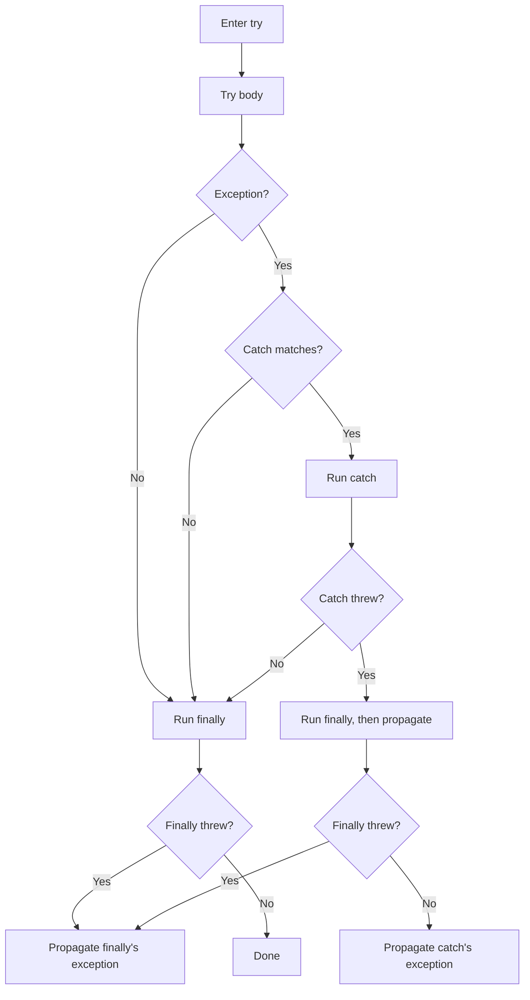
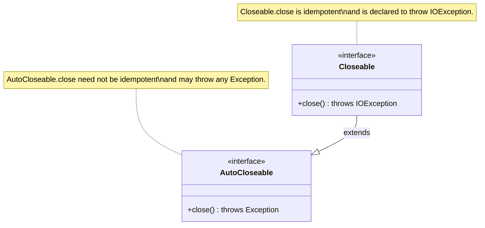

# 05.2. Try Catch Finally and Try With Resources

## Overview

Exception handling in Java is implemented syntactically with the `try`, `catch`, and `finally` blocks, and at the language level with the `throws` clause and the `throw` statement. Java 7 introduced the try-with-resources construct, which dramatically simplifies the safe management of resources that must be closed. This note is the practitioner's guide to all of these constructs: their syntax, their semantics, the bytecode the compiler emits, the corner cases that bite production code, and the patterns that make codebases robust.

We will cover every form of the try statement, the exact rules for catch clause ordering, the subtle behavior of `finally` when exceptions are thrown from `try` and `catch`, the `AutoCloseable` and `Closeable` interfaces that power try-with-resources, the suppressed-exception mechanism, and the rules for effectively final variables used in try-with-resources.

## Background Knowledge

The try statement has existed since Java 1.0. The original syntax was:

```java
try {
    // body
} catch (SomeException e) {
    // handler
} finally {
    // always runs
}
```

Java 7 added:

- Multi-catch (`catch (A | B e)`).
- Try-with-resources.
- Suppressed exceptions (an internal mechanism to support try-with-resources).

Java 9 relaxed try-with-resources to allow effectively final variables (not just fresh declarations) in the resource list.

The compiler translates try-with-resources into ordinary try/catch/finally with calls to `close()` and `addSuppressed`. Understanding the translation is essential for understanding the runtime behavior.

## The Basic Try Catch Form

```java
public double divide(int a, int b) {
    try {
        return (double) a / b;
    } catch (ArithmeticException e) {
        // Division by zero in integer arithmetic throws ArithmeticException.
        // Floating-point division would instead return Infinity.
        System.err.println("Division by zero: " + e.getMessage());
        return Double.NaN;
    }
}
```

The flow is straightforward:

1. The body executes.
2. If no exception is thrown, control passes the catch block and continues.
3. If an exception is thrown whose type matches the catch clause, the catch block runs and control continues after the catch.
4. If an exception is thrown whose type does not match, it propagates up the call stack.

### Catch Clause Type Matching

A catch clause matches if the thrown exception's type is the same as, or a subtype of, the declared type. So `catch (IOException e)` matches `IOException`, `FileNotFoundException`, `EOFException`, and any other subclass.

This is why you must order catch clauses from most specific to most general. The compiler enforces this:

```java
try {
    risky();
} catch (FileNotFoundException e) {
    // most specific
} catch (IOException e) {
    // broader
} catch (Exception e) {
    // broadest
}
```

If you reverse the order, the broader clauses make the narrower ones unreachable, which is a compile error.

## Multi Catch (Java 7)

```java
try {
    riskyOperation();
} catch (IOException | SQLException e) {
    // The variable e is implicitly final.
    // Its static type is the closest common supertype of the alternatives.
    log.error("I/O or SQL failure", e);
}
```

Rules:

- The alternatives must be disjoint. You cannot list `IOException | FileNotFoundException` because `FileNotFoundException` is already covered by `IOException`.
- The variable is implicitly final.
- The static type is the most specific common supertype of the listed types, computed by the compiler.

The bytecode is identical to writing two catch clauses with the same body. It is purely a syntax convenience.

## The Finally Block

`finally` runs whether or not the try body threw, whether or not a catch matched, and even if a catch block itself threw a new exception. It also runs if the try body uses `return`, `break`, or `continue` to leave the block.



### The Finally Swallowing Problem

If `finally` itself throws, it discards any exception that was propagating from the try or catch block:

```java
public int dangerous() {
    try {
        throw new RuntimeException("real error");
    } finally {
        throw new IllegalStateException("cleanup error");
        // The caller sees IllegalStateException, not RuntimeException.
        // The original error is lost forever.
    }
}
```

This is one of the most pernicious bugs in pre-Java 7 code. It is the primary motivation for try-with-resources.

### Returning From Finally

```java
public int sneaky() {
    try {
        throw new RuntimeException("real error");
    } finally {
        return 42; // swallows the RuntimeException entirely
    }
}
```

A `return` in `finally` discards any pending exception and returns the value to the caller. This is so error-prone that the Java compiler does not warn about it, but every static analyzer does. Never return from `finally`.

## Try With Resources

Try-with-resources is the modern replacement for the manual try/finally pattern with `close()`. It requires resources to implement `java.lang.AutoCloseable` (or the older `java.io.Closeable`).

### The Syntax

```java
try (BufferedReader br = new BufferedReader(new FileReader("file.txt"))) {
    return br.readLine();
} catch (IOException e) {
    log.error("read failed", e);
    return null;
}
```

The variable `br` is scoped to the try block. At the end of the block, regardless of how it ends (normal return, exception, or normal completion), the compiler calls `br.close()` for you.

### Multiple Resources

```java
try (FileInputStream fis = new FileInputStream("in.bin");
     FileOutputStream fos = new FileOutputStream("out.bin")) {
    int b;
    while ((b = fis.read()) != -1) {
        fos.write(b);
    }
}
```

Multiple resources are declared semicolon-separated. They are closed in reverse order of declaration: `fos` is closed first, then `fis`. Reverse order matters when later resources depend on earlier ones (e.g., a writer wrapping a stream).

### Effectively Final Variables (Java 9)

Java 9 relaxed the syntax: you can use an effectively final variable that was declared outside the try.

```java
BufferedReader br = Files.newBufferedReader(Path.of("file.txt"));
try (br) {
    return br.readLine();
}
```

The variable must be effectively final (not reassigned after initialization). If it is `null`, no `close()` call is attempted (the compiler emits a null check).

### AutoCloseable vs Closeable



`AutoCloseable` was introduced in Java 7 specifically for try-with-resources. `Closeable` predates it (Java 5) and is the parent of all classic I/O streams.

Differences:

- `Closeable.close()` is declared to throw `IOException`. `AutoCloseable.close()` is declared to throw `Exception` (so implementers may throw anything, including nothing).
- The contract of `Closeable.close()` requires idempotency: calling it twice is safe. The contract of `AutoCloseable.close()` does not require idempotency; some implementations are not idempotent.

When implementing your own resource, prefer extending `AutoCloseable` and document whether `close()` is idempotent.

## What the Compiler Generates

The Java compiler translates try-with-resources into ordinary try/catch/finally with explicit `addSuppressed` calls. For a single resource, the equivalent code is roughly:

```java
// Source:
try (Resource r = new Resource()) {
    r.work();
}

// Equivalent generated code (simplified):
Resource r = new Resource();
Throwable primary = null;
try {
    r.work();
} catch (Throwable t) {
    primary = t;
    throw t;
} finally {
    if (r != null) {
        if (primary != null) {
            try {
                r.close();
            } catch (Throwable closeEx) {
                primary.addSuppressed(closeEx);
            }
        } else {
            r.close();
        }
    }
}
```

For two resources, the compiler nests the same pattern twice, ensuring that the second resource is closed even if closing the first one throws, and that all close-time exceptions are attached to the primary as suppressed.

You can observe this generated code by running `javap -c -p` on a compiled class. The bytecode is verbose but deterministic.

## Suppressed Exceptions in Practice

```java
public class BuggyResource implements AutoCloseable {
    @Override
    public void close() {
        throw new IllegalStateException("close() failed");
    }

    public void work() {
        throw new RuntimeException("work() failed");
    }
}

public class Demo {
    public static void main(String[] args) {
        try (BuggyResource r = new BuggyResource()) {
            r.work();
        } catch (Exception e) {
            System.out.println("Primary: " + e);
            for (Throwable s : e.getSuppressed()) {
                System.out.println("Suppressed: " + s);
            }
        }
    }
}
```

Output:

```
Primary: java.lang.RuntimeException: work() failed
Suppressed: java.lang.IllegalStateException: close() failed
```

The primary exception is the one thrown from the body. The close-time exception is attached to it. This preserves the original error while not losing the cleanup failure.

## The Throws Clause

A method declares the checked exceptions it might throw using `throws`:

```java
public void copy(Path src, Path dst) throws IOException {
    Files.copy(src, dst);
}
```

You can list multiple exceptions comma-separated. The compiler verifies that every checked exception thrown from the body is either caught inside the method or declared in the `throws` clause. Failure to do so is a compile error:

```
error: unreported exception IOException; must be caught or declared to be thrown
```

The `throws` clause is part of the method's signature for the purposes of overriding (a subtype can declare fewer checked exceptions) but is not part of the JVM-level method descriptor. It is stored in the class file as a `Exceptions` attribute that the compiler consults during compilation.

## The Throw Statement

The `throw` statement raises an exception:

```java
if (input == null) {
    throw new IllegalArgumentException("input must not be null");
}
```

The operand must be a reference to a `Throwable`. The JVM then begins the unwinding process described in 05.1.

You can rethrow an exception you have caught:

```java
try {
    risky();
} catch (IOException e) {
    log.error("failed", e);
    throw e; // rethrows the original IOException
}
```

Java 7 added "more precise rethrow": the compiler tracks the actual types that can reach a `catch (Exception e)` block based on static analysis of the try body. If the try body can only throw `IOException` and `SQLException`, then `throw e` in a `catch (Exception e)` block is treated as throwing exactly those two types, not the broad `Exception`.

## Nested Try and Re-throw Patterns

### Pattern: Cleanup With Re-throw

```java
public void process(Path file) throws IOException {
    try (InputStream in = Files.newInputStream(file)) {
        // do work that may throw IOException
    }
    // No catch needed; the resource is closed and the exception propagates.
}
```

### Pattern: Translate and Re-throw

```java
public void process(Path file) throws ProcessingException {
    try (InputStream in = Files.newInputStream(file)) {
        doWork(in);
    } catch (IOException e) {
        throw new ProcessingException("Failed to process " + file, e);
    }
}
```

### Pattern: Conditional Recovery

```java
public User loadUser(long id) {
    try {
        return userDao.find(id);
    } catch (UserNotFoundException e) {
        // Specific recovery: create a default user.
        return User.DEFAULT;
    } catch (DataAccessException e) {
        // Broad recovery: log and rethrow.
        log.error("DB error loading user " + id, e);
        throw e;
    }
}
```

## Try With Resources With Catch

The full form combines a resource list, a body, catch clauses, and a finally:

```java
public String readConfig(Path path, String defaultValue) {
    try (BufferedReader br = Files.newBufferedReader(path)) {
        return br.readLine();
    } catch (IOException e) {
        log.warn("Could not read config, using default", e);
        return defaultValue;
    } finally {
        log.debug("config load attempted for {}", path);
    }
}
```

Execution order:

1. Resources are initialized in declaration order.
2. Body runs.
3. Resources are closed in reverse declaration order.
4. If the body threw, the catch is consulted.
5. Finally runs.

If close() throws and the body did not, the close-time exception is thrown to the caller (no primary to attach to). If close() throws and the body did too, the close-time exception is suppressed.

## Custom AutoCloseable Without Try With Resources

You can implement `AutoCloseable` for any class that owns a resource, even if you do not always use try-with-resources:

```java
public class DatabaseTransaction implements AutoCloseable {
    private final Connection conn;
    private boolean committed = false;

    public DatabaseTransaction(Connection conn) {
        this.conn = conn;
    }

    public void commit() {
        conn.commit();
        committed = true;
    }

    @Override
    public void close() {
        if (!committed) {
            try {
                conn.rollback();
            } catch (SQLException e) {
                // Log and rethrow as unchecked, or addSuppressed
                throw new RuntimeException("rollback failed", e);
            }
        }
    }
}

// Usage:
try (DatabaseTransaction tx = new DatabaseTransaction(conn)) {
    doWork(tx);
    tx.commit();
} // close() runs, rolls back if not committed
```

This is the foundation of patterns like Spring's `TransactionTemplate` and JPA's `EntityManager` lifecycle.

## Try With Resources Across Method Boundaries

A common confusion is what happens when a method returns from inside a try-with-resources block. The compiler still calls `close()` on the resource before the method actually returns to the caller, even though the `return` statement appears to be the last thing the method does. The runtime order is:

1. The `return` expression is evaluated.
2. The result is captured in a temporary.
3. Resources are closed in reverse order.
4. Any close-time exceptions are suppressed (or become the primary if the body did not throw).
5. The captured value is returned to the caller.

```java
public String readFirstLine(Path path) throws IOException {
    try (BufferedReader br = Files.newBufferedReader(path)) {
        // Even though this return is the last statement, the resource
        // is closed before the method actually returns to the caller.
        return br.readLine();
    }
}
```

This matters for two reasons. First, if `close()` throws, the caller sees that exception, not a half-read line. Second, the value returned is the value computed before the resource was closed, so you cannot accidentally return a closed stream's data.

### Side Effects in Return Expressions

Avoid putting side effects in the `return` expression inside a try-with-resources. The captured value is what gets returned, but if the side effect interacts with the resource (for example, reading another line), the order of operations becomes confusing:

```java
public String risky(Path path) throws IOException {
    try (BufferedReader br = Files.newBufferedReader(path)) {
        return consume(br); // consume reads and returns; br is closed after
    }
}

private String consume(BufferedReader br) throws IOException {
    return br.readLine();
}
```

This works, but if `consume` instead returned a `Stream<String>` from `br.lines()`, that stream would be unusable because the reader would be closed by the time the caller iterates it. This is the well-known "stream from try-with-resources" trap.

## The Cost of Try With Resources

Try-with-resources itself is essentially free. The compiler emits a small amount of bytecode (a null check and a `close()` call), which the JIT inlines aggressively. The real cost is in the `close()` method itself, which for I/O resources typically involves a system call.

There is no performance reason to avoid try-with-resources. Use it everywhere a resource implements `AutoCloseable`.

## Comparison Table: Old vs New Resource Management

| Aspect | Try/Finally Manual | Try With Resources |
|---|---|---|
| Boilerplate | High | Low |
| Risk of forgetting close | High | None (compiler enforced) |
| Risk of swallowing primary | High if finally throws | None (suppressed exceptions) |
| Reverse-order closing | Manual | Automatic |
| Null safety | Manual | Automatic |
| Readability | Poor | Good |
| Java version | All | 7+ (9+ for effectively final) |

## Try With Resources and Generics

A subtle interaction with generics: if you have a `Supplier<? extends AutoCloseable>`, you can still use try-with-resources, but you must be careful with the type:

```java
public <T extends AutoCloseable> void use(Supplier<T> supplier) throws Exception {
    try (T resource = supplier.get()) {
        // T must extend AutoCloseable for the compiler to allow this.
        // The close() method throws Exception because that is the
        // declaration on AutoCloseable itself.
    }
}
```

Because `AutoCloseable.close()` is declared to throw `Exception`, any method using try-with-resources with a generic `T extends AutoCloseable` must declare `throws Exception` unless it catches the exception inside.

## Try With Resources With Virtual Threads (Java 21)

Java 21's virtual threads make try-with-resources more important than ever. Pinning a virtual thread inside a synchronized block during a blocking I/O call defeats the purpose of virtual threads. Using `ReentrantLock` instead of `synchronized` and managing it with try-with-resources is the recommended pattern:

```java
private final ReentrantLock lock = new ReentrantLock();

public void withLock(Runnable body) {
    // ReentrantLock does not implement AutoCloseable in the JDK, but you
    // can wrap it.
    try (var ignored = lock.asScopedLock()) { // hypothetical helper
        body.run();
    }
}

// Real helper:
public static final class LockScope implements AutoCloseable {
    private final ReentrantLock lock;
    private LockScope(ReentrantLock lock) { this.lock = lock; lock.lock(); }
    @Override public void close() { lock.unlock(); }
    public static LockScope of(ReentrantLock lock) { return new LockScope(lock); }
}

// Usage:
try (var ignored = LockScope.of(lock)) {
    // critical section
}
```

This pattern keeps virtual threads unpinned and the critical section exception-safe.

## Common Pitfalls

### Pitfall 1: Closing the Wrapper but Not the Underlying Resource

```java
try (BufferedReader br = new BufferedReader(
         new FileReader("file.txt"))) {
    // If the BufferedReader constructor fails after the FileReader
    // has been constructed, the FileReader is leaked.
}
```

The fix is to declare each resource separately:

```java
try (FileReader fr = new FileReader("file.txt");
     BufferedReader br = new BufferedReader(fr)) {
    // Now if BufferedReader construction throws, fr is still closed.
}
```

### Pitfall 2: Returning From Finally

```java
try {
    throw new RuntimeException("real");
} finally {
    return 42; // swallows the exception!
}
```

Never `return` from `finally`. The compiler allows it; static analyzers scream.

### Pitfall 3: Throwing From Finally

```java
try {
    risky();
} finally {
    closeQuietly(); // if this throws, the original exception is lost
}
```

Use try-with-resources. If you must do it manually, use a `try/catch` inside the `finally` and `addSuppressed`.

### Pitfall 4: Catching Exception When You Mean a Specific One

```java
try {
    risky();
} catch (Exception e) {
    // Catches NullPointerException, IllegalArgumentException,
    // ArrayIndexOutOfBoundsException, etc., not just your intended
    // IOException.
}
```

Always catch the most specific exception type you can.

### Pitfall 5: Forgetting That Finally Runs on Return

```java
public int find() {
    try {
        return locate();
    } finally {
        // This runs before the return value is actually returned to the
        // caller. If it modifies mutable state used by locate(), you
        // can get very surprising behavior.
        cleanup();
    }
}
```

### Pitfall 6: Ignoring InterruptedException

```java
try {
    Thread.sleep(1000);
} catch (InterruptedException e) {
    // swallowing this without restoring the interrupt flag is a bug
}
```

The correct pattern is:

```java
try {
    Thread.sleep(1000);
} catch (InterruptedException e) {
    Thread.currentThread().interrupt();
    return; // or throw a runtime exception
}
```

### Pitfall 7: Closing in a Loop

```java
for (Path p : paths) {
    BufferedReader br = Files.newBufferedReader(p);
    // ... use br ...
    // forgot to close: leaks a file handle per iteration
}
```

Use try-with-resources inside the loop:

```java
for (Path p : paths) {
    try (BufferedReader br = Files.newBufferedReader(p)) {
        // ... use br ...
    }
}
```

### Pitfall 8: Catching Throwable

```java
try {
    risky();
} catch (Throwable t) {
    // Includes OutOfMemoryError. Almost always wrong.
}
```

Catch only what you can meaningfully handle.

## Tips and Tricks

### Tip 1: Always Use Try With Resources for AutoCloseable

If a class implements `AutoCloseable`, instantiate it inside try-with-resources. There is no good reason to call `close()` manually in 2024.

### Tip 2: Use Separate Resource Declarations for Wrapping Resources

```java
try (FileInputStream fis = new FileInputStream(in);
     BufferedInputStream bis = new BufferedInputStream(fis)) {
    // ...
}
```

This ensures that if the wrapper constructor throws, the underlying stream is still closed.

### Tip 3: Use Effectively Final for Reused Resources

If a resource is created conditionally, you can declare it as a local variable and use it in try-with-resources in Java 9+:

```java
Connection conn = dataSource.getConnection();
try (conn) {
    // ...
}
```

### Tip 4: Implement AutoCloseable for Any Class That Owns a Resource

Locks, transactions, file handles, sockets: wrap them in an `AutoCloseable` and your callers can use try-with-resources.

### Tip 5: Make Your close() Idempotent

```java
public class MyResource implements AutoCloseable {
    private boolean closed = false;

    @Override
    public void close() {
        if (closed) return;
        closed = true;
        // do the actual cleanup
    }
}
```

This protects callers who call `close()` defensively.

### Tip 6: Use UncheckedIOException for Wrapping IO Exceptions in Streams

When a stream operation needs to throw an `IOException`, wrap it:

```java
files.stream().map(path -> {
    try { return Files.readString(path); }
    catch (IOException e) { throw new UncheckedIOException(e); }
}).toList();
```

`UncheckedIOException` is the standard JDK way to wrap an `IOException` as an unchecked exception.

### Tip 7: Try With Resources With No Catch and No Finally Is Valid

```java
try (Resource r = new Resource()) {
    r.work();
}
```

You can have try-with-resources without any catch or finally clauses. The compiler still emits the close calls.

### Tip 8: Suppressed Exceptions Survive Wrapping

If you wrap an exception with a cause, suppressed exceptions are not transferred automatically. They stay on the original exception. To preserve them, copy them:

```java
Throwable t = ...;
Throwable wrapped = new MyException("wrapped", t);
for (Throwable s : t.getSuppressed()) {
    wrapped.addSuppressed(s);
}
```

## Interview Questions

### Q1: What is the difference between `final`, `finally`, and `finalize`?

`final` is a modifier that makes variables immutable, methods non-overridable, and classes non-extendable. `finally` is a block that runs after a try/catch, regardless of outcome. `finalize` is a method on `Object` invoked by the GC before reclaiming an object; it has been deprecated since Java 9 and is disabled by default in Java 18+.

### Q2: Does `finally` always execute?

Yes, except in three cases: the JVM exits (e.g., `System.exit`) before the try block completes; the thread is killed; or the JVM crashes. If the try body executes `return`, `finally` runs before the value is returned to the caller.

### Q3: What happens if `finally` throws an exception?

The original exception (if any) is discarded and the new exception propagates. This is why throwing from `finally` is a bug. Try-with-resources solves this by attaching close-time exceptions as suppressed.

### Q4: What is the difference between `Closeable` and `AutoCloseable`?

`Closeable` is from Java 5 and is the parent of I/O streams; its `close()` throws `IOException` and is required to be idempotent. `AutoCloseable` is from Java 7 and is the parent used by try-with-resources; its `close()` throws `Exception` and is not required to be idempotent.

### Q5: How does try-with-resources handle exceptions thrown from `close()`?

If the try body did not throw, the close-time exception propagates directly. If the try body did throw, the close-time exception is attached to the primary exception via `addSuppressed` and the primary propagates.

### Q6: Can you use try-with-resources with a variable declared outside the try?

Yes, since Java 9, as long as the variable is effectively final (not reassigned). The compiler emits a null check before calling `close()`.

### Q7: In what order are multiple resources closed?

In reverse order of declaration. If you declare `try (A a = ...; B b = ...)`, then `b.close()` is called before `a.close()`.

### Q8: What is "more precise rethrow"?

Java 7's compiler performs static analysis on the try body to determine the actual exception types that can reach a catch block. When you rethrow the caught exception, the compiler uses the more precise types rather than the declared type of the catch parameter.

### Q9: What is `Throwable.addSuppressed`?

A method added in Java 7 that attaches an exception to the suppressed list of another exception. It exists primarily to support try-with-resources, but you can call it yourself in custom resource management code.

### Q10: What is the bytecode that try-with-resources compiles to?

A try/catch/finally structure that calls `close()` on each resource in reverse declaration order, attaches close-time exceptions as suppressed if there is a primary, and handles null resources with a null check.

### Q11: Is `finally` block required when using try-with-resources?

No. Try-with-resources can be used without any catch or finally clause. The compiler still emits the close calls.

### Q12: Can a catch block rethrow the same exception with a different type?

You cannot literally change the type of an existing exception object, but you can create a new exception of a different type and throw it, passing the original as the cause. This is exception translation.

### Q13: What happens if `System.exit` is called inside a try block?

The JVM exits immediately. `finally` does not run. Resource `close()` methods do not run. This is one of the few ways to bypass cleanup.

### Q14: How do you handle `InterruptedException` correctly?

Catch it, restore the interrupt status with `Thread.currentThread().interrupt()`, and either return or throw an appropriate exception. Swallowing `InterruptedException` without restoring the interrupt flag breaks cooperative cancellation.

### Q15: What is the rule for catch clause ordering?

Catch clauses are examined top to bottom; the first matching one wins. Therefore, more specific exception types must come before more general ones, or the compiler will report unreachable code.

## Summary

The try statement in Java has three forms: try/catch, try/finally, and try/catch/finally, with the modern try-with-resources extending all of them. The `finally` block runs in almost every scenario but is dangerous to use for cleanup because throwing or returning from it discards the original exception. Try-with-resources, introduced in Java 7 and extended in Java 9, eliminates this class of bug by emitting safe, deterministic close calls with suppressed-exception handling. Implement `AutoCloseable` for any class that owns a resource, document whether `close()` is idempotent, and prefer try-with-resources over manual cleanup in all new code. The next note, 05.3, covers how to design your own exception types and the best practices that make exception hierarchies maintainable.
