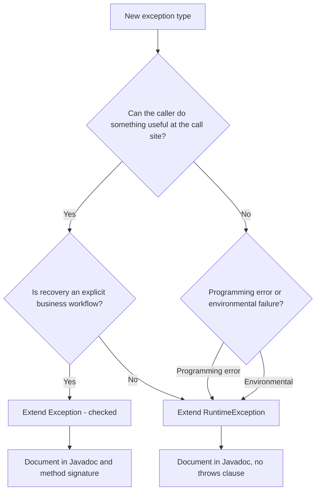
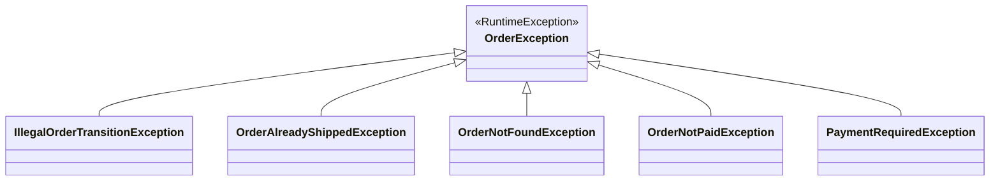
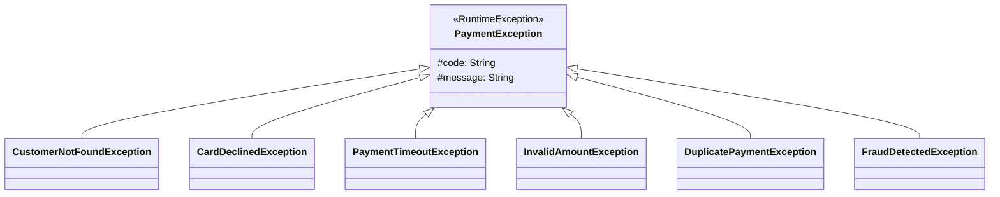

# 05.3. Custom Exceptions and Best Practices

## Overview

The Java Development Kit ships with dozens of exception classes covering the most common failure modes, but every non-trivial codebase eventually needs domain-specific exceptions: `UserNotFoundException`, `PaymentDeclinedException`, `OrderAlreadyShippedException`. Designing these exceptions well is one of the most underestimated skills in Java engineering. A well-designed exception hierarchy makes failure handling expressive and type-safe. A poorly designed one becomes a swamp of `catch (Exception e)` clauses that hide bugs.

This note covers how to write custom exceptions, how to choose between checked and unchecked, how to design exception hierarchies for a domain, how to carry context, how to write good error messages, how to integrate with logging and observability, and how to avoid the anti-patterns that have given Java exceptions a mixed reputation.

## Background Knowledge

Before writing your own exceptions, recall the rule from 05.1: a checked exception is any subclass of `Throwable` (other than `RuntimeException` and `Error`) that the compiler forces callers to handle. An unchecked exception is any subclass of `RuntimeException` or `Error`. The decision of which to extend is the single most important design choice you make when introducing a new exception type.

You also need to recall that `Throwable` has two pieces of mutable state: the detail `message` and the `cause`. Both should be set through the constructor and never modified afterward.

## Anatomy of a Custom Exception

```java
package com.example.orders;

/**
 * Thrown when an order cannot be transitioned to the requested status
 * because the current status does not permit the transition.
 */
public class IllegalOrderTransitionException extends RuntimeException {

    private static final long serialVersionUID = 1L;

    private final long orderId;
    private final OrderStatus from;
    private final OrderStatus to;

    public IllegalOrderTransitionException(long orderId, OrderStatus from, OrderStatus to) {
        super(String.format(
            "Cannot transition order %d from %s to %s",
            orderId, from, to));
        this.orderId = orderId;
        this.from = from;
        this.to = to;
    }

    public IllegalOrderTransitionException(long orderId, OrderStatus from, OrderStatus to,
                                           Throwable cause) {
        super(String.format(
            "Cannot transition order %d from %s to %s",
            orderId, from, to), cause);
        this.orderId = orderId;
        this.from = from;
        this.to = to;
    }

    public long orderId() { return orderId; }
    public OrderStatus from() { return from; }
    public OrderStatus to() { return to; }
}
```

This single example illustrates most of the best practices:

1. **Name ends with `Exception`**. Always. No exceptions.
2. **Extends `RuntimeException`** (here, because callers usually cannot recover at the call site; the order state is corrupted).
3. **Has a `serialVersionUID`**. Even if you never serialize, the IDE will warn you, and someone might.
4. **The detail message is built from the constructor arguments**. The caller does not need to provide a message; the exception knows how to describe itself.
5. **Extra context fields** (`orderId`, `from`, `to`) let callers handle the exception programmatically without parsing the message.
6. **Two constructors**: one without a cause, one with a cause. The cause-aware version is essential when wrapping lower-level failures.
7. **Javadoc explains when the exception is thrown**. This is part of the API contract.

## Checked or Unchecked: A Decision Framework



The acid test is: "If I throw this exception, can the caller write a meaningful recovery path?" If the answer is yes, and the recovery is part of the API contract, make it checked. If the answer is "well, they could log and retry, or they could propagate, or they could ignore it," make it unchecked. The benefit of forcing callers to write `catch` blocks evaporates when most of them just swallow the exception.

### When Checked Is Appropriate

- A file-not-found situation where the caller can prompt the user for a different file.
- A network timeout where the caller can retry with backoff.
- A "user not authenticated" condition where the caller can redirect to a login page.
- A "rate limited" condition where the caller can wait and retry.

### When Unchecked Is Appropriate

- Programming errors: `NullPointerException`, `IllegalArgumentException`, `IllegalStateException`.
- Environmental failures that almost no caller can recover from at the call site: database connection lost, disk full.
- Framework-level failures where the recovery is "fail the request, log, alert": most web framework exceptions are unchecked.
- Violations of invariants in domain objects: `OrderAlreadyShippedException`.

### The Framework Convention

Most modern Java frameworks have standardized on unchecked exceptions. Spring, Jakarta EE (formerly Java EE), Quarkus, Micronaut, and JPA all use unchecked exceptions exclusively. The reason is that framework-level failures cross architectural boundaries (controller to service to repository to driver), and forcing checked exceptions through every layer creates massive `throws` clauses that almost no caller actually acts on.

If you are writing code that participates in one of these frameworks, prefer unchecked exceptions for consistency.

## Designing an Exception Hierarchy

A domain typically has multiple exception types. Group them under a common root so callers can catch the whole family when appropriate:



```java
public abstract class OrderException extends RuntimeException {
    private final long orderId;
    protected OrderException(long orderId, String message) {
        super(message);
        this.orderId = orderId;
    }
    protected OrderException(long orderId, String message, Throwable cause) {
        super(message, cause);
        this.orderId = orderId;
    }
    public long orderId() { return orderId; }
}

public class OrderNotFoundException extends OrderException {
    public OrderNotFoundException(long orderId) {
        super(orderId, "Order " + orderId + " not found");
    }
}

public class OrderAlreadyShippedException extends OrderException {
    public OrderAlreadyShippedException(long orderId) {
        super(orderId, "Order " + orderId + " has already been shipped");
    }
}
```

The root `OrderException` is abstract to prevent callers from using it as a catch-all (which would be the moral equivalent of `catch (Exception e)`). Concrete subclasses carry the specific failure.

### Granularity Trade-off

A hierarchy can be too coarse (one `OrderException` for everything, with a code field) or too fine (a separate class for every error). The right balance:

- A separate class for each distinct recovery strategy. If callers handle "not found" and "already shipped" identically, you might collapse them.
- A common root for catch-all handling at framework boundaries.
- Avoid using a `code` or `errorCode` field as a substitute for type. Type lets the compiler and IDE help you; a code field does not.

## Carrying Context

Exception messages are for humans. Context fields are for code. A common mistake is to embed everything in the message and force callers to parse it back out:

```java
// Bad: caller must parse the message to recover the order ID.
public class BadOrderException extends RuntimeException {
    public BadOrderException(long orderId, String reason) {
        super("Order " + orderId + ": " + reason);
    }
}

// Good: caller reads the orderId() accessor.
public class GoodOrderException extends RuntimeException {
    private final long orderId;
    public GoodOrderException(long orderId, String reason) {
        super("Order " + orderId + ": " + reason);
        this.orderId = orderId;
    }
    public long orderId() { return orderId; }
}
```

Even better, attach a structured context object:

```java
public class OrderContext {
    private final long orderId;
    private final long customerId;
    private final Instant orderTime;
    // getters
}

public class OrderException extends RuntimeException {
    private final OrderContext context;
    // ...
}
```

This is particularly valuable when your observability tooling (Sentry, Datadog, Honeycomb) can extract structured fields and display them in the exception view.

## Writing Good Error Messages

A good exception message answers four questions:

1. What went wrong?
2. What was the system doing when it went wrong?
3. What values caused the problem?
4. What (if anything) should the user or operator do?

```java
// Bad: opaque, no context.
throw new IllegalArgumentException("invalid");

// Better: states what is invalid.
throw new IllegalArgumentException("email is invalid");

// Best: states what is invalid, shows the offending value, suggests the fix.
throw new IllegalArgumentException(
    "Email '" + email + "' is invalid: must contain exactly one @. " +
    "Did you forget the domain?");
```

Avoid including sensitive data (passwords, tokens, PII) in exception messages, because messages end up in logs that may be visible to operators, search indexes, and external monitoring tools.

## Exception Translation and Wrapping

When a low-level exception bubbles up across an architectural boundary, translate it into a domain exception. Always preserve the cause:

```java
public class UserRepository {
    public User findById(long id) throws UserNotFoundException {
        try {
            return jdbcTemplate.queryForObject(SQL, mapper, id);
        } catch (DataAccessException e) {
            // Translate the Spring DataAccessException into a domain exception.
            // The cause is preserved so the original stack trace is available.
            throw new UserNotFoundException(id, e);
        }
    }
}

public class UserNotFoundException extends RuntimeException {
    public UserNotFoundException(long id, Throwable cause) {
        super("User " + id + " not found", cause);
    }
}
```

### Translation at Framework Boundaries

A common pattern is to translate at a single boundary (the repository or service entry point) and let the exception propagate unchecked through the rest of the call stack. This concentrates the translation logic in one place.

### Translation in Controllers

Web frameworks typically catch exceptions thrown from controllers and translate them into HTTP responses. Spring's `@ExceptionHandler` is the canonical mechanism:

```java
@RestControllerAdvice
public class OrderExceptionHandler {

    @ExceptionHandler(OrderNotFoundException.class)
    public ResponseEntity<ErrorResponse> handleNotFound(OrderNotFoundException e) {
        return ResponseEntity.status(404)
            .body(new ErrorResponse("ORDER-NOT-FOUND", e.getMessage(), e.orderId()));
    }

    @ExceptionHandler(OrderException.class)
    public ResponseEntity<ErrorResponse> handleOrder(OrderException e) {
        return ResponseEntity.status(400)
            .body(new ErrorResponse("ORDER-ERROR", e.getMessage(), e.orderId()));
    }
}
```

## Best Practices

### Practice 1: Throw Early, Catch Late

Throw as soon as you detect an invalid state. Catch at the highest layer where you can present a meaningful response to the user or operator. Between those two points, let the exception propagate.

### Practice 2: Fail Fast on Invalid Arguments

Use `Objects.requireNonNull` and `IllegalArgumentException` at the top of every public method to validate arguments:

```java
public User createUser(String email, String name) {
    Objects.requireNonNull(email, "email");
    Objects.requireNonNull(name, "name");
    if (!email.contains("@")) {
        throw new IllegalArgumentException("invalid email: " + email);
    }
    // ...
}
```

Java 21's pattern matching for switch and records makes this even cleaner:

```java
public record Email(String value) {
    public Email {
        Objects.requireNonNull(value);
        if (!value.contains("@")) {
            throw new IllegalArgumentException("invalid email: " + value);
        }
    }
}
```

### Practice 3: Use Specific Catch Clauses

Catch the most specific exception type that you can meaningfully handle. Catching `Exception` or `Throwable` is almost always wrong.

### Practice 4: Preserve the Cause When Wrapping

```java
catch (SQLException e) {
    throw new UserServiceException("query failed", e); // preserve cause
}
```

Never lose the cause. Without it, the production debugging session becomes archaeology.

### Practice 5: Log Once, at the Boundary

Log the exception once at the architectural boundary (typically the controller or service entry point). Do not log at every catch site; you will produce duplicate log entries for the same failure.

### Practice 6: Document Throws in Javadoc

Even for unchecked exceptions, Javadoc your `throws`:

```java
/**
 * Loads the user with the given ID.
 *
 * @param id the user ID, must be positive
 * @return the user
 * @throws UserNotFoundException if no user exists with the given ID
 * @throws IllegalArgumentException if id is not positive
 */
public User load(long id) { ... }
```

The `@throws` tag is part of the API contract even for unchecked exceptions. IDEs surface it in tooltips and call-site completion.

### Practice 7: Do Not Throw in Constructors If You Can Avoid It

If a constructor throws, the object is partially constructed and the caller should not retain a reference to it. This is rarely a problem in practice, but be careful with constructors that allocate resources and then perform operations that might throw.

### Practice 8: Make Your Exception Serializable (Or Not)

If your exception might cross a remoting boundary (RMI, EJB, serialized session state), it must be `Serializable` and all its fields must be `Serializable`. In modern systems that use JSON or Protobuf for remoting, this is rarely needed, and you can mark fields as `transient` if they are not serializable.

### Practice 9: Use Standard Exceptions When They Fit

The JDK has a rich set of standard exceptions. Prefer them over inventing your own:

- `IllegalArgumentException` for invalid arguments.
- `IllegalStateException` for invalid state.
- `NullPointerException` for null arguments (or use `Objects.requireNonNull`).
- `UnsupportedOperationException` for unsupported operations.
- `NoSuchElementException` for missing elements in iteration.

Only invent a new exception type when the failure is domain-meaningful and the standard exceptions do not communicate it well.

### Practice 10: Do Not Use Exceptions for Control Flow

```java
// Bad: using exception for normal flow control.
try {
    while (true) {
        process(queue.remove());
    }
} catch (NoSuchElementException e) {
    // Queue empty, done.
}

// Good: explicit check.
while (!queue.isEmpty()) {
    process(queue.remove());
}
```

Exceptions are expensive to construct (stack trace capture) and obscure intent.

### Practice 11: Use Try With Resources for Cleanup

See 05.2. Never manually call `close()` in a finally block.

### Practice 12: Add an Error Code for Stable APIs

If your exception is part of a public API consumed by external clients, add a stable error code so clients can branch on it without parsing the message:

```java
public class OrderException extends RuntimeException {
    private final String code;
    private final long orderId;

    protected OrderException(String code, long orderId, String message) {
        super(message);
        this.code = code;
        this.orderId = orderId;
    }

    public String code() { return code; }
    public long orderId() { return orderId; }
}

public class OrderNotFoundException extends OrderException {
    public OrderNotFoundException(long orderId) {
        super("ORDER-NOT-FOUND", orderId, "Order " + orderId + " not found");
    }
}
```

The code is part of your API contract. Once you publish it, never change it.

## Deep Dive: Designing an Exception Hierarchy for a Real-World Domain

To make the best practices concrete, let us design an exception hierarchy for a payments service. The service has these failure modes:

1. The customer cannot be found (caller can retry with corrected ID).
2. The card is declined (caller can prompt for a new card).
3. The payment processor times out (caller can retry with backoff).
4. The amount is invalid (programming error, caller cannot recover).
5. The payment is duplicated (caller can return the existing payment).
6. The fraud check failed (caller cannot recover, alert operations).



We choose unchecked exceptions throughout because:
- The service is consumed by an HTTP controller that translates everything to responses.
- All recovery paths are business workflows (retry, prompt), not low-level handling.
- Checked exceptions would force every intermediate layer to declare `throws PaymentException`, adding noise without value.

```java
public abstract class PaymentException extends RuntimeException {
    private final String code;

    protected PaymentException(String code, String message) {
        super(message);
        this.code = code;
    }

    protected PaymentException(String code, String message, Throwable cause) {
        super(message, cause);
        this.code = code;
    }

    public String code() { return code; }
}

public final class CardDeclinedException extends PaymentException {
    private final String declineReason;

    public CardDeclinedException(String declineReason) {
        super("CARD-DECLINED", "Card declined: " + declineReason);
        this.declineReason = declineReason;
    }

    public String declineReason() { return declineReason; }
}

public final class PaymentTimeoutException extends PaymentException {
    private final String processorId;
    private final Duration elapsed;

    public PaymentTimeoutException(String processorId, Duration elapsed, Throwable cause) {
        super("PAYMENT-TIMEOUT",
              "Payment processor " + processorId + " timed out after " + elapsed,
              cause);
        this.processorId = processorId;
        this.elapsed = elapsed;
    }

    public String processorId() { return processorId; }
    public Duration elapsed() { return elapsed; }
}
```

The controller translates:

```java
@RestControllerAdvice
public class PaymentExceptionHandler {

    @ExceptionHandler(CardDeclinedException.class)
    public ResponseEntity<ErrorResponse> cardDeclined(CardDeclinedException e) {
        return ResponseEntity.status(402)
            .body(new ErrorResponse(e.code(), e.getMessage(),
                Map.of("declineReason", e.declineReason())));
    }

    @ExceptionHandler(PaymentTimeoutException.class)
    public ResponseEntity<ErrorResponse> timeout(PaymentTimeoutException e) {
        return ResponseEntity.status(504)
            .body(new ErrorResponse(e.code(), e.getMessage(),
                Map.of("processorId", e.processorId(),
                       "elapsedMs", e.elapsed().toMillis())));
    }

    @ExceptionHandler(PaymentException.class)
    public ResponseEntity<ErrorResponse> generic(PaymentException e) {
        return ResponseEntity.status(500)
            .body(new ErrorResponse(e.code(), e.getMessage(), Map.of()));
    }
}
```

The hierarchy allows the controller to handle specific failures with rich, structured responses, while a generic catch at the bottom ensures no payment exception escapes unhandled. The cause chain preserves the underlying transport or processor exception, so production debugging has the full stack trace.

This design illustrates every best practice in this note:
- Unchecked for framework consistency.
- Specific subclasses for distinct recovery strategies.
- Common root for boundary catch.
- Structured context fields.
- Stable error codes for API consumers.
- Cause preserved through translation.

## Common Pitfalls

### Pitfall 1: Empty Catch Block

```java
try {
    risky();
} catch (IOException e) {
    // The worst anti-pattern in Java.
}
```

Always log, rethrow, or comment explicitly that you are ignoring the exception.

### Pitfall 2: Catching Exception

```java
catch (Exception e) { ... }
```

Catches `NullPointerException`, `IllegalArgumentException`, and everything else. Almost always a bug.

### Pitfall 3: Catching and Re-Throwing Without the Cause

```java
catch (IOException e) {
    throw new MyException("failed"); // cause lost!
}
```

Always pass the cause.

### Pitfall 4: Using a Single Exception Type for Everything

```java
throw new AppException("user not found");
throw new AppException("invalid email");
throw new AppException("db down");
```

Callers cannot handle these differently. Use distinct types.

### Pitfall 5: Discarding the Stack Trace

```java
catch (IOException e) {
    throw new MyException(e.getMessage()); // stack trace gone
}
```

Use `new MyException(e.getMessage(), e)` or just `new MyException("failed", e)`.

### Pitfall 6: Logging and Rethrowing

```java
catch (IOException e) {
    log.error("failed", e);
    throw e;
}
```

If every layer does this, you get one exception logged N times. Log once at the boundary.

### Pitfall 7: Throwing in a Finally Block

```java
try {
    risky();
} finally {
    close(); // if this throws, original exception is lost
}
```

Use try-with-resources.

### Pitfall 8: Returning From a Finally Block

```java
try {
    throw new RuntimeException();
} finally {
    return 42; // swallows the exception
}
```

Never return from finally.

### Pitfall 9: Using String Concatenation for Messages

```java
throw new IllegalArgumentException("Invalid value: " + value);
```

This is fine for simple cases, but for production code with structured logging, prefer a format string and structured fields:

```java
throw new IllegalArgumentException(
    String.format("Invalid value %s for field %s", value, field));
```

### Pitfall 10: Not Handling InterruptedException Correctly

```java
catch (InterruptedException e) {
    // do nothing - bug! interrupt flag is lost
}
```

Always restore the interrupt flag: `Thread.currentThread().interrupt();`.

### Pitfall 11: Inventing Exceptions That Duplicate JDK Ones

```java
public class MyNullPointerException extends RuntimeException { ... }
```

Just use `NullPointerException`.

### Pitfall 12: Throwing Exceptions From Equals or HashCode

`equals` and `hashCode` are called by hash-based collections during their internal operations. Throwing from them can corrupt collection state. Always return `false` from `equals` when given incompatible types rather than throwing.

## Tips and Tricks

### Tip 1: Use `Objects.requireNonNull` for Null Checks

```java
this.email = Objects.requireNonNull(email, "email");
```

Throws `NullPointerException` with a useful message. Saves you three lines.

### Tip 2: Use AssertJ or Hamcrest for Test Assertions

Test assertion failures throw rich, descriptive exceptions. Use them rather than hand-rolling `if (...) throw new AssertionError(...)`.

### Tip 3: Use `IllegalStateException` for "Wrong Time" Calls

```java
public void remove() {
    if (lastReturned == null) {
        throw new IllegalStateException("next() or previous() not called");
    }
    // ...
}
```

`IllegalStateException` is for state that is invalid right now, even though the method itself is otherwise valid.

### Tip 4: Use `UnsupportedOperationException` for Unimplemented Methods

```java
@Override
public boolean add(E e) {
    throw new UnsupportedOperationException();
}
```

This is what `Collections.unmodifiableList` does internally.

### Tip 5: Consider Using Sealed Exception Hierarchies (Java 17+)

```java
public sealed class OrderException extends RuntimeException
    permits OrderNotFoundException, OrderAlreadyShippedException, IllegalOrderTransitionException {
    // ...
}
```

Sealed hierarchies let you write exhaustive switch expressions over your exception types.

### Tip 6: Use Pattern Matching for Catch (Future)

Java 21 does not yet support pattern matching in catch, but you can simulate it:

```java
catch (OrderException e) {
    return switch (e) {
        case OrderNotFoundException ex -> Response.status(404).build();
        case OrderAlreadyShippedException ex -> Response.status(409).build();
        case IllegalOrderTransitionException ex -> Response.status(400).build();
        default -> Response.status(500).build();
    };
}
```

With a sealed hierarchy, the `default` becomes unreachable.

### Tip 7: Cache the Stack Trace Selectively

For high-throughput exceptions, override `fillInStackTrace`:

```java
public class FastSignalException extends RuntimeException {
    @Override public Throwable fillInStackTrace() { return this; }
}
```

Netty uses this for `EncoderException`. Only do this if profiling proves the stack trace is the bottleneck.

### Tip 8: Use `Thread.UncaughtExceptionHandler` for Top-Level Recovery

```java
Thread.setDefaultUncaughtExceptionHandler((thread, ex) -> {
    log.error("Uncaught exception in thread {}", thread, ex);
    metrics.increment("uncaught.exceptions");
});
```

This is the last line of defense for exceptions that escape `run()`.

### Tip 9: Wrap Standard Exceptions in Domain Exceptions for Public APIs

Your public API should not leak `SQLException` or `IOException`. Wrap them in your domain exceptions.

### Tip 10: Use `Optional` Instead of Throwing for "Not Found" in Some Cases

If "not found" is a normal, expected outcome rather than an exceptional one, return `Optional<T>` instead of throwing. See 06.3.

## Interview Questions

### Q1: When should you write a custom exception?

When the failure is domain-meaningful and the standard exceptions (like `IllegalArgumentException` or `IllegalStateException`) do not communicate it clearly. Custom exceptions also let you attach structured context that callers can use programmatically.

### Q2: How do you decide between checked and unchecked for a custom exception?

If the caller can meaningfully recover at the call site (prompt for credentials, retry, redirect), use checked. If the failure is a programming error, an environmental failure that callers cannot handle, or a domain invariant violation that bubbles to a framework boundary, use unchecked.

### Q3: Why do you need a `serialVersionUID`?

To control version compatibility during deserialization. Without it, the JVM computes one from the class structure, which means adding a field will break deserialization of previously-serialized instances.

### Q4: Why should you preserve the cause?

Without the cause, the original stack trace and exception type are lost, making production debugging extremely difficult. Always pass the cause to the constructor.

### Q5: What is exception translation?

Catching a low-level exception and rethrowing it as a higher-level domain exception, preserving the original as the cause. Spring's `DataAccessException` is the canonical example.

### Q6: Should you log and rethrow?

Generally no. Log once at the architectural boundary and rethrow without logging elsewhere. Logging at every catch site produces duplicate log entries.

### Q7: What is the difference between `getMessage()` and `toString()` on an exception?

`getMessage()` returns the detail message string. `toString()` returns the class name followed by the message, like `java.lang.RuntimeException: my message`.

### Q8: Can an exception have multiple suppressed exceptions?

Yes. `getSuppressed()` returns an array of `Throwable`, which can contain multiple entries. Try-with-resources with multiple failing close methods can produce this.

### Q9: Why is throwing in a constructor sometimes problematic?

If the constructor throws after allocating resources, those resources may be leaked. Callers also should not retain references to partially-constructed objects. In practice, this is rarely a problem if constructors do only trivial work.

### Q10: How do you handle `InterruptedException` correctly?

Catch it, restore the interrupt flag with `Thread.currentThread().interrupt()`, and either return cleanly or throw an appropriate exception (often wrapping in a runtime exception). Swallowing it without restoring the flag breaks cooperative cancellation.

### Q11: What is the best way to attach structured context to an exception?

Add fields to the exception class and provide accessor methods. Do not embed everything in the message string; that forces callers to parse the message back out, which is fragile and error-prone.

### Q12: Should you use a sealed exception hierarchy?

If your exceptions form a closed set and you want exhaustive pattern matching in catch-like switches, yes. Sealed hierarchies also document the failure modes of your API in the type system.

### Q13: What is the difference between `Error` and `Exception`?

`Error` represents conditions from which the application generally cannot recover (out of memory, stack overflow). `Exception` represents conditions a well-written application might want to catch. You should not catch `Error`.

### Q14: How do you avoid the "log and rethrow" anti-pattern?

Adopt a single boundary (controller, service entry point) where exceptions are logged and translated into user-facing responses. Other layers should let exceptions propagate without catching.

### Q15: What is the rule for the `throws` clause when overriding?

An overriding method can declare the same checked exceptions as the parent, or a subset, or subtypes. It cannot declare broader or new checked exceptions.

## Summary

Custom exceptions are the medium through which Java code communicates domain-level failures. Designing them well requires choosing checked vs unchecked deliberately, naming them consistently, attaching structured context, preserving causes during translation, and integrating with logging and observability. The single most important practice is to think about the caller: what will they want to do when this exception is thrown, and does your exception type make that easy? In modern Java, the trend is strongly toward unchecked exceptions for environmental and domain failures, with checked exceptions reserved for genuinely recoverable conditions. Combined with try-with-resources (05.2) and a deep understanding of the hierarchy (05.1), these practices give you an exception story that scales from a single method to a distributed system.
