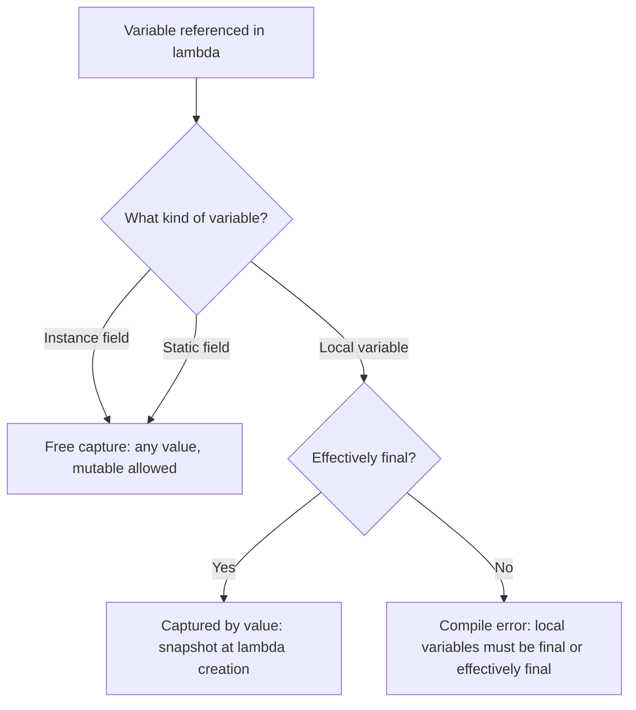
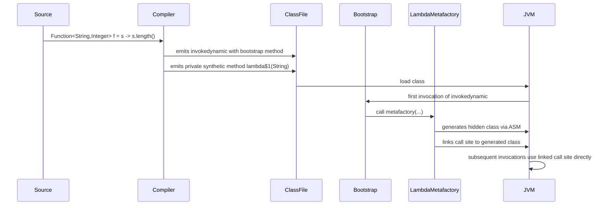

# 06.1. Lambda Expressions and Functional Interfaces

## Overview

Java 8 introduced lambda expressions and functional interfaces in 2014, the most significant change to the language since generics in Java 5. Lambdas transformed Java from a verbosely object-oriented language into one that could express behavior as data, enabling the Streams API, the modern `CompletableFuture` API, and the reactive ecosystem that followed. This note is the deep dive into lambda syntax, target typing, the functional interface contract, the `@FunctionalInterface` annotation, method references, the `java.util.function` package, and how the JVM implements lambdas under the hood via `invokedynamic` and `LambdaMetafactory`.

By the end you will understand why a lambda is more than anonymous-class syntactic sugar, what the SAM (single abstract method) rule is, how the compiler infers types, what `this` means inside a lambda, the rules for capturing local variables, and the performance characteristics of lambda-based code.

## Background Knowledge

Before lambdas, Java expressed behavior as data using anonymous inner classes:

```java
Collections.sort(names, new Comparator<String>() {
    @Override
    public int compare(String a, String b) {
        return a.compareToIgnoreCase(b);
    }
});
```

This works, but it is verbose: five lines of boilerplate to express one line of intent. Other JVM languages (Scala, Groovy, Kotlin) had closures; Java needed them too.

Java 8 added two complementary features:

1. **Functional interfaces**: interfaces with exactly one abstract method (SAM). The compiler can treat a lambda as an instance of any functional interface whose method signature matches the lambda.
2. **Lambda expressions**: a concise syntax for creating instances of functional interfaces without an explicit anonymous class.

Together they make the Streams API possible. The `Stream.map(Function)` method, for example, takes a `Function<T, R>`, which is a functional interface with one abstract method `R apply(T)`. You pass a lambda `(t) -> ...` and the compiler synthesizes an implementation.

## Lambda Syntax

A lambda has three parts:

1. A parameter list, in parentheses.
2. An arrow `->`.
3. A body, which is either a single expression or a block.

```java
// No parameters: () -> ...
Runnable r = () -> System.out.println("hello");

// One parameter, type inferred: x -> ...
Function<String, Integer> length = s -> s.length();

// One parameter, explicit type: (String s) -> ...
Function<String, Integer> length2 = (String s) -> s.length();

// Multiple parameters: (a, b) -> ...
Comparator<String> byLength = (a, b) -> Integer.compare(a.length(), b.length());

// Block body with multiple statements and explicit return:
Function<String, Integer> length3 = (String s) -> {
    if (s == null) return 0;
    return s.length();
};

// Multiple parameters with explicit types:
BinaryOperator<Integer> sum = (Integer a, Integer b) -> a + b;
```

### Parameter Rules

- The parameter list must be in parentheses unless there is exactly one parameter and its type is inferred.
- If types are declared, all parameters must have types declared (you cannot mix).
- If types are omitted, all are inferred from the target type.
- The parameter names are in scope in the body and shadow outer-scope names.
- Parameters can be annotated (e.g., `(@Nullable String s) -> ...`).
- Parameters can be declared `final` (rarely useful, but legal): `(final String s) -> ...`.

### Body Rules

- An expression body is a single expression; its value (if non-void) is the lambda's return value.
- A block body is a sequence of statements enclosed in `{}`. If the functional interface method returns non-void, the block must use `return` for all paths.
- A void-returning lambda with an expression body discards the expression's value (a "statement expression").

## Target Typing

The compiler determines the type of a lambda from the context in which it appears. This is called target typing. The context can be:

- A variable assignment: `Function<String, Integer> f = s -> s.length();`
- A method argument: `stream.map(s -> s.length())`
- A return statement: `return s -> s.length();`
- A cast: `((Function<String, Integer>) s -> s.length())`
- A ternary expression: `condition ? (s -> 1) : (s -> 2)`

The target type must be a functional interface. The compiler checks that the lambda's parameter types and return type are compatible with the functional interface's single abstract method.

```java
// The same lambda syntax can produce different types depending on context.
Comparator<String> c = (a, b) -> a.compareToIgnoreCase(b);
Callable<String> callable = () -> "hello";
Supplier<String> supplier = () -> "hello";
Runnable runnable = () -> System.out.println("hello"); // expression body, value discarded
```

The lambda `() -> "hello"` can target `Callable<String>`, `Supplier<String>`, or even a custom interface `Factory<String>` whose method returns `String`. The compiler chooses based on the declared target type.

## Functional Interfaces

A functional interface is an interface with exactly one abstract method. The method may be declared in the interface itself or inherited from a parent interface. Default and static methods do not count toward the single-method limit. Methods from `Object` (like `equals` and `hashCode`) do not count either.

```java
@FunctionalInterface
public interface Comparator<T> {
    int compare(T o1, T o2);
    // Many default methods: thenComparing, reversed, nullsFirst, etc.
    // These do not affect functional interface status.
    default Comparator<T> reversed() { /* ... */ }
    boolean equals(Object obj); // From Object, does not count
}
```

### The SAM Rule

SAM stands for Single Abstract Method. An interface is a functional interface if and only if it has exactly one abstract method that is not a default, static, or `Object` method.

```java
// Valid functional interface.
interface Printer {
    void print(String s);
}

// Not a functional interface: two abstract methods.
interface Bad {
    void print(String s);
    void println(String s);
}

// Valid: the second method is a default.
interface Good {
    void print(String s);
    default void println(String s) { print(s); System.out.println(); }
}

// Valid: equals is from Object and does not count.
interface AlsoGood {
    int compare(String a, String b);
    boolean equals(Object obj);
}
```

### The @FunctionalInterface Annotation

The `@FunctionalInterface` annotation is optional but recommended. It causes the compiler to enforce the SAM rule: if you accidentally add a second abstract method, the compiler reports an error. Without the annotation, the interface silently stops being functional.

```java
@FunctionalInterface
public interface MyFunction<T, R> {
    R apply(T t);
}
```

Always annotate your own functional interfaces. It documents the intent and catches accidental breakage during refactoring.

## The java.util.function Package

Java 8 ships with a rich set of functional interfaces in `java.util.function`. The most common ones:

| Interface | Method | Description |
|---|---|---|
| `Supplier<T>` | `T get()` | No input, returns a T |
| `Consumer<T>` | `void accept(T)` | Consumes a T, returns nothing |
| `Function<T, R>` | `R apply(T)` | Maps a T to an R |
| `Predicate<T>` | `boolean test(T)` | Tests a T, returns boolean |
| `BiFunction<T, U, R>` | `R apply(T, U)` | Two inputs, one output |
| `BiConsumer<T, U>` | `void accept(T, U)` | Two inputs, no output |
| `BiPredicate<T, U>` | `boolean test(T, U)` | Two inputs, boolean output |
| `UnaryOperator<T>` | `T apply(T)` | Function from T to T |
| `BinaryOperator<T>` | `T apply(T, T)` | BiFunction from (T, T) to T |
| `IntFunction<R>` | `R apply(int)` | int to R |
| `IntConsumer` | `void accept(int)` | consumes an int |
| `IntSupplier` | `int getAsInt()` | returns an int |
| `IntPredicate` | `boolean test(int)` | tests an int |
| `IntUnaryOperator` | `int applyAsInt(int)` | int to int |
| `IntBinaryOperator` | `int applyAsInt(int, int)` | two ints to int |
| `ToIntFunction<T>` | `int applyAsInt(T)` | T to int |
| `ToIntBiFunction<T, U>` | `int applyAsInt(T, U)` | (T, U) to int |

The primitive specializations (`IntFunction`, `LongFunction`, `DoubleFunction`, and their variants) exist to avoid autoboxing in hot loops. For high-throughput code, prefer `IntStream.range(0, n).map(x -> x * 2).sum()` over `IntStream.range(0, n).mapToObj(x -> x * 2).reduce(0, Integer::sum)`.

The full set includes three primitive families (int, long, double) each with their own `Function`, `Consumer`, `Supplier`, `Predicate`, `UnaryOperator`, `BinaryOperator`, and the `ToXFunction` variants for converting from object types to primitives. The package has roughly 43 functional interfaces; in practice you will use about 10 of them constantly.

## Variable Capture

A lambda can reference local variables from its enclosing scope. Such variables are "captured" by the lambda. There are strict rules:



### Effectively Final Rule

```java
int x = 10;
Runnable r = () -> System.out.println(x); // OK, x is effectively final

int y = 20;
y = 30; // reassignment makes y NOT effectively final
// Runnable r2 = () -> System.out.println(y); // compile error
```

A variable is effectively final if it is never reassigned after its first initialization. The compiler enforces this rule because captured local variables are stored as fields on the lambda instance; if the variable could change, the lambda would see inconsistent state.

### Why the Restriction?

Local variables live on the stack. The stack frame is destroyed when the method returns, but the lambda may outlive the method (for example, returned from a method or passed to a stream). To make this work, the JVM copies the value of captured local variables into the lambda instance's fields at construction time. If the original variable could change, the copy would diverge from the original, leading to confusion.

Instance fields do not have this restriction because they live on the heap; the lambda captures a reference to the enclosing `this`, which is stable.

### Mutable Capture Workarounds

If you genuinely need to mutate state from inside a lambda (usually a bad sign), use a one-element array or an `AtomicInteger`:

```java
int[] counter = {0};
list.forEach(item -> counter[0]++); // legal, the array reference is effectively final
```

This is generally a sign that you should restructure your code to use reduction or collect rather than mutation. Mutable accumulators inside lambdas are a common source of concurrency bugs.

## The `this` Reference Inside a Lambda

Inside a lambda, `this` refers to the enclosing instance (the lexical `this`), not to the lambda itself. This is the major semantic difference between lambdas and anonymous inner classes.

```java
public class Example {
    private String name = "outer";

    public void demo() {
        Runnable lambda = () -> System.out.println(this.name); // prints "outer"
        Runnable anon = new Runnable() {
            @Override
            public void run() {
                System.out.println(this.name); // anonymous class has its own this
            }
        };
        lambda.run();
        anon.run();
    }
}
```

The anonymous class declares its own `this`, so `this.name` inside `anon.run()` would fail to compile (the anonymous Runnable has no `name` field). The lambda's `this` is the enclosing `Example` instance, so `this.name` resolves correctly.

This is also why you cannot use `this` to refer to the lambda instance itself. There is no syntax for that, because the lambda is not a class instance with identity of its own (in source; under the hood it is, but the language does not expose it).

## Method References

Method references are a shorthand for lambdas that just call a single method:

```java
// Lambda:
Function<String, Integer> len = s -> s.length();
// Method reference:
Function<String, Integer> lenRef = String::length;

// Lambda:
Supplier<List<String>> factory = () -> new ArrayList<>();
// Method reference:
Supplier<List<String>> factoryRef = ArrayList::new;

// Lambda:
Arrays.sort(names, (a, b) -> a.compareToIgnoreCase(b));
// Method reference:
Arrays.sort(names, String::compareToIgnoreCase);
```

There are four kinds of method references:

1. **Static method reference**: `ClassName::staticMethod`
2. **Instance method reference to a specific object**: `instance::method`
3. **Instance method reference to an arbitrary object of a type**: `ClassName::instanceMethod` (the first parameter becomes the receiver)
4. **Constructor reference**: `ClassName::new`

Method references are covered in depth in 06.2.

## How Lambdas Are Implemented Under the Hood

A common misconception is that lambdas are syntactic sugar for anonymous inner classes. They are not. The compiler does not generate anonymous class files for each lambda. Instead, it uses `invokedynamic` (introduced in Java 7) to defer lambda instantiation to runtime.



### Steps at Compile Time

For each lambda, the compiler:

1. Generates a private synthetic method in the enclosing class containing the lambda body. The method's parameters are the lambda's parameters plus any captured variables.
2. Emits an `invokedynamic` instruction at the lambda site, with a bootstrap method pointing to `LambdaMetafactory.metafactory`.
3. Records the synthetic method handle, the target functional interface, and the captured variables in the constant pool.

### Steps at Runtime

When the `invokedynamic` is first executed:

1. The JVM invokes the bootstrap method (`LambdaMetafactory.metafactory`).
2. The bootstrap method generates a hidden class (using `Lookup.defineHiddenClass` in modern Java; previously `sun.misc.Unsafe.defineAnonymousClass`) that implements the target functional interface.
3. The bootstrap method links the call site to a constructor or factory for the generated class.
4. Subsequent invocations go directly through the linked call site with no bootstrap overhead.

### Why invokedynamic

The `invokedynamic` approach has several advantages over anonymous classes:

- **No class file per lambda**: smaller jars, faster startup.
- **Lazy class generation**: lambdas that are never invoked never incur generation cost.
- **Future-proofing**: the JDK can change the implementation strategy without requiring recompilation of source code.
- **Caching**: stateless lambdas (those that capture nothing) can be cached and reused as singletons.

### Stateless Lambda Singleton Optimization

A lambda that captures no variables is stateless. `LambdaMetafactory` caches a single instance of each stateless lambda and returns the same instance on every invocation. This is why `() -> 1` always returns the same `Supplier` instance.

```java
Supplier<Integer> a = () -> 1;
Supplier<Integer> b = () -> 1;
System.out.println(a == b); // often true (same cached instance)
```

This is implementation-specific; do not rely on it, but know that it can reduce allocation pressure.

### Capturing Lambdas

A lambda that captures variables allocates a new instance per invocation, because the captured values are stored in instance fields. In hot loops, this can cause GC pressure. The fix is usually to lift the lambda out of the loop:

```java
// Allocates N lambdas.
for (int i = 0; i < N; i++) {
    executor.submit(() -> doWork(i));
}

// Allocates one lambda, but the body still uses i.
// This is fine if the lambda is just submitted; the capture cost is small.
```

## Performance Characteristics

| Operation | Cost |
|---|---|
| Stateless lambda construction | One cached instance lookup, no allocation |
| Capturing lambda construction | One allocation per invocation |
| Lambda invocation | Direct method call (after JIT inlining, indistinguishable from a regular call) |
| Anonymous inner class construction | One allocation per invocation plus class loading |

For most code, the difference is negligible. For tight loops in performance-critical code, prefer stateless lambdas or pre-built instances.

## Higher-Order Functions

A higher-order function is a function that takes or returns a function. Java supports this through functional interfaces:

```java
public static <T> Predicate<T> and(Predicate<T> a, Predicate<T> b) {
    return x -> a.test(x) && b.test(x);
}

Predicate<String> startsWithA = s -> s.startsWith("A");
Predicate<String> endsWithZ = s -> s.endsWith("Z");
Predicate<String> both = and(startsWithA, endsWithZ);

System.out.println(both.test("Abraham Z")); // true
```

This is the foundation of composable APIs. The `Predicate.and`, `Predicate.or`, `Predicate.negate` methods do this for you:

```java
Predicate<String> both = startsWithA.and(endsWithZ).negate();
```

## Currying and Partial Application

Java does not have native currying, but you can simulate it with nested lambdas:

```java
Function<Integer, Function<Integer, Function<Integer, Integer>>> curriedAdd =
    a -> b -> c -> a + b + c;

int result = curriedAdd.apply(1).apply(2).apply(3); // 6

// Partial application:
Function<Integer, Function<Integer, Integer>> addOne = curriedAdd.apply(1);
Function<Integer, Integer> addOneAndTwo = addOne.apply(2);
int r = addOneAndTwo.apply(3); // 6
```

This is verbose but useful for building configurators and parameterized factories.

## Exception Handling in Lambdas

Lambda bodies cannot throw checked exceptions unless the functional interface declares them. The standard `java.util.function` interfaces do not. There are three workarounds:

### 1. Wrap in RuntimeException

```java
files.stream().map(path -> {
    try { return Files.readString(path); }
    catch (IOException e) { throw new UncheckedIOException(e); }
}).toList();
```

`UncheckedIOException` is the JDK's standard wrapper for `IOException` in stream pipelines.

### 2. Define Your Own Functional Interface

```java
@FunctionalInterface
interface ThrowingFunction<T, R, E extends Exception> {
    R apply(T t) throws E;
}

static <T, R> Function<T, R> unchecked(ThrowingFunction<T, R, ?> f) {
    return t -> {
        try { return f.apply(t); }
        catch (Exception e) { throw new RuntimeException(e); }
    };
}

files.stream().map(unchecked(path -> Files.readString(path))).toList();
```

This pattern is provided by libraries like Apache Commons Lang (`FailableFunction`) and Vavr (`CheckedFunction`).

### 3. Use a Stream of Try

Libraries like Vavr provide a `Try<T>` type that captures success or failure as a value:

```java
List<Try<String>> results = files.stream()
    .map(path -> Try.of(() -> Files.readString(path)))
    .toList();
```

This makes exception handling a first-class part of the pipeline.

## Common Pitfalls

### Pitfall 1: Capturing Loop Variable

```java
for (int i = 0; i < 5; i++) {
    executor.submit(() -> System.out.println(i));
}
```

This does not compile because `i` is mutated by the loop. The fix in modern Java is to use an enhanced-for over a range, or to copy `i` into a final variable:

```java
for (int i = 0; i < 5; i++) {
    final int j = i;
    executor.submit(() -> System.out.println(j));
}
```

### Pitfall 2: Returning From a Void Lambda

```java
list.forEach(x -> {
    if (x == null) return; // 'return' here exits the lambda, not the enclosing method
    process(x);
});
```

The `return` inside a lambda's block body exits the lambda, not the enclosing method. This is a frequent source of confusion for developers coming from other languages.

### Pitfall 3: Modifying Shared State

```java
List<Integer> result = new ArrayList<>();
list.parallelStream().map(x -> x * 2).forEach(result::add);
```

`ArrayList` is not thread-safe; using it from a parallel stream causes data corruption or `ArrayIndexOutOfBoundsException`. Use `collect(Collectors.toList())` instead, which accumulates in a thread-safe way.

### Pitfall 4: Overusing Lambdas for Logic

```java
// Hard to read.
Function<String, Integer> f = s -> s == null ? 0 :
    s.length() > 10 ? s.length() * 2 :
    s.length();

// Easier to read with a named method.
Function<String, Integer> f = StringMetrics::weightedLength;
```

If a lambda body is more than three lines, extract it into a named method and use a method reference. Lambdas should be short and clear.

### Pitfall 5: Assuming Functional Interface Equality

```java
Predicate<String> a = s -> s.length() > 0;
Predicate<String> b = s -> s.length() > 0;
System.out.println(a.equals(b)); // false - different instances
```

Two lambdas with identical bodies are not `equal` to each other. Do not use them as map keys.

### Pitfall 6: Shadowing Outer Variables

```java
String name = "outer";
Runnable r = () -> {
    String name = "inner"; // compile error: variable name is already defined
};
```

You cannot redeclare a captured variable inside the lambda. Choose a different name.

### Pitfall 7: Returning a Lambda Without a Target Type

```java
// Compile error: cannot infer target type.
var f = (x, y) -> x + y;

// Works: explicit target type.
BinaryOperator<Integer> f = (x, y) -> x + y;
```

Lambdas cannot be assigned to `var` without a target type because the compiler cannot infer the functional interface.

### Pitfall 8: Serializing Lambdas

A lambda that targets a `Serializable` functional interface can be serialized, but the resulting bytes are unstable across JVM versions and vendors. Do not rely on lambda serialization for storage.

### Pitfall 9: Expecting Method References to Be Lambdas

Method references look like lambdas but are not always equivalent. A method reference like `System.out::println` captures `System.out` at construction time, so if you reassign `System.out` later, the lambda still prints to the original stream.

### Pitfall 10: Forgetting That Lambdas Are Eagerly Evaluated at Construction

```java
Supplier<Integer> supplier = () -> computeExpensiveValue();
// computeExpensiveValue is NOT called here.
// It is called only when supplier.get() is invoked.
```

This is the lazy nature of lambdas: the body runs only when the functional interface method is called. This is essential for `Supplier`-based APIs like `Lazy.of(() -> compute())` or `Optional.orElseGet(() -> compute())`.

## Tips and Tricks

### Tip 1: Use `var` for Lambda Parameter Types (Java 11+)

```java
(var a, var b) -> a + b
```

This is useful when you want to annotate parameters:

```java
(@NonNull var a, @NonNull var b) -> a + b
```

You cannot mix `var` and explicit types: `(var a, String b)` is a compile error.

### Tip 2: Prefer Method References for Simple Cases

`s -> s.length()` is fine, but `String::length` is shorter and clearer. Reserve lambdas for cases where the body is non-trivial.

### Tip 3: Compose Functions

```java
Function<String, String> trim = String::trim;
Function<String, String> upper = String::toUpperCase;
Function<String, String> clean = trim.andThen(upper);

String result = clean.apply("  hello  "); // "HELLO"
```

The `andThen` and `compose` methods on `Function` let you build pipelines.

### Tip 4: Use Primitive Specializations in Hot Loops

```java
// Autoboxes every element.
int sum = list.stream().mapToInt(Integer::intValue).sum();

// No autoboxing.
int sum = list.stream().mapToInt(x -> x).sum();
```

Wait, both autobox. The right primitive stream is:

```java
int sum = ints.stream().mapToInt(Integer::intValue).sum();
```

Or better, if you control the source:

```java
int sum = IntStream.of(1, 2, 3).sum();
```

### Tip 5: Use `Predicate.isEqual` for Equality Predicates

```java
Predicate<String> equalsHello = Predicate.isEqual("hello");
```

Equivalent to `s -> "hello".equals(s)` but more readable.

### Tip 6: Use `Function.identity()` for Identity Functions

```java
Stream<String> unchanged = stream.map(Function.identity());
```

Equivalent to `s -> s` but documents the intent.

### Tip 7: Avoid Stateful Lambdas in Streams

```java
Set<Integer> seen = new HashSet<>();
list.stream().filter(x -> seen.add(x)).toList(); // BAD - stateful lambda
```

Use `distinct()` instead. Stateful lambdas in parallel streams produce non-deterministic results.

### Tip 8: Use `Comparator.comparing` for Fluent Comparators

```java
Comparator<Person> byAge = Comparator.comparing(Person::age);
Comparator<Person> byAgeThenName = Comparator.comparing(Person::age)
    .thenComparing(Person::name);
```

### Tip 9: Cache Expensive Lambdas

If you construct a lambda inside a hot method and it captures nothing, you can lift it to a static final field:

```java
private static final Predicate<String> NONEMPTY = s -> !s.isEmpty();

public List<String> filter(List<String> list) {
    return list.stream().filter(NONEMPTY).toList();
}
```

### Tip 10: Use `Supplier` for Lazy Initialization

```java
public class Lazy<T> {
    private Supplier<T> supplier;
    private T value;
    private boolean initialized;

    public Lazy(Supplier<T> supplier) { this.supplier = supplier; }

    public synchronized T get() {
        if (!initialized) {
            value = supplier.get();
            initialized = true;
            supplier = null;
        }
        return value;
    }
}
```

This pattern underlies `Optional.orElseGet` and many memoization utilities.

## Interview Questions

### Q1: What is a functional interface?

An interface with exactly one abstract method (SAM: Single Abstract Method). Default, static, and `Object` methods do not count toward the limit. The compiler can treat a lambda as an instance of any functional interface whose method signature matches the lambda.

### Q2: What does `@FunctionalInterface` do?

It causes the compiler to enforce the SAM rule: if you accidentally add a second abstract method, the compiler reports an error. It is optional but recommended for documentation.

### Q3: What is target typing?

The compiler determines the type of a lambda from the context in which it appears (assignment, method argument, return, cast). The target type must be a functional interface.

### Q4: Why must captured local variables be effectively final?

Local variables live on the stack and are destroyed when the method returns, but a lambda may outlive the method. The JVM copies captured values into the lambda's fields at construction. If the original variable could change, the copy would diverge from the original, causing confusion.

### Q5: What does `this` refer to inside a lambda?

The enclosing instance (lexical `this`), not the lambda itself. This is the major semantic difference between lambdas and anonymous inner classes.

### Q6: How are lambdas implemented under the hood?

The compiler emits an `invokedynamic` instruction with a bootstrap method pointing to `LambdaMetafactory.metafactory`. At runtime, the bootstrap generates a hidden class that implements the target functional interface and links the call site. Stateful lambdas allocate a new instance per invocation; stateless lambdas are cached as singletons.

### Q7: What is the difference between a lambda and an anonymous inner class?

Lambdas do not generate class files at compile time (they use `invokedynamic`). Their `this` refers to the enclosing instance, not the lambda itself. They can capture only effectively final local variables. Anonymous classes have their own `this`, can capture any local variable (including non-final, before Java 8), and generate class files at compile time.

### Q8: Can a lambda throw a checked exception?

Only if the target functional interface declares the exception. The standard `java.util.function` interfaces do not. Workarounds include wrapping in a runtime exception, defining your own functional interface, or using library types like `Try`.

### Q9: What is the difference between `Function` and `UnaryOperator`?

`UnaryOperator<T>` extends `Function<T, T>` and is a specialization where the input and output types are the same. It exists for clarity in APIs like `Stream.map` where you transform elements of the same type.

### Q10: Why do primitive functional interfaces (`IntFunction`, etc.) exist?

To avoid autoboxing in hot loops. `IntStream.map(IntUnaryOperator)` does not box each int to an Integer, which can be a 2-3x speedup in tight loops.

### Q11: What is the difference between `andThen` and `compose` on `Function`?

`f.andThen(g).apply(x)` is `g(f(x))`: f runs first, then g. `f.compose(g).apply(x)` is `f(g(x))`: g runs first, then f.

### Q12: Are lambdas Serializable?

A lambda targeting a functional interface that extends `Serializable` can be serialized, but the resulting bytes are unstable across JVM versions and vendors. Do not rely on lambda serialization for storage.

### Q13: Can you assign a lambda to `var`?

Only with an explicit target type. `var f = (x, y) -> x + y;` is a compile error because the compiler cannot infer the functional interface. `BinaryOperator<Integer> f = (x, y) -> x + y;` works.

### Q14: What is the SAM rule for inheritance?

An interface is functional if it has exactly one abstract method, counting inherited abstract methods but not default, static, or `Object` methods. A subinterface that inherits two distinct abstract methods is not functional.

### Q15: What is a higher-order function?

A function that takes or returns a function. Java supports this through functional interfaces. `Predicate.and` and `Function.andThen` are examples of higher-order functions in the JDK.

## Summary

Lambda expressions and functional interfaces transformed Java from a verbose object-oriented language into one that can express behavior as data concisely. A lambda is a lightweight syntax for creating instances of functional interfaces (interfaces with exactly one abstract method), with target typing determining the lambda's type from context. Lambdas capture local variables by value, requiring them to be effectively final, and their `this` refers to the enclosing instance rather than the lambda itself. Under the hood, lambdas are implemented via `invokedynamic` and `LambdaMetafactory`, allowing stateless lambdas to be cached as singletons and avoiding the per-lambda class file overhead of anonymous inner classes. The `java.util.function` package provides about 43 functional interfaces covering common patterns, with primitive specializations to avoid autoboxing. The next note, 06.2, dives into method references, the four kinds, and when to prefer them over lambdas.
