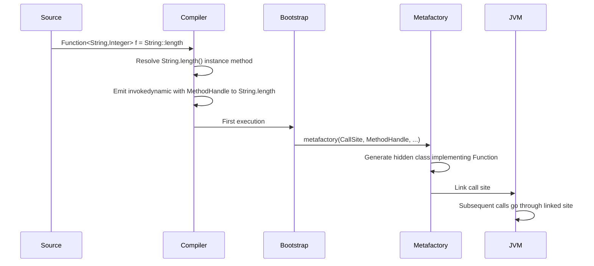
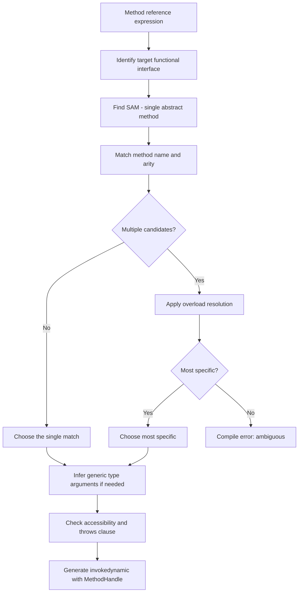

# 06.2. Method References

## Overview

Method references, introduced in Java 8 alongside lambdas, are a concise syntax for creating instances of functional interfaces by referring to an existing method. They are not a separate feature from lambdas but a shorthand: anywhere you would write `x -> someMethod(x)`, you can usually write `SomeClass::someMethod` instead. The compiler treats method references and lambdas as equivalent and produces the same `invokedynamic` call sites.

This note is the comprehensive guide to method references: the four kinds, the target typing rules, how they are compiled, when to prefer them over lambdas, and the corner cases that trip up developers. We will cover constructor references (including array constructor references), bounded and unbounded references, the difference between equivalent-looking references, and how method references interact with generics, overloading, and the `var` keyword.

## Background Knowledge

Method references build directly on lambdas (see 06.1). Recall that a lambda is a lightweight syntax for an instance of a functional interface, with target typing determining the lambda's type from context. Method references inherit all of this: they are lambdas whose body is a single method call.

The four kinds of method references are:

1. **Static method reference**: `ClassName::staticMethodName`
2. **Reference to an instance method of a particular object**: `instance::instanceMethodName`
3. **Reference to an instance method of an arbitrary object of a particular type**: `ClassName::instanceMethodName`
4. **Constructor reference**: `ClassName::new`

All four are written with the `::` operator, which is the only place `::` appears in Java source code.

## The Four Kinds of Method References

### 1. Static Method Reference

A static method reference passes a static method as a function.

```java
import java.util.function.*;

// Lambda form:
Function<String, Integer> parser = s -> Integer.parseInt(s);

// Method reference form:
Function<String, Integer> parserRef = Integer::parseInt;

// Both produce identical bytecode (after invokedynamic linking).
```

The compiler matches the static method's signature against the target functional interface's single abstract method. The arguments of the functional interface method are passed as the arguments to the static method.

Common uses:

```java
// Math operations
IntBinaryOperator max = Math::max;

// Conversion to string
Function<Object, String> stringifier = String::valueOf;

// Factory methods
Supplier<List<String>> listFactory = List::of;
Function<String[], List<String>> fromArray = List::of; // varargs form

// Stream.collect helpers
Supplier<StringBuilder> sbFactory = StringBuilder::new;
```

### 2. Instance Method Reference to a Specific Object (Bounded)

You can reference an instance method on a specific object that you already have.

```java
import java.util.function.*;

public class Printer {
    public void println(String s) {
        System.out.println(s);
    }
}

Printer printer = new Printer();
Consumer<String> consumer = printer::println;

// Equivalent lambda:
Consumer<String> consumerLambda = s -> printer.println(s);
```

The object is captured at the time the method reference is constructed. Subsequent reassignments to the variable holding the object do not affect the reference; the lambda continues to call the method on the originally captured object.

Common uses:

```java
// System.out::println is the canonical example.
list.forEach(System.out::println);

// A bound reference to a logger.
Logger logger = LoggerFactory.getLogger(MyClass.class);
Consumer<String> logInfo = logger::info;

// A bound reference to a specific collection.
Set<String> seen = ConcurrentHashMap.newKeySet();
Consumer<String> remember = seen::add;
```

### 3. Instance Method Reference to an Arbitrary Object of a Type (Unbounded)

The third form looks like a static reference but is for instance methods. The first parameter of the functional interface method becomes the receiver (the object on which the instance method is called).

```java
import java.util.function.*;

// Lambda form: the first parameter is the receiver.
Function<String, Integer> length = s -> s.length();

// Method reference form: same thing, more concisely.
Function<String, Integer> lengthRef = String::length;

// The compiler sees String::length as a function that takes a String
// (the receiver) and returns an int (the result of length()).
```

The unbounded form is what you use most often in Streams:

```java
// Map each string to its length.
List<Integer> lengths = strings.stream()
    .map(String::length)
    .toList();

// Compare strings case-insensitively.
strings.sort(String::compareToIgnoreCase);

// Extract a property from each object.
List<String> names = people.stream()
    .map(Person::name)
    .toList();
```

For two-parameter functional interfaces, the first parameter becomes the receiver and the second becomes the method argument:

```java
// Lambda: (a, b) -> a.startsWith(b)
BiPredicate<String, String> startsWith = (a, b) -> a.startsWith(b);

// Method reference: String::startsWith (the first String is the receiver)
BiPredicate<String, String> startsWithRef = String::startsWith;
```

This form is sometimes confusing because the same syntax (`String::startsWith`) can refer to either a static method (which does not exist on `String`) or an instance method. The compiler resolves the ambiguity by checking whether the named method is static or instance.

### 4. Constructor Reference

A constructor reference creates a new instance of a class.

```java
import java.util.function.*;

// Lambda form:
Supplier<List<String>> factory = () -> new ArrayList<>();

// Constructor reference:
Supplier<List<String>> factoryRef = ArrayList::new;

// With arguments:
Function<Integer, ArrayList<String>> sizedFactory = ArrayList::new;
// This calls new ArrayList<>(int initialCapacity).

// Two-argument constructor (if it existed):
// BiFunction<Integer, Float, MyClass> = MyClass::new;
```

The compiler matches the constructor's parameter list against the functional interface method's parameter list. If the class has multiple constructors, overload resolution picks the most specific applicable one.

#### Array Constructor References

You can also create arrays:

```java
import java.util.function.*;

// Lambda form: length -> new String[length]
IntFunction<String[]> arrayFactory = length -> new String[length];

// Method reference form:
IntFunction<String[]> arrayFactoryRef = String[]::new;

// Common use: Stream.toArray
String[] arr = stream.toArray(String[]::new);
```

The array constructor reference takes an int (the length) and returns an array of the specified type.

#### Generic Constructor References

Type parameters work as expected:

```java
@FunctionalInterface
interface Factory<T> {
    T create();
}

Factory<ArrayList<String>> factory = ArrayList::new;
// The compiler instantiates ArrayList<String>() (well, ArrayList() at runtime
// due to type erasure).
```

#### Nested and Inner Class Constructor References

```java
class Outer {
    class Inner {
        Inner() {}
    }
}

// The Inner constructor implicitly takes an Outer as its first argument.
Function<Outer, Outer.Inner> innerFactory = Outer.Inner::new;

Outer outer = new Outer();
Outer.Inner inner = innerFactory.apply(outer);
```

Inner class constructors have an implicit first parameter of the enclosing type, so a constructor reference for an inner class targets a functional interface whose first parameter is the enclosing type.

#### Record Constructor References

Records support constructor references just like any other class:

```java
public record Point(int x, int y) {}

Function<Integer, Point> partial = x -> new Point(x, 0);
BiFunction<Integer, Integer, Point> full = Point::new;

Point p = full.apply(3, 4);
```

For records with compact constructors, the canonical constructor reference is the standard form.

## Target Typing and Overload Resolution

Method references participate in overload resolution just like method calls. The compiler must choose both the right method (or constructor) and the right functional interface.

### Method Overload Resolution

```java
public class Converters {
    public static String toString(int x) { return Integer.toString(x); }
    public static String toString(double x) { return Double.toString(x); }
}

// The target type disambiguates.
IntFunction<String> intFn = Converters::toString;       // picks toString(int)
DoubleFunction<String> dblFn = Converters::toString;    // picks toString(double)
```

If the target type does not disambiguate, the compiler reports an error:

```java
// Ambiguous: which toString does this refer to?
// var fn = Converters::toString; // compile error
```

### Constructor Overload Resolution

```java
public class Person {
    public Person() {}
    public Person(String name) {}
    public Person(String name, int age) {}
}

Supplier<Person> p0 = Person::new;                              // Person()
Function<String, Person> p1 = Person::new;                      // Person(String)
BiFunction<String, Integer, Person> p2 = Person::new;           // Person(String, int)
```

The compiler picks the constructor whose parameter list matches the functional interface method's parameter list.

### Generic Method Overload

Generic methods add complexity. The compiler must infer the type parameter from the target type:

```java
public class Lists {
    public static <T> List<T> of(T... elements) { /* ... */ }
}

// Target type: String[] -> List<String>
Function<String[], List<String>> fn = Lists::of;
```

The compiler infers `T = String` from the target functional interface.

## How Method References Are Compiled

Method references are compiled exactly like lambdas: an `invokedynamic` instruction with a bootstrap method pointing to `LambdaMetafactory.metafactory`. The bootstrap receives a `MethodHandle` to the referenced method and the target functional interface.



The key difference from lambdas: for a method reference, the bootstrap receives a `MethodHandle` to the existing method rather than to a compiler-generated synthetic method. The generated class delegates the call directly to the method handle.

Stateless method references (those that capture nothing) are cached as singletons, just like stateless lambdas. Bounded method references that capture an instance allocate a new object per construction.

## When to Use Method References vs Lambdas

The general rule is to use the most concise form that is still readable.

### Prefer Method References When

- The body is a single method call with no transformation: `s -> s.length()` becomes `String::length`.
- The body is a constructor call: `() -> new ArrayList<>()` becomes `ArrayList::new`.
- The body is a `System.out::println` style call.

### Prefer Lambdas When

- The body uses multiple statements.
- The body computes a value that is not just a method call: `s -> s.length() * 2`.
- The method reference would be ambiguous without an explicit target type.
- The lambda enables a more descriptive parameter name: `(person) -> person.getName()` is sometimes clearer than `Person::getName`.

### Style Heuristic

If the method reference is shorter than the lambda and equally clear, use it. If the lambda enables better naming or includes logic, use that. Consistency within a codebase matters more than the specific choice.

## Equivalent Method References

Many method references are functionally equivalent to common lambdas:

| Method Reference | Equivalent Lambda |
|---|---|
| `Integer::parseInt` | `s -> Integer.parseInt(s)` |
| `String::length` | `s -> s.length()` |
| `System.out::println` | `s -> System.out.println(s)` |
| `ArrayList::new` | `() -> new ArrayList<>()` |
| `String[]::new` | `n -> new String[n]` |
| `Math::max` | `(a, b) -> Math.max(a, b)` |
| `Function.identity()` | `x -> x` (no method reference equivalent) |

Note that `Function.identity()` is a method call, not a method reference; there is no syntax for a method reference to a generic type's identity function.

## Method References on Generics

You can use method references on generic types:

```java
import java.util.function.*;
import java.util.*;

// Static generic method reference.
Function<List<Integer>, Integer> sum = Collections::max;
// Collections.max is generic; the compiler infers Integer.

// Instance method reference on a parameterized type.
Function<List<String>, Integer> sizes = List::size;
```

Type erasure means the runtime does not see the generic types, but the compiler uses them for type checking and inference.

## Pitfalls With Method References

### Pitfall 1: Captured Instance at Construction Time

```java
PrintStream out = System.out;
Consumer<String> printer = out::println;
System.out = null; // does not affect the lambda
// printer.accept("hello") still prints to the original System.out.
```

The instance is captured when the method reference is constructed. Reassigning the variable does not change the lambda's behavior.

### Pitfall 2: Ambiguous Overload

```java
public class Ambiguous {
    public static int compute(String s) { return s.length(); }
    public static int compute(Object o) { return o.hashCode(); }
}

// Compile error: ambiguous. Both compute(String) and compute(Object)
// match Function<String, Integer>.
// Function<String, Integer> fn = Ambiguous::compute;
```

The fix is to disambiguate with a lambda:

```java
Function<String, Integer> fn = s -> Ambiguous.compute(s);
```

Or with an explicit cast:

```java
Function<String, Integer> fn = (Function<String, Integer>) Ambiguous::compute;
```

### Pitfall 3: Null Receiver

```java
PrintStream out = null;
Consumer<String> printer = out::println; // NullPointerException at construction
```

A bounded method reference immediately dereferences the receiver to capture the method handle. If the receiver is null, an NPE is thrown at construction time, not at invocation time.

### Pitfall 4: Method Reference Loses Parameter Names

```java
// Lambda: clear what the parameter represents.
people.forEach(person -> System.out.println(person));

// Method reference: parameter is implicit.
people.forEach(System.out::println);
```

When the parameter name carries meaning, a lambda is sometimes clearer.

### Pitfall 5: Constructor Reference to an Interface

```java
// Compile error: cannot construct an interface.
// Supplier<List<String>> factory = List::new;
```

You cannot use a constructor reference to an interface; interfaces have no constructors. Use a lambda or a static factory method:

```java
Supplier<List<String>> factory = () -> new ArrayList<>();
Supplier<List<String>> factory2 = ArrayList::new;
```

### Pitfall 6: Constructor Reference With Too Many Arguments

```java
public class Single {
    public Single() {}
}

// Compile error: Single has no constructor taking two arguments.
// BiFunction<Integer, Integer, Single> fn = Single::new;
```

The constructor's parameter count must match the functional interface method's parameter count.

### Pitfall 7: Varargs Constructor Reference

```java
public class Tuple {
    public Tuple(int... values) {}
}

// Works: varargs matches the array parameter.
Function<int[], Tuple> fn = Tuple::new;

Tuple t = fn.apply(new int[]{1, 2, 3});
```

A varargs constructor is treated as taking an array parameter for the purposes of method references. You cannot pass individual varargs arguments through a method reference; you must pass an array.

### Pitfall 8: Method Reference to a Private Method in Another Class

```java
// Compile error: method is not visible.
// Function<String, Integer> fn = OtherClass::privateMethod;
```

Method references respect access control. A method reference to a private method in another class is a compile error.

### Pitfall 9: Method Reference to a Method That Throws Checked Exceptions

```java
public class Loader {
    public static String load(String path) throws IOException { /* ... */ }
}

// Compile error: load throws IOException, which Function.apply does not.
// Function<String, String> fn = Loader::load;
```

The target functional interface must declare the exception, or you must wrap in a lambda that catches and rethrows as unchecked.

### Pitfall 10: Method Reference Does Not Inherit Generic Type Information

```java
// Works.
Function<String, Integer> len1 = String::length;

// Compile error: cannot infer target type for var.
// var len2 = String::length;
```

Method references, like lambdas, require a target type. They cannot be assigned to `var` without one.

## Tips and Tricks

### Tip 1: Use `String::compareToIgnoreCase` for Case-Insensitive Sorting

```java
List<String> sorted = strings.stream()
    .sorted(String::compareToIgnoreCase)
    .toList();
```

### Tip 2: Use Constructor References for Factory Methods

```java
@FunctionalInterface
interface TriFunction<A, B, C, R> {
    R apply(A a, B b, C c);
}

public record Point(int x, int y, int z) {}

TriFunction<Integer, Integer, Integer, Point> factory = Point::new;
Point p = factory.apply(1, 2, 3);
```

### Tip 3: Use `Arrays::asList` for Inline List Construction

```java
Function<String[], List<String>> wrapper = Arrays::asList;
```

### Tip 4: Use `Map::getOrDefault` With `BiFunction`

```java
BiFunction<Map<String, Integer>, String, Integer> lookup = Map::getOrDefault;
int v = lookup.apply(map, "missing"); // returns null if missing key
```

### Tip 5: Compose Method References

```java
Function<String, String> trim = String::trim;
Function<String, String> upper = String::toUpperCase;
Function<String, String> clean = trim.andThen(upper);

String result = clean.apply("  hello  "); // "HELLO"
```

### Tip 6: Use Method References for Default Methods

```java
interface Greetable {
    default String greet(String name) { return "Hello, " + name; }
}

Function<Greetable, String> greeter = Greetable::greet;
// Wait: this is the unbounded form, treating greet as taking the receiver
// and the name. The correct form depends on what you want.
```

You can reference default methods on interfaces, just like instance methods on classes.

### Tip 7: Constructor References for Builder Patterns

```java
public class Builder<T> {
    public Builder() {}
    public Builder<T> add(T t) { /* ... */ return this; }
    public List<T> build() { /* ... */ }
}

Supplier<Builder<String>> factory = Builder::new;
```

### Tip 8: Use `Supplier<Stream>` to Reuse Streams

Streams are single-use. To reuse a stream pipeline, wrap it in a Supplier:

```java
Supplier<Stream<String>> streamFactory = () -> Files.lines(path);

long count = streamFactory.get().count();
List<String> filtered = streamFactory.get().filter(s -> s.length() > 3).toList();
```

### Tip 9: Bounded Method Reference for Configuration

```java
public class HttpClient {
    public HttpClient withTimeout(Duration d) { /* ... */ return this; }
    public HttpClient withHeader(String name, String value) { /* ... */ return this; }
}

HttpClient base = new HttpClient().withTimeout(Duration.ofSeconds(5));

// Bounded method references let you reuse a partially-configured client.
Function<String, HttpClient> withAuth = base::withHeader;
```

### Tip 10: Use `Objects::requireNonNull` as a Stream Filter

```java
List<String> nonNull = list.stream()
    .filter(Objects::nonNull)
    .toList();
```

## Deep Dive: How the Compiler Resolves a Method Reference

To fully understand method references, it helps to walk through the resolution algorithm the compiler uses. Given an expression like `Collections::max` assigned to a target type `Function<List<Integer>, Integer>`, the compiler performs the following steps:



### Step 1: Identify the Functional Interface

The compiler inspects the assignment target (or method parameter type, or cast type). It verifies the target is a functional interface (exactly one abstract method).

### Step 2: Find the SAM

The single abstract method of the target interface determines the parameter types and return type the method reference must match.

### Step 3: Match Method Name and Arity

The compiler searches the named class (or instance) for methods with the same name as the reference. For unbounded instance references, it adds an implicit first parameter (the receiver). For static references, the SAM parameters map directly to method parameters.

### Step 4: Apply Overload Resolution

If multiple methods match the name and arity, the compiler applies the same overload resolution algorithm used for regular method calls: it picks the most specific applicable method.

### Step 5: Infer Generic Type Arguments

If the chosen method is generic, the compiler infers the type arguments from the SAM's parameter and return types.

### Step 6: Check Throws Clause

If the chosen method throws checked exceptions, the SAM must declare compatible throws. Otherwise, compile error.

### Step 7: Generate invokedynamic

The compiler emits an `invokedynamic` instruction with a `MethodHandle` to the chosen method.

### Worked Example

Consider:

```java
Function<List<Integer>, Integer> maxFn = Collections::max;
```

1. Target is `Function<List<Integer>, Integer>`.
2. SAM is `Integer apply(List<Integer>)`.
3. The compiler searches `Collections` for static methods named `max` taking one argument that can accept `List<Integer>` and return `Integer`.
4. Candidates include `max(Collection<? extends T>)` returning `T`, where `T` would be inferred as `Integer`.
5. There is only one matching candidate after type inference: `max(Collection<? extends Integer>)` returning `Integer`.
6. No checked exceptions; OK.
7. Emit invokedynamic with a MethodHandle to `Collections.max`.

If there were multiple candidates with the same arity but different bounds, the compiler would pick the most specific. If it cannot decide, the program fails to compile with "reference to max is ambiguous."

### Constructor Reference Resolution

Constructor references follow a similar process. The compiler treats the class's constructors as overload candidates. For `ArrayList::new` targeting `Supplier<List<String>>`:

1. Target is `Supplier<List<String>>`.
2. SAM is `List<String> get()`.
3. Search `ArrayList` constructors taking zero arguments. Found: `ArrayList()`.
4. Return type `ArrayList<String>` is assignable to `List<String>`. OK.
5. Emit invokedynamic.

For `ArrayList::new` targeting `Function<Integer, List<String>>`:

1. Target is `Function<Integer, List<String>>`.
2. SAM is `List<String> apply(Integer)`.
3. Search `ArrayList` constructors taking one argument of type `Integer` (or its boxed/super types).
4. Found: `ArrayList(int initialCapacity)`. The compiler performs unboxing conversion: `Integer` to `int`.
5. Return type compatible.
6. Emit invokedynamic.

This is how the same constructor reference syntax can resolve to different constructors based on the target type.

## Comparison of Method Reference Forms

| Form | Syntax | SAM Parameter Mapping | Captures |
|---|---|---|---|
| Static | `Type::staticMethod` | SAM params become method args | Nothing |
| Bounded instance | `instance::method` | SAM params become method args (after the receiver) | The instance |
| Unbounded instance | `Type::method` | First SAM param is the receiver, rest are method args | Nothing |
| Constructor | `Type::new` | SAM params become constructor args | Nothing (or generic type info) |
| Array constructor | `Type[]::new` | Single int param becomes array length | Nothing |

## Common Pitfalls (Summary Checklist)

1. Captured instance is fixed at construction time.
2. Ambiguous overloads require an explicit lambda or cast.
3. Null receivers throw NPE at construction.
4. Method references cannot target interfaces (no constructor).
5. Method references cannot throw checked exceptions unless the functional interface declares them.
6. Method references require a target type; they cannot be assigned to `var`.
7. Method references to private methods in other classes are illegal.
8. Varargs constructors must be passed an array.
9. Method references do not have parameter names; if the name matters, use a lambda.
10. Constructor references must match the constructor's parameter count exactly.

## Interview Questions

### Q1: What is a method reference?

A concise syntax for creating an instance of a functional interface by referring to an existing method or constructor. It is a shorthand for a lambda whose body is a single method call.

### Q2: What are the four kinds of method references?

1. Static method reference: `ClassName::staticMethod`.
2. Bounded instance method reference: `instance::method`.
3. Unbounded instance method reference: `ClassName::method`.
4. Constructor reference: `ClassName::new`.

### Q3: What is the difference between `String::length` and `s -> s.length()`?

Nothing semantically; they produce equivalent `Function<String, Integer>` instances. The method reference is more concise.

### Q4: How does the compiler resolve an unbounded instance method reference like `String::length` to a `Function<String, Integer>`?

The compiler treats the first parameter of the functional interface method as the receiver. `Function<String, Integer>` has `apply(String)` returning `Integer`, so the first parameter (the String) becomes the receiver of `length()`.

### Q5: What is the difference between `ArrayList::new` targeting `Supplier<List>` vs `Function<Integer, List>`?

The compiler matches the constructor's parameter list against the functional interface method's. `Supplier.get()` takes no arguments, so the no-arg constructor is selected. `Function.apply(Integer)` takes one argument, so the `ArrayList(int initialCapacity)` constructor is selected.

### Q6: Can a method reference throw a checked exception?

Only if the target functional interface declares the exception. The standard `java.util.function` interfaces do not, so a method reference to a method that throws a checked exception is a compile error unless you wrap it.

### Q7: What is an array constructor reference?

A reference of the form `Type[]::new` that takes an int (the length) and returns an array. It is commonly used with `Stream.toArray(IntFunction)`.

### Q8: How are method references compiled under the hood?

Identically to lambdas: an `invokedynamic` instruction with a bootstrap method pointing to `LambdaMetafactory.metafactory`. The bootstrap receives a `MethodHandle` to the referenced method rather than to a compiler-generated synthetic method.

### Q9: When is a method reference ambiguous?

When the target type does not uniquely identify which overloaded method or constructor to use. The compiler reports an error; you must disambiguate with an explicit lambda or cast.

### Q10: Is a bounded method reference captured at construction or at invocation?

At construction. The instance is captured immediately when the method reference expression is evaluated. Reassigning the variable later does not change the lambda's behavior.

### Q11: What happens if the receiver of a bounded method reference is null?

A `NullPointerException` is thrown at construction time, not at invocation time.

### Q12: Can you have a constructor reference to an interface?

No. Interfaces have no constructors. Use a lambda or a static factory method on the interface.

### Q13: What is `System.out::println`?

A bounded instance method reference. `System.out` is the (effectively final) receiver, and `println` is the instance method being referenced. It is commonly used as `stream.forEach(System.out::println)`.

### Q14: What is the syntax for a method reference to a generic method?

The same as for a non-generic method: `Collections::max`. The compiler infers the type parameters from the target functional interface.

### Q15: Can a method reference capture a local variable?

Yes, via a bounded method reference: `instance::method` captures `instance`. The variable must be effectively final, just like for lambdas.

## Summary

Method references are a concise shorthand for lambdas whose body is a single method call. They come in four flavors: static, bounded instance, unbounded instance, and constructor. The compiler resolves them through target typing and overload resolution, and emits the same `invokedynamic` bytecode as for lambdas. Use them whenever they make code more concise without sacrificing clarity; prefer lambdas when the body needs more than a single method call or when explicit parameter names would aid readability. The next note, 06.3, dives into the `Optional` class, which uses lambdas and method references extensively for safe value handling.
