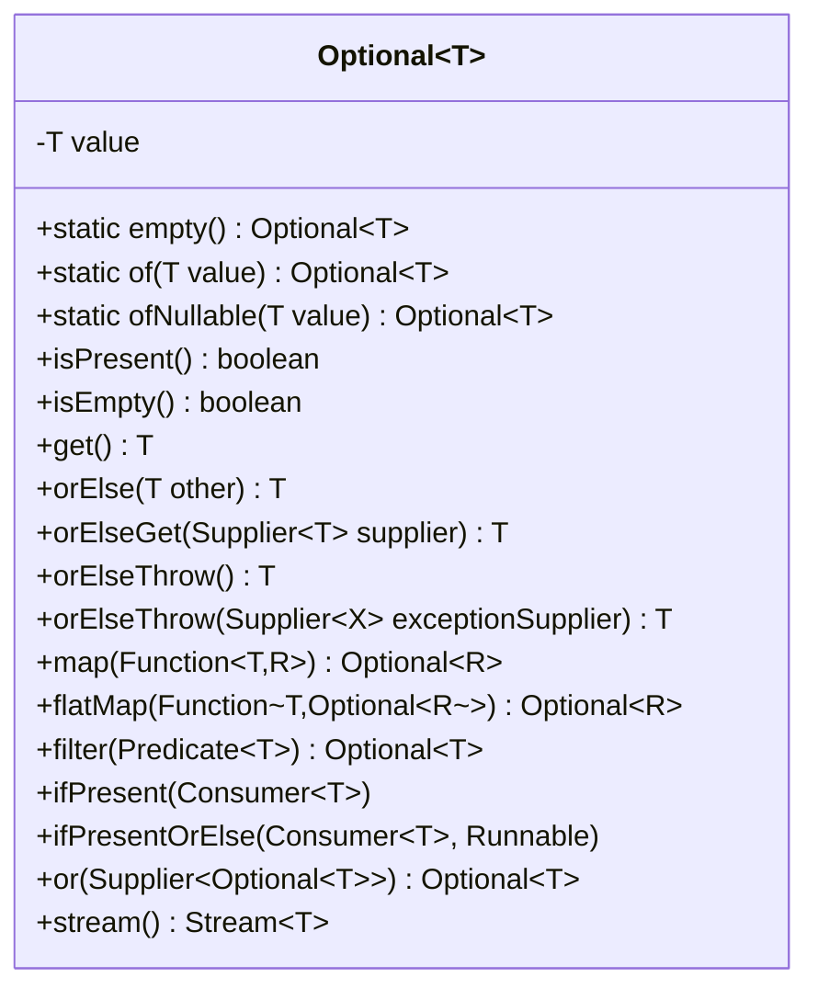

# 06.3. Optional Class

## Overview

`java.util.Optional<T>`, introduced in Java 8, is a container object that may or may not contain a non-null value. It is the JDK's answer to the billion-dollar mistake of null references: by making the possible absence of a value explicit in the type system, Optional forces developers to think about and handle the absence case rather than letting `NullPointerException` lurk at runtime.

This note is the comprehensive guide to Optional: what it is and is not, the API surface, the fluent pipeline methods (`map`, `flatMap`, `filter`, `orElse`, `orElseGet`, `orElseThrow`, `ifPresent`, `ifPresentOrElse`), the factory methods (`of`, `ofNullable`, `empty`), the interop with streams (`stream()`), the performance characteristics, the situations where Optional should not be used (fields, parameters, collections, keys), and the modern Java 21+ additions to the API.

## Background Knowledge

The null reference was invented by Tony Hoare in 1965 for the ALGOL W language. He later called it his "billion-dollar mistake" because of the countless bugs, crashes, and security vulnerabilities it has caused over six decades. Java inherited null references from C and C++, and they remain the source of most `NullPointerException` exceptions in production code.

The fundamental problem with `null` is that the type system cannot distinguish between a reference that may be null and one that cannot. Every reference type silently permits `null` as a value, so the compiler cannot warn you when you forget to check. Optional addresses this by making absence explicit: an `Optional<String>` either contains a String or is empty, and you cannot get to the String without first checking.

Optional is not a replacement for every null in Java. It is a return type for methods that may not have a result. Using it for fields, parameters, or collection elements is an anti-pattern that we will explain later in this note.

## The Optional API Surface

### Factory Methods

```java
import java.util.Optional;

// of: requires a non-null value. Throws NPE if null.
Optional<String> present = Optional.of("hello");

// ofNullable: accepts null and produces an empty Optional.
Optional<String> maybeMissing = Optional.ofNullable(getName());

// empty: produces an empty Optional.
Optional<String> empty = Optional.empty();
```

The choice between `of` and `ofNullable` depends on the contract of the value you are wrapping. If the value should never be null (and a null is a programming error), use `of` so the NPE is thrown at the right place. If the value may legitimately be null (for example, the result of a lookup), use `ofNullable`.

### Inspection Methods

```java
Optional<String> opt = Optional.of("hello");

opt.isPresent();      // true
opt.isEmpty();        // false (Java 11+)
opt.get();            // "hello" - throws NoSuchElementException if empty
```

`get()` is dangerous because it can throw `NoSuchElementException`. Prefer `orElse`, `orElseGet`, or `orElseThrow` with a meaningful message.

### Transformation Methods

```java
Optional<String> opt = Optional.of("hello");

// map: transform the value if present.
Optional<Integer> length = opt.map(String::length); // Optional[5]

// flatMap: transform with a function that returns Optional.
Optional<Integer> parsed = Optional.of("42").flatMap(s -> parse(s)); // Optional[42]

// filter: keep the value only if the predicate matches.
Optional<String> longEnough = opt.filter(s -> s.length() > 3); // Optional["hello"]
```

`map` wraps the result in an Optional automatically. `flatMap` does not wrap, because the function you pass already returns an Optional. This is the same distinction as `Stream.map` vs `Stream.flatMap`.

### Consumption Methods

```java
Optional<String> opt = Optional.of("hello");

// ifPresent: do something with the value if it exists.
opt.ifPresent(System.out::println); // prints "hello"

// ifPresentOrElse: do something if present, something else if not (Java 9+).
opt.ifPresentOrElse(
    System.out::println,
    () -> System.out.println("missing"));
```

### Value Extraction Methods

```java
Optional<String> opt = Optional.of("hello");
Optional<String> empty = Optional.empty();

// orElse: return the value or a default.
String a = opt.orElse("default"); // "hello"
String b = empty.orElse("default"); // "default"

// orElseGet: return the value or compute a default lazily.
String c = empty.orElseGet(() -> expensiveDefault()); // expensiveDefault() is called only if empty

// orElseThrow: return the value or throw.
String d = opt.orElseThrow(); // "hello" - throws NoSuchElementException if empty
String e = empty.orElseThrow(() -> new IllegalStateException("missing"));

// or: return the value or another Optional (Java 9+).
Optional<String> f = empty.or(() -> Optional.of("fallback")); // Optional["fallback"]
```

The difference between `orElse` and `orElseGet` is critical: `orElse` always evaluates its argument, even when the Optional is present. `orElseGet` evaluates its Supplier only when the Optional is empty. If the default value is expensive to compute, `orElseGet` is the right choice.

## The Full Pipeline

Optional methods are designed to chain fluently. A typical pipeline:

```java
import java.util.Optional;

public class UserService {
    public String findEmailByUserId(long id) {
        return findUserById(id)            // Optional<User>
            .map(User::email)              // Optional<String>
            .filter(email -> email.contains("@"))
            .map(String::toLowerCase)
            .orElse("unknown@example.com");
    }

    private Optional<User> findUserById(long id) {
        // ... database lookup ...
        return Optional.ofNullable(database.get(id));
    }
}
```

This is the modern equivalent of:

```java
public String findEmailByUserId(long id) {
    User user = database.get(id);
    if (user == null) return "unknown@example.com";
    String email = user.getEmail();
    if (email == null) return "unknown@example.com";
    if (!email.contains("@")) return "unknown@example.com";
    return email.toLowerCase();
}
```

The Optional version is more declarative, chains transformations naturally, and makes the absence handling explicit at each step.

## FlatMap for Nested Optionals

When a transformation itself returns an Optional, you must use `flatMap` to avoid `Optional<Optional<T>>`:

```java
public class UserService {
    public Optional<String> findEmail(long id) {
        return findUserById(id)              // Optional<User>
            .flatMap(user -> findEmailForUser(user)); // Optional<String>
    }

    private Optional<User> findUserById(long id) { /* ... */ }
    private Optional<String> findEmailForUser(User user) { /* ... */ }
}
```

If you used `map` here, you would get `Optional<Optional<String>>`, which is awkward to use. `flatMap` flattens one level.

## Stream Interop

Optional has a `stream()` method (Java 9+) that converts an Optional into a Stream of zero or one elements. This lets you flatMap Optional-returning functions over a stream:

```java
import java.util.stream.*;
import java.util.*;

List<User> users = /* ... */;

// For each user, get their email if present, and collect into a list.
List<String> emails = users.stream()
    .flatMap(user -> Optional.ofNullable(user.getEmail()).stream())
    .toList();

// Equivalent without Optional.stream():
List<String> emails2 = users.stream()
    .map(User::getEmail)
    .filter(Objects::nonNull)
    .toList();
```

The `Optional.stream()` method is most useful when you have an existing API that returns Optional and you want to integrate it with a stream pipeline.

## The Three Commandments of Optional

### Commandment 1: Never Use Optional for Fields

Optional is designed to be a return type, not a field type. The reasons:

1. Optional is a reference type itself, so a field of type `Optional<T>` can be null. You have not eliminated null; you have just added a layer.
2. Optional is not serializable (the JDK's Optional, that is; some libraries like Guava's are). Using it for fields breaks serialization.
3. Optional adds 16 bytes of overhead per instance (object header plus the wrapped value). For a class with many Optional fields, this adds up.
4. Optional's API encourages transformation, which is meaningful for return values but not for stored state.

For nullable fields, use `T` and check for null. Or use a sentinel value like `Optional.empty()` returned from a getter, but store the raw nullable `T` internally:

```java
public class User {
    private String email; // nullable internally

    public Optional<String> email() {
        return Optional.ofNullable(email);
    }
}
```

This pattern gives callers the safety of Optional without paying its cost on every instance.

### Commandment 2: Never Use Optional for Parameters

Optional parameters add no safety. The caller can still pass `null` (or forget to wrap), and the method body has to handle both. Use method overloading instead:

```java
// Bad: Optional parameter.
public void setEmail(Optional<String> email) {
    this.email = email.orElse(null);
}

// Good: two methods, one with email and one without.
public void setEmail(String email) {
    this.email = Objects.requireNonNull(email);
}
public void clearEmail() {
    this.email = null;
}
```

Or use `@Nullable` annotations to document the contract.

### Commandment 3: Never Use Optional for Collections or Keys

A collection that might be empty should be represented by an empty collection, not by `Optional<List<T>>`. Similarly, a map whose key might be absent should use `Map.get(key)` (which returns null) or `Map.getOrDefault`, not `Optional<Map<K, V>>`.

```java
// Bad: Optional<List<User>>.
public Optional<List<User>> getUsers() { /* ... */ }

// Good: return an empty list when there are no users.
public List<User> getUsers() {
    return users != null ? users : List.of();
}
```

The empty-list version is simpler, has no allocation overhead, and is what callers expect.

## When Optional Shines

Optional is at its best when:

1. **A method may not have a result, and the absence is a normal, expected outcome.** Lookups by ID, configuration lookups, parsing.
2. **The caller is likely to chain transformations on the result.** Optional's fluent API makes this natural.
3. **The absence needs to propagate through multiple layers.** Optional's `flatMap` lets you compose operations without checking for null at each level.
4. **The absence has a clear semantic meaning.** "User not found" is a meaningful absence; "null because I forgot to initialize" is not.

## Performance Characteristics

Optional is a heap-allocated object. Each `Optional.of(x)` creates a new instance. In Java 9+, `Optional.empty()` returns a cached singleton, so empty Optionals are free.

| Operation | Cost |
|---|---|
| `Optional.empty()` | One cached singleton lookup |
| `Optional.of(x)` | One allocation |
| `Optional.ofNullable(x)` | One allocation if non-null, cached singleton if null |
| `isPresent()` | One boolean read |
| `get()` | One field read (or NPE if empty) |
| `map(f)` | One allocation if present, cached singleton if empty |
| `orElse(x)` | Always evaluates x |
| `orElseGet(s)` | Evaluates s only if empty |

In tight loops, the allocation per `Optional.of` can add measurable GC pressure. For primitive-heavy code, prefer primitive streams (`IntStream`, `LongStream`, `DoubleStream`), which have `OptionalInt`, `OptionalLong`, and `OptionalDouble` variants that avoid boxing.

```java
OptionalInt max = IntStream.of(1, 2, 3).max();
// OptionalInt is a specialized type that stores an int and an isPresent boolean.
// No boxing, no Optional allocation.
```

## The Primitive Specializations

The JDK provides three primitive Optional types to avoid boxing:

- `OptionalInt`: holds an int
- `OptionalLong`: holds a long
- `OptionalDouble`: holds a double

They have a narrower API than `Optional<T>`: no `map`, `flatMap`, or `filter`. They exist primarily as return types from primitive stream reductions like `max`, `min`, `average`, `findFirst`.

```java
OptionalInt max = IntStream.of(1, 2, 3).max();
int result = max.orElse(-2147483648); // Integer minimum value as a literal
```

There are no `OptionalBoolean`, `OptionalByte`, `OptionalShort`, `OptionalChar`, or `OptionalFloat` in the JDK. The design decision was that these would add too much API surface for too little benefit.

## Common Patterns

### Pattern 1: Wrap a Nullable Lookup

```java
public Optional<User> findById(long id) {
    return Optional.ofNullable(database.get(id));
}
```

### Pattern 2: Chain Optional-Returning Methods

```java
public Optional<Order> findActiveOrder(long userId) {
    return findById(userId)
        .flatMap(user -> orderRepo.findActiveForUser(user.id()));
}
```

### Pattern 3: Provide a Default

```java
public String findEmailOrDefault(long id, String defaultValue) {
    return findById(id)
        .map(User::email)
        .orElse(defaultValue);
}
```

### Pattern 4: Lazy Default

```java
public String findEmailOrCompute(long id) {
    return findById(id)
        .map(User::email)
        .orElseGet(() -> generateDefaultEmail(id));
}
```

### Pattern 5: Throw a Domain Exception

```java
public User findExisting(long id) {
    return findById(id)
        .orElseThrow(() -> new UserNotFoundException(id));
}
```

### Pattern 6: Side Effect If Present

```java
findById(id).ifPresent(user -> audit.log("found user " + user.id()));
```

### Pattern 7: Side Effect Either Way

```java
findById(id).ifPresentOrElse(
    user -> audit.log("found user " + user.id()),
    () -> audit.log("user not found: " + id));
```

### Pattern 8: Compose With Another Optional

```java
public Optional<User> findUser(long id) {
    return findById(id)
        .or(() -> findInCache(id))
        .or(() -> findInRemoteService(id));
}
```

### Pattern 9: Filter Then Map

```java
public Optional<String> findAdminEmail(long id) {
    return findById(id)
        .filter(User::isAdmin)
        .map(User::email);
}
```

### Pattern 10: Convert to Stream and FlatMap

```java
List<String> emails = userIds.stream()
    .map(this::findById)
    .flatMap(Optional::stream)
    .map(User::email)
    .toList();
```

## Deep Dive: Optional Internals and Implementation

The JDK's `Optional<T>` is a final class with two private fields: the value (of type T) and no flag (presence is determined by `value != null`). The class is intentionally minimal.



### The Empty Singleton

`Optional.empty()` returns a cached singleton. The first call creates the instance; subsequent calls return the same one. This means there is exactly one empty Optional per JVM, shared across all types. Because the value field is null in the empty Optional, the type parameter is irrelevant.

This caching is the reason that `Optional.ofNullable(null)` is essentially free: it just returns the cached empty singleton without allocating.

### Allocation Cost

Each `Optional.of(x)` (with non-null x) allocates a new Optional instance. The instance has an object header (typically 12 or 16 bytes depending on compressed oops) plus a reference to the wrapped value (4 or 8 bytes). So an Optional is roughly 16 to 24 bytes on the heap.

In a tight loop creating millions of Optionals, this becomes measurable GC pressure. JIT escape analysis can sometimes eliminate the allocation if the Optional does not escape the method, but this is not guaranteed.

### Why Optional Is Final

Optional is declared `final` to prevent subclassing. Subclassing would break the singleton optimization for `empty()` (a subclass instance could not be the singleton) and would let users add state to what should be a value-like container.

### Why Optional Is Not Serializable

Optional implements neither `Serializable` nor `Externalizable`. The JDK designers explicitly decided against this to discourage using Optional for long-term storage or network transmission. If you need to serialize an absent-value representation, use null (in the serialized form) and convert to Optional at the API boundary.

### Why Optional Does Not Implement Iterable

You might expect Optional to be iterable like a collection of zero or one element, but it does not implement `Iterable`. The `stream()` method (Java 9+) provides the equivalent functionality: `opt.stream()` returns a `Stream<T>` with zero or one element, which you can iterate or flatMap.

### Optional vs Java's Null

| Property | null | Optional.empty() |
|---|---|---|
| Type system | Allowed for any reference type | Explicit wrapper type |
| Compiler checks | None | Must call methods to access |
| Default for fields | Yes (null) | No (must initialize) |
| Allocation | Free | One singleton (for empty) |
| Usable as map key | Yes (but error-prone) | Yes (but the result is rarely useful) |
| Serializable | Yes (for Serializable types) | No |
| Composable | Only with manual null checks | Fluent map, flatMap, filter |

### The Conceptual Model

Optional is best thought of as a short-lived value container that flows through a pipeline. It is created at one point (a lookup), transformed through several operations, and consumed at the end (with `orElse` or `orElseThrow`). It is not meant to be stored long-term; if you find yourself holding an Optional for any length of time, you are probably using it wrong.

This is the same model as `Stream`: short-lived, single-use, terminal operation at the end. Both Optional and Stream are designed to be created, transformed, and consumed in a single expression.

## Comparison With Other Languages and Libraries

### Guava Optional

Guava's `com.google.common.base.Optional` predates the JDK version. It lacks the fluent `map`, `flatMap`, and `filter` methods (it has `transform` which is similar to `map` but more limited). If you are using Guava Optional in legacy code, migrate to the JDK version when convenient.

### Scala Option

Scala's `Option[T]` is a sealed abstract class with two subclasses: `Some[T]` and `None`. It supports pattern matching, which the JDK version cannot do directly (though Java 21 pattern matching for switch can match Optional values somewhat awkwardly via instanceof). Scala's Option is more deeply integrated into the language and the standard library than the JDK's.

### Vavr Try and Option

Vavr (formerly Javaslang) provides `Option<T>` and `Try<T>` types that are more functional-programming-oriented than the JDK versions. Vavr's Option is serializable and integrates with Vavr's `List`, `Map`, and pattern matching API.

### Kotlin Nullable Types

Kotlin's `T?` syntax integrates nullability into the type system at compile time. The compiler enforces null checks, eliminating the need for a runtime Optional wrapper. This is the model Java would have followed if backward compatibility had allowed it.

## Modern Java (21+) Additions

Java has added a few minor conveniences to Optional over the years:

- **Java 9**: `or()`, `ifPresentOrElse()`, `stream()`.
- **Java 10**: `orElseThrow()` without arguments.
- **Java 11**: `isEmpty()`.

Java 21 does not add new Optional methods, but pattern matching for switch can be used with Optional via guard expressions:

```java
String result = switch (opt) {
    case Optional<String> o when o.isPresent() -> o.get().toUpperCase();
    case Optional<String> o when o.isEmpty() -> "default";
    default -> throw new IllegalStateException("unexpected");
};
```

This is not as elegant as Scala's `case Some(x) => ...; case None => ...` but it works.

## Common Pitfalls

### Pitfall 1: Using get() Without Checking

```java
Optional<String> opt = findById(id);
String value = opt.get(); // throws NoSuchElementException if empty
```

Prefer `orElse`, `orElseGet`, or `orElseThrow` with a meaningful message.

### Pitfall 2: Using orElse With an Expensive Default

```java
// The expensiveDefault() call runs even if opt is present.
String value = opt.orElse(expensiveDefault());

// Use orElseGet to defer the computation.
String value = opt.orElseGet(() -> expensiveDefault());
```

### Pitfall 3: Using Optional for Fields

```java
public class User {
    private Optional<String> email; // anti-pattern
}
```

Use a nullable `String email` internally and expose it via `Optional<String> email()` if needed.

### Pitfall 4: Using Optional for Parameters

```java
public void setEmail(Optional<String> email) { // anti-pattern
    this.email = email.orElse(null);
}
```

Use method overloading or a nullable parameter.

### Pitfall 5: Using Optional for Collections

```java
public Optional<List<User>> getUsers() { // anti-pattern
    return Optional.ofNullable(database.all());
}
```

Return an empty list instead.

### Pitfall 6: Using Optional.of(null)

```java
Optional<String> opt = Optional.of(null); // throws NullPointerException
```

Use `Optional.ofNullable(null)` if null is a legitimate input.

### Pitfall 7: Forgetting That Map Wraps the Result

```java
Optional<Optional<String>> wrong = findById(id).map(u -> Optional.of(u.email()));

Optional<String> right = findById(id).map(u -> u.email()); // map wraps the String
// Or:
Optional<String> right2 = findById(id).flatMap(u -> Optional.ofNullable(u.email()));
```

### Pitfall 8: Serializing Optional

The JDK's Optional is not Serializable. If your class is Serializable, do not use Optional for fields. Use the nullable-field-with-Optional-getter pattern.

### Pitfall 9: Using Optional as a Map Key

Optional does not implement `equals` and `hashCode` usefully enough to be a map key (well, it does, but the result is usually not what you want). Use the underlying value as the key.

### Pitfall 10: Using Optional for Conditionals

```java
// Bad: using Optional just for an if-else.
Optional.ofNullable(value)
    .ifPresentOrElse(
        v -> process(v),
        () -> handleMissing());

// Good: just write the if-else.
if (value != null) {
    process(value);
} else {
    handleMissing();
}
```

Optional is for transformation pipelines, not for replacing simple if-else.

### Pitfall 11: Treating Optional as a General Null-Check Tool

Optional is not a replacement for `@Nullable` annotations or `Objects.requireNonNull`. It is a return type for methods that may not have a result. Use it where the absence has semantic meaning, not as a wrapper for every nullable value.

## Tips and Tricks

### Tip 1: Use orElseThrow() Without an Argument (Java 10+)

```java
String value = opt.orElseThrow();
// Throws NoSuchElementException with a default message.
```

Useful for cases where the absence is genuinely impossible.

### Tip 2: Use ifPresentOrElse for Both Branches (Java 9+)

```java
opt.ifPresentOrElse(
    value -> System.out.println("got " + value),
    () -> System.out.println("missing"));
```

### Tip 3: Use or() to Compose Fallbacks (Java 9+)

```java
Optional<User> user = findById(id)
    .or(() -> findInCache(id))
    .or(() -> findInRemote(id));
```

### Tip 4: Use stream() to Integrate With Stream Pipelines

```java
List<User> found = ids.stream()
    .map(this::findById)
    .flatMap(Optional::stream)
    .toList();
```

### Tip 5: Use isEmpty() for Negation (Java 11+)

```java
if (opt.isEmpty()) {
    // handle missing
}
```

Is clearer than `if (!opt.isPresent())`.

### Tip 6: Use Primitive Specializations in Hot Loops

```java
OptionalInt max = ints.stream().mapToInt(Integer::intValue).max();
```

Avoids boxing overhead.

### Tip 7: Use Optional as the Return Type of Find Methods

```java
public Optional<User> findById(long id) { ... }
public Optional<Config> findConfig(String key) { ... }
public Optional<Path> findFirstExisting(List<Path> candidates) { ... }
```

### Tip 8: Document Why You Use of vs ofNullable

```java
public Optional<User> findById(long id) {
    User user = database.get(id); // may legitimately be null
    return Optional.ofNullable(user);
}

public void process(User user) {
    User enriched = Optional.of(user) // user should never be null
        .map(u -> enricher.enrich(u))
        .orElseThrow();
}
```

### Tip 9: Use Optional to Avoid Returning Null Maps

```java
public Map<String, String> getHeaders() {
    if (headers == null) return Map.of();
    return headers;
}

public Optional<String> getHeader(String name) {
    return Optional.ofNullable(headers != null ? headers.get(name) : null);
}
```

### Tip 10: Use orElseThrow With a Lambda for Custom Exceptions

```java
User user = findById(id)
    .orElseThrow(() -> new UserNotFoundException(id));
```

The lambda is evaluated only when the Optional is empty, so exception construction is deferred.

## Interview Questions

### Q1: What is Optional?

A container object that may or may not contain a non-null value. It is used as a return type for methods that may not have a result, making the absence explicit in the type system.

### Q2: What is the difference between `of` and `ofNullable`?

`of` requires a non-null value and throws `NullPointerException` if null. `ofNullable` accepts null and returns an empty Optional.

### Q3: What is the difference between `orElse` and `orElseGet`?

`orElse` always evaluates its argument, even when the Optional is present. `orElseGet` evaluates its Supplier only when the Optional is empty. For expensive defaults, use `orElseGet`.

### Q4: Why should you not use Optional for fields?

Optional is not serializable, adds allocation overhead, can itself be null (defeating the purpose), and its API encourages transformation rather than state storage. Use a nullable field internally and expose it via an Optional-returning getter.

### Q5: Why should you not use Optional for parameters?

Optional parameters add no safety (the caller can still pass null), add overhead, and complicate the method signature. Use method overloading or `@Nullable` annotations.

### Q6: What is the difference between `map` and `flatMap` on Optional?

`map` wraps the result of the function in an Optional automatically. `flatMap` requires the function to return an Optional and does not wrap again. Use `flatMap` when the transformation itself returns an Optional.

### Q7: How does Optional interoperate with streams?

Optional has a `stream()` method (Java 9+) that produces a Stream of zero or one element. This lets you flatMap Optional-returning functions over a stream.

### Q8: What are the primitive Optional variants?

`OptionalInt`, `OptionalLong`, and `OptionalDouble`. They exist to avoid autoboxing in primitive stream reductions.

### Q9: Is Optional serializable?

No, the JDK's `java.util.Optional` is not Serializable. If you need serializable absent-value handling, use a nullable field or a library alternative like Guava's Optional.

### Q10: What does `Optional.get()` do?

Returns the value if present, throws `NoSuchElementException` if empty. It is dangerous; prefer `orElse`, `orElseGet`, or `orElseThrow`.

### Q11: What is the `or()` method (Java 9+)?

Returns the value if present, otherwise returns the Optional produced by the Supplier. Useful for composing fallbacks:

```java
opt.or(() -> anotherOpt);
```

### Q12: What is `ifPresentOrElse` (Java 9+)?

A method that takes two Runnables: one to run if the value is present, one to run if it is empty.

### Q13: What is the cost of using Optional?

Each non-empty Optional is a heap-allocated object. In tight loops, this can add measurable GC pressure. For primitive-heavy code, use the primitive Optional variants or primitive streams.

### Q14: When should you not use Optional?

For fields, parameters, collection elements, map keys, or as a general null-check tool. Optional is for return types of methods that may not have a result.

### Q15: How does Optional relate to null?

Optional does not eliminate null; it makes its possibility explicit in the type system. A reference of type `Optional<T>` can itself be null (if you assign null to it), so the rule "never assign null to an Optional variable" must be enforced by convention, not by the compiler.

## Summary

`Optional<T>` is a container object that explicitly represents the possible absence of a value, addressing the billion-dollar mistake of null references. It is best used as the return type of methods that may not have a result, where the absence is a normal, expected outcome and the caller benefits from a fluent transformation API. The three commandments of Optional are: never use it for fields, never use it for parameters, and never use it for collections or keys. Within those constraints, Optional makes absence handling declarative, composable, and safer than scattering null checks throughout your codebase. The next note, 06.4, covers the Streams API, which uses Optional and functional interfaces extensively for declarative data processing.
