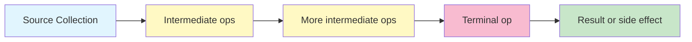
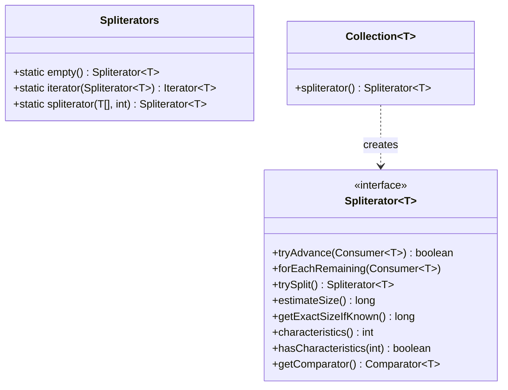
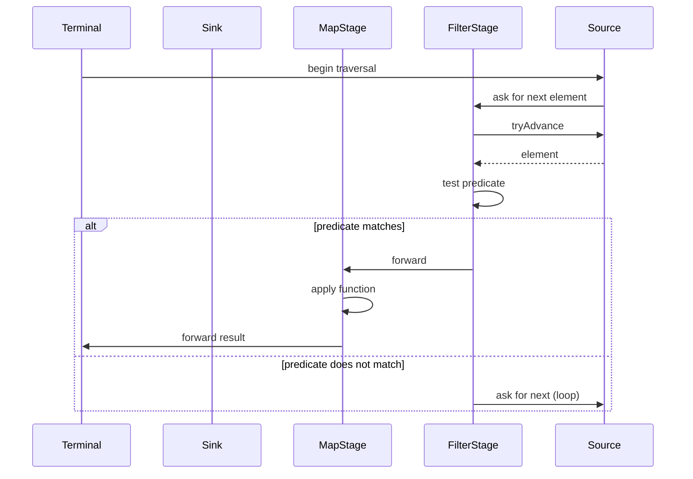

# 06.4. Streams API

## Overview

The Streams API, introduced in Java 8, is a declarative API for processing sequences of elements. It supports filter, map, reduce, match, search, and other operations in a fluent pipeline. Unlike the Java Collections Framework, which is about storing and accessing data, Streams is about describing computations on data. The two frameworks interoperate (any `Collection` can produce a `Stream`) but serve distinct purposes.

This note is the comprehensive guide to Streams: the architecture (source, intermediate operations, terminal operation), the lazy evaluation model, short-circuiting operations, internal iteration, the Spliterator abstraction, parallel streams and their pitfalls, primitive streams, and the design philosophy that makes Streams the foundation of modern Java data processing.

## Background Knowledge

Before Streams, data processing in Java meant explicit for-loops:

```java
List<String> longNames = new ArrayList<>();
for (String name : names) {
    if (name.length() > 3) {
        longNames.add(name.toUpperCase());
    }
}
```

This is fine for simple cases but verbose for complex pipelines: sort, group, count, join. Streams let you write the same code declaratively:

```java
List<String> longNames = names.stream()
    .filter(name -> name.length() > 3)
    .map(String::toUpperCase)
    .toList();
```

The streams version is shorter, composable, and amenable to parallelization. It also enables fusion: filter, map, and collect happen in a single pass over the data, rather than three passes.

## Stream Architecture

A Stream has three components:

1. **A source**: a collection, an array, a generator function, an I/O channel, or another stream.
2. **Zero or more intermediate operations**: filter, map, flatMap, distinct, sorted, peek, limit, skip, takeWhile, dropWhile. These transform a stream into another stream. They are lazy: they do not execute until a terminal operation is invoked.
3. **A terminal operation**: forEach, collect, reduce, count, min, max, anyMatch, allMatch, noneMatch, findFirst, findAny, toArray. These produce a result or side effect and consume the stream.



A stream is single-use. Once a terminal operation is invoked, the stream is consumed and cannot be reused. To reprocess the same data, create a new stream from the source.

## Lazy Evaluation

Intermediate operations are lazy. They do not execute when called; they just record their intent on the stream. The actual processing happens only when a terminal operation is invoked.

```java
Stream<String> stream = names.stream()
    .filter(name -> {
        System.out.println("filtering " + name);
        return name.length() > 3;
    })
    .map(name -> {
        System.out.println("mapping " + name);
        return name.toUpperCase();
    });

System.out.println("Stream created, no output yet");
// At this point, neither filter nor map has been called.

List<String> result = stream.toList();
// Now the operations execute, interleaved element by element.
```

### Element-by-Element Processing

Lazy evaluation enables element-by-element processing. The pipeline does not first filter all elements, then map all elements. Instead, for each element pulled through the terminal operation, the pipeline runs filter, then map, then the terminal step.

This means a pipeline with `findFirst` over a million-element stream that finds its result on the third element runs the filter and map on only three elements, not a million. The other 999,997 are never touched.

### Fusion

The Streams implementation can fuse multiple operations into a single pass. A pipeline like `stream.filter(p).map(m).collect(c)` typically runs as a single loop that, for each element, evaluates p, then if true evaluates m, then feeds the result to c. This eliminates intermediate collections and is dramatically faster than the equivalent code with intermediate lists.

### Short-Circuiting Operations

Some operations are short-circuiting: they can produce a result without consuming the entire source.

- `findFirst()`: stops after the first matching element.
- `findAny()`: stops after finding any matching element (more efficient in parallel).
- `anyMatch(p)`: stops as soon as one element matches.
- `allMatch(p)`: stops as soon as one element does not match.
- `noneMatch(p)`: stops as soon as one element matches.
- `limit(n)`: emits only the first n elements.
- `takeWhile(p)`: takes elements while the predicate is true (Java 9+).
- `dropWhile(p)`: drops elements while the predicate is true (Java 9+).

```java
// This pipeline processes only three elements, even if the source has millions.
Optional<String> firstLong = names.stream()
    .filter(name -> name.length() > 3)
    .findFirst();
```

## Internal Iteration

Collections support external iteration: the caller writes the loop and controls the iteration order. Streams use internal iteration: the stream itself manages the iteration, and the caller declaratively describes what to do with each element.

```java
// External iteration: caller controls the loop.
List<String> result = new ArrayList<>();
for (String name : names) {
    if (name.length() > 3) {
        result.add(name.toUpperCase());
    }
}

// Internal iteration: stream controls the loop.
List<String> result2 = names.stream()
    .filter(name -> name.length() > 3)
    .map(String::toUpperCase)
    .toList();
```

Internal iteration has two big advantages:

1. The stream implementation can choose the optimal iteration strategy (sequential, parallel, fused, lazy).
2. The caller's code is more declarative and easier to optimize.

The disadvantage is that the caller has less control: you cannot easily break out of an internal iteration (no equivalent of `break`), and debugging can be harder because the iteration order is not obvious.

## The Spliterator Abstraction

The `Spliterator<T>` interface (Java 8) is the internal iterator that powers streams. It combines the roles of `Iterator` and `Iterable` with support for parallel decomposition.



### The tryAdvance Method

`tryAdvance(Consumer<T>)` processes the next element if one exists, returning true; returns false if no more elements. It is the equivalent of `Iterator.hasNext` plus `Iterator.next` in a single call, avoiding the boxing of returning the element.

### The forEachRemaining Method

`forEachRemaining(Consumer<T>)` processes all remaining elements. The default implementation calls `tryAdvance` in a loop, but implementations can override this for efficiency (for example, ArrayList's spliterator uses a direct array traversal).

### The trySplit Method

`trySplit()` splits the spliterator into two parts: the returned spliterator covers some portion of the elements, and the original now covers the rest. This is the foundation of parallel stream decomposition. A perfect split divides the data exactly in half; in practice, splits are approximate.

### The characteristics Method

`characteristics()` returns an int bitmask of the spliterator's properties:

- `ORDERED`: elements have a defined encounter order (e.g., List).
- `DISTINCT`: no duplicate elements (e.g., Set).
- `SORTED`: elements are in sorted order.
- `SIZED`: `estimateSize()` returns an exact count.
- `NONNULL`: elements are guaranteed non-null.
- `IMMUTABLE`: the source cannot be structurally modified.
- `CONCURRENT`: the source is thread-safe (modifications do not need external synchronization).
- `SUBSIZED`: all spliterators resulting from `trySplit` are also `SIZED`.

These characteristics drive optimization decisions in the Streams implementation. For example, a `SIZED` spliterator allows the stream to pre-allocate the result collection. An `ORDERED` spliterator forces sequential semantics for `findFirst` and `limit`.

## Creating Streams

### From Collections

```java
Stream<String> s = list.stream();        // sequential
Stream<String> p = list.parallelStream(); // parallel
```

### From Arrays

```java
IntStream s = Arrays.stream(new int[]{1, 2, 3});
Stream<String> s2 = Arrays.stream(new String[]{"a", "b"});
```

### From Static Factory Methods

```java
Stream<Integer> empty = Stream.empty();
Stream<Integer> single = Stream.of(1);
Stream<Integer> multiple = Stream.of(1, 2, 3);
Stream<Integer> generated = Stream.generate(() -> 1);
Stream<Integer> iterated = Stream.iterate(0, x -> x + 1);
Stream<Integer> iteratedWithStop = Stream.iterate(0, x -> x < 10, x -> x + 1); // Java 9+
```

### From Functions (Infinite Streams)

```java
Stream<Double> randoms = Stream.generate(Math::random);
Stream<BigInteger> naturals = Stream.iterate(BigInteger.ZERO, BigInteger.ONE::add);
```

Infinite streams are useful with short-circuiting operations:

```java
List<Integer> first100 = Stream.iterate(1, x -> x + 1).limit(100).toList();
```

### From Files

```java
try (Stream<String> lines = Files.lines(Path.of("file.txt"))) {
    long count = lines.filter(line -> line.contains("error")).count();
}
```

`Files.lines` returns a Stream backed by a file. The stream must be closed (typically with try-with-resources) to release the underlying file handle.

### From Other Sources

```java
IntStream.range(0, 10);           // 0..9
IntStream.rangeClosed(0, 10);     // 0..10
IntStream.of(1, 2, 3);
DoubleStream.of(1.0, 2.0);
BitSet.valueOf(...).stream();     // ints of set bits
Stream<String> lines = new BufferedReader(reader).lines();
```

## Intermediate Operations

### filter

```java
stream.filter(name -> name.length() > 3);
```

Keeps elements matching the predicate.

### map

```java
stream.map(String::length);
```

Transforms each element with a function. The result type can differ from the input.

### flatMap

```java
stream.flatMap(order -> order.getItems().stream());
```

Transforms each element into a stream and flattens the result. Used for one-to-many transformations.

### distinct

```java
stream.distinct();
```

Removes duplicates. Uses `equals` and `hashCode`.

### sorted

```java
stream.sorted();                       // natural order
stream.sorted(Comparator.reverseOrder());
stream.sorted(Comparator.comparing(User::name));
```

Sorts the stream. For stateful operations, the entire stream must be buffered.

### peek

```java
stream.peek(System.out::println);
```

Performs an action on each element without consuming it. Useful for debugging, but its use in production code is controversial because the spec does not guarantee execution order in all cases (especially with optimizations like fusion).

### limit

```java
stream.limit(10);
```

Truncates to the first n elements. Short-circuiting.

### skip

```java
stream.skip(10);
```

Drops the first n elements.

### takeWhile, dropWhile (Java 9+)

```java
stream.takeWhile(x -> x > 0);   // takes while predicate is true
stream.dropWhile(x -> x > 0);   // drops while predicate is true, then emits the rest
```

Different from `filter` because they stop at the first non-matching element.

## Terminal Operations

### forEach

```java
stream.forEach(System.out::println);
```

Performs an action on each element. The action should be side-effect-free for parallel streams.

### forEachOrdered

```java
stream.parallel().forEachOrdered(System.out::println);
```

Performs an action on each element in encounter order, even for parallel streams. Slower than `forEach` for parallel streams.

### collect

```java
stream.collect(Collectors.toList());
stream.collect(Collectors.groupingBy(User::department));
```

Collects the stream into a container. Covered in depth in 06.5.

### reduce

```java
Optional<Integer> sum = stream.reduce(Integer::sum);
int sumWithIdentity = stream.reduce(0, Integer::sum);
```

Reduces the stream to a single value using an associative binary operator.

### count

```java
long count = stream.count();
```

Counts the elements. May not traverse the stream if the source is `SIZED`.

### min, max

```java
Optional<String> min = stream.min(Comparator.naturalOrder());
Optional<String> max = stream.max(Comparator.naturalOrder());
```

### anyMatch, allMatch, noneMatch

```java
boolean anyLong = stream.anyMatch(name -> name.length() > 3);
boolean allLong = stream.allMatch(name -> name.length() > 3);
boolean noneLong = stream.noneMatch(name -> name.length() > 3);
```

Short-circuiting.

### findFirst, findAny

```java
Optional<String> first = stream.findFirst();
Optional<String> any = stream.findAny();
```

Short-circuiting. `findFirst` returns the first element in encounter order. `findAny` returns any element (more efficient in parallel because it does not require encounter order).

### toArray

```java
Object[] arr = stream.toArray();
String[] arr2 = stream.toArray(String[]::new);
```

## Primitive Streams

The JDK provides three primitive stream types to avoid autoboxing:

- `IntStream`: int elements.
- `LongStream`: long elements.
- `DoubleStream`: double elements.

They have specialized intermediate operations:

```java
IntStream.range(0, 10)
    .map(x -> x * 2)
    .filter(x -> x > 5)
    .sum();
```

And specialized terminal operations:

```java
int sum = ints.sum();
OptionalDouble avg = ints.average();
OptionalInt max = ints.max();
IntSummaryStatistics stats = ints.summaryStatistics();
```

`IntSummaryStatistics` carries count, sum, min, average, and max in a single pass.

### Conversion Between Streams

```java
Stream<String> strings = /* ... */;
IntStream lengths = strings.mapToInt(String::length);
Stream<Integer> boxed = lengths.boxed();
```

## Parallel Streams

Any stream can be made parallel:

```java
list.parallelStream().map(x -> x * 2).sum();
// or
list.stream().parallel().map(x -> x * 2).sum();
```

A parallel stream uses the common `ForkJoinPool` to split the work across multiple threads. The spliterator's `trySplit` method is used to divide the source.

### When Parallel Streams Help

Parallel streams help when:

1. The source is large (typically tens of thousands of elements or more).
2. The per-element work is computationally expensive (the cost of splitting and merging must be amortized).
3. The operations are stateless and side-effect-free.
4. The result ordering does not matter (or you use `forEachOrdered`).

### When Parallel Streams Hurt

```java
// Pitfall 1: small source, not worth the parallel overhead.
listOf10.parallelStream().map(x -> x * 2).sum();

// Pitfall 2: cheap per-element work; parallel overhead exceeds the savings.
ints.parallelStream().mapToInt(Integer::intValue).sum();

// Pitfall 3: shared mutable state.
List<Integer> result = new ArrayList<>();
list.parallelStream().forEach(result::add); // race condition, data corruption

// Pitfall 4: blocking I/O.
files.parallelStream().map(this::readFile).toList();
// This blocks ForkJoinPool.commonPool() threads, affecting all parallel streams in the JVM.

// Pitfall 5: ordering constraints.
list.parallelStream().sorted().forEachOrdered(System.out::println);
// Sorting requires full traversal and merge; the sequential overhead is high.
```

### The Common ForkJoinPool

Parallel streams use `ForkJoinPool.commonPool()` by default. This pool is shared across the entire JVM. If one stream blocks a pool thread (for example, on I/O), other parallel streams in other parts of the application suffer.

The default parallelism level is `Runtime.getRuntime().availableProcessors() - 1`. You can override this with `-Djava.util.concurrent.ForkJoinPool.common.parallelism=N`.

To run a parallel stream on a different pool, you have two options:

1. Submit the stream operation as a task to a custom ForkJoinPool:
   ```java
   ForkJoinPool customPool = new ForkJoinPool(4);
   customPool.submit(() -> stream.parallel().map(...).toList()).get();
   ```

2. Use a custom spliterator or collector that does not rely on the common pool (more advanced).

### Correct Use of Parallel Streams

```java
// Good: large source, expensive per-element work, no shared state.
long total = numbers.parallelStream()
    .mapToLong(this::expensiveComputation)
    .sum();
```

```java
// Good: large source, simple reduction, no ordering requirement.
Set<String> unique = lines.parallelStream()
    .filter(line -> line.contains("error"))
    .collect(Collectors.toSet());
```

## Deep Dive: Stream Pipeline Internals

To understand how streams actually execute, it helps to trace what happens when a terminal operation is invoked. The implementation builds a pipeline of "stage" objects, each wrapping the previous stage and recording the operation (filter, map, etc.) plus the user-supplied function.



### The Sink Interface

Internally, the stream pipeline uses `Sink<T>` (a specialization of `Consumer<T>`) to pass elements from one stage to the next. Each stage implements a `Sink` that wraps the downstream `Sink`. The chain looks like:

```
Source -> FilterSink -> MapSink -> TerminalSink
```

Each `Sink` has three methods: `begin(size)`, `accept(value)`, and `end()`. `begin` lets downstream stages prepare (for example, the sorted sink allocates an array based on the size if known). `accept` passes a value through. `end` lets stages flush state (for example, the sorted sink emits its sorted array).

### Stateful Operations

Stateless operations like `filter` and `map` do not need to buffer elements; they can process element-by-element. Stateful operations like `sorted`, `distinct`, and `limit` need to buffer:

- `sorted` buffers all elements, sorts them, then emits in order.
- `distinct` buffers a `HashSet` of seen elements.
- `limit` counts elements and stops after n.

Stateful operations break fusion: the pipeline must traverse the source, buffer, then traverse the buffer.

### Short-Circuit Behavior

Short-circuiting operations like `findFirst` and `anyMatch` request cancellation. The terminal `Sink` returns `false` from `cancellationRequested()`, and upstream stages stop calling `accept` once cancellation is requested.

This is why `stream.filter(...).findFirst()` over a million-element stream with a match on the third element runs the filter on only three elements: the terminal cancels after the first match.

### Parallel Execution

In a parallel stream, the source's spliterator is split into multiple sub-splitters. Each sub-spliterator is processed by a separate ForkJoinPool task. The intermediate stages run on each task's thread, accumulating into thread-local results. The terminal operation merges the thread-local results using the combiner function.

For `collect`, the combiner is the third argument to `Collector.of` (or automatically provided by built-in collectors). For `reduce`, it is the third argument to `reduce(identity, accumulator, combiner)`.

### Encountered Order

Many operations respect the encounter order of the source. For a `List`, the encounter order is the iteration order. For a `HashSet`, there is no encounter order (the spliterator is not `ORDERED`).

Operations that depend on encounter order include: `limit`, `skip`, `findFirst`, `forEachOrdered`, `sorted` (with stable sort), and `takeWhile`/`dropWhile`. In parallel streams, preserving encounter order requires merging results in order, which can be expensive.

Operations that do not depend on encounter order include: `map`, `filter`, `reduce` (with associative operator), `forEach`, `findAny`, `collect` (with unordered collectors).

For unordered sources, you can explicitly make a stream unordered with `unordered()` to enable more aggressive parallel optimization.

## Stream Versus For-Loop Performance

For simple pipelines, for-loops are often faster than streams because streams have setup overhead and lambda invocation cost. For complex pipelines (multiple filters, maps, reductions), streams can be faster because of fusion and JIT optimization.

| Operation | For-Loop | Stream (Sequential) | Stream (Parallel) |
|---|---|---|---|
| Simple filter | Faster | Slightly slower | Much slower (overhead) |
| Map-reduce over 1M elements | Similar | Similar | Faster (if CPU-bound) |
| Group-by on 10K elements | Faster | Similar | Slower |
| Group-by on 10M elements | Slower (no fusion) | Faster (fusion) | Fastest |

The rule of thumb: use streams for clarity, switch to for-loops only when profiling shows a measurable problem. The JIT and the Streams implementation have improved dramatically since Java 8; what was slow in 2014 is fast in 2024.

## Common Pitfalls

### Pitfall 1: Reusing a Stream

```java
Stream<String> s = list.stream();
s.filter(x -> x.length() > 3).count();
s.map(String::toUpperCase).toList(); // IllegalStateException: stream has already been operated upon
```

Create a new stream for each pipeline. If you need to reuse, wrap the source in a `Supplier<Stream>`:

```java
Supplier<Stream<String>> supplier = () -> list.stream();
supplier.get().filter(...).count();
supplier.get().map(...).toList();
```

### Pitfall 2: Side Effects in Lambdas

```java
List<String> result = new ArrayList<>();
list.parallelStream().map(x -> {
    result.add(x); // race condition, data corruption
    return x.toUpperCase();
}).toList();
```

Use `collect(Collectors.toList())` instead, which accumulates safely.

### Pitfall 3: Modifying the Source During Iteration

```java
List<String> list = new ArrayList<>(List.of("a", "b", "c"));
list.stream().forEach(s -> list.add(s.toUpperCase())); // ConcurrentModificationException
```

Streams are not iterator-safe against source modification. Use a copy or collect the result into a new list.

### Pitfall 4: Using peek for Side Effects

```java
List<String> seen = new ArrayList<>();
list.stream()
    .peek(seen::add) // unreliable
    .filter(s -> s.length() > 3)
    .toList();
```

`peek` is intended for debugging. The spec does not guarantee execution of `peek` for elements that are eliminated by short-circuiting or fusion optimizations. Use `map` or `forEach` for visible side effects.

### Pitfall 5: Assuming Order in Parallel Streams

```java
list.parallelStream().forEach(System.out::println);
```

The output order is non-deterministic. Use `forEachOrdered` if order matters.

### Pitfall 6: Blocking I/O in Parallel Streams

```java
files.parallelStream().map(this::readFile).toList();
```

This consumes common pool threads, affecting other parallel streams in the JVM. Use a dedicated executor for I/O.

### Pitfall 7: Using reduce With Non-Associative Operations

```java
// Bad: subtraction is not associative.
int result = stream.reduce(0, (a, b) -> a - b);
// (1 - 2) - 3 = -4, but 1 - (2 - 3) = 2. Parallel execution gives wrong answers.

// Good: use an associative operation like sum.
int sum = stream.reduce(0, Integer::sum);
```

### Pitfall 8: Forgetting That Infinite Streams Need Short-Circuiting

```java
Stream.iterate(0, x -> x + 1).map(x -> x * 2).toList();
// Hangs forever: no short-circuiting terminal operation.
```

Add `limit` or use `findFirst`:

```java
List<Integer> first10 = Stream.iterate(0, x -> x + 1)
    .map(x -> x * 2)
    .limit(10)
    .toList();
```

### Pitfall 9: Forgetting to Close File-Backed Streams

```java
Stream<String> lines = Files.lines(path);
long count = lines.filter(s -> s.contains("error")).count();
// Lines stream is not closed, leaking the file handle.
```

Use try-with-resources:

```java
try (Stream<String> lines = Files.lines(path)) {
    long count = lines.filter(s -> s.contains("error")).count();
}
```

### Pitfall 10: Using Collectors.toList() vs Stream.toList()

```java
// Java 16+: returns an unmodifiable list.
List<String> a = stream.toList();

// Pre-Java 16: returns a mutable ArrayList.
List<String> b = stream.collect(Collectors.toList());

// Mutating a from a stream pipeline:
List<String> a = stream.toList();
a.add("x"); // UnsupportedOperationException
```

Prefer `stream.toList()` (Java 16+) for unmodifiable results; use `Collectors.toList()` if you need a mutable list.

## Tips and Tricks

### Tip 1: Use Primitive Streams for Numeric Operations

```java
// Bad: autoboxes every element.
int sum = list.stream().map(Integer::intValue).reduce(0, Integer::sum);

// Good: no autoboxing.
int sum = list.stream().mapToInt(Integer::intValue).sum();
```

### Tip 2: Use Collectors.joining for String Concatenation

```java
String csv = list.stream().map(Object::toString).collect(Collectors.joining(", "));
```

### Tip 3: Use Collectors.groupingBy for Bucketing

```java
Map<Department, List<User>> byDept = users.stream()
    .collect(Collectors.groupingBy(User::department));
```

### Tip 4: Use Collectors.toMap for Lookup Tables

```java
Map<Long, User> byId = users.stream()
    .collect(Collectors.toMap(User::id, Function.identity()));
```

### Tip 5: Use Collectors.partitioningBy for Boolean Partition

```java
Map<Boolean, List<User>> byActive = users.stream()
    .collect(Collectors.partitioningBy(User::isActive));
```

### Tip 6: Use IntSummaryStatistics for Numeric Profiles

```java
IntSummaryStatistics stats = users.stream()
    .mapToInt(User::age)
    .summaryStatistics();
System.out.println(stats.getCount() + " " + stats.getAverage() + " " + stats.getMax());
```

### Tip 7: Use takeWhile for Prefix Extraction

```java
List<Integer> prefix = sorted.stream()
    .takeWhile(x -> x < 10)
    .toList();
```

### Tip 8: Use flatMap to Flatten Nested Structures

```java
List<Item> allItems = orders.stream()
    .flatMap(order -> order.getItems().stream())
    .toList();
```

### Tip 9: Use reduce for Custom Aggregation

```java
int totalLength = strings.stream()
    .reduce(0, (sum, s) -> sum + s.length(), Integer::sum);
```

The third argument is the combiner, used in parallel reduction.

### Tip 10: Use Stream.generate for Infinite Sequences

```java
List<Integer> randoms = Stream.generate(() -> ThreadLocalRandom.current().nextInt(100))
    .limit(10)
    .toList();
```

### Tip 11: Use Stream.iterate for Stateful Generators

```java
Stream<BigInteger> fibs = Stream.iterate(
    new BigInteger[]{BigInteger.ZERO, BigInteger.ONE},
    arr -> new BigInteger[]{arr[1], arr[0].add(arr[1])}
).map(arr -> arr[0]);
```

### Tip 12: Use Collectors.collectingAndThen for Post-Processing

```java
List<User> unmodifiable = users.stream()
    .collect(Collectors.collectingAndThen(
        Collectors.toList(),
        Collections::unmodifiableList));
```

Or simpler in Java 16+:

```java
List<User> unmodifiable = users.stream().toList();
```

## Interview Questions

### Q1: What is the difference between a Collection and a Stream?

A Collection is a data structure that stores elements and supports access. A Stream is a pipeline for describing computations on elements. A Collection is about storage; a Stream is about computation. A Stream is single-use; a Collection is reusable.

### Q2: What is lazy evaluation in Streams?

Intermediate operations are not executed when called; they just record their intent. The actual processing happens only when a terminal operation is invoked. This allows fusion (single-pass processing) and short-circuiting (early termination).

### Q3: What are short-circuiting operations?

Operations that can produce a result without consuming the entire source. Examples: `findFirst`, `findAny`, `anyMatch`, `allMatch`, `noneMatch`, `limit`, `takeWhile`, `dropWhile`.

### Q4: What is internal iteration?

The stream manages the iteration over elements, not the caller. The caller declaratively describes what to do with each element. This allows the stream implementation to choose the optimal iteration strategy.

### Q5: What is a Spliterator?

A `Spliterator<T>` is the internal iterator that powers streams. It supports `tryAdvance` (process one element), `forEachRemaining` (process all), and `trySplit` (split for parallel decomposition). It also reports characteristics like ORDERED, SIZED, and SORTED that drive optimization decisions.

### Q6: What are the spliterator characteristics?

ORDERED, DISTINCT, SORTED, SIZED, NONNULL, IMMUTABLE, CONCURRENT, SUBSIZED. They are returned as a bitmask by `characteristics()` and used by the Streams implementation for optimization.

### Q7: Can you reuse a stream?

No. A stream is single-use; once a terminal operation is invoked, the stream is consumed. To reuse, create a new stream from the source, or wrap the source in a `Supplier<Stream>`.

### Q8: What is the difference between `map` and `flatMap`?

`map` transforms each element to one new element. `flatMap` transforms each element to a stream of zero or more elements and flattens the result. Use `flatMap` for one-to-many transformations.

### Q9: What are primitive streams?

`IntStream`, `LongStream`, and `DoubleStream` are specialized streams for primitive values. They avoid autoboxing and provide specialized operations like `sum`, `average`, `max`, and `summaryStatistics`.

### Q10: How do parallel streams work?

A parallel stream uses the `ForkJoinPool.commonPool()` to split the work across multiple threads. The spliterator's `trySplit` method divides the source. The terminal operation merges the per-thread results.

### Q11: When should you not use parallel streams?

For small sources, cheap per-element work, operations with shared mutable state, blocking I/O, or operations that require strict encounter order. Parallel streams share the common pool, so blocking pool threads affects other parts of the JVM.

### Q12: What happens if you modify the source during stream iteration?

You get a `ConcurrentModificationException` for most collections. Streams are not iterator-safe against source modification. Use a copy or collect the result into a new list.

### Q13: What is the difference between `reduce` and `collect`?

`reduce` combines elements into a single value using an associative binary operator. `collect` uses a mutable accumulator and a combiner, which is more efficient for building collections.

### Q14: Why must `reduce` operations be associative?

Because parallel reduction splits the work into chunks, processes each chunk independently, and combines the partial results. If the operation is not associative, the combined result depends on the order of combination, which is non-deterministic in parallel execution.

### Q15: What is the difference between `stream.toList()` (Java 16+) and `Collectors.toList()`?

`stream.toList()` returns an unmodifiable list. `Collectors.toList()` returns a mutable ArrayList. Use `stream.toList()` for read-only results.

## Summary

The Streams API is a declarative pipeline for processing sequences of elements. It uses lazy evaluation, internal iteration, and short-circuiting to enable efficient, composable data processing. The Spliterator abstraction underlies both sequential and parallel streams, with characteristics driving optimization decisions. Primitive streams (`IntStream`, `LongStream`, `DoubleStream`) avoid autoboxing in numeric pipelines. Parallel streams can dramatically speed up CPU-bound work on large sources but require care: shared mutable state, blocking I/O, and non-associative operations all break correctness. The next note, 06.5, dives into Collectors, the terminal operations that build collections, maps, and other containers from stream elements, including how to write your own.
