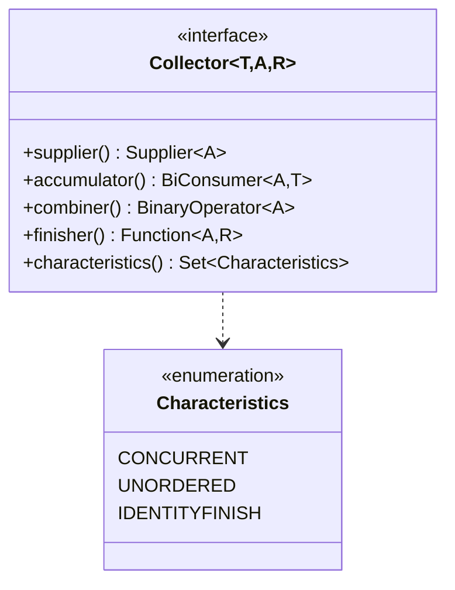
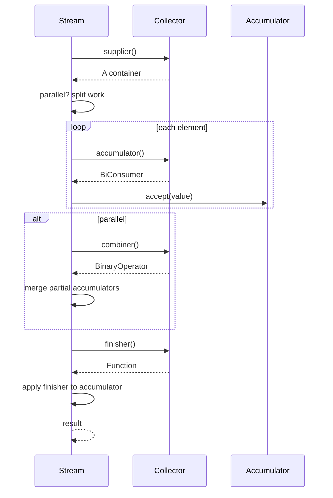

# 06.5. Collectors and Custom Collectors

## Overview

`Collectors` is the JDK's built-in library of `Collector` implementations, used as the terminal operation of a stream to produce a collection, a scalar, or a grouped structure from the stream's elements. Collectors are the bridge between the functional pipeline of Streams and the imperative world of collections. They support grouping, partitioning, joining, reducing, counting, averaging, and many other aggregations, often in a single fluent pipeline.

This note is the comprehensive guide to Collectors: the `Collector` interface and its five components, the built-in collectors in `java.util.stream.Collectors`, downstream collectors and composition, the `Collector.of` factory, writing your own collector from scratch, characteristics like `CONCURRENT` and `UNORDERED`, and the performance considerations that distinguish a good collector from a slow one.

## Background Knowledge

Collectors were introduced in Java 8 alongside Streams. The `Collector` interface is generic on three type parameters: the input element type `T`, the mutable accumulator type `A`, and the result type `R`. For example, `Collector<String, ?, List<String>>` is a collector that consumes Strings, uses an unspecified accumulator, and produces a `List<String>`.

The accumulator type is often hidden (the `?` in the type signature) because it is an implementation detail. For `Collectors.toList()`, the accumulator is an `ArrayList`. For `Collectors.toMap`, it is a `HashMap`. You usually do not need to know the accumulator type, but when writing your own collector, you must.

A collector works in four phases:

1. **Supplier**: creates a new mutable accumulator.
2. **Accumulator**: adds an element to the accumulator (called once per element).
3. **Combiner**: merges two accumulators (used in parallel streams).
4. **Finisher**: converts the accumulator to the final result (identity for direct-accumulation collectors).

Plus a set of characteristics that drive optimization decisions.

## The Collector Interface

```java
public interface Collector<T, A, R> {
    Supplier<A> supplier();
    BiConsumer<A, T> accumulator();
    BinaryOperator<A> combiner();
    Function<A, R> finisher();
    Set<Characteristics> characteristics();

    enum Characteristics {
        CONCURRENT, UNORDERED, IDENTITYFINISH
    }
}
```



### The Five Components

1. **Supplier**: produces a fresh accumulator. Called once per parallel task.
2. **Accumulator**: a `BiConsumer<A, T>` that takes the accumulator and an element, mutating the accumulator. Called once per element.
3. **Combiner**: a `BinaryOperator<A>` that merges two accumulators into one. Called in parallel streams to combine partial results.
4. **Finisher**: a `Function<A, R>` that converts the final accumulator to the result. If the collector has the identity-finish characteristic, the finisher is never called and the accumulator is used directly as the result.
5. **Characteristics**: a set of hints to the Streams framework:
   - `CONCURRENT`: the accumulator can be safely used by multiple threads. Implies `UNORDERED`. Rare; used by `Collectors.toConcurrentMap`.
   - `UNORDERED`: the result does not preserve encounter order. Used by collectors that produce sets or maps.
   - The identity-finish characteristic: the finisher is the identity function; the accumulator can be returned directly. Used by `toList`, `toSet`, etc.

## The Built-In Collectors

The `java.util.stream.Collectors` class provides a rich set of pre-built collectors.

### toList and toUnmodifiableList

```java
List<String> list = stream.collect(Collectors.toList());          // mutable ArrayList
List<String> unmod = stream.collect(Collectors.toUnmodifiableList()); // Java 10+, immutable
List<String> direct = stream.toList();                             // Java 16+, immutable
```

`Collectors.toList()` returns a mutable `ArrayList`. `Collectors.toUnmodifiableList()` returns an unmodifiable list (Java 10+). `stream.toList()` (Java 16+) is a shortcut for an unmodifiable list, more efficient than `Collectors.toList()`.

### toSet and toUnmodifiableSet

```java
Set<String> set = stream.collect(Collectors.toSet());          // HashSet
Set<String> unmod = stream.collect(Collectors.toUnmodifiableSet()); // Java 10+
```

### toMap and toUnmodifiableMap

```java
Map<Long, User> byId = users.stream()
    .collect(Collectors.toMap(User::id, Function.identity()));

Map<Long, String> idToName = users.stream()
    .collect(Collectors.toMap(User::id, User::name));

// Handling duplicates: keep the existing value.
Map<String, Integer> nameToAge = users.stream()
    .collect(Collectors.toMap(User::name, User::age, (a, b) -> a));

// Specifying the map implementation.
TreeMap<Long, User> sorted = users.stream()
    .collect(Collectors.toMap(User::id, Function.identity(),
        (a, b) -> a, TreeMap::new));

// Concurrent map for parallel streams.
ConcurrentMap<Long, User> concurrent = users.parallelStream()
    .collect(Collectors.toConcurrentMap(User::id, Function.identity()));
```

The `(a, b) -> a` merge function determines what happens when two elements have the same key. Without it, a duplicate key throws `IllegalStateException`.

### joining

```java
String csv = strings.stream().collect(Collectors.joining(", "));
String csvWithBrackets = strings.stream()
    .collect(Collectors.joining(", ", "[", "]"));
String plain = strings.stream().collect(Collectors.joining());
```

`joining` uses a `StringBuilder` internally and is far more efficient than concatenating strings in a `forEach`.

### groupingBy

```java
// Group by a classifier.
Map<Department, List<User>> byDept = users.stream()
    .collect(Collectors.groupingBy(User::department));

// Group by a classifier with a downstream collector.
Map<Department, Long> countByDept = users.stream()
    .collect(Collectors.groupingBy(User::department, Collectors.counting()));

Map<Department, Set<User>> setByDept = users.stream()
    .collect(Collectors.groupingBy(User::department, Collectors.toSet()));

Map<Department, Optional<User>> oldestByDept = users.stream()
    .collect(Collectors.groupingBy(User::department,
        Collectors.maxBy(Comparator.comparing(User::age))));

Map<Department, Integer> totalAgeByDept = users.stream()
    .collect(Collectors.groupingBy(User::department,
        Collectors.summingInt(User::age)));

Map<Department, Double> avgAgeByDept = users.stream()
    .collect(Collectors.groupingBy(User::department,
        Collectors.averagingInt(User::age)));

Map<Department, IntSummaryStatistics> statsByDept = users.stream()
    .collect(Collectors.groupingBy(User::department,
        Collectors.summarizingInt(User::age)));

// Group by classifier and specify the map implementation.
TreeMap<Department, List<User>> sortedByDept = users.stream()
    .collect(Collectors.groupingBy(User::department, TreeMap::new, Collectors.toList()));

// Multi-level grouping.
Map<Department, Map<Gender, List<User>>> byDeptAndGender = users.stream()
    .collect(Collectors.groupingBy(User::department,
        Collectors.groupingBy(User::gender)));
```

`groupingBy` is the most powerful collector. It supports a classifier function, an optional map factory, and a downstream collector that processes the elements in each group.

### partitioningBy

```java
Map<Boolean, List<User>> byActive = users.stream()
    .collect(Collectors.partitioningBy(User::isActive));

Map<Boolean, Long> countByActive = users.stream()
    .collect(Collectors.partitioningBy(User::isActive, Collectors.counting()));
```

`partitioningBy` is a specialization of `groupingBy` for `Boolean` classifiers. It is more efficient because it knows there are exactly two partitions and can pre-allocate.

### counting

```java
long count = users.stream().collect(Collectors.counting());
```

Equivalent to `stream.count()`, but useful as a downstream collector in `groupingBy`.

### reducing

```java
Optional<User> oldest = users.stream()
    .collect(Collectors.reducing(BinaryOperator.maxBy(
        Comparator.comparing(User::age))));

User oldestWithIdentity = users.stream()
    .collect(Collectors.reducing(User.DEFAULT,
        BinaryOperator.maxBy(Comparator.comparing(User::age))));

// Three-argument reducing with mapper.
int totalAge = users.stream()
    .collect(Collectors.reducing(0, User::age, Integer::sum));
```

`reducing` is a general-purpose collector that performs a reduction. It is usually less efficient than `summingInt`, `maxBy`, etc., which are specialized.

### minBy and maxBy

```java
Optional<User> oldest = users.stream()
    .collect(Collectors.maxBy(Comparator.comparing(User::age)));
Optional<User> youngest = users.stream()
    .collect(Collectors.minBy(Comparator.comparing(User::age)));
```

Returns `Optional<T>` because the stream may be empty.

### summingInt, summingLong, summingDouble

```java
int totalAge = users.stream().collect(Collectors.summingInt(User::age));
long totalSalary = users.stream().collect(Collectors.summingLong(User::salary));
double totalScore = users.stream().collect(Collectors.summingDouble(User::score));
```

### averagingInt, averagingLong, averagingDouble

```java
double avgAge = users.stream().collect(Collectors.averagingInt(User::age));
```

Returns `Double` even for `averagingInt`, because averages can be non-integer.

### summarizingInt, summarizingLong, summarizingDouble

```java
IntSummaryStatistics stats = users.stream().collect(Collectors.summarizingInt(User::age));
long count = stats.getCount();
int min = stats.getMin();
int max = stats.getMax();
long sum = stats.getSum();
double avg = stats.getAverage();
```

Carries count, sum, min, max, and average in a single pass.

### mapping

```java
List<String> names = users.stream()
    .collect(Collectors.mapping(User::name, Collectors.toList()));
```

Applies a function to each element before passing to the downstream collector. Useful as a downstream collector in `groupingBy`.

### filtering (Java 9+)

```java
Map<Department, List<User>> activeByDept = users.stream()
    .collect(Collectors.groupingBy(User::department,
        Collectors.filtering(User::isActive, Collectors.toList())));
```

Filters elements before passing to the downstream collector. Different from `stream.filter` because it filters within each group, not before grouping.

### flatMapping (Java 9+)

```java
Map<Department, Set<String>> allEmailsByDept = users.stream()
    .collect(Collectors.groupingBy(User::department,
        Collectors.flatMapping(u -> u.emails().stream(), Collectors.toSet())));
```

Flattens each element into a stream before passing to the downstream collector.

### collectingAndThen

```java
List<User> unmodifiable = users.stream()
    .collect(Collectors.collectingAndThen(
        Collectors.toList(),
        Collections::unmodifiableList));

int maxAgePlusOne = users.stream()
    .collect(Collectors.collectingAndThen(
        Collectors.maxBy(Comparator.comparing(User::age)),
        opt -> opt.map(User::age).orElse(-1) + 1));
```

Wraps a collector and applies a finishing function to its result.

### teeing (Java 12+)

```java
record Stats(double avg, double max) {}

Stats stats = users.stream()
    .collect(Collectors.teeing(
        Collectors.averagingInt(User::age),
        Collectors.maxBy(Comparator.comparing(User::age)),
        (avg, maxOpt) -> new Stats(avg, maxOpt.map(User::age).orElse(0).doubleValue())));
```

Runs two collectors in parallel on the same stream and combines their results. Useful for computing multiple aggregates in a single pass.

## Downstream Collectors and Composition

The power of `groupingBy` comes from its downstream collector argument. By nesting collectors, you can build sophisticated aggregations:

```java
// For each department, find the average age of the top 3 highest-paid users.
Map<Department, Double> result = users.stream()
    .collect(Collectors.groupingBy(
        User::department,
        Collectors.collectingAndThen(
            Collectors.toList(),
            list -> list.stream()
                .sorted(Comparator.comparing(User::salary).reversed())
                .limit(3)
                .collect(Collectors.averagingInt(User::age)))));        
```

This composition can be verbose; sometimes a manual loop is clearer. But for many cases, downstream collectors make pipelines elegant.

## Collector.of: The Factory Method

You can create a custom collector without implementing the full interface using `Collector.of`:

```java
import java.util.stream.*;
import java.util.*;

// A collector that joins strings with a separator and wraps in brackets.
Collector<String, ?, String> bracketed = Collector.of(
    () -> new StringJoiner(", ", "[", "]"),  // supplier
    StringJoiner::add,                       // accumulator
    StringJoiner::merge,                     // combiner
    StringJoiner::toString                   // finisher
);

String result = Stream.of("a", "b", "c").collect(bracketed); // "[a, b, c]"
```

`Collector.of` has two overloads: one with a finisher (used above) and one without (for collectors with the identity-finish characteristic).

For collectors with characteristics, pass them as varargs after the finisher:

```java
Collector<String, ?, String> bracketed2 = Collector.of(
    () -> new StringJoiner(", ", "[", "]"),
    StringJoiner::add,
    StringJoiner::merge,
    StringJoiner::toString,
    Collector.Characteristics.UNORDERED
);
```

## Writing a Custom Collector from Scratch

For complex collectors, implement the `Collector` interface directly. Let us write a collector that computes a histogram (a map from element to count) of strings.

```java
import java.util.*;
import java.util.function.*;
import java.util.stream.*;

public class HistogramCollector implements Collector<String, Map<String, Integer>, Map<String, Integer>> {

    @Override
    public Supplier<Map<String, Integer>> supplier() {
        return HashMap::new;
    }

    @Override
    public BiConsumer<Map<String, Integer>, String> accumulator() {
        return (map, s) -> map.merge(s, 1, Integer::sum);
    }

    @Override
    public BinaryOperator<Map<String, Integer>> combiner() {
        return (m1, m2) -> {
            m2.forEach((k, v) -> m1.merge(k, v, Integer::sum));
            return m1;
        };
    }

    @Override
    public Function<Map<String, Integer>, Map<String, Integer>> finisher() {
        return Function.identity(); // accumulator is already the result
    }

    @Override
    public Set<Characteristics> characteristics() {
        return Set.of(Characteristics.IDENTITYFINISH);
        // Not CONCURRENT because HashMap is not thread-safe.
        // Not UNORDERED because we want to preserve insertion order? No, HashMap
        // does not preserve insertion order, so UNORDERED is appropriate.
    }
}
```

Usage:

```java
Map<String, Integer> histogram = strings.stream().collect(new HistogramCollector());
```

This collector has the identity-finish characteristic because the accumulator is already the result. It is not `CONCURRENT` because `HashMap` is not thread-safe; for parallel streams, the framework uses one accumulator per thread and combines them with the combiner.

## Example: A Collector for Percentiles

Let us write a more complex collector that computes percentiles from a stream of doubles.

```java
import java.util.*;
import java.util.function.*;
import java.util.stream.*;

public class PercentileCollector implements Collector<Double, List<Double>, double[]> {

    private final double[] percentiles;

    public PercentileCollector(double... percentiles) {
        this.percentiles = percentiles.clone();
    }

    @Override
    public Supplier<List<Double>> supplier() {
        return ArrayList::new;
    }

    @Override
    public BiConsumer<List<Double>, Double> accumulator() {
        return List::add;
    }

    @Override
    public BinaryOperator<List<Double>> combiner() {
        return (l1, l2) -> {
            l1.addAll(l2);
            return l1;
        };
    }

    @Override
    public Function<List<Double>, double[]> finisher() {
        return values -> {
            Collections.sort(values);
            double[] result = new double[percentiles.length];
            for (int i = 0; i < percentiles.length; i++) {
                int idx = (int) Math.ceil(percentiles[i] / 100.0 * values.size()) - 1;
                result[i] = values.get(Math.max(0, idx));
            }
            return result;
        };
    }

    @Override
    public Set<Characteristics> characteristics() {
        return Set.of(); // No identity-finish characteristic because the finisher does real work.
    }
}
```

Usage:

```java
double[] p = values.stream().collect(new PercentileCollector(50, 95, 99));
// p[0] = median, p[1] = 95th percentile, p[2] = 99th percentile
```

This collector buffers all values (necessary for sorting), so it is not suitable for unbounded streams. It also is not `CONCURRENT` because `ArrayList` is not thread-safe.

## Characteristics in Depth

### CONCURRENT

The accumulator can be safely used by multiple threads. Implies `UNORDERED`. Used by `Collectors.toConcurrentMap`. For your own collectors, only use `CONCURRENT` if your accumulator is a thread-safe data structure (like `ConcurrentHashMap`) and your accumulator function is atomic.

```java
// A concurrent collector that builds a ConcurrentHashMap.
Collector<String, ?, ConcurrentMap<String, Integer>> counter = Collector.of(
    ConcurrentHashMap::new,
    (map, s) -> map.merge(s, 1, Integer::sum),
    (m1, m2) -> {
        m2.forEach((k, v) -> m1.merge(k, v, Integer::sum));
        return m1;
    },
    Collector.Characteristics.CONCURRENT,
    Collector.Characteristics.UNORDERED
);
```

With `CONCURRENT`, the framework uses a single shared accumulator and calls the accumulator from multiple threads. Without `CONCURRENT`, the framework uses one accumulator per thread and combines with the combiner.

### UNORDERED

The result does not preserve encounter order. Used by `toSet`, `toMap`, `groupingBy`. Setting `UNORDERED` lets the framework use unordered data structures (like `HashSet` instead of `LinkedHashSet`) and skip order-preserving merge in parallel streams.

### The Identity-Finish Characteristic

The finisher is the identity function; the accumulator can be returned directly as the result. Used by `toList`, `toSet`, `toMap`, `groupingBy`. Declaring this characteristic lets the framework skip the finisher call, which is a small performance optimization.

## Performance Considerations

### Avoid Boxing in Hot Loops

For numeric reductions, use the primitive specializations (`summingInt`, `averagingInt`, `summarizingInt`) rather than `reducing` with `Integer::sum`. The primitive collectors avoid autoboxing.

### Use the Right Downstream Collector

`Collectors.counting()` is equivalent to `stream.count()` when used directly, but it is the right choice as a downstream collector in `groupingBy`. Using `Collectors.reducing(0, e -> 1, Integer::sum)` would work but is slower.

### Pre-Size When Possible

The framework pre-sizes the accumulator when the spliterator is `SIZED`. For `Collectors.toList`, this means the underlying ArrayList is pre-allocated to the right size, avoiding resize costs.

### Be Wary of Concurrent Collectors in Parallel Streams

`CONCURRENT` collectors share a single accumulator across threads. This avoids the combiner cost but introduces contention. For lightweight operations like incrementing a counter, the contention can dominate. Benchmark to decide.

### Use toList() Over Collectors.toList()

For the simple case of collecting into a list, `stream.toList()` (Java 16+) is faster than `stream.collect(Collectors.toList())` because it skips the Collector abstraction and uses a more efficient internal representation.

## Deep Dive: How the Streams Framework Uses a Collector

To understand the role of each Collector component, it helps to trace what happens when the framework calls `stream.collect(myCollector)`.



### Sequential Execution

For a sequential stream:

1. The framework calls `supplier()` once to get a fresh accumulator `A`.
2. For each element, the framework calls `accumulator().accept(A, element)`.
3. After all elements, the framework calls `finisher().apply(A)` to get the result.
4. If the collector has the identity-finish characteristic, step 3 is skipped and the accumulator is returned directly.

### Parallel Execution

For a parallel stream:

1. The framework calls `supplier()` once per parallel task to get a fresh accumulator.
2. Each task processes its portion of the stream, calling `accumulator().accept(A, element)` for each element.
3. The framework calls `combiner().apply(A1, A2)` to merge accumulators pairwise until a single accumulator remains.
4. The framework calls `finisher().apply(A)` on the merged accumulator.

If the collector is `CONCURRENT`, the framework uses a single shared accumulator across all threads, skipping step 3 entirely. This requires the accumulator to be thread-safe and the accumulator function to be atomic.

### Why Characteristics Matter

The characteristics drive several optimization decisions:

- The identity-finish characteristic lets the framework skip the finisher call, saving one function invocation per stream.
- `UNORDERED` lets the framework use unordered data structures and skip order-preserving merge in parallel streams. For example, `Collectors.toSet` is `UNORDERED`, so the framework can use `HashSet` and merge unordered.
- `CONCURRENT` lets the framework use a single shared accumulator in parallel streams, avoiding the combiner cost. This is faster if the accumulator is contention-light, but can be slower if the accumulator is contention-heavy.

### Verifying Your Collector

To verify a custom collector works correctly:

1. Run it on a sequential stream and check the result.
2. Run it on a parallel stream and check the result matches the sequential result.
3. Verify the combiner is associative: `combine(a, combine(b, c))` should equal `combine(combine(a, b), c)`.
4. Verify the combiner is compatible with the accumulator: `combine(a, accumulate(b, x))` should equal `accumulate(combine(a, b), x)`.
5. Run it on an empty stream and verify the supplier produces a valid empty result.

A simple test harness:

```java
<T, R> void testCollector(Collector<T, ?, R> collector, List<T> input) {
    R sequential = input.stream().collect(collector);
    R parallel = input.parallelStream().collect(collector);
    assert sequential.equals(parallel) : "Sequential and parallel results differ";

    R empty = input.stream().limit(0).collect(collector);
    // Verify empty result is sensible.
}
```

## Comparison Table of Common Collectors

| Collector | Result Type | Characteristics | Use Case |
|---|---|---|---|
| `toList()` | `List<T>` mutable | identity-finish | Building a list |
| `toUnmodifiableList()` | `List<T>` immutable | none | Building an immutable list (Java 10+) |
| `toSet()` | `Set<T>` | identity-finish, UNORDERED | Building a set |
| `toMap(k, v)` | `Map<K, V>` | identity-finish, UNORDERED | Building a lookup map |
| `toMap(k, v, merge)` | `Map<K, V>` | identity-finish, UNORDERED | Handling duplicate keys |
| `toConcurrentMap(k, v)` | `ConcurrentMap<K, V>` | identity-finish, UNORDERED, CONCURRENT | Parallel stream map |
| `joining(sep)` | `String` | identity-finish | String concatenation |
| `groupingBy(cf)` | `Map<C, List<T>>` | identity-finish | Bucketing by classifier |
| `groupingBy(cf, dc)` | `Map<C, R>` | identity-finish | Bucketing with downstream |
| `partitioningBy(p)` | `Map<Boolean, List<T>>` | identity-finish | Two-way partition |
| `counting()` | `Long` | none | Counting elements |
| `summingInt(m)` | `Integer` | none | Summing a numeric field |
| `averagingInt(m)` | `Double` | none | Averaging a numeric field |
| `summarizingInt(m)` | `IntSummaryStatistics` | none | All stats in one pass |
| `minBy(c)` | `Optional<T>` | none | Minimum element |
| `maxBy(c)` | `Optional<T>` | none | Maximum element |
| `reducing(b)` | `Optional<T>` | none | General reduction |
| `mapping(f, dc)` | downstream result | varies | Projecting before downstream |
| `filtering(p, dc)` | downstream result | varies | Filtering before downstream (Java 9+) |
| `flatMapping(f, dc)` | downstream result | varies | Flattening before downstream (Java 9+) |
| `collectingAndThen(c, f)` | result of `f` | varies | Post-processing a collector's result |
| `teeing(c1, c2, f)` | result of `f` | varies | Combining two collectors (Java 12+) |

## Common Pitfalls

### Pitfall 1: Duplicate Keys in toMap

```java
// Throws IllegalStateException if two users have the same ID.
Map<Long, User> byId = users.stream()
    .collect(Collectors.toMap(User::id, Function.identity()));

// Provide a merge function.
Map<Long, User> byId2 = users.stream()
    .collect(Collectors.toMap(User::id, Function.identity(), (a, b) -> a));
```

### Pitfall 2: Null Values in toMap

```java
// Throws NPE if User::name returns null for any user.
Map<Long, String> idToName = users.stream()
    .collect(Collectors.toMap(User::id, User::name));
```

`Collectors.toMap` does not allow null keys or values. Use `HashMap` directly, or use `Collectors.toMap` with a function that replaces null with a default.

### Pitfall 3: Forgetting the Combiner in Parallel Streams

A custom collector without a correct combiner produces wrong results in parallel streams. Always test your collector with `parallelStream`.

### Pitfall 4: Forgetting the Finisher

If your collector's accumulator is not the same as the result, you must implement `finisher` and not declare the identity-finish characteristic.

### Pitfall 5: Using CONCURRENT Without a Thread-Safe Accumulator

If your accumulator is `ArrayList` (not thread-safe) and you declare `CONCURRENT`, the framework will call your accumulator from multiple threads on the same instance, corrupting data. Only use `CONCURRENT` with thread-safe accumulators like `ConcurrentHashMap`.

### Pitfall 6: Forgetting to Handle Empty Streams in maxBy/minBy

`maxBy` and `minBy` return `Optional<T>`, which is empty for an empty stream. Forgetting to handle the Optional case leads to bugs.

### Pitfall 7: Using Collectors.toList() When You Need an Unmodifiable List

```java
// Mutable list.
List<String> a = stream.collect(Collectors.toList());
a.add("x"); // works

// Immutable list (Java 16+).
List<String> b = stream.toList();
b.add("x"); // UnsupportedOperationException
```

### Pitfall 8: Misusing collectingAndThen

```java
// This is fine.
List<User> unmod = users.stream()
    .collect(Collectors.collectingAndThen(
        Collectors.toList(),
        Collections::unmodifiableList));

// This is unnecessary in Java 16+.
List<User> unmod2 = users.stream().toList();
```

### Pitfall 9: Order-Dependent Collectors in Parallel Streams

`Collectors.toList` preserves encounter order in sequential streams. In parallel streams with `ORDERED` sources, the result also preserves order, but at the cost of an ordered merge. If order does not matter, use `toSet` or `toMap` (which are `UNORDERED`) for better parallel performance.

### Pitfall 10: Using joining With a Large Stream

`Collectors.joining` uses a `StringBuilder`, which is fine for moderate sizes but consumes all elements into memory. For very large streams, consider writing directly to a `Writer` using `forEach`.

## Tips and Tricks

### Tip 1: Use groupingBy for Histograms

```java
Map<String, Long> histogram = items.stream()
    .collect(Collectors.groupingBy(Function.identity(), Collectors.counting()));
```

### Tip 2: Use toMap With a Custom Merge Function for Duplicates

```java
Map<String, Integer> nameToHighestAge = users.stream()
    .collect(Collectors.toMap(User::name, User::age, Integer::max));
```

### Tip 3: Use mapping for Projections in groupingBy

```java
Map<Department, List<String>> namesByDept = users.stream()
    .collect(Collectors.groupingBy(User::department,
        Collectors.mapping(User::name, Collectors.toList())));
```

### Tip 4: Use Collectors.toList() for a Mutable List

If you need to mutate the result (e.g., add more elements), use `Collectors.toList()` rather than `stream.toList()` (which is unmodifiable).

### Tip 5: Use teeing for Multi-Aggregate Pipelines

```java
record Range(double min, double max) {}

Range range = values.stream()
    .collect(Collectors.teeing(
        Collectors.minBy(Comparator.naturalOrder()),
        Collectors.maxBy(Comparator.naturalOrder()),
        (min, max) -> new Range(min.orElse(0.0), max.orElse(0.0))));
```

### Tip 6: Use summarizingInt for One-Pass Statistics

```java
IntSummaryStatistics stats = users.stream()
    .collect(Collectors.summarizingInt(User::age));
// count, sum, min, max, average in one pass.
```

### Tip 7: Use filtering for Conditional Downstream Collection

```java
Map<Department, List<User>> activeByDept = users.stream()
    .collect(Collectors.groupingBy(User::department,
        Collectors.filtering(User::isActive, Collectors.toList())));
```

### Tip 8: Use collectingAndThen for Immutability Wrappers

```java
Map<Department, List<User>> unmodifiable = users.stream()
    .collect(Collectors.collectingAndThen(
        Collectors.groupingBy(User::department),
        Collections::unmodifiableMap));
```

### Tip 9: Use a Custom Collector for Reusable Logic

If you find yourself writing the same complex collector repeatedly, extract it into a named class or static factory method.

### Tip 10: Test Custom Collectors With Parallel Streams

Always test with `parallelStream` to verify the combiner works correctly.

## Interview Questions

### Q1: What is a Collector?

A `Collector<T, A, R>` is an interface that defines how to accumulate stream elements of type T into a mutable accumulator of type A and produce a final result of type R. It has five components: supplier, accumulator, combiner, finisher, and characteristics.

### Q2: What are the three Collector characteristics?

`CONCURRENT` (the accumulator is thread-safe and can be used by multiple threads), `UNORDERED` (the result does not preserve encounter order), and the identity-finish characteristic (the finisher is the identity function; the accumulator can be returned directly).

### Q3: What is the difference between `Collectors.toList()` and `stream.toList()`?

`Collectors.toList()` returns a mutable `ArrayList`. `stream.toList()` (Java 16+) returns an unmodifiable list and is more efficient because it skips the Collector abstraction.

### Q4: What is a downstream collector?

A collector passed as an argument to `groupingBy` or `partitioningBy` to process the elements in each group. For example, `groupingBy(User::department, Collectors.counting())` uses `counting` as the downstream collector.

### Q5: How does `groupingBy` work?

It applies a classifier function to each element to determine its group, then accumulates elements into a map from group key to a list (or other collection produced by the downstream collector). For parallel streams, partial maps are combined via the combiner.

### Q6: What is `Collectors.toMap` and how do you handle duplicate keys?

It builds a map from a key function and a value function. If two elements have the same key, by default it throws `IllegalStateException`. Provide a third merge function argument to control behavior, like `(a, b) -> a` to keep the existing value.

### Q7: What is `Collectors.collectingAndThen`?

A wrapper that applies a finishing function to the result of another collector. Useful for wrapping the result in an unmodifiable collection or applying a transformation.

### Q8: What is `Collectors.teeing`?

A collector (Java 12+) that runs two collectors in parallel on the same stream and combines their results with a merge function. Useful for computing multiple aggregates in a single pass.

### Q9: How do you write a custom collector?

Implement the `Collector` interface with the five components, or use `Collector.of` for simpler cases. Test with both sequential and parallel streams to verify the combiner.

### Q10: When should you declare `CONCURRENT`?

Only when your accumulator is a thread-safe data structure (like `ConcurrentHashMap`) and your accumulator function is atomic. With `CONCURRENT`, the framework uses a single shared accumulator across threads.

### Q11: What is the combiner for, and when is it called?

The combiner merges two accumulators into one. It is called in parallel streams to combine partial results from different threads. It must be associative and compatible with the accumulator.

### Q12: What is the finisher for?

The finisher converts the accumulator to the final result. If the accumulator is already the result, the finisher is the identity function and you should declare the identity-finish characteristic.

### Q13: How do you create a histogram with Collectors?

```java
Map<String, Long> histogram = items.stream()
    .collect(Collectors.groupingBy(Function.identity(), Collectors.counting()));
```

### Q14: Why does `Collectors.toMap` not allow null values?

Because the underlying `Map.merge` operation (which `toMap` uses) throws `NullPointerException` for null values. If you need null values, use a manual accumulator.

### Q15: How do you compute multiple aggregates in a single pass?

Use `Collectors.teeing` (Java 12+) or `Collectors.summarizingInt` (for count, sum, min, max, average).

## Summary

`Collectors` is the JDK's library of `Collector` implementations, providing powerful aggregations including grouping, partitioning, joining, reducing, counting, averaging, and summarizing. The `Collector` interface has five components (supplier, accumulator, combiner, finisher, characteristics) and three characteristics (`CONCURRENT`, `UNORDERED`, and the identity-finish characteristic) that drive optimization. Downstream collectors compose: `groupingBy` can take any collector as its second argument, enabling multi-level aggregations. For custom aggregation logic, implement `Collector` directly or use the `Collector.of` factory. Always test custom collectors with parallel streams to verify the combiner. The next note, 06.6, covers the core functional interfaces (`Predicate`, `Consumer`, `Supplier`, `Function`, `BiFunction`, `UnaryOperator`, `BinaryOperator`) in depth, with their composition methods and primitive specializations.
