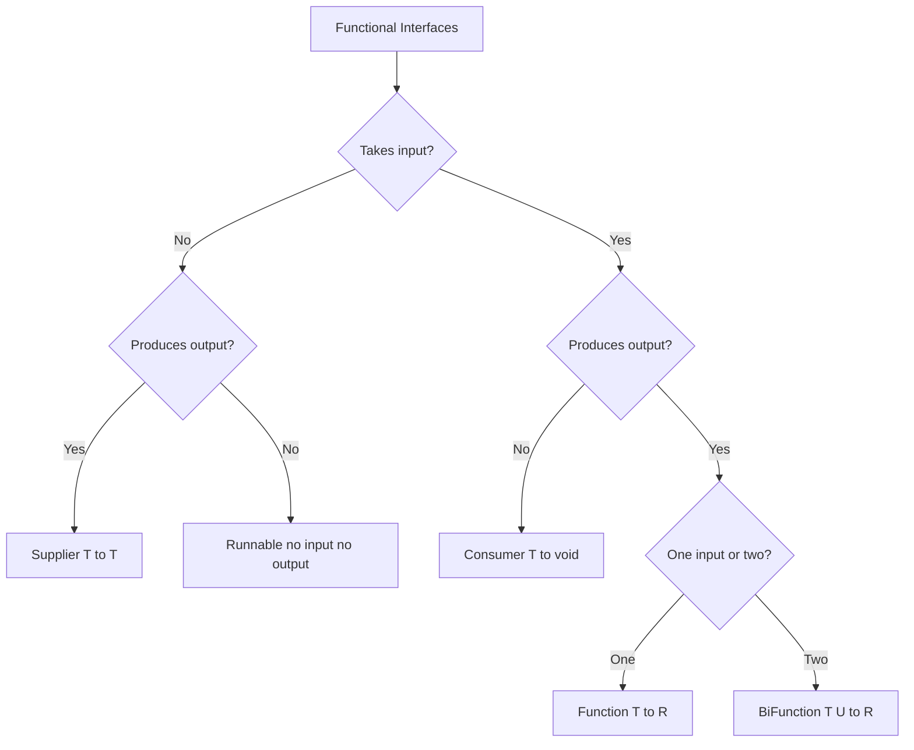
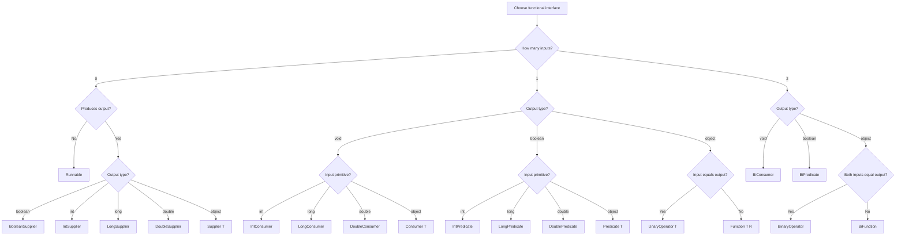

# 06.6. Functional Interfaces Predicate Consumer Supplier Function

## Overview

The `java.util.function` package is the standard library of functional interfaces that ship with the JDK. It contains roughly 43 interfaces, but a small subset accounts for the vast majority of real-world usage. The four foundational interfaces are `Predicate`, `Consumer`, `Supplier`, and `Function`. Building on these, the JDK provides `BiFunction`, `UnaryOperator`, `BinaryOperator`, and dozens of primitive specializations.

This note is the comprehensive guide to these interfaces: their method signatures, their default methods for composition, their primitive variants, the rules for picking the right one, and the patterns for writing your own. By the end you will understand which interface to reach for in any situation, how to compose them fluently, and how to avoid the autoboxing pitfalls that plague generic functional interfaces in hot loops.

## Background Knowledge

Recall from 06.1 that a functional interface is an interface with exactly one abstract method (the SAM rule). Lambdas and method references can be assigned to any functional interface whose method signature matches. The JDK ships with a curated set of functional interfaces in `java.util.function` so that you do not have to write your own for common cases.

The four core interfaces form a 2x2 matrix based on whether they take input and whether they produce output:



The four core interfaces are:

- `Supplier<T>`: no input, returns a `T`.
- `Consumer<T>`: takes a `T`, returns void.
- `Function<T, R>`: takes a `T`, returns an `R`.
- `Predicate<T>`: takes a `T`, returns a `boolean`.

These four cover 80% of real-world usage. The rest are specializations, extensions, and primitive variants.

## Predicate

`Predicate<T>` is the interface for boolean-valued functions. Its single abstract method is `boolean test(T t)`.

```java
import java.util.function.Predicate;

Predicate<String> nonEmpty = s -> !s.isEmpty();
Predicate<String> longerThan5 = s -> s.length() > 5;
Predicate<String> startsWithA = s -> s.startsWith("A");

boolean result = nonEmpty.test("hello"); // true
```

### Default Methods for Composition

`Predicate` provides three default methods for logical composition:

```java
Predicate<String> combined = nonEmpty
    .and(longerThan5)
    .and(startsWithA)
    .negate();

// Equivalent to:
Predicate<String> combinedManual = s ->
    !(s != null && !s.isEmpty() && s.length() > 5 && s.startsWith("A"));
```

- `and(Predicate other)`: logical AND.
- `or(Predicate other)`: logical OR.
- `negate()`: logical NOT.

These compose fluently:

```java
Predicate<User> canLogin = user -> user.isActive();
Predicate<User> hasValidPassword = user -> passwordChecker.isValid(user.password());
Predicate<User> canAccessAdmin = canLogin.and(hasValidPassword).and(user -> user.role() == Role.ADMIN);
```

### Static Methods

- `Predicate.isEqual(Object target)`: returns a predicate that tests equality with the target using `Objects.equals`. Useful for `filter(equalsSomething)`.

```java
Predicate<String> equalsHello = Predicate.isEqual("hello");
boolean result = equalsHello.test("hello"); // true
```

- `Predicate.not(Predicate target)` (Java 11+): returns a predicate that is the negation of the target. Cleaner than calling `.negate()` on a complex predicate.

```java
Predicate<String> notEmpty = Predicate.not(String::isEmpty);
// Equivalent to:
Predicate<String> notEmpty2 = ((Predicate<String>) String::isEmpty).negate();
```

### Primitive Specializations

`IntPredicate`, `LongPredicate`, and `DoublePredicate` avoid autoboxing:

```java
IntPredicate isEven = x -> x % 2 == 0;
boolean result = isEven.test(42); // no autoboxing

// Compared to:
Predicate<Integer> isEvenBoxed = x -> x % 2 == 0;
boolean result2 = isEvenBoxed.test(42); // autoboxes 42 to Integer
```

In hot loops, the autoboxing version is significantly slower. Use the primitive specializations whenever the input is a primitive.

### Common Use Cases

- Filtering in streams: `stream.filter(predicate)`.
- Matching: `stream.anyMatch(predicate)`, `allMatch`, `noneMatch`.
- Conditional logic in fluent APIs: `Optional.filter(predicate)`.
- Validation: `validator.check(predicate, errorMessage)`.

## Consumer

`Consumer<T>` is the interface for side-effect-producing functions. Its single abstract method is `void accept(T t)`.

```java
import java.util.function.Consumer;

Consumer<String> printer = System.out::println;
printer.accept("hello"); // prints "hello"
```

### Default Method for Composition

`Consumer` provides `andThen(Consumer after)` for sequential composition:

```java
Consumer<String> printer = System.out::println;
Consumer<String> logger = s -> log.info(s);
Consumer<String> printAndLog = printer.andThen(logger);

printAndLog.accept("hello"); // prints and logs "hello"
```

The `andThen` method returns a new Consumer that calls the original first, then the `after` consumer. If the first throws an exception, the second is not called.

### Primitive Specializations

`IntConsumer`, `LongConsumer`, and `DoubleConsumer`:

```java
IntConsumer printInt = x -> System.out.println(x);
printInt.accept(42); // no autoboxing
```

### BiConsumer

`BiConsumer<T, U>` takes two arguments:

```java
BiConsumer<String, Integer> setField = (name, value) -> System.out.println(name + "=" + value);
setField.accept("count", 42);
```

Useful for iterating over map entries:

```java
map.forEach((key, value) -> System.out.println(key + " -> " + value));
```

`BiConsumer` also has `andThen`.

### ObjIntConsumer, ObjLongConsumer, ObjDoubleConsumer

These take an object reference and a primitive:

```java
ObjIntConsumer<StringBuilder> appendInt = (sb, i) -> sb.append(i);
```

Useful when one argument is a primitive and the other is an object, avoiding autoboxing.

### Common Use Cases

- Iterating over collections: `list.forEach(consumer)`.
- Side effects in streams: `stream.peek(consumer)`.
- Map iteration: `map.forEach(biconsumer)`.
- Callbacks: `onComplete.accept(result)`.
- Configuration: `configurator.accept(builder)`.

## Supplier

`Supplier<T>` is the interface for deferred value production. Its single abstract method is `T get()`.

```java
import java.util.function.Supplier;

Supplier<Double> random = Math::random;
double value = random.get();
```

### No Composition Methods

`Supplier` does not provide default methods for composition. It is a leaf interface. To compose suppliers, chain them manually:

```java
Supplier<Integer> randomInt = () -> (int) (Math.random() * 100);
Supplier<String> randomString = () -> "value-" + randomInt.get();
```

### Primitive Specializations

`IntSupplier`, `LongSupplier`, `DoubleSupplier`, and `BooleanSupplier`:

```java
IntSupplier dice = () -> ThreadLocalRandom.current().nextInt(1, 7);
int roll = dice.getAsInt();
BooleanSupplier isRunning = () -> service.isRunning();
```

### Common Use Cases

- Lazy defaults: `Optional.orElseGet(supplier)`.
- Lazy initialization: `Lazy.of(supplier)`.
- Factory methods: passing `Supplier<T>` to a factory instead of `T` directly.
- Generator functions: `Stream.generate(supplier)`.
- Deferred exception throwing: `assert supplier.get() != null`.

### The Lazy Pattern

`Supplier` enables lazy evaluation patterns. Compare:

```java
// Eager: computeDefault runs even if opt is present.
String result = opt.orElse(computeDefault());

// Lazy: computeDefault runs only if opt is empty.
String result = opt.orElseGet(() -> computeDefault());
```

This is the canonical use case for Supplier: deferring computation until it is actually needed.

## Function

`Function<T, R>` is the interface for transformations. Its single abstract method is `R apply(T t)`.

```java
import java.util.function.Function;

Function<String, Integer> length = String::length;
int len = length.apply("hello"); // 5
```

### Default Methods for Composition

`Function` provides `andThen` and `compose`:

```java
Function<String, String> trim = String::trim;
Function<String, String> upper = String::toUpperCase;

// andThen: f.andThen(g).apply(x) = g(f(x))
Function<String, String> trimThenUpper = trim.andThen(upper);
String a = trimThenUpper.apply("  hello  "); // "HELLO"

// compose: f.compose(g).apply(x) = f(g(x))
Function<String, String> upperAfterTrim = upper.compose(trim);
String b = upperAfterTrim.apply("  hello  "); // "HELLO"
```

`andThen` reads left-to-right (apply f first, then g). `compose` reads right-to-left (apply g first, then f). Both produce the same kind of pipeline; the choice is about readability.

### Static Method

- `Function.identity()`: returns a function that returns its input unchanged.

```java
Function<String, String> identity = Function.identity();
String result = identity.apply("hello"); // "hello"
```

Useful as a no-op in APIs that require a `Function`, like `Collectors.toMap(User::id, Function.identity())`.

### Primitive Variants

There are two families of primitive specializations for `Function`:

**To-primitive** (object input, primitive output):
- `ToIntFunction<T>`: `int applyAsInt(T)`
- `ToLongFunction<T>`: `long applyAsLong(T)`
- `ToDoubleFunction<T>`: `double applyAsDouble(T)`

**From-primitive** (primitive input, object output):
- `IntFunction<R>`: `R apply(int)`
- `LongFunction<R>`: `R apply(long)`
- `DoubleFunction<R>`: `R apply(double)`

**Primitive-to-primitive**:
- `IntToLongFunction`, `IntToDoubleFunction`
- `LongToIntFunction`, `LongToDoubleFunction`
- `DoubleToIntFunction`, `DoubleToLongFunction`

```java
ToIntFunction<String> length = String::length; // String to int
IntFunction<String> ofLength = n -> "x".repeat(n); // int to String
IntToLongFunction squared = n -> (long) n * n; // int to long
```

These avoid autoboxing in both directions, which is critical in hot loops over streams of primitives.

### Common Use Cases

- Stream transformations: `stream.map(function)`.
- Lookups: `Map.computeIfAbsent(key, function)`.
- Configuration: applying a transformation to a config value.
- Adapter patterns: converting one type to another.

## BiFunction

`BiFunction<T, U, R>` is the two-argument version of `Function`. Its single abstract method is `R apply(T t, U u)`.

```java
import java.util.function.BiFunction;

BiFunction<Integer, Integer, Integer> add = (a, b) -> a + b;
int result = add.apply(2, 3); // 5
```

### Default Method

`BiFunction` provides `andThen(Function after)`:

```java
BiFunction<Integer, Integer, Integer> add = (a, b) -> a + b;
Function<Integer, String> toString = Object::toString;
BiFunction<Integer, Integer, String> addAndStringify = add.andThen(toString);

String result = addAndStringify.apply(2, 3); // "5"
```

Note that `andThen` takes a `Function`, not another `BiFunction`. This is because the result of a `BiFunction` is a single value, which is then transformed by a `Function`.

### Primitive Variants

`ToIntBiFunction<T, U>`, `ToLongBiFunction<T, U>`, `ToDoubleBiFunction<T, U>`: take two object arguments and return a primitive.

There are no `BiIntFunction` or similar two-primitive-input variants in the JDK. If you need two primitive inputs, you typically use a lambda and accept the autoboxing, or define your own functional interface.

### Common Use Cases

- Map operations: `Map.compute(key, biFunction)`, `Map.merge(key, value, biFunction)`.
- Combining two values: `BiFunction<User, Order, Invoice> invoiceFactory`.
- Reductions: `stream.reduce(identity, biFunction)`.

## UnaryOperator

`UnaryOperator<T>` extends `Function<T, T>`. It is a specialization where the input and output types are the same.

```java
import java.util.function.UnaryOperator;

UnaryOperator<String> trim = String::trim;
UnaryOperator<String> upper = String::toUpperCase;
UnaryOperator<Integer> increment = x -> x + 1;

String result = trim.andThen(upper).apply("  hello  "); // "HELLO"
```

Because `UnaryOperator` extends `Function`, it inherits `andThen` and `compose`. The constraint is that the function and the function passed to `andThen` must both be `UnaryOperator<T>` (or at least `Function<T, T>`) for the result to remain a `UnaryOperator`.

### Static Method

- `UnaryOperator.identity()`: returns an identity operator (inherited from `Function.identity()`).

### Primitive Specializations

`IntUnaryOperator`, `LongUnaryOperator`, `DoubleUnaryOperator`:

```java
IntUnaryOperator increment = x -> x + 1;
IntUnaryOperator doubleIt = x -> x * 2;
IntUnaryOperator combined = increment.andThen(doubleIt);

int result = combined.applyAsInt(5); // 12
```

The primitive variants have `andThen` and `compose` methods that take the same primitive type, avoiding autoboxing.

### Common Use Cases

- Stream transformations where input and output types match: `stream.map(unaryOperator)`.
- List replacement: `list.replaceAll(unaryOperator)`.
- Self-transformations: `value.transform(unaryOperator)`.

## BinaryOperator

`BinaryOperator<T>` extends `BiFunction<T, T, T>`. It is a specialization where both inputs and the output are the same type.

```java
import java.util.function.BinaryOperator;

BinaryOperator<Integer> max = Integer::max;
BinaryOperator<String> concat = (a, b) -> a + b;
BinaryOperator<List<String>> append = (a, b) -> {
    List<String> result = new ArrayList<>(a);
    result.addAll(b);
    return result;
};

int result = max.apply(3, 5); // 5
```

### Static Methods

`BinaryOperator` provides two static factory methods:

- `minBy(Comparator<T> comparator)`: returns a BinaryOperator that returns the minimum of two values.
- `maxBy(Comparator<T> comparator)`: returns a BinaryOperator that returns the maximum of two values.

```java
BinaryOperator<User> oldest = BinaryOperator.maxBy(Comparator.comparing(User::age));
User older = oldest.apply(user1, user2);
```

These are used internally by `Stream.reduce(BinaryOperator)` and `Collectors.reducing`.

### Primitive Specializations

`IntBinaryOperator`, `LongBinaryOperator`, `DoubleBinaryOperator`:

```java
IntBinaryOperator add = (a, b) -> a + b;
int result = add.applyAsInt(2, 3); // 5
```

These do not have static `minBy`/`maxBy` methods; use `Math::min` and `Math::max` instead.

### Common Use Cases

- Stream reduction: `stream.reduce(binaryOperator)`.
- Map merge: `Map.merge(key, value, binaryOperator)`.
- Combining two values of the same type: building a tree from a list of nodes.

## Other Important Functional Interfaces

### Runnable

`Runnable` is the original functional interface (since Java 1.0). It takes no arguments and returns void:

```java
Runnable task = () -> System.out.println("running");
task.run();
```

Useful for thread tasks, callbacks, and anywhere you need a no-arg void action.

### Callable

`Callable<V>` (since Java 5) takes no arguments and returns a value, and may throw a checked exception:

```java
Callable<Integer> task = () -> computeValue();
Integer result = task.call();
```

`Callable` is essentially `Supplier` that can throw checked exceptions. It is used by `ExecutorService.submit`.

### Comparator

`Comparator<T>` (since Java 1.2) is a functional interface whose method is `int compare(T o1, T o2)`. It has many default methods for composition (`thenComparing`, `reversed`, `nullsFirst`, `nullsLast`).

```java
Comparator<Person> byAge = Comparator.comparing(Person::age);
Comparator<Person> byAgeThenName = byAge.thenComparing(Person::name);
Comparator<Person> byAgeDesc = byAge.reversed();
```

### BiPredicate

`BiPredicate<T, U>` tests two values:

```java
BiPredicate<String, Integer> lengthEquals = (s, n) -> s.length() == n;
boolean result = lengthEquals.test("hello", 5); // true
```

Has `and`, `or`, `negate` like `Predicate`.

### Supplier Variants

There are also `Supplier<Boolean>` (replaced by `BooleanSupplier` for primitive performance), but the JDK provides `BooleanSupplier` directly:

```java
BooleanSupplier isWeekend = () -> LocalDate.now().getDayOfWeek().getValue() >= 6;
```

## Picking the Right Interface

| Need | Interface |
|---|---|
| Take a T, return a boolean | `Predicate<T>` |
| Take a T, return void | `Consumer<T>` |
| Take no input, return a T | `Supplier<T>` |
| Take a T, return an R | `Function<T, R>` |
| Take a T and a U, return an R | `BiFunction<T, U, R>` |
| Take a T, return a T | `UnaryOperator<T>` |
| Take two Ts, return a T | `BinaryOperator<T>` |
| Take a T and a U, return a boolean | `BiPredicate<T, U>` |
| Take a T and a U, return void | `BiConsumer<T, U>` |
| Take no input, return void | `Runnable` |
| Take no input, return a T (may throw) | `Callable<T>` |

If your function takes three or more arguments, the JDK does not have a built-in interface. Define your own:

```java
@FunctionalInterface
interface TriFunction<T, U, V, R> {
    R apply(T t, U u, V v);
}
```

Apache Commons Lang and Vavr provide `TriFunction` and similar out of the box.

## Writing Your Own Functional Interface

If none of the standard interfaces fit, write your own. Annotate it with `@FunctionalInterface`:

```java
@FunctionalInterface
interface ThrowingFunction<T, R, E extends Exception> {
    R apply(T t) throws E;

    // Optional: a wrapper to convert to a regular Function.
    static <T, R> Function<T, R> unchecked(ThrowingFunction<T, R, ?> f) {
        return t -> {
            try {
                return f.apply(t);
            } catch (Exception e) {
                throw new RuntimeException(e);
            }
        };
    }
}

// Usage:
ThrowingFunction<String, String, IOException> readPath = Files::readString;
Function<String, String> safe = ThrowingFunction.unchecked(readPath);
```

This pattern is useful for adapting functional interfaces that throw checked exceptions into the standard ones that do not.

## Composition Patterns

### Pattern 1: Predicate Composition

```java
Predicate<User> isActive = User::isActive;
Predicate<User> isAdult = u -> u.age() >= 18;
Predicate<User> hasVerifiedEmail = u -> u.email().isVerified();
Predicate<User> canRegister = isActive.and(isAdult).and(hasVerifiedEmail);
```

### Pattern 2: Function Pipeline

```java
Function<Order, Customer> orderToCustomer = Order::customer;
Function<Customer, String> customerToEmail = Customer::email;
Function<String, String> emailToLower = String::toLowerCase;

Function<Order, String> orderToEmailLower = orderToCustomer
    .andThen(customerToEmail)
    .andThen(emailToLower);

// Or equivalently:
Function<Order, String> orderToEmailLower2 = emailToLower
    .compose(customerToEmail)
    .compose(orderToCustomer);
```

### Pattern 3: Consumer Chaining

```java
Consumer<HttpRequest> logRequest = req -> log.info("Request: " + req);
Consumer<HttpRequest> authenticate = req -> authService.authenticate(req);
Consumer<HttpRequest> validate = req -> validator.validate(req);

Consumer<HttpRequest> pipeline = logRequest
    .andThen(authenticate)
    .andThen(validate);
```

### Pattern 4: Supplier Composition

```java
Supplier<Connection> connectionSupplier = dataSource::getConnection;
Supplier<PreparedStatement> statementSupplier = () -> {
    try {
        return connectionSupplier.get().prepareStatement(SQL);
    } catch (SQLException e) {
        throw new RuntimeException(e);
    }
};
```

### Pattern 5: Higher-Order Functions

```java
// A function that returns a function.
Function<Integer, Predicate<String>> lengthAtLeast =
    min -> s -> s.length() >= min;

Predicate<String> length5Plus = lengthAtLeast.apply(5);
boolean result = length5Plus.test("hello"); // true
```

This pattern is the foundation of currying in Java.

## Deep Dive: The Full java.util.function Package

The `java.util.function` package contains 43 interfaces. The full inventory:

### Object-valued interfaces (7)

- `Supplier<T>`: no input, returns T.
- `Consumer<T>`: T input, void output.
- `Function<T, R>`: T input, R output.
- `Predicate<T>`: T input, boolean output.
- `BiConsumer<T, U>`: T and U inputs, void output.
- `BiFunction<T, U, R>`: T and U inputs, R output.
- `BiPredicate<T, U>`: T and U inputs, boolean output.

### Operator interfaces (4)

- `UnaryOperator<T>` extends `Function<T, T>`.
- `BinaryOperator<T>` extends `BiFunction<T, T, T>`.
- (Plus two primitive variants for each of int, long, double.)

### Primitive supplier variants (4)

- `BooleanSupplier`: returns boolean.
- `IntSupplier`: returns int.
- `LongSupplier`: returns long.
- `DoubleSupplier`: returns double.

### Primitive function variants (16)

For each of int, long, and double, plus the object variants:

- `IntFunction<R>`, `LongFunction<R>`, `DoubleFunction<R>`: primitive to R.
- `ToIntFunction<T>`, `ToLongFunction<T>`, `ToDoubleFunction<T>`: T to primitive.
- `IntToLongFunction`, `IntToDoubleFunction`, `LongToIntFunction`, `LongToDoubleFunction`, `DoubleToIntFunction`, `DoubleToLongFunction`: primitive to primitive.
- `ToIntBiFunction<T, U>`, `ToLongBiFunction<T, U>`, `ToDoubleBiFunction<T, U>`: two object inputs, primitive output.

### Primitive consumer variants (12)

For each of int, long, double:

- `IntConsumer`, `LongConsumer`, `DoubleConsumer`: primitive input, void output.
- `ObjIntConsumer<T>`, `ObjLongConsumer<T>`, `ObjDoubleConsumer<T>`: object and primitive input, void output.

### Primitive predicate variants (3)

- `IntPredicate`, `LongPredicate`, `DoublePredicate`.

### Total: ~43 interfaces

The design follows a strict naming convention:

- Object types are generic: `Function<T, R>`.
- Primitive types use the prefix `Int`, `Long`, or `Double`: `IntFunction<R>`.
- To-primitive conversions use the prefix `To`: `ToIntFunction<T>`.
- Two-argument variants use the prefix `Bi`: `BiFunction<T, U, R>`.
- Object-plus-primitive variants use the prefix `Obj`: `ObjIntConsumer<T>`.

The JDK intentionally does not provide `BooleanFunction`, `ByteFunction`, `ShortFunction`, `CharacterFunction`, or `FloatFunction`. The justification is that these would add too much API surface for too little benefit; autoboxing is acceptable for the rarer primitive types.

## How to Choose the Right Interface

The decision tree is:



## Common Pitfalls

### Pitfall 1: Autoboxing in Hot Loops

```java
// Bad: autoboxes every int to Integer.
int sum = list.stream().map(x -> x * 2).reduce(0, Integer::sum);

// Good: no autoboxing.
int sum = list.stream().mapToInt(x -> x * 2).sum();
```

Use primitive functional interfaces (`IntFunction`, `IntPredicate`, etc.) when working with primitive streams.

### Pitfall 2: Mutable State in Lambdas

```java
int[] counter = {0};
list.forEach(x -> counter[0]++); // works but fragile, especially in parallel streams
```

Use `Collectors.counting()` or `stream.count()` instead.

### Pitfall 3: Null Inputs

```java
Predicate<String> isEmpty = String::isEmpty;
isEmpty.test(null); // NullPointerException
```

Handle nulls explicitly:

```java
Predicate<String> isEmpty = s -> s == null || s.isEmpty();
```

Or use `Objects::isNull` and `Objects::nonNull`:

```java
Predicate<Object> isNull = Objects::isNull;
Predicate<Object> nonNull = Objects::nonNull;
```

### Pitfall 4: Function Identity Misuse

```java
// Unnecessary.
Function<String, String> identity = s -> s;

// Better.
Function<String, String> identity = Function.identity();
```

### Pitfall 5: Predicate Negation Readability

```java
// Hard to read.
Predicate<String> notEmpty = ((Predicate<String>) String::isEmpty).negate();

// Cleaner (Java 11+).
Predicate<String> notEmpty = Predicate.not(String::isEmpty);
```

### Pitfall 6: Composition Order Confusion

```java
Function<Integer, Integer> addOne = x -> x + 1;
Function<Integer, Integer> timesTwo = x -> x * 2;

// andThen: addOne first, then timesTwo.
Function<Integer, Integer> a = addOne.andThen(timesTwo);
// a.apply(3) = timesTwo(addOne(3)) = timesTwo(4) = 8

// compose: timesTwo first, then addOne.
Function<Integer, Integer> b = addOne.compose(timesTwo);
// b.apply(3) = addOne(timesTwo(3)) = addOne(6) = 7
```

The two are different. Read the names carefully.

### Pitfall 7: Forgetting That BiFunction.andThen Takes a Function

```java
BiFunction<Integer, Integer, Integer> add = (a, b) -> a + b;
// BiFunction<Integer, Integer, Integer> chained = add.andThen((a, b) -> a + b);
// Compile error: andThen takes a Function, not a BiFunction.

Function<Integer, String> stringify = Object::toString;
BiFunction<Integer, Integer, String> chained = add.andThen(stringify); // works
```

### Pitfall 8: Catching Exceptions in Lambdas

```java
// Lambda body cannot throw checked exceptions.
// Function<String, String> fn = s -> Files.readString(Path.of(s));
// Compile error: Files.readString throws IOException.

// Wrap in a runtime exception.
Function<String, String> fn = s -> {
    try { return Files.readString(Path.of(s)); }
    catch (IOException e) { throw new UncheckedIOException(e); }
};
```

Or use a custom `ThrowingFunction` interface.

## Tips and Tricks

### Tip 1: Use Primitive Specializations for Hot Loops

```java
IntPredicate isEven = x -> x % 2 == 0;
IntUnaryOperator doubleIt = x -> x * 2;
IntBinaryOperator sum = Integer::sum;

int result = IntStream.range(0, 1000)
    .filter(isEven)
    .map(doubleIt)
    .reduce(0, sum);
```

No autoboxing anywhere.

### Tip 2: Compose Predicates Fluently

```java
Predicate<User> canAccessAdmin = User::isActive
    .and(u -> u.role() == Role.ADMIN)
    .and(u -> u.tenant().equals(currentTenant));
```

### Tip 3: Use Predicate.not for Negation

```java
Predicate<String> notBlank = Predicate.not(String::isBlank);
```

### Tip 4: Use Function.identity for No-Op

```java
Map<Long, User> byId = users.stream()
    .collect(Collectors.toMap(User::id, Function.identity()));
```

### Tip 5: Use BinaryOperator.minBy and maxBy for Reductions

```java
Optional<User> oldest = users.stream()
    .reduce(BinaryOperator.maxBy(Comparator.comparing(User::age)));
```

### Tip 6: Use UnaryOperator for Self-Transformations

```java
List<String> uppercased = list.stream()
    .map(String::toUpperCase)  // returns UnaryOperator<String>
    .toList();
```

### Tip 7: Use Consumer.andThen for Pipeline Construction

```java
Consumer<Request> pipeline = log::request
    .andThen(auth::authenticate)
    .andThen(validator::validate);
```

### Tip 8: Use Supplier for Lazy Defaults

```java
String value = optional.orElseGet(this::computeDefault);
```

### Tip 9: Use BiFunction for Map Operations

```java
map.compute(key, (k, v) -> v == null ? 1 : v + 1);
map.merge(key, 1, Integer::sum);
```

### Tip 10: Use ToIntFunction for Stream.toMap Conversions

```java
Map<String, Integer> nameToAge = users.stream()
    .collect(Collectors.toMap(User::name, User::age));
```

Wait, that uses `Function`, not `ToIntFunction`. The autoboxing happens here. For primitive streams, use:

```java
int totalAge = users.stream().mapToInt(User::age).sum();
```

## Interview Questions

### Q1: What are the four core functional interfaces in `java.util.function`?

`Predicate<T>` (T to boolean), `Consumer<T>` (T to void), `Supplier<T>` (no input to T), and `Function<T, R>` (T to R).

### Q2: What is the difference between `Function` and `UnaryOperator`?

`UnaryOperator<T>` extends `Function<T, T>` and is a specialization where the input and output types are the same. It exists for clarity in APIs like `Stream.map` where you transform elements of the same type.

### Q3: What is the difference between `BiFunction` and `BinaryOperator`?

`BinaryOperator<T>` extends `BiFunction<T, T, T>` and is a specialization where both inputs and the output are the same type. It is used in reductions like `Stream.reduce`.

### Q4: What are the primitive specializations of Predicate?

`IntPredicate`, `LongPredicate`, and `DoublePredicate`. They avoid autoboxing by accepting primitive arguments directly.

### Q5: How do `andThen` and `compose` differ on Function?

`f.andThen(g).apply(x)` evaluates `g(f(x))` (f first, then g). `f.compose(g).apply(x)` evaluates `f(g(x))` (g first, then f).

### Q6: What is `Function.identity()`?

A static factory that returns a function which returns its input unchanged. Useful as a no-op in APIs that require a Function.

### Q7: How do you negate a Predicate?

Call `.negate()` on it, or use the static `Predicate.not(predicate)` (Java 11+).

### Q8: Why do primitive specializations exist?

To avoid autoboxing in hot loops. `IntPredicate.test(42)` does not autobox 42 to Integer, while `Predicate<Integer>.test(42)` does.

### Q9: What is the difference between `Supplier` and `Callable`?

`Callable<V>` may throw a checked exception; `Supplier<T>` may not. `Callable` is intended for use with `ExecutorService`; `Supplier` is the general-purpose functional interface.

### Q10: What is the SAM of `Consumer`?

`void accept(T t)`.

### Q11: How do you chain Consumers?

Use `andThen`: `c1.andThen(c2).accept(x)` runs `c1.accept(x)` then `c2.accept(x)`.

### Q12: What is `Predicate.isEqual`?

A static factory that returns a predicate testing equality with a target value, using `Objects.equals`. Useful for `filter(equalsSomething)`.

### Q13: Can a lambda target multiple functional interfaces?

Yes. A lambda like `() -> 1` can be assigned to `Supplier<Integer>`, `Callable<Integer>`, or any other functional interface whose method takes no arguments and returns a value. The compiler picks the type based on context (target typing).

### Q14: How do you create a higher-order function in Java?

Write a method that returns a functional interface, or takes one as an argument. For example, `Function<Integer, Predicate<String>> lengthAtLeast = min -> s -> s.length() >= min;`.

### Q15: What is the difference between `ObjIntConsumer` and `BiConsumer<Integer, Integer>`?

`ObjIntConsumer<T>` takes an object reference and a primitive int, avoiding autoboxing on the int argument. `BiConsumer<Integer, Integer>` autoboxes both arguments.

## Summary

The `java.util.function` package provides the foundational vocabulary for functional programming in Java. The four core interfaces are `Predicate` (T to boolean), `Consumer` (T to void), `Supplier` (no input to T), and `Function` (T to R). Building on these, the JDK provides `BiFunction`, `UnaryOperator`, `BinaryOperator`, `BiPredicate`, and `BiConsumer`, plus dozens of primitive specializations like `IntPredicate`, `IntFunction`, `ToIntFunction`, and `IntUnaryOperator`. The primitive specializations exist to avoid autoboxing in hot loops; for any code processing primitives, prefer them over the generic versions. Each interface has default methods for composition (`and`, `or`, `negate` on Predicate; `andThen`, `compose` on Function; `andThen` on Consumer), enabling fluent pipelines. When the standard interfaces do not fit, write your own `@FunctionalInterface` with the appropriate SAM. Together with lambdas (06.1), method references (06.2), Optional (06.3), Streams (06.4), and Collectors (06.5), these interfaces form the foundation of modern Java functional programming.
