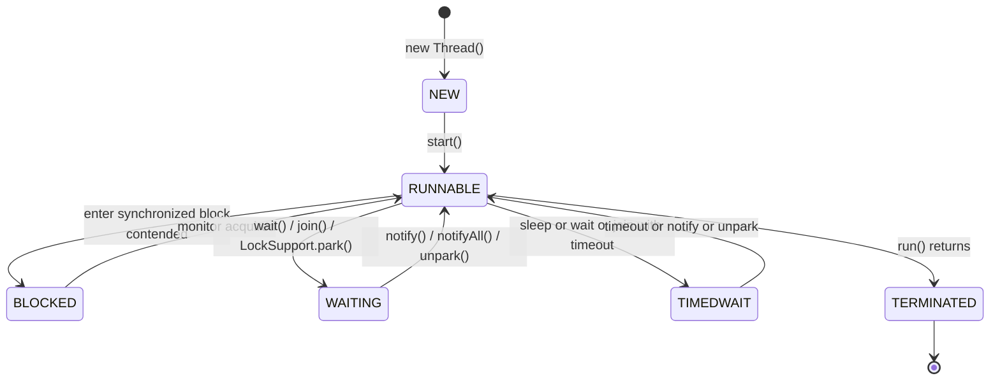

# Threads, Runnable, and Callable

## Overview

Concurrency in Java begins with the thread. A thread is the smallest unit of execution that the Java Virtual Machine can schedule onto an operating system thread. Every Java program has at least one thread, the main thread, created by the JVM when the `main` method is invoked. From that single thread, application code can spawn thousands more, depending on the workload. This note covers the foundational abstractions of Java concurrency: the `Thread` class, the `Runnable` interface, the `Callable` interface, and the complete lifecycle a thread travels through from creation to termination.

Understanding these primitives is essential even in modern Java because every higher-level abstraction in `java.util.concurrent`, including executors, fork-join pools, `CompletableFuture`, and virtual threads, ultimately runs code on a thread. If you do not understand what a thread is, what its lifecycle states mean, and how `Runnable` and `Callable` differ, you cannot reliably reason about the libraries built on top of them. This note assumes Java 21, which means virtual threads are first-class citizens, but everything you learn here about platform threads applies to virtual threads as well unless explicitly noted.

## Background Knowledge

Before diving into threads, you should be comfortable with the following concepts from earlier phases of this roadmap:

- The JVM runtime data areas, particularly the stack and heap. Each thread has its own private stack; objects live on the shared heap.
- The difference between a process and a thread. A process has its own memory space; threads inside a process share memory.
- The Java Memory Model, which defines how threads interact through shared memory. We will introduce enough of it here to discuss visibility, with a deeper treatment in the dedicated note on deadlocks and the memory model.
- Functional interfaces and lambda expressions, because `Runnable` and `Callable` are both single-method interfaces and are almost always used with lambdas in modern code.

A thread is not free. On a 64-bit JVM, a platform thread's stack alone consumes between 512 KB and 1 MB by default, depending on the operating system and the `-Xss` flag. Creating ten thousand platform threads therefore demands roughly 10 GB of stack memory, which is one of the reasons virtual threads were introduced in Java 21. We will explore that comparison in depth later.

## The Thread Class

The `java.lang.Thread` class is the entry point to platform-level concurrency in Java. Every thread in the JVM is represented by an instance of `Thread`. A new thread begins its life in the `NEW` state and progresses through several states until it terminates.

### Creating a Thread Directly

The simplest way to create a thread is to subclass `Thread` and override `run`:

```java
// Subclassing Thread is discouraged in production code
// but useful for understanding what a thread actually is.
public class HelloThread extends Thread {

    @Override
    public void run() {
        // This is the code that executes on the new thread.
        // The current thread can be obtained at any point.
        Thread current = Thread.currentThread();
        System.out.println("Hello from " + current.getName());
    }

    public static void main(String[] args) {
        HelloThread t = new HelloThread();
        t.setName("hello-thread");
        // start() schedules the thread; run() must NOT be called directly.
        t.start();

        // The main thread can continue doing other work here.
        System.out.println("Main thread: " + Thread.currentThread().getName());
    }
}
```

There are two crucial rules here. First, you must call `start()`, not `run()`. Calling `run()` directly executes the body on the calling thread, which defeats the entire purpose of having a thread and is one of the most common beginner mistakes. Second, a `Thread` instance can only be started once. Calling `start()` a second time throws `IllegalThreadStateException`.

### The Thread Lifecycle

The JVM defines six thread states, exposed as the `Thread.State` enum. Understanding them is essential for reading thread dumps and reasoning about deadlocks.



Let us walk through each state in detail.

#### NEW

A thread that has been created but not yet started. The `Thread` object exists on the heap, but no OS thread has been allocated. Calling `start()` transitions the thread to `RUNNABLE`.

#### RUNNABLE

A thread in this state is eligible to run. The name is misleading: a `RUNNABLE` thread may actually be executing on a CPU, or it may be sitting in the operating system's run queue waiting for a time slice. The JVM does not distinguish between these two sub-states. This is why a thread doing blocking I/O in a native call may report `RUNNABLE` even though it is not consuming CPU: from the JVM's perspective it is still eligible to run as soon as the I/O completes.

#### BLOCKED

A thread enters `BLOCKED` when it is waiting to acquire the intrinsic lock (monitor) of an object, typically because another thread holds that lock inside a `synchronized` block or method. The transition out of `BLOCKED` to `RUNNABLE` happens automatically when the lock is released and the OS selects this thread as the next owner. Note that `java.util.concurrent.locks.Lock` implementations generally do not put threads in `BLOCKED`; they use `LockSupport.park()`, which puts the thread in `WAITING`.

#### WAITING

A thread is in `WAITING` when it is parked indefinitely, waiting for another thread to perform an action. The classic ways to enter `WAITING` are:

- Calling `Object.wait()` without a timeout, while holding the object's monitor.
- Calling `Thread.join()` without a timeout on another thread.
- Calling `LockSupport.park()` without a deadline.
- Calling `BlockingQueue.take()` on an empty queue.

The thread remains in `WAITING` until another thread explicitly wakes it via `notify()` or `notifyAll()` (for `wait`), completes (for `join`), or calls `LockSupport.unpark()`.

#### TIMED WAITING

The same as `WAITING`, but with a deadline. The state name in the `Thread.State` enum is written with an underscore between the two words (we will write it as TIMED WAITING in this note to comply with the vault convention of avoiding underscores). Entering methods include `Thread.sleep(long)`, `Object.wait(long)`, `Thread.join(long)`, `LockSupport.parkNanos(long)`, and `BlockingQueue.poll(long, TimeUnit)`. A thread in TIMED WAITING is waiting for a specific duration or until another thread signals it, whichever comes first. The JVM will automatically transition it to RUNNABLE when the timeout elapses or when the corresponding signal arrives.

#### TERMINATED

A thread reaches `TERMINATED` when its `run()` method returns, whether normally or by throwing an uncaught exception. Once terminated, a thread cannot be restarted.

### Important Thread Methods

```java
Thread t = new Thread(() -> System.out.println("work"));

t.setName("worker-1");                 // Useful for thread dumps
t.setDaemon(true);                     // Daemon threads do not keep JVM alive
t.setPriority(5);   // 5 is normal priority (range is 1 to 10)
t.setUncaughtExceptionHandler((thread, ex) ->
    System.err.println(thread.getName() + " threw " + ex));

t.start();
t.interrupt();                         // Sets the interrupt flag
boolean alive = t.isAlive();           // true if started and not terminated
t.join();                              // Block the current thread until t terminates
```

The `setDaemon` method deserves a closer look. The JVM exits when the only remaining running threads are daemon threads. Garbage collection, finalization, and certain JMX agents run on daemon threads. You should mark long-running background services like heartbeats or cleanup loops as daemon if you want the JVM to shut down without explicitly stopping them.

### Interrupting Threads

There is no safe, forceful way to stop a thread in Java. The `Thread.stop()` method was deprecated in Java 1.2 and removed for removal in Java 18+, because abruptly killing a thread can leave shared data in inconsistent states. Instead, Java uses cooperative cancellation through the interrupt flag.

```java
public class InterruptibleWorker implements Runnable {

    @Override
    public void run() {
        // Polling pattern: check the flag at safe points.
        while (!Thread.currentThread().isInterrupted()) {
            doUnitOfWork();
        }
        System.out.println("Clean exit");
    }

    private void doUnitOfWork() {
        try {
            // Blocking methods respond to interrupts by throwing
            // InterruptedException and clearing the flag.
            Thread.sleep(50);
        } catch (InterruptedException e) {
            // InterruptedException clears the interrupt flag, so
            // we must restore it if we want the loop to terminate.
            Thread.currentThread().interrupt();
        }
    }
}
```

The golden rule for interrupts is: if you catch `InterruptedException` and you are not about to exit the method, restore the interrupt status with `Thread.currentThread().interrupt()`. Failing to do so silently swallows the cancellation signal and produces bugs that are extremely hard to diagnose.

## The Runnable Interface

`Runnable` is the simplest functional interface in the concurrency package. It has a single method that takes no arguments and returns no value.

```java
@FunctionalInterface
public interface Runnable {
    void run();
}
```

`Runnable` predates generics and the `java.util.concurrent` package: it has been in `java.lang` since Java 1.0. Its original purpose was to provide a way to specify the work a thread should perform without forcing developers to subclass `Thread`. The pattern is:

```java
Runnable task = () -> System.out.println("Running on " + Thread.currentThread());
Thread t = new Thread(task, "worker-1");
t.start();
```

The advantage of `Runnable` over subclassing `Thread` is decoupling: the same `Runnable` can be submitted to a `Thread`, an `ExecutorService`, a `ForkJoinPool`, or a virtual-thread factory. The task itself does not care which thread runs it.

### Limitations of Runnable

`Runnable` has two significant limitations:

1. It cannot return a result. If a worker computes a value, you must write that value to a shared field or queue and read it from the calling thread, which requires synchronization.
2. It cannot throw checked exceptions. Any checked exception thrown inside `run()` must be caught and handled, or wrapped in a `RuntimeException`. This loses compile-time checking and forces boilerplate.

These limitations are the reason `Callable` was introduced in Java 5 as part of JSR 166 (the `java.util.concurrent` package).

## The Callable Interface

`Callable<V>` is a parameterized functional interface that returns a value and may throw any exception.

```java
@FunctionalInterface
public interface Callable<V> {
    V call() throws Exception;
}
```

Because it can throw `Exception`, you do not need to wrap checked exceptions, and because it returns a value, the executor framework can capture the result and deliver it to the caller. Here is the equivalent of the previous example using `Callable`:

```java
Callable<Integer> task = () -> {
    Thread.sleep(100);
    return 42;
};

try (var executor = java.util.concurrent.Executors.newSingleThreadExecutor()) {
    var future = executor.submit(task);
    Integer result = future.get();  // Blocks until the task completes
    System.out.println("Got " + result);
}
```

The trade-off is that `Callable` cannot be passed to the `Thread` constructor directly: `Thread` only accepts a `Runnable`. The executor framework bridges this gap by internally wrapping the `Callable` into a `FutureTask`, which is both a `Future` and a `Runnable`. We will explore this in the next note on executors.

### Runnable vs Callable: Decision Table

| Property                  | Runnable                          | Callable                          |
|---------------------------|-----------------------------------|-----------------------------------|
| Return type               | void                              | Parameterized type V              |
| Checked exceptions        | Not allowed in signature          | Allowed (`throws Exception`)      |
| Introduced in             | Java 1.0                          | Java 5                            |
| Accepted by Thread ctor   | Yes                               | No                                |
| Accepted by Executor      | Yes (`submit(Runnable)`)          | Yes (`submit(Callable)`)          |
| Use case                  | Fire-and-forget tasks             | Tasks that produce a result       |

In practice, modern Java code rarely uses `Runnable` for tasks that need to compute something. The `Callable` interface, combined with `CompletableFuture` and structured concurrency, has become the default for asynchronous work that yields a value.

## Bridging Runnable and Callable

The `Executors` utility class provides a helper to convert a `Runnable` into a `Callable`:

```java
Runnable r = () -> System.out.println("hi");
Callable<Object> c = Executors.callable(r);            // returns null
Callable<Integer> c2 = Executors.callable(r, 7);       // returns 7
```

This is useful when an API requires a `Callable` but you only have a `Runnable`. In the other direction, you can wrap a `Callable` in a `FutureTask`, which implements `Runnable`:

```java
Callable<Integer> work = () -> 42;
var futureTask = new java.util.concurrent.FutureTask<>(work);
new Thread(futureTask, "worker").start();
Integer result = futureTask.get();
```

This is exactly what `ExecutorService.submit(Callable)` does internally.

## Thread Creation Patterns

Modern Java offers several idiomatic ways to create threads, each suited to different scales and patterns.

### Pattern 1: Direct Thread creation (legacy)

Suitable for tiny utilities and demos. Not recommended for production because it does not pool threads, leading to thread-creation overhead per task.

```java
new Thread(() -> doWork()).start();
```

### Pattern 2: Executor framework

The standard approach for platform threads since Java 5. A pool of threads is reused across many tasks, avoiding the cost of creating and destroying threads.

```java
try (var executor = Executors.newFixedThreadPool(8)) {
    executor.submit(() -> doWork());
}
```

### Pattern 3: Virtual threads (Java 21+)

The new default for I/O-bound workloads. Each virtual thread is cheap (a few hundred bytes) and is mounted on a carrier thread from a small `ForkJoinPool`. You can create millions of them.

```java
try (var executor = Executors.newVirtualThreadPerTaskExecutor()) {
    executor.submit(() -> doWork());
}
```

### Pattern 4: Structured concurrency (Java 21+)

The newest pattern, designed for short-lived, fan-out workloads where you want the lifetime of child threads to be tied to a parent scope. Covered in detail in the dedicated note.

```java
try (var scope = new java.util.concurrent.StructuredTaskScope.ShutdownOnFailure()) {
    var user = scope.fork(() -> fetchUser(id));
    var orders = scope.fork(() -> fetchOrders(id));
    scope.join().throwIfFailed();
    return new Profile(user.get(), orders.get());
}
```

## The Main Thread and Shutdown Hooks

Every Java application has a main thread, created by the JVM. You can obtain a reference to it via:

```java
Thread main = Thread.currentThread();  // when called from main()
```

The JVM also runs shutdown hooks when the application exits. A shutdown hook is simply a `Thread` that has been registered with `Runtime.addShutdownHook` and is started when the JVM begins its shutdown sequence.

```java
Runtime.getRuntime().addShutdownHook(new Thread(() -> {
    System.out.println("Cleaning up resources...");
    closeDatabaseConnections();
    flushBuffers();
}));
```

Shutdown hooks run concurrently, so if multiple hooks are registered they may execute in parallel. They should be quick and must not rely on services that have already been shut down.

## Daemon Threads and Application Lifecycle

A daemon thread is one that does not prevent the JVM from exiting. When the only live threads are daemon threads, the JVM terminates immediately, which means daemon threads may be interrupted mid-execution. This makes them inappropriate for any work that requires graceful shutdown, such as writing to a database or flushing a log file.

```java
Thread heartbeat = new Thread(() -> {
    while (true) {
        try { Thread.sleep(1000); } catch (InterruptedException e) { return; }
        sendHeartbeat();
    }
});
heartbeat.setDaemon(true);
heartbeat.start();
```

The rule of thumb: use daemon threads for background housekeeping that is safe to abandon, and use non-daemon threads for any work that must complete.

## Thread Safety Fundamentals

A class is thread-safe if it continues to behave correctly when accessed from multiple threads, regardless of how those threads are scheduled. The simplest way to achieve thread safety is immutability: an immutable object can be shared freely without synchronization because no thread can modify its state. Records, which are shallowly immutable, are excellent building blocks for thread-safe programs.

For mutable state, you must use one of the following techniques:

- **Mutual exclusion** via `synchronized` blocks or `Lock`, ensuring only one thread executes a critical section at a time.
- **Atomic variables** like `AtomicInteger` and `AtomicReference`, which use compare-and-swap operations to update state without locks.
- **Concurrent collections** like `ConcurrentHashMap` and `ConcurrentLinkedQueue`, which are designed for high-concurrency access.
- **Thread confinement**, where each thread has its own copy of the state via `ThreadLocal`.
- **Virtual threads** do not change any of this. They are scheduled like platform threads, and the same synchronization rules apply.

## A Complete Example: Parallel Sum

Let us put these concepts together with a small example that uses `Callable`, an executor, and `Future` to compute a sum across multiple threads.

```java
import java.util.concurrent.*;
import java.util.List;

public class ParallelSum {

    // Split the range [0, n) into chunks and sum each chunk on a
    // separate thread, then add up the partial results.
    public static long sum(long n, int workers) throws Exception {
        try (var executor = Executors.newFixedThreadPool(workers)) {
            long chunkSize = (n + workers - 1) / workers;
            var tasks = new java.util.ArrayList<Callable<Long>>();

            for (int i = 0; i < workers; i++) {
                long from = i * chunkSize;
                long to = Math.min(from + chunkSize, n);
                tasks.add(() -> partialSum(from, to));
            }

            // Invoke all tasks and wait for all to complete.
            List<Future<Long>> futures = executor.invokeAll(tasks);

            long total = 0;
            for (Future<Long> f : futures) {
                // get() blocks until the corresponding task is done.
                total += f.get();
            }
            return total;
        }
    }

    private static long partialSum(long from, long to) {
        long sum = 0;
        for (long i = from; i < to; i++) {
            sum += i;
        }
        return sum;
    }

    public static void main(String[] args) throws Exception {
        long result = sum(100000000L, 8);
        System.out.println("Sum = " + result);
    }
}
```

This example demonstrates the core abstractions: `Callable` for the unit of work, `ExecutorService` to run the work, `Future` to retrieve results, and graceful shutdown via the try-with-resources idiom (which calls `close` on the executor, which in turn calls `shutdown` and waits for tasks to finish).

## Common Pitfalls

### Calling run() instead of start()

This silently runs the task on the current thread. The bug is hard to spot in code review because both method calls look similar. Always call `start()`.

### Forgetting to restore the interrupt flag

When you catch `InterruptedException`, the interrupt status is cleared. If you propagate the interruption up the call stack by re-throwing, this is fine. If you continue running, you must call `Thread.currentThread().interrupt()` to restore the flag.

### Using Thread.stop, Thread.suspend, Thread.resume

These methods were deprecated long ago because they can leave shared data in inconsistent states. They have been removed for removal in recent Java releases. Use cooperative cancellation through interrupts instead.

### Blocking on Future.get() without a timeout

`Future.get()` without a timeout blocks forever if the task never completes. Always use the overloaded version with a timeout, and handle `TimeoutException` gracefully.

### Catching InterruptedException and ignoring it

The empty `catch (InterruptedException e) {}` is one of the most damaging anti-patterns in Java concurrency. It silently swallows cancellation, making the program impossible to shut down cleanly.

### Over-relying on thread priorities

Thread priorities are hints to the OS scheduler, and their behavior varies wildly across operating systems. Do not build correctness on top of priorities.

### Subclassing Thread instead of implementing Runnable

Subclassing `Thread` couples the task to the threading abstraction, prevents the task from being submitted to executors, and is generally discouraged. Implement `Runnable` or `Callable` instead.

### Not naming threads

In a thread dump, unnamed threads appear as `Thread-0`, `Thread-1`, and so on, which makes debugging nearly impossible. Always give threads meaningful names via `setName` or a custom `ThreadFactory`.

## Tips and Tricks

### Use a ThreadFactory to name threads

```java
import java.util.concurrent.ThreadFactory;
import java.util.concurrent.atomic.AtomicInteger;

public class NamedThreadFactory implements ThreadFactory {
    private final AtomicInteger counter = new AtomicInteger();
    private final String prefix;

    public NamedThreadFactory(String prefix) { this.prefix = prefix; }

    @Override
    public Thread newThread(Runnable r) {
        return new Thread(r, prefix + "-" + counter.incrementAndGet());
    }
}

// Usage:
var executor = Executors.newFixedThreadPool(8, new NamedThreadFactory("worker"));
```

### Use the Thread.ofVirtual factory for virtual threads

In Java 21, the recommended way to start a single virtual thread is:

```java
Thread.startVirtualThread(() -> doWork());
```

For platform threads with custom settings:

```java
Thread platform = Thread.ofPlatform()
    .name("worker-", 0)  // "worker-0", "worker-1", ...
    .daemon(true)
    .start(() -> doWork());
```

### Read thread dumps regularly

Tools like `jstack`, `jcmd <pid> Thread.print`, and VisualVM produce thread dumps that show the state of every thread. Reading these dumps fluently is the single most useful skill for debugging concurrency bugs.

### Use ThreadMXBean for monitoring

The `java.lang.management.ThreadMXBean` interface exposes runtime information about threads, including their state, stack traces, and deadlock detection.

```java
java.lang.management.ManagementFactory.getThreadMXBean()
    .findAllDeadlockedThreads();  // returns null if no deadlocks
```

### Set sensible stack sizes for platform threads

The default stack size is platform-dependent (commonly 1 MB on Linux). For many workloads 256 KB is sufficient, allowing more threads per JVM. Use the `Thread(ThreadGroup, Runnable, String, long)` constructor or the `-Xss` JVM flag.

## Interview Questions

### Q1: What is the difference between a process and a thread?

A process is an executing instance of a program with its own address space, file descriptors, and security context. A thread is a unit of execution within a process. Threads in the same process share the heap and other process resources but each has its own stack, program counter, and registers. Context switching between threads of the same process is cheaper than between processes because the address space does not change.

### Q2: How do you start a thread in Java?

By calling `start()` on a `Thread` instance. Calling `run()` directly does not start a new thread; it executes the body on the current thread. A `Thread` can only be started once; a second `start()` throws `IllegalThreadStateException`.

### Q3: What are the six thread states in Java?

`NEW`, `RUNNABLE`, `BLOCKED`, `WAITING`, `TIMED WAITING`, and `TERMINATED`. These are the values of the `Thread.State` enum and reflect the JVM's view of the thread's lifecycle. In the actual enum declaration each name is a single token (with the two words of the timed waiting state joined by an underscore inside the source code), but we write them with spaces here to keep the vault consistent.

### Q4: What is the difference between Runnable and Callable?

`Runnable.run()` returns `void` and cannot throw checked exceptions. `Callable.call()` returns a value of a parameterized type and may throw any `Exception`. `Callable` is preferred when a task must produce a result. `Runnable` is accepted by the `Thread` constructor; `Callable` is not, and must be submitted to an executor.

### Q5: Why was Thread.stop deprecated?

Because stopping a thread forcibly can leave shared data structures in an inconsistent state. If a thread is stopped while inside a `synchronized` block, the lock is released but the invariants it was protecting may have been temporarily broken. Instead, Java uses cooperative cancellation: one thread sets the interrupt flag, and the target thread checks the flag and exits cleanly.

### Q6: What is a daemon thread?

A daemon thread is one that does not prevent the JVM from exiting. When the only live threads are daemon threads, the JVM shuts down. Daemon threads are appropriate for background housekeeping tasks like heartbeats that are safe to abandon, and inappropriate for any work that requires graceful shutdown.

### Q7: How does interrupt work?

`Thread.interrupt()` sets the thread's interrupt flag. The thread can poll this flag with `isInterrupted()`. Blocking methods like `Thread.sleep()` and `Object.wait()` check the flag and throw `InterruptedException`, clearing the flag in the process. Code that catches `InterruptedException` should either propagate it or restore the flag with `Thread.currentThread().interrupt()`.

### Q8: Can you call start() twice on the same Thread?

No. The second call throws `IllegalThreadStateException`. To run the same task again, create a new `Thread` instance.

### Q9: What happens if you call run() directly?

The `run()` method executes on the current thread, not on a new thread. No OS thread is allocated and no scheduling occurs. This is almost always a bug.

### Q10: What is the difference between BLOCKED and WAITING?

`BLOCKED` is entered only when a thread is waiting to acquire an intrinsic lock (monitor) for a `synchronized` block or method. `WAITING` is entered when a thread is parked indefinitely via `Object.wait()`, `Thread.join()`, or `LockSupport.park()`. The transition out of `BLOCKED` is automatic when the lock is released; the transition out of `WAITING` requires an explicit signal.

### Q11: Why does Thread.sleep report RUNNABLE on some JVMs?

It does not. `Thread.sleep` puts the thread in TIMED WAITING. However, blocking I/O calls in native code (such as `Socket.read`) leave the thread in `RUNNABLE` from the JVM's perspective, because the JVM does not know the thread is waiting on I/O. This is why a thread performing network I/O often appears to be using CPU when it is actually idle from the application point of view. Profilers that rely on thread state will report such a thread as RUNNABLE, which can be misleading when you are trying to find bottlenecks in your application. The new JDK Flight Recorder events for blocking I/O (introduced in Java 21) help by recording the actual time spent waiting on each socket, file, or pipe.

### Q12: How do you set a custom uncaught exception handler?

Via `Thread.setUncaughtExceptionHandler(UncaughtExceptionHandler)` for a specific thread, or `Thread.setDefaultUncaughtExceptionHandler(...)` for all threads. The handler is invoked when a thread terminates due to an uncaught exception.

### Q13: What is the difference between interrupt() and stop()?

`interrupt()` is a cooperative signal: it sets a flag that the target thread can check, and it wakes the thread from certain blocking operations. `stop()` forcibly terminates the thread, which is unsafe and deprecated. `interrupt()` is the correct way to cancel a thread.

### Q14: How do virtual threads differ from platform threads?

Platform threads are thin wrappers around OS threads, each consuming roughly 1 MB of stack. Virtual threads (Java 21+) are user-mode constructs managed by the JVM, each consuming a few hundred bytes. Virtual threads are mounted on a small pool of carrier threads (a `ForkJoinPool`) and are ideal for I/O-bound workloads with many concurrent tasks. They are not suitable for CPU-bound work or for code that holds intrinsic locks for long periods.

### Q15: What is the relationship between Thread and ExecutorService?

`ExecutorService` is a higher-level abstraction that manages a pool of `Thread` instances and dispatches tasks to them. Instead of creating threads directly, you submit `Runnable` or `Callable` tasks to an executor, which schedules them on its threads. This decouples task submission from thread management and enables thread reuse.

## Summary

Threads, `Runnable`, and `Callable` form the bedrock of Java concurrency. A `Thread` represents a unit of execution; `Runnable` describes a unit of work that returns no value; `Callable` describes a unit of work that returns a value and may throw checked exceptions. Every thread moves through a well-defined lifecycle of six states, and understanding these states is essential for reading thread dumps and diagnosing concurrency bugs.

Modern Java has moved away from manually creating threads toward the executor framework and, more recently, virtual threads. Yet the underlying primitives remain vital: interrupts, daemon status, thread names, and uncaught exception handlers all behave identically on platform and virtual threads. By mastering these fundamentals, you lay the groundwork for understanding executors, locks, atomic variables, concurrent collections, and the Java Memory Model that the subsequent notes will explore.
