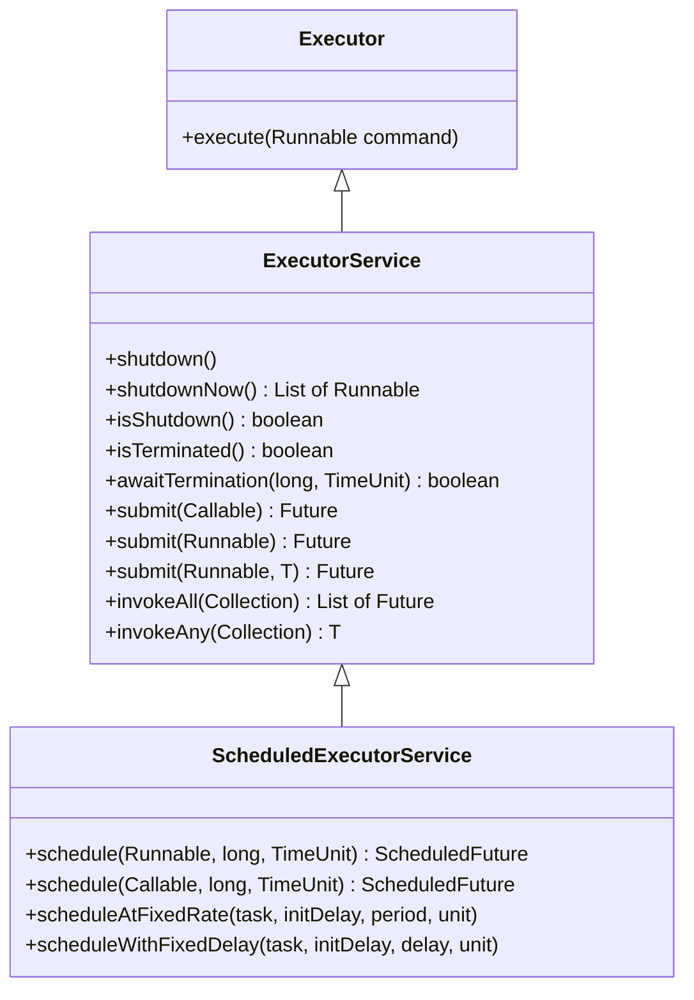
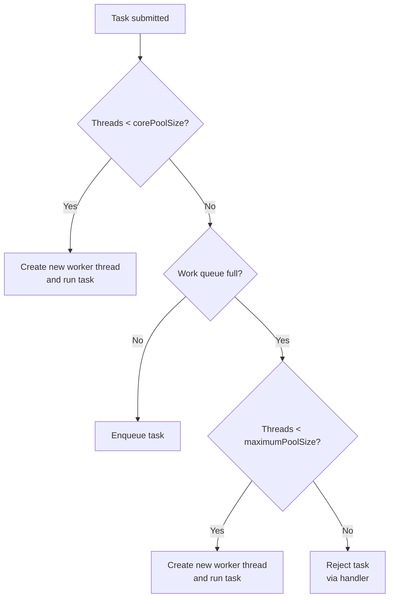
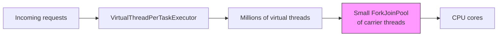

# The Executor Framework and Thread Pools

## Overview

Creating threads directly with `new Thread(...)` is convenient for tiny demos but does not scale to production workloads. Every platform thread consumes approximately one megabyte of stack space, takes a measurable amount of time to start, and is not reused once its task completes. In an application that processes thousands of requests per second, this would mean creating and destroying thousands of threads per second, which is both wasteful and dangerous.

The Executor framework, introduced in Java 5 as part of JSR 166, addresses these problems by decoupling task submission from task execution. Instead of spawning a new thread per task, you submit tasks to an `ExecutorService`, which schedules them on a pool of pre-created worker threads. The pool reuses threads across many tasks, keeps a queue for pending work, and provides hooks for shutdown, monitoring, and exception handling.

This note covers the Executor framework in depth. We will explore the `Executor`, `ExecutorService`, and `ScheduledExecutorService` interfaces, the factory methods in `Executors`, the `ThreadPoolExecutor` internals, thread pool sizing strategies, exception handling, graceful shutdown, and integration with virtual threads in Java 21.

## Background Knowledge

Before reading this note, make sure you are comfortable with the following from earlier phases:

- The `Thread` class and the six thread states (NEW, RUNNABLE, BLOCKED, WAITING, TIMED WAITING, TERMINATED), covered in the previous note.
- The `Runnable` and `Callable` interfaces and the difference between them.
- The `Future` interface, which represents the result of an asynchronous computation.

A thread pool is a collection of worker threads that wait for tasks to be submitted to a work queue. When a task arrives, an idle worker picks it up and executes it; when the task completes, the worker returns to the queue to wait for the next task. This pattern avoids the cost of thread creation and destruction on every operation and bounds the maximum number of concurrent threads, which protects the JVM from resource exhaustion under load.

## The Executor Interface Hierarchy

The Executor framework is organised around three interfaces, each adding more capability than the last.



### Executor

The base interface has a single method, `execute(Runnable)`. It accepts a task and runs it at some time in the future, but offers no way to retrieve a result, check completion, or cancel the task. Despite its simplicity, `Executor` is useful as a parameter type when you only need fire-and-forget execution.

### ExecutorService

The `ExecutorService` interface extends `Executor` with lifecycle management and result-bearing task submission. Its key methods are:

- `submit(Callable<T>)` returns a `Future<T>` representing the pending result.
- `submit(Runnable)` returns a `Future<?>` that completes with `null` when the task finishes.
- `submit(Runnable, T result)` returns a `Future<T>` that completes with the given result.
- `invokeAll(Collection<Callable<T>>)` runs all tasks and waits for all of them to complete.
- `invokeAny(Collection<Callable<T>>` runs all tasks and returns the first successful result, cancelling the rest.
- `shutdown()` initiates an orderly shutdown, finishing previously submitted tasks but refusing new ones.
- `shutdownNow()` attempts to halt by interrupting running tasks and returning the list of tasks awaiting execution.
- `awaitTermination(long, TimeUnit)` blocks until all tasks complete after a shutdown request, or the timeout elapses.

### ScheduledExecutorService

The `ScheduledExecutorService` interface adds the ability to schedule tasks with a delay or to execute them periodically. We will examine it later in this note.

## The Executors Factory Methods

The `java.util.concurrent.Executors` class provides static factory methods that return pre-configured `ExecutorService` instances. They are convenient but should be used with care in production code, because the defaults are not always appropriate.

### newFixedThreadPool(int nThreads)

Creates a pool with a fixed number of threads and an unbounded `LinkedBlockingQueue`. If a task is submitted and all threads are busy, it is enqueued and waits indefinitely. This is fine for CPU-bound workloads where you want exactly `n` concurrent tasks, but the unbounded queue can grow without limit and exhaust memory under bursty load.

```java
var executor = Executors.newFixedThreadPool(8);
```

### newCachedThreadPool()

Creates a pool that creates new threads as needed and reuses threads that have been idle for sixty seconds. The queue is a `SynchronousQueue`, which has no capacity: each `submit` blocks until a worker is available to take the task. This is suitable for short-lived, I/O-bound tasks but can create an unbounded number of threads if tasks arrive faster than they complete, which may bring the JVM down.

```java
var executor = Executors.newCachedThreadPool();
```

### newSingleThreadExecutor()

Creates a pool with a single worker thread and an unbounded queue. Tasks execute in the order they were submitted, with no concurrency. Useful for sequential workloads that must not overlap, such as serialising writes to a log file.

```java
var executor = Executors.newSingleThreadExecutor();
```

### newScheduledThreadPool(int corePoolSize)

Creates a `ScheduledThreadPoolExecutor` that can run tasks after a delay or periodically. Covered in detail below.

```java
var scheduler = Executors.newScheduledThreadPool(4);
```

### newVirtualThreadPerTaskExecutor() (Java 21+)

Creates an executor that starts a new virtual thread for every submitted task. There is no pool of reusable threads; instead, each task gets its own virtual thread, which is cheap to create and dispose of. The unbounded concurrency means that this executor is ideal for I/O-bound workloads. CPU-bound work should still be bounded explicitly.

```java
try (var executor = Executors.newVirtualThreadPerTaskExecutor()) {
    IntStream.range(0, 10000).forEach(i ->
        executor.submit(() -> fetch("https://api.example.com/" + i)));
}
```

### Why the factory methods are sometimes problematic

The `Executors` factory methods use unbounded queues and, in the case of `newCachedThreadPool`, unbounded thread creation. In a production system under sustained load, both can lead to out-of-memory errors. The recommendation from the `ThreadPoolExecutor` documentation is to construct the executor explicitly with a bounded queue and a `RejectedExecutionHandler`, so that you control what happens when the system is overloaded.

## ThreadPoolExecutor Internals

`ThreadPoolExecutor` is the workhorse implementation of `ExecutorService`. Understanding its internals is essential for tuning production applications.

### Constructor Parameters

```java
public ThreadPoolExecutor(
    int corePoolSize,                    // Minimum threads to keep alive
    int maximumPoolSize,                 // Maximum threads to create
    long keepAliveTime,                  // Idle time before excess threads die
    TimeUnit unit,
    BlockingQueue<Runnable> workQueue,   // Queue for pending tasks
    ThreadFactory threadFactory,         // Creates new threads
    RejectedExecutionHandler handler     // What to do when overloaded
)
```

The lifecycle of a submitted task is more subtle than it appears. The executor does not simply enqueue every task. Instead, it follows this algorithm:



This ordering is critical: the executor grows the pool to `corePoolSize` first, then fills the queue, and only then grows the pool further toward `maximumPoolSize`. A common mistake is to use a queue with the largest possible integer capacity (2147483647, the value of the `Integer` class maximum-value constant; such as the default for `LinkedBlockingQueue`), which means the queue never fills, the pool never grows past `corePoolSize`, and `maximumPoolSize` is effectively ignored.

### Work Queue Choices

- `SynchronousQueue`: zero capacity, hands off directly from producer to worker. Used by `newCachedThreadPool`. Forces the pool to grow up to `maximumPoolSize`.
- `ArrayBlockingQueue`: bounded, array-backed. Predictable memory footprint; ideal when you want backpressure.
- `LinkedBlockingQueue`: optionally bounded, linked-node backed. The default in the `Executors` factories is unbounded, which is dangerous.
- `PriorityBlockingQueue`: unbounded, priority-ordered. Tasks must implement `Comparable` or you must supply a `Comparator`.

### Rejection Policies

When the queue is full and the pool has reached `maximumPoolSize`, new tasks are rejected. The handler determines what happens:

- `AbortPolicy` (default): throws `RejectedExecutionException`.
- `CallerRunsPolicy`: runs the task on the calling thread, providing backpressure by slowing the producer.
- `DiscardPolicy`: silently drops the task.
- `DiscardOldestPolicy`: drops the oldest queued task and retries.

In production, `CallerRunsPolicy` is often a sensible choice: it slows the producer and gives the system a chance to recover, rather than throwing exceptions or losing work.

### A Production-Grade Configuration

```java
import java.util.concurrent.*;

ThreadFactory factory = r -> {
    Thread t = new Thread(r);
    t.setName("order-processor-" + t.threadId());
    t.setUncaughtExceptionHandler((thread, ex) ->
        System.err.println(thread.getName() + " died: " + ex));
    return t;
};

ThreadPoolExecutor executor = new ThreadPoolExecutor(
    8,                                  // corePoolSize
    32,                                 // maximumPoolSize
    60L, TimeUnit.SECONDS,              // keepAliveTime
    new ArrayBlockingQueue<>(500),      // bounded queue
    factory,
    new ThreadPoolExecutor.CallerRunsPolicy()
);
```

This configuration keeps 8 threads warm, grows up to 32 under load, queues at most 500 pending tasks, names threads for diagnostics, captures uncaught exceptions, and slows producers when overloaded rather than dropping work.

## Submitting Tasks and Reading Results

### submit and Future

```java
try (var executor = Executors.newFixedThreadPool(4)) {
    Future<String> future = executor.submit(() -> {
        Thread.sleep(500);
        return "hello";
    });

    // Do other work here while the task runs...

    try {
        String result = future.get(1, TimeUnit.SECONDS);
        System.out.println(result);
    } catch (TimeoutException e) {
        future.cancel(true);  // interrupt the worker
        System.err.println("Task timed out");
    }
}
```

`Future.get()` blocks until the result is ready. The two-argument version with a timeout is strongly recommended; the no-argument version blocks forever if the task hangs.

### invokeAll

`invokeAll` submits a collection of tasks and returns a list of `Future` objects, completing only when all tasks are done. This is ideal when you must wait for several parallel computations to all finish before proceeding.

```java
var tasks = List.of(
    callable(() -> fetchUser(userId)),
    callable(() -> fetchOrders(userId)),
    callable(() -> fetchRecommendations(userId))
);

try (var executor = Executors.newFixedThreadPool(3)) {
    List<Future<Object>> futures = executor.invokeAll(tasks);
    for (Future<Object> f : futures) {
        System.out.println(f.get());
    }
}
```

### invokeAny

`invokeAny` submits a collection of tasks and returns the result of the first one to complete successfully, cancelling the rest. This is useful when you have several redundant services and want the fastest response.

```java
var replicas = List.of(
    callable(() -> queryReplica("r1")),
    callable(() -> queryReplica("r2")),
    callable(() -> queryReplica("r3"))
);

try (var executor = Executors.newFixedThreadPool(3)) {
    String fastest = (String) executor.invokeAny(replicas);
    System.out.println("First response: " + fastest);
}
```

If a task throws an exception, `invokeAny` tries the next one. Only if all tasks fail does it throw an `ExecutionException`.

## ScheduledExecutorService

For delayed or periodic tasks, use `ScheduledExecutorService`. It provides four key methods:

- `schedule(Runnable, long delay, TimeUnit)`: runs once after the delay.
- `schedule(Callable, long delay, TimeUnit)`: runs once after the delay and returns a result.
- `scheduleAtFixedRate(task, initDelay, period, unit)`: runs the task at a fixed interval regardless of how long the task takes. If a task takes longer than the period, the next execution starts immediately after the previous one ends.
- `scheduleWithFixedDelay(task, initDelay, delay, unit)`: runs the task with a fixed delay between the end of one execution and the start of the next.

```java
try (var scheduler = Executors.newScheduledThreadPool(2)) {

    // One-shot delay.
    scheduler.schedule(() -> System.out.println("5s elapsed"),
                      5, TimeUnit.SECONDS);

    // Heartbeat every 10 seconds, starting immediately.
    scheduler.scheduleAtFixedRate(() -> sendHeartbeat(),
                                  0, 10, TimeUnit.SECONDS);

    // Cleanup every 60 seconds after the previous run finishes.
    scheduler.scheduleWithFixedDelay(() -> cleanup(),
                                     0, 60, TimeUnit.SECONDS);
}
```

Two important rules for scheduled tasks:

1. If a task throws an uncaught exception, all subsequent executions are suppressed. Always wrap the task body in a try-catch that logs and returns normally.
2. `scheduleAtFixedRate` is not a guarantee of exact periodicity. If the system is overloaded and tasks take longer than the period, executions will back up. If you need precise timing, use a dedicated scheduler like Quartz.

## Shutdown Lifecycle

An `ExecutorService` is a long-lived resource that must be shut down explicitly. Otherwise, its non-daemon threads will keep the JVM alive indefinitely.

```java
ExecutorService executor = Executors.newFixedThreadPool(4);
try {
    // Submit work...
} finally {
    executor.shutdown();  // Stop accepting new tasks
    if (!executor.awaitTermination(60, TimeUnit.SECONDS)) {
        List<Runnable> dropped = executor.shutdownNow();
        System.err.println("Forcibly shut down; dropped " + dropped.size() + " tasks");
        if (!executor.awaitTermination(30, TimeUnit.SECONDS)) {
            System.err.println("Executor did not terminate");
        }
    }
}
```

Since Java 19, `ExecutorService` extends `AutoCloseable`, so you can use the try-with-resources idiom, which calls `close` for you. The default `close` implementation is equivalent to the manual sequence above with a generous default timeout.

```java
try (var executor = Executors.newFixedThreadPool(4)) {
    // Submit work; close() will wait for tasks to finish.
}
```

## Exception Handling

Tasks submitted via `execute` that throw uncaught exceptions invoke the thread's `UncaughtExceptionHandler`. Tasks submitted via `submit`, however, wrap any exception in an `ExecutionException` and rethrow it from `Future.get()`. This is a subtle but important difference.

```java
try (var executor = Executors.newSingleThreadExecutor()) {
    Future<?> f = executor.submit(() -> { throw new IllegalStateException("boom"); });
    try {
        f.get();
    } catch (ExecutionException e) {
        // The original exception is the cause.
        Throwable cause = e.getCause();
        System.err.println("Task failed: " + cause);
    }
}
```

If you forget to call `get()`, the exception is silently swallowed. Always either retrieve the result or wrap your task body in a try-catch that logs failures.

## Thread Pool Sizing Strategies

Choosing the right size for a thread pool is one of the most impactful decisions you can make for application performance.

### CPU-bound workloads

For tasks that compute without blocking (number crunching, sorting, image processing), the optimal pool size is the number of CPU cores. Adding more threads than cores only increases context-switching overhead. Use:

```java
int cpuBound = Runtime.getRuntime().availableProcessors();
var executor = Executors.newFixedThreadPool(cpuBound);
```

### I/O-bound workloads

For tasks that block on I/O (HTTP calls, database queries, file reads), the optimal pool size is much larger, because most threads are parked waiting for I/O to complete. A commonly cited formula (Brian Goetz, Java Concurrency in Practice) is:

```
threads = cores * targetUtilization * (1 + waitTime / computeTime)
```

If your task spends 90% of its time waiting on I/O and 10% computing, the wait-to-compute ratio is 9, so on a 4-core machine with target utilization 1.0, the optimal pool size is roughly `4 * 1.0 * (1 + 9) = 40`. In practice, you should measure rather than guess.

### Mixed workloads

For mixed workloads, consider two pools: a small CPU-bound pool for compute tasks and a larger I/O-bound pool for blocking calls. Alternatively, use virtual threads for the I/O portion.

### Virtual threads change the calculus

With virtual threads, the recommendation for I/O-bound work is to use `newVirtualThreadPerTaskExecutor()` and submit one task per request, without trying to size the pool. The carrier thread pool is sized to the number of CPU cores, and the JVM handles multiplexing millions of virtual threads onto it.



## Monitoring Thread Pools

`ThreadPoolExecutor` exposes several metrics that are useful for monitoring and alerting:

```java
ThreadPoolExecutor pool = (ThreadPoolExecutor) executor;
pool.getActiveCount();        // Threads executing tasks
pool.getQueue().size();       // Pending tasks
pool.getTaskCount();          // Total tasks ever submitted
pool.getCompletedTaskCount(); // Total tasks completed
pool.getLargestPoolSize();    // High water mark of pool size
```

A healthy system typically shows a queue size near zero and an active count below the core pool size. A queue that grows without bound indicates that the pool cannot keep up with demand and that you should either increase the pool size, throttle the producer, or shed load.

## Common Pitfalls

### Using an unbounded queue

The default `Executors.newFixedThreadPool` and `newSingleThreadExecutor` use an unbounded `LinkedBlockingQueue`. Under sustained load, the queue grows without limit and eventually exhausts memory. Always prefer a bounded queue in production.

### Calling get() without a timeout

`Future.get()` without a timeout blocks forever if the task never completes. Always use the two-argument version and handle `TimeoutException`.

### Forgetting to shut down the executor

A non-daemon thread in a thread pool will keep the JVM alive. If you do not call `shutdown`, the application will not exit. Use try-with-resources or an explicit `finally` block.

### Misunderstanding pool growth

Many developers assume that submitting a task to a `ThreadPoolExecutor` with `maximumPoolSize = 100` immediately creates new threads up to 100. It does not: the pool grows only after the queue fills. If you use an unbounded queue, the pool never grows past `corePoolSize`.

### Swallowing exceptions in submit

Tasks submitted via `submit` wrap their exceptions in `ExecutionException` and store them in the `Future`. If you never call `get`, the exception is silently lost. Either always call `get`, or wrap the task body in a try-catch that logs.

### Using execute when you need submit

`execute` accepts a `Runnable` and propagates exceptions to the `UncaughtExceptionHandler`. `submit` accepts either `Runnable` or `Callable` and captures exceptions in the returned `Future`. Choose based on whether you need to retrieve the result or handle the exception.

### Cancelling without mayInterruptIfRunning

`future.cancel(false)` only prevents the task from starting; it does not interrupt a running task. To interrupt a running task, you must pass `true`. But even then, the task must cooperatively check its interrupt status to actually stop.

### Reusing Executor instances across application lifecycles

Creating an executor per request is wasteful. Creating one per application and sharing it across requests is correct. Be careful with `ThreadLocal` state: worker threads are reused, so anything stored in `ThreadLocal` by one task may be visible to the next task on the same thread.

## Tips and Tricks

### Use a naming ThreadFactory

Readable thread names turn a confusing thread dump into a diagnostic tool:

```java
ThreadFactory namedFactory = Thread.ofPlatform()
    .name("worker-", 0)
    .daemon(false)
    .factory();
var executor = Executors.newFixedThreadPool(8, namedFactory);
```

### Prefer CompletableFuture over raw Future

`Future` only lets you block on a result. `CompletableFuture` lets you chain callbacks, combine results, and handle errors functionally. It is covered in detail in the next note.

### Set a RejectedExecutionHandler that provides backpressure

`CallerRunsPolicy` slows the producer when the consumer is overloaded. This is usually preferable to throwing exceptions or dropping work.

### Use the ForkJoinPool.commonPool for parallel streams

Parallel streams use the common pool by default, which has `Runtime.getRuntime().availableProcessors() - 1` threads. If you have blocking work inside a parallel stream, the common pool can be starved. Either avoid blocking in parallel streams or submit a custom `ForkJoinPool` to `submit` and run the stream inside that.

### Add metrics

Wrap `ThreadPoolExecutor` and log metrics such as queue depth, active count, and rejection count periodically. Tools like Micrometer expose these as gauges out of the box.

### Use a graceful shutdown hook

Register a shutdown hook that calls `executor.shutdown()` and `awaitTermination`. This ensures your application drains its work queue when the JVM receives a SIGTERM, which is essential for containerized deployments where Kubernetes sends SIGTERM before SIGKILL.

```java
Runtime.getRuntime().addShutdownHook(new Thread(() -> {
    executor.shutdown();
    try {
        if (!executor.awaitTermination(30, TimeUnit.SECONDS)) {
            executor.shutdownNow();
        }
    } catch (InterruptedException e) {
        executor.shutdownNow();
        Thread.currentThread().interrupt();
    }
}));
```

## Interview Questions

### Q1: What problem does the Executor framework solve?

It decouples task submission from task execution, enabling thread reuse, bounded concurrency, queueing, rejection policies, and graceful shutdown. Without it, applications would create and destroy a thread per task, which is expensive and unbounded.

### Q2: What is the difference between execute and submit?

`execute(Runnable)` runs the task and propagates any uncaught exception to the thread's `UncaughtExceptionHandler`. `submit` returns a `Future` and captures any exception inside it; the exception is rethrown as an `ExecutionException` when `get()` is called.

### Q3: How does ThreadPoolExecutor decide when to grow the pool?

It first grows the pool up to `corePoolSize` by creating new threads for each task. Once `corePoolSize` is reached, additional tasks are enqueued. Only when the queue is full does the pool grow further, up to `maximumPoolSize`. If the queue is unbounded, the pool never grows past `corePoolSize`.

### Q4: What is the difference between scheduleAtFixedRate and scheduleWithFixedDelay?

`scheduleAtFixedRate` runs the task with a fixed period between start times, so if a task takes longer than the period, subsequent executions may start immediately. `scheduleWithFixedDelay` runs the task with a fixed delay between the end of one execution and the start of the next, so the effective interval varies.

### Q5: How do you choose the size of a thread pool?

For CPU-bound tasks, the pool size should equal the number of CPU cores. For I/O-bound tasks, the pool size should be larger, based on the ratio of wait time to compute time. The classic formula is `threads = cores * targetUtilization * (1 + waitTime / computeTime)`. For mixed workloads, consider separate pools or use virtual threads.

### Q6: What happens when a thread pool is overloaded?

When the queue is full and the pool has reached `maximumPoolSize`, the `RejectedExecutionHandler` is invoked. The default `AbortPolicy` throws `RejectedExecutionException`. `CallerRunsPolicy` runs the task on the calling thread, providing backpressure. `DiscardPolicy` silently drops the task, and `DiscardOldestPolicy` drops the oldest queued task and retries.

### Q7: How do you shut down an ExecutorService gracefully?

Call `shutdown()` to stop accepting new tasks, then `awaitTermination(timeout)` to wait for queued and running tasks to finish. If the timeout elapses, call `shutdownNow()` to interrupt running tasks and retrieve the list of pending tasks. Since Java 19, you can use try-with-resources, which calls `close` for you.

### Q8: Why are the Executors factory methods sometimes discouraged in production?

Because `newFixedThreadPool` and `newSingleThreadExecutor` use unbounded queues, and `newCachedThreadPool` creates an unbounded number of threads. Both can cause out-of-memory errors under load. Constructing `ThreadPoolExecutor` directly with a bounded queue and an explicit rejection policy is safer.

### Q9: What is the common ForkJoinPool and why does it matter?

The common pool is a static `ForkJoinPool` shared by parallel streams and `CompletableFuture` by default. Its size is `Runtime.getRuntime().availableProcessors() - 1`. If you perform blocking operations inside a parallel stream, you can starve the common pool and affect unrelated parts of the application.

### Q10: How does newVirtualThreadPerTaskExecutor work?

It returns an executor that starts a new virtual thread for every submitted task. There is no thread pool in the traditional sense; virtual threads are cheap and disposed of after the task completes. The carrier threads are managed by a small `ForkJoinPool` sized to the number of CPU cores.

### Q11: What is the difference between invokeAll and invokeAny?

`invokeAll` runs all tasks and waits for all to complete, returning a list of `Future` objects. `invokeAny` runs all tasks and returns the first successful result, cancelling the rest. Use `invokeAll` when you need all results; use `invokeAny` when any one of several redundant services will do.

### Q12: What happens if a task submitted via submit throws a RuntimeException?

The exception is captured and stored in the `Future`. Calling `get()` rethrows it wrapped in an `ExecutionException`. The thread itself does not die; it is returned to the pool to handle subsequent tasks.

### Q13: How do you set a custom thread name in a thread pool?

Pass a `ThreadFactory` to the `ThreadPoolExecutor` constructor or to the `Executors` factory method that accepts one. In Java 21+, you can use `Thread.ofPlatform().name("prefix-", 0).factory()` for a fluent builder.

### Q14: What is the impact of a task throwing an exception in scheduleAtFixedRate?

The exception propagates to the `UncaughtExceptionHandler` and all subsequent executions are suppressed. The task is silently cancelled. Always wrap the task body in a try-catch that logs and returns normally.

### Q15: How do you cancel a running task?

Call `future.cancel(true)`. The `true` argument interrupts the worker thread. The task must cooperatively check its interrupt status (via `Thread.currentThread().isInterrupted()` or by handling `InterruptedException`) to actually stop.

## Summary

The Executor framework is the cornerstone of Java concurrency. It replaces ad-hoc thread creation with a managed pool of worker threads, a bounded or unbounded work queue, configurable rejection policies, and a clean lifecycle of shutdown and termination. The `Executors` factory methods are convenient for demos but should be replaced with explicit `ThreadPoolExecutor` construction in production, with a bounded queue and a `RejectedExecutionHandler` that provides backpressure.

Choosing the right pool size depends on the workload. CPU-bound tasks should use one thread per core; I/O-bound tasks should use many more, based on the wait-to-compute ratio. Virtual threads, introduced in Java 21, simplify I/O-bound workloads by allowing one virtual thread per task without manual sizing.

Mastering the Executor framework is a prerequisite for understanding `ForkJoinPool`, `CompletableFuture`, and structured concurrency, which build on top of it. The next note covers `ForkJoinPool` and `CompletableFuture`, two abstractions that turn the executor framework into a powerful tool for parallel and asynchronous programming.
