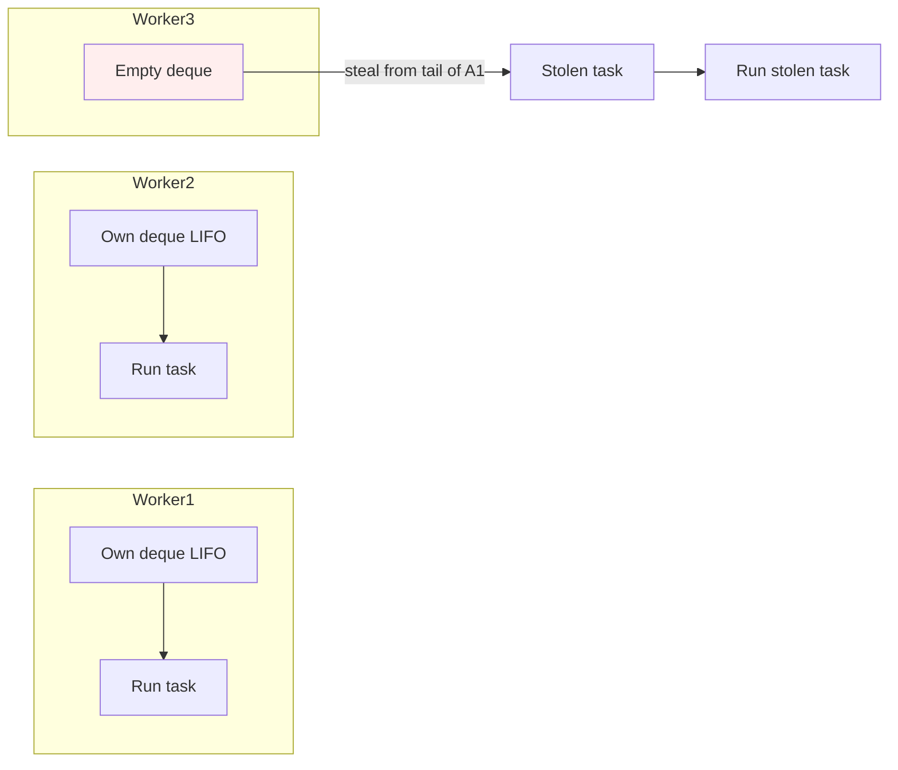

# ForkJoinPool and CompletableFuture

## Overview

The Executor framework handles independent tasks well, but many real-world workloads have richer structure. A large computation can often be split recursively into smaller sub-problems, each of which can be solved in parallel and then combined. An HTTP request might fan out into several downstream calls whose results must be assembled, with timeouts and error handling per branch. These patterns demand more than `ExecutorService.submit`.

`ForkJoinPool` and `CompletableFuture` are the two abstractions Java provides for structured parallelism. `ForkJoinPool` is a special-purpose executor designed for divide-and-conquer workloads, where tasks recursively fork sub-tasks and join their results. `CompletableFuture` is a composable future that lets you chain callbacks, combine multiple asynchronous results, and handle errors functionally without blocking.

This note covers both in depth. We will explore the work-stealing algorithm that powers `ForkJoinPool`, the `RecursiveTask` and `RecursiveAction` abstractions, the `commonPool`, the fluent API of `CompletableFuture`, error propagation, composition combinators, and best practices for combining the two.

## Background Knowledge

Before reading this note, you should be comfortable with:

- The Executor framework and `ThreadPoolExecutor`, covered in the previous note.
- The `Future` interface and its limitations: `Future.get()` blocks, offers no way to register a callback, and provides no way to combine multiple futures.
- Lambda expressions and functional interfaces, because both `ForkJoinPool` and `CompletableFuture` rely heavily on them.

The defining characteristic of a `ForkJoinPool` is work-stealing. In a regular thread pool, every worker pulls tasks from a single shared queue, which becomes a contention point under high concurrency. In a `ForkJoinPool`, each worker has its own deque (double-ended queue). A worker processes its own tasks in LIFO order to exploit cache locality, and when its deque is empty, it steals tasks from the tail of another worker's deque in FIFO order. This balances load without centralized contention.

## ForkJoinPool

### The Work-Stealing Algorithm



Each worker owns a deque. New tasks are pushed at the head and popped from the head, giving LIFO behaviour that maximises cache locality: the most recently forked sub-task is likely to touch memory still warm in the cache. When a worker's deque is empty, it scans other workers' deques and steals from the tail (FIFO), which tends to be the largest, oldest, and most coarse-grained task available, giving the thief a substantial chunk of work.

### ForkJoinTask, RecursiveTask, and RecursiveAction

`ForkJoinTask` is the abstract base class for tasks that run on a `ForkJoinPool`. It has two key methods:

- `fork()` queues the task on the current worker's deque (or submits to the pool if called outside one).
- `join()` blocks until the task completes and returns its result.

You almost never subclass `ForkJoinTask` directly. Instead, you extend one of two pre-built subclasses:

- `RecursiveTask<V>` returns a value. Override `compute()`.
- `RecursiveAction` returns void. Override `compute()`.

### A Divide-and-Conquer Example: Parallel Array Sum

```java
import java.util.concurrent.*;

public class ParallelSum {

    // A RecursiveTask that sums a slice of an array.
    // If the slice is small enough, compute directly;
    // otherwise split in half and fork both halves.
    static class SumTask extends RecursiveTask<Long> {
        private static final int THRESHOLD = 10000;
        private final long[] array;
        private final int from;
        private final int to;

        SumTask(long[] array, int from, int to) {
            this.array = array;
            this.from = from;
            this.to = to;
        }

        @Override
        protected Long compute() {
            int length = to - from;
            if (length <= THRESHOLD) {
                // Base case: small enough to compute directly.
                long sum = 0;
                for (int i = from; i < to; i++) {
                    sum += array[i];
                }
                return sum;
            }
            // Recursive case: fork both halves.
            int mid = from + length / 2;
            SumTask left = new SumTask(array, from, mid);
            SumTask right = new SumTask(array, mid, to);

            // fork() pushes the task asynchronously onto the deque.
            // Calling left.fork() before right.fork() and then
            // right.compute() inline is more efficient than forking
            // both, because compute() runs on the current thread
            // and avoids the cost of one extra queued task.
            left.fork();
            long rightResult = right.compute();
            long leftResult = left.join();
            return leftResult + rightResult;
        }
    }

    public static void main(String[] args) {
        long[] array = new long[100000000];
        for (int i = 0; i < array.length; i++) array[i] = i;

        try (var pool = new ForkJoinPool()) {
            long start = System.nanoTime();
            SumTask task = new SumTask(array, 0, array.length);
            Long result = pool.invoke(task);
            long elapsed = (System.nanoTime() - start) / 1000000;
            System.out.println("Sum = " + result + " in " + elapsed + "ms");
        }
    }
}
```

Several details deserve attention. The threshold of 10,000 elements is a tuning parameter: too small and the overhead of forking dominates; too large and parallelism is lost. The order of operations matters: by calling `left.fork()` first and `right.compute()` inline, we avoid creating an extra queued task and we keep one half of the work on the current thread, which is more cache-friendly.

### Choosing the Threshold

There is no universal threshold. As a rule of thumb:

- For lightweight operations (addition, comparison), use a threshold of at least 10,000 elements per leaf task.
- For heavier operations (parsing, complex math), use a threshold of a few hundred.
- Always measure with realistic data before settling on a value.

The threshold should ensure that each leaf task takes at least a few hundred microseconds; otherwise the overhead of forking and joining outweighs the benefit.

### The Common Pool

Every `ForkJoinPool` constructed with the no-arg constructor has a target parallelism of `Runtime.getRuntime().availableProcessors() - 1`. There is also a static shared instance called the common pool, accessible via `ForkJoinPool.commonPool()`. It is used by:

- `java.util.Arrays.parallelSort`
- `java.util.stream.Stream.parallel()` operations
- `CompletableFuture` methods that do not specify an executor

The common pool is lazily initialized. You can configure its parallelism with the system property `java.util.concurrent.ForkJoinPool.common.parallelism`. Setting it to a value greater than the number of cores can be useful when tasks do significant blocking, but it is generally safer to use a dedicated pool for blocking work.

```java
// Submit a task to the common pool explicitly.
ForkJoinPool.commonPool().invoke(new SumTask(array, 0, array.length));

// Or use it implicitly via parallel streams.
long sum = Arrays.stream(array).parallel().sum();
```

### When NOT to use ForkJoinPool

`ForkJoinPool` is not a general-purpose replacement for `ExecutorService`. It performs poorly when:

- Tasks block on I/O or locks. Work-stealing assumes that tasks are CPU-bound; if a worker is parked inside a blocking call, it cannot steal work, and the pool throughput collapses.
- Tasks have unrelated dependencies. The work-stealing algorithm optimises for the divide-and-conquer pattern; arbitrary task graphs do not benefit.
- Tasks have very different sizes. One huge task and many tiny ones lead to imbalance.

For blocking work, use a regular `ThreadPoolExecutor` or virtual threads. For arbitrary task graphs, use `CompletableFuture`.

## CompletableFuture

`CompletableFuture<T>` was introduced in Java 8 as a composable future. It implements the `Future` interface, so you can call `get()` to block, but it also offers a rich fluent API for registering callbacks and combining results.

### Creating a CompletableFuture

There are several ways to create one:

```java
// 1. Run on the common pool, no result.
CompletableFuture<Void> v1 = CompletableFuture.runAsync(() -> System.out.println("hi"));

// 2. Run on the common pool, with result.
CompletableFuture<String> v2 = CompletableFuture.supplyAsync(() -> "hello");

// 3. Run on a custom executor.
ExecutorService pool = Executors.newFixedThreadPool(4);
CompletableFuture<String> v3 = CompletableFuture.supplyAsync(() -> "hi", pool);

// 4. Already-completed future.
CompletableFuture<String> done = CompletableFuture.completedFuture("done");

// 5. Explicitly create and complete later.
var manual = new CompletableFuture<String>();
// ... in another thread:
manual.complete("result");
// ... or on error:
manual.completeExceptionally(new RuntimeException("boom"));
```

### Chaining with thenApply, thenAccept, thenCompose

The fluent API lets you chain transformations without blocking:

```java
CompletableFuture.supplyAsync(() -> "1")              // String
    .thenApply(Integer::parseInt)                     // Integer
    .thenApply(i -> i * 2)                            // Integer
    .thenAccept(System.out::println);                 // void (prints 2)
```

`thenApply` takes a `Function<T, R>` and returns a `CompletableFuture<R>`. It is the asynchronous analogue of `map` on a stream. `thenAccept` takes a `Consumer<T>` and returns a `CompletableFuture<Void>`, useful when you only need to consume the result.

When a transformation itself returns a `CompletableFuture`, you should use `thenCompose` instead of `thenApply`. Using `thenApply` would give you a `CompletableFuture<CompletableFuture<R>>`, which is rarely what you want. `thenCompose` flattens it to `CompletableFuture<R>`, like `flatMap` on a stream.

```java
// Bad: returns CompletableFuture<CompletableFuture<User>>
cf.thenApply(id -> fetchUserAsync(id));

// Good: returns CompletableFuture<User>
cf.thenCompose(id -> fetchUserAsync(id));
```

### Async variants

Every callback method has three forms:

- `thenApply(fn)` runs `fn` on the thread that completed the future (or the thread that called `thenApply`, if the future is already complete).
- `thenApplyAsync(fn)` runs `fn` on the common pool.
- `thenApplyAsync(fn, executor)` runs `fn` on the given executor.

The non-async form is usually fine and avoids thread handoffs, but be cautious: if the future was completed by an I/O thread, your function will run on that thread, which may be unacceptable. The async form is safer for heavy work.

### Combining Multiple Futures

`CompletableFuture` provides several combinators for working with multiple futures.

#### thenCombine

Combine the results of two independent futures:

```java
CompletableFuture<Integer> price = CompletableFuture.supplyAsync(() -> 100);
CompletableFuture<Double> tax = CompletableFuture.supplyAsync(() -> 0.2);

CompletableFuture<Double> total = price.thenCombine(tax, (p, t) -> p * (1 + t));
// 120.0
```

#### allOf

Wait for all of a collection of futures to complete. `allOf` returns a `CompletableFuture<Void>`; you must call `join()` on each individual future to retrieve its result.

```java
var futures = List.of(
    CompletableFuture.supplyAsync(() -> fetchUser(id)),
    CompletableFuture.supplyAsync(() -> fetchOrders(id)),
    CompletableFuture.supplyAsync(() -> fetchRecommendations(id))
);

CompletableFuture<Void> all = CompletableFuture.allOf(
    futures.toArray(new CompletableFuture[0]));

all.thenRun(() -> {
    // All three futures have completed.
    futures.forEach(f -> System.out.println(f.join()));
});
```

#### anyOf

Wait for any one of a collection of futures to complete. `anyOf` returns a `CompletableFuture<Object>` that completes with the result of the first future to finish.

```java
CompletableFuture<Object> first = CompletableFuture.anyOf(
    CompletableFuture.supplyAsync(() -> queryReplica("r1")),
    CompletableFuture.supplyAsync(() -> queryReplica("r2"))
);
Object result = first.get();
```

### Error Handling

Errors propagate through the chain until they reach a handler. The most important methods are:

- `exceptionally(fn)`: handle a failure, returning a fallback value.
- `handle((value, ex) -> ...)`: handle both success and failure.
- `whenComplete((value, ex) -> ...)`: side-effect on completion, without modifying the result.

```java
CompletableFuture.supplyAsync(() -> { throw new RuntimeException("boom"); })
    .exceptionally(ex -> {
        System.err.println("Recovered: " + ex.getMessage());
        return "fallback";
    })
    .thenAccept(System.out::println);  // prints "fallback"
```

If no error handler is present anywhere in the chain, the exception is silently swallowed. This is a common source of bugs. Always add at least one `exceptionally` or `handle` at the end of a chain.

### Timeout Support (Java 9+)

Since Java 9, `CompletableFuture` supports explicit timeouts:

```java
CompletableFuture<String> slow = CompletableFuture.supplyAsync(() -> {
    try { Thread.sleep(5000); } catch (InterruptedException e) { return null; }
    return "slow result";
});

// Complete with a fallback after 1 second.
CompletableFuture<String> withTimeout = slow
    .completeOnTimeout("timeout fallback", 1, TimeUnit.SECONDS);

// Or complete exceptionally after a timeout.
CompletableFuture<String> orTimeout = slow.orTimeout(1, TimeUnit.SECONDS);
```

`orTimeout` completes the future exceptionally with a `TimeoutException`. `completeOnTimeout` completes it normally with the supplied fallback value.

### A Complete Example: Aggregating Profile Data

```java
import java.util.concurrent.*;

public class ProfileService {

    private final ExecutorService pool;

    public ProfileService(ExecutorService pool) {
        this.pool = pool;
    }

    public CompletableFuture<Profile> loadProfile(long userId) {
        // Fan out three independent calls.
        CompletableFuture<User> userF = supplyAsync(() -> fetchUser(userId));
        CompletableFuture<List<Order>> ordersF = supplyAsync(() -> fetchOrders(userId));
        CompletableFuture<List<String>> recsF = supplyAsync(() -> fetchRecommendations(userId));

        // Combine all three.
        return userF.thenCombine(ordersF, (user, orders) -> new Pair<>(user, orders))
                    .thenCombine(recsF, (pair, recs) ->
                        new Profile(pair.first, pair.second, recs))
                    .orTimeout(2, TimeUnit.SECONDS)
                    .exceptionally(ex -> {
                        // If any branch fails or times out, return a degraded profile.
                        System.err.println("Profile load failed: " + ex);
                        return Profile.degraded(userId);
                    });
    }

    private <T> CompletableFuture<T> supplyAsync(Callable<T> c) {
        return CompletableFuture.supplyAsync(() -> {
            try { return c.call(); }
            catch (Exception e) { throw new RuntimeException(e); }
        }, pool);
    }

    record Pair<A, B>(A first, B second) {}
    record Profile(User user, List<Order> orders, List<String> recommendations) {
        static Profile degraded(long userId) {
            return new Profile(User.unknown(userId), List.of(), List.of());
        }
    }

    // ... fetchUser, fetchOrders, fetchRecommendations omitted ...
}
```

This example shows the full pattern: fan out independent calls, combine their results, enforce a timeout, and provide a fallback for errors. Note that all `supplyAsync` calls specify a custom executor; using the common pool for blocking I/O is a common mistake that can starve parallel streams elsewhere in the application.

### Composing Async Pipelines

Real applications rarely have a single fan-out; they have pipelines where each stage depends on the previous one but may itself fan out. The fluent API of `CompletableFuture` lets you express these pipelines declaratively.

```java
public CompletableFuture<Invoice> buildInvoice(long orderId) {
    return CompletableFuture.supplyAsync(() -> orderRepo.find(orderId), ioPool)
        .thenComposeAsync(order ->
            // Fan out: fetch customer and items in parallel.
            CompletableFuture.supplyAsync(() -> customerRepo.find(order.customerId()), ioPool)
                .thenCombine(
                    CompletableFuture.supplyAsync(() -> itemRepo.listByOrder(orderId), ioPool),
                    (customer, items) -> new Invoice(order, customer, items)))
        .thenApplyAsync(invoice -> {
            // Apply tax rules on the CPU pool.
            return taxCalculator.apply(invoice);
        }, cpuPool)
        .thenComposeAsync(invoice ->
            // Persist asynchronously.
            CompletableFuture.supplyAsync(() -> invoiceRepo.save(invoice), ioPool))
        .orTimeout(5, TimeUnit.SECONDS)
        .exceptionally(ex -> {
            metrics.invoiceFailure().increment();
            throw new CompletionException(ex);  // rethrow to caller
        });
}
```

This pipeline does five things in sequence with three pools: load the order, fan out to load the customer and items in parallel, compute the tax on a CPU pool, persist the invoice, and enforce an overall five-second timeout. Each stage runs on the appropriate executor, and a failure anywhere in the chain is captured by `exceptionally` at the end. The whole thing is non-blocking: each callback runs on a worker thread when its predecessor completes, so no thread is held waiting for the next stage.

The pipeline is also lazy in the sense that stages are added to the future chain without blocking; the caller can attach more callbacks later or call `join` to block for the result. This makes `CompletableFuture` a powerful building block for service-layer code that needs to be both asynchronous and composable.

### Combinator Reference

| Combinator         | Input             | Output                       | Description                                  |
|--------------------|-------------------|------------------------------|----------------------------------------------|
| thenApply          | Function<T,R>     | CompletableFuture<R>         | Transform the result                         |
| thenAccept         | Consumer<T>       | CompletableFuture<Void>      | Consume the result                           |
| thenRun            | Runnable          | CompletableFuture<Void>      | Run after completion, ignoring result        |
| thenCompose        | Function<T,CF<R>> | CompletableFuture<R>         | FlatMap a result that is itself a future     |
| thenCombine        | BiFunction<T,U,R> | CompletableFuture<R>         | Combine two independent results              |
| thenAcceptBoth     | BiConsumer<T,U>   | CompletableFuture<Void>      | Consume two results                          |
| runAfterBoth       | Runnable          | CompletableFuture<Void>      | Run after both complete                      |
| applyToEither      | Function<T,R>     | CompletableFuture<R>         | Apply to whichever finishes first            |
| acceptEither       | Consumer<T>       | CompletableFuture<Void>      | Consume whichever finishes first             |
| runAfterEither     | Runnable          | CompletableFuture<Void>      | Run after either completes                   |
| exceptionally      | Function<Throwable,T> | CompletableFuture<T>     | Recover from a failure                       |
| handle             | BiFunction<T,Throwable,R> | CompletableFuture<R> | Handle both success and failure              |
| whenComplete       | BiConsumer<T,Throwable> | CompletableFuture<T>    | Side-effect, do not modify                   |

## Combining ForkJoinPool and CompletableFuture

The two abstractions complement each other. Use `ForkJoinPool` for CPU-bound divide-and-conquer work and `CompletableFuture` for orchestrating asynchronous I/O calls. They can be combined: a `CompletableFuture` can run on a `ForkJoinPool`, and a `ForkJoinTask` can use `CompletableFuture` internally to coordinate with external systems. The two libraries share the same conceptual foundation of asynchronous work that returns a result, but they target different workloads and offer different ergonomics.

```java
// Use a ForkJoinPool for CPU work and a separate pool for I/O.
ForkJoinPool cpu = new ForkJoinPool();
ExecutorService io = Executors.newVirtualThreadPerTaskExecutor();

try {
    CompletableFuture<String> pipeline = CompletableFuture
        .supplyAsync(() -> loadData(), io)            // I/O on virtual threads
        .thenApplyAsync(data -> analyze(data), cpu)   // CPU on ForkJoinPool
        .thenComposeAsync(result -> saveResult(result), io);  // I/O again
    System.out.println(pipeline.join());
} finally {
    cpu.shutdown();
    io.shutdown();
}
```

Choosing the right executor for each stage is critical: running blocking I/O on a `ForkJoinPool` defeats work-stealing, and running CPU-bound work on virtual threads offers no parallelism benefit.

## Common Pitfalls

### Forgetting to specify an executor

`CompletableFuture.supplyAsync` without an executor runs on the common pool. If your task blocks on I/O, you starve parallel streams. Always specify a dedicated executor for blocking work.

### Using thenApply instead of thenCompose for nested futures

`thenApply(fn)` where `fn` returns a `CompletableFuture<R>` gives you `CompletableFuture<CompletableFuture<R>>`. Use `thenCompose` to flatten.

### Silently swallowing exceptions

If a `CompletableFuture` fails and you never call `get`, `join`, or attach an `exceptionally` handler, the exception is silently lost. Always terminate a chain with either a terminal operation or an error handler.

### Blocking on join inside a chain

Calling `join` inside a callback blocks the thread that completed the previous stage, which may be an I/O thread or a worker from the common pool. Use `thenCompose` to chain asynchronous operations instead of blocking.

### Forking too-small tasks in ForkJoinPool

Each `fork` involves queueing, dequeuing, and possibly stealing. If your leaf task is too small, this overhead dominates. Use a threshold and measure.

### Calling fork() on both children of a recursive task

A common but suboptimal pattern is `left.fork(); right.fork(); ... left.join(); right.join();`. Better is `left.fork(); right.compute(); left.join();`, which keeps one half on the current thread and avoids the cost of one extra queue operation.

### Using parallel streams for blocking work

`stream.parallel().map(this::fetchFromDb)` runs on the common pool. If `fetchFromDb` blocks, the common pool is starved, affecting parallel streams elsewhere in the JVM. Use a dedicated executor or virtual threads.

## Tips and Tricks

### Use a dedicated executor for I/O-bound CompletableFuture pipelines

```java
ExecutorService io = Executors.newVirtualThreadPerTaskExecutor();
CompletableFuture.supplyAsync(() -> fetchUser(id), io)
    .thenComposeAsync(user -> fetchOrders(user.id()), io)
    .thenComposeAsync(orders -> fetchSummary(orders), io);
```

### Always add a timeout

```java
future.orTimeout(2, TimeUnit.SECONDS)
      .exceptionally(ex -> "fallback");
```

### Use handle for unified error handling

`handle` is more concise than chaining `thenApply` and `exceptionally` when you want to handle both branches in one place:

```java
future.handle((result, ex) -> {
    if (ex != null) return "fallback: " + ex.getMessage();
    return "got: " + result;
});
```

### Use allOf to wait for many futures

```java
List<CompletableFuture<Void>> futures = ids.stream()
    .map(id -> CompletableFuture.runAsync(() -> process(id), pool))
    .toList();
CompletableFuture.allOf(futures.toArray(CompletableFuture[]::new)).join();
```

### Snapshot the common pool parallelism

```java
int parallelism = ForkJoinPool.commonPool().getParallelism();
```

This is useful for sizing downstream resources to match the available parallelism.

### Use newWorkStealingPool for lightweight cases

`Executors.newWorkStealingPool()` returns a `ForkJoinPool` with the default parallelism. It is convenient for short-lived parallel work without configuring a `ForkJoinPool` explicitly.

### Avoid synchronized inside ForkJoinTasks

`ForkJoinPool` work-stealing assumes tasks are CPU-bound. Using `synchronized` inside a `RecursiveTask` can pin a worker thread and reduce throughput. Use `ReentrantLock` or atomic variables instead.

## Interview Questions

### Q1: What is work-stealing and why does it matter?

Work-stealing is the algorithm used by `ForkJoinPool` in which each worker has its own deque. A worker processes its own tasks in LIFO order for cache locality, and when its deque is empty, it steals tasks from the tail of another worker's deque in FIFO order. This balances load across workers without centralized contention, which is essential for divide-and-conquer workloads.

### Q2: What is the difference between RecursiveTask and RecursiveAction?

`RecursiveTask<V>` returns a value of type V; `RecursiveAction` returns void. Both extend `ForkJoinTask` and require you to override `compute()`. Use `RecursiveTask` when you need to produce a result; use `RecursiveAction` for side-effect-only work like writing to a shared data structure.

### Q3: How do you choose a threshold for a ForkJoinTask?

The threshold should be large enough that the leaf task takes at least a few hundred microseconds, otherwise forking overhead dominates. For lightweight operations like addition, a threshold of 10,000 or more is typical. For heavier operations, a threshold of a few hundred may suffice. Always measure with realistic data.

### Q4: What is the ForkJoinPool common pool?

It is a static shared `ForkJoinPool` instance accessed via `ForkJoinPool.commonPool()`. Its parallelism is `Runtime.getRuntime().availableProcessors() - 1` by default, configurable via the `java.util.concurrent.ForkJoinPool.common.parallelism` system property. It is used by parallel streams and by `CompletableFuture` methods that do not specify an executor.

### Q5: Why is blocking inside a ForkJoinPool dangerous?

When a worker blocks on I/O or a lock, it cannot steal work, so the effective parallelism of the pool drops. If many workers block, throughput collapses. `ForkJoinPool` is designed for CPU-bound divide-and-conquer work; blocking calls should run on a separate executor.

### Q6: What is the difference between thenApply and thenCompose?

`thenApply` takes a `Function<T, R>` and returns `CompletableFuture<R>`. `thenCompose` takes a `Function<T, CompletableFuture<R>>` and returns `CompletableFuture<R>`, flattening the nested future. Use `thenCompose` when your transformation itself returns a `CompletableFuture`, analogous to `flatMap` on streams.

### Q7: What is the difference between exceptionally, handle, and whenComplete?

`exceptionally` recovers from a failure and produces a fallback value. `handle` handles both success and failure in one callback. `whenComplete` runs a side-effect on completion without modifying the result; the original value or exception propagates downstream.

### Q8: What does orTimeout do?

`orTimeout(long, TimeUnit)` completes the future exceptionally with a `TimeoutException` if it has not completed within the specified time. It is available since Java 9 and is essential for preventing hung asynchronous pipelines.

### Q9: How does allOf differ from anyOf?

`allOf` returns a `CompletableFuture<Void>` that completes when all of the given futures complete. `anyOf` returns a `CompletableFuture<Object>` that completes with the result of the first future to finish, cancelling the others implicitly by ignoring them.

### Q10: Why should you avoid calling join inside a CompletableFuture callback?

`join` blocks the thread that completed the previous stage, which may be an I/O thread or a worker from the common pool. Blocking reduces throughput and can cause deadlocks if the pool is bounded and full. Use `thenCompose` to chain asynchronous operations instead.

### Q11: What happens if a CompletableFuture fails and no handler is attached?

The exception is stored in the future and silently swallowed if no one ever calls `get`, `join`, or attaches an `exceptionally` or `handle` callback. This is a common source of bugs. Always terminate a chain with an error handler.

### Q12: How do you run a CompletableFuture on a virtual-thread executor?

```java
try (var pool = Executors.newVirtualThreadPerTaskExecutor()) {
    CompletableFuture.supplyAsync(() -> fetchData(), pool)
        .thenAccept(System.out::println)
        .join();
}
```

Each stage that specifies the executor will run on a new virtual thread.

### Q13: What is the difference between thenApply and thenApplyAsync?

`thenApply(fn)` runs `fn` on the thread that completed the future (or the thread that called `thenApply` if the future is already complete). `thenApplyAsync(fn)` runs `fn` on the common pool. The async form is safer for heavy work because it does not hijack the completing thread, but it adds a thread handoff cost.

### Q14: How do you cancel a CompletableFuture?

`CompletableFuture.cancel(true)` completes the future exceptionally with a `CancellationException`. It does not interrupt the task running on the supplier thread; it only completes the future. To actually stop the work, the task itself must cooperatively check the interrupt status or a cancellation flag.

### Q15: When should you use ForkJoinPool over ExecutorService?

When your workload is CPU-bound, divide-and-conquer, and the sub-tasks are independent and of similar size. `ForkJoinPool` excels at parallelising recursive algorithms like merge sort, quicksort, parallel array operations, and tree traversals. For independent fire-and-forget tasks or blocking I/O, a regular `ExecutorService` or virtual threads are better.

## Summary

`ForkJoinPool` and `CompletableFuture` are the two abstractions Java provides for structured parallelism. `ForkJoinPool` uses work-stealing to balance load across workers in divide-and-conquer workloads, where each task recursively forks sub-tasks and joins their results. It is designed for CPU-bound work and performs poorly when tasks block. `CompletableFuture` is a composable future that lets you chain transformations, combine multiple asynchronous results, and handle errors functionally without blocking.

The two complement each other: `ForkJoinPool` for CPU-bound parallel algorithms, `CompletableFuture` for orchestrating asynchronous I/O pipelines. Both can use the common pool by default, but in production you should specify a dedicated executor for blocking work and reserve the common pool for CPU-bound operations. Always add timeouts and error handlers to your `CompletableFuture` chains; without them, exceptions are silently swallowed and pipelines can hang indefinitely.

With these two tools in hand, you are ready to tackle the synchronization primitives that protect shared mutable state, which the next note covers.
