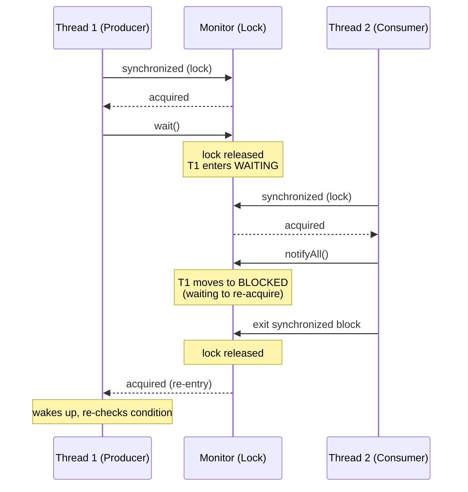

# Synchronization and Intrinsic Locks

## Overview

When multiple threads share mutable state, they need a way to coordinate so that no thread observes the state in an inconsistent, half-updated form. The simplest mechanism Java provides for this coordination is the intrinsic lock, also known as the monitor lock or the built-in lock. Every Java object has an intrinsic lock, and the `synchronized` keyword is the syntax for acquiring and releasing it.

This note covers intrinsic locks in depth. We will explore how `synchronized` methods and blocks work, the monitor protocol of `wait`, `notify`, and `notifyAll`, reentrancy, the relationship between `synchronized` and the Java Memory Model, the cost of intrinsic locks, the bias locking and thin-lock optimizations the JVM performs, and the rules for choosing between intrinsic locks and the explicit `Lock` interface from `java.util.concurrent.locks`.

## Background Knowledge

Before reading this note, you should be comfortable with:

- The thread lifecycle states, particularly `BLOCKED` and `WAITING`, from the first note in this chapter.
- The Java Memory Model's notion of visibility and happens-before, which we will introduce here and develop in depth in the dedicated note on deadlocks and the memory model.
- The distinction between atomicity, visibility, and ordering. Atomicity is about whether an operation appears indivisible; visibility is about whether writes by one thread are seen by another; ordering is about the apparent order in which operations occur.

The fundamental problem `synchronized` solves is mutual exclusion: ensuring that only one thread at a time can execute a critical section of code that touches shared state. By doing so, it provides both atomicity (the critical section appears to execute atomically) and visibility (writes made inside the critical section are visible to the next thread that enters it).

## Intrinsic Locks: The Basics

Every Java object is associated with an intrinsic lock. The `synchronized` keyword acquires that lock at the start of a block or method and releases it at the end, even if the block exits via an exception.

### Synchronized Methods

A `synchronized` instance method acquires the lock of the object on which the method is invoked before executing the body:

```java
public class Counter {
    private int count = 0;

    // Acquires the lock of `this` before entering;
    // releases it on return, even if an exception is thrown.
    public synchronized void increment() {
        count++;
    }

    public synchronized int get() {
        return count;
    }
}
```

A `synchronized` static method acquires the lock of the `Class` object representing the class. This is a different lock from any instance lock, so a static synchronized method does not block an instance synchronized method on the same class.

### Synchronized Statements

A `synchronized` block gives finer-grained control. It acquires the lock of a specified object for the duration of the block:

```java
public class Counter {
    private int count = 0;
    private final Object lock = new Object();

    public void increment() {
        // Only the critical section is synchronized;
        // any code before or after runs without holding the lock.
        synchronized (lock) {
            count++;
        }
    }

    public int get() {
        synchronized (lock) {
            return count;
        }
    }
}
```

Using a private lock object is preferable to synchronizing on `this` because it prevents external code from accidentally acquiring your lock and causing deadlocks. It also makes the lock an explicit part of the class's implementation, not part of its public interface.

### Lock Object Choice

The choice of lock object matters. Common conventions:

- **Private final Object lock**: best for instance-level mutual exclusion. The lock is invisible to callers, so they cannot accidentally interfere with it.
- **`this`**: simple but exposes the lock to callers. Anyone with a reference to your object can synchronize on it.
- **The field being protected**: for a single mutable field, synchronizing on the field itself can be elegant, but breaks if the field is ever reassigned (because the lock object changes).
- **A Class object**: only appropriate for static state. Synchronizing on a `Class` is appropriate for static methods.

Never synchronize on a String literal, an Integer, or any object that may be shared widely. The JVM interns String literals and small Integers, so synchronizing on them can cause surprising cross-class deadlocks.

## Reentrancy

Intrinsic locks are reentrant. A thread that already holds a lock can re-acquire it without blocking. This is essential for code that calls one synchronized method from another:

```java
public class Account {
    private int balance = 0;

    public synchronized void deposit(int amount) {
        balance += amount;
    }

    public synchronized void depositInterest(int rate) {
        // Calls deposit(), which would deadlock if the lock
        // were not reentrant. Because it is, the same thread
        // re-acquires the lock and the call succeeds.
        deposit(balance * rate / 100);
    }
}
```

The JVM tracks the number of times a thread has acquired a lock and decrements the count on each `monitorexit`. The lock is only released when the count reaches zero.

## The Monitor Protocol: wait, notify, and notifyAll

In addition to mutual exclusion, intrinsic locks support the monitor protocol, which allows threads to wait for a condition and to signal each other when the condition changes. The protocol uses three methods on `Object`:

- `wait()`: releases the lock and parks the current thread until another thread calls `notify` or `notifyAll` on the same object (or the thread is interrupted, or a timeout elapses). When awakened, the thread re-acquires the lock before returning.
- `notify()`: wakes one arbitrarily chosen thread waiting on this object's monitor.
- `notifyAll()`: wakes all threads waiting on this object's monitor.

These methods must be called from within a `synchronized` block on the same object; otherwise `IllegalMonitorStateException` is thrown.

### A Classic Example: Bounded Buffer

```java
public class BoundedBuffer<T> {
    private final Object[] items;
    private final int capacity;
    private int putPtr, takePtr, count;

    public BoundedBuffer(int capacity) {
        this.capacity = capacity;
        this.items = new Object[capacity];
    }

    public synchronized void put(T item) throws InterruptedException {
        // Condition: buffer is full. Wait for space.
        while (count == capacity) {
            wait();
        }
        items[putPtr] = item;
        if (++putPtr == capacity) putPtr = 0;
        count++;
        // Signal any thread waiting for items to be available.
        notifyAll();
    }

    @SuppressWarnings("unchecked")
    public synchronized T take() throws InterruptedException {
        // Condition: buffer is empty. Wait for items.
        while (count == 0) {
            wait();
        }
        T item = (T) items[takePtr];
        items[takePtr] = null;
        if (++takePtr == capacity) takePtr = 0;
        count--;
        // Signal any thread waiting for space to be available.
        notifyAll();
    }
}
```

Two patterns deserve attention. First, the condition is checked with a `while` loop, not an `if`. This guards against spurious wakeups (which the JVM is permitted to do) and against situations where another thread acted on the condition before this one re-acquired the lock. Second, `notifyAll` is used rather than `notify` because `notify` might wake a thread of the wrong kind (a producer when we need a consumer, or vice versa), causing a missed signal.

### The Wait Sequence



### Why wait must be in a loop

Consider the following scenario with `if` instead of `while`:

1. Thread A calls `take` on an empty buffer, finds `count == 0`, and calls `wait`.
2. Thread B calls `put`, increments `count` to 1, and calls `notifyAll`.
3. Thread C also calls `take`, finds `count == 1`, takes the item, decrements `count` to 0, and exits.
4. Thread A wakes up, re-acquires the lock, and proceeds past the `if` to take from an empty buffer.

The `while` loop prevents this by re-checking the condition after awakening.

### notify vs notifyAll

`notify` is faster because it wakes only one thread, but it is fragile: if the woken thread's condition is not actually satisfied (because another thread changed the state in the meantime), the signal is lost. `notifyAll` is safer because it wakes all waiters, who then re-check their conditions and either proceed or wait again.

Use `notify` only when:

- All waiters are waiting for the same condition.
- At most one waiter can make progress.
- The notify is intentional and not accidental.

Otherwise, use `notifyAll`.

## Synchronization and the Java Memory Model

Acquiring and releasing an intrinsic lock does more than mutual exclusion: it also establishes a happens-before relationship, which is the cornerstone of the Java Memory Model.

### Visibility Without Synchronization

```java
public class VisibilityProblem {
    private boolean stopped = false;

    public void stop() {
        stopped = true;
    }

    public void run() {
        while (!stopped) {
            // This loop may never terminate, because the
            // JVM is free to cache `stopped` in a register
            // or to reorder the read out of the loop.
        }
    }
}
```

Without synchronization, the JVM is permitted to optimise the read of `stopped` aggressively. A worker thread may cache the value `false` in a register and never see the write from another thread. This is not a bug in the JVM; it is the language specification permitting optimisations that are safe in single-threaded code but unsafe in multi-threaded code.

### Happens-Before and Synchronization Actions

The Java Memory Model defines a partial order called happens-before. If action A happens-before action B, then the results of A are visible to B, and B cannot reorder A's effects.

Two synchronization actions that establish happens-before:

- **Lock release** happens-before **subsequent lock acquire** on the same monitor.
- **Volatile write** happens-before **subsequent volatile read** of the same variable.

Other happens-before relationships include thread start, thread join, and the initialization of `final` fields.


This is why the `synchronized` block on a `Counter` ensures visibility. When Thread 2 enters the synchronized block, it sees all writes that Thread 1 made before exiting the synchronized block, even if those writes were to non-volatile fields.

### Atomicity vs Visibility

A common misconception is that atomic operations are automatically visible. This is wrong. Consider:

```java
private int count = 0;

public void increment() {
    count++;  // Not atomic; reads, adds 1, writes.
}

public int get() {
    return count;  // Atomic for int, but may return a stale value.
}
```

Reading an `int` is atomic (the JVM guarantees a 32-bit read will not see a half-updated value), but without synchronization or volatile, a reader thread may never see updates from a writer thread. Atomicity does not imply visibility. To get both, you need `synchronized`, `volatile`, or an `AtomicInteger`.

## The Cost of Intrinsic Locks

Intrinsic locks are not free, but they are also not as expensive as is sometimes claimed.

### Uncontended Locks

An uncontended lock acquisition is fast: a CAS (compare-and-swap) on the object header, often less than 50 nanoseconds. The JVM optimises uncontended locks aggressively with techniques like biased locking (now disabled by default in Java 15+) and thin locks.

### Contended Locks

A contended lock acquisition involves the operating system scheduler. The thread transitions from `RUNNABLE` to `BLOCKED`, waits in the OS wait queue, and is woken when the lock is released. This can take microseconds, depending on scheduling latency. Contention also causes cache-line contention, where multiple cores repeatedly invalidate each other's caches of the lock variable.

### Lock Elision and Coarsening

The JIT compiler can perform two optimisations:

- **Lock elision**: if escape analysis shows that an object never escapes its thread, the JVM can remove the lock acquisition entirely.
- **Lock coarsening**: if two adjacent synchronized blocks on the same lock are present, the JVM may merge them into one, reducing the number of acquire/release cycles.

These optimisations are automatic and require no code changes.

## Biased Locking (Historical)

For many years, the JVM optimised uncontended locks with biased locking. The idea was that, in practice, most locks are acquired by the same thread repeatedly, so the JVM would "bias" the lock toward that thread, making subsequent acquisitions essentially free (a single comparison).

Biased locking was disabled by default in Java 15 and removed for removal in Java 18. The reasons were that it carried maintenance cost in the JVM, biased locks could introduce latency spikes when revocation occurred, and modern CAS operations are fast enough that the benefit was minimal. On modern JVMs (Java 21+), you should not rely on biased locking.

## Thin and Fat Locks

When biased locking is gone, the JVM still distinguishes thin and fat locks:

- A **thin lock** stores the lock state directly in the object header, using CAS to acquire. It is fast but cannot manage waiters.
- A **fat lock** is created when contention occurs. The JVM allocates an `ObjectMonitor` structure that maintains a queue of waiting threads, supports `wait`/`notify`, and integrates with the OS scheduler.

The transition from thin to fat is one-way for a given acquisition sequence, and it carries a measurable cost. Avoiding contention is the best way to avoid this cost.

## Synchronized vs Lock

The `java.util.concurrent.locks.Lock` interface, implemented by `ReentrantLock` and others, provides more flexibility than intrinsic locks:

- A `Lock` can be acquired and released in different methods, while intrinsic locks must be acquired and released in the same method (block-structured).
- A `Lock` supports `tryLock` (non-blocking acquisition), `lockInterruptibly` (interruptible acquisition), and `tryLock` with a timeout.
- A `Lock` supports fair ordering, while intrinsic locks are unfair.

Intrinsic locks have their own advantages:

- They are simpler to use, with the lock released automatically even on exception.
- They integrate with `wait`/`notify`.
- The JVM can optimise them in ways it cannot optimise `Lock` instances.

The general recommendation is: use intrinsic locks unless you need a specific feature of `Lock`. The next note covers `Lock` implementations in detail.

## Synchronization Patterns

### Double-Checked Locking

A classic pattern for lazy initialisation, but only correct with `volatile`:

```java
public class Singleton {
    // volatile is essential: without it, another thread may
    // see a partially constructed Singleton instance.
    private static volatile Singleton instance;

    private Singleton() {}

    public static Singleton getInstance() {
        if (instance == null) {                    // First check, no lock
            synchronized (Singleton.class) {
                if (instance == null) {            // Second check, with lock
                    instance = new Singleton();
                }
            }
        }
        return instance;
    }
}
```

Without `volatile`, the construction of `Singleton` can be reordered: the assignment to `instance` may happen before the constructor runs, so another thread may see a non-null but partially constructed instance.

In modern Java (Java 5+), the recommended way to implement a lazy singleton is the initialization-on-demand holder idiom, which is thread-safe without explicit synchronization:

```java
public class Singleton {
    private Singleton() {}

    // The JVM guarantees that the static initializer of Holder
    // runs exactly once, on first access, in a thread-safe manner.
    private static class Holder {
        static final Singleton INSTANCE = new Singleton();
    }

    public static Singleton getInstance() {
        return Holder.INSTANCE;
    }
}
```

For a holder of state, not a singleton, prefer `AtomicReference` or `Lazy` from a library.

### Private Lock Object

```java
private final Object lock = new Object();

public void update() {
    synchronized (lock) {
        // critical section
    }
}
```

This pattern keeps the lock invisible to callers and prevents external code from interfering. It is the recommended default for instance-level mutual exclusion.

### Read-Write Locking Pattern

When reads vastly outnumber writes, a read-write lock allows multiple concurrent readers but exclusive writers. This pattern is so common that `ReentrantReadWriteLock` is provided in `java.util.concurrent.locks`, covered in the next note.

### Thread Confinement

The simplest way to avoid synchronization problems is to not share mutable state. If each thread has its own copy of the data, no synchronization is needed. This is called thread confinement and is the basis of `ThreadLocal`.

## Common Pitfalls

### Forgetting to use a while loop with wait

Using `if` instead of `while` around `wait` can cause a thread to proceed past the condition check when the condition is not actually satisfied. Always use `while`.

### Synchronizing on the wrong object

If you synchronize on `this` and external code also synchronizes on your instance, you may unintentionally interact with their code. Use a private lock object.

### Synchronizing on a String literal or interned Integer

These objects are shared across the JVM. Synchronizing on them can cause cross-class deadlocks.

### Synchronizing on a reassignable field

If you synchronize on `field` and `field` is later reassigned to a new object, the lock changes. Subsequent synchronizations acquire a different lock, defeating the purpose. Always use `final` for lock objects.

### Calling wait without checking the condition

`wait` may return spuriously. Always re-check the condition in a `while` loop after `wait` returns.

### Holding a lock during long operations

If you perform I/O, network calls, or long computations inside a `synchronized` block, you block every other thread waiting for that lock. Minimize critical sections.

### Synchronizing on a non-final field of another class

This couples your code to the implementation details of that class. Use a higher-level abstraction instead.

### Assuming atomic means visible

Reading an `int` or `boolean` is atomic, but without `volatile` or `synchronized`, updates may not be visible to other threads.

## Tips and Tricks

### Minimize the critical section

Move computation, I/O, and logging outside the synchronized block. Only protect the actual read-modify-write of shared state:

```java
public void process(Order order) {
    validate(order);              // No shared state, no lock needed
    List<Item> items = order.items();
    synchronized (inventory) {    // Only the inventory update is critical
        for (Item item : items) {
            inventory.decrement(item.sku(), item.qty());
        }
    }
    audit.log(order);             // No shared state, no lock needed
}
```

### Use immutable objects to avoid synchronization

If state never changes, no synchronization is needed. Records with final fields, plus immutable collections like `List.copyOf`, are excellent building blocks for thread-safe code.

### Use ConcurrentHashMap instead of synchronizedMap

`Collections.synchronizedMap` locks the entire map on every operation, killing concurrency. `ConcurrentHashMap` uses per-bin locking and is far faster under contention.

### Prefer java.util.concurrent over wait/notify

The `java.util.concurrent` package provides `BlockingQueue`, `CountDownLatch`, `Semaphore`, and other high-level abstractions that are easier to use correctly than raw `wait`/`notify`. Use them whenever they fit.

### Use try-finally for explicit unlock

If you use a `Lock` instead of `synchronized`, always use try-finally to release the lock:

```java
lock.lock();
try {
    // critical section
} finally {
    lock.unlock();
}
```

Forgetting `unlock` in an exception path leaves the lock held forever.

### Measure contention with flight recorder

JDK Flight Recorder can show lock contention profiles. If a particular lock is contended, consider splitting the data, switching to a finer-grained lock, or using an atomic variable instead.

## Interview Questions

### Q1: What is an intrinsic lock?

An intrinsic lock (also called a monitor lock or built-in lock) is the lock associated with every Java object. It is acquired by `synchronized` methods and `synchronized` blocks. Only one thread at a time can hold an intrinsic lock on a given object.

### Q2: Is the synchronized keyword reentrant?

Yes. A thread that already holds an intrinsic lock can re-acquire it without blocking. The JVM maintains a count of acquisitions and releases the lock only when the count reaches zero. This allows one synchronized method to call another on the same object without deadlocking.

### Q3: What is the difference between a synchronized instance method and a synchronized static method?

A synchronized instance method acquires the lock of the instance on which it is invoked. A synchronized static method acquires the lock of the `Class` object representing the class. The two locks are independent, so a static and an instance synchronized method can execute concurrently.

### Q4: Why must wait be called in a while loop?

`wait` may return spuriously (the JVM is permitted to wake a thread without a corresponding `notify`), and another thread may have acted on the condition before this thread re-acquired the lock. The `while` loop re-checks the condition after awakening, ensuring the thread proceeds only when the condition is actually satisfied.

### Q5: What is the difference between notify and notifyAll?

`notify` wakes one arbitrarily chosen thread waiting on the monitor. `notifyAll` wakes all waiting threads. `notifyAll` is safer because it ensures no signal is lost; `notify` is faster but requires that all waiters are waiting for the same condition and at most one can make progress.

### Q6: What happens if you call wait or notify without holding the lock?

`IllegalMonitorStateException` is thrown. Both methods require the calling thread to hold the monitor of the object on which they are invoked.

### Q7: What is a happens-before relationship?

A happens-before relationship guarantees that the results of one action are visible to another. If action A happens-before action B, then B sees the effects of A, and B cannot reorder A's effects. Lock releases happen-before subsequent lock acquisitions on the same monitor, volatile writes happen-before subsequent volatile reads, and thread start happens-before any action in the started thread.

### Q8: Why does double-checked locking need volatile?

Without `volatile`, the assignment to the instance field can be reordered with the constructor, so another thread may see a non-null reference to a partially constructed object. The `volatile` modifier prevents this reordering by establishing a happens-before relationship between the write and any subsequent read.

### Q9: What is the difference between atomicity and visibility?

Atomicity is about whether an operation appears indivisible: a 32-bit read of an int is atomic, but `count++` is not (it is read, add, write). Visibility is about whether a write by one thread is seen by another. Atomicity does not imply visibility: even an atomic int read can return a stale value without synchronization.

### Q10: How do you choose between synchronized and Lock?

Use `synchronized` for simple block-structured locking where the lock is acquired and released in the same method. Use `Lock` (specifically `ReentrantLock`) when you need `tryLock`, `lockInterruptibly`, a timeout, fair ordering, or multiple condition variables. Intrinsic locks are simpler and easier to use correctly; `Lock` is more flexible but requires explicit unlock in a finally block.

### Q11: Can two threads call different synchronized methods on the same object simultaneously?

No. Both methods acquire the same lock (the instance's intrinsic lock), so only one can execute at a time. If they need to run concurrently, they must use different lock objects.

### Q12: Why is synchronized on a String literal dangerous?

String literals are interned by the JVM, so the same String object may be used by unrelated code elsewhere in the application. Synchronizing on it can cause unexpected cross-class deadlocks. Always use a private final lock object.

### Q13: What is biased locking and is it still relevant?

Biased locking was an optimisation that biased an uncontended lock toward the thread that last acquired it, making subsequent acquisitions essentially free. It was disabled by default in Java 15 and removed for removal in Java 18 because the cost of revocation outweighed the benefit on modern hardware. It is not relevant on Java 21+.

### Q14: What is lock elision?

Lock elision is a JIT optimisation in which the compiler removes lock acquisitions entirely when escape analysis shows that the locked object never escapes its thread. This makes uncontended locks on thread-local objects essentially free.

### Q15: How does synchronized interact with the Java Memory Model?

Acquiring an intrinsic lock establishes a happens-before relationship with the previous release of that lock. This means that all writes made by a thread before releasing the lock are visible to a thread that subsequently acquires the lock. This is the basis of safe publication: data written inside a synchronized block is reliably visible to readers that synchronize on the same lock.

## Summary

Intrinsic locks are the simplest synchronization primitive in Java. Every object has one, the `synchronized` keyword acquires and releases it, and it provides both mutual exclusion and a happens-before relationship that ensures visibility. The monitor protocol of `wait`, `notify`, and `notifyAll` allows threads to coordinate on conditions, but it is tricky to use correctly: `wait` must always be called inside a `while` loop that re-checks the condition, and `notifyAll` is safer than `notify` in most cases.

Intrinsic locks are reentrant, can be optimised by the JIT compiler (lock elision, lock coarsening), and have well-understood costs: an uncontended acquisition is cheap (a CAS on the object header), while a contended acquisition involves the OS scheduler and can be microseconds slow. Biased locking is no longer relevant on modern Java; thin and fat lock transitions remain.

The next note covers the explicit `Lock` interface and its implementations, which provide more flexibility than intrinsic locks at the cost of more verbosity. Together, intrinsic locks and explicit `Lock` form the foundation of mutual exclusion in Java, on top of which the rest of `java.util.concurrent` is built.
