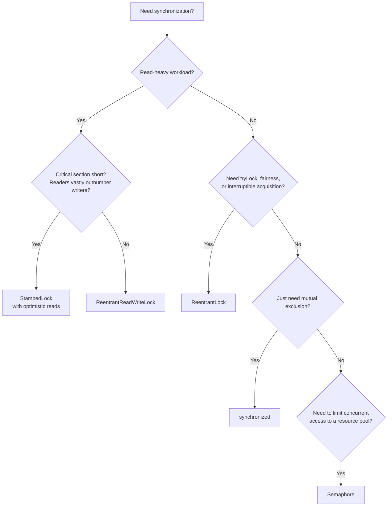

# Locks: ReentrantLock, ReadWriteLock, and Semaphores

## Overview

Intrinsic locks, covered in the previous note, are simple and convenient but limited. They must be acquired and released in block-structured fashion, they cannot be interrupted while waiting, they cannot time out, and they offer no way to inspect their state. When you need any of these capabilities, the `java.util.concurrent.locks` package provides explicit lock implementations with richer semantics.

This note covers the three most important types in that package: `ReentrantLock`, the general-purpose replacement for intrinsic locks; `ReentrantReadWriteLock`, which separates read and write locks for read-heavy workloads; and `Semaphore`, which controls access to a pool of resources. We will also cover `StampedLock`, an optimistic read-write lock introduced in Java 8, and the `Condition` interface, which generalises `wait`/`notify`.

## Background Knowledge

Before reading this note, you should be comfortable with:

- Intrinsic locks and the `synchronized` keyword, including reentrancy and the happens-before relationship.
- The `wait`, `notify`, and `notifyAll` protocol on `Object`.
- The thread lifecycle states, especially `BLOCKED` and `WAITING`.

The `Lock` interface defines a contract that is broader than what intrinsic locks offer. It separates lock acquisition from lock release, supports non-blocking and timed acquisition, supports interruption during acquisition, and provides a `Condition` API for waiting on arbitrary conditions. The cost is more code: you must remember to release the lock in a `finally` block, and there is no automatic exception-safe release like the `synchronized` keyword provides.

## The Lock Interface

The `Lock` interface in `java.util.concurrent.locks` defines the following methods:

```java
public interface Lock {
    void lock();                              // Block until acquired; ignore interrupts
    void lockInterruptibly() throws InterruptedException;  // Block; throw on interrupt
    boolean tryLock();                        // Try once; return immediately
    boolean tryLock(long time, TimeUnit unit) throws InterruptedException;  // Timed
    void unlock();                            // Release the lock
    Condition newCondition();                 // Create a condition variable
}
```

The most important difference from `synchronized` is the explicit `unlock` call. The lock is not released automatically when the block exits; you must release it yourself, typically in a `finally` block:

```java
Lock lock = new ReentrantLock();
lock.lock();
try {
    // critical section
} finally {
    lock.unlock();
}
```

Forgetting to call `unlock`, or forgetting the `finally` block, will leave the lock held forever and is one of the most common bugs with explicit locks.

## ReentrantLock

`ReentrantLock` is the most commonly used `Lock` implementation. It is a reentrant mutual exclusion lock with the same basic semantics as `synchronized`, but with extended capabilities.

### Basic Usage

```java
import java.util.concurrent.locks.ReentrantLock;

public class Counter {
    private final ReentrantLock lock = new ReentrantLock();
    private int count = 0;

    public void increment() {
        lock.lock();
        try {
            count++;
        } finally {
            lock.unlock();
        }
    }

    public int get() {
        lock.lock();
        try {
            return count;
        } finally {
            lock.unlock();
        }
    }
}
```

### Fairness

`ReentrantLock` can be constructed with a fairness flag:

```java
ReentrantLock fairLock = new ReentrantLock(true);
```

A fair lock grants the lock to the longest-waiting thread. An unfair lock (the default) grants the lock to whichever thread happens to request it when the lock becomes available, allowing barging: a thread that just arrived can jump the queue.

Fair locks have lower throughput than unfair locks because they require additional bookkeeping and can cause context switches when a barging thread could have used the lock without waiting. They also do not guarantee perfect fairness, because the underlying operating system scheduler makes the final decision. Use fair locks only when fairness is a correctness requirement, such as when starvation would cause unacceptable behaviour.

### tryLock and Timed Acquisition

```java
if (lock.tryLock()) {
    try {
        // got the lock
    } finally {
        lock.unlock();
    }
} else {
    // did not get the lock, do something else
}
```

The timed version waits up to the specified duration:

```java
if (lock.tryLock(1, TimeUnit.SECONDS)) {
    try {
        // got the lock within 1 second
    } finally {
        lock.unlock();
    }
} else {
    // timed out without acquiring
}
```

`tryLock` is invaluable when you want to avoid blocking indefinitely, or when you want to detect and recover from contention. A common pattern is to walk through a list of locks and try to acquire each one with `tryLock`, releasing any acquired ones if you cannot get them all, to avoid deadlock.

### lockInterruptibly

```java
try {
    lock.lockInterruptibly();
    try {
        // critical section; can be interrupted while waiting
    } finally {
        lock.unlock();
    }
} catch (InterruptedException e) {
    // interrupted while waiting for the lock
    Thread.currentThread().interrupt();
}
```

`lockInterruptibly` blocks until the lock is acquired or the thread is interrupted. This is useful for cancellation: a watchdog can interrupt a thread that is stuck waiting for a lock, allowing it to clean up and exit.

### Condition Variables

A `Condition` is attached to a `Lock` via `lock.newCondition()`. It provides the same `await`, `signal`, and `signalAll` methods as `Object.wait`, `Object.notify`, and `Object.notifyAll`, but with two advantages: a single `Lock` can have multiple `Condition` objects, and `await` supports additional features like unconditional unpark and deadlines.

```java
import java.util.concurrent.locks.*;

public class BoundedBuffer<T> {
    private final Object[] items;
    private final int capacity;
    private int putPtr, takePtr, count;
    private final ReentrantLock lock = new ReentrantLock();
    private final Condition notFull = lock.newCondition();   // separate conditions
    private final Condition notEmpty = lock.newCondition();  // for the two states

    public BoundedBuffer(int capacity) {
        this.capacity = capacity;
        this.items = new Object[capacity];
    }

    public void put(T item) throws InterruptedException {
        lock.lock();
        try {
            while (count == capacity) {
                notFull.await();   // wait on the notFull condition
            }
            items[putPtr] = item;
            if (++putPtr == capacity) putPtr = 0;
            count++;
            notEmpty.signal();     // wake one consumer, not all waiters
        } finally {
            lock.unlock();
        }
    }

    @SuppressWarnings("unchecked")
    public T take() throws InterruptedException {
        lock.lock();
        try {
            while (count == 0) {
                notEmpty.await();
            }
            T item = (T) items[takePtr];
            items[takePtr] = null;
            if (++takePtr == capacity) takePtr = 0;
            count--;
            notFull.signal();
            return item;
        } finally {
            lock.unlock();
        }
    }
}
```

Using two `Condition` objects means `signal` only wakes threads waiting for the relevant condition. With `Object.notifyAll` on a single monitor, both producers and consumers would be woken, even though only one of them could make progress. This is more efficient under high load.

### Inspecting Lock State

`ReentrantLock` exposes several introspection methods:

```java
lock.isLocked();               // Is the lock held?
lock.isHeldByCurrentThread();  // Is it held by me?
lock.getHoldCount();           // How many times have I re-entered?
lock.getQueueLength();         // How many threads are waiting?
lock.hasQueuedThread(t);       // Is thread t waiting?
lock.getWaitingThreads(notFull); // Threads waiting on a condition
```

These are useful for monitoring and testing. They should not be used for synchronization logic, because the state can change between the call and the action that follows.

## ReentrantReadWriteLock

When reads vastly outnumber writes, a single mutual exclusion lock serializes all access, even though concurrent reads are safe. A read-write lock addresses this by allowing multiple concurrent readers but exclusive writers.

### The ReadWriteLock Interface

```java
public interface ReadWriteLock {
    Lock readLock();
    Lock writeLock();
}
```

A thread holding the read lock can re-acquire the read lock. A thread holding the write lock can re-acquire either the write lock or the read lock (lock downgrading). However, a thread holding only the read lock cannot acquire the write lock (which would require waiting for all other readers to release).

### Basic Usage

```java
import java.util.concurrent.locks.*;

public class ThreadSafeHashMap<K, V> {
    private final java.util.HashMap<K, V> map = new java.util.HashMap<>();
    private final ReentrantReadWriteLock rwl = new ReentrantReadWriteLock();
    private final Lock read = rwl.readLock();
    private final Lock write = rwl.writeLock();

    public V get(K key) {
        read.lock();
        try {
            return map.get(key);
        } finally {
            read.unlock();
        }
    }

    public V put(K key, V value) {
        write.lock();
        try {
            return map.put(key, value);
        } finally {
            write.unlock();
        }
    }

    public boolean containsKey(K key) {
        read.lock();
        try {
            return map.containsKey(key);
        } finally {
            read.unlock();
        }
    }
}
```

In a read-heavy workload, multiple readers can read concurrently. When a writer arrives, it waits for all readers to release, then acquires the write lock exclusively. Subsequent readers wait for the writer to release, ensuring readers always see the latest state.

### Lock Downgrading

A writer can downgrade to a reader by acquiring the read lock while still holding the write lock, then releasing the write lock:

```java
write.lock();
try {
    // modify state
    read.lock();   // acquire read lock while holding write lock
} finally {
    write.unlock(); // release write lock; still hold read lock
}
// Now other readers can proceed; we continue to read consistently
try {
    return computeValue();
} finally {
    read.unlock();
}
```

This pattern is useful when a writer needs to perform some read-only work after modifying state and wants to allow other readers to proceed.

### Fairness

`ReentrantReadWriteLock` also supports a fairness flag. A fair read-write lock does not allow a reader to acquire if a writer is waiting, preventing writer starvation. Without fairness, a steady stream of readers can starve writers indefinitely.

### When to Use ReadWriteLock

A read-write lock pays off only when:

- Reads vastly outnumber writes (typically 10:1 or more).
- The critical section is non-trivial (microseconds or longer), so the lock overhead is small relative to the work.

For trivial critical sections (a single field access), the overhead of `ReentrantReadWriteLock` exceeds the savings, and a simple `synchronized` block or `AtomicReference` is faster. Always benchmark before adopting a read-write lock.

## StampedLock

`StampedLock` was introduced in Java 8 to address two limitations of `ReentrantReadWriteLock`: it does not support reentrancy, and it does not support optimistic reads.

An optimistic read acquires no lock and does not block writers. Instead, the reader checks after the read whether a writer modified the state in the meantime; if so, it retries with a real read lock.

```java
import java.util.concurrent.locks.StampedLock;

public class Point {
    private double x, y;
    private final StampedLock sl = new StampedLock();

    public void move(double deltaX, double deltaY) {
        long stamp = sl.writeLock();
        try {
            x += deltaX;
            y += deltaY;
        } finally {
            sl.unlockWrite(stamp);
        }
    }

    public double distanceFromOrigin() {
        // Optimistic read: acquires no lock.
        long stamp = sl.tryOptimisticRead();
        double currentX = x;
        double currentY = y;
        // Validate that no write occurred between the stamp and the reads.
        if (!sl.validate(stamp)) {
            // Optimistic read failed; fall back to a real read lock.
            stamp = sl.readLock();
            try {
                currentX = x;
                currentY = y;
            } finally {
                sl.unlockRead(stamp);
            }
        }
        return Math.sqrt(currentX * currentX + currentY * currentY);
    }
}
```

The advantage of optimistic reads is that they do not block writers and require no CAS, making them extremely fast in the common case where no write occurs. The disadvantage is that they require careful coding: the reads must be done from volatile fields (which `StampedLock` ensures internally), and the validation must be checked before using the read values.

`StampedLock` is not reentrant: a thread that calls `writeLock` twice without unlocking will deadlock. It is also not a general replacement for `ReentrantReadWriteLock`; it is specifically for cases with very high read contention and short critical sections, where optimistic reads pay off.

## Semaphore

A `Semaphore` does not lock for mutual exclusion; it controls access to a pool of resources. A semaphore maintains a set of permits. Each `acquire` blocks until a permit is available, then takes one. Each `release` adds a permit, potentially releasing a blocked acquirer.

```java
import java.util.concurrent.Semaphore;

public class ConnectionPool {
    private final Semaphore permits;
    private final List<Connection> pool;

    public ConnectionPool(int size) {
        this.permits = new Semaphore(size, /* fair= */ true);
        this.pool = new ArrayList<>(size);
        for (int i = 0; i < size; i++) pool.add(newConnection());
    }

    public Connection acquire() throws InterruptedException {
        permits.acquire();  // blocks until a permit is available
        synchronized (pool) {
            return pool.remove(pool.size() - 1);
        }
    }

    public void release(Connection conn) {
        synchronized (pool) {
            pool.add(conn);
        }
        permits.release();  // makes the permit available
    }
}
```

A semaphore with one permit is equivalent to a mutual exclusion lock, but `Semaphore` is more often used to limit the number of concurrent operations on a resource that can be shared (such as a database connection pool).

### Binary Semaphore vs ReentrantLock

A binary semaphore (one permit) is functionally similar to a `ReentrantLock` with one critical difference: a `Semaphore` is not reentrant. If a thread that holds the only permit tries to acquire again, it deadlocks. A `ReentrantLock` does not.

### Fair Semaphores

```java
Semaphore fair = new Semaphore(3, true);
```

A fair semaphore grants permits in FIFO order to waiting threads. Unfair semaphores (the default) allow barging, which has higher throughput but can starve threads under sustained contention.

### tryAcquire

```java
if (semaphore.tryAcquire()) {
    try {
        // got a permit
    } finally {
        semaphore.release();
    }
} else {
    // no permit available, do something else
}

// Timed version:
if (semaphore.tryAcquire(1, TimeUnit.SECONDS)) {
    try { /* ... */ } finally { semaphore.release(); }
}
```

`tryAcquire` is useful for implementing backpressure: if no permit is available, you can reject the work, queue it, or return a fallback response.

### DrainPermits

`semaphore.drainPermits()` acquires all available permits and returns the count. This is useful for temporarily suspending access to a resource.

### Reducing Permits Below Zero

`Semaphore.reducePermits(int)` is a protected method on the `Semaphore` class that reduces the number of permits available, even below zero. Unlike `acquire`, it does not block waiting threads; it simply makes fewer permits available. This is useful for shrinking a resource pool dynamically, for example when a database connection becomes invalid and must be removed from the pool. Because `reducePermits` is protected, you must subclass `Semaphore` to use it:

```java
public class ShrinkingSemaphore extends Semaphore {
    public ShrinkingSemaphore(int permits, boolean fair) {
        super(permits, fair);
    }
    public void shrink(int n) {
        reducePermits(n);
    }
}
```

Most application code does not need this; the standard `acquire` and `release` are sufficient.

## A Real-World Example: A Bounded Resource Pool

Let us put together `ReentrantLock`, `Condition`, and `Semaphore` into a small resource-pool implementation that demonstrates all three abstractions working together.

```java
import java.util.concurrent.*;
import java.util.*;

public class BoundedResourcePool<R> {
    private final Deque<R> available = new ArrayDeque<>();
    private final Set<R> inUse = new HashSet<>();
    private final ReentrantLock lock = new ReentrantLock();
    private final Condition notEmpty = lock.newCondition();
    private final int maxSize;
    private final java.util.function.Supplier<R> factory;

    public BoundedResourcePool(int maxSize, java.util.function.Supplier<R> factory) {
        this.maxSize = maxSize;
        this.factory = factory;
    }

    public R acquire(long timeout, TimeUnit unit) throws InterruptedException {
        lock.lockInterruptibly();
        try {
            long nanos = unit.toNanos(timeout);
            while (available.isEmpty() && inUse.size() >= maxSize) {
                if (nanos <= 0L) {
                    throw new TimeoutException("Could not acquire a resource within timeout").toRuntimeException();
                }
                nanos = notEmpty.awaitNanos(nanos);
            }
            R resource = available.pollFirst();
            if (resource == null) {
                resource = factory.get();
            }
            inUse.add(resource);
            return resource;
        } finally {
            lock.unlock();
        }
    }

    public void release(R resource) {
        lock.lock();
        try {
            if (inUse.remove(resource)) {
                available.addLast(resource);
                notEmpty.signal();
            }
        } finally {
            lock.unlock();
        }
    }

    public int availableCount() {
        lock.lock();
        try {
            return available.size();
        } finally {
            lock.unlock();
        }
    }
}
```

This pool uses a `ReentrantLock` for mutual exclusion, a `Condition` to wait for resources to become available, and would integrate with a `Semaphore` if you also wanted to limit concurrent callers rather than total resources. The pattern of waiting in a `while` loop with a timed `awaitNanos` is the canonical way to wait for a condition with a timeout: each spurious wakeup or signal reduces the remaining nanos, and the loop re-checks the condition before consuming more time.

## Condition: Generalising wait and notify

The `Condition` interface, returned by `lock.newCondition()`, generalizes the `wait`/`notify` mechanism. Its key methods are:

- `await()`: equivalent to `wait()`.
- `awaitUninterruptibly()`: ignores interrupts.
- `awaitNanos(long)`: timed wait in nanoseconds.
- `await(long, TimeUnit)`: timed wait.
- `awaitUntil(Date)`: wait until a deadline.
- `signal()`: equivalent to `notify()`.
- `signalAll()`: equivalent to `notifyAll()`.

The benefits over `Object.wait` and `Object.notify` are:

- Multiple conditions per lock: a single `Lock` can create multiple `Condition` objects, so you can signal only the threads waiting for a particular condition.
- `awaitUninterruptibly`: there is no way to wait unconditionally with `Object.wait`.
- `awaitUntil`: cleaner than computing milliseconds from now.

## Choosing Between Lock Types



## Common Pitfalls

### Forgetting to unlock in finally

The most common bug with explicit locks. If the critical section throws, the lock is held forever. Always use try-finally:

```java
lock.lock();
try {
    // ...
} finally {
    lock.unlock();
}
```

### Calling unlock without holding the lock

`ReentrantLock.unlock` throws `IllegalMonitorStateException` if the current thread does not hold the lock. This is a programming error and indicates that the lock was released too many times or by the wrong thread.

### Using a StampedLock like a ReentrantReadWriteLock

`StampedLock` is not reentrant. Calling `writeLock` twice from the same thread without unlocking deadlocks. Use `ReentrantReadWriteLock` if you need reentrancy.

### Forgetting to validate an optimistic read

If you call `tryOptimisticRead` and use the result without calling `validate`, you may see a partially-updated state. Always check `validate(stamp)` before using the read values.

### Releasing a permit you did not acquire

`Semaphore.release` adds a permit, even if you did not acquire one. This can cause more permits to be available than intended, breaking the resource limit. Always pair `acquire` with `release` in a try-finally.

### Using fair locks when throughput matters

Fair locks are slower than unfair locks. Use them only when fairness is a correctness requirement.

### Holding a lock across I/O

Long-running I/O inside a lock serializes all other waiters. Move I/O outside the critical section, or use a finer-grained lock.

### Mixing synchronized and Lock

If you mix `synchronized` blocks and `ReentrantLock` on the same data, you get neither the simplicity of intrinsic locks nor the flexibility of explicit locks, and you risk deadlocks. Pick one approach per resource.

## Tips and Tricks

### Use tryLock to break deadlocks

When acquiring multiple locks, use `tryLock` with a timeout and release all locks if you cannot get them all:

```java
while (true) {
    lock1.lock();
    try {
        if (lock2.tryLock(100, TimeUnit.MILLISECONDS)) {
            try {
                // both locks held
                return doWork();
            } finally {
                lock2.unlock();
            }
        }
    } finally {
        lock1.unlock();
    }
    // Back off before retrying.
    Thread.sleep(50);
}
```

This pattern breaks deadlocks because, if two threads each hold one lock and want the other, they will time out, release, and retry.

### Use multiple Conditions for finer-grained signaling

A `ReentrantLock` with multiple `Condition` objects lets you wake only the threads waiting for a specific condition, reducing the overhead of `notifyAll`.

### Use ReadWriteLock for read-heavy caches

```java
private final Map<String, Data> cache = new HashMap<>();
private final ReentrantReadWriteLock rwl = new ReentrantReadWriteLock();

public Data get(String key) {
    rwl.readLock().lock();
    try {
        return cache.get(key);
    } finally {
        rwl.readLock().unlock();
    }
}

public void put(String key, Data value) {
    rwl.writeLock().lock();
    try {
        cache.put(key, value);
    } finally {
        rwl.writeLock().unlock();
    }
}
```

This is a textbook pattern for read-heavy caches. For most cases, however, `ConcurrentHashMap` is simpler and faster.

### Use Semaphore to bound concurrency

Limit concurrent calls to an external service:

```java
private final Semaphore limiter = new Semaphore(10);

public Response call(Request req) throws InterruptedException {
    limiter.acquire();
    try {
        return doRemoteCall(req);
    } finally {
        limiter.release();
    }
}
```

This prevents overwhelming a downstream service with too many concurrent requests.

### Use StampedLock for hot read paths

When reads vastly outnumber writes and the critical section is a few field reads, `StampedLock` with optimistic reads can be faster than `ReentrantReadWriteLock`. Always benchmark.

### Use lockInterruptibly for cancellable locking

If a worker thread may need to be cancelled while waiting for a lock, use `lockInterruptibly`:

```java
try {
    lock.lockInterruptibly();
    try {
        // ...
    } finally {
        lock.unlock();
    }
} catch (InterruptedException e) {
    Thread.currentThread().interrupt();
    return;  // give up
}
```

### Avoid lock objects that are public

If your lock is exposed (e.g., you synchronize on `this`), external code can acquire it and interfere. Always use a private final lock object.

## Interview Questions

### Q1: What is the difference between synchronized and ReentrantLock?

`synchronized` is a keyword with block-structured locking, automatic release on exit, and integration with `wait`/`notify`. `ReentrantLock` is a class with explicit `lock` and `unlock` calls, support for `tryLock`, `lockInterruptibly`, timed acquisition, fairness, and multiple `Condition` objects. `synchronized` is simpler; `ReentrantLock` is more flexible.

### Q2: What is lock reentrancy and why does it matter?

Reentrancy means a thread that holds a lock can re-acquire it without blocking. The JVM tracks an acquisition count and releases the lock when the count reaches zero. Reentrancy is essential because synchronized methods routinely call each other.

### Q3: What is the difference between a fair and an unfair lock?

A fair lock grants the lock to the longest-waiting thread. An unfair lock grants it to whichever thread happens to be available, allowing barging. Fair locks have lower throughput but prevent starvation; they are appropriate when fairness is a correctness requirement.

### Q4: What is tryLock and when would you use it?

`tryLock` tries to acquire the lock once and returns immediately with a boolean indicating success. The timed version waits up to a specified duration. Use it when you want to avoid blocking indefinitely, when you want to detect and recover from contention, or when you need to acquire multiple locks without risking deadlock.

### Q5: What does lockInterruptibly do?

`lockInterruptibly` blocks until the lock is acquired or the thread is interrupted. If the thread is interrupted while waiting, it throws `InterruptedException` and does not acquire the lock. This enables cancellation of threads stuck waiting for a lock.

### Q6: What is a Condition and how does it differ from wait/notify?

A `Condition` is attached to a `Lock` via `lock.newCondition()` and provides `await`, `signal`, and `signalAll`. A single `Lock` can have multiple `Condition` objects, so you can signal only the threads waiting for a particular condition. `Object.wait`/`notify` works on a single monitor per object.

### Q7: How does a ReadWriteLock improve performance?

By allowing multiple concurrent readers while serializing writers. In read-heavy workloads, this increases throughput because reads no longer block each other. The benefit is significant only when reads vastly outnumber writes and the critical section is non-trivial.

### Q8: Can a thread holding a read lock upgrade to a write lock?

No. Upgrading requires releasing the read lock first, which can cause a race condition where another writer modifies the state in between. The correct pattern is to acquire the write lock from the start, or to release the read lock and re-acquire as a writer, re-checking the condition after the upgrade.

### Q9: Can a thread holding a write lock downgrade to a read lock?

Yes. Acquire the read lock while still holding the write lock, then release the write lock. This allows other readers to proceed while ensuring the downgrading thread sees a consistent state.

### Q10: What is an optimistic read in StampedLock?

`tryOptimisticRead` returns a stamp without acquiring any lock. The reader then performs the read and calls `validate(stamp)` to check whether a writer modified the state in the meantime. If validation fails, the reader retries with a real read lock. Optimistic reads are extremely fast in the common case where no write occurs.

### Q11: Why is StampedLock not reentrant?

Because `StampedLock` was designed for high-throughput, non-reentrant use cases. Reentrancy requires per-thread state tracking, which adds overhead. If you need reentrancy, use `ReentrantReadWriteLock` instead.

### Q12: What is a Semaphore and how is it different from a Lock?

A `Semaphore` maintains a set of permits and controls access to a pool of resources. `acquire` takes a permit; `release` adds one. A `Lock` allows only one thread to hold it at a time. A `Semaphore` with one permit is similar to a `Lock` but is not reentrant.

### Q13: What is a binary semaphore?

A semaphore with one permit. It functions like a mutual exclusion lock, but is not reentrant: if the thread that holds the permit tries to acquire again, it deadlocks.

### Q14: How does Semaphore handle fairness?

A fair semaphore grants permits in FIFO order to waiting threads. An unfair semaphore allows barging. Fair semaphores prevent starvation but have lower throughput.

### Q15: When should you use Semaphore over ReentrantLock?

When you want to limit the number of concurrent operations on a resource that can be shared, such as a database connection pool. `Semaphore` does not provide mutual exclusion by itself; it provides a way to bound concurrency.

## Summary

The `java.util.concurrent.locks` package provides explicit lock implementations that go beyond what intrinsic locks can do. `ReentrantLock` is the general-purpose replacement for `synchronized`, offering `tryLock`, `lockInterruptibly`, timed acquisition, fairness, and multiple `Condition` objects. `ReentrantReadWriteLock` separates read and write locks to allow concurrent readers in read-heavy workloads. `StampedLock` adds optimistic reads for very hot read paths, at the cost of reentrancy. `Semaphore` controls access to a pool of resources by issuing permits.

Choosing the right lock is a matter of understanding the workload. For simple mutual exclusion, `synchronized` is still the right choice. For flexibility, use `ReentrantLock`. For read-heavy patterns, use `ReentrantReadWriteLock` or `StampedLock`. For bounding concurrency on a shared pool, use `Semaphore`. In all cases, the discipline of releasing locks in `finally` blocks and minimizing critical sections remains the same.

The next note covers atomic variables, which provide a different approach to thread safety: instead of blocking, they use compare-and-swap operations to update state without holding any lock at all.
