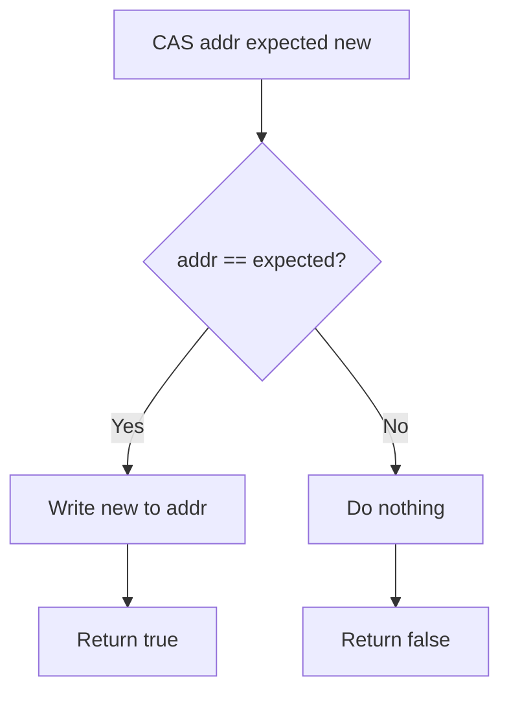
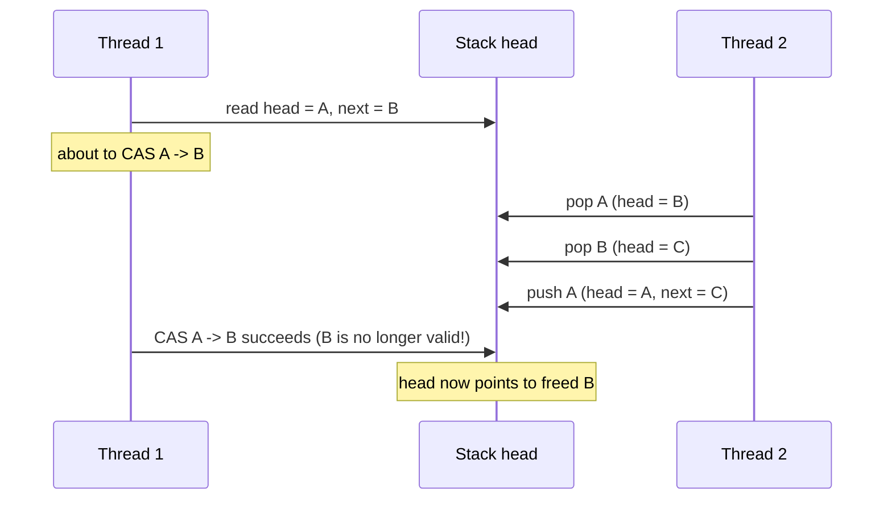
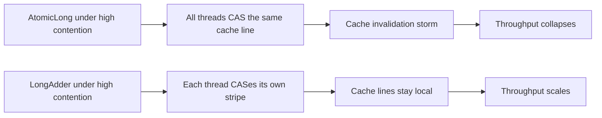

# Atomic Variables and Lock-Free Programming

## Overview

Locks are the traditional way to coordinate concurrent access to shared state, but they have drawbacks: they can deadlock, they introduce contention that scales poorly, and they require expensive context switches when threads are blocked. Atomic variables offer a different approach: instead of blocking, they use hardware-level atomic instructions to update state without holding any lock at all.

The `java.util.concurrent.atomic` package provides classes that wrap a single variable and offer atomic operations on it. These operations are implemented using compare-and-swap (CAS), a hardware primitive that atomically updates a memory location if and only if it currently holds an expected value. CAS is the foundation of all lock-free algorithms in Java, from `AtomicInteger` to `ConcurrentHashMap` to `ForkJoinPool`'s work-stealing deques.

This note covers CAS in depth, the atomic classes in the standard library, the difference between atomicity and visibility, the ABA problem and its solutions, performance characteristics compared to locks, and the rules for writing correct lock-free code with `VarHandle` (Java 9+).

## Background Knowledge

Before reading this note, you should be comfortable with:

- The Java Memory Model, particularly visibility and happens-before. Atomic variables provide the same memory-ordering guarantees as `volatile`: writes are immediately visible to other threads, and reads and writes cannot be reordered with other memory operations in harmful ways.
- Intrinsic locks and the `synchronized` keyword, which we are now contrasting with non-blocking alternatives.
- The thread lifecycle, particularly that CAS-based algorithms keep threads in `RUNNABLE` rather than `BLOCKED`.

The defining characteristic of a lock-free algorithm is that at least one thread is guaranteed to make progress in a finite number of steps, regardless of how the scheduler interleaves execution. A wait-free algorithm is stronger: every thread is guaranteed to make progress. The atomic classes in Java provide primitives that can be used to build both, but most real-world algorithms are lock-free rather than wait-free.

## Compare-And-Swap: The Hardware Primitive

Compare-and-swap (CAS) is a hardware instruction available on all modern CPUs (CMPXCHG on x86, LL/SC on ARM, CAS on RISC-V). It takes three arguments: a memory location, an expected value, and a new value. It atomically:

1. Reads the current value of the memory location.
2. Compares it to the expected value.
3. If they match, writes the new value and returns success.
4. If they do not match, does nothing and returns failure.



The crucial property is that the compare and the write happen atomically: no other thread can observe an intermediate state, and no other thread can write between the compare and the write.

In Java, CAS is exposed via the `sun.misc.Unsafe` class (historically) and, since Java 9, via `java.lang.invoke.VarHandle`. The `java.util.concurrent.atomic` classes use `VarHandle` internally, so you rarely need to call CAS directly.

### CAS in Java code

A logical pseudocode for CAS:

```java
boolean compareAndSet(int expected, int newValue) {
    // Hardware atomically:
    if (value == expected) {
        value = newValue;
        return true;
    }
    return false;
}
```

The hardware instruction makes this truly atomic: another thread cannot observe the value between the read and the write.

## The Atomic Classes

The `java.util.concurrent.atomic` package provides several families of atomic classes.

### Scalar atomics

`AtomicBoolean`, `AtomicInteger`, `AtomicLong`, and `AtomicReference<V>` wrap a single value and provide atomic operations on it.

```java
import java.util.concurrent.atomic.AtomicInteger;

public class Counter {
    private final AtomicInteger count = new AtomicInteger(0);

    public void increment() {
        count.incrementAndGet();   // atomic ++count
    }

    public int get() {
        return count.get();
    }
}
```

Key methods:

- `get()` returns the current value.
- `set(newValue)` sets the value.
- `getAndSet(newValue)` atomically returns the old value and sets the new value.
- `compareAndSet(expected, new)` returns true if the value was updated.
- `getAndIncrement()`, `getAndDecrement()`, `incrementAndGet()`, `decrementAndGet()` are atomic forms of `++` and `--`.
- `getAndAdd(delta)` and `addAndGet(delta)` are atomic forms of `+=`.
- `updateAndGet(UnaryOperator)` and `getAndUpdate(UnaryOperator)` apply a function atomically.
- `accumulateAndGet(x, BinaryOperator)` and `getAndAccumulate(x, BinaryOperator)` combine with a value atomically.

### Atomic arrays

`AtomicIntegerArray`, `AtomicLongArray`, and `AtomicReferenceArray<E>` provide atomic operations on array elements.

```java
AtomicIntegerArray array = new AtomicIntegerArray(100);
array.incrementAndGet(5);  // atomic increment of element 5
```

The array itself is immutable (it cannot be resized), but each element can be atomically updated.

### Atomic updaters

`AtomicIntegerFieldUpdater`, `AtomicLongFieldUpdater`, and `AtomicReferenceFieldUpdater` provide atomic operations on `volatile` fields of arbitrary classes via reflection. They are useful when you cannot change the field declaration (for example, in library code that must remain backward-compatible).

```java
public class Node {
    volatile Node next;
    private static final AtomicReferenceFieldUpdater<Node, Node> NEXT =
        AtomicReferenceFieldUpdater.newUpdater(Node.class, Node.class, "next");

    public boolean casNext(Node expected, Node newValue) {
        return NEXT.compareAndSet(this, expected, newValue);
    }
}
```

The field must be `volatile`, accessible to the caller, and of the correct type. Atomic updaters are slower than dedicated atomic classes but allow atomic operations on existing classes.

### AtomicStampedReference and AtomicMarkableReference

These classes solve the ABA problem (covered below) by attaching a stamp or a mark to the value. `compareAndSet` succeeds only if both the value and the stamp match.

```java
AtomicStampedReference<Integer> ref =
    new AtomicStampedReference<>(1, /* initial stamp */ 0);

int[] stampHolder = new int[1];
Integer currentValue = ref.get(stampHolder);
int currentStamp = stampHolder[0];

// Update only if the value and stamp are unchanged.
ref.compareAndSet(currentValue, 2, currentStamp, currentStamp + 1);
```

### Adder and Accumulator (Java 8+)

`LongAdder`, `DoubleAdder`, `LongAccumulator`, and `DoubleAccumulator` are designed for high-contention statistics. They internally maintain an array of counters, one per stripe, and aggregate them on read.

```java
LongAdder adder = new LongAdder();
for (int i = 0; i < 10; i++) {
    Runnable r = () -> {
        for (int j = 0; j < 1000000; j++) {
            adder.increment();
        }
    };
    new Thread(r).start();
}
// sum() aggregates all stripes; may be slightly stale but is fast.
System.out.println(adder.sum());
```

`LongAdder` can be 5-10x faster than `AtomicLong` under high contention, because each thread updates its own stripe and only the read (which is rare) incurs the cost of aggregation. The trade-off is that `sum` is not atomic: it may include updates that were in progress when the read started.

## The ABA Problem

CAS checks only the value, not the history. This leads to a subtle bug called the ABA problem.

Suppose a thread reads value A, computes a new value C, and tries to CAS from A to C. If another thread changed the value from A to B and back to A in the meantime, the CAS succeeds, even though the assumption "the value has not changed" is wrong.

A concrete example is a lock-free stack. The pop operation reads the head, reads the next pointer, and CASes the head from the current node to the next node. If another thread pops the node, pushes it back, and then pops it again, the head pointer may be the same node it was originally, even though the stack has changed state.



### Solutions to ABA

1. **Stamped references**: use `AtomicStampedReference`, which carries a version number that is incremented on every change. The CAS succeeds only if both the value and the stamp match.

2. **Hazard pointers**: each thread publishes the pointers it is about to dereference, so other threads know not to reclaim those nodes. The JVM does not provide hazard pointers directly, but they can be implemented.

3. **Epoch-based reclamation**: divide execution into epochs; nodes freed in epoch N cannot be reclaimed until all threads have left epoch N. This is the basis of some lock-free memory reclaimers.

4. **Garbage collection**: in Java, the ABA problem is mitigated by GC. A node that Thread 1 read into a local variable is not garbage-collected as long as Thread 1 holds the reference, so even if Thread 2 pops and pushes the same value, the local reference in Thread 1 remains valid. However, the logical ABA problem (where the stack has changed state but the head pointer happens to be the same) can still occur.

For most Java code, the ABA problem is rare because GC handles the memory-safety aspect. For lock-free algorithms where the logical state matters, use `AtomicStampedReference`.

## Implementing a Lock-Free Stack

```java
import java.util.concurrent.atomic.AtomicReference;

public class LockFreeStack<T> {
    private static class Node<T> {
        final T value;
        Node<T> next;
        Node(T value, Node<T> next) {
            this.value = value;
            this.next = next;
        }
    }

    private final AtomicReference<Node<T>> head = new AtomicReference<>();

    public void push(T value) {
        Node<T> currentHead;
        Node<T> newHead;
        do {
            currentHead = head.get();
            newHead = new Node<>(value, currentHead);
            // Retry until CAS succeeds. Another thread may have
            // pushed in the meantime, in which case the CAS fails
            // and we retry with the new head.
        } while (!head.compareAndSet(currentHead, newHead));
    }

    public T pop() {
        Node<T> currentHead;
        Node<T> newHead;
        do {
            currentHead = head.get();
            if (currentHead == null) {
                return null;  // stack is empty
            }
            newHead = currentHead.next;
            // ABA risk: if another thread pops currentHead, pushes
            // other nodes, and pushes currentHead back, the CAS may
            // succeed even though the stack has changed state.
            // For most practical purposes in Java this is acceptable
            // because GC keeps currentHead valid.
        } while (!head.compareAndSet(currentHead, newHead));
        return currentHead.value;
    }
}
```

The pattern is the canonical CAS loop:

1. Read the current state.
2. Compute the new state.
3. CAS from current to new.
4. If CAS fails, retry from step 1.

This pattern is lock-free: at least one thread makes progress on each iteration, even under contention. It is not wait-free: an unlucky thread may retry indefinitely while other threads keep winning the CAS.

## Atomicity vs Visibility

A common confusion is the relationship between atomicity and visibility. The two are independent properties:

- **Atomicity** means an operation appears indivisible. Reading an `int` is atomic (32-bit read), but `count++` is not (read, add 1, write).
- **Visibility** means a write by one thread is seen by another. Without `volatile` or `synchronized`, the JIT compiler may cache reads in registers, and a thread may never see another thread's write.

Atomic variables provide both: the operations are atomic, and the underlying field is `volatile`, so writes are immediately visible to other threads.

```java
private boolean stopped = false;  // not volatile

public void stop() { stopped = true; }
public void run() {
    while (!stopped) {
        // May loop forever: the JIT can cache `stopped` in a register.
    }
}
```

Fixing this with `AtomicBoolean`:

```java
private final AtomicBoolean stopped = new AtomicBoolean(false);

public void stop() { stopped.set(true); }
public void run() {
    while (!stopped.get()) {
        // Will terminate: AtomicBoolean.get() reads a volatile field.
    }
}
```

You could also use `volatile boolean` directly, which is simpler and faster. Atomic classes are appropriate when you need read-modify-write operations like `compareAndSet` or `incrementAndGet`.

## VarHandle: Low-Level Atomic Operations (Java 9+)

`VarHandle` is a typed reference to a variable (a field, array element, or static field) that supports atomic operations with explicit memory ordering. It is the modern replacement for `sun.misc.Unsafe`.

```java
import java.lang.invoke.MethodHandles;
import java.lang.invoke.VarHandle;

public class Counter {
    private volatile int count = 0;

    private static final VarHandle COUNT;

    static {
        try {
            COUNT = MethodHandles.lookup().findVarHandle(
                Counter.class, "count", int.class);
        } catch (ReflectiveOperationException e) {
            throw new AssertionError(e);
        }
    }

    public void increment() {
        // getAndAdd with plain memory ordering
        COUNT.getAndAdd(this, 1);
    }

    public int get() {
        // Volatile read
        return (int) COUNT.getVolatile(this);
    }

    public boolean compareAndSet(int expected, int newValue) {
        return COUNT.compareAndSet(this, expected, newValue);
    }
}
```

`VarHandle` supports several memory ordering modes:

- `getVolatile` / `setVolatile`: volatile semantics (default for atomic classes).
- `getOpaque` / `setOpaque`: guaranteed only within the same thread, but visible to other threads eventually.
- `getAcquire` / `setRelease`: acquire-release semantics, weaker than volatile but stronger than opaque.
- `get` / `set`: plain semantics, no ordering guarantees.

These modes let you tune performance for very hot paths where the full volatile overhead is unnecessary. Most application code should continue using the `Atomic*` classes, which use `getVolatile` / `setVolatile` internally.

## Performance: Atomic vs Lock

Atomic variables are usually faster than locks for uncontended or lightly contended access. Under high contention, the picture is more nuanced.

### Uncontended case

A single `AtomicInteger.incrementAndGet` is a single CAS, taking about 5-20 nanoseconds on modern hardware. A `synchronized` block has similar cost in the uncontended case (after biased locking was removed, the JVM uses thin locks), so the difference is small.

### Lightly contended case

A few threads occasionally contending: atomics remain faster, because there is no OS scheduler involvement. CAS fails and retries in user space, which is much faster than a context switch.

### Highly contended case

Many threads constantly contending: atomics can become slower than locks, because every CAS triggers a cache-line invalidation across all cores (cache ping-pong). This is called cache-line contention. Locks can actually perform better in this regime because they move the contention to a single wait queue, and the OS scheduler can rotate threads efficiently.

This is why `LongAdder` exists: it spreads updates across multiple stripes to avoid cache ping-pong on a single counter, dramatically improving throughput under high contention.



### When to choose atomics over locks

- For a single mutable field, prefer `AtomicInteger` or `AtomicReference`.
- For a counter under high contention, prefer `LongAdder`.
- For compound operations on multiple fields, use a lock or a single atomic reference to an immutable state object.
- For complex data structures, prefer `java.util.concurrent` collections.

## Common Pitfalls

### Assuming atomic means consistent across multiple variables

Atomic variables guarantee atomicity per variable, not across variables. If you update two atomics in sequence, another thread may observe the state after the first update but before the second. To get atomicity across multiple variables, use a single lock, or wrap the state in an immutable object and use `AtomicReference`.

### Misusing compareAndSet in a loop without backoff

Under high contention, a tight CAS loop can burn CPU. If you expect significant contention, add a backoff (such as `Thread.onSpinWait()` on x86, or a short `Thread.yield()`) to reduce wasted cycles.

### Forgetting volatile semantics for non-atomic fields

Atomic classes do not magically make nearby fields visible. If you update a non-volatile field next to an atomic operation, another thread may see the atomic update but a stale value for the other field. Make all shared fields `volatile` or use synchronization.

### Using AtomicReference for compound operations

If your update depends on the current value of multiple fields, atomic reference to an immutable snapshot is cleaner than multiple atomics:

```java
public class Stats {
    private final AtomicReference<StatsSnapshot> snapshot =
        new AtomicReference<>(new StatsSnapshot(0, 0));

    public void record(int success, int failure) {
        StatsSnapshot current, updated;
        do {
            current = snapshot.get();
            updated = new StatsSnapshot(
                current.success() + success,
                current.failure() + failure);
        } while (!snapshot.compareAndSet(current, updated));
    }
}

record StatsSnapshot(int success, int failure) {}
```

This pattern, called atomic reference update, gives atomicity across multiple fields without locks.

### Believing atomic operations are ordered across variables

CAS provides volatile semantics for the variable it operates on, but it does not guarantee ordering for nearby variables. If you need to publish multiple variables atomically, wrap them in an immutable object.

### Using AtomicLong for a counter under heavy contention

Under heavy contention, `AtomicLong` becomes a bottleneck because every CAS invalidates the cache line on all cores. Use `LongAdder` instead.

### Ignoring the cost of cache-line contention

If two atomics are on the same cache line (typically 64 bytes), updates to one invalidate the cache for the other, even if they are logically independent. This is called false sharing. Pad your atomics or use `@Contended` to avoid it.

## Tips and Tricks

### Use LongAdder for counters under contention

`LongAdder` is almost a drop-in replacement for `AtomicLong` for counters that are incremented frequently and read rarely:

```java
LongAdder counter = new LongAdder();
counter.increment();
counter.add(42);
long total = counter.sum();
```

### Use AtomicReference for immutable state snapshots

When state has multiple fields and is read often but updated rarely, store it as an immutable object in an `AtomicReference` and replace it atomically.

### Use Thread.onSpinWait in CAS loops

On x86, `Thread.onSpinWait()` emits a `PAUSE` instruction that hints to the CPU that this is a spin loop, reducing power consumption and improving the performance of the hyperthreaded sibling. It is a no-op on architectures that do not support it.

```java
while (!head.compareAndSet(current, updated)) {
    Thread.onSpinWait();
    current = head.get();
    updated = computeUpdated(current);
}
```

### Use VarHandle for fine-grained memory ordering

If you have a very hot path where volatile semantics are stronger than necessary, `VarHandle` lets you use acquire-release or opaque semantics for additional performance.

### Use @Contended to avoid false sharing

`@jdk.internal.vm.annotation.Contended` pads a field with empty bytes so it occupies its own cache line. It is an internal annotation and requires `-XX:-RestrictContended` to use in application code. In practice, manually padding fields is rarely worth the complexity; prefer `LongAdder` for high-contention counters.

### Prefer adder over atomic for write-heavy counters

For metrics that are written by many threads and read by one (e.g., monitoring), `LongAdder` is almost always the right choice. For state that is updated by exactly one thread and read by many, `AtomicLong` or `volatile long` is sufficient.

### Use AtomicIntegerFieldUpdater for memory-efficient atomic fields

If you have millions of objects with an atomic field, using `AtomicInteger` per object wastes memory because each `AtomicInteger` is a separate object. `AtomicIntegerFieldUpdater` operates on the field directly, with no per-object allocation.

```java
public class Node {
    volatile int status;
    private static final AtomicIntegerFieldUpdater<Node> STATUS =
        AtomicIntegerFieldUpdater.newUpdater(Node.class, "status");

    public boolean tryAcquire() {
        return STATUS.compareAndSet(this, 0, 1);
    }
}
```

## Interview Questions

### Q1: What is compare-and-swap?

CAS is a hardware instruction that atomically compares the value at a memory location with an expected value, and if they match, writes a new value. It returns a boolean indicating whether the swap succeeded. CAS is the foundation of all lock-free algorithms in Java.

### Q2: What is the difference between lock-free and wait-free?

Lock-free means at least one thread makes progress in a finite number of steps. Wait-free means every thread makes progress in a finite number of steps. Most Java concurrent data structures are lock-free; wait-free algorithms are more complex and rare.

### Q3: What is the ABA problem?

The ABA problem occurs when a thread reads value A, another thread changes the value to B and back to A, and the first thread's CAS succeeds because the value appears unchanged. The CAS does not detect the intermediate state change. Solutions include `AtomicStampedReference` and hazard pointers.

### Q4: How does Java's garbage collector mitigate ABA?

In languages without GC, ABA can cause use-after-free bugs because the memory at the address may have been reclaimed and reallocated. In Java, GC keeps objects alive as long as any reference exists, so the local reference held by the reading thread remains valid. The logical ABA problem (where the state has changed but the value happens to be the same) can still occur.

### Q5: What is the difference between AtomicLong and LongAdder?

`AtomicLong` is a single volatile long with atomic operations. `LongAdder` maintains an array of stripes, one per contention cell, and sums them on read. Under high contention, `LongAdder` is significantly faster because each thread updates its own stripe, avoiding cache-line contention.

### Q6: When would you use AtomicReference over multiple atomics?

When you need atomicity across multiple fields. Atomic reference to an immutable snapshot object lets you update all fields atomically with a single CAS, whereas multiple atomics can leave the state half-updated from the perspective of another thread.

### Q7: What is a CAS loop?

A pattern where you read the current state, compute a new state, attempt a CAS, and retry if the CAS fails. It is the basis of most lock-free algorithms. To reduce wasted CPU under high contention, you can add `Thread.onSpinWait()` or a backoff.

### Q8: What is volatile and how does it differ from atomic?

`volatile` ensures visibility: writes are immediately visible to other threads, and reads and writes cannot be reordered. Atomic classes use volatile semantics internally but add atomic read-modify-write operations like `compareAndSet`. A volatile field cannot be incremented atomically; an atomic can.

### Q9: What is VarHandle and why was it introduced?

`VarHandle` is a typed reference to a variable that supports atomic operations with explicit memory ordering. It was introduced in Java 9 as a safe, standardised replacement for `sun.misc.Unsafe`, which was an internal sun class used for low-level operations.

### Q10: What is false sharing and how do you avoid it?

False sharing occurs when two variables that are logically independent occupy the same CPU cache line (typically 64 bytes). Updates to one invalidate the cache for the other on all cores, degrading performance. Avoid it by padding fields so they occupy separate cache lines, or by using `@Contended` (an internal annotation).

### Q11: What is the difference between getVolatile, getAcquire, and getOpaque?

`getVolatile` provides full volatile semantics: the read cannot be reordered with any other memory operation. `getAcquire` is weaker: subsequent reads cannot be reordered before it, but earlier writes can. `getOpaque` is weaker still: only same-thread ordering is guaranteed. Weaker modes can be faster on weak-memory-model CPUs like ARM.

### Q12: How does AtomicIntegerArray differ from a regular int[]?

`AtomicIntegerArray` provides atomic operations on each element of an internal int array. Each element is treated as a separate volatile int, and updates use CAS. A regular int array offers no atomicity or visibility guarantees.

### Q13: Why would you use AtomicIntegerFieldUpdater instead of AtomicInteger?

When you have many objects with an atomic field, `AtomicIntegerFieldUpdater` avoids the per-object overhead of an `AtomicInteger` instance. It operates directly on the volatile field of the object via reflection.

### Q14: What is the difference between incrementAndGet and getAndIncrement?

Both atomically increment the value. `incrementAndGet` returns the new value (after increment); `getAndIncrement` returns the old value (before increment). They are equivalent in effect; the difference is the return value.

### Q15: Is CAS always faster than a lock?

No. Under low contention, CAS is faster because it avoids the OS scheduler. Under very high contention, CAS can be slower than a lock because every CAS invalidates the cache line on all cores, causing cache ping-pong. In that regime, a lock that serializes access can perform better, or `LongAdder`-style striping can be used.

## Summary

Atomic variables are the foundation of lock-free programming in Java. They use hardware-level compare-and-swap operations to update state without holding a lock, providing atomicity and visibility without the overhead of context switching. The `java.util.concurrent.atomic` package provides scalar atomics like `AtomicInteger` and `AtomicReference`, array atomics, field updaters, and high-throughput counters like `LongAdder`.

Lock-free programming is harder than it looks. The ABA problem, cache-line contention, and the gap between atomicity and visibility across multiple variables are all subtle pitfalls that can cause bugs that are extremely hard to diagnose. The general recommendation is to use the `java.util.concurrent` collections and high-level abstractions like `ConcurrentHashMap` and `BlockingQueue` whenever they fit, and reach for raw atomic variables only when you have a specific, measured need.

When you do need atomics, `VarHandle` (Java 9+) offers fine-grained memory ordering for hot paths, and `LongAdder` offers dramatically better throughput than `AtomicLong` for high-contention counters. Together with locks from the previous note, these primitives cover the spectrum of Java's non-blocking coordination tools. The next note covers concurrent collections, which combine these primitives into high-level data structures that are safe to use from multiple threads.
