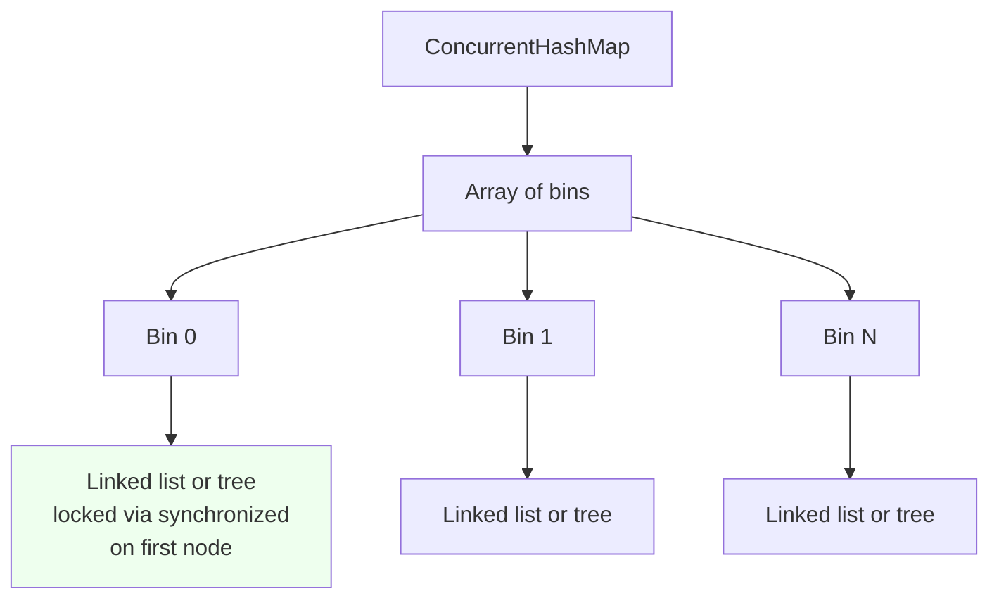
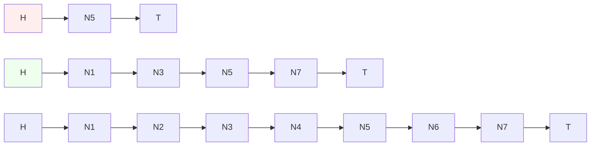
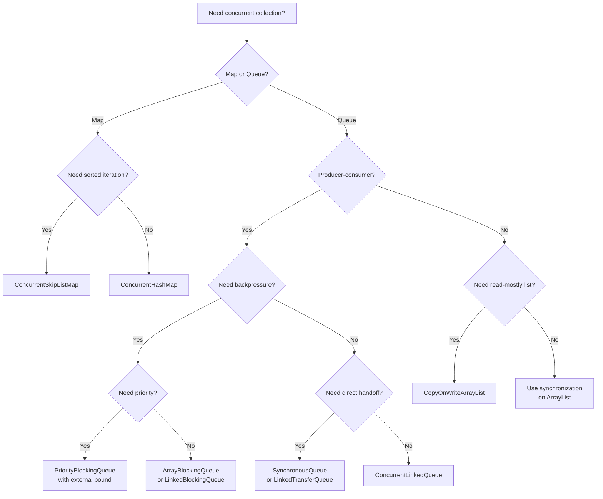

# Concurrent Collections

## Overview

The collections in `java.util` (HashMap, ArrayList, TreeMap, and so on) are not thread-safe. If multiple threads access them concurrently without external synchronization, the results are unpredictable: lost updates, infinite loops, null elements, and outright data corruption. The simplest solution is to wrap every access in a `synchronized` block, which is what `Collections.synchronizedList` and friends do. But synchronization serializes all access, killing concurrency.

The `java.util.concurrent` package provides a family of collections designed from the ground up for concurrent access. They use fine-grained locking, lock-free algorithms, and immutable snapshots to allow many threads to read and update simultaneously without serializing. This note covers the most important concurrent collections: `ConcurrentHashMap`, `CopyOnWriteArrayList`, `CopyOnWriteArraySet`, `ConcurrentLinkedQueue`, `ConcurrentLinkedDeque`, the `BlockingQueue` implementations (`ArrayBlockingQueue`, `LinkedBlockingQueue`, `SynchronousQueue`, `PriorityBlockingQueue`, `DelayQueue`, `LinkedTransferQueue`), and `ConcurrentSkipListMap` and `ConcurrentSkipListSet`.

## Background Knowledge

Before reading this note, you should be comfortable with:

- The non-concurrent collections from Phase 4 of this roadmap, particularly the internals of `HashMap` (buckets, treeification, resize) and the binary-heap implementation of `PriorityQueue`.
- Compare-and-swap and atomic variables, covered in the previous note, because most concurrent collections are built on CAS.
- The `BlockingQueue` interface and the producer-consumer pattern.

The key design tension in concurrent collections is between consistency and performance. A fully consistent collection (one that always reflects the latest update from any thread) requires strong synchronization, which limits concurrency. A weakly consistent collection (one whose iterators reflect the state at some point in time but may not include concurrent updates) can be much faster.

Most `java.util.concurrent` collections are weakly consistent: their iterators are guaranteed to make progress, never throw `ConcurrentModificationException`, and reflect the state of the collection at some point in time, possibly missing concurrent updates. This is acceptable for most use cases and is the basis of their performance.

## ConcurrentHashMap

`ConcurrentHashMap` is the workhorse of concurrent Java. It is a hash table like `HashMap` but designed for high-concurrency access.

### Evolution

- **Java 1.5**: introduced with the `Segment` design. The map was divided into 16 segments, each with its own lock. Operations only locked the segment containing the relevant key, allowing up to 16 threads to write concurrently.
- **Java 8**: removed segments in favor of per-bin (per-bucket) locking using CAS and `synchronized` on the first node of a bin. Bins with many entries are treeified into red-black trees, like `HashMap`.
- **Java 9+**: further optimizations, including `TreeBin` improvements and better handling of reservations.

### Internal Structure (Java 8+)



Each bin is a linked list (or red-black tree if it has more than 8 elements). Writes to a bin are protected by `synchronized` on the first node of the bin. Writes to different bins proceed in parallel without contention. CAS is used for the initial insertion into an empty bin.

### Atomic Operations

```java
ConcurrentHashMap<String, Integer> map = new ConcurrentHashMap<>();

// putIfAbsent: insert only if absent.
map.putIfAbsent("a", 1);

// compute: compute a new value from the current value.
map.compute("a", (k, v) -> v == null ? 1 : v + 1);

// computeIfAbsent: compute only if the key is absent.
map.computeIfAbsent("b", k -> expensiveCompute(k));

// computeIfPresent: compute only if the key is present.
map.computeIfPresent("a", (k, v) -> v * 2);

// merge: combine the existing value with a new value.
map.merge("a", 1, Integer::sum);  // adds 1 to whatever is there
```

These operations are atomic: they read the current value, compute the new value, and write it back as a single unit, even though no lock is held across the entire computation. The implementation handles retries internally when concurrent updates occur.

### Common Patterns

#### A counter map

```java
ConcurrentHashMap<String, LongAdder> counts = new ConcurrentHashMap<>();

public void increment(String key) {
    // computeIfAbsent creates the LongAdder if absent;
    // increment is then called on the existing or new counter.
    counts.computeIfAbsent(key, k -> new LongAdder()).increment();
}

public long getCount(String key) {
    LongAdder adder = counts.get(key);
    return adder == null ? 0 : adder.sum();
}
```

#### A cached computation

```java
ConcurrentHashMap<String, CompletableFuture<Data>> cache = new ConcurrentHashMap<>();

public CompletableFuture<Data> get(String key) {
    return cache.computeIfAbsent(key, k ->
        CompletableFuture.supplyAsync(() -> expensiveLoad(k))
    );
}
```

This pattern, called a memoizing cache, computes each value at most once. Be careful: `computeIfAbsent` runs the supplier while holding the bin lock, so it should not block. The pattern above moves the actual work to an async task and stores the future in the map, which is safe.

### Iteration

`ConcurrentHashMap` iterators are weakly consistent. They traverse the map as it existed at or since the iterator was created, may or may not reflect concurrent modifications, and never throw `ConcurrentModificationException`.

```java
for (var entry : map.entrySet()) {
    // Safe even if another thread is updating the map.
    // May or may not see updates made during iteration.
}
```

### Bulk Operations (Java 8+)

```java
// forEach: parallel iteration when the map is large.
map.forEach(1000, (k, v) -> System.out.println(k + "=" + v));

// search: find the first non-null result.
Integer found = map.search(1000, (k, v) -> v > 10 ? v : null);

// reduce: combine all values.
long sum = map.reduceValues(1000, Long::sum);
```

The first argument is the parallelism threshold: if the map has fewer than this many elements, the operation runs sequentially. Bulk operations are designed for large maps where parallelism pays off.

### Size and Clear

`size()` and `mappingCount()` return an estimate, not an exact count, because counting all entries without locking would be impossible. The implementation uses striped counters (one per stripe) and sums them; under concurrent updates, the result may be slightly off.

`clear()` is not atomic; it iterates and clears bins one at a time. Other threads can see the map in a partially cleared state.

## CopyOnWriteArrayList and CopyOnWriteArraySet

`CopyOnWriteArrayList` is a thread-safe `ArrayList` variant that achieves safety by copying the entire underlying array on every write. Reads are completely lock-free: they just read from the current array.

```java
CopyOnWriteArrayList<Listener> listeners = new CopyOnWriteArrayList<>();

public void addListener(Listener l) {
    listeners.add(l);  // copies the entire array
}

public void notifyAll(Event e) {
    for (Listener l : listeners) {  // lock-free read
        l.onEvent(e);
    }
}
```

The strength of `CopyOnWriteArrayList` is in read-heavy workloads where writes are rare: listener registries, configuration snapshots, and caches that are loaded once and read many times. The weakness is that writes are expensive (O(n) per write) and high write rates will overwhelm the GC with discarded array copies.

Iterators reflect the state of the list at the time the iterator was created. They never throw `ConcurrentModificationException`. They do not support the `remove`, `set`, or `add` operations.

`CopyOnWriteArraySet` is a `Set` implementation backed by `CopyOnWriteArrayList`. It has the same trade-offs: excellent for read-mostly workloads, terrible for write-heavy ones.

## ConcurrentLinkedQueue and ConcurrentLinkedDeque

`ConcurrentLinkedQueue` is an unbounded, non-blocking, thread-safe FIFO queue based on the Michael and Scott algorithm. It uses CAS to enqueue at the tail and dequeue from the head, without any locks.

```java
ConcurrentLinkedQueue<Task> queue = new ConcurrentLinkedQueue<>();

queue.offer(new Task());  // non-blocking enqueue
Task t = queue.poll();    // non-blocking dequeue; returns null if empty
```

Because it is non-blocking, `offer` and `poll` never wait. They return immediately, either succeeding or failing. This is ideal for work-stealing patterns and for queues where you want backpressure at the application level rather than in the queue itself.

`ConcurrentLinkedDeque` is the double-ended version. It supports `addFirst`, `addLast`, `pollFirst`, and `pollLast`. It is useful for stack-like (LIFO) access in addition to queue-like (FIFO) access.

Note that the size of a `ConcurrentLinkedQueue` is O(n) to compute, because it is not tracked; the implementation traverses the queue to count. Avoid calling `size()` in a hot path.

### The Michael and Scott Algorithm

`ConcurrentLinkedQueue` is built on the Michael and Scott lock-free queue algorithm, published in 1996. The idea is to use CAS on the head and tail pointers, with a careful protocol that handles the case where one thread is in the middle of an enqueue when another thread arrives.

The enqueue operation works as follows: read the current tail, read the next pointer of the tail (which is normally null but may be a half-linked node if another thread is in the middle of an enqueue), and try to CAS the next pointer from null to the new node. If the CAS succeeds, try to CAS the tail from the old tail to the new node (this is a hint; if it fails, another thread has already done it). If the CAS on next fails because another thread has already advanced next, retry from the new tail.

This algorithm is lock-free: at least one thread makes progress on each step. It is not wait-free: an unlucky thread may retry indefinitely under contention. In practice, the contention is low enough that retries are rare, and the algorithm scales well to dozens of cores.

## Iteration and Consistency Models

Each concurrent collection has its own consistency model, which determines what an iterator sees when other threads are concurrently modifying the collection. Understanding these models is essential for writing correct code.

| Collection                  | Iterator consistency |
|-----------------------------|----------------------|
| ConcurrentHashMap           | Weakly consistent    |
| CopyOnWriteArrayList        | Snapshot            |
| ConcurrentLinkedQueue       | Weakly consistent    |
| LinkedBlockingQueue         | Weakly consistent    |
| ConcurrentSkipListMap       | Weakly consistent    |

**Weakly consistent** iterators make progress, never throw `ConcurrentModificationException`, and reflect the state of the collection at some point in time. They may or may not reflect concurrent modifications.

**Snapshot** iterators reflect the state of the collection at the moment the iterator was created. Subsequent modifications are not visible. This is what `CopyOnWriteArrayList` provides, because each write creates a new array.

For most monitoring and aggregation use cases, weakly consistent iteration is fine. For atomic decisions based on a consistent snapshot, copy the collection first:

```java
Map<K, V> snapshot = new HashMap<>(concurrentMap);
// Now iterate the snapshot safely.
```

## BlockingQueue Implementations

`BlockingQueue` extends `Queue` with blocking operations: `put` blocks until space is available, `take` blocks until an element is available. It is the foundation of the producer-consumer pattern.

```java
BlockingQueue<Work> queue = new ArrayBlockingQueue<>(100);

// Producer
queue.put(work);  // blocks if queue is full

// Consumer
Work w = queue.take();  // blocks if queue is empty
```

The `BlockingQueue` interface also offers non-blocking and timed variants:

```java
boolean added = queue.offer(work);                 // returns false if full
boolean added2 = queue.offer(work, 1, TimeUnit.SECONDS);  // waits up to 1s
Work w = queue.poll();                              // returns null if empty
Work w2 = queue.poll(1, TimeUnit.SECONDS);          // waits up to 1s
```

### ArrayBlockingQueue

A bounded FIFO queue backed by a circular array. A single `ReentrantLock` protects both head and tail. The bounded nature provides natural backpressure: when the queue is full, producers block.

```java
BlockingQueue<Task> queue = new ArrayBlockingQueue<>(1000);
```

Because there is a single lock, producers and consumers contend on the same lock, which can be a bottleneck under heavy load. For higher throughput at the cost of unboundedness, use `LinkedBlockingQueue`.

### LinkedBlockingQueue

An optionally bounded FIFO queue backed by linked nodes. It uses two `ReentrantLock`s: one for the head and one for the tail. This allows producers and consumers to operate concurrently, improving throughput over `ArrayBlockingQueue`.

```java
BlockingQueue<Task> queue = new LinkedBlockingQueue<>(1000);  // bounded
BlockingQueue<Task> unbounded = new LinkedBlockingQueue<>();  // capacity defaults to 2147483647 (Integer max)
```

The unbounded version is dangerous: under sustained producer pressure, the queue grows without limit and eventually exhausts memory. Always specify a capacity in production.

### SynchronousQueue

A zero-capacity queue. Each `put` blocks until a `take` is in progress, and vice versa. It is essentially a handoff between producers and consumers, with no buffering.

```java
BlockingQueue<Work> queue = new SynchronousQueue<>();
// Producer:
queue.put(work);  // blocks until a consumer calls take()
// Consumer:
Work w = queue.take();  // blocks until a producer calls put()
```

`SynchronousQueue` is used internally by `Executors.newCachedThreadPool`: each submitted task is handed directly to a worker, with no buffering. If no worker is available, a new one is created.

### PriorityBlockingQueue

An unbounded blocking queue that orders elements according to their natural order or a supplied `Comparator`. Internally it uses a binary heap like `PriorityQueue`, but `put` never blocks (the queue is unbounded) and `take` blocks when the queue is empty.

```java
BlockingQueue<Order> queue = new PriorityBlockingQueue<>(
    11, Comparator.comparingLong(Order::priority));
```

Use this when you need to process items in priority order. The unbounded nature means producers are never blocked, so you need external backpressure if your producers can outrun your consumers.

### DelayQueue

An unbounded blocking queue whose elements become available only after their delay has elapsed. Elements must implement `Delayed`:

```java
public class DelayedTask implements Delayed {
    private final long startTime;
    private final Runnable task;

    public DelayedTask(long delayMillis, Runnable task) {
        this.startTime = System.currentTimeMillis() + delayMillis;
        this.task = task;
    }

    @Override
    public long getDelay(TimeUnit unit) {
        long remaining = startTime - System.currentTimeMillis();
        return unit.convert(remaining, TimeUnit.MILLISECONDS);
    }

    @Override
    public int compareTo(Delayed o) {
        return Long.compare(getDelay(TimeUnit.MILLISECONDS),
                            o.getDelay(TimeUnit.MILLISECONDS));
    }
}

DelayQueue<DelayedTask> queue = new DelayQueue<>();
queue.put(new DelayedTask(5000, () -> System.out.println("fired")));
// Consumer:
DelayedTask t = queue.take();  // blocks until 5s elapse
```

Use this for scheduled tasks, retries with backoff, and timeouts.

### LinkedTransferQueue

An unbounded queue that combines the features of `SynchronousQueue`, `LinkedBlockingQueue`, and `ConcurrentLinkedQueue`. It supports a `transfer` method that blocks until the element is consumed by another thread.

```java
LinkedTransferQueue<Work> queue = new LinkedTransferQueue<>();
queue.transfer(work);  // blocks until a consumer takes the work
```

`LinkedTransferQueue` is generally faster than `LinkedBlockingQueue` for both producers and consumers, and is the recommended default when you need a transfer queue.

## ConcurrentSkipListMap and ConcurrentSkipListSet

`ConcurrentSkipListMap` is a sorted concurrent map, the concurrent equivalent of `TreeMap`. It is implemented as a skip list, a probabilistic data structure that offers O(log n) lookup, insertion, and deletion without the rebalancing cost of red-black trees.

### Skip List Overview

A skip list is a multi-level linked list. The bottom level is a sorted singly-linked list. Each higher level skips over some elements, providing "fast lanes" for traversal. The expected time complexity for search, insert, and delete is O(log n).



Search starts at the top-left head, moves right while the next node's key is less than the target, and drops down a level when it would overshoot. Insertion and deletion use CAS on the node pointers.

`ConcurrentSkipListSet` is a sorted set backed by `ConcurrentSkipListMap`.

### Comparison with ConcurrentHashMap

| Property                  | ConcurrentHashMap | ConcurrentSkipListMap |
|---------------------------|--------------------|------------------------|
| Ordering                  | No ordering        | Sorted by key          |
| Time complexity           | O(1) average       | O(log n)               |
| Memory per entry          | Lower              | Higher (multiple levels) |
| Navigation                | No                 | firstKey, lastKey, subMap, etc. |
| Use case                  | General-purpose    | When sorted iteration is needed |

Use `ConcurrentHashMap` for general-purpose concurrent maps. Use `ConcurrentSkipListMap` only when you need sorted iteration, range queries, or nearest-key lookups.

## Choosing a Concurrent Collection



## Common Pitfalls

### Using HashMap instead of ConcurrentHashMap in a multi-threaded context

`HashMap` is not thread-safe. Concurrent `put` operations can corrupt the internal data structure, leading to infinite loops on `get` (in Java 7 with the Linked Entry cycle bug) or lost entries (in any version). Always use `ConcurrentHashMap` when multiple threads may write.

### Calling size() on ConcurrentLinkedQueue in a hot path

`size()` is O(n) for `ConcurrentLinkedQueue` because it traverses the queue. Use `isEmpty()` instead, or maintain an `AtomicLong` counter if you need a fast size.

### Iterating and modifying ConcurrentHashMap simultaneously

Iterators are weakly consistent and will not throw, but they may not see your modifications. If you need a consistent snapshot, copy the map:

```java
Map<K, V> snapshot = new HashMap<>(concurrentMap);
```

### Using computeIfAbsent for long-running computations

`computeIfAbsent` runs the supplier while holding the bin lock. If the supplier blocks (e.g., on I/O), other threads accessing the same bin are blocked. Move the work to a `CompletableFuture` and store the future in the map, as shown in the cached computation pattern above.

### Wrapping an unsynchronized collection with synchronizedX and expecting high concurrency

`Collections.synchronizedMap` locks the entire map on every operation. Under contention, this serializes access and kills throughput. Use `ConcurrentHashMap` instead.

### Using CopyOnWriteArrayList for write-heavy workloads

Every write copies the entire array. Write-heavy workloads will spend most of their time copying and most of their memory on discarded arrays. Use `ConcurrentLinkedQueue` or wrap an `ArrayList` with explicit synchronization instead.

### Relying on weakly consistent iteration for correctness

If your algorithm requires a consistent snapshot of the collection at a point in time, copy it first. Weakly consistent iteration is fine for monitoring and aggregation but not for atomic decisions.

### Assuming BlockingQueue put never blocks

On an unbounded queue (such as `LinkedBlockingQueue` without a capacity), `put` does not block. On a bounded queue, it blocks when full. Make sure the bounded behavior is what you want, or producers may stall indefinitely.

## Tips and Tricks

### Use ConcurrentHashMap.forEachKey for parallel iteration on large maps

The bulk operations `forEach`, `search`, and `reduce` parallelize automatically when the map is large. They are ideal for monitoring and aggregation across large maps.

### Use computeIfAbsent with care

`computeIfAbsent` is powerful but has subtle behavior:

- The supplier runs while the bin lock is held, so it must be fast.
- Recursive calls into the same bin will deadlock.
- The supplier may be called more than once under contention, but only one result is stored.

If your computation may block or recurse, use a memoizing pattern with `CompletableFuture` instead.

### Use ConcurrentHashMap as a cache with expiry

```java
ConcurrentHashMap<String, Long> expiresAt = new ConcurrentHashMap<>();
ConcurrentHashMap<String, Data> cache = new ConcurrentHashMap<>();

public Data get(String key) {
    if (expiresAt.getOrDefault(key, 0L) < System.currentTimeMillis()) {
        cache.remove(key);
        expiresAt.remove(key);
    }
    return cache.computeIfAbsent(key, k -> load(k));
}
```

For production caches, prefer Caffeine, which provides sophisticated eviction and expiry policies.

### Use LinkedBlockingQueue with two locks for high throughput

`LinkedBlockingQueue` uses separate locks for head and tail, so producers and consumers do not contend. This is faster than `ArrayBlockingQueue` for high-throughput producer-consumer patterns.

### Use DelayQueue for retries with exponential backoff

```java
public void scheduleRetry(long delayMillis, Runnable task) {
    delayQueue.put(new DelayedTask(delayMillis, task));
}

// In a consumer thread:
while (true) {
    DelayedTask t = delayQueue.take();  // waits for the delay
    executor.submit(t.task);
}
```

### Use ConcurrentSkipListMap for range queries

```java
ConcurrentSkipListMap<Instant, Event> events = new ConcurrentSkipListMap<>();
events.put(Instant.now(), new Event());

// Get all events in the last hour.
Instant oneHourAgo = Instant.now().minus(Duration.ofHours(1));
Map<Instant, Event> recent = events.tailMap(oneHourAgo);
```

### Use putIfAbsent to avoid duplicate work

```java
ConcurrentHashMap<String, Connection> connections = new ConcurrentHashMap<>();

public Connection get(String id) {
    Connection existing = connections.get(id);
    if (existing != null) return existing;

    Connection newConn = openConnection(id);
    Connection raced = connections.putIfAbsent(id, newConn);
    if (raced != null) {
        newConn.close();      // we lost the race; close the duplicate
        return raced;
    }
    return newConn;
}
```

### Use newKeySet for a concurrent set

```java
Set<String> set = ConcurrentHashMap.newKeySet();
```

This returns a `Set` backed by a `ConcurrentHashMap`, with the same performance characteristics.

## Interview Questions

### Q1: What is the difference between HashMap and ConcurrentHashMap?

`HashMap` is not thread-safe; concurrent access can corrupt its internal structure. `ConcurrentHashMap` is thread-safe, supports full concurrency of reads and high concurrency of writes, and provides atomic operations like `computeIfAbsent` and `merge`. Internally, it uses per-bin locking (since Java 8) instead of segment locking.

### Q2: How does ConcurrentHashMap achieve high concurrency?

By partitioning the map into bins and locking only the bin containing the relevant key. CAS is used for the initial insertion into an empty bin, and `synchronized` on the first node of a bin is used for updates to non-empty bins. Writes to different bins proceed in parallel without contention.

### Q3: What is weakly consistent iteration?

An iterator that is guaranteed to make progress, never throws `ConcurrentModificationException`, and reflects the state of the collection at some point in time, possibly missing concurrent updates. All `java.util.concurrent` collections have weakly consistent iterators.

### Q4: When would you use CopyOnWriteArrayList?

When reads vastly outnumber writes, such as for listener registries and configuration snapshots. Reads are completely lock-free; writes copy the entire array, which is too expensive for write-heavy workloads.

### Q5: What is the difference between ArrayBlockingQueue and LinkedBlockingQueue?

`ArrayBlockingQueue` is backed by a circular array and uses a single lock for both head and tail, so producers and consumers contend on the same lock. `LinkedBlockingQueue` is backed by linked nodes and uses two separate locks, allowing producers and consumers to operate concurrently. `ArrayBlockingQueue` is bounded; `LinkedBlockingQueue` can be bounded or unbounded.

### Q6: What is a SynchronousQueue?

A zero-capacity `BlockingQueue`. Each `put` blocks until a `take` is in progress, and vice versa. It is used to hand off elements directly from producers to consumers without buffering. It is used internally by `Executors.newCachedThreadPool`.

### Q7: How does PriorityBlockingQueue maintain order?

It uses a binary heap internally, like `PriorityQueue`. Elements are ordered by their natural order or a supplied `Comparator`. The queue is unbounded, so `put` never blocks; `take` blocks when the queue is empty.

### Q8: What is a DelayQueue and how is it used?

A `BlockingQueue` whose elements become available only after their delay has elapsed. Elements must implement `Delayed`. It is used for scheduled tasks, retries with backoff, and timeouts.

### Q9: What is a skip list?

A probabilistic data structure that maintains a sorted linked list with multiple levels of "fast lanes" for O(log n) search, insert, and delete. It is the basis of `ConcurrentSkipListMap` and `ConcurrentSkipListSet`. Unlike red-black trees, skip lists do not require rebalancing, which makes them easier to make concurrent.

### Q10: What is the difference between ConcurrentHashMap and ConcurrentSkipListMap?

`ConcurrentHashMap` is unordered and offers O(1) average time for put, get, and remove. `ConcurrentSkipListMap` is sorted by key and offers O(log n) for the same operations. Use `ConcurrentSkipListMap` when you need sorted iteration, range queries, or nearest-key lookups.

### Q11: What does computeIfAbsent do, and what are its pitfalls?

It atomically inserts a value computed by a supplier if the key is absent. The pitfall is that the supplier runs while the bin lock is held, so it must be fast and must not recurse into the same bin, or it will deadlock.

### Q12: How do you atomically update a value in a ConcurrentHashMap?

Use `compute`, `computeIfPresent`, `merge`, or `replace`. These methods perform the read-modify-write atomically, even though no lock is held across the entire computation. The implementation retries internally if a concurrent update occurs.

### Q13: What is LinkedTransferQueue?

A `BlockingQueue` that combines the features of `SynchronousQueue`, `LinkedBlockingQueue`, and `ConcurrentLinkedQueue`. It supports a `transfer` method that blocks until the element is consumed. It is generally faster than `LinkedBlockingQueue` and is the recommended default for transfer queues.

### Q14: Why is size() O(n) on ConcurrentLinkedQueue?

Because the queue does not maintain a counter (it would be a contention point). To compute the size, the implementation traverses the queue. Use `isEmpty()` instead, or maintain an `AtomicLong` counter if you need a fast size.

### Q15: How does ConcurrentHashMap handle resize?

In Java 8+, resize is parallel. When the table needs to grow, multiple threads cooperate to transfer bins from the old table to the new one. Each thread takes a contiguous range of bins and uses a `ForwardingNode` to mark bins that have already been moved. Reads and writes can proceed concurrently with the resize.

## Summary

The `java.util.concurrent` collections provide thread-safe alternatives to the collections in `java.util`, designed for high concurrency without serializing access. `ConcurrentHashMap` is the workhorse: a per-bin-locked hash table with atomic operations, bulk operations, and weakly consistent iteration. `CopyOnWriteArrayList` and `CopyOnWriteArraySet` are ideal for read-mostly workloads. `ConcurrentLinkedQueue` and `ConcurrentLinkedDeque` are non-blocking FIFO/LIFO queues. The `BlockingQueue` implementations cover the full spectrum of producer-consumer patterns: bounded, unbounded, transfer, priority, and delay. `ConcurrentSkipListMap` and `ConcurrentSkipListSet` provide sorted concurrent maps and sets.

Choosing the right concurrent collection is mostly about understanding the workload. For general-purpose concurrent maps, use `ConcurrentHashMap`. For read-mostly lists, use `CopyOnWriteArrayList`. For producer-consumer queues, choose among `ArrayBlockingQueue`, `LinkedBlockingQueue`, `SynchronousQueue`, `LinkedTransferQueue`, `PriorityBlockingQueue`, and `DelayQueue` based on whether you need boundedness, priority, delay, or transfer semantics. For sorted concurrent access, use the skip list implementations.

The next note covers the darker side of concurrency: deadlocks, race conditions, and the Java Memory Model. Understanding these is essential for diagnosing the subtle bugs that arise when concurrent collections are not enough and you must build your own synchronization.
