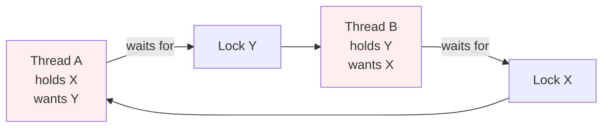

# Deadlocks, Race Conditions, and the Java Memory Model

## Overview

Concurrency bugs are the hardest bugs to diagnose and the easiest to introduce. They often do not manifest in unit tests, they may appear only under specific hardware or load, and they may disappear when you add a print statement. Three classes of concurrency bugs account for the majority of production incidents: race conditions, deadlocks, and memory-ordering bugs caused by misunderstanding the Java Memory Model.

This note covers all three. We will explore what race conditions are and how to prevent them, the four necessary conditions for deadlock and the strategies for breaking each one, deadlock detection with thread dumps, livelock and starvation, and the formal model of happens-before that defines when one thread's writes are visible to another. We will also cover the practical tools Java provides for diagnosing concurrency bugs: `jstack`, `jcmd`, `ThreadMXBean`, and `Lock` introspection methods.

## Background Knowledge

Before reading this note, you should be comfortable with:

- Intrinsic locks (`synchronized`) and the `Lock` interface.
- The thread lifecycle states, particularly `BLOCKED` and `WAITING`.
- Atomic variables and the role of `volatile`.
- The basic concept of happens-before introduced in earlier notes.

This note formalises what was introduced informally earlier: the Java Memory Model is a formal specification (JSR 133, implemented in Java 5+) that defines exactly when one thread is guaranteed to see another's writes. Without this formal model, you cannot reason about whether a concurrent program is correct.

## Race Conditions

A race condition occurs when the correctness of a program depends on the relative timing of operations in multiple threads. There are several flavours.

### Data Race

A data race occurs when two or more threads access the same non-final, non-volatile field, at least one of the accesses is a write, and there is no happens-before relationship between them. Data races are undefined behaviour in the Java Memory Model: the JVM is free to return stale values, partially constructed objects, or any other value it likes.

```java
public class DataRace {
    private boolean ready = false;
    private int number = 0;

    public void writer() {
        number = 42;      // (1) write number
        ready = true;     // (2) write ready
    }

    public void reader() {
        if (ready) {                  // (3) read ready
            System.out.println(number); // (4) read number; may print 0!
        }
    }
}
```

Without synchronization, the JVM is free to reorder the writes (1) and (2), and the reader may see `ready == true` but `number == 0`. The fix is to make both fields `volatile`, which establishes a happens-before relationship between the writer's writes and the reader's reads.

### Check-then-act

A check-then-act race occurs when a thread checks a condition and then acts on it, but another thread modifies the state in between.

```java
public boolean containsKey(K key) {
    return map.containsKey(key);
}
public void putIfAbsent(K key, V value) {
    if (!map.containsKey(key)) {
        map.put(key, value);
    }
}
```

Even if `map` is a `ConcurrentHashMap`, the two operations `containsKey` and `put` are not atomic together: another thread can put the key in between. The fix is to use `putIfAbsent` or `computeIfAbsent`, which are atomic.

### Read-modify-write

A read-modify-write race occurs when a thread reads a value, computes a new value, and writes it back, but another thread modifies the value in between.

```java
public void increment() {
    count++;  // not atomic: read, add 1, write
}
```

Even if `count` is `volatile`, this is racy. The fix is `AtomicInteger.incrementAndGet()`, `synchronized`, or a `LongAdder`.

### Compound actions

A compound action is one that involves multiple operations that must appear atomic together. Examples: get-then-put, put-if-absent, iterate-and-modify. The general fix is to either use a higher-level abstraction (atomic methods on `ConcurrentHashMap`, `BlockingQueue`) or to wrap the entire compound action in a single lock.

## Deadlocks

A deadlock occurs when two or more threads are blocked forever, each waiting for a resource held by another. The classic example is the dining philosophers problem; in Java, the most common form is lock-ordering deadlock.

### The Four Necessary Conditions (Coffman Conditions)

A deadlock can occur only if all four of the following conditions hold simultaneously:

1. **Mutual exclusion**: at least one resource must be held in a non-shareable mode.
2. **Hold and wait**: a thread holds at least one resource and waits to acquire additional resources held by other threads.
3. **No preemption**: resources cannot be forcibly taken from threads; they must be released voluntarily.
4. **Circular wait**: there exists a circular chain of two or more threads, each waiting for a resource held by the next.

Breaking any one of these conditions prevents deadlock.

### A Classic Lock-Ordering Deadlock

```java
public class TransferService {
    public void transfer(Account from, Account to, double amount) {
        synchronized (from) {
            synchronized (to) {
                if (from.balance() >= amount) {
                    from.debit(amount);
                    to.credit(amount);
                }
            }
        }
    }
}
```

If Thread A calls `transfer(x, y, 100)` and Thread B calls `transfer(y, x, 100)` simultaneously, A may hold the lock on `x` and wait for `y`, while B holds the lock on `y` and waits for `x`. Both block forever.



### Breaking the Circular Wait: Lock Ordering

The standard fix is to acquire locks in a consistent global order:

```java
public void transfer(Account from, Account to, double amount) {
    Account first = from.id() < to.id() ? from : to;
    Account second = from.id() < to.id() ? to : from;
    synchronized (first) {
        synchronized (second) {
            if (from.balance() >= amount) {
                from.debit(amount);
                to.credit(amount);
            }
        }
    }
}
```

If both threads always acquire the lower-id account first, no circular wait can arise. This breaks condition 4 (circular wait) and is the most common deadlock-prevention strategy.

### Breaking Hold and Wait: Acquire All Locks at Once

Acquire all locks atomically, or none at all:

```java
public boolean tryTransfer(Account from, Account to, double amount)
        throws InterruptedException {
    while (true) {
        if (from.lock().tryLock(100, TimeUnit.MILLISECONDS)) {
            try {
                if (to.lock().tryLock(100, TimeUnit.MILLISECONDS)) {
                    try {
                        if (from.balance() >= amount) {
                            from.debit(amount);
                            to.credit(amount);
                            return true;
                        }
                        return false;
                    } finally {
                        to.lock().unlock();
                    }
                }
            } finally {
                from.lock().unlock();
            }
        }
        // Back off and retry.
        Thread.sleep(50);
    }
}
```

This pattern uses `tryLock` with a timeout, which breaks condition 3 (no preemption, in a sense: the lock is released after a timeout) and condition 2 (hold and wait).

### Breaking Mutual Exclusion: Lock-Free Algorithms

Use atomic variables or concurrent collections that do not require holding locks. This breaks condition 1.

### Breaking No Preemption: Interruptible Locks

Use `lockInterruptibly` and have a watchdog interrupt threads that have been stuck too long. This breaks condition 3 in a different way: the lock acquisition itself can be interrupted.

### Detecting Deadlocks with Thread Dumps

If you suspect a deadlock, the fastest diagnostic is a thread dump.

#### Using jstack

```bash
jstack <pid>
```

The output shows the state of every thread, including which lock each thread holds and which lock it is waiting for. When a deadlock is present, `jstack` prints a "Found one Java-level deadlock" section at the bottom, listing the threads involved and the locks they hold.

#### Using jcmd

```bash
jcmd <pid> Thread.print
```

This produces the same thread dump as `jstack`. The `jcmd` tool is the modern, recommended alternative.

#### Using ThreadMXBean

```java
import java.lang.management.*;

ThreadMXBean bean = ManagementFactory.getThreadMXBean();
long[] deadlockedThreads = bean.findDeadlockedThreads();
if (deadlockedThreads != null) {
    ThreadInfo[] infos = bean.getThreadInfo(deadlockedThreads);
    for (ThreadInfo info : infos) {
        System.err.println(info);
    }
}
```

`findDeadlockedThreads` detects cycles involving `Lock` objects (synchronizers). `findMonitorDeadlockedThreads` detects cycles involving intrinsic locks (monitors). You can poll this in a monitoring agent and log or alert when a deadlock is detected.

### A Sample Deadlock Thread Dump

```
"Thread-A" prio=5 ... waiting to lock <0x000000076b5c4a78>
   - locked <0x000000076b5c4a80>
   at TransferService.transfer(...)

"Thread-B" prio=5 ... waiting to lock <0x000000076b5c4a80>
   - locked <0x000000076b5c4a78>
   at TransferService.transfer(...)

Found one Java-level deadlock:
=============================
"Thread-A":
  waiting to lock monitor 0x... (object 0x..., a Account),
  which is held by "Thread-B"

"Thread-B":
  waiting to lock monitor 0x... (object 0x..., a Account),
  which is held by "Thread-A"
```

The key fields are `locked <addr>` (the lock the thread holds) and `waiting to lock <addr>` (the lock the thread wants). If two threads each hold the lock the other wants, you have a deadlock.

## Livelock and Starvation

### Livelock

A livelock occurs when threads are not blocked but are unable to make progress because they keep responding to each other. The classic example is two people meeting in a hallway, both stepping aside, then both stepping back, indefinitely.

```java
public void retryWithBackoff() {
    while (!tryAcquire()) {
        // If both threads back off by the same amount, they will
        // retry at the same time and conflict again.
        sleep(100);
    }
}
```

The fix is to introduce randomness in the backoff, so the threads retry at different times:

```java
sleep(100 + ThreadLocalRandom.current().nextInt(50));
```

### Starvation

Starvation occurs when a thread is unable to gain access to a resource indefinitely, even though the resource becomes available, because other threads keep grabbing it. This happens with unfair locks when one thread is consistently slower than others.

The fix is to use fair locks (`new ReentrantLock(true)`) when fairness is a correctness requirement, or to redesign the algorithm to avoid the contention.

## The Java Memory Model

The Java Memory Model (JMM) is a formal specification that defines when one thread is guaranteed to see another's writes. It was overhauled in Java 5 (JSR 133) and has been stable since.

### Why a Memory Model is Necessary

Modern CPUs do not execute instructions in the order they appear in source code. They reorder instructions for performance, use store buffers and invalidate queues, and cache values in registers. Compilers (including the JIT) also reorder operations. These reorderings are invisible in single-threaded code but can cause subtle bugs in multi-threaded code.

The JMM defines a contract: certain operations establish happens-before relationships, which guarantee that the results of one operation are visible to another. Outside these relationships, the JVM is free to reorder and cache as it likes.

### Happens-Before

If action A happens-before action B, then:

- The results of A are visible to B.
- B cannot reorder A's effects.

The happens-before relationship is transitive: if A happens-before B and B happens-before C, then A happens-before C.

### Operations that Establish Happens-Before

1. **Program order rule**: within a single thread, each action in the source code happens-before every action that comes later in the source code. (This is single-threaded semantics; the JMM defines the apparent ordering observed by other threads.)

2. **Monitor lock rule**: an unlock on a monitor happens-before every subsequent lock on the same monitor.

3. **Volatile variable rule**: a write to a volatile field happens-before every subsequent read of the same field.

4. **Thread start rule**: a call to `Thread.start` happens-before any action in the started thread.

5. **Thread termination rule**: any action in a thread happens-before another thread successfully returns from `join` on it, or detects that it has terminated via `isAlive` returning false.

6. **Interruption rule**: a thread calling `interrupt` on another thread happens-before the interrupted thread detects the interrupt (via `InterruptedException` or `isInterrupted`).

7. **Finalizer rule**: the end of a constructor happens-before the start of a finalizer.

8. **Transitivity**: if A happens-before B and B happens-before C, then A happens-before C.

### What Volatile Actually Does

A `volatile` field has two properties:

1. **Visibility**: writes are immediately visible to other threads; reads always see the most recent write.
2. **Ordering**: the compiler and CPU cannot reorder a volatile write with any prior memory operation, nor a volatile read with any subsequent memory operation. (In JMM terms, a volatile write has release semantics and a volatile read has acquire semantics.)

These properties make `volatile` useful for publishing state:

```java
public class Publisher {
    private volatile boolean ready = false;
    private int data;

    public void publish() {
        data = 42;          // (1) write to non-volatile field
        ready = true;       // (2) write to volatile field
    }

    public void consume() {
        if (ready) {                 // (3) read volatile
            System.out.println(data); // (4) read non-volatile; guaranteed 42
        }
    }
}
```

Because (2) happens-before (3) (volatile write happens-before subsequent volatile read), and (1) happens-before (2) (program order), by transitivity (1) happens-before (4), so the reader is guaranteed to see `data == 42`.

This pattern is called safe publication via a volatile flag.

### The Role of Synchronized in Visibility

Acquiring a monitor establishes a happens-before with the previous release of that monitor. So all writes made by Thread A inside a `synchronized` block are visible to Thread B when Thread B enters a `synchronized` block on the same monitor, even if those writes were to non-volatile fields.

```java
public class Holder {
    private int value;  // not volatile
    private final Object lock = new Object();

    public void set(int v) {
        synchronized (lock) {
            value = v;
        }
    }

    public int get() {
        synchronized (lock) {
            return value;
        }
    }
}
```

Without synchronization, the reader might never see the writer's update. With synchronization, the reader is guaranteed to see the latest value.

### Final Fields and Safe Publication

The JMM gives special guarantees for `final` fields: once a constructor completes, any thread that obtains a reference to the object is guaranteed to see the final fields as initialized, even without synchronization. This is the basis of immutable object safety.

```java
public final class Immutable {
    private final int x;
    private final int y;

    public Immutable(int x, int y) {
        this.x = x;
        this.y = y;
    }

    public int x() { return x; }
    public int y() { return y; }
}
```

A reference to an `Immutable` instance can be safely published (passed to another thread) without synchronization, and the other thread will see `x` and `y` correctly initialized. This guarantee does not apply to non-final fields.

### Why Double-Checked Locking Needs Volatile

```java
public class Singleton {
    private static volatile Singleton instance;

    public static Singleton getInstance() {
        if (instance == null) {
            synchronized (Singleton.class) {
                if (instance == null) {
                    instance = new Singleton();
                }
            }
        }
        return instance;
    }
}
```

Without `volatile`, the assignment `instance = new Singleton()` can be reordered with the constructor: the JVM can allocate memory, assign the reference to `instance`, and then run the constructor. Another thread may see a non-null `instance` that points to a partially constructed object. The `volatile` modifier prevents this reordering.

### Memory Barriers

Under the hood, the JMM's guarantees are implemented using memory barriers, which are CPU instructions that prevent reordering:

- **LoadLoad**: a load before the barrier completes before any load after the barrier.
- **StoreStore**: a store before the barrier completes before any store after the barrier.
- **LoadStore**: a load before the barrier completes before any store after the barrier.
- **StoreLoad**: a store before the barrier completes and is visible to all threads before any load after the barrier. This is the most expensive barrier.

A volatile write emits a StoreStore followed by a StoreLoad. A volatile read emits a LoadLoad and a LoadStore. The exact instructions vary by architecture (mfence on x86, dmb on ARM).

## Diagnosing Concurrency Bugs

### Thread Dumps

The most important tool for diagnosing concurrency bugs. A thread dump shows the state of every thread, its stack trace, and the locks it holds and wants. Take multiple dumps a few seconds apart to see which threads are stuck.

```bash
jcmd <pid> Thread.print
# or
jstack <pid>
```

### Flight Recorder

JDK Flight Recorder (JFR) records detailed events about lock contention, thread parking, and GC. Enable it with:

```bash
jcmd <pid> JFR.start duration=60s filename=/tmp/recording.jfr
```

Then analyze the recording with JDK Mission Control or `jfr print`.

### Lock Contention Monitoring

`ThreadMXBean` exposes lock contention metrics:

```java
ThreadMXBean bean = ManagementFactory.getThreadMXBean();
bean.setThreadContentionMonitoringEnabled(true);

ThreadInfo info = bean.getThreadInfo(threadId);
System.out.println("Blocked time: " + info.getBlockedTime() + "ms");
System.out.println("Waited time: " + info.getWaitedTime() + "ms");
```

### JUnit with Concurrent Tests

For testing, tools like `junit`'s `ParallelComputer` and `tempus-fugit` can help surface race conditions by running tests in parallel and repeating them under load.

## Common Pitfalls

### Assuming a single write makes a field visible

A single write to a non-volatile field by one thread may never be seen by another thread. The JIT can cache the read in a register, or the CPU can keep it in a store buffer. Always use `volatile`, `synchronized`, or `Atomic*` for cross-thread visibility.

### Forgetting that ++ is not atomic

`count++` is a read-modify-write cycle, not atomic. Use `AtomicInteger.incrementAndGet` or `synchronized`.

### Holding a lock while calling an external method

If your `synchronized` method calls a method on an object you do not control, that method may block, throw, or call back into your class, causing deadlock or unexpected behavior. The fix is to call external methods outside the lock.

### Synchronizing on a String literal

Strings are interned across the JVM, so synchronizing on a String literal can cause deadlocks with unrelated code that happens to synchronize on the same literal.

### Using wait without a loop

`wait` can return spuriously. Always re-check the condition in a `while` loop after `wait`.

### Acquiring locks in different orders in different methods

If `methodA` acquires lock1 then lock2, and `methodB` acquires lock2 then lock1, you have a deadlock waiting to happen. Establish a global lock order and follow it everywhere.

### Assuming concurrent collections eliminate races

`ConcurrentHashMap` is thread-safe for individual operations, but compound operations like "get-then-put" are still racy. Use `computeIfAbsent` or `putIfAbsent`.

### Reading a non-volatile boolean flag in a loop

```java
private boolean stopped = false;  // not volatile

while (!stopped) { /* ... */ }
```

The JIT can hoist the read out of the loop, and the loop never terminates. Make the flag `volatile`.

### Believing synchronized on the writer is enough

If the writer uses `synchronized` but the reader does not, the reader may see a stale value. Both sides of a communication must participate in the synchronization.

## Tips and Tricks

### Use jcmd for everything

`jcmd` is the modern replacement for `jstack`, `jmap`, `jstat`, and others. Learn its subcommands:

- `jcmd <pid> Thread.print` for thread dumps
- `jcmd <pid> JFR.start` for flight recording
- The heap information diagnostic (subcommand of the GC diagnostic group; consult `jcmd <pid> help` for the exact spelling of the subcommand you need)
- `jcmd <pid> VM.flags` for JVM flags

### Acquire locks in a canonical order

Document the order in a class comment and enforce it in code review. If you cannot determine a canonical order (for example, when the locks are provided by callers), use `tryLock` with a timeout.

### Use tryLock with backoff to break deadlocks

```java
if (lock1.tryLock()) {
    try {
        if (lock2.tryLock(100, TimeUnit.MILLISECONDS)) {
            try { /* both acquired */ }
            finally { lock2.unlock(); }
        }
    } finally { lock1.unlock(); }
}
```

### Use ThreadMXBean for production deadlock detection

Run a scheduled task that calls `findDeadlockedThreads` every minute and logs an alert if a deadlock is found. This gives you early warning before users notice.

### Make shared state immutable where possible

If state is immutable, no synchronization is needed. Records with final fields, immutable collections (`List.of`, `Map.copyOf`), and atomic reference updates to immutable snapshots are all powerful techniques.

### Use volatile for simple flags

For a simple `boolean stopped` flag, `volatile` is simpler and faster than `AtomicBoolean`. Use `AtomicBoolean` only when you need `compareAndSet` or other atomic read-modify-write operations.

### Use AtomicInteger for atomic counters

`count++` is not atomic. Use `AtomicInteger.incrementAndGet` for thread-safe counters, or `LongAdder` for high-contention counters.

### Avoid holding locks across I/O

I/O can take milliseconds or seconds. Holding a lock during I/O serializes every other thread waiting for the lock. Move I/O outside the critical section.

### Use bounded queues for backpressure

An unbounded queue under producer pressure will eventually exhaust memory. Use a bounded `BlockingQueue` and let producers block when the queue is full.

### Document synchronization invariants

In your class Javadoc, document which fields are protected by which lock, the order in which locks must be acquired, and whether methods can be called while holding a particular lock. This is essential for maintenance.

## Interview Questions

### Q1: What is a race condition?

A race condition occurs when the correctness of a program depends on the relative timing of operations in multiple threads. The three common forms are data races (unsynchronized access to shared mutable state), check-then-act (a condition is checked and acted upon, but the state changes in between), and read-modify-write (a value is read, modified, and written back, but another thread modifies it in between).

### Q2: What are the four necessary conditions for deadlock?

Mutual exclusion, hold and wait, no preemption, and circular wait. Breaking any one prevents deadlock.

### Q3: How do you prevent deadlock?

By breaking one of the four conditions. The most common strategy is to acquire locks in a consistent global order, which breaks circular wait. Other strategies include using tryLock with a timeout (breaking no preemption) and using lock-free algorithms (breaking mutual exclusion).

### Q4: How do you detect a deadlock in a running JVM?

Use `jstack` or `jcmd <pid> Thread.print` to produce a thread dump. The dump will list each thread's held locks and the locks it is waiting for; if there is a cycle, the dump prints a "Found one Java-level deadlock" section. Alternatively, call `ThreadMXBean.findDeadlockedThreads` programmatically.

### Q5: What is the difference between a deadlock and a livelock?

In a deadlock, threads are blocked forever. In a livelock, threads are not blocked but are unable to make progress because they keep responding to each other. The fix for livelock is to introduce randomness, so the threads eventually retry at different times.

### Q6: What is the Java Memory Model?

A formal specification (JSR 133, implemented in Java 5+) that defines when one thread is guaranteed to see another's writes. Without the JMM, the JVM would be free to reorder and cache operations in ways that produce subtle bugs in multi-threaded code.

### Q7: What is the happens-before relationship?

A partial order that guarantees the results of one action are visible to another. If A happens-before B, then the results of A are visible to B and B cannot reorder A's effects. Happens-before is established by synchronization actions: monitor lock release happens-before subsequent monitor lock acquire, volatile write happens-before subsequent volatile read, thread start happens-before any action in the started thread, and so on.

### Q8: What does volatile guarantee?

Visibility: writes are immediately visible to other threads. Ordering: a volatile write cannot be reordered with any prior memory operation, and a volatile read cannot be reordered with any subsequent memory operation. Volatile does not guarantee atomicity of compound operations like `++`.

### Q9: Why does double-checked locking need volatile?

Without `volatile`, the assignment to the instance field can be reordered with the constructor. Another thread may see a non-null reference to a partially constructed object. The `volatile` modifier prevents this reordering by establishing a happens-before relationship between the write and any subsequent read.

### Q10: What is safe publication?

The act of making a reference to an object visible to other threads in a way that guarantees they will see the object's fields as initialized. Safe publication techniques include synchronizing on a shared lock, storing the reference in a volatile field, storing it in a final field of a properly constructed object, or storing it in a concurrent collection.

### Q11: What is the special guarantee for final fields?

Once a constructor completes, any thread that obtains a reference to the object is guaranteed to see the final fields as initialized, even without synchronization. This is the basis of immutable object safety. The guarantee does not apply to non-final fields.

### Q12: How does synchronized provide visibility?

Acquiring a monitor establishes a happens-before relationship with the previous release of that monitor. So all writes made by Thread A inside a synchronized block are visible to Thread B when Thread B enters a synchronized block on the same monitor, even if those writes were to non-volatile fields.

### Q13: What is a memory barrier?

A CPU instruction that prevents reordering of memory operations. The JMM's happens-before guarantees are implemented using memory barriers. The four types are LoadLoad, StoreStore, LoadStore, and StoreLoad; StoreLoad is the most expensive.

### Q14: What is the difference between findDeadlockedThreads and findMonitorDeadlockedThreads?

`findDeadlockedThreads` detects cycles involving `Lock` objects (synchronizers like `ReentrantLock` and `Semaphore`). `findMonitorDeadlockedThreads` detects cycles involving intrinsic locks (monitors used by `synchronized`). Use the appropriate one for the locks in your code.

### Q15: How do you break hold and wait?

By acquiring all locks atomically. The pattern uses `tryLock` with a timeout: try to acquire the first lock, then try to acquire the second; if the second fails, release the first and retry. This avoids holding one lock while waiting for another, which is the essence of hold and wait.

## Summary

Concurrency bugs come in three main flavours: race conditions, deadlocks, and memory-ordering bugs. Race conditions arise when threads access shared mutable state without proper synchronization; they are fixed by making fields volatile, using atomic variables, or synchronizing compound actions. Deadlocks arise when threads form a circular wait for resources; they are prevented by acquiring locks in a consistent global order or by using `tryLock` with timeouts, and they are diagnosed with thread dumps (`jstack`, `jcmd`) or `ThreadMXBean.findDeadlockedThreads`. Livelock and starvation are subtler variants where threads are not blocked but cannot make progress.

The Java Memory Model formalizes when one thread's writes are visible to another. The happens-before relationship is the cornerstone: it is established by monitor lock release, volatile writes, thread start, thread join, and a few other operations. Outside these relationships, the JVM is free to reorder and cache, which is why naive concurrent code is buggy even if it appears to work on your laptop.

Mastering these concepts is the difference between writing concurrent code that happens to work and writing concurrent code that is correct. The remaining notes in this chapter build on this foundation: `ThreadLocal` for thread confinement, virtual threads for high-concurrency I/O workloads, and structured concurrency for managing fan-out workloads safely.
