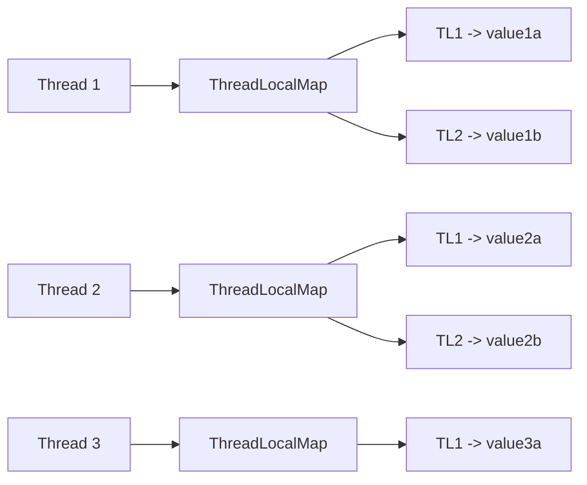
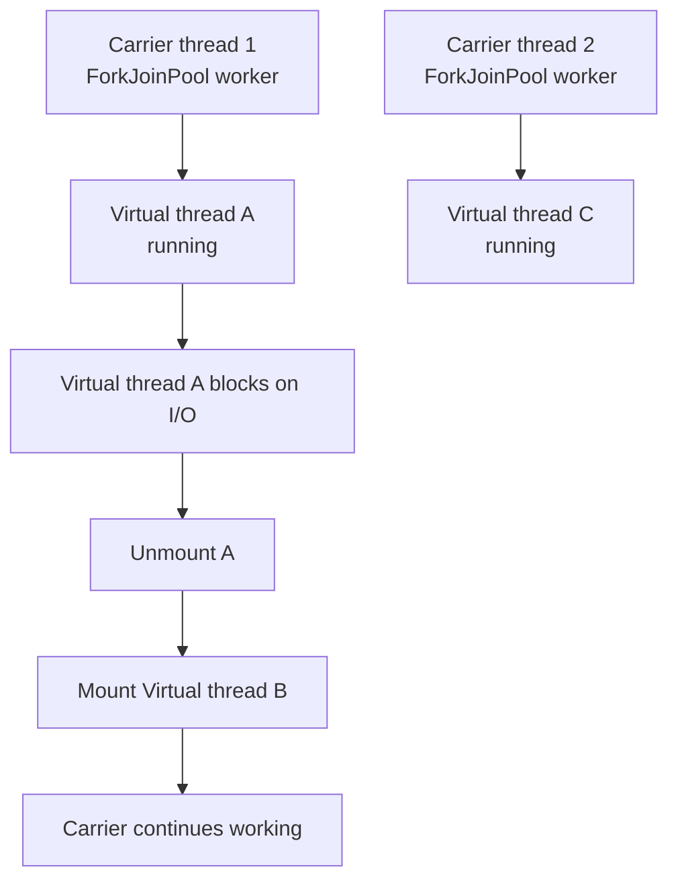

# ThreadLocal and Virtual Threads

## Overview

Java provides two distinct answers to the question of how to manage per-thread state and how to scale to millions of concurrent tasks. `ThreadLocal`, present since Java 1.2, gives each thread its own copy of a variable, eliminating contention for shared mutable state. Virtual threads, introduced as a stable feature in Java 21, are lightweight threads managed by the JVM that allow one virtual thread per task without the memory cost of platform threads.

This note covers both in depth. We will explore `ThreadLocal` semantics, the `InheritableThreadLocal` variant, memory leaks caused by thread pools, the new `ScopedValue` alternative (Java 21+ preview), and then dive into virtual threads: their internal architecture, carrier threads, the critical concept of pinning, when to use virtual threads and when not to, and the migration path from platform threads to virtual threads.

## Background Knowledge

Before reading this note, you should be comfortable with:

- Platform threads, the thread lifecycle, and the cost of thread creation.
- Thread pools and the `ExecutorService` interface.
- The Java Memory Model, particularly visibility and happens-before.

`ThreadLocal` solves a different problem from synchronization. Synchronization coordinates access to shared state; `ThreadLocal` avoids sharing altogether by giving each thread its own copy. Virtual threads, on the other hand, change the cost model of threads themselves. A platform thread is a thin wrapper around an OS thread, consuming roughly 1 MB of stack; a virtual thread is a JVM-managed construct consuming a few hundred bytes, allowing millions to coexist.

## ThreadLocal

### The Basics

`ThreadLocal<T>` provides a variable whose value differs from thread to thread. Each thread that reads or writes the variable has its own independently initialized copy.

```java
private static final ThreadLocal<SimpleDateFormat> dateFormat =
    ThreadLocal.withInitial(() -> new SimpleDateFormat("yyyy-MM-dd"));

public String format(Date date) {
    return dateFormat.get().format(date);
}
```

`SimpleDateFormat` is famously not thread-safe; rather than synchronizing access or creating a new formatter per call, you can give each thread its own instance. The first call to `get` on each thread invokes the supplier; subsequent calls return the cached value.

### How ThreadLocal Works

Each `Thread` object has a field `ThreadLocalMap threadLocals`, which is a custom hash map mapping `ThreadLocal` instances to their values. The map uses the `ThreadLocal` instance itself as the key, by reference identity rather than `equals`.



This design means that `ThreadLocal` lookups are fast (no contention, hash into a per-thread map), and that the lifetime of the value is tied to the thread, not to the `ThreadLocal` instance.

### Common Use Cases

- **Per-thread formatters**: `SimpleDateFormat`, `DecimalFormat`, and other non-thread-safe utility objects.
- **Per-thread transactions or connections**: in frameworks like Spring and Hibernate, the current transaction and Hibernate session are stored in `ThreadLocal`, so all DAOs in the same request share them without explicit passing.
- **Per-thread user context**: the authenticated user, request ID, or tenant ID for the current request, propagated through deep call stacks without parameter pollution.
- **Per-thread random number generators**: `ThreadLocalRandom.current()` is faster than `Random` because it avoids contention on the shared `AtomicLong` seed.

### InheritableThreadLocal

`InheritableThreadLocal` is a variant whose value is inherited by child threads. When a thread is created, it copies the parent's `InheritableThreadLocal` values into its own map.

```java
private static final InheritableThreadLocal<String> requestId =
    new InheritableThreadLocal<>();

public void handleRequest(String id) {
    requestId.set(id);
    // Child threads inherit the value.
    new Thread(() -> process()).start();
}

public void process() {
    System.out.println(requestId.get());  // prints the parent's value
}
```

The catch: inheritance happens only at thread creation time, not on every access. With thread pools, worker threads are created once and reused, so they inherit the values of whatever request happened to be running when the worker was first created. This is the source of many subtle bugs.

### ThreadLocal and Thread Pools: The Memory Leak

When you put a value in a `ThreadLocal` and the thread belongs to a pool, the value persists for the lifetime of the thread, not the lifetime of the request. After the request finishes, the worker returns to the pool with the `ThreadLocal` value still attached.

```java
executor.submit(() -> {
    userContext.set(currentUser);
    doWork();
    // userContext is not cleared; the next request on this
    // worker thread will see the stale value, or worse, the
    // value will keep the user object alive, causing a leak.
});
```

The fix is to clear `ThreadLocal` values in a `finally` block:

```java
executor.submit(() -> {
    try {
        userContext.set(currentUser);
        doWork();
    } finally {
        userContext.remove();
    }
});
```

This is easy to forget. Frameworks like Spring and Servlet containers clear `ThreadLocal` values between requests; if you write your own thread-pool-based service, you must do the same.

### The ClassLoader Leak

A particularly insidious leak occurs in application servers that hot-deploy applications. Each application has its own `ClassLoader`, and the application's `ThreadLocal` values are instances of classes loaded by that `ClassLoader`. If a thread pool in the container holds a `ThreadLocal` value of an application class, the `ClassLoader` cannot be garbage-collected, even after the application is undeployed. The result is the dreaded `OutOfMemoryError: Metaspace`.

The fix is the same: clear `ThreadLocal` values when the request finishes.

### Performance Characteristics

`ThreadLocal.get` and `set` are fast: typically a few nanoseconds, because they access a per-thread map without contention. The map's hash function is the identity hash of the `ThreadLocal` instance, and the map uses linear probing, so collisions are rare. There is no `ThreadLocalRandom`-style contention because there is no shared state.

The cost is mostly in memory: each thread carries its own copy of every `ThreadLocal` value, which can add up if you have many threads and many `ThreadLocal`s.

## ScopedValue: The Modern Alternative (Java 21+ Preview)

`ScopedValue` is a preview feature in Java 21 (finalized in Java 24+) that addresses the shortcomings of `ThreadLocal`. It is designed for bounded, immutable, inheritable values that are automatically cleared when the scope exits.

```java
private static final ScopedValue<String> USERID = ScopedValue.newInstance();

public void handleRequest(String userId) {
    ScopedValue.where(USERID, userId).run(() -> {
        // USERID is bound for the duration of run.
        // Child threads started inside run inherit it.
        process();
        // After run returns, USERID is automatically unbound.
    });
}

public void process() {
    String id = USERID.get();  // retrieves the bound value
}
```

Advantages over `ThreadLocal`:

- **Bounded lifetime**: the binding is automatically cleared when the scope exits, eliminating the leak problem.
- **Immutability**: a `ScopedValue` cannot be reassigned within its scope, which makes it easier to reason about.
- **Inheritance with virtual threads**: child virtual threads started inside the scope inherit the binding, and the binding is automatically cleaned up when they finish.

`ScopedValue` is the recommended replacement for `ThreadLocal` in new code that targets Java 21+, especially when combined with virtual threads and structured concurrency. As of Java 21 it is a preview feature, so you must enable it with `--enable-preview`.

## Virtual Threads

### The Problem They Solve

The platform thread model has dominated Java concurrency since 1.0, but it has a fundamental scaling limit: each platform thread consumes roughly 1 MB of stack, so a JVM can support at most a few thousand platform threads before memory is exhausted. For I/O-bound workloads (HTTP handlers, database calls, file operations), this limit is the primary scalability bottleneck: even though the CPU could handle more concurrent work, you cannot create enough threads to express the concurrency.

The traditional solution has been reactive programming: instead of one thread per request, you use a small pool of threads and asynchronous APIs (callbacks, `CompletableFuture`, reactive streams). This works but produces complex code that is hard to read and debug.

Virtual threads offer a third path: millions of threads, each with a small footprint, that can be written in the simple synchronous style of one-thread-per-request.

### What is a Virtual Thread?

A virtual thread is a thread that is scheduled by the JVM rather than the operating system. It is implemented as a continuation: a runnable chunk of code that can be suspended and resumed. When a virtual thread blocks on I/O, the JVM unmounts it from its carrier thread and mounts another ready virtual thread, keeping the carrier thread busy.



The carrier threads are platform threads in a `ForkJoinPool` with `Runtime.getRuntime().availableProcessors()` threads (by default). The JVM multiplexes millions of virtual threads onto this small pool.

### Creating Virtual Threads

There are several ways to create a virtual thread.

#### Direct creation

```java
Thread vt = Thread.startVirtualThread(() -> {
    System.out.println("Hello from a virtual thread");
});
```

#### Using a builder

```java
Thread vt = Thread.ofVirtual()
    .name("request-", 0)
    .start(() -> handleRequest());
```

#### Using an executor

```java
try (var executor = Executors.newVirtualThreadPerTaskExecutor()) {
    // Each submitted task runs on its own virtual thread.
    executor.submit(() -> handleRequest());
    executor.submit(() -> handleRequest());
}
```

The `newVirtualThreadPerTaskExecutor` is the recommended way to use virtual threads for request-handling workloads. There is no thread pool in the traditional sense: each task gets its own virtual thread, and the carrier pool handles multiplexing.

### Carrier Threads

A carrier thread is a platform thread that runs virtual threads. Carriers live in a shared `ForkJoinPool` whose parallelism is `Runtime.getRuntime().availableProcessors()` (or the value of `jdk.virtualThreadScheduler.parallelism` system property). You can configure this with `-Djdk.virtualThreadScheduler.parallelism=N`.

Carriers are invisible to application code: you cannot obtain a reference to them, and they do not appear in thread dumps by name (they appear as `ForkJoinPool-1-worker-N`). The `Thread.currentThread()` call inside a virtual thread returns the virtual thread, not the carrier.

### Pinning: When Virtual Threads Cannot Unmount

Pinning is the most important concept to understand about virtual threads. A virtual thread is "pinned" to its carrier when it cannot unmount. While pinned, the carrier is blocked, just as if it were a platform thread. Pinning defeats the entire purpose of virtual threads.

Pinning occurs in two situations:

1. **Blocking on a `synchronized` block or method**: the JVM cannot unmount a virtual thread that holds an intrinsic lock, because the lock is owned by the carrier thread. If the virtual thread blocks inside `synchronized` (e.g., on I/O or `Object.wait`), the carrier is blocked too.

2. **JNI native frames**: a virtual thread executing a native method cannot be unmounted because the JVM cannot move the native stack.

#### Detecting Pinning

The JVM can emit events when a virtual thread is pinned. Enable them with:

```bash
-Djdk.tracePinnedThreads=full       # full stack trace
-Djdk.tracePinnedThreads=short      # abbreviated
```

When a pinned thread blocks, you will see a message like:

```
VirtualThread[#123]/runnable@ForkJoinPool-1-worker-1
    java.base/java.lang.VirtualThread$VThreadContinuation.onPinned(...)
    ...
    com.example.MyService.synchronizedBlockingIO(MyService.java:42)
```

#### Fixing Pinning

The fix is to replace `synchronized` with `ReentrantLock`:

```java
// Bad: virtual thread may pin if it blocks inside this method.
public synchronized String fetch() {
    return doBlockingIO();
}

// Good: ReentrantLock allows the virtual thread to unmount.
private final ReentrantLock lock = new ReentrantLock();

public String fetch() {
    lock.lock();
    try {
        return doBlockingIO();
    } finally {
        lock.unlock();
    }
}
```

`ReentrantLock` is implemented with `LockSupport.park`, which the JVM knows how to unmount. The same is true for `BlockingQueue`, `CompletableFuture`, and the rest of `java.util.concurrent`.

In Java 21, this is the main migration concern when adopting virtual threads: any `synchronized` block that may block on I/O must be replaced with `ReentrantLock`. Future Java releases may fix this at the JVM level (project Lilliput), but in Java 21 you must do it manually.

### When to Use Virtual Threads

Virtual threads are appropriate for I/O-bound workloads where you want one-thread-per-task semantics:

- HTTP request handlers
- Database queries
- File operations
- Network calls
- Message queue consumers

For each of these, the request handler spends most of its time blocked on I/O, and a virtual thread can be parked cheaply while waiting, freeing the carrier to handle other requests.

### When NOT to Use Virtual Threads

Virtual threads are not a silver bullet. They are inappropriate for:

1. **CPU-bound work**: a virtual thread running a tight loop occupies its carrier just as much as a platform thread. Use a regular `ForkJoinPool` or `Stream.parallel()` instead.

2. **Long-held intrinsic locks**: as discussed above, `synchronized` blocks that hold for long durations pin the carrier.

3. **Long-running native calls**: JNI calls that take seconds cannot be unmounted.

4. **ThreadLocal-heavy code with platform assumptions**: code that expects a small number of platform threads (e.g., a fixed-size pool) may behave unexpectedly with millions of virtual threads. Each virtual thread has its own `ThreadLocal` map, which can blow up memory if you use `ThreadLocal` for large objects.

5. **Pinned carrier pool with CPU-bound work mixed with I/O-bound work**: if your CPU-bound work runs on the same carrier pool as I/O-bound virtual threads, the carriers may all be busy with CPU work, and the I/O-bound virtual threads cannot be scheduled. The fix is to run CPU-bound work on a separate executor.

### Migration Path

For most applications, migration to virtual threads is straightforward:

1. Replace `Executors.newFixedThreadPool(N)` with `Executors.newVirtualThreadPerTaskExecutor()` in your request handler.
2. Audit your code for `synchronized` blocks that may block on I/O and replace them with `ReentrantLock`.
3. Audit `ThreadLocal` usage: large objects stored in `ThreadLocal` will be replicated per virtual thread, which can exhaust memory.
4. Test under load, looking for pinned thread warnings.

You do not need to change anything else. The rest of `java.util.concurrent` (locks, atomics, concurrent collections) works identically with virtual threads.

### The Cost Model

A virtual thread consumes a few hundred bytes for its continuation and stack. The stack grows on demand, so a virtual thread that calls only shallow methods uses less memory than one that recurses deeply. You can create millions of virtual threads in a single JVM, limited mainly by heap size.

The cost of creating a virtual thread is similar to the cost of creating a small object: a few microseconds. This is why the `newVirtualThreadPerTaskExecutor` does not pool virtual threads: there is no benefit to reusing them.

### Semantics

Virtual threads have the same semantics as platform threads in every way that matters:

- They have the same lifecycle states.
- They support interrupts.
- They have `ThreadLocal` maps (and the same leak problems).
- They have `UncaughtExceptionHandler`.
- They can be daemon or non-daemon (they are daemon by default, which is appropriate for request handlers).
- They participate in the JMM: the same happens-before rules apply.

The only differences are scheduling (JVM-scheduled vs OS-scheduled) and footprint (small vs large). Everything you learned about threads, locks, atomics, and the memory model applies equally.

### A Complete Example

```java
import java.util.concurrent.*;
import java.time.Duration;

public class VirtualThreadDemo {

    public static void main(String[] args) throws Exception {
        long start = System.nanoTime();

        try (var executor = Executors.newVirtualThreadPerTaskExecutor()) {
            // Submit 10,000 tasks, each of which makes a simulated HTTP call.
            var futures = new java.util.ArrayList<Future<String>>();
            for (int i = 0; i < 10000; i++) {
                final int id = i;
                futures.add(executor.submit(() -> fetchUser(id)));
            }

            // Wait for all of them.
            for (Future<String> f : futures) {
                f.get();
            }
        }

        long elapsed = (System.nanoTime() - start) / 1000000;
        System.out.println("All done in " + elapsed + "ms");
    }

    // Simulated HTTP call: blocks for 500ms.
    private static String fetchUser(int id) throws Exception {
        Thread.sleep(500);
        return "user-" + id;
    }
}
```

With platform threads, this would either need 10,000 threads (10 GB of stack) or a small pool with serialized execution (taking 10,000 * 500ms = 5,000 seconds). With virtual threads, all 10,000 run concurrently, and the total elapsed time is roughly 500ms plus a small overhead.

## Common Pitfalls

### Forgetting to remove ThreadLocal values in thread pools

After a worker thread finishes a request, the `ThreadLocal` value remains. The next request on the same worker sees the stale value, and large values can cause memory leaks. Always `remove()` in a `finally` block.

### Assuming InheritableThreadLocal works with thread pools

It does not, because inheritance happens at thread creation time, not at request submission time. Workers in a pool inherit the values of whatever request happened to be running when they were first created.

### Using synchronized for blocking I/O with virtual threads

This pins the carrier, defeating the purpose of virtual threads. Use `ReentrantLock` instead.

### Creating too many virtual threads without backpressure

Virtual threads are cheap, but the resources they consume (file descriptors, database connections) are not. A million virtual threads each opening a database connection will exhaust the connection pool and likely the database. Use `Semaphore` or a bounded queue to limit concurrency at resource boundaries.

### Storing large objects in ThreadLocal with virtual threads

Each virtual thread has its own `ThreadLocal` map. A large `ThreadLocal` value multiplied by millions of virtual threads can exhaust memory. Prefer passing context explicitly or use `ScopedValue`.

### Mixing CPU-bound and I/O-bound work on the same carrier pool

CPU-bound virtual threads occupy their carriers, starving I/O-bound virtual threads. Run CPU-bound work on a separate `ForkJoinPool`.

### Calling Thread.currentThread() to make decisions

Code that uses `Thread.currentThread().isVirtual()` to make decisions is usually doing something wrong. The semantics should be the same regardless of thread type.

### Assuming virtual threads are faster for CPU-bound work

They are not. Virtual threads are about scaling I/O-bound work, not making CPU-bound work faster. A CPU-bound virtual thread is no faster than a platform thread, and may be slightly slower due to the unmounting overhead.

## Tips and Tricks

### Use newVirtualThreadPerTaskExecutor as the default for request handlers

The simplest pattern:

```java
try (var executor = Executors.newVirtualThreadPerTaskExecutor()) {
    for (Request r : requests) {
        executor.submit(() -> handle(r));
    }
}
```

This is the recommended pattern for HTTP handlers, message consumers, and other I/O-bound workloads.

### Replace synchronized with ReentrantLock when migrating to virtual threads

Use `-Djdk.tracePinnedThreads=short` during testing to find pinned threads, then replace `synchronized` with `ReentrantLock` in those locations.

### Use ScopedValue for per-request context

`ScopedValue` is the modern, leak-free alternative to `ThreadLocal` for per-request context:

```java
private static final ScopedValue<User> CURRENTUSER = ScopedValue.newInstance();

public void handle(Request req) {
    User user = authenticate(req);
    ScopedValue.where(CURRENTUSER, user).run(() -> process(req));
}
```

### Use Semaphore to bound resource access

```java
private final Semaphore dbLimit = new Semaphore(100);

public Data query(String sql) throws InterruptedException {
    dbLimit.acquire();
    try {
        return db.query(sql);
    } finally {
        dbLimit.release();
    }
}
```

This pattern lets you have millions of virtual threads but limits concurrent database queries to 100.

### Audit ThreadLocal usage before migrating

Search for `ThreadLocal` usages and ensure none store large objects. If they do, replace with `ScopedValue` or pass context explicitly.

### Profile with jfr to find pinned threads

JDK Flight Recorder records pinning events. Enable it during load testing:

```bash
jcmd <pid> JFR.start duration=60s filename=/tmp/vt.jfr settings=profile
```

Then analyze with JDK Mission Control.

### Use Stream.toList with virtual threads for fan-out

```java
try (var executor = Executors.newVirtualThreadPerTaskExecutor()) {
    List<Future<Data>> futures = ids.stream()
        .map(id -> executor.submit(() -> fetch(id)))
        .toList();
    for (Future<Data> f : futures) {
        process(f.get());
    }
}
```

This pattern, called fan-out and gather, is clean and efficient with virtual threads. The next note covers a more structured version using `StructuredTaskScope`.

### Prefer structured concurrency for short-lived fan-out

For fan-out workloads where you want all child threads to be cancelled if any fails, use `StructuredTaskScope`. It is covered in the next note.

## Interview Questions

### Q1: What is ThreadLocal and when would you use it?

`ThreadLocal` provides a variable whose value differs from thread to thread. Each thread has its own independently initialized copy. Use it for per-thread state like formatters, transactions, or request context, where the alternative would be to pass the state through every method call or to share and synchronize.

### Q2: How does ThreadLocal work internally?

Each `Thread` object has a `ThreadLocalMap threadLocals` field, which is a custom hash map from `ThreadLocal` instances to values. The map uses the `ThreadLocal` instance itself as the key (by reference identity). `get` and `set` access this per-thread map without contention.

### Q3: What is InheritableThreadLocal?

A variant of `ThreadLocal` whose value is inherited by child threads at thread creation time. The child copies the parent's `InheritableThreadLocal` values into its own map. The catch: inheritance happens only at creation, so it does not work correctly with thread pools, where workers are created once and reused.

### Q4: What is the ThreadLocal memory leak with thread pools?

When a worker thread finishes a request, its `ThreadLocal` values are not automatically cleared. The next request on the same worker sees the stale value, and large values can cause memory leaks. The fix is to call `ThreadLocal.remove()` in a `finally` block.

### Q5: What is ScopedValue and how does it differ from ThreadLocal?

`ScopedValue` is a Java 21+ preview feature that provides bounded, immutable, inheritable values. The binding is automatically cleared when the scope exits, eliminating the leak problem. It is immutable within its scope, making it easier to reason about. It is the recommended replacement for `ThreadLocal` in new code, especially with virtual threads.

### Q6: What is a virtual thread?

A thread scheduled by the JVM rather than the operating system. It is implemented as a continuation that can be suspended and resumed, and is mounted on a carrier thread from a small `ForkJoinPool`. Virtual threads have a small footprint (a few hundred bytes) and can number in the millions.

### Q7: What is a carrier thread?

A platform thread in a shared `ForkJoinPool` that runs virtual threads. The carrier pool has `Runtime.getRuntime().availableProcessors()` threads by default. Carriers are invisible to application code: `Thread.currentThread()` inside a virtual thread returns the virtual thread, not the carrier.

### Q8: What is pinning?

Pinning is when a virtual thread cannot be unmounted from its carrier. While pinned, the carrier is blocked, defeating the purpose of virtual threads. Pinning occurs when a virtual thread blocks inside a `synchronized` block or executes a native method.

### Q9: How do you detect pinning?

Enable `-Djdk.tracePinnedThreads=short` or `-Djdk.tracePinnedThreads=full`. The JVM prints a stack trace when a virtual thread is pinned while blocking. JDK Flight Recorder also records pinning events.

### Q10: How do you fix pinning?

Replace `synchronized` with `ReentrantLock`. `ReentrantLock` uses `LockSupport.park`, which the JVM knows how to unmount. The same is true for `BlockingQueue`, `CompletableFuture`, and the rest of `java.util.concurrent`.

### Q11: When should you use virtual threads?

For I/O-bound workloads where you want one-thread-per-task semantics: HTTP handlers, database queries, file operations, network calls, message queue consumers. Each task spends most of its time blocked on I/O, and a virtual thread can be parked cheaply while waiting.

### Q12: When should you NOT use virtual threads?

For CPU-bound work (use a regular `ForkJoinPool` or parallel streams), for code that holds intrinsic locks for long durations, for long-running native calls, and for code that uses `ThreadLocal` heavily with large objects (each virtual thread has its own map, which can exhaust memory).

### Q13: How do you create a virtual thread?

`Thread.startVirtualThread(runnable)`, or `Thread.ofVirtual().start(runnable)`, or `Executors.newVirtualThreadPerTaskExecutor().submit(runnable)`. The last is the recommended pattern for request handlers.

### Q14: Are virtual threads faster than platform threads?

For I/O-bound workloads with many concurrent tasks, virtual threads enable higher throughput because they allow more concurrent tasks to run on the same hardware. For a single task, a virtual thread is no faster than a platform thread, and may be slightly slower due to unmounting overhead. The benefit is scaling, not single-task performance.

### Q15: How do virtual threads interact with the Java Memory Model?

Identically to platform threads. The same happens-before rules apply. All `java.util.concurrent` primitives (locks, atomics, concurrent collections) work identically with virtual threads.

## Summary

`ThreadLocal` and virtual threads solve two different problems in Java concurrency. `ThreadLocal` provides per-thread state, eliminating the need to share mutable state when each thread needs its own copy. Its weakness is the memory leak with thread pools: values persist for the lifetime of the thread, not the request, and must be cleared manually in a `finally` block. `InheritableThreadLocal` is a fragile variant that does not work correctly with thread pools. `ScopedValue` (Java 21+ preview) is the modern, leak-free alternative.

Virtual threads, introduced as a stable feature in Java 21, change the cost model of threads. A virtual thread is a JVM-scheduled continuation mounted on a carrier thread from a small `ForkJoinPool`. They consume a few hundred bytes each, allowing millions to coexist. They are appropriate for I/O-bound workloads where you want one-thread-per-task semantics without the complexity of reactive programming.

The most important concept to understand about virtual threads is pinning: a virtual thread is pinned when it blocks inside a `synchronized` block or executes a native method, and the carrier is blocked while the virtual thread is pinned. The fix is to replace `synchronized` with `ReentrantLock` in code that may block. The `-Djdk.tracePinnedThreads` flag and JDK Flight Recorder help find pinned threads during testing.

Virtual threads are not a silver bullet. They are inappropriate for CPU-bound work, for code that holds intrinsic locks for long durations, and for `ThreadLocal`-heavy code. They also do not eliminate the need for backpressure at resource boundaries: a million virtual threads each opening a database connection will still exhaust the connection pool. Use `Semaphore` or a bounded queue to limit concurrency where appropriate.

Together with structured concurrency, covered in the next note, virtual threads complete Java's modern concurrency story: simple, synchronous code that scales to millions of concurrent tasks, with the same semantics as the platform threads you already know.
