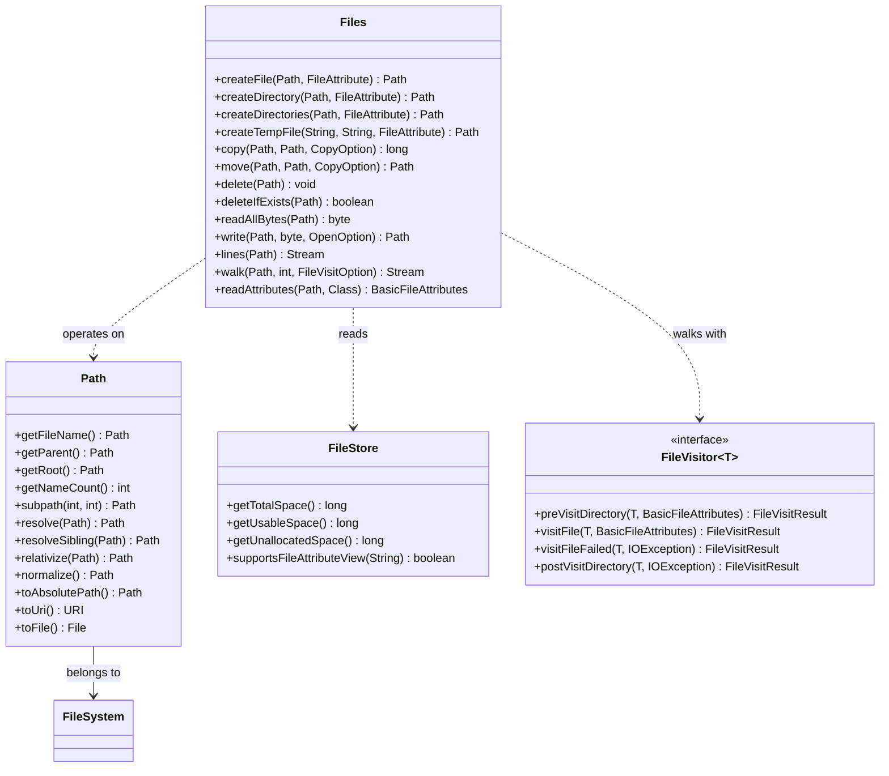
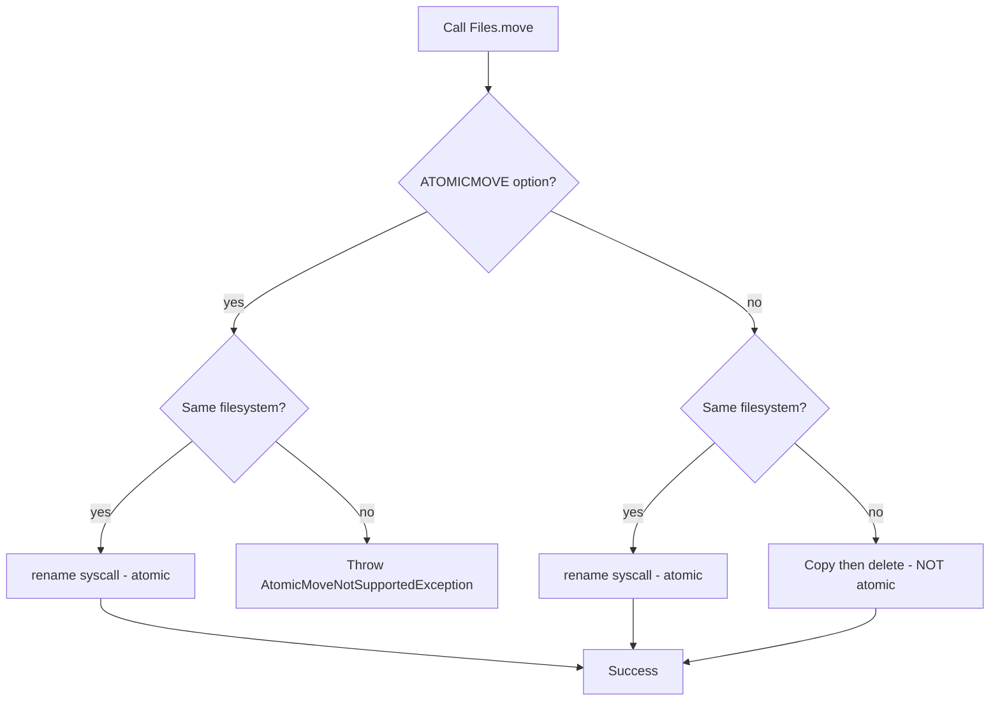

# File and Directory Operations

## Overview

Almost every Java application eventually needs to interact with the file system. Whether you are reading configuration, writing audit logs, processing large data sets, or deploying artifacts, you need a reliable, platform-independent, and observable way to manipulate files and directories. Java offers two parallel APIs for this purpose. The legacy `java.io.File` class has been part of the platform since version 1.0 and is still common in older code bases, but it suffers from a long list of well-known defects. The modern `java.nio.file` package, introduced in Java 7 as part of NIO.2, replaces `File` with the `Path` interface and the `Files` utility class. These two types together provide a fluent, consistent, exception-aware, and feature-rich API that should be the default choice for all new code.

This note covers the full landscape of file and directory operations in Java 21. We begin with the historical `java.io.File` class so you can read and refactor existing code. We then move to the modern `Path` and `Files` API and explore how to create, copy, move, delete, and inspect files and directories. We discuss file attributes (basic, POSIX, DOS, ACL, and owner), symbolic links, hard links, temporary files, directory walking with `Files.walk` and `Files.find`, the `FileVisitor` callback contract, atomic moves, copy options, and error handling. We finish with the `FileStore` API for partition-level information and a thorough comparison of the two APIs. By the end of this note you should be able to confidently choose the right tool, reason about atomicity guarantees, and avoid the most common pitfalls such as failing to close streams, ignoring symbolic links, and mishandling exceptions inside directory trees.

## Background Knowledge

Before reading this note you should be comfortable with the following prerequisite topics from earlier phases of this roadmap:

- Java exceptions and the try-with-resources construct introduced in Phase 5. File operations almost always throw `IOException` (a checked exception), so you must understand how to handle, chain, and propagate these exceptions correctly.
- The `AutoCloseable` interface and try-with-resources. Every file handle, directory stream, and input/output stream in the JDK implements `AutoCloseable`, and forgetting to close a resource is one of the most common causes of file descriptor leaks.
- The difference between a process and a file descriptor. On Linux, each process has a soft limit (`ulimit -n`) on the number of open file descriptors. If your code opens thousands of files without closing them, you will eventually hit `Too many open files` errors.
- File system concepts such as inodes, hard links, symbolic links, directories, and permissions. Java abstracts these but you must understand the underlying model to reason about correctness.

A path on disk is a string that locates a file or directory. A path can be absolute (starting from the root, such as `/etc/passwd` on Unix or `C:\Windows\System32` on Windows) or relative (interpreted against the current working directory, such as `./config/app.properties`). Java's `Path` interface abstracts over both Unix and Windows path syntaxes so that the same code works on both platforms. The operating system kernel is the ultimate arbiter of file system operations: Java only translates your calls into POSIX system calls (`open`, `read`, `write`, `close`, `stat`, `unlink`, `rename`) or their Windows equivalents.

## The Legacy java.io.File Class

The `java.io.File` class represents an abstract pathname. It has been the workhorse for file operations since Java 1.0, and you will still find it in many production code bases. Despite being deprecated in spirit, it is not actually annotated `@Deprecated` because too much existing code depends on it.

```java
import java.io.File;

public class LegacyFileDemo {
    public static void main(String[] args) {
        File file = new File("config/app.properties");

        // Existence and type checks.
        boolean exists = file.exists();
        boolean isFile = file.isFile();
        boolean isDir  = file.isDirectory();

        // Metadata.
        long length = file.length();
        long lastModified = file.lastModified(); // millis since epoch
        boolean canRead = file.canRead();
        boolean canWrite = file.canWrite();
        boolean canExecute = file.canExecute();

        // Operations.
        boolean created = file.mkdirs();      // create directory and parents
        boolean renamed = file.renameTo(new File("config/app.bak"));
        boolean deleted = file.delete();
    }
}
```

The `File` class has several well-known limitations that motivated the design of NIO.2:

1. **Poor error reporting.** Most methods return a boolean instead of throwing. If `delete()` returns `false`, you have no idea whether the file did not exist, whether you lacked permission, or whether the file was locked by another process. The modern `Files.delete` throws `NoSuchFileException`, `DirectoryNotEmptyException`, `AccessDeniedException`, and so on, each of which is a subclass of `IOException`.
2. **No attribute bulk read.** Each attribute requires a separate system call. The modern `Files.readAttributes` reads all basic attributes in a single `stat` call, which matters when you walk large directory trees.
3. **No symbolic link support.** The `File` class has no concept of symbolic links. `File.delete` on a symlink follows the link and may delete the target rather than the link itself, which is a security hazard.
4. **No atomic move across filesystems.** `renameTo` may fail silently when the source and target are on different filesystems.
5. **Inconsistent metadata.** The `lastModified` method returns a `long` milliseconds value, but on some filesystems the actual precision is seconds. Modern `FileTime` carries nanosecond precision when the platform supports it.
6. **Race conditions.** Between an `exists` check and a subsequent `createNewFile`, another process may create the file. The modern `Files.createFile` is atomic on most platforms.
7. **Synchronous directory listing.** `File.list` returns a `String[]` of all entries at once. For very large directories this can be expensive. The modern `DirectoryStream` is lazy and iterable.

Despite these limitations, you should still recognise `File` when you see it in older code. The `File.toPath()` and `Path.toFile()` bridge methods allow interoperation between the two APIs.

## The Modern Path Interface

The `java.nio.file.Path` interface is the central abstraction of NIO.2. A `Path` is an immutable sequence of name elements separated by a platform-specific separator (`/` on Unix, `\` on Windows). You obtain a `Path` through the `Path.of` factory method, which was introduced in Java 11 to replace the more verbose `Paths.get`.

```java
import java.nio.file.Path;

public class PathDemo {
    public static void main(String[] args) {
        Path absolute = Path.of("/etc/passwd");
        Path relative = Path.of("config", "app.properties");
        Path home     = Path.of(System.getProperty("user.home"));

        // Name element access.
        System.out.println("Name count: " + absolute.getNameCount());
        System.out.println("Filename: "   + absolute.getFileName());
        System.out.println("Parent: "     + absolute.getParent());
        System.out.println("Root: "       + absolute.getRoot());

        // Sub-path.
        Path sub = absolute.subpath(0, 2); // etc, passwd -> "etc/passwd"

        // Resolution against a base.
        Path base = Path.of("/var/log");
        Path resolved = base.resolve("app/server.log"); // /var/log/app/server.log
        Path sibling  = base.resolveSibling("app2");    // /var/app2

        // Normalisation removes redundant . and .. elements.
        Path messy = Path.of("/var/log/../log/./server.log");
        Path clean = messy.normalize(); // /var/log/server.log

        // Relativisation computes the path from one location to another.
        Path from = Path.of("/var/log");
        Path to   = Path.of("/var/log/app/server.log");
        Path rel  = from.relativize(to); // app/server.log

        // Conversion.
        java.net.URI uri = absolute.toUri();
        File file = absolute.toFile();
    }
}
```

The most important `Path` operations to memorise are `resolve`, `resolveSibling`, `normalize`, `relativize`, and `toAbsolutePath`. Resolution joins a base path with a partial path. Normalisation collapses `.` and `..` segments. Relativisation answers the question, "If I am standing at path A, what is the relative path to path B?" Relativization requires both paths to be either absolute or relative; mixing them throws `IllegalArgumentException`.

## The Files Utility Class

While `Path` is a pure data abstraction, the `Files` class is where the actual file system operations live. `Files` is a final utility class with hundreds of static methods. Every method takes a `Path` as its first argument and most throw `IOException` (or a subclass) on failure. The following code shows the core lifecycle operations.

```java
import java.io.IOException;
import java.nio.file.*;
import java.nio.file.attribute.FileAttribute;
import java.nio.file.attribute.PosixFilePermission;
import java.nio.file.attribute.PosixFilePermissions;
import java.util.Set;

public class FilesLifecycleDemo {
    public static void main(String[] args) throws IOException {
        Path dir  = Path.of("work/input");
        Path file = dir.resolve("data.txt");

        // Creating directories. createDirectories is idempotent in spirit but
        // throws FileAlreadyExistsException if the path exists as a regular file.
        Files.createDirectories(dir);

        // Creating an empty file with POSIX permissions.
        Set<PosixFilePermission> perms = PosixFilePermissions.fromString("rw-r-----");
        FileAttribute<Set<PosixFilePermission>> attr = PosixFilePermissions.asFileAttribute(perms);
        if (!Files.exists(file)) {
            Files.createFile(file, attr);
        }

        // Writing bytes. The second argument is a varargs of OpenOption.
        Files.write(file, "Hello, NIO.2\n".getBytes(),
                StandardOpenOption.CREATE, StandardOpenOption.TRUNCATEEXISTING, StandardOpenOption.WRITE);

        // Appending.
        Files.write(file, "Second line\n".getBytes(), StandardOpenOption.APPEND);

        // Reading all bytes (only for small files!).
        byte[] allBytes = Files.readAllBytes(file);
        System.out.println(new String(allBytes));

        // Reading all lines.
        var lines = Files.readAllLines(file);
        lines.forEach(System.out::println);

        // Streaming lines (lazy, memory-friendly).
        try (var stream = Files.lines(file)) {
            stream.filter(s -> s.startsWith("Second"))
                  .forEach(System.out::println);
        }

        // Copying with options.
        Path backup = dir.resolve("data.bak");
        Files.copy(file, backup, StandardCopyOption.REPLACEEXISTING, StandardCopyOption.COPYATTRIBUTES);

        // Moving. ATOMICMOVE is required for cross-process coordination.
        Path archive = dir.resolve("data.archived");
        Files.move(file, archive, StandardCopyOption.ATOMICMOVE, StandardCopyOption.REPLACEEXISTING);

        // Deleting.
        Files.deleteIfExists(archive);
        Files.deleteIfExists(backup);
        Files.deleteIfExists(file);
        Files.deleteIfExists(dir);
    }
}
```

Several points in this example deserve elaboration. First, `Files.write` accepts `OpenOption` varargs that control whether the file is created, truncated, appended, or synchronized. The default is `CREATE`, `TRUNCATEEXISTING`, and `WRITE`. Second, `Files.copy` accepts `StandardCopyOption` values: `REPLACEEXISTING`, `COPYATTRIBUTES`, and `NOFOLLOWLINKS`. Without `REPLACEEXISTING`, copying to an existing target throws `FileAlreadyExistsException`. Third, `Files.move` accepts `ATOMICMOVE`, which is essential when multiple processes may race on the same target file. Without `ATOMICMOVE`, the move may be implemented as copy-and-delete, which is non-atomic and can fail mid-way. Fourth, `Files.readAllBytes` and `Files.readAllLines` load the entire file into memory; never use them on untrusted or extremely large inputs.

## File Attributes

NIO.2 introduced a uniform attribute model based on the `FileAttribute` and `BasicFileAttributes` interfaces. The most common views are `basic`, `posix`, `dos`, `owner`, and `acl`. Each view corresponds to a `FileAttributeView` subclass that exposes attributes through a `String`-based naming convention. The `Files.getAttribute` and `Files.setAttribute` methods allow generic access using a `viewName:attributeName` syntax.

```java
import java.io.IOException;
import java.nio.file.*;
import java.nio.file.attribute.*;
import java.time.Instant;

public class AttributeDemo {
    public static void main(String[] args) throws IOException {
        Path file = Path.of("work/attr-demo.txt");
        Files.createDirectories(file.getParent());
        Files.writeString(file, "attr demo\n");

        // Single-shot read of all basic attributes (one stat call).
        BasicFileAttributes basic = Files.readAttributes(file, BasicFileAttributes.class);
        System.out.println("Size:           " + basic.size());
        System.out.println("Creation:       " + basic.creationTime());
        System.out.println("Last modified:  " + basic.lastModifiedTime());
        System.out.println("Last access:    " + basic.lastAccessTime());
        System.out.println("Is directory:   " + basic.isDirectory());
        System.out.println("Is regular:     " + basic.isRegularFile());
        System.out.println("Is symlink:     " + basic.isSymbolicLink());
        System.out.println("File key:       " + basic.fileKey()); // inode on Linux

        // POSIX attributes.
        if (Files.getFileStore(file).supportsFileAttributeView("posix")) {
            PosixFileAttributes posix = Files.readAttributes(file, PosixFileAttributes.class);
            System.out.println("Owner: " + posix.owner().getName());
            System.out.println("Group: " + posix.group().getName());
            System.out.println("Perms: " + PosixFilePermissions.toString(posix.permissions()));
        }

        // Updating last-modified time.
        Files.setLastModifiedTime(file, FileTime.from(Instant.now()));

        // Generic attribute access.
        Long size = (Long) Files.getAttribute(file, "size");
        Long size2 = (Long) Files.getAttribute(file, "posix:size"); // explicit view

        // Bulk read via string.
        var attrs = Files.readAttributes(file, "posix:size,lastModifiedTime,owner");
        attrs.forEach((k, v) -> System.out.println(k + " = " + v));
    }
}
```

The decision tree for choosing the right attribute view depends on the platform. POSIX-aware systems expose `posix:*` attributes (owner, group, permissions). Windows exposes `dos:*` attributes (readonly, hidden, system, archive). The `acl:*` view exposes access control lists on both Windows (NTFS) and some Unix filesystems (NFSv4, ZFS). Always check `Files.getFileStore(path).supportsFileAttributeView(name)` before reading non-basic attributes.

## Symbolic and Hard Links

Java 7 added explicit support for symbolic and hard links. A symbolic link is a special file whose content is the path of another file. A hard link is an additional directory entry pointing to the same inode. Creating, reading, and following links is fully under programmer control.

```java
import java.io.IOException;
import java.nio.file.*;

public class LinkDemo {
    public static void main(String[] args) throws IOException {
        Path target = Path.of("work/target.txt");
        Path symlink = Path.of("work/link.txt");
        Path hardlink = Path.of("work/hard.txt");

        Files.createDirectories(target.getParent());
        Files.writeString(target, "content");

        // Create a symbolic link.
        Files.createSymbolicLink(symlink, target);

        // Create a hard link (target must exist).
        Files.createLink(hardlink, target);

        // Read the target of a symlink.
        Path linkTarget = Files.readSymbolicLink(symlink);
        System.out.println("Symlink points to: " + linkTarget);

        // Detecting a symlink.
        boolean isLink = Files.isSymbolicLink(symlink);

        // Resolving the real (no-symlink) path.
        Path real = symlink.toRealPath();

        // Operations that follow vs do not follow the link.
        // Files.size(symlink) follows the link and reports target size.
        long targetSize = Files.size(symlink);
        // To get the link size itself, query attributes with NOFOLLOWLINKS.
        BasicFileAttributes linkAttrs = Files.readAttributes(
                symlink, BasicFileAttributes.class, LinkOption.NOFOLLOWLINKS);
        System.out.println("Link file size: " + linkAttrs.size());
    }
}
```

Most `Files` methods accept an optional `LinkOption...` varargs. The default is to follow symbolic links. Passing `LinkOption.NOFOLLOWLINKS` causes the operation to act on the link itself. This is particularly important for security-sensitive code: a malicious actor may swap a regular file for a symlink between your check and your write, causing you to overwrite an unrelated file. Always use `NOFOLLOWLINKS` when the intent is to operate on the link itself.

## Directory Streams and Walking

For listing a single directory, use `Files.newDirectoryStream`. The returned `DirectoryStream` is `AutoCloseable` and must be used in a try-with-resources block. Unlike `File.list`, it is lazy: only a small buffer of entries is held in memory at any time.

```java
import java.io.IOException;
import java.nio.file.*;

public class DirectoryStreamDemo {
    public static void main(String[] args) throws IOException {
        Path dir = Path.of("work/list-demo");
        Files.createDirectories(dir);
        for (int i = 0; i < 1000; i++) {
            Files.createFile(dir.resolve("file-" + i + ".txt"));
        }

        // Glob-based filtering.
        try (DirectoryStream<Path> ds = Files.newDirectoryStream(dir, "file-1*.txt")) {
            ds.forEach(p -> System.out.println(p.getFileName()));
        }

        // Custom filter.
        DirectoryStream.Filter<Path> biggerThan100Bytes = p ->
                Files.size(p) > 100 && Files.isRegularFile(p);
        try (DirectoryStream<Path> ds = Files.newDirectoryStream(dir, biggerThan100Bytes)) {
            ds.forEach(p -> System.out.println(p.getFileName()));
        }

        // Cleanup.
        try (var stream = Files.walk(dir)) {
            stream.sorted((a, b) -> b.compareTo(a)) // delete children first
                  .forEach(p -> {
                      try { Files.deleteIfExists(p); } catch (IOException e) { /* log */ }
                  });
        }
    }
}
```

For recursive traversal, `Files.walk` returns a `Stream<Path>` that lazily walks the entire subtree. `Files.find` is similar but accepts a `BiPredicate<Path, BasicFileAttributes>` so that filtering can happen during the walk, avoiding unnecessary `stat` calls. Both methods accept a maximum depth argument and a set of `FileVisitOption` values (`FOLLOWLINKS` is the only option).

```java
import java.io.IOException;
import java.nio.file.*;
import java.nio.file.attribute.BasicFileAttributes;

public class WalkDemo {
    public static void main(String[] args) throws IOException {
        Path root = Path.of("work/walk-demo");
        Files.createDirectories(root.resolve("a/b/c"));
        Files.createFile(root.resolve("a/b/c/data.bin"));
        Files.createFile(root.resolve("a/readme.md"));

        // Stream-based walk.
        try (var stream = Files.walk(root)) {
            stream.filter(Files::isRegularFile)
                  .filter(p -> p.toString().endsWith(".md"))
                  .forEach(System.out::println);
        }

        // Find with attributes (avoids extra stat per file).
        try (var stream = Files.find(root, Integer.MAXVALUE,
                (p, a) -> a.isRegularFile() && a.size() > 0)) {
            stream.forEach(System.out::println);
        }

        // Custom visitor with pre-visit, post-visit, and termination control.
        Files.walkFileTree(root, new SimpleFileVisitor<>() {
            @Override
            public FileVisitResult preVisitDirectory(Path dir, BasicFileAttributes attrs) {
                System.out.println("Entering " + dir);
                return FileVisitResult.CONTINUE;
            }
            @Override
            public FileVisitResult visitFile(Path file, BasicFileAttributes attrs) {
                System.out.println("  Visiting " + file.getFileName());
                return FileVisitResult.CONTINUE;
            }
            @Override
            public FileVisitResult visitFileFailed(Path file, IOException exc) {
                System.err.println("Failed: " + file + " due to " + exc);
                return FileVisitResult.CONTINUE; // skip subtree on failure
            }
            @Override
            public FileVisitResult postVisitDirectory(Path dir, IOException exc) {
                System.out.println("Leaving " + dir);
                return FileVisitResult.CONTINUE;
            }
        });
    }
}
```

The `FileVisitor` interface gives you full control over traversal. `preVisitDirectory` is called before any file inside a directory is visited. `visitFile` is called for each file. `visitFileFailed` is called when the file's attributes cannot be read or the file cannot be opened. `postVisitDirectory` is called after all entries have been processed, and receives any exception that occurred during iteration. Returning `FileVisitResult.TERMINATE` stops the walk immediately. Returning `SKIPSUBTREE` (only valid from `preVisitDirectory`) skips the entire subtree. Returning `SKIPSIBLINGS` skips the remaining files in the current directory and any unvisited sibling directories.

## Temporary Files and Directories

The `Files.createTempFile` and `Files.createTempDirectory` methods create files and directories in the system temporary directory (or a specified parent). They are commonly used for short-lived workspaces such as extracted archives, intermediate processing results, and lock files.

```java
import java.io.IOException;
import java.nio.file.*;

public class TempFileDemo {
    public static void main(String[] args) throws IOException {
        // Default location (java.io.tmpdir).
        Path tmp1 = Files.createTempFile("prefix-", "-suffix.txt");
        Path tmp2 = Files.createTempDirectory("workdir-");

        // Custom location and attributes.
        Path parent = Path.of("work/mytmp");
        Files.createDirectories(parent);
        Path tmp3 = Files.createTempFile(parent, "pfx-", "-sfx.bin");

        // Delete-on-exit hook (use sparingly; not guaranteed on JVM crash).
        tmp3.toFile().deleteOnExit();

        // Better pattern: explicit cleanup with try-with-resources wrapper.
        try (var cleanup = new TempScope(parent)) {
            Path work = cleanup.dir().resolve("work.bin");
            Files.writeString(work, "data");
            System.out.println(Files.readString(work));
        } // cleanup.close() deletes the tree.
    }

    // A small helper that deletes a directory tree on close.
    record TempScope(Path dir) implements AutoCloseable {
        TempScope(Path dir) throws IOException {
            this.dir = Files.createTempDirectory(dir, "scope-");
        }
        @Override
        public void close() {
            try (var stream = Files.walk(dir)) {
                stream.sorted((a, b) -> b.compareTo(a))
                      .forEach(p -> { try { Files.deleteIfExists(p); } catch (IOException e) { /* log */ } });
            } catch (IOException e) {
                // swallow; production code would log
            }
        }
    }
}
```

Avoid `File.deleteOnExit` in long-running services. The JVM maintains a list of paths to delete on shutdown, but the list is never trimmed and is not honoured if the JVM crashes or is killed with `SIGKILL`. For long-lived servers, schedule an explicit cleanup task or wrap the temporary directory in a custom `AutoCloseable` as shown above.

## FileStore and Partition Information

The `FileStore` class represents a storage pool, file system, or partition. It exposes capacity, free space, and usable space information at the level of an individual mount point.

```java
import java.io.IOException;
import java.nio.file.*;

public class FileStoreDemo {
    public static void main(String[] args) throws IOException {
        Path file = Path.of("work/store-demo.txt");
        Files.createDirectories(file.getParent());
        Files.createFile(file);

        FileStore store = Files.getFileStore(file);
        System.out.println("Name:         " + store.name());
        System.out.println("Type:         " + store.type());        // e.g. ext4, ntfs, zfs
        System.out.println("Total:        " + store.getTotalSpace() / (1024L * 1024 * 1024) + " GB");
        System.out.println("Usable:       " + store.getUsableSpace() / (1024L * 1024 * 1024) + " GB");
        System.out.println("Unallocated:  " + store.getUnallocatedSpace() / (1024L * 1024 * 1024) + " GB");
        System.out.println("Read-only:    " + store.isReadOnly());

        // Per-view support check.
        boolean supportsXattr = store.supportsFileAttributeView("user");
        System.out.println("Supports user xattrs: " + supportsXattr);
    }
}
```

The `type()` method returns a filesystem-type string such as `ext4`, `xfs`, `ntfs`, `zfs`, `fat32`, or `nfs`. This is useful for feature detection when you need to know, for example, whether the underlying filesystem supports ACLs, sparse files, or copy-on-write.

## Copy Options and Atomicity Guarantees

The behaviour of `Files.copy` and `Files.move` is governed by `CopyOption` and `OpenOption` values. Understanding them is essential for writing correct concurrent code.

| Option | Applies to | Effect |
|--------|-----------|--------|
| `REPLACEEXISTING` | copy, move | Overwrite the target if it exists |
| `COPYATTRIBUTES` | copy | Copy attributes (timestamps, permissions) to the target |
| `ATOMICMOVE` | move | Perform the move atomically; throws `AtomicMoveNotSupportedException` if not possible |
| `NOFOLLOWLINKS` | copy, move | Operate on the link itself, not the target |
| `CREATE` | write, newOutputStream | Create the file if it does not exist |
| `TRUNCATEEXISTING` | write | Truncate the file to zero length on open |
| `APPEND` | write | Open for append; writes go to end of file |
| `SYNC` | write | Every write is durably persisted to storage |
| `DSYNC` | write | Every write is durable for file contents only |
| `READ` | newByteChannel | Open for reading |

`ATOMICMOVE` is the only atomicity guarantee in the standard API. On POSIX systems, when source and target are on the same filesystem, the move is implemented with the `rename` syscall, which is atomic. Across filesystems, `rename` fails with `EXDEV`, and Java falls back to copy-and-delete, which is not atomic. Always test the cross-filesystem case explicitly if it matters for your application. `Files.copy` is never atomic with respect to concurrent readers: they may see a partially written target. If you need atomic publication, write to a temporary file in the same directory and then perform an `ATOMICMOVE` to the final name.

## Mermaid Diagrams





## Common Pitfalls

1. **Forgetting to close streams.** Every `Files.lines`, `Files.newInputStream`, `Files.newDirectoryStream`, and `Files.walk` returns an `AutoCloseable`. Always wrap them in try-with-resources. Failing to do so leaks file descriptors and eventually causes `Too many open files`.
2. **Loading large files into memory.** `Files.readAllBytes` and `Files.readAllLines` allocate memory equal to file size. For multi-gigabyte files this causes `OutOfMemoryError`. Use streaming APIs instead.
3. **Ignoring symbolic links.** When you copy a directory tree, you usually want to preserve symlinks rather than follow them. Pass `NOFOLLOWLINKS` to `Files.copy` and use a custom `FileVisitor` for `Files.walk`.
4. **Calling `delete` without `deleteIfExists`.** If the file does not exist, `delete` throws `NoSuchFileException`. Use `deleteIfExists` if absence is acceptable.
5. **Race between `exists` and `createFile`.** The TOCTOU (time-of-check-to-time-of-use) window can be exploited by an attacker. Use `Files.createFile` directly; it atomically creates the file or throws `FileAlreadyExistsException`.
6. **Non-atomic move across filesystems.** Without `ATOMICMOVE`, `Files.move` may fall back to copy-and-delete. If the JVM crashes mid-copy, you get a partial file.
7. **Using `File.list` for huge directories.** The legacy `String[]` allocation may exhaust the heap. Use `Files.newDirectoryStream` for lazy iteration.
8. **Assuming `lastModifiedTime` precision.** On some filesystems (FAT, HFS+ classic) the precision is seconds or even two seconds. Use nanosecond-aware filesystems (ext4, XFS, APFS) if timestamps matter.
9. **Forgetting to delete temporary directories.** Temporary files created with `createTempFile` accumulate forever unless you delete them. The `deleteOnExit` hook only runs on clean JVM shutdown.
10. **Mishandling exceptions inside `FileVisitor`.** Throwing an `IOException` from `visitFile` aborts the walk. Catch and decide whether to skip or terminate.

## Tips and Tricks

- Use `Files.writeString` and `Files.readString` (Java 11+) for small text files. They are concise, correct, and use UTF-8 by default.
- Combine `Files.walk` with `Collectors.toList` carefully; the stream must be closed before you use the collected list if you intend to mutate any of the files.
- For high-throughput directory iteration, prefer `Files.newDirectoryStream` over `Files.walk` when you only need one level.
- Use `Path.of` instead of `Paths.get` (Java 11+). The former is shorter and works the same way.
- Use `Files.createDirectories` instead of `mkdirs`. The NIO.2 version returns a `Path`, throws on permission errors, and supports file attributes.
- Use `Files.copy(in, target)` with an `InputStream` to download a network resource without buffering the whole body.
- For atomic publish: write to `target.tmp` in the same directory, then `Files.move(tmp, target, ATOMICMOVE, REPLACEEXISTING)`.
- Use `FileVisitOption.FOLLOWLINKS` cautiously. It can cause infinite loops if the filesystem has a symlink cycle. The walkFileTree implementation tracks visited directories to break cycles, but only when `FOLLOWLINKS` is enabled.
- Use `Files.getAttribute(path, "basic:size")` for portable attribute access without importing the specific attribute class.
- Use the `user:` attribute view to store application metadata on files (when supported by the filesystem).

## Interview Questions

**Q1. What is the difference between `File` and `Path`?**
A: `java.io.File` is the legacy abstraction from Java 1.0. It returns booleans instead of throwing exceptions, has no symbolic link support, lacks bulk attribute reads, and provides poor error reporting. `java.nio.file.Path` is the modern abstraction introduced in Java 7 as part of NIO.2. It is immutable, integrates with the `Files` utility class for actual operations, supports symbolic links, atomic moves, file attributes, and a uniform exception hierarchy.

**Q2. Why does `Files.delete` throw `DirectoryNotEmptyException`?**
A: Because the underlying POSIX `rmdir` syscall requires the directory to be empty. The JVM does not silently recurse to delete children; that would be unsafe in a concurrent environment. To delete a non-empty directory tree, walk it with `Files.walk` and delete each entry in reverse order (children before parents).

**Q3. What is the difference between `Files.copy` and `Files.move`?**
A: `Files.copy` creates a new file with the same content as the source; both source and target exist after the call. `Files.move` renames or relocates the source; only the target exists after the call. On the same filesystem, `move` is typically a metadata-only operation (a rename), whereas `copy` always reads and writes the full content. `move` can be made atomic with `ATOMICMOVE`; `copy` cannot.

**Q4. What does `ATOMICMOVE` guarantee?**
A: If the move can be performed atomically (typically when source and target are on the same filesystem), the operation is atomic with respect to other processes: they see either the old file or the new file, never a partial state. If atomic move is not possible, `AtomicMoveNotSupportedException` is thrown. Without `ATOMICMOVE`, Java may fall back to copy-and-delete, which is not atomic.

**Q5. What is the difference between `Files.walk` and `Files.find`?**
A: `Files.walk` returns a `Stream<Path>` covering all entries in the subtree. `Files.find` returns a `Stream<Path>` filtered by a `BiPredicate<Path, BasicFileAttributes>`. The key difference is that `Files.find` evaluates the predicate during the walk, using the `BasicFileAttributes` already fetched for traversal, whereas `Files.walk` requires you to call `Files.readAttributes` separately for each file you want to filter, which doubles the number of system calls.

**Q6. Why does `Files.lines` need to be closed?**
A: Because it returns a `Stream<String>` backed by an open file descriptor. The `Stream` implements `AutoCloseable`, and the underlying reader is closed when you call `close` (typically via try-with-resources). If you do not close the stream, the file descriptor leaks.

**Q7. What is the purpose of `LinkOption.NOFOLLOWLINKS`?**
A: Most `Files` methods follow symbolic links by default. `NOFOLLOWLINKS` causes them to operate on the link itself. For example, `Files.size(symlink)` returns the size of the target, whereas `Files.readAttributes(symlink, BasicFileAttributes.class, LinkOption.NOFOLLOWLINKS)` returns attributes of the link file itself.

**Q8. How do you read a 10 GB file without loading it into memory?**
A: Use `Files.lines(path)` to stream lines, `Files.newBufferedReader` to read character data in chunks, or `FileChannel` with a `ByteBuffer` to read raw bytes. Process the data incrementally and never call `Files.readAllBytes` or `Files.readAllLines` on large inputs.

**Q9. What is the difference between a hard link and a symbolic link?**
A: A symbolic link is a special file containing the path of another file. It can point across filesystems and can dangle if the target is removed. A hard link is an additional directory entry pointing to the same inode. It cannot cross filesystem boundaries and cannot point to a directory on most filesystems. Both share content updates with the original, but deleting a hard link does not delete the file until all hard links are removed.

**Q10. What does `FileStore` represent?**
A: A `FileStore` represents a storage pool, partition, or mount point. It exposes total capacity, usable space, unallocated space, read-only flag, and the list of supported attribute views. Use it for capacity monitoring and feature detection.

**Q11. Why should you avoid `File.deleteOnExit` in long-running servers?**
A: The JVM maintains a global list of paths to delete on shutdown. The list is never pruned, so it grows forever. It is also not honoured if the JVM crashes or is killed with `SIGKILL`. Use explicit cleanup, scheduled tasks, or wrap the temporary directory in an `AutoCloseable`.

**Q12. How do you copy a directory tree with all attributes?**
A: Use `Files.walkFileTree` with a `FileVisitor` that, for each file, calls `Files.copy(source, target, COPYATTRIBUTES, REPLACEEXISTING, NOFOLLOWLINKS)`. For each directory, call `Files.copy` with `COPYATTRIBUTES` before visiting the children to preserve directory timestamps. Without `NOFOLLOWLINKS`, symlinks would be followed and potentially cause infinite loops or unexpected content copies.

**Q13. What is the TOCTOU race and how do you avoid it?**
A: TOCTOU (time-of-check-to-time-of-use) refers to the window between an `exists` check and the subsequent operation. An attacker can replace a regular file with a symlink between the two calls, causing your program to write to an unintended location. Avoid the pattern by using atomic operations directly: `Files.createFile` instead of `if (!exists) create`, `Files.move(..., REPLACEEXISTING)` instead of `delete` then `move`.

**Q14. What is the `fileKey` returned by `BasicFileAttributes`?**
A: An opaque object that uniquely identifies a file on the underlying filesystem. On Linux it is typically the inode number combined with the device ID. It can be used to detect hard links (two paths with the same `fileKey` point to the same inode). The exact type is implementation-specific; never assume it is a `Long`.

**Q15. How does `Files.copy` handle existing targets by default?**
A: By default, `Files.copy` throws `FileAlreadyExistsException` if the target exists. Pass `StandardCopyOption.REPLACEEXISTING` to overwrite. `Files.move` behaves the same way.

## Summary

File and directory operations are one of the most frequently performed tasks in any Java application, and choosing the right API has a measurable impact on correctness, observability, and maintainability. The legacy `java.io.File` class remains readable but should not be used in new code because of its poor error reporting, missing symbolic link support, and inconsistent metadata. The modern `Path` and `Files` duo from NIO.2 is the recommended API for all new code: it provides a fluent, exception-aware, attribute-rich, and platform-independent abstraction over the file system.

The most important things to remember from this note are: always use try-with-resources for `DirectoryStream`, `Stream<Path>`, and reader/writer instances; prefer `Files.readAttributes` over individual attribute getters to avoid redundant system calls; pass `ATOMICMOVE` for cross-process coordination; pass `NOFOLLOWLINKS` when operating on links themselves; and never load entire untrusted files into memory with `readAllBytes` or `readAllLines`. With these patterns you can write file code that is correct, efficient, and observable across the wide variety of filesystems Java runs on. The next note, "NIO and NIO.2 Path API", takes the `Path` abstraction further and explores the `FileSystem` provider model, custom file systems, and the full NIO.2 attribute hierarchy.
