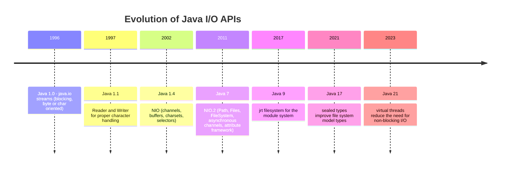
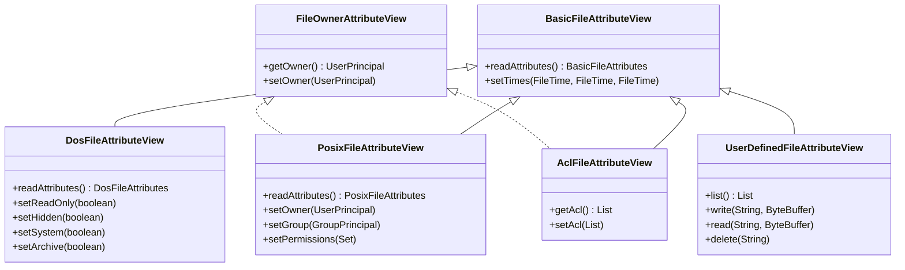
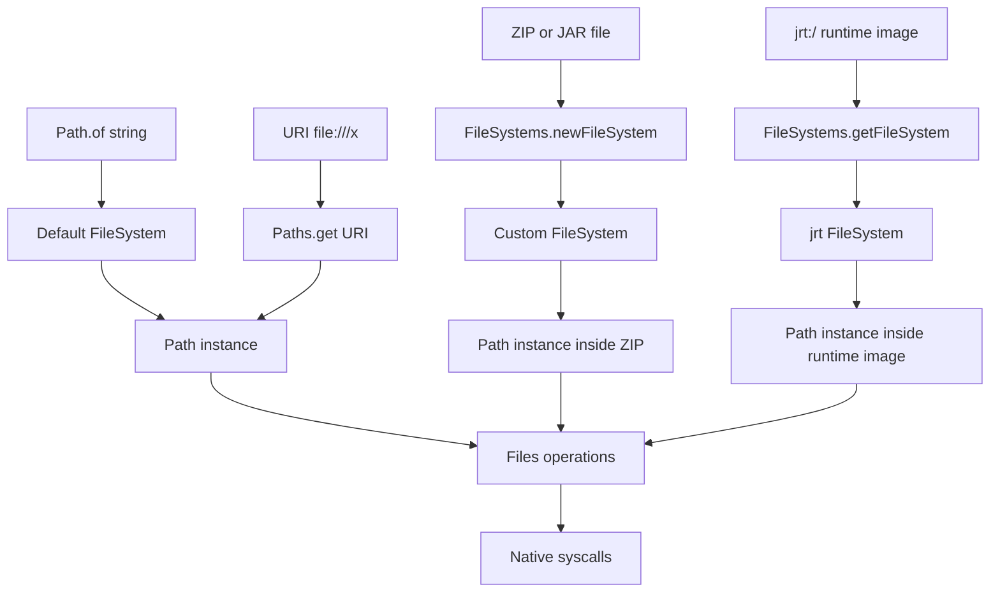
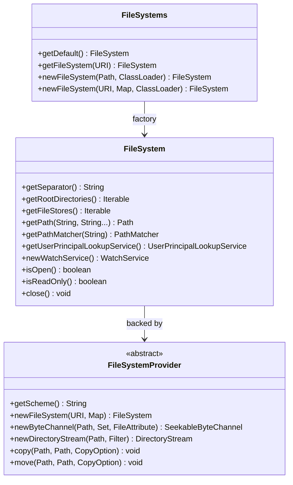

# NIO and NIO.2 Path API

## Overview

The Java New I/O (NIO) package was introduced in Java 1.4 as a high-performance alternative to the original `java.io` streams API. NIO added channels, buffers, charsets, and selectors to the platform, finally giving Java developers direct access to operating system primitives such as `mmap`, `sendfile`, scatter/gather I/O, and non-blocking socket I/O. With Java 7, the NIO.2 release (JSR 203) significantly extended this foundation by adding the `Path` interface, the `Files` utility class, a pluggable `FileSystem` provider model, asynchronous I/O, and a uniform file attribute framework. NIO.2 is now the recommended API for nearly all file system work in Java, and the original `java.io.File` class is preserved only for backward compatibility.

This note provides a thorough treatment of the NIO.2 Path API and the broader NIO architecture. We begin with the historical motivation for NIO and the relationship between the NIO and NIO.2 packages. We then dive into the `Path` interface in depth: how it represents path strings, how it normalises and resolves them, how it interacts with the `FileSystem` abstraction, and how it converts to and from `File`, `URI`, and `URL`. We explore the `FileSystem` and `FileSystems` factory classes, the pluggable `FileSystemProvider` SPI, and the bundled `jrt:/`, `jar:/`, and `file:/` providers. We discuss the `PathMatcher` globbing syntax, the `WatchService` event loop, and the relationship between `Path` and `java.net.URI`. We finish with practical patterns for cross-platform path handling, symlink-safe operations, and integration with the `java.io` streams API. By the end of this note you will understand exactly how the `Path` API is layered over the file system and how to use it correctly in modern Java applications.

## Background Knowledge

Before reading this note you should be comfortable with the following prerequisite topics:

- The legacy `java.io.File` class and its limitations, covered in the previous note (08.1 File and Directory Operations).
- Operating system concepts such as mount points, file descriptors, inodes, and symbolic links. Java exposes these but you must understand them to reason about behaviour.
- The `java.net.URI` class and the difference between `URI` and `URL`. A `URI` is a pure identifier; a `URL` is a URI that includes a retrieval mechanism.
- The Java module system introduced in Java 9. The `jrt:/` file system exposes the runtime image of modules and is accessible only through the NIO.2 API.
- The try-with-resources construct. Almost every operation that opens a file, stream, or directory returns an `AutoCloseable`.

NIO.2 is split across two packages: `java.nio.file` contains the high-level Path/Files API, while `java.nio.channels`, `java.nio.buffer`, and `java.nio.charset` contain the lower-level channel, buffer, and charset APIs from the original NIO release. The next note (08.3 Channels, Buffers, and Charsets) covers the lower-level APIs; this note focuses on the Path-centric, file-system-centric parts.

## A Brief History of NIO

The original `java.io` package, introduced with Java 1.0 in 1996, modelled I/O as a stream of bytes flowing through blocking method calls. Every `read` on an `InputStream` blocked the calling thread until at least one byte was available. This model is simple to reason about but ill-suited to high-throughput server workloads: a single server may need to manage thousands of concurrent sockets, and dedicating a thread to each one is wasteful.



Java 1.4 introduced NIO in 2002. The headline features were channels (which can transfer data in bulk to and from buffers), buffers (which are typed, randomly accessible containers with position, limit, and capacity), charsets (which formalised the encoding and decoding of bytes to characters), and selectors (which allow a single thread to monitor many channels for readiness). NIO also introduced the `java.nio.file` package, but its scope was limited and most file system work was still done with `java.io.File`.

Java 7 in 2011 delivered NIO.2 (JSR 203), a major extension that added the `Path`, `Paths`, `Files`, `FileSystem`, `FileSystems`, `FileSystemProvider`, `FileStore`, `FileVisitor`, `WatchService`, `WatchKey`, `PathMatcher`, `DirectoryStream`, and `FileAttributeView` types. NIO.2 also introduced asynchronous file and socket channels that integrate with `Future` and `CompletionHandler`. The new API was designed by Alan Bateman and Jon Gibbons and drew heavily on the design lessons of `java.io.File`, the Apache Commons IO library, and the Google Guava `com.google.common.io` package.

## The Path Interface

The `Path` interface is the immutable, platform-independent representation of a path in a file system. Unlike `java.io.File`, which is a concrete class, `Path` is an interface, allowing different file system providers to supply their own implementations. A `Path` instance is always bound to a specific `FileSystem`, and that file system defines the separator character, the root component, and the rules for path resolution.

### Creating Paths

There are three primary ways to obtain a `Path` instance. The most common is the `Path.of` factory method introduced in Java 11. It accepts a string or a sequence of strings and joins them with the platform separator.

```java
import java.nio.file.Path;
import java.nio.file.FileSystems;
import java.nio.file.FileSystem;

public class PathCreationDemo {
    public static void main(String[] args) {
        // Method 1: Path.of (Java 11+).
        Path p1 = Path.of("config", "app", "settings.yaml");
        Path p2 = Path.of("/etc/nginx/nginx.conf");

        // Method 2: Paths.get (Java 7+). Identical to Path.of.
        Path p3 = java.nio.file.Paths.get("/var/log/app.log");

        // Method 3: From a FileSystem (for non-default providers).
        FileSystem fs = FileSystems.getDefault();
        Path p4 = fs.getPath("/opt/app/bin/run.sh");

        // Method 4: From a URI (for pluggable providers like jar:, zip:, jrt:).
        java.net.URI uri = java.net.URI.create("file:///etc/passwd");
        Path p5 = Paths.get(uri);

        // Converting between Path and File.
        java.io.File file = p1.toFile();
        Path roundTripped = file.toPath();
    }
}
```

The `Path.of` factory uses the default file system, which is the platform's native file system. To obtain a path inside a custom file system (such as a ZIP file mounted as a file system), use the `FileSystem.getPath` method instead.

### Path Components

A `Path` decomposes into a root component and a sequence of name elements. The root is either null (relative path), `/` (Unix absolute), or a drive letter followed by `\` (Windows absolute). Name elements are the individual directory and file components between separators.

```java
import java.nio.file.Path;

public class PathComponentsDemo {
    public static void main(String[] args) {
        Path p = Path.of("/var/log/app/server.log");

        System.out.println(p.getRoot());             // /
        System.out.println(p.getFileName());         // server.log
        System.out.println(p.getParent());           // /var/log/app
        System.out.println(p.getNameCount());        // 4
        System.out.println(p.getName(0));            // var
        System.out.println(p.getName(1));            // log
        System.out.println(p.getName(2));            // app
        System.out.println(p.getName(3));            // server.log
        System.out.println(p.subpath(1, 3));         // log/app
        System.out.println(p.isAbsolute());          // true

        // Last element shortcut.
        System.out.println(p.getFileName());         // server.log
    }
}
```

The `subpath(beginIndex, endIndex)` method returns a relative path consisting of name elements from `beginIndex` (inclusive) to `endIndex` (exclusive). It does not include the root component.

### Resolution and Normalisation

Path resolution combines a base path with a partial path. If the partial path is absolute, the base is discarded. Normalisation removes redundant `.` (current directory) and `..` (parent directory) segments. Together these two operations let you build paths from parts reliably.

```java
import java.nio.file.Path;

public class PathResolveDemo {
    public static void main(String[] args) {
        Path base = Path.of("/var/log/app");

        // Resolve a relative partial.
        Path r1 = base.resolve("server.log");        // /var/log/app/server.log
        Path r2 = base.resolve("archive/2023.log");  // /var/log/app/archive/2023.log

        // Resolving an absolute partial discards the base.
        Path r3 = base.resolve("/etc/passwd");       // /etc/passwd

        // ResolveSibling resolves against the parent of the base.
        Path r4 = base.resolveSibling("config");     // /var/log/config

        // Normalisation collapses . and .. .
        Path messy = Path.of("/var/log/app/./../other/../app/server.log");
        Path clean = messy.normalize();              // /var/log/app/server.log

        // Relativization produces a relative path from one location to another.
        Path from = Path.of("/var/log/app");
        Path to   = Path.of("/var/log/archive/2023.log");
        Path rel  = from.relativize(to);             // ../archive/2023.log
    }
}
```

Normalisation does not access the file system. It is a pure string operation. This means it can produce paths that traverse above the root, such as normalising `/..` to `/`. The operating system silently ignores `..` at the root, so the resulting path is still safe, but you must be careful when constructing paths from untrusted input. To enforce confinement, call `relativize` and verify that the result does not start with `..` before using it.

### Conversion Methods

```java
import java.nio.file.Path;

public class PathConversionDemo {
    public static void main(String[] args) throws java.io.IOException {
        Path p = Path.of("config/app.yaml");

        // Convert to absolute path (using current working directory).
        Path abs = p.toAbsolutePath();

        // Convert to real path (resolves symlinks and normalises).
        Path real = p.toRealPath();

        // Convert to URI.
        java.net.URI uri = p.toUri();                  // file:///.../config/app.yaml

        // Convert to File (default filesystem only).
        java.io.File file = p.toFile();

        // Compare paths by structural equality.
        Path a = Path.of("/etc/passwd");
        Path b = Path.of("/etc/./passwd").normalize();
        System.out.println(a.equals(b));               // true
        System.out.println(a.compareTo(b));            // 0

        // startsWith and endsWith are path-aware, not string-aware.
        Path base = Path.of("/var/log/app");
        Path full = Path.of("/var/log/app/server.log");
        System.out.println(full.startsWith(base));     // true
        System.out.println(full.endsWith("server.log")); // true
        System.out.println(full.endsWith("log/server.log")); // true
    }
}
```

The `startsWith` and `endsWith` methods perform path-component comparison rather than string prefix/suffix comparison. `Path.of("/var/log/app/server.log").startsWith("/var/log")` returns true, but `Path.of("/var/log-archive/server.log").startsWith("/var/log")` returns false because `log-archive` is a single name element that does not equal `log`.

## The FileSystem Abstraction

The `FileSystem` class represents an instance of a file system. The default file system, accessed via `FileSystems.getDefault()`, wraps the host operating system's native file system. NIO.2 also supports pluggable file systems provided by `FileSystemProvider` implementations. The JDK ships with three built-in providers: the default `file` provider, the `jar` (and `zip`) provider, and the `jrt` provider for the runtime module image.

```java
import java.nio.file.*;
import java.net.URI;
import java.io.IOException;
import java.util.Map;

public class FileSystemProviderDemo {
    public static void main(String[] args) throws IOException {
        // Default filesystem.
        FileSystem defaultFs = FileSystems.getDefault();
        System.out.println("Separator: " + defaultFs.getSeparator());
        System.out.println("Open: " + defaultFs.isOpen());
        System.out.println("Read-only: " + defaultFs.isReadOnly());
        for (Path root : defaultFs.getRootDirectories()) {
            System.out.println("Root: " + root);
        }
        for (FileStore store : defaultFs.getFileStores()) {
            System.out.println("Store: " + store.name() + " (" + store.type() + ")");
        }

        // Mount a ZIP file as a filesystem.
        Path zip = Path.of("archive.zip");
        Files.writeString(Files.createFile(zip), "placeholder");
        try (FileSystem zipFs = FileSystems.newFileSystem(zip, (ClassLoader) null)) {
            Path inside = zipFs.getPath("/entry.txt");
            Files.writeString(inside, "hello zip");
            System.out.println(Files.readString(inside));
        }

        // Walk the runtime module image.
        try (FileSystem jrtFs = FileSystems.getFileSystem(URI.create("jrt:/"))) {
            Path modules = jrtFs.getPath("/modules");
            try (var stream = Files.walk(modules)) {
                stream.limit(20).forEach(System.out::println);
            }
        }
    }
}
```

The ZIP file system provider is particularly useful. It allows you to treat a ZIP or JAR file as a directory tree and manipulate entries with the same `Files` API you use for regular files. This is dramatically simpler than the legacy `java.util.zip.ZipFile` API. The provider supports the following provider-specific properties:

- `create` (boolean) - create the ZIP file if it does not exist.
- `encoding` (string) - character encoding for entry names (defaults to UTF-8).
- `useLanguageEncoding` (boolean) - language-sensitive encoding for entry names.
- `compressionMethod` (string) - `STORED` or `DEFLATED`.

The `jrt:/` file system exposes the runtime image. It has exactly two top-level directories: `/modules` (containing class files organised by module) and `/packages` (mapping package names to the modules that contain them). This file system is read-only and exists only inside a running JVM.

## The PathMatcher Glob Syntax

The `PathMatcher` interface allows you to filter paths using a glob pattern. Globs are simpler than regular expressions and are well-suited to file name matching. The `FileSystem.getPathMatcher` method creates a matcher.

```java
import java.nio.file.*;
import java.io.IOException;

public class PathMatcherDemo {
    public static void main(String[] args) throws IOException {
        Path dir = Path.of("work/matcher-demo");
        Files.createDirectories(dir);
        Files.createFile(dir.resolve("report-2023-01.csv"));
        Files.createFile(dir.resolve("report-2023-02.csv"));
        Files.createFile(dir.resolve("notes.txt"));
        Files.createFile(dir.resolve("data.bin"));

        PathMatcher csvMatcher = FileSystems.getDefault()
                .getPathMatcher("glob:**/*.csv");
        PathMatcher txtMatcher = FileSystems.getDefault()
                .getPathMatcher("glob:*.txt");

        try (var stream = Files.newDirectoryStream(dir)) {
            for (Path p : stream) {
                if (csvMatcher.matches(p)) {
                    System.out.println("CSV: " + p.getFileName());
                }
                if (txtMatcher.matches(p)) {
                    System.out.println("TXT: " + p.getFileName());
                }
            }
        }

        // Glob also usable directly with newDirectoryStream.
        try (var stream = Files.newDirectoryStream(dir, "report-2023-*.csv")) {
            stream.forEach(p -> System.out.println("Match: " + p.getFileName()));
        }
    }
}
```

The glob syntax supports the following meta-characters:

- `*` matches zero or more characters except the path separator.
- `**` matches zero or more path segments including the separator.
- `?` matches exactly one character except the separator.
- `[abc]` matches one of the characters inside the brackets.
- `[a-z]` matches one character in the range.
- `[!abc]` matches one character that is NOT inside the brackets.
- `{a,b,c}` matches any of the comma-separated sub-patterns.
- `\` escapes the next character (for example `\*` matches a literal asterisk).

The difference between `*.csv` and `**/*.csv` is subtle. The first matches any file name ending in `.csv` within a single directory. The second matches any file ending in `.csv` in any subdirectory as well, including nested ones. When used with `Files.newDirectoryStream` (which is single-level), only `*.csv` makes sense; when used with `Files.walk` (which is recursive), `**/*.csv` is the right choice.

## The WatchService API

The `WatchService` API provides event notifications when files and directories change. It wraps platform-specific mechanisms such as Linux `inotify`, macOS `FSEvents`, and Windows `ReadDirectoryChangesW`. The API is polling-based: you register a directory with the service, then loop forever calling `take` or `poll` to receive events.

```java
import java.nio.file.*;
import java.io.IOException;

public class WatchServiceDemo {
    public static void main(String[] args) throws IOException, InterruptedException {
        try (WatchService watcher = FileSystems.getDefault().newWatchService()) {
            Path dir = Path.of("work/watch-demo");
            Files.createDirectories(dir);

            WatchKey key = dir.register(watcher,
                    StandardWatchEventKinds.ENTRYCREATE,
                    StandardWatchEventKinds.ENTRYMODIFY,
                    StandardWatchEventKinds.ENTRYDELETE);

            System.out.println("Watching " + dir + " for 30 seconds...");
            long deadline = System.currentTimeMillis() + 30000L;

            while (System.currentTimeMillis() < deadline) {
                WatchKey k = watcher.poll(java.time.Duration.ofSeconds(1));
                if (k == null) continue;
                for (WatchEvent<?> event : k.pollEvents()) {
                    Path file = (Path) event.context();
                    System.out.println(event.kind() + " -> " + dir.resolve(file));
                }
                if (!k.reset()) break;
            }
        }
    }
}
```

The `WatchService` has several important limitations:

1. **Only directories can be registered.** You cannot watch a single file; register its parent directory instead and filter events by `event.context()`.
2. **Events may be coalesced.** Multiple rapid modifications to a file may produce a single `ENTRYMODIFY` event.
3. **Events may be lost.** If the operating system's event buffer overflows, you receive a special `OVERFLOW` event and must rescan the directory to recover.
4. **Recursive watching is not built-in.** You must register each subdirectory explicitly, and you must register new subdirectories as they are created.
5. **Registration is per-directory.** Modifying the watched file from outside the JVM (e.g., via shell) produces an event; modifying it from inside the JVM also produces an event because the OS does not distinguish.

The `WatchKey` returned by `register` represents the registration. It is `Closeable`; calling `close()` cancels the registration. Calling `reset()` after processing events re-arms the key to receive future events. Once a key is no longer valid (because the directory was deleted), `reset()` returns `false`.

## The File Attribute Framework

NIO.2 introduced a uniform framework for reading and writing file attributes. The framework is organised around attribute views, each of which exposes a set of named attributes. The most important views are:



The `basic` view is supported on all platforms and provides size, type, timestamps, and the opaque `fileKey`. The `posix` view adds owner, group, and permissions. The `dos` view adds the four DOS attributes (read-only, hidden, system, archive). The `acl` view exposes the access control list. The `user` view exposes arbitrary user-defined extended attributes.

```java
import java.io.IOException;
import java.nio.file.*;
import java.nio.file.attribute.*;
import java.util.List;

public class AttributeViewDemo {
    public static void main(String[] args) throws IOException {
        Path file = Path.of("work/attr-view-demo.txt");
        Files.createDirectories(file.getParent());
        Files.createFile(file);

        // Bulk attribute read using the typed Attributes class.
        PosixFileAttributes attrs = Files.readAttributes(file, PosixFileAttributes.class);
        System.out.println("Owner: " + attrs.owner().getName());
        System.out.println("Group: " + attrs.group().getName());
        System.out.println("Permissions: " + PosixFilePermissions.toString(attrs.permissions()));

        // Bulk attribute read using a string spec.
        var map = Files.readAttributes(file, "posix:size,lastModifiedTime,owner,permissions");
        map.forEach((k, v) -> System.out.println(k + " = " + v));

        // Updating POSIX permissions.
        var perms = PosixFilePermissions.fromString("rwxr--r--");
        Files.setPosixFilePermissions(file, perms);

        // Updating owner and group requires a UserPrincipalLookupService.
        FileSystem fs = file.getFileSystem();
        UserPrincipalLookupService lookup = fs.getUserPrincipalLookupService();
        UserPrincipal owner = lookup.lookupPrincipalByName(System.getProperty("user.name"));
        Files.setOwner(file, owner);

        // User-defined extended attributes (when supported).
        UserDefinedFileAttributeView userView =
                Files.getFileAttributeView(file, UserDefinedFileAttributeView.class);
        if (userView != null) {
            userView.write("application.tag", java.nio.ByteBuffer.wrap("v1.0".getBytes()));
            System.out.println("Tags: " + userView.list());
        }
    }
}
```

## Path vs URI vs URL

The `Path.toUri()` method produces a `file:` URI such as `file:///etc/passwd`. This is useful for cross-platform path exchange and for interoperation with libraries that expect URIs. The reverse conversion uses `Paths.get(URI)`.

```java
import java.nio.file.*;
import java.net.URI;

public class PathUriDemo {
    public static void main(String[] args) {
        Path p = Path.of("/etc/passwd");
        URI uri = p.toUri();                       // file:///etc/passwd

        Path roundTripped = Paths.get(uri);
        System.out.println(p.equals(roundTripped));

        // Path.toUri always produces an absolute URI. To convert a relative
        // path to URI, first make it absolute.
        Path rel = Path.of("config/app.yaml").toAbsolutePath();
        URI relUri = rel.toUri();
        System.out.println(relUri);
    }
}
```

Note the difference between `URI` and `URL`. A `URI` is a pure identifier; it does not guarantee retrievability. A `URL` is a URI that includes a retrieval mechanism (a protocol handler). To convert a `file:` URI to a `URL`, call `uri.toURL()`, which works because the JDK ships a `file` URL stream handler. Converting a `URL` back to a `Path` requires going through the URI: `Paths.get(url.toURI())`.

## Pluggable File System Providers

The `FileSystemProvider` SPI lets third-party libraries add new file systems. Each provider is identified by a URI scheme. The JDK ships providers for `file:`, `jar:`, and `jrt:`. Third-party providers exist for S3, SFTP, HDFS, and others. To register a provider, place a JAR on the classpath that contains a `META-INF/services/java.nio.file.spi.FileSystemProvider` file listing the provider class name. The `FileSystems.newFileSystem(URI, Map, ClassLoader)` method discovers providers via `ServiceLoader`.

```java
import java.nio.file.*;
import java.net.URI;
import java.util.Map;

public class CustomProviderDemo {
    public static void main(String[] args) throws Exception {
        // Hypothetical S3 provider.
        URI s3Uri = URI.create("s3://my-bucket");
        Map<String, ?> env = Map.of(
                "aws.accessKeyId", "AKIA...",
                "aws.secretAccessKey", "secret");
        try (FileSystem s3fs = FileSystems.newFileSystem(s3Uri, env, /*ClassLoader*/ null)) {
            Path object = s3fs.getPath("/object-key.txt");
            Files.writeString(object, "uploaded via NIO.2");
            System.out.println(Files.readString(object));
        }
    }
}
```

When a custom provider is on the classpath, `Paths.get(URI)` and `Files` methods automatically route to it based on the URI scheme. This makes the entire `Files` API available to custom file systems with no special code paths.

## Mermaid Diagrams





## Common Pitfalls

1. **Mixing relative and absolute paths in `relativize`.** Both arguments must be either absolute or relative. Mixing throws `IllegalArgumentException`. Always call `toAbsolutePath()` on both before relativising.
2. **Forgetting to close `FileSystem` instances.** A `FileSystem` returned by `FileSystems.newFileSystem` is `Closeable`. Failing to close it keeps file handles open and may prevent subsequent operations on the underlying file.
3. **Treating `Path.equals` as string equality.** `Path.equals` compares name elements, not raw strings. `Path.of("/etc/./passwd")` does not equal `Path.of("/etc/passwd")` until you normalise the former.
4. **Trusting `Path.startsWith` for security.** `Path.startsWith("/safe")` returns true for `/safe/../etc/passwd`. Always normalise and verify `toRealPath()` before deciding that a path is inside a safe directory.
5. **Assuming `Path.toFile` works on all file systems.** It only works on the default file system. Calling `toFile()` on a path from a ZIP file system throws `UnsupportedOperationException`.
6. **Globbing with `*.csv` instead of `**/*.csv` for recursive matching.** The single `*` does not cross separators; use `**` for recursive matching with `Files.walk`.
7. **Forgetting `k.reset()` in `WatchService` loops.** Without `reset`, the key never receives future events for the same directory.
8. **Registering a file with `WatchService`.** Only directories can be registered. Register the parent directory and filter by `event.context()`.
9. **Assuming `Files.readAttributes(path, "*")` returns all attributes.** It returns only the attributes of the `basic` view. To get POSIX attributes use `"posix:*"`.
10. **Using `Paths.get` in module-path code.** `Paths.get(String)` is fine, but `Paths.get(URI)` requires the URI scheme to be registered with a provider. In a modular application, make sure the provider module is in the module graph.

## Tips and Tricks

- Use `Path.of` (Java 11+) instead of `Paths.get`. The former is shorter, the latter just delegates.
- When building user-input file paths, always call `normalize()` and verify the result does not start with `..` to prevent path traversal attacks.
- Use `Files.getFileStore(path).supportsFileAttributeView("posix")` to detect the platform before reading non-basic attributes.
- Use the ZIP file system provider instead of `java.util.zip.ZipOutputStream` for new code; the API is dramatically simpler and works with the entire `Files` toolkit.
- Use `Path.toUri().toURL()` to obtain a `URL` for classloader-style resource access.
- Use `PathMatcher` with glob patterns instead of hand-written string operations for file name filtering.
- For atomic publication of a file, write to `target.tmp` and then perform `Files.move(tmp, target, ATOMICMOVE, REPLACEEXISTING)`.
- For long-running services, prefer polling with `WatchService.poll(Duration)` over blocking with `take()` so the loop can be shut down gracefully.
- Cache `FileSystem.getPathMatcher` results if you use the same pattern repeatedly; matcher construction involves parsing the glob.
- Use `Files.walk` with a depth limit when you only need a few levels of traversal; an unbounded walk on a deep directory tree can be slow.

## Interview Questions

**Q1. What is the difference between NIO and NIO.2?**
A: NIO was introduced in Java 1.4 and added channels, buffers, charsets, and selectors. NIO.2 was introduced in Java 7 and added the `Path` interface, the `Files` utility class, the `FileSystem` and `FileSystemProvider` abstraction, asynchronous channels, the file attribute framework, and `WatchService`. Together they form the modern I/O API; the legacy `java.io.File` and `java.io.Stream` APIs are still available but should not be used in new code.

**Q2. Why is `Path` an interface rather than a class?**
A: To allow pluggable file system providers to supply their own implementations. A `Path` from the default file system wraps a native OS path; a `Path` from a ZIP file system wraps an entry inside a ZIP file. Both implement the same interface so that the same `Files` methods work on both.

**Q3. What is the difference between `resolve` and `relativize`?**
A: `resolve` joins a base path with a partial path to produce a complete path. `relativize` does the opposite: given two paths, it produces the relative path that would take you from the first to the second. `resolve` requires the second argument to be relative (or it returns the second argument); `relativize` requires both paths to be either absolute or relative.

**Q4. What is the difference between `normalize` and `toRealPath`?**
A: `normalize` is a pure string operation that removes redundant `.` and `..` segments without touching the file system. `toRealPath` performs I/O: it resolves symbolic links, removes redundant segments, and returns the canonical path. Use `normalize` for path manipulation; use `toRealPath` when you need the actual path on disk.

**Q5. What is a `FileSystemProvider`?**
A: An SPI class that implements a file system for a specific URI scheme. The JDK ships three providers (`file`, `jar`, `zip`, `jrt`). Third-party providers can be registered by placing a JAR with a `META-INF/services/java.nio.file.spi.FileSystemProvider` service descriptor on the classpath. The `FileSystems.newFileSystem(URI, Map, ClassLoader)` method discovers them via `ServiceLoader`.

**Q6. What does the `jrt:/` file system provide?**
A: A read-only view of the runtime module image. It has two top-level directories: `/modules` (containing class files organised by module) and `/packages` (mapping package names to the modules that contain them). It exists only inside a running JVM and is accessible only through NIO.2.

**Q7. How does the ZIP file system provider work?**
A: It treats a ZIP or JAR file as a directory tree. You open the file system with `FileSystems.newFileSystem(zipPath, (ClassLoader) null)`, then use `Files` methods to read, write, copy, and delete entries inside the ZIP. The provider handles compression and decompression transparently.

**Q8. What is the difference between `*` and `**` in a glob pattern?**
A: `*` matches zero or more characters except the path separator. `**` matches zero or more characters including the path separator. Use `*.csv` for single-level matching (e.g., in `newDirectoryStream`); use `**/*.csv` for recursive matching (e.g., in `Files.walk`).

**Q9. What are the limitations of `WatchService`?**
A: It can only watch directories, not individual files. It does not support recursive watching out of the box; you must register each subdirectory. Events may be coalesced or lost (an `OVERFLOW` event signals this). Platform-specific event latency varies.

**Q10. What is an `AttributeView`?**
A: A typed view of a file's attributes. The `basic` view exposes size and timestamps; `posix` adds owner, group, and permissions; `dos` adds the four DOS attributes; `acl` exposes the access control list; `user` exposes arbitrary user-defined extended attributes. Each view is identified by a name and accessed via `Files.getFileAttributeView`.

**Q11. Why does `Files.readAttributes(path, "*")` only return basic attributes?**
A: Because the wildcard `*` applies to the view implied by the prefix. Without a prefix, it defaults to `basic`. To read POSIX attributes, use `"posix:*"`. To read all attributes of all views, you must call `readAttributes` once per view.

**Q12. What is the difference between `startsWith` and `String.startsWith`?**
A: `Path.startsWith` compares path name elements, not raw characters. `Path.of("/var/log/app").startsWith("/var/log")` is true, but `Path.of("/var/log-archive/app").startsWith("/var/log")` is false because `log-archive` is one name element.

**Q13. How do you prevent path traversal attacks?**
A: Always normalise user-supplied paths and verify they start with the safe directory: `if (!path.normalize().startsWith(safeRoot)) throw new SecurityException()`. Better yet, resolve the user input against the safe root and then verify `toRealPath().startsWith(safeRoot.toRealPath())`.

**Q14. What happens when `relativize` is called with mixed absolute/relative paths?**
A: It throws `IllegalArgumentException`. Both paths must be either absolute or relative. Convert both to absolute before calling `relativize` if necessary.

**Q15. Can a `Path` be used after its `FileSystem` is closed?**
A: No. A `Path` is bound to its `FileSystem`. After the file system is closed, most `Files` methods throw `ClosedFileSystemException`. Keep the file system open for the lifetime of the paths you obtained from it.

## Summary

The NIO.2 Path API is the modern foundation for file system operations in Java. It replaces the legacy `java.io.File` class with an immutable, exception-aware, attribute-rich abstraction that supports pluggable file systems, symbolic links, atomic moves, and uniform attribute views. The `Path` interface is paired with the `Files` utility class and the `FileSystem` abstraction to give you a powerful toolkit for working with files, directories, archives, and even the runtime module image.

The most important lessons from this note are: use `Path.of` and the `Files` class for all new code; normalise paths before comparing or security-checking them; use the `FileSystemProvider` SPI to extend the API to custom file systems such as ZIP, JAR, and cloud object stores; use the `PathMatcher` for glob-style filtering; and be aware of the limitations of `WatchService` for recursive directory monitoring. The next note, "Channels, Buffers, and Charsets", dives into the lower-level NIO APIs that sit beneath the `Files` abstraction, including direct buffers, scatter/gather I/O, and character encoding.
