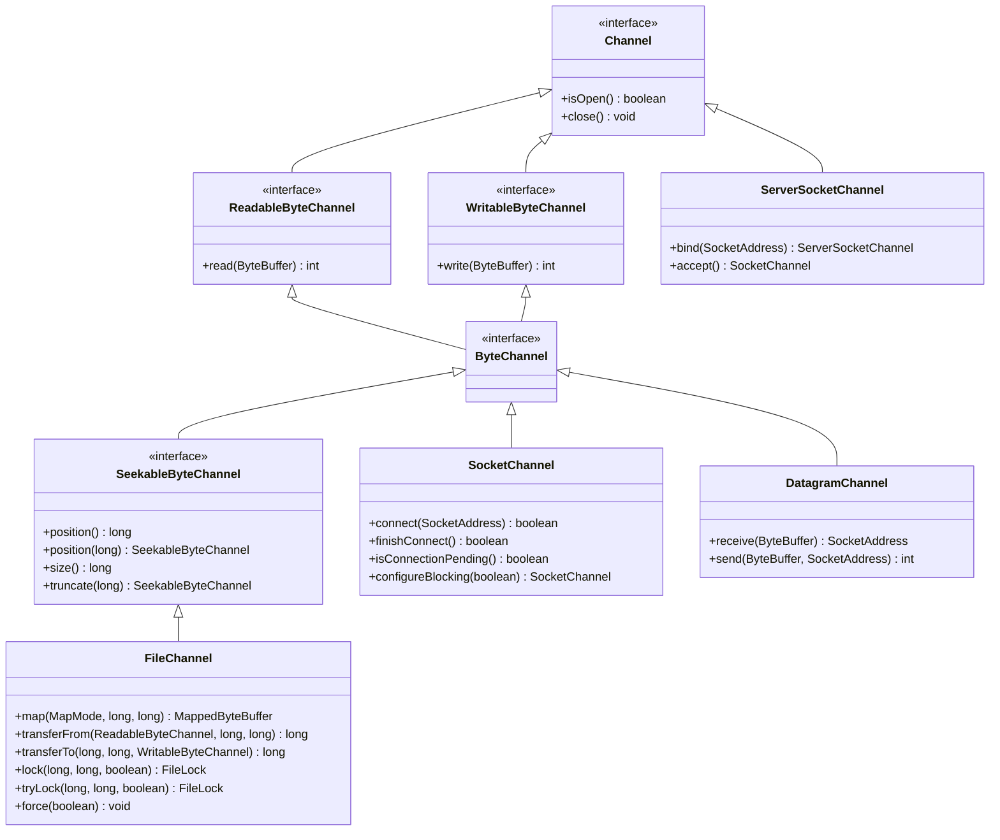
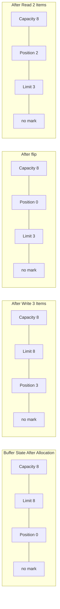
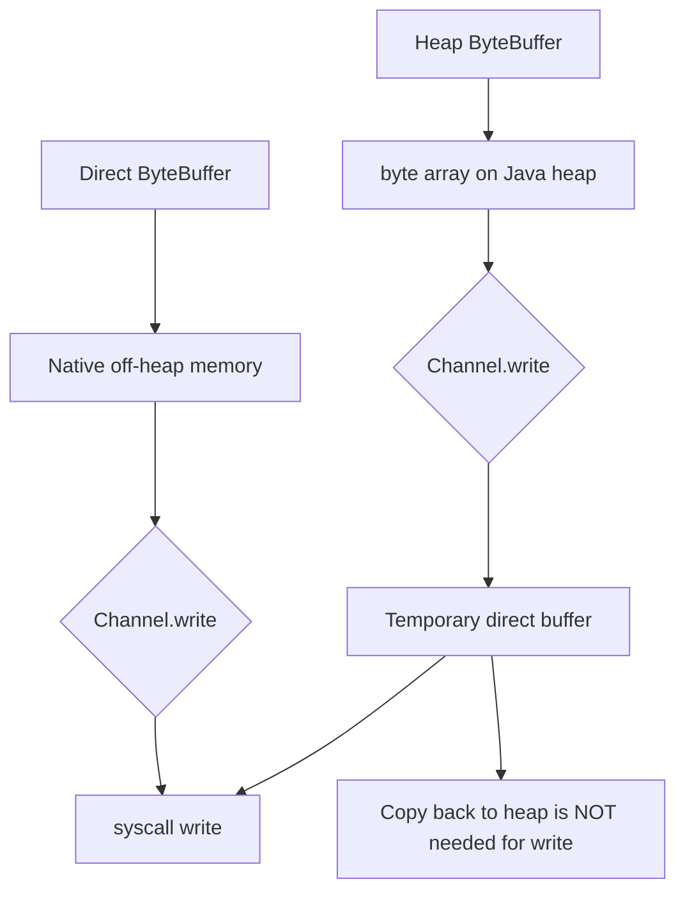
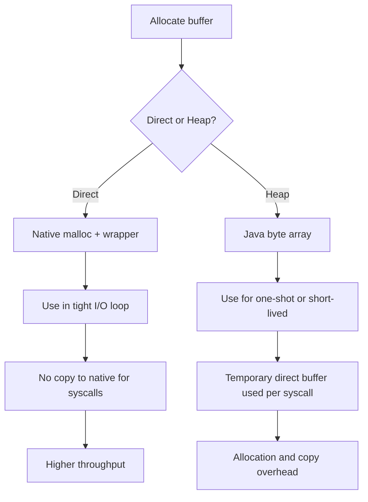
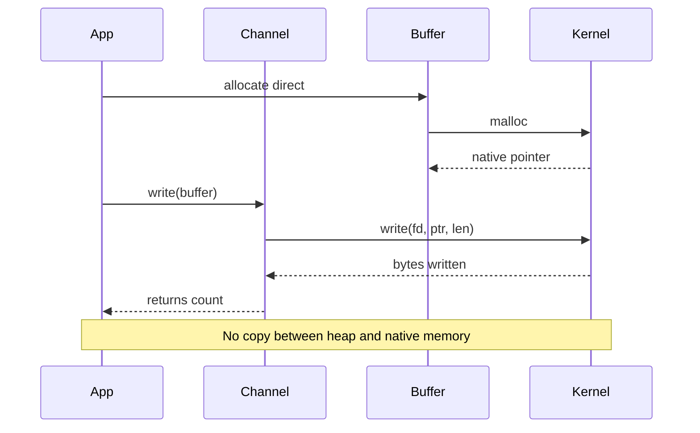

# Channels, Buffers, and Charsets

## Overview

The Java NIO package, originally introduced in Java 1.4, provides a high-performance I/O layer that sits below the familiar `java.io` streams API. The three foundational abstractions of NIO are channels, buffers, and charsets. A channel is a conduit for data transfer between a file, socket, or pipe and an in-memory buffer. A buffer is a typed, randomly accessible container with explicit position, limit, and capacity markers that govern read and write operations. A charset is a coder that converts between bytes and characters according to a standardised encoding scheme such as UTF-8 or UTF-16. Together these three abstractions form a coherent toolkit that supports bulk transfers, scatter/gather I/O, memory-mapped files, non-blocking sockets, and zero-copy operations.

This note covers all three abstractions in depth. We begin with the channel hierarchy, including `FileChannel`, `SocketChannel`, `ServerSocketChannel`, `DatagramChannel`, `Pipe`, and the asynchronous channel variants. We then explore the `Buffer` class in detail: the four-pointer model (capacity, limit, position, mark), the type-specific subclasses (`ByteBuffer`, `CharBuffer`, `ShortBuffer`, `IntBuffer`, `LongBuffer`, `FloatBuffer`, `DoubleBuffer`), and the critical difference between direct and heap buffers. We explain how to create direct buffers with `ByteBuffer.allocateDirect`, why they avoid extra native copies, and when the allocation cost is justified. We then turn to charsets: the `Charset` class, the encoder/decoder pair, `StandardCharsets` constants, the difference between UTF-8 and UTF-16, the byte order mark, and how to detect encoding. We finish with scatter/gather I/O, the `Selector` mechanism for non-blocking socket multiplexing, and a thorough comparison of NIO channels with the legacy `java.io` streams. By the end of this note you will understand when to use channels and buffers instead of streams, how to choose between direct and heap buffers, and how to handle character encoding correctly in Java 21.

## Background Knowledge

Before reading this note you should be familiar with:

- The legacy `java.io` streams API (`InputStream`, `OutputStream`, `Reader`, `Writer`) and its decorator pattern. NIO channels are not a strict replacement but an alternative for high-throughput scenarios.
- Byte order concepts: big-endian and little-endian. NIO buffers default to big-endian (network byte order) and can be flipped with `order(ByteOrder.LITTLEENDIAN)`.
- Character encoding fundamentals: the difference between a character set (a mapping from characters to code points) and a character encoding (a mapping from code points to byte sequences). Unicode code points are abstract numbers; UTF-8 and UTF-16 are concrete encodings of those numbers.
- The `java.util.concurrent` primitives such as `Future` and `ExecutorService`. Asynchronous channels integrate with these types.
- The try-with-resources construct. Every channel implements `Closeable` and must be closed to release native resources.

A channel is conceptually similar to a stream, but it is bidirectional for files and sockets, supports bulk transfers in and out of buffers, and supports non-blocking operation. A buffer is essentially a fixed-size array with metadata for sequential access. A charset provides encoding and decoding operations that consume and produce buffers.

## The Channel Hierarchy

The `java.nio.channels.Channel` interface is the root of the channel hierarchy. It extends `Closeable` and adds only `isOpen()` and `close()` methods. Specialised subinterfaces add reading and writing capabilities.



The most important channels for typical file and network operations are:

- **`FileChannel`** - reads and writes files with support for position-based access, memory mapping, file locking, and zero-copy transfers via `transferTo` and `transferFrom`.
- **`SocketChannel`** - a TCP socket that can operate in blocking or non-blocking mode. In non-blocking mode it integrates with a `Selector`.
- **`ServerSocketChannel`** - a TCP listener that accepts incoming connections and produces `SocketChannel` instances.
- **`DatagramChannel`** - a UDP socket for connectionless datagram exchange.
- **`Pipe`** - a unidirectional data conduit consisting of a `Pipe.SinkChannel` and a `Pipe.SourceChannel`, useful for intra-JVM communication.
- **`AsynchronousFileChannel`, `AsynchronousSocketChannel`, `AsynchronousServerSocketChannel`** - channels that perform I/O asynchronously via `Future` or `CompletionHandler`, introduced in Java 7.

### FileChannel

```java
import java.io.IOException;
import java.nio.ByteBuffer;
import java.nio.channels.FileChannel;
import java.nio.file.Path;
import java.nio.file.StandardOpenOption;

public class FileChannelDemo {
    public static void main(String[] args) throws IOException {
        Path file = Path.of("work/channel-demo.bin");
        java.nio.file.Files.createDirectories(file.getParent());

        // Write some bytes via a FileChannel.
        try (FileChannel out = FileChannel.open(file,
                StandardOpenOption.CREATE,
                StandardOpenOption.WRITE,
                StandardOpenOption.TRUNCATEEXISTING)) {
            ByteBuffer buf = ByteBuffer.allocate(64);
            buf.putLong(42L);
            buf.putDouble(3.14);
            buf.put((byte) 0xFF);
            buf.flip();                                  // prepare for writing
            out.write(buf);
            out.force(true);                             // fsync both data and metadata
        }

        // Read with explicit position (does not change the channel position).
        try (FileChannel in = FileChannel.open(file, StandardOpenOption.READ)) {
            ByteBuffer read = ByteBuffer.allocate(8);
            in.read(read, 0);                            // read first 8 bytes at offset 0
            read.flip();
            System.out.println("Long value: " + read.getLong());

            // Bulk transfer: copy to another file without user-space buffer.
            Path copy = file.resolveSibling("channel-copy.bin");
            try (FileChannel out = FileChannel.open(copy,
                    StandardOpenOption.CREATE,
                    StandardOpenOption.WRITE,
                    StandardOpenOption.TRUNCATEEXISTING)) {
                in.transferTo(0, in.size(), out);
            }
        }
    }
}
```

Two features of `FileChannel` deserve special mention. First, the `transferTo` and `transferFrom` methods enable zero-copy transfers: on Linux with kernels 2.4 and later they use the `sendfile` syscall, which copies data directly from one file descriptor to another without ever entering user space. This is dramatically faster than the equivalent `read`+`write` loop and is the basis for high-throughput web servers and message brokers. Second, the `lock` and `tryLock` methods acquire region-based file locks visible to other processes. Such locks are advisory on Linux and mandatory on Windows; they should not be relied upon for JVM-internal synchronisation.

### Socket and Server Socket Channels

```java
import java.io.IOException;
import java.net.InetSocketAddress;
import java.nio.ByteBuffer;
import java.nio.channels.*;
import java.util.Iterator;

public class NioEchoServer {
    public static void main(String[] args) throws IOException {
        try (Selector selector = Selector.open();
             ServerSocketChannel server = ServerSocketChannel.open()) {

            server.bind(new InetSocketAddress(8080));
            server.configureBlocking(false);
            server.register(selector, SelectionKey.OPACCEPT);

            System.out.println("Listening on 8080...");
            ByteBuffer buf = ByteBuffer.allocate(1024);

            while (true) {
                selector.select();                       // block until at least one ready
                Iterator<SelectionKey> it = selector.selectedKeys().iterator();
                while (it.hasNext()) {
                    SelectionKey key = it.next();
                    it.remove();
                    if (key.isAcceptable()) {
                        SocketChannel client = server.accept();
                        client.configureBlocking(false);
                        client.register(selector, SelectionKey.OPREAD);
                    } else if (key.isReadable()) {
                        SocketChannel client = (SocketChannel) key.channel();
                        buf.clear();
                        int n = client.read(buf);
                        if (n == -1) { client.close(); continue; }
                        buf.flip();
                        client.write(buf);               // echo back
                    }
                }
            }
        }
    }
}
```

This is the classic single-threaded NIO echo server. The `Selector` multiplexes many channels onto a single thread: when one channel is ready for reading or writing, the selector wakes up and tells you which one. This design is what made NIO famous for high-concurrency servers before virtual threads existed. In Java 21, with virtual threads, blocking I/O on virtual threads is often simpler and equally performant; the choice between NIO selectors and virtual threads now depends on whether you need fine-grained control over event ordering.

### Asynchronous Channels

```java
import java.io.IOException;
import java.net.InetSocketAddress;
import java.nio.ByteBuffer;
import java.nio.channels.*;
import java.nio.channels.CompletionHandler;
import java.util.concurrent.CountDownLatch;

public class AsyncEchoClient {
    public static void main(String[] args) throws IOException, InterruptedException {
        CountDownLatch done = new CountDownLatch(1);
        try (AsynchronousSocketChannel client = AsynchronousSocketChannel.open()) {
            client.connect(new InetSocketAddress("localhost", 8080)).get();

            ByteBuffer buf = ByteBuffer.wrap("hello\n".getBytes());
            client.write(buf, null, new CompletionHandler<Integer, Void>() {
                @Override public void completed(Integer n, Void att) {
                    ByteBuffer read = ByteBuffer.allocate(64);
                    client.read(read, read, new CompletionHandler<Integer, ByteBuffer>() {
                        @Override public void completed(Integer n, ByteBuffer b) {
                            b.flip();
                            System.out.println("Echo: " + new String(b.array(), 0, n));
                            done.countDown();
                        }
                        @Override public void failed(Throwable e, ByteBuffer b) {
                            e.printStackTrace(); done.countDown();
                        }
                    });
                }
                @Override public void failed(Throwable e, Void att) {
                    e.printStackTrace(); done.countDown();
                }
            });
            done.await();
        } catch (Exception e) {
            e.printStackTrace();
        }
    }
}
```

Asynchronous channels use a thread pool internally (the default "asynchronous channel group") to dispatch completion handlers. The pool size is configurable via `AsynchronousChannelGroup.withFixedThreadPool` and `withCachedThreadPool`. The `Future`-returning variants are simpler but lose the benefit of callback-driven composition.

## The Buffer Class

A `Buffer` is a typed, fixed-size container with four integer markers that govern sequential reads and writes. The four markers are:

- **Capacity**: the maximum number of elements. Set at allocation and never changes.
- **Position**: the index of the next element to read or write. Starts at 0.
- **Limit**: the index of the first element that should not be read or written. Initially equals capacity.
- **Mark**: an optional remembered position, set with `mark()` and restored with `reset()`.



The four key buffer operations are:

- `flip()` - sets limit to position, position to 0, discards mark. Use this when you finish writing and want to start reading.
- `clear()` - sets position to 0, limit to capacity, discards mark. Use this when you want to start writing again (it does not actually erase data).
- `rewind()` - sets position to 0, keeps limit. Use this when you want to re-read the same data.
- `reset()` - restores position to the previously set mark.

```java
import java.nio.ByteBuffer;

public class BufferStateDemo {
    public static void main(String[] args) {
        ByteBuffer buf = ByteBuffer.allocate(8);
        System.out.println("After allocate: " + state(buf));  // pos=0 lim=8 cap=8

        buf.put((byte) 1).put((byte) 2).put((byte) 3);
        System.out.println("After 3 puts:   " + state(buf));  // pos=3 lim=8 cap=8

        buf.flip();
        System.out.println("After flip:     " + state(buf));  // pos=0 lim=3 cap=8

        byte a = buf.get();
        byte b = buf.get();
        System.out.println("After 2 gets:   " + state(buf));  // pos=2 lim=3 cap=8
        System.out.println("Values: " + a + " " + b);

        buf.clear();
        System.out.println("After clear:    " + state(buf));  // pos=0 lim=8 cap=8

        // Mark and reset demo.
        buf.put((byte) 10).put((byte) 20).mark().put((byte) 30).reset();
        System.out.println("After mark/reset: " + state(buf)); // pos=2 lim=8 cap=8
    }

    static String state(ByteBuffer b) {
        return "pos=" + b.position() + " lim=" + b.limit() + " cap=" + b.capacity();
    }
}
```

### Type-Specific Buffer Subclasses

There is a buffer subclass for every primitive type except `boolean`: `ByteBuffer`, `CharBuffer`, `ShortBuffer`, `IntBuffer`, `LongBuffer`, `FloatBuffer`, `DoubleBuffer`. Each adds typed `get` and `put` methods and a `view` mechanism to interpret the bytes of a `ByteBuffer` as another type.

```java
import java.nio.ByteBuffer;
import java.nio.ByteOrder;

public class TypedBufferDemo {
    public static void main(String[] args) {
        ByteBuffer buf = ByteBuffer.allocate(32);
        // Default byte order is big-endian (network byte order).
        System.out.println("Order: " + buf.order());

        // Write a long at offset 0 and an int at offset 8.
        buf.putLong(0, 0xDEADBEEFCAFEL);
        buf.putInt(8, 0x12345678);

        // View the buffer as IntBuffer at offset 0 with length 4.
        buf.position(0);
        IntBuffer intView = buf.asIntBuffer();
        while (intView.hasRemaining()) {
            System.out.printf("%08x%n", intView.get());
        }

        // Switch to little-endian and re-read.
        buf.order(ByteOrder.LITTLEENDIAN);
        buf.position(0);
        IntBuffer littleView = buf.asIntBuffer();
        while (littleView.hasRemaining()) {
            System.out.printf("%08x%n", littleView.get());
        }
    }
}
```

### Direct vs Heap Buffers

`ByteBuffer` has two allocation strategies: `ByteBuffer.allocate(n)` returns a heap buffer backed by a `byte[]` on the Java heap; `ByteBuffer.allocateDirect(n)` returns a direct buffer backed by an off-heap native memory region. The distinction matters because I/O syscalls operate on native memory pointers, not on Java arrays.

When you pass a heap buffer to a channel's `read` or `write`, the JVM internally allocates a temporary direct buffer, copies the heap data into it, performs the syscall, and discards the temporary buffer. This is wasteful in tight loops. When you pass a direct buffer, no copy is needed: the JVM hands the native pointer directly to the syscall.



The trade-off is allocation cost and garbage collection behaviour:

- **Heap buffers** are cheap to allocate (a single `byte[]` allocation) and are reclaimed by the GC normally. They are best for short-lived buffers and for code that needs to inspect or mutate the bytes from Java.
- **Direct buffers** are expensive to allocate (a `malloc` plus a Java object wrapper, often pinned through `Cleaner` or `PhantomReference` for deallocation). They are best for long-lived buffers that are reused across many I/O operations, especially in network servers and file copy utilities.

A common pattern is to allocate a single direct buffer per thread (e.g. using `ThreadLocal` or virtual-thread-scoped allocation) and reuse it for the lifetime of the thread. The JVM also maintains a small cache of temporary direct buffers per thread (the "direct buffer pool") to amortise the allocation cost for short-lived heap-buffer I/O. You can observe this cache via `ManagementFactory.getPlatformMXBeans(BufferPoolMXBean.class)`.

```java
import java.lang.management.ManagementFactory;
import java.lang.management.BufferPoolMXBean;

public class BufferPoolMonitor {
    public static void main(String[] args) {
        for (BufferPoolMXBean pool : ManagementFactory.getPlatformMXBeans(BufferPoolMXBean.class)) {
            System.out.println(pool.getName()
                + " count=" + pool.getCount()
                + " used=" + pool.getMemoryUsed()
                + " capacity=" + pool.getTotalCapacity());
        }
    }
}
```

The `mapped` byte buffer, returned by `FileChannel.map`, is a special kind of direct buffer that is backed by a memory-mapped region of a file. We cover this in detail in the next note (08.4 Memory Mapped Files and ZIP).

### Slicing and Duplicating Buffers

A buffer can be sliced to obtain a view of a sub-region. The slice shares content with the original but has independent position, limit, and mark. The new buffer's position starts at 0 and its capacity equals the original's remaining elements. Slicing is the foundation for buffer pooling: allocate a large direct buffer once, then slice off chunks for individual I/O operations.

```java
import java.nio.ByteBuffer;

public class BufferSliceDemo {
    public static void main(String[] args) {
        ByteBuffer big = ByteBuffer.allocate(1024);
        big.position(100).limit(200);
        ByteBuffer slice = big.slice();
        System.out.println("Slice cap=" + slice.capacity()); // 100

        // Writing to the slice writes through to the parent.
        slice.put(0, (byte) 42);
        System.out.println(big.get(100));                    // 42

        // Duplicate creates a new buffer that shares content but has independent state.
        ByteBuffer dup = big.duplicate();
        dup.position(0);
        System.out.println(dup.get());                       // whatever byte is at 0

        // asReadOnlyBuffer returns a view that throws on put.
        ByteBuffer ro = big.asReadOnlyBuffer();
        try {
            ro.put(0, (byte) 1);
        } catch (java.nio.ReadOnlyBufferException e) {
            System.out.println("Read-only as expected.");
        }
    }
}
```

## Charsets and Character Encoding

A `Charset` is a named mapping between sixteen-bit Unicode code units (Java `char` values) and byte sequences. The `Charset` class is the entry point. The `StandardCharsets` class provides constants for the six charsets guaranteed to be available on every Java implementation: `USASCII`, `ISO88591`, `UTF8`, `UTF16BE`, `UTF16LE`, `UTF16`.

```java
import java.nio.ByteBuffer;
import java.nio.CharBuffer;
import java.nio.charset.*;

public class CharsetDemo {
    public static void main(String[] args) {
        Charset utf8 = StandardCharsets.UTF8;
        Charset utf16 = StandardCharsets.UTF16;

        // Encode characters into bytes.
        String text = "Hello, 世界!";
        ByteBuffer bytes = utf8.encode(text);
        System.out.println("UTF-8 byte count: " + bytes.remaining());

        // Decode bytes into characters.
        bytes.rewind();
        CharBuffer chars = utf8.decode(bytes);
        System.out.println("Decoded: " + chars.toString());

        // Encoder/Decoder for streaming.
        CharsetEncoder encoder = utf8.newEncoder();
        CharsetDecoder decoder = utf8.newDecoder();

        // Replace malformed input with a replacement character.
        decoder.onMalformedInput(CodingErrorAction.REPLACE);
        decoder.onUnmappableCharacter(CodingErrorAction.REPLACE);

        // Always use StandardCharsets constants, not Charset.forName.
        // StandardCharsets constants never throw UnsupportedCharsetException.
        byte[] data = "java".getBytes(StandardCharsets.UTF8);
        String back = new String(data, StandardCharsets.UTF8);

        // Detecting charset is heuristic; Java does not provide built-in detection.
        // Use a third-party library like ICU4J or juniversalchardet for that.
    }
}
```

The differences between UTF-8 and UTF-16 are worth memorising:

- **UTF-8** uses 1 byte per ASCII character, 2 bytes for Latin scripts and Greek/Cyrillic, 3 bytes for the BMP, and 4 bytes for supplementary characters. It is byte-order independent, ASCII-transparent, and the dominant encoding on the web.
- **UTF-16** uses 2 bytes per BMP character and 4 bytes (a surrogate pair) for supplementary characters. It comes in two flavours, big-endian and little-endian, distinguished by an optional Byte Order Mark (`U+FEFF`) at the start of the stream.
- **UTF-32** uses 4 bytes per character and is rarely used externally; Java has no `StandardCharsets.UTF32` constant.

The `String` class internally stores characters as a `byte[]` since Java 9, using either Latin-1 (1 byte per character) or UTF-16 (2 bytes per character) depending on the content. This is the Compact Strings feature, and it dramatically reduces the memory footprint of typical Java applications. You can disable it with the `-XX:-CompactStrings` flag.

### Byte Order Mark

The Byte Order Mark (BOM) is the code point `U+FEFF` placed at the start of a UTF-16 or UTF-8 stream. It serves two purposes: it identifies the stream as UTF-16/UTF-8, and for UTF-16 it indicates the byte order (big-endian if the bytes appear as `FE FF`, little-endian if they appear as `FF FE`). Java's `InputStreamReader` does not strip the BOM by default; you must handle it manually or use a library such as Apache Commons IO `BOMInputStream`.

```java
import java.io.*;
import java.nio.charset.StandardCharsets;

public class BomStripper {
    public static void main(String[] args) throws IOException {
        // Manually strip UTF-8 BOM if present.
        byte[] data = {(byte) 0xEF, (byte) 0xBB, (byte) 0xBF, 'H', 'i'};
        if (data.length >= 3 &&
            (data[0] & 0xFF) == 0xEF &&
            (data[1] & 0xFF) == 0xBB &&
            (data[2] & 0xFF) == 0xBF) {
            byte[] stripped = new byte[data.length - 3];
            System.arraycopy(data, 3, stripped, 0, stripped.length);
            data = stripped;
        }
        String text = new String(data, StandardCharsets.UTF8);
        System.out.println(text);  // Hi
    }
}
```

## Scatter/Gather I/O

Scatter/gather I/O allows a single channel operation to read into or write from multiple buffers in a single syscall. Scattering reads fill an array of buffers in order; gathering writes drain an array of buffers in order. This is useful for protocols with fixed headers (read into a small header buffer, then a larger payload buffer) without copying data between buffers.

```java
import java.io.IOException;
import java.nio.ByteBuffer;
import java.nio.channels.FileChannel;
import java.nio.file.Path;
import java.nio.file.StandardOpenOption;

public class ScatterGatherDemo {
    public static void main(String[] args) throws IOException {
        Path file = Path.of("work/scatter.bin");
        java.nio.file.Files.createDirectories(file.getParent());
        java.nio.file.Files.write(file, new byte[100]);

        try (FileChannel ch = FileChannel.open(file, StandardOpenOption.READ)) {
            ByteBuffer header = ByteBuffer.allocate(8);
            ByteBuffer body = ByteBuffer.allocate(64);
            ByteBuffer trailer = ByteBuffer.allocate(4);
            long n = ch.read(new ByteBuffer[]{header, body, trailer});
            System.out.println("Read " + n + " bytes across 3 buffers.");
        }

        try (FileChannel ch = FileChannel.open(file,
                StandardOpenOption.WRITE, StandardOpenOption.TRUNCATEEXISTING)) {
            ByteBuffer a = ByteBuffer.wrap("Hello ".getBytes());
            ByteBuffer b = ByteBuffer.wrap("World\n".getBytes());
            ch.write(new ByteBuffer[]{a, b});  // gathered write
        }
    }
}
```

The scatter/gather operations are atomic with respect to other readers on some platforms, making them useful for protocol framing. Each buffer in the array is filled (or drained) to its limit before the next is touched.

## Selectors for Non-blocking Multiplexing

A `Selector` allows a single thread to monitor many `SelectableChannel` instances for readiness. Each channel is registered with the selector under a `SelectionKey` that records the operations of interest (`OPACCEPT`, `OPCONNECT`, `OPREAD`, `OPWRITE`). The selector's `select()` method blocks until at least one channel is ready; `selectedKeys()` then returns the ready set.

The selector pattern is the foundation of every pre-virtual-thread Java NIO server framework, including Netty, Mina, and Vert.x. With the introduction of virtual threads in Java 21, the same throughput can be achieved with simpler blocking code: each connection is handled on its own virtual thread, and the runtime unmounts the virtual thread during blocking I/O. The two approaches are not mutually exclusive; high-performance libraries may continue to use selectors under the hood even when exposing a blocking API.

## Comparison with java.io Streams

| Aspect | java.io Streams | NIO Channels and Buffers |
|--------|----------------|--------------------------|
| Direction | Unidirectional (InputStream or OutputStream) | Bidirectional for files and sockets |
| Operation mode | Always blocking | Blocking or non-blocking, configurable per channel |
| Data unit | One byte at a time (or byte array) | Bulk transfers to/from buffers |
| Buffering | Manual (BufferedInputStream wrapper) | Built-in via Buffer |
| File operations | RandomAccessFile for seekable files | FileChannel with position-based access |
| Memory mapping | Not supported | MappedByteBuffer via FileChannel.map |
| Zero-copy transfers | Not supported | transferTo and transferFrom use sendfile |
| Async variants | Not supported | Asynchronous channels with Future/CompletionHandler |
| Char encoding | InputStreamReader with Charset | CharsetEncoder/Decoder with CharBuffer |

Choose streams for simple one-shot reads and writes; choose channels and buffers for high-throughput, non-blocking, or memory-mapped scenarios.

## Mermaid Diagrams





## Common Pitfalls

1. **Forgetting `flip` after writing to a buffer.** Without `flip`, the limit remains at capacity and a subsequent `read` will see no data.
2. **Using `clear` when you mean `flip`.** `clear` resets the buffer for writing; `flip` prepares it for reading.
3. **Holding direct buffers for too long.** Direct buffers occupy native memory that is not subject to normal heap GC pressure. A memory leak in direct buffer usage can cause `OutOfMemoryError: Direct buffer memory`.
4. **Using `Charset.forName` instead of `StandardCharsets.UTF8`.** `forName` performs a lookup and can throw `UnsupportedCharsetException`. `StandardCharsets` constants are guaranteed to exist.
5. **Assuming `String.getBytes()` uses UTF-8.** Without an explicit charset, `getBytes()` uses the platform default charset, which can vary. Always pass `StandardCharsets.UTF8`.
6. **Forgetting to close channels.** Channels hold native file descriptors. Use try-with-resources.
7. **Mixing blocking and non-blocking modes on the same channel.** A channel is either blocking or non-blocking; switching modes resets in-flight operations.
8. **Reading more bytes than the buffer can hold.** A `read` call returns at most `buffer.remaining()` bytes. Use a loop with `hasRemaining` for large transfers.
9. **Ignoring the byte order when reading multi-byte values.** The default is big-endian. Always call `buffer.order(ByteOrder.LITTLEENDIAN)` if the file format requires little-endian.
10. **Not handling the BOM in UTF-16/UTF-8 input streams.** `InputStreamReader` does not strip the BOM; you must do it manually.

## Tips and Tricks

- Reuse direct buffers across many I/O operations to amortise the allocation cost.
- Use `ByteBuffer.wrap(byte[])` to create a buffer view over an existing array without copying.
- Use `transferTo` and `transferFrom` for file-to-file and file-to-socket zero-copy transfers.
- Use `Files.newByteChannel` instead of `FileChannel.open` when you only need a `SeekableByteChannel` (more abstract, easier to mock in tests).
- Use `CharsetDecoder` with `onMalformedInput(REPLACE)` and `onUnmappableCharacter(REPLACE)` to make decoding robust against bad input.
- Use `BufferPoolMXBean` to monitor direct buffer usage and detect leaks.
- Use scatter/gather for protocol framing instead of manual buffer concatenation.
- For high-throughput servers in Java 21, prefer virtual threads with blocking channels over selectors for simpler code; the runtime will manage the underlying I/O efficiently.
- Compact Strings (Java 9+) makes most strings use 1 byte per character. You can verify with `-XX:+CompactStrings` (default).
- Use `ByteBuffer.allocateDirect` only for buffers that are used at least 100 times to amortise the allocation cost; for one-shot buffers, heap buffers are faster.

## Interview Questions

**Q1. What is the difference between a heap buffer and a direct buffer?**
A: A heap buffer is backed by a `byte[]` on the Java heap and is subject to normal GC. A direct buffer is backed by native off-heap memory allocated via `malloc`. When a heap buffer is used in an I/O syscall, the JVM copies the data to a temporary direct buffer first; with a direct buffer no copy is needed. Direct buffers are more expensive to allocate but offer higher throughput for repeated I/O.

**Q2. When should you use a direct buffer?**
A: Use direct buffers for long-lived buffers that are reused across many I/O operations, especially in network servers and file copy utilities. For one-shot or short-lived buffers, heap buffers are cheaper to allocate and the extra copy is negligible.

**Q3. What are the four markers of a Buffer?**
A: Capacity (the maximum number of elements, fixed at allocation), position (the index of the next element to read or write), limit (the index of the first element that should not be read or written), and mark (an optional remembered position restored by `reset`).

**Q4. What does `flip()` do?**
A: It sets the limit to the current position, sets the position to 0, and discards the mark. Use it when you finish writing to a buffer and want to start reading from it.

**Q5. What is the difference between `clear()` and `rewind()`?**
A: `clear` sets position to 0 and limit to capacity (preparing the buffer for writing). `rewind` sets position to 0 but keeps the limit unchanged (preparing the buffer for re-reading).

**Q6. What is scatter/gather I/O?**
A: A single channel operation that reads into or writes from multiple buffers. Scattering reads fill an array of buffers in order; gathering writes drain an array of buffers in order. This avoids copying data between buffers for protocol framing.

**Q7. What is a `MappedByteBuffer`?**
A: A special direct buffer created by `FileChannel.map` that is backed by a memory-mapped region of a file. Reads and writes to the buffer are translated by the operating system into file reads and writes, with no explicit I/O calls. We cover this in depth in the next note.

**Q8. What is the default byte order of a `ByteBuffer`?**
A: Big-endian (also called network byte order). Use `buffer.order(ByteOrder.LITTLEENDIAN)` to switch to little-endian.

**Q9. What is the difference between UTF-8 and UTF-16?**
A: UTF-8 uses 1 byte per ASCII character, 2-3 bytes for the BMP, and 4 bytes for supplementary characters. UTF-16 uses 2 bytes per BMP character and 4 bytes (a surrogate pair) for supplementary characters. UTF-8 is byte-order independent; UTF-16 has big-endian and little-endian variants.

**Q10. Why does `StandardCharsets.UTF8` never throw?**
A: Because the `StandardCharsets` class exposes constants for the six charsets that every Java implementation is required to support. `Charset.forName("UTF-8")` performs a lookup that could in principle fail for other charsets, so it throws `UnsupportedCharsetException`.

**Q11. What is a `Selector`?**
A: A multiplexer that allows a single thread to monitor many `SelectableChannel` instances for readiness. Each channel is registered with a `SelectionKey` recording the operations of interest. The selector's `select()` method blocks until at least one channel is ready.

**Q12. What is zero-copy transfer?**
A: A `FileChannel.transferTo` or `transferFrom` call that copies data directly between file descriptors without entering user space. On Linux it uses the `sendfile` syscall. This is much faster than a `read`+`write` loop.

**Q13. What are asynchronous channels?**
A: Channels that perform I/O asynchronously, returning a `Future` or invoking a `CompletionHandler` when the operation completes. They use an internal thread pool called an asynchronous channel group. Examples: `AsynchronousFileChannel`, `AsynchronousSocketChannel`, `AsynchronousServerSocketChannel`.

**Q14. What is the Compact Strings feature?**
A: A Java 9 optimization where `String` internally stores characters as a `byte[]` using either Latin-1 (1 byte per character) or UTF-16 (2 bytes per character) depending on the content. This reduces the memory footprint of typical applications by 30-50%.

**Q15. How does Java handle the Byte Order Mark?**
A: Java does not strip the BOM by default. `InputStreamReader` includes the BOM as the first character of the decoded text. You must strip it manually or use a library such as Apache Commons IO `BOMInputStream`.

## Summary

Channels, buffers, and charsets form the high-performance I/O foundation of modern Java. Channels are bidirectional conduits that integrate with file descriptors, sockets, and pipes; buffers are typed containers with explicit position/limit/mark semantics; charsets provide standardised byte/character conversion. The single most important performance decision in this API is the choice between heap and direct buffers: heap buffers are cheap to allocate but incur an extra copy per I/O operation, while direct buffers are expensive to allocate but offer zero-copy transfers. For long-lived, high-throughput code paths, prefer direct buffers; for one-shot operations, prefer heap buffers.

The most important lessons from this note are: always `flip` a buffer between writing and reading; use `StandardCharsets.UTF8` for explicit character encoding; use `transferTo`/`transferFrom` for zero-copy file transfers; use scatter/gather for protocol framing; and prefer virtual threads with blocking channels over selectors for new code in Java 21. The next note, "Memory Mapped Files and ZIP", takes the `FileChannel.map` and `FileSystemProvider` abstractions further and explores memory-mapped I/O and the ZIP file system in depth.
