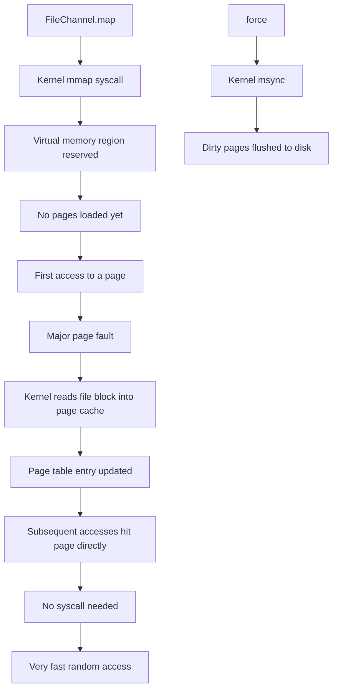
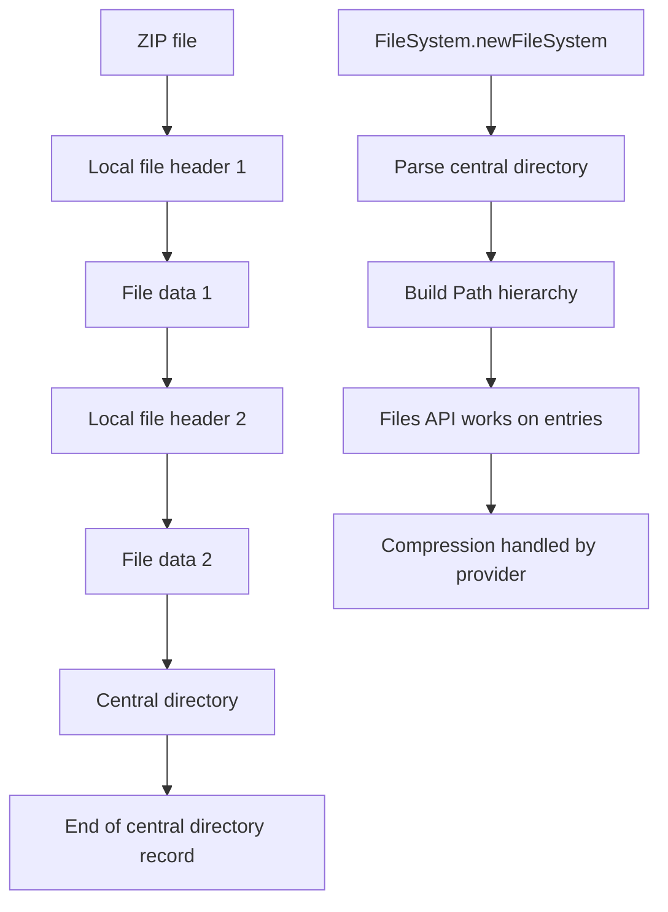

# Memory Mapped Files and ZIP

## Overview

Memory-mapped files and the ZIP file system provider are two of the most powerful, and most often overlooked, features of the Java NIO.2 toolkit. A memory-mapped file is a region of a file that the operating system maps directly into the process's virtual address space. Once mapped, the file can be read and written as if it were an in-memory array: the kernel transparently translates every memory access into a file operation, paging data in and out of physical memory as needed. This eliminates the need for explicit `read` and `write` syscalls, enables random access to multi-gigabyte files without buffering them in the heap, and allows multiple processes to share the same mapping for inter-process communication. The ZIP file system provider, introduced in Java 7, lets you treat a ZIP or JAR archive as a directory tree and manipulate its entries with the same `Files` API you use for regular files, without ever touching the low-level `java.util.zip` classes.

This note covers both features in depth. We begin with the `FileChannel.map` method and the three mapping modes (`READONLY`, `READWRITE`, `PRIVATE`). We discuss the `MappedByteBuffer` class and its `force`, `load`, and `isLoaded` methods. We then explore performance characteristics: how the OS page cache determines effective throughput, how page faults dominate latency, and how madvise-style hints influence the kernel's prefetch decisions. We cover the limitations of memory mapping (max mapping size, no truncation while mapped, no per-segment locking) and the modern alternatives such as `FileChannel.transferTo` for cases where mapping is impractical. We then turn to the ZIP file system: how to mount a ZIP for reading and writing, how to use provider-specific properties such as `create` and `compressionMethod`, how to handle large archives, and how to combine ZIP with `Files.walk` for archive manipulation. We finish with the `JarInputStream` and `JarFile` legacy APIs and a thorough treatment of the `java.util.zip` low-level classes (`Deflater`, `Inflater`, `GZIPInputStream`, `GZIPOutputStream`, `Checksum`, `Adler32`, `CRC32`). By the end of this note you will know when to choose memory mapping over channel I/O, how to mount and modify ZIP archives with the modern NIO.2 API, and how to compress and decompress streams with the lower-level `java.util.zip` toolkit.

## Background Knowledge

Before reading this note you should be comfortable with:

- The `ByteBuffer` class and the difference between heap and direct buffers, covered in the previous note (08.3 Channels, Buffers, and Charsets). A `MappedByteBuffer` is a special direct buffer.
- The `FileChannel` class and the `Files` utility class. Both are used in this note.
- Operating system concepts such as virtual memory, page tables, the page cache, page faults (minor and major), and the `mmap`, `madvise`, `msync`, and `munmap` syscalls. Java exposes these through `FileChannel.map`.
- The ZIP file format: a sequence of local file headers, file data, optional data descriptors, a central directory, and an end-of-central-directory record. The format is documented in APPNOTE.TXT from PKWARE.
- The `java.util.zip` package: `ZipInputStream`, `ZipOutputStream`, `ZipEntry`, `GZIPInputStream`, `GZIPOutputStream`, `Deflater`, `Inflater`, `Adler32`, `CRC32`.

A memory-mapped file is fundamentally different from a `FileChannel.read`/`FileChannel.write` loop. In the latter case, every read transfers data from kernel space to a user-space buffer, and every write transfers data back to kernel space. With a memory map, the file's bytes are mapped into the process's virtual address space directly: reads and writes to the mapped region trigger page faults that the kernel resolves by paging the corresponding file blocks into the page cache. Once a page is resident, subsequent accesses are as fast as accessing any other in-memory data structure. Writes to a `READWRITE` mapping are written back to the file lazily, controlled by the kernel's dirty page flusher and by explicit `MappedByteBuffer.force()` calls.

## Memory Mapping with FileChannel.map

The `FileChannel.map(MapMode mode, long position, long size)` method creates a `MappedByteBuffer` that maps `size` bytes of the file starting at `position`. The position must be non-negative and the size must not exceed `Integer.MAXVALUE` (about 2 GB) because a buffer is indexed by `int`. To map a file larger than 2 GB, you must create multiple mappings, each covering a region of at most 2 GB.

The three mapping modes are:

- **`READONLY`** (`MapMode.READONLY`) - the file is opened read-only and the resulting buffer is read-only. Any attempt to write throws `ReadOnlyBufferException`. The underlying file must have been opened with `READ` access.
- **`READWRITE`** (`MapMode.READWRITE`) - the file is opened for read and write. Changes to the buffer are eventually written back to the file. The underlying file must have been opened with `READ` and `WRITE` access.
- **`PRIVATE`** (`MapMode.PRIVATE`) - copy-on-write mapping. Writes to the buffer are not propagated to the file; instead, the kernel clones the affected pages and writes go to the clones. The underlying file is not modified.

```java
import java.io.IOException;
import java.nio.MappedByteBuffer;
import java.nio.channels.FileChannel;
import java.nio.file.Path;
import java.nio.file.StandardOpenOption;

public class MemoryMapDemo {
    public static void main(String[] args) throws IOException {
        Path file = Path.of("work/mmap.bin");
        java.nio.file.Files.createDirectories(file.getParent());
        try (FileChannel ch = FileChannel.open(file,
                StandardOpenOption.CREATE,
                StandardOpenOption.READ,
                StandardOpenOption.WRITE,
                StandardOpenOption.TRUNCATEEXISTING)) {
            ch.write(java.nio.ByteBuffer.allocate(8192));   // 8 KB file
        }

        // Map the entire file read/write.
        try (FileChannel ch = FileChannel.open(file,
                StandardOpenOption.READ, StandardOpenOption.WRITE)) {
            MappedByteBuffer mbb = ch.map(FileChannel.MapMode.READWRITE, 0, ch.size());
            System.out.println("Mapped capacity: " + mbb.capacity());
            System.out.println("IsLoaded: " + mbb.isLoaded());

            // Touch each page to force the kernel to load it.
            mbb.load();
            System.out.println("IsLoaded after load(): " + mbb.isLoaded());

            // Modify the first byte.
            mbb.put(0, (byte) 0xAB);
            mbb.put(8191, (byte) 0xCD);

            // Force dirty pages to disk.
            mbb.force();
        }
    }
}
```

The `load()` method is a hint: it tells the kernel to prefetch all pages of the mapping with a high priority. This is useful when you know you are about to scan the entire file. The `isLoaded()` method returns true if all pages are resident in physical memory; it is also a hint and may return false negatives. The `force()` method is equivalent to `msync(MSSYNC)`: it blocks until all dirty pages have been written to disk.

### Mapping Large Files

Because `MappedByteBuffer` is indexed by `int`, a single mapping can cover at most 2 GB. To map a 100 GB file, you must create 50 mappings, each covering 2 GB. The following helper shows the pattern.

```java
import java.io.IOException;
import java.nio.MappedByteBuffer;
import java.nio.channels.FileChannel;
import java.nio.file.Path;
import java.nio.file.StandardOpenOption;

public class LargeFileMapper {
    private static final long MAXREGION = 1L << 30;   // 1 GB per region for safety

    public static long checksum(Path file) throws IOException {
        long sum = 0;
        try (FileChannel ch = FileChannel.open(file, StandardOpenOption.READ)) {
            long size = ch.size();
            for (long off = 0; off < size; off += MAXREGION) {
                long remaining = size - off;
                long region = Math.min(MAXREGION, remaining);
                MappedByteBuffer mbb = ch.map(FileChannel.MapMode.READONLY, off, region);
                while (mbb.hasRemaining()) {
                    sum += mbb.get() & 0xFF;
                }
            }
        }
        return sum;
    }

    public static void main(String[] args) throws IOException {
        Path big = Path.of("work/bigfile.bin");
        System.out.println("Checksum: " + checksum(big));
    }
}
```

Note that we use 1 GB per region instead of 2 GB to leave room for the JVM's own allocations and to avoid running into the 32-bit address space limit on 32-bit JVMs (which are now extremely rare).

### Copy-on-Write Mappings

The `PRIVATE` mapping mode creates a copy-on-write mapping. Reads come from the file; writes cause the kernel to clone the page and write to the clone. The file itself is never modified. This is useful for in-memory caches that need a snapshot of a file's contents without holding a separate copy in the heap.

```java
import java.io.IOException;
import java.nio.MappedByteBuffer;
import java.nio.channels.FileChannel;
import java.nio.file.Path;
import java.nio.file.StandardOpenOption;

public class CopyOnWriteDemo {
    public static void main(String[] args) throws IOException {
        Path file = Path.of("work/cow.bin");
        java.nio.file.Files.write(file, new byte[4096]);

        try (FileChannel ch = FileChannel.open(file, StandardOpenOption.READ, StandardOpenOption.WRITE)) {
            MappedByteBuffer cow = ch.map(FileChannel.MapMode.PRIVATE, 0, ch.size());
            cow.put(0, (byte) 99);          // writes to private page
            System.out.println("In-mapping byte: " + (cow.get(0) & 0xFF));  // 99
        }

        // File on disk is NOT modified.
        byte[] disk = java.nio.file.Files.readAllBytes(file);
        System.out.println("On-disk byte: " + (disk[0] & 0xFF));  // 0
    }
}
```

## Performance Characteristics

The performance of memory-mapped I/O depends almost entirely on the operating system's page cache. The first access to a page triggers a major page fault, which the kernel resolves by reading the corresponding block from disk into the page cache. Subsequent accesses are as fast as accessing main memory. For sequentially scanned files, the kernel's read-ahead heuristic typically prefetches the next few pages, hiding most of the I/O latency.

The throughput characteristics of the three high-throughput file transfer mechanisms are roughly:

| Mechanism | Throughput (typical NVMe SSD) | CPU usage | Memory pressure |
|-----------|------------------------------|-----------|-----------------|
| `FileChannel.read` into heap buffer | ~1 GB/s | High (extra copy) | High (heap buffers) |
| `FileChannel.read` into direct buffer | ~2 GB/s | Medium | Low (native memory) |
| `FileChannel.transferTo` (sendfile) | ~3 GB/s | Low | Very low (no user buffer) |
| `MappedByteBuffer` | ~3 GB/s on hot pages | Very low | Low (page cache) |

Note that `transferTo` and `MappedByteBuffer` are roughly equal in throughput for hot data, but `MappedByteBuffer` wins for random access because it avoids the per-call syscall overhead. For cold data, the cost is dominated by disk I/O and all mechanisms perform similarly.

### Page Faults and TLB Shootdowns

A memory mapping is backed by page table entries in the process's virtual address space. The first access to a page triggers a page fault, which the kernel resolves by reading the file block and updating the page table. Subsequent accesses hit the Translation Lookaside Buffer (TLB), a CPU cache of virtual-to-physical address translations, and are extremely fast. The cost of a TLB miss is around 100 nanoseconds on modern hardware, while the cost of a major page fault can be hundreds of microseconds.

When a mapping is closed (or the file is truncated), the kernel must invalidate TLB entries on every CPU that has touched the mapping. This is called a TLB shootdown and involves an inter-processor interrupt. On large multi-socket systems with hundreds of cores, TLB shootdowns can dominate the cost of mapping teardown. For this reason, long-lived mappings that are reused across many operations are dramatically faster than short-lived mappings created per request.

### Locking and Consistency

A `READWRITE` mapping is shared with other processes that map the same file. Writes made by one process are visible to other processes once the kernel flushes the dirty pages to the page cache. The exact timing is undefined: if you need a guarantee, call `MappedByteBuffer.force()` after every write. Concurrent reads and writes from multiple processes are subject to the kernel's page cache consistency rules; there is no built-in locking for individual bytes. Use `FileChannel.lock` or an external coordination mechanism for cross-process synchronisation.

A mapping is alive as long as the `MappedByteBuffer` is reachable. The buffer is backed by a `Cleaner` (or `PhantomReference` in older Java versions) that calls `munmap` when the buffer is garbage collected. This means there is no deterministic way to unmap a region; calling `System.gc()` may help but is not guaranteed. Some libraries use reflection to invoke the private `Cleaner` directly, but this is fragile and not portable across JVM versions.

## The ZIP File System Provider

The ZIP file system provider, introduced in Java 7, mounts a ZIP or JAR file as a `FileSystem`. Once mounted, you can use the standard `Path` and `Files` API to read, write, copy, move, and delete entries inside the archive. The provider handles compression and decompression transparently.

```java
import java.io.IOException;
import java.net.URI;
import java.nio.file.*;
import java.util.Map;

public class ZipFileSystemDemo {
    public static void main(String[] args) throws IOException {
        Path zip = Path.of("work/archive.zip");
        java.nio.file.Files.createDirectories(zip.getParent());
        if (java.nio.file.Files.exists(zip)) java.nio.file.Files.delete(zip);

        // Create a ZIP and write some entries.
        Map<String, Object> props = Map.of("create", "true");
        try (FileSystem zipfs = FileSystems.newFileSystem(zip, props)) {
            Files.writeString(zipfs.getPath("/readme.txt"), "Hello, ZIP!");
            Files.createDirectories(zipfs.getPath("/data"));
            Files.writeString(zipfs.getPath("/data/2023-01.csv"), "id,value\n1,10\n");
            Files.writeString(zipfs.getPath("/data/2023-02.csv"), "id,value\n1,20\n");
        }

        // Reopen for reading and walking.
        try (FileSystem zipfs = FileSystems.newFileSystem(zip, (ClassLoader) null)) {
            Path root = zipfs.getPath("/");
            try (var stream = Files.walk(root)) {
                stream.forEach(p -> System.out.println(p));
            }
            // Read an entry.
            String content = Files.readString(zipfs.getPath("/readme.txt"));
            System.out.println("Readme: " + content);

            // Append a new entry.
            Files.writeString(zipfs.getPath("/data/2023-03.csv"), "id,value\n1,30\n",
                    StandardOpenOption.CREATE);
        }
    }
}
```

The provider accepts the following properties (case-insensitive):

- `create` - if `true`, create the ZIP file if it does not exist.
- `encoding` - the character encoding for entry names (defaults to UTF-8).
- `useLanguageEncoding` - if `true`, use the language-sensitive encoding flag (EFS bit) defined in APPNOTE.TXT.
- `compressionMethod` - either `STORED` (no compression) or `DEFLATED` (default).
- `releasePassword` - clears the password used for encrypted ZIPs (Java 19+; encryption requires a third-party provider).

The ZIP file system is more capable than the legacy `java.util.zip.ZipFile` API in almost every respect. It supports random access to entries, copying entries between ZIP files, walking the entry tree with `Files.walk`, and creating directories. The only case where the legacy API is still useful is when you need to read entries from a stream (e.g., from a network socket), because the ZIP file system requires a seekable `Path`.

### Copying Between ZIP and Disk

Because the ZIP file system exposes a uniform `Path` API, you can copy between disk and ZIP with `Files.copy`. The provider handles compression and decompression automatically.

```java
import java.io.IOException;
import java.nio.file.*;

public class ZipCopyDemo {
    public static void main(String[] args) throws IOException {
        Path zip = Path.of("work/copy-demo.zip");
        java.nio.file.Files.deleteIfExists(zip);

        try (FileSystem zipfs = FileSystems.newFileSystem(zip, Map.of("create", "true"))) {
            // Copy a disk file into the ZIP.
            Path source = Path.of("work/mmap.bin");
            if (Files.exists(source)) {
                Files.copy(source, zipfs.getPath("/copied.bin"),
                        StandardCopyOption.REPLACEEXISTING,
                        StandardCopyOption.COPYATTRIBUTES);
            }

            // Walk and copy multiple files.
            Path dir = Path.of("work/bulk");
            Files.createDirectories(dir);
            Files.writeString(dir.resolve("a.txt"), "alpha");
            Files.writeString(dir.resolve("b.txt"), "beta");

            try (var stream = Files.walk(dir)) {
                stream.filter(Files::isRegularFile).forEach(src -> {
                    Path rel = dir.relativize(src);
                    Path dst = zipfs.getPath("/bulk").resolve(rel.toString());
                    try {
                        Files.createDirectories(dst.getParent());
                        Files.copy(src, dst, StandardCopyOption.REPLACEEXISTING);
                    } catch (IOException e) {
                        throw new UncheckedIOException(e);
                    }
                });
            }
        }
    }
}
```

## The java.util.zip Low-Level API

The `java.util.zip` package provides lower-level compression primitives. While the ZIP file system is more convenient for most use cases, the low-level API is still useful for stream-based processing, custom compression, and checksum computation.

### ZipInputStream and ZipOutputStream

```java
import java.io.*;
import java.util.zip.*;

public class ZipStreamDemo {
    public static void main(String[] args) throws IOException {
        ByteArrayOutputStream baos = new ByteArrayOutputStream();
        try (ZipOutputStream zos = new ZipOutputStream(baos)) {
            zos.putNextEntry(new ZipEntry("hello.txt"));
            zos.write("Hello, Zip!\n".getBytes());
            zos.closeEntry();
            zos.putNextEntry(new ZipEntry("data/numbers.txt"));
            zos.write("1 2 3 4 5\n".getBytes());
            zos.closeEntry();
        }

        byte[] zipBytes = baos.toByteArray();
        try (ZipInputStream zis = new ZipInputStream(new ByteArrayInputStream(zipBytes))) {
            ZipEntry entry;
            while ((entry = zis.getNextEntry()) != null) {
                System.out.println("Entry: " + entry.getName()
                    + " size=" + entry.getSize()
                    + " compressed=" + entry.getCompressedSize());
                String text = new String(zis.readAllBytes());
                System.out.println("  Content: " + text.trim());
                zis.closeEntry();
            }
        }
    }
}
```

### GZIPInputStream and GZIPOutputStream

GZIP is a single-stream compression format used for HTTP transport encoding and `.gz` files. It compresses only one file; for multi-file archives use ZIP or tar with gzip.

```java
import java.io.*;
import java.nio.charset.StandardCharsets;
import java.util.zip.*;

public class GzipDemo {
    public static void main(String[] args) throws IOException {
        Path input = Path.of("work/input.txt");
        Path gzipped = Path.of("work/input.txt.gz");
        Files.writeString(input, "Hello, GZIP!\n".repeat(1000));

        // Compress.
        try (InputStream in = Files.newInputStream(input);
             GZIPOutputStream out = new GZIPOutputStream(Files.newOutputStream(gzipped))) {
            in.transferTo(out);
        }
        System.out.println("Original: " + Files.size(input));
        System.out.println("Compressed: " + Files.size(gzipped));

        // Decompress.
        try (GZIPInputStream in = new GZIPInputStream(Files.newInputStream(gzipped));
             BufferedReader reader = new BufferedReader(new InputStreamReader(in, StandardCharsets.UTF8))) {
            String line = reader.readLine();
            System.out.println("First line: " + line);
        }
    }
}
```

### Deflater and Inflater

`Deflater` and `Inflater` are the lowest-level compression primitives. They compress and decompress raw DEFLATE byte sequences with no headers. Use them when you need to embed compressed data in a custom protocol.

```java
import java.io.*;
import java.util.zip.*;

public class DeflateDemo {
    public static void main(String[] args) throws IOException {
        byte[] input = "Hello, Deflater! ".repeat(100).getBytes();
        byte[] output = new byte[input.length];   // worst case is slight expansion

        // Compress.
        Deflater def = new Deflater(Deflater.BESTCOMPRESSION, true);  // true = raw, no zlib header
        def.setInput(input);
        def.finish();
        int compressed = def.deflate(output);
        def.end();
        System.out.println("Compressed " + input.length + " bytes to " + compressed + " bytes");

        // Decompress.
        Inflater inf = new Inflater(true);
        inf.setInput(output, 0, compressed);
        byte[] result = new byte[input.length];
        int inflated = inf.inflate(result);
        inf.end();
        System.out.println("Inflated " + inflated + " bytes; matches: "
            + new String(result, 0, inflated).equals(new String(input)));
    }
}
```

### Checksums: Adler32 and CRC32

```java
import java.util.zip.Adler32;
import java.util.zip.CRC32;

public class ChecksumDemo {
    public static void main(String[] args) {
        byte[] data = "The quick brown fox".getBytes();

        CRC32 crc = new CRC32();
        crc.update(data);
        System.out.printf("CRC32:  %08x%n", crc.getValue());

        Adler32 adler = new Adler32();
        adler.update(data);
        System.out.printf("Adler32: %08x%n", adler.getValue());

        // For very high throughput, use CRC32C (Java 9+) with hardware acceleration.
        var crc32c = new java.util.zip.CRC32C();
        crc32c.update(data);
        System.out.printf("CRC32C: %08x%n", crc32c.getValue());
    }
}
```

Adler32 is faster but less reliable than CRC32. CRC32C is hardware-accelerated on modern x86 and ARM CPUs and is the recommended choice for new code.

## Mermaid Diagrams





## Common Pitfalls

1. **Mapping more than 2 GB.** A `MappedByteBuffer` is indexed by `int`, so it can cover at most `Integer.MAXVALUE` bytes (about 2 GB). For larger files, create multiple mappings.
2. **Forgetting to `force()`.** Writes to a `READWRITE` mapping are not synchronously written to disk. Call `force()` if you need durability, otherwise your data may be lost on power failure.
3. **Truncating a mapped file.** Truncating a file that is currently mapped produces undefined behaviour on Linux (typically `SIGBUS` on subsequent access to the truncated region). Always unmap before truncating.
4. **Holding mappings for too long.** The mapping is held until the buffer is garbage collected. On 32-bit JVMs, this can exhaust the address space. On 64-bit JVMs, it can fill up the kernel's virtual memory region pool.
5. **Not closing ZIP file systems.** A `FileSystem` returned by `FileSystems.newFileSystem` is `Closeable`. Failing to close it keeps file handles open and may prevent subsequent modifications.
6. **Using `Charset.forName("UTF-8")` instead of `StandardCharsets.UTF8`.** `forName` performs a lookup; constants are guaranteed.
7. **Reading from `ZipInputStream` after `closeEntry`.** The stream's position is at the start of the next entry; reads return the next entry's data, not the current entry's.
8. **Forgetting to call `finish()` on `Deflater`.** Without `finish()`, the deflater will not emit the trailing block and the resulting compressed stream is incomplete.
9. **Assuming `transferTo` is always zero-copy.** On some platforms and for some file sizes, `transferTo` falls back to a `read`+`write` loop. Always benchmark for your specific use case.
10. **Holding a `MappedByteBuffer` after the file is deleted.** On Linux the mapping is preserved but reads may return zeros; on Windows the file cannot be deleted while it is mapped.

## Tips and Tricks

- For random access to multi-GB files (e.g., database-style access), use a single direct `ByteBuffer` and multiple `FileChannel.read(buffer, position)` calls instead of memory mapping if your file is too large to map.
- For sequential scanning of large files, use `FileChannel.transferTo` to a `WritableByteChannel` to take advantage of zero-copy.
- For long-running mappings, consider using `MappedByteBuffer.load()` to prefetch pages before the latency-sensitive operation begins.
- Use the ZIP file system instead of `java.util.zip.ZipOutputStream` for new code; the API is dramatically simpler.
- For high-throughput compression, use `Deflater.BESTSPEED` for streaming scenarios where latency matters more than ratio.
- Use `CRC32C` for hardware-accelerated checksums on modern hardware.
- For incremental writes to a ZIP archive, mount the ZIP file system once and write entries over the lifetime of the application; the provider keeps the archive consistent.
- To work around the 2 GB mapping limit, build a `BigByteBuffer` abstraction that internally manages a list of `MappedByteBuffer` slices and translates `long` offsets to (slice index, int offset) pairs.
- Use `Files.copy(source, target, COPYATTRIBUTES)` when copying between ZIP and disk to preserve timestamps.
- Use `FileSystems.newFileSystem(URI.create("jar:file:/path/to/jar"), Map.of())` to mount a JAR via URI instead of Path; this works for resources reachable only via URL.

## Interview Questions

**Q1. What is a memory-mapped file?**
A: A region of a file that the operating system maps directly into the process's virtual address space. Once mapped, the file can be read and written as if it were an in-memory array, with the kernel transparently translating every memory access into a file operation. This eliminates explicit `read` and `write` syscalls.

**Q2. What are the three mapping modes?**
A: `READONLY` (file opened read-only, buffer is read-only), `READWRITE` (changes to the buffer are eventually written back to the file), and `PRIVATE` (copy-on-write: writes go to private clones and the file is not modified).

**Q3. Why can a `MappedByteBuffer` cover at most 2 GB?**
A: Because the `Buffer` class uses `int` indices, the maximum capacity is `Integer.MAXVALUE` (about 2 GB). To map a larger file, create multiple mappings, each covering a 2 GB region.

**Q4. What does `MappedByteBuffer.force()` do?**
A: It is equivalent to the `msync(MSSYNC)` syscall: it blocks until all dirty pages in the mapping have been written to disk. Use it when you need durability guarantees.

**Q5. What is the difference between `load()` and `force()`?**
A: `load()` is a hint to the kernel to prefetch all pages of the mapping with high priority. `force()` flushes dirty pages to disk. They are unrelated: `load` is for read performance, `force` is for write durability.

**Q6. What happens if you truncate a file that is currently memory-mapped?**
A: On Linux, subsequent accesses to the truncated region typically raise `SIGBUS`, terminating the JVM. Always unmap (by letting the buffer be garbage collected or by explicitly invoking the cleaner) before truncating.

**Q7. How do you deterministically unmap a `MappedByteBuffer`?**
A: You cannot. The mapping is released when the buffer is garbage collected and the JVM's `Cleaner` invokes `munmap`. You can hint the GC by calling `System.gc()`, but it is not guaranteed. Some libraries use reflection to invoke the private `Cleaner` directly, but this is fragile.

**Q8. What is the difference between `transferTo` and `MappedByteBuffer`?**
A: `transferTo` performs a one-shot zero-copy transfer between two file descriptors using the `sendfile` syscall. `MappedByteBuffer` creates a persistent mapping that allows repeated random access without further syscalls. For one-shot sequential transfers, `transferTo` is simpler and equally fast. For random access, `MappedByteBuffer` is faster.

**Q9. What is the ZIP file system provider?**
A: A built-in `FileSystemProvider` that mounts a ZIP or JAR file as a `FileSystem`. Once mounted, you can use the standard `Path` and `Files` API to read, write, copy, move, and delete entries inside the archive. It is more convenient than the legacy `java.util.zip.ZipFile` API.

**Q10. What properties can you pass to the ZIP file system provider?**
A: `create` (boolean, creates the ZIP if it does not exist), `encoding` (string, character encoding for entry names), `useLanguageEncoding` (boolean, language-sensitive encoding flag), `compressionMethod` (`STORED` or `DEFLATED`).

**Q11. What is the difference between GZIP and ZIP?**
A: GZIP is a single-stream compression format used for one file at a time. ZIP is a multi-file archive format that combines entry metadata (central directory) with per-entry compression. Use GZIP for HTTP transport encoding and `.gz` files; use ZIP for multi-file archives.

**Q12. What is `Deflater` used for?**
A: It is the lowest-level compression primitive in `java.util.zip`. It compresses raw DEFLATE byte sequences with no headers. Use it when you need to embed compressed data in a custom protocol.

**Q13. What is the difference between Adler32 and CRC32?**
A: Adler32 is faster but less reliable than CRC32. CRC32C (Java 9+) is hardware-accelerated on modern x86 and ARM CPUs and is the recommended choice for new code.

**Q14. Why might `transferTo` not be zero-copy?**
A: On some platforms (older Linux kernels, some Unix variants) and for some file sizes, `transferTo` falls back to a `read`+`write` loop. Always benchmark for your specific use case.

**Q15. How does the ZIP file system handle concurrent writes?**
A: The ZIP file system does not support concurrent writes from multiple threads. It maintains a single write cursor and modifies the central directory incrementally. Use external synchronisation if multiple threads need to write entries.

## Summary

Memory-mapped files and the ZIP file system provider are two of the most powerful tools in the Java I/O toolkit. Memory mapping eliminates explicit syscalls for random access to large files, at the cost of a 2 GB per-mapping limit and indeterminate cleanup semantics. The ZIP file system provider brings the full NIO.2 `Files` API to ZIP and JAR archives, making multi-file archive manipulation as easy as file system manipulation.

The most important lessons from this note are: use memory mapping for high-throughput random access to large files, but respect the 2 GB per-mapping limit and call `force()` for durability; use the ZIP file system provider instead of the low-level `java.util.zip` API for new code; use `transferTo` for one-shot zero-copy transfers; use `CRC32C` for hardware-accelerated checksums; and prefer `Deflater.BESTSPEED` for streaming scenarios where latency matters more than ratio. The next note, "Streams, Readers, and Writers", returns to the legacy `java.io` package and covers the decorator-based stream API that still powers much of the existing Java ecosystem.
