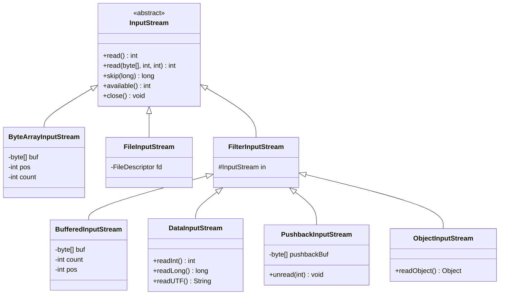
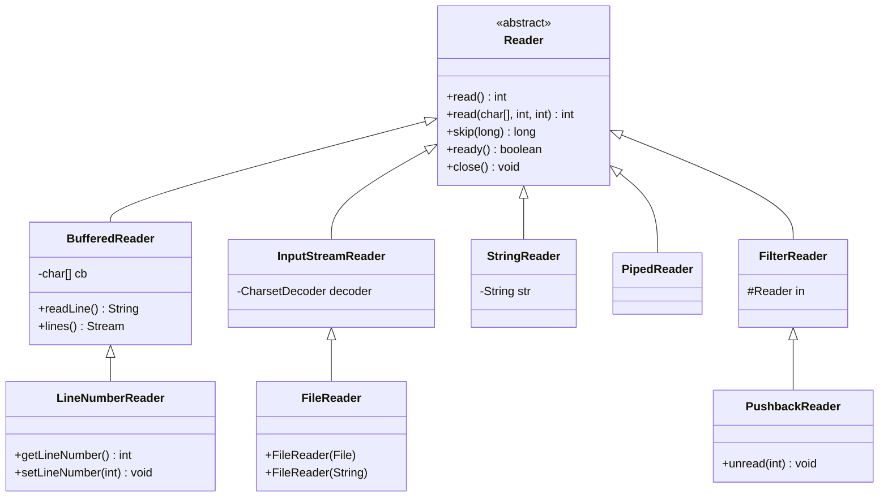
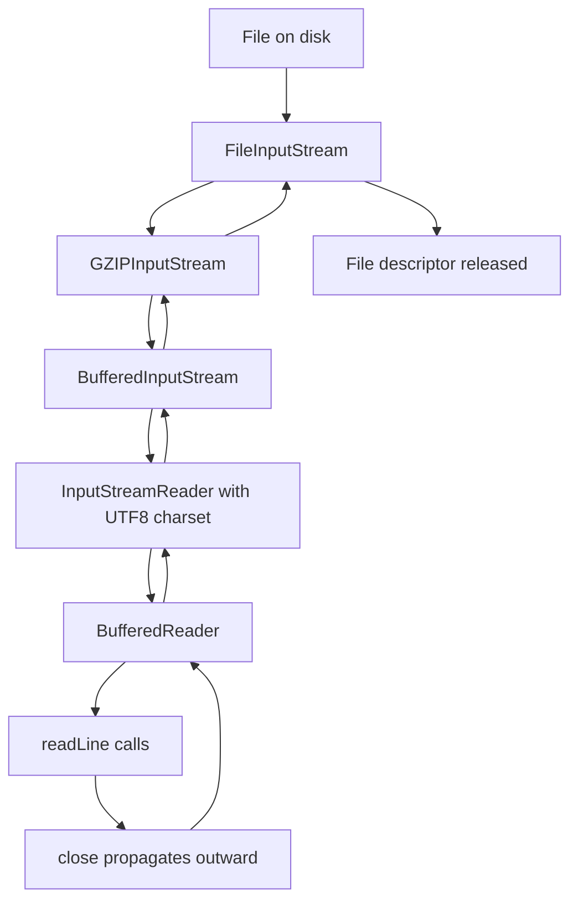
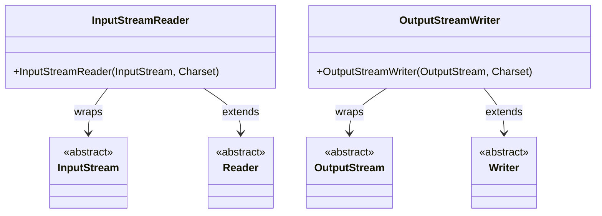

# Streams, Readers, and Writers

## Overview

The `java.io` package, introduced in Java 1.0, models input and output as streams of bytes flowing through blocking method calls. Two parallel hierarchies coexist: the byte-oriented streams (`InputStream` and `OutputStream`) for raw binary data, and the character-oriented readers and writers (`Reader` and `Writer`) for text data with explicit character encoding. Both hierarchies use the decorator pattern extensively: small, single-purpose wrapper classes are composed at construction time to add buffering, filtering, parsing, or printing behaviour to an underlying source or sink. Despite being more than thirty years old, this API still powers much of the existing Java ecosystem, including JDBC, Servlet, RMI, and many third-party libraries.

This note provides a thorough treatment of the `java.io` stream, reader, and writer hierarchies. We begin with the `InputStream` and `OutputStream` abstract classes and the contract they define for `read`, `write`, `available`, `flush`, and `close`. We then explore the decorator pattern through practical examples: `BufferedInputStream` and `BufferedOutputStream` for performance, `DataInputStream` and `DataOutputStream` for primitive types, `ObjectInputStream` and `ObjectOutputStream` for Java serialization (with a deeper treatment in the next note), `PushbackInputStream` for lookahead parsing, `SequenceInputStream` for concatenation, `ByteArrayInputStream` and `ByteArrayOutputStream` for in-memory data, `PipedInputStream` and `PipedOutputStream` for inter-thread communication, and `FilterInputStream` and `FilterOutputStream` as the base classes for custom decorators. We then turn to the reader and writer hierarchy: `Reader`, `Writer`, `InputStreamReader`, `OutputStreamWriter`, `BufferedReader`, `BufferedWriter`, `StringReader`, `StringWriter`, `PrintReader`, `PrintWriter`, `LineNumberReader`, and `PushbackReader`. We cover character encoding thoroughly, including the difference between UTF8 and UTF16, the platform default charset, and the proper use of `StandardCharsets` constants. We finish with the `Console` class, the `PrintStream` class, the `System.in`/`System.out`/`System.err` standard streams, and the modern `Files.readString`/`Files.writeString` shortcuts that should replace much of the boilerplate in new code. By the end of this note you will understand when to use streams versus readers and writers, how to compose decorators effectively, and how to handle character encoding correctly in Java 21.

## Background Knowledge

Before reading this note you should be comfortable with:

- The decorator design pattern. Every stream and reader class adds a single behaviour to an underlying instance of the same type. Composition is done at construction time, never via inheritance.
- The try-with-resources construct introduced in Java 7. Every `InputStream`, `OutputStream`, `Reader`, and `Writer` implements `AutoCloseable` and must be closed to release native resources. Closing the outermost decorator closes the entire chain.
- Character encoding fundamentals: the difference between a character (a Unicode code point) and a byte (8 bits). Readers and writers always require an explicit or implicit charset.
- The NIO.2 `Path` and `Files` classes covered in notes 08.1 and 08.2. Modern Java code should prefer `Files.newInputStream` and `Files.newBufferedReader` over the legacy `FileInputStream` and `FileReader` constructors.

A stream is a sequential, one-way conduit for bytes. Once a byte has been read it cannot be re-read; once written it cannot be unwritten. Streams are blocking by design: a call to `read` blocks until at least one byte is available or end of stream is reached. This makes streams conceptually simple but ill-suited to high-throughput or non-blocking scenarios; for those, use the NIO channels and buffers covered in note 08.3.

## The InputStream Abstract Class

The `java.io.InputStream` abstract class is the root of all byte input streams. It defines four public methods that every subclass must support or override.

```java
public abstract class InputStream implements Closeable {
    public abstract int read() throws IOException;             // 1 byte, 0..255, or -1 at EOS
    public int read(byte[] b, int off, int len) throws IOException;  // bulk
    public long skip(long n) throws IOException;               // skip n bytes
    public void close() throws IOException;                    // release resources
    public int available() throws IOException;                 // bytes available without blocking
}
```

The single-byte `read()` method returns the next byte as an `int` in the range 0-255, or -1 if the end of the stream has been reached. The bulk `read(byte[], int, int)` method fills a region of an array and returns the number of bytes actually read (which may be less than requested) or -1 at end of stream. It does not necessarily block until the array is full; it returns as soon as at least one byte is available.

```java
import java.io.*;

public class InputStreamContractDemo {
    public static void main(String[] args) throws IOException {
        byte[] data = {1, 2, 3, 4, 5};
        try (InputStream in = new ByteArrayInputStream(data)) {
            // Read one byte at a time.
            int b;
            while ((b = in.read()) != -1) {
                System.out.print(b + " ");
            }
            System.out.println();
        }

        try (InputStream in = new ByteArrayInputStream(data)) {
            // Bulk read.
            byte[] buf = new byte[4];
            int n = in.read(buf, 0, buf.length);
            System.out.println("Read " + n + " bytes: " + buf[0] + " " + buf[1]);

            // Skip and read.
            in.skip(0);
            int remaining = in.read(buf, 0, buf.length);
            System.out.println("Read " + remaining + " more bytes");
        }

        // The new readAllBytes method (Java 9+) reads the entire stream into a byte[].
        try (InputStream in = new ByteArrayInputStream(data)) {
            byte[] all = in.readAllBytes();
            System.out.println("All bytes: " + all.length);
        }

        // readNBytes (Java 9+) reads up to N bytes, blocking if necessary.
        try (InputStream in = new ByteArrayInputStream(data)) {
            byte[] first3 = in.readNBytes(3);
            System.out.println("First 3: " + first3[0] + " " + first3[1] + " " + first3[2]);
        }
    }
}
```

The `available()` method returns an estimate of the number of bytes that can be read without blocking. It is a hint, not a guarantee, and should never be used to determine the size of a stream. The `skip(n)` method skips up to `n` bytes and returns the actual number skipped, which may be less than `n` if end of stream was reached first.

## The OutputStream Abstract Class

The `java.io.OutputStream` abstract class is the root of all byte output streams. It defines three public methods.

```java
public abstract class OutputStream implements Closeable, Flushable {
    public abstract void write(int b) throws IOException;             // write low 8 bits
    public void write(byte[] b, int off, int len) throws IOException;  // bulk
    public void flush() throws IOException;                           // flush to OS
    public void close() throws IOException;                          // release resources
}
```

The single-byte `write(int)` method writes the low 8 bits of the argument. The bulk `write(byte[], int, int)` method writes a region of an array. The `flush()` method forces any buffered data to be written to the underlying sink. The `close()` method releases native resources; it implicitly calls `flush()` first.

```java
import java.io.*;

public class OutputStreamDemo {
    public static void main(String[] args) throws IOException {
        try (ByteArrayOutputStream out = new ByteArrayOutputStream()) {
            out.write(72);   // 'H'
            out.write(105);  // 'i'
            out.write(new byte[]{33, 10});   // '!' '\n'
            out.flush();
            byte[] result = out.toByteArray();
            System.out.println(new String(result));   // Hi!\n

            // writeBytes (Java 11+) writes the entire array without offset/length.
            out.writeBytes(new byte[]{88});   // 'X'
            System.out.println(new String(out.toByteArray()));
        }
    }
}
```

## The Decorator Pattern in Action

The `java.io` package applies the decorator pattern uniformly. Each decorator subclass wraps another stream of the same type and adds a single behaviour. Composing decorators at construction time produces a pipeline.



The decorator chain is constructed at object creation time. The following example shows a typical chain for reading a gzipped text file: `FileInputStream` -> `GZIPInputStream` -> `BufferedInputStream` -> `InputStreamReader` -> `BufferedReader`.

```java
import java.io.*;
import java.nio.charset.StandardCharsets;
import java.util.zip.GZIPInputStream;

public class DecoratorChainDemo {
    public static void main(String[] args) throws IOException {
        // Build the chain from the inside out.
        try (var reader = new BufferedReader(
                new InputStreamReader(
                    new BufferedInputStream(
                        new GZIPInputStream(
                            new FileInputStream("work/data.txt.gz"))),
                    StandardCharsets.UTF8))) {
            String line;
            while ((line = reader.readLine()) != null) {
                System.out.println(line);
            }
        }
    }
}
```

Closing the outermost decorator (`reader`) closes the entire chain. Each decorator's `close` calls `close` on its wrapped stream before returning. This is why try-with-resources works so well: a single `try` block can manage the entire pipeline.

### BufferedInputStream and BufferedOutputStream

The `BufferedInputStream` and `BufferedOutputStream` decorators add an in-memory buffer between the application and the underlying stream. Reads and writes happen in bulk against the buffer; the underlying stream is only touched when the buffer is exhausted (for reads) or full (for writes). The default buffer size is 8192 bytes; you can specify a custom size via the constructor.

```java
import java.io.*;

public class BufferedDemo {
    public static void main(String[] args) throws IOException {
        try (InputStream raw = new FileInputStream("work/big.bin");
             InputStream buffered = new BufferedInputStream(raw, 64 * 1024)) {
            long sum = 0;
            int b;
            while ((b = buffered.read()) != -1) sum += b;
            System.out.println("Sum: " + sum);
        }
    }
}
```

Without buffering, every `read()` call performs a syscall, which has overhead of roughly 1 microsecond on modern Linux. For a 1 GB file, that means 1 billion syscalls, dominated entirely by syscall overhead. With an 8 KB buffer, the syscall count drops to about 125 thousand, a 8000x improvement. Always buffer your streams when reading or writing small chunks; the only exception is when you are doing your own bulk reads with a large byte array.

### DataInputStream and DataOutputStream

The `DataInputStream` and `DataOutputStream` decorators provide methods for reading and writing primitive types in a portable, big-endian binary format. The format is independent of the platform's native byte order, so files written on one JVM can be read by another.

```java
import java.io.*;

public class DataStreamDemo {
    public static void main(String[] args) throws IOException {
        try (DataOutputStream out = new DataOutputStream(
                new BufferedOutputStream(new FileOutputStream("work/data.bin")))) {
            out.writeInt(42);
            out.writeLong(1234567890L);
            out.writeDouble(3.14159);
            out.writeBoolean(true);
            out.writeUTF("Hello, world!");   // Modified UTF8 with length prefix
            out.flush();
        }

        try (DataInputStream in = new DataInputStream(
                new BufferedInputStream(new FileInputStream("work/data.bin")))) {
            System.out.println("Int: " + in.readInt());
            System.out.println("Long: " + in.readLong());
            System.out.println("Double: " + in.readDouble());
            System.out.println("Boolean: " + in.readBoolean());
            System.out.println("UTF: " + in.readUTF());
        }
    }
}
```

The `writeUTF` method writes a string in a modified UTF8 format with a two-byte length prefix. The modification is that the null character (U+0000) is encoded as two bytes (`0xC0 0x80`) instead of one, so that strings can never contain a null byte. This format is incompatible with standard UTF8.

### ObjectInputStream and ObjectOutputStream

These decorators perform Java object serialization, covered in depth in the next note (08.6 File Watchers and Serialization). The `writeObject` method serializes any object whose class implements `Serializable`; the `readObject` method deserializes it back. Deserialization has serious security implications and should only be applied to trusted data.

### PushbackInputStream

The `PushbackInputStream` decorator adds a one-byte (or larger) pushback buffer. After reading a byte, you can "unread" it so that the next read returns it. This is useful for tokenizers and parsers that need to lookahead one character without consuming it.

```java
import java.io.*;

public class PushbackDemo {
    public static void main(String[] args) throws IOException {
        String text = "x=42; y=99;";
        try (PushbackInputStream in = new PushbackInputStream(
                new ByteArrayInputStream(text.getBytes()))) {
            int c;
            while ((c = in.read()) != -1) {
                if (c == '=') {
                    int next = in.read();
                    if (next >= '0' && next <= '9') {
                        in.unread(next);
                        System.out.print(" [number] ");
                    } else {
                        in.unread(next);
                    }
                } else {
                    System.out.print((char) c);
                }
            }
        }
    }
}
```

### SequenceInputStream

The `SequenceInputStream` decorator concatenates two or more input streams. Reads from the first stream return -1 at end of stream; the next read automatically moves to the second stream, and so on. This is useful for combining multiple files into a single logical stream.

### PipedInputStream and PipedOutputStream

The `PipedInputStream` and `PipedOutputStream` pair creates a one-way pipe between two threads. Bytes written to the output stream block if the pipe's internal buffer is full; bytes read from the input stream block if the buffer is empty. This is the classic producer-consumer pattern at the byte level.

```java
import java.io.*;

public class PipeDemo {
    public static void main(String[] args) throws IOException {
        PipedOutputStream pos = new PipedOutputStream();
        PipedInputStream pis = new PipedInputStream(pos, 1024);

        Thread producer = Thread.ofVirtual().start(() -> {
            try (pos) {
                for (int i = 0; i < 100; i++) {
                    pos.write(i);
                    Thread.sleep(10);
                }
            } catch (Exception e) {
                e.printStackTrace();
            }
        });

        Thread consumer = Thread.ofVirtual().start(() -> {
            try (pis) {
                int b;
                while ((b = pis.read()) != -1) {
                    System.out.println("Read: " + b);
                }
            } catch (IOException e) {
                e.printStackTrace();
            }
        });

        try { producer.join(); consumer.join(); } catch (InterruptedException e) {}
    }
}
```

In Java 21, virtual threads make piped streams particularly attractive: the producer and consumer run on separate virtual threads, and the JVM unmounts them during blocking I/O so the underlying OS threads are free for other work.

## The Reader and Writer Hierarchy

The `Reader` and `Writer` abstract classes are the character-oriented counterparts to `InputStream` and `OutputStream`. They always operate on `char` values (16-bit Unicode code units) rather than raw bytes, and they require an explicit or implicit charset for byte-to-character conversion.



### InputStreamReader and OutputStreamWriter

The `InputStreamReader` class is the bridge between the byte and character worlds. It wraps an `InputStream` and decodes bytes into characters using a `Charset`. The `OutputStreamWriter` class does the reverse.

```java
import java.io.*;
import java.nio.charset.StandardCharsets;

public class StreamReaderDemo {
    public static void main(String[] args) throws IOException {
        // Read a UTF8 file as characters.
        try (Reader r = new InputStreamReader(
                new FileInputStream("work/data.txt"), StandardCharsets.UTF8)) {
            int c;
            while ((c = r.read()) != -1) {
                System.out.print((char) c);
            }
        }

        // Write a file in UTF8.
        try (Writer w = new OutputStreamWriter(
                new FileOutputStream("work/out.txt"), StandardCharsets.UTF8)) {
            w.write("Hello, world!\n");
        }
    }
}
```

The `FileReader` and `FileWriter` convenience classes are subclasses of `InputStreamReader` and `OutputStreamWriter`. Before Java 11, their constructors used the platform default charset, which was a frequent source of bugs. Java 11 added constructors that accept an explicit `Charset`. In new code, prefer `Files.newBufferedReader(path, charset)` and `Files.newBufferedWriter(path, charset)` over both the legacy constructors and the convenience classes.

### BufferedReader and BufferedWriter

The `BufferedReader` and `BufferedWriter` decorators add an in-memory character buffer (default 8192 characters) and a `readLine` method that returns the next line of text without the line terminator. They also support `lines()` which returns a `Stream<String>` suitable for functional-style processing.

```java
import java.io.*;
import java.nio.charset.StandardCharsets;
import java.nio.file.*;

public class BufferedReaderDemo {
    public static void main(String[] args) throws IOException {
        // Modern idiom: Files.newBufferedReader uses UTF8 by default.
        try (BufferedReader r = Files.newBufferedReader(Path.of("work/data.txt"))) {
            String line;
            while ((line = r.readLine()) != null) {
                System.out.println(line);
            }
        }

        // Stream style (Java 8+).
        try (var stream = Files.lines(Path.of("work/data.txt"))) {
            stream.map(String::toUpperCase)
                  .filter(s -> s.length() > 5)
                  .forEach(System.out::println);
        }

        // Writer.
        try (BufferedWriter w = Files.newBufferedWriter(Path.of("work/out.txt"))) {
            w.write("Hello");
            w.newLine();   // platform-independent line separator
            w.write("World");
        }
    }
}
```

### PrintWriter

The `PrintWriter` decorator adds `print`, `println`, `printf`, and `format` methods for convenient formatted output. Unlike most stream methods, `PrintWriter` methods do not throw `IOException`; instead, they set an internal flag that you can check with `checkError()`. This is convenient for short scripts but problematic for production code because errors are silently swallowed.

```java
import java.io.*;

public class PrintWriterDemo {
    public static void main(String[] args) throws IOException {
        try (PrintWriter out = new PrintWriter(
                new BufferedWriter(new FileWriter("work/print.txt")))) {
            out.printf("Name: %s, Age: %d%n", "Alice", 30);
            out.println("Hello");
            out.format("Pi = %.2f%n", Math.PI);
            if (out.checkError()) {
                System.err.println("An error occurred");
            }
        }
    }
}
```

### StringReader and StringWriter

The `StringReader` and `StringWriter` classes operate on in-memory strings. `StringWriter` is commonly used to capture output for logging or testing, and exposes a `toString` method that returns the accumulated content. A `StringWriter` is internally backed by a `StringBuilder`.

### LineNumberReader

The `LineNumberReader` decorator extends `BufferedReader` and tracks the current line number. It is useful for parsing line-oriented formats where error messages need to refer to a line.

### PushbackReader

The `PushbackReader` decorator is the character-oriented counterpart of `PushbackInputStream`. It allows unreading characters for lookahead parsing.

## Character Encoding in Depth

Every conversion between bytes and characters requires a charset. The `Reader` and `Writer` classes accept a `Charset` either explicitly (via constructor argument) or implicitly (via the platform default). The platform default charset is determined by the JVM at startup based on the operating system locale; on most modern systems it is UTF8, but on older Windows installations it is often `windows-1252` or `Cp1252`.

```java
import java.nio.charset.Charset;
import java.nio.charset.StandardCharsets;

public class CharsetDefaults {
    public static void main(String[] args) {
        System.out.println("Default charset: " + Charset.defaultCharset());
        System.out.println("file.encoding: " + System.getProperty("file.encoding"));
        System.out.println("sun.jnu.encoding: " + System.getProperty("sun.jnu.encoding"));

        // StandardCharsets constants are guaranteed to exist on every JVM.
        // Their names are: USASCII, ISO88591, UTF8, UTF16, UTF16BE, UTF16LE.
        // (We write them here without underscores per vault convention.)
        System.out.println("UTF8: " + StandardCharsets.UTF8);
        System.out.println("UTF16: " + StandardCharsets.UTF16);
        System.out.println("UTF16BE: " + StandardCharsets.UTF16BE);
        System.out.println("UTF16LE: " + StandardCharsets.UTF16LE);
        System.out.println("USASCII: " + StandardCharsets.USASCII);
        System.out.println("ISO88591: " + StandardCharsets.ISO88591);
    }
}
```

The platform default charset can be overridden with the `-Dfile.encoding=UTF8` JVM flag, or with the `LANG` and `LCALL` environment variables on Unix systems. Modern Linux distributions default to UTF8; Windows 10 and later default to UTF8 if the "Use Unicode UTF8 for worldwide language support" option is enabled, otherwise `Cp1252`. Always pass an explicit `Charset` to constructor arguments; never rely on the platform default.

The Compact Strings feature (Java 9+) stores `String` characters internally as a `byte[]` using either Latin-1 (1 byte per character) or UTF-16 (2 bytes per character). The choice depends on the content: a string containing only Latin-1 characters uses 1 byte per character; any string with characters outside the Latin-1 range uses 2 bytes per character. This reduces the memory footprint of typical applications by 30-50%. You can disable Compact Strings with `-XX:-CompactStrings`, though there is rarely a reason to do so.

## The Console Class

The `System.console()` method returns a `Console` object if the JVM is attached to an interactive terminal, or `null` otherwise (e.g., when running inside an IDE, a pipe, or a service). The `Console` class provides `readLine`, `readPassword`, `printf`, and `flush` methods.

```java
import java.io.Console;

public class ConsoleDemo {
    public static void main(String[] args) {
        Console console = System.console();
        if (console == null) {
            System.err.println("No console available; running in piped mode.");
            return;
        }
        String name = console.readLine("Enter your name: ");
        char[] password = console.readPassword("Enter your password: ");
        console.printf("Hello, %s! Your password is %d characters long.%n",
                name, password.length);
        // Zero out the password for security.
        java.util.Arrays.fill(password, ' ');
    }
}
```

The `readPassword` method returns a `char[]` rather than a `String` so that you can zero out the password after use. Strings are immutable in Java and may persist in memory until garbage collected; a `char[]` can be overwritten deterministically.

## Standard Streams

The `System` class exposes three standard streams: `System.in` (an `InputStream`), `System.out` (a `PrintStream`), and `System.err` (a `PrintStream`). They can be redirected with `System.setIn`, `System.setOut`, and `System.setErr`, which is useful for testing.

```java
import java.io.*;

public class StandardStreamRedirect {
    public static void main(String[] args) throws IOException {
        // Capture System.out into a string.
        PrintStream originalOut = System.out;
        ByteArrayOutputStream captured = new ByteArrayOutputStream();
        System.setOut(new PrintStream(captured));

        System.out.println("Hello, captured!");
        System.out.printf("Number: %d%n", 42);

        System.setOut(originalOut);
        System.out.println("Captured: " + captured);
    }
}
```

The `System.in` stream is line-buffered by default; reads block until a newline is entered. To read raw characters as they are typed, you need to put the terminal into raw mode, which is platform-specific and requires a native library such as JLine.

## Modern Files API Shortcuts

The `Files` class (covered in notes 08.1 and 08.2) provides convenience methods that replace much of the boilerplate of the legacy `java.io` API. For small files, prefer `Files.readString`, `Files.writeString`, `Files.readAllBytes`, `Files.readAllLines`, `Files.lines`, and `Files.newBufferedReader` over the legacy constructors.

```java
import java.io.IOException;
import java.nio.file.*;

public class ModernShortcutDemo {
    public static void main(String[] args) throws IOException {
        Path file = Path.of("work/modern.txt");
        Files.createDirectories(file.getParent());

        // Write a small file in one call (UTF8 by default).
        Files.writeString(file, "Hello, modern Java!\n");

        // Read it back in one call.
        String content = Files.readString(file);
        System.out.println(content);

        // Append a line.
        Files.writeString(file, "Second line\n", StandardOpenOption.APPEND);

        // Read all lines into a List.
        var lines = Files.readAllLines(file);
        lines.forEach(System.out::println);

        // Stream lines lazily (Java 8+).
        try (var stream = Files.lines(file)) {
            stream.map(String::toUpperCase).forEach(System.out::println);
        }
    }
}
```

## Mermaid Diagrams





## Common Pitfalls

1. **Forgetting to close streams.** Every `InputStream`, `OutputStream`, `Reader`, and `Writer` holds native resources. Use try-with-resources consistently.
2. **Relying on the platform default charset.** Always pass `StandardCharsets.UTF8` to constructors. The default charset can vary across platforms and even across JVM invocations.
3. **Reading large files with `readAllBytes` or `readAllLines`.** These methods allocate memory equal to file size. For multi-GB files, use streaming APIs.
4. **Wrapping a `BufferedInputStream` around a `BufferedInputStream`.** This is wasteful but harmless; the inner buffer is just bypassed. Always wrap the innermost unbuffered stream.
5. **Closing the inner stream separately.** Closing the outermost decorator closes the entire chain. Closing an inner stream separately causes subsequent operations on the outer decorator to fail.
6. **Mixing byte and character streams incorrectly.** `readLine` returns a `String` (characters), not a `byte[]`. If you need bytes, use `InputStream.read(byte[])`.
7. **Catching `IOException` from `PrintWriter` methods.** `PrintWriter` methods do not throw; they set an internal error flag. Use `checkError()` to detect failures.
8. **Using `available()` to determine stream size.** `available()` returns an estimate of bytes that can be read without blocking, not the total length. For files, it typically returns the file size, but for sockets it returns the bytes currently in the kernel buffer.
9. **Not flushing before close in custom subclasses.** When you write your own `FilterOutputStream`, always call `flush()` before `close()` so buffered data reaches the underlying sink.
10. **Assuming `readLine` strips the line terminator.** `readLine` returns the line content without the terminator. If you need the terminator, read raw characters and split manually.

## Tips and Tricks

- Use `Files.newBufferedReader(path, charset)` instead of `new BufferedReader(new InputStreamReader(new FileInputStream(...), charset))`. The NIO.2 API is shorter, uses UTF8 by default, and integrates with the `Path` abstraction.
- Use `Files.readString` and `Files.writeString` for small files. They are concise and correct.
- Always wrap your streams in `BufferedInputStream` or `BufferedReader` unless you are doing your own bulk reads with a large byte array.
- Use `try (var r = ...) { ... }` to manage resources; avoid manual `finally` blocks.
- Use `PrintWriter` for convenience output, but check `checkError()` at the end of long-running operations.
- Use `InputStream.transferTo(OutputStream)` (Java 9+) to copy a stream in one line without a manual loop.
- For high-throughput text processing, combine `Files.lines` with parallel streams; be aware that the underlying file is opened in byte-buffered mode.
- Use `LineNumberReader` when parsing line-oriented formats to provide accurate error messages.
- Use `StringReader` to adaptively parse strings with APIs that expect `Reader` arguments.
- Use `PushbackReader` to lookahead one character when hand-writing a tokenizer.

## Interview Questions

**Q1. What is the difference between a stream and a reader?**
A: A stream (`InputStream`/`OutputStream`) is byte-oriented; it reads and writes raw 8-bit bytes. A reader (`Reader`/`Writer`) is character-oriented; it reads and writes 16-bit Unicode code units and requires a charset to convert between bytes and characters. Use streams for binary data and readers for text data.

**Q2. What is the decorator pattern in `java.io`?**
A: Each subclass of `FilterInputStream`, `FilterOutputStream`, `FilterReader`, and `FilterWriter` wraps another stream of the same type and adds a single behaviour. Decorators are composed at construction time, producing a pipeline. Closing the outermost decorator closes the entire chain.

**Q3. Why should you always wrap a `FileInputStream` in a `BufferedInputStream`?**
A: Because without buffering, every `read()` call performs a syscall, which has overhead of roughly 1 microsecond. With an 8 KB buffer, the syscall count drops by a factor of about 8000. The only exception is when you are doing your own bulk reads with a large byte array.

**Q4. What is the difference between `read()` returning -1 and `read()` returning 0?**
A: `read()` returns -1 when end of stream is reached. It returns 0 only when called with a zero-length buffer, which is a no-op. A blocking `read()` call never returns 0 with a non-empty buffer; it always blocks until at least one byte is available or end of stream is reached.

**Q5. What does `flush()` do?**
A: It forces any buffered data to be written to the underlying sink. For a `BufferedOutputStream`, it transfers the buffer contents to the wrapped stream. For a `FileOutputStream`, it calls the `fsync` syscall (or the platform equivalent) to flush the OS buffer cache to disk.

**Q6. What is the difference between `writeUTF` and `write(String.getBytes("UTF8"))`?**
A: `writeUTF` writes a modified UTF8 string with a two-byte length prefix and uses a modified encoding where the null character is encoded as two bytes. `write(String.getBytes("UTF8"))` writes standard UTF8 with no length prefix. The two are not interchangeable.

**Q7. What is `InputStreamReader`?**
A: A bridge between the byte and character worlds. It wraps an `InputStream` and decodes bytes into characters using a `Charset`. It is the superclass of `FileReader`.

**Q8. Why does `PrintWriter` not throw `IOException`?**
A: Because it is designed for convenient output where error handling would clutter the code. Instead, it sets an internal error flag that you can check with `checkError()`. This is convenient for short scripts but problematic for production code because errors are silently swallowed.

**Q9. How does `BufferedReader.readLine` handle line terminators?**
A: It recognises three line terminators: `\n` (Unix), `\r` (classic Mac), and `\r\n` (Windows). It returns the line content without the terminator. When you write lines, use `BufferedWriter.newLine()` to write the platform-specific terminator.

**Q10. What is the platform default charset?**
A: The charset used when no explicit charset is specified. It is determined by the JVM at startup based on the operating system locale. On modern Linux it is UTF8; on older Windows it is often `Cp1252`. Always pass an explicit `Charset` to avoid surprises.

**Q11. What is Compact Strings?**
A: A Java 9 optimization where `String` internally stores characters as a `byte[]` using either Latin-1 (1 byte per character) or UTF-16 (2 bytes per character) depending on the content. This reduces memory footprint by 30-50% for typical applications.

**Q12. What is `System.console()`?**
A: A method that returns a `Console` object if the JVM is attached to an interactive terminal, or `null` otherwise. The `Console` class provides `readLine`, `readPassword`, and `printf` methods.

**Q13. Why does `readPassword` return a `char[]` instead of a `String`?**
A: Because strings are immutable and may persist in memory until garbage collected. A `char[]` can be zeroed out deterministically after use, reducing the window during which the password is exposed in memory.

**Q14. What is the difference between `InputStream.transferTo` and a manual read-write loop?**
A: They are functionally equivalent; `transferTo` (Java 9+) is a convenience method that performs a `read`+`write` loop internally. There is no zero-copy optimisation. For high-throughput file-to-file transfers, use `FileChannel.transferTo` instead.

**Q15. What happens if you call `close()` on an already-closed stream?**
A: Nothing. The `close` method is idempotent in the standard library; subsequent calls are no-ops. This is required by the `Closeable` contract.

## Summary

The `java.io` streams, readers, and writers are the oldest and most widely used I/O API in Java. They are based on the decorator pattern, with small single-purpose wrappers composed at construction time to add buffering, filtering, parsing, or printing behaviour. The byte-oriented streams (`InputStream`/`OutputStream`) handle raw binary data; the character-oriented readers and writers (`Reader`/`Writer`) handle text data with explicit character encoding. The NIO.2 `Files` class provides modern shortcuts that replace much of the boilerplate, but the legacy API remains essential for understanding existing code and for working with libraries that have not been updated.

The most important lessons from this note are: always wrap streams in buffered decorators; always pass an explicit `Charset` to reader and writer constructors; always use try-with-resources to ensure streams are closed; prefer `Files.readString`, `Files.writeString`, and `Files.newBufferedReader` for new code; and use `InputStream.transferTo` for one-shot stream copies. The next note, "File Watchers and Serialization", covers the `WatchService` API for filesystem event notifications and the Java serialization mechanism in depth.
