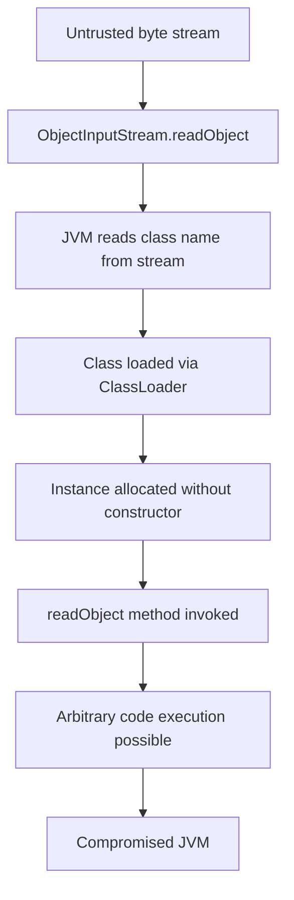
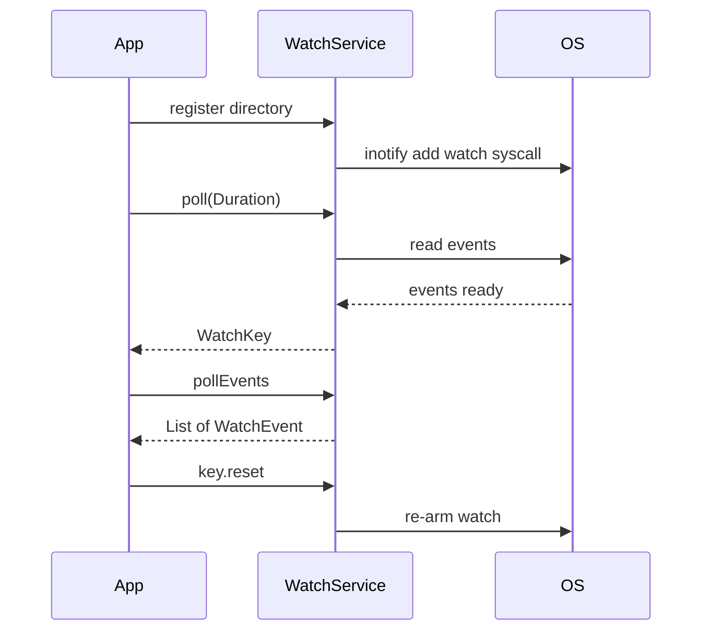
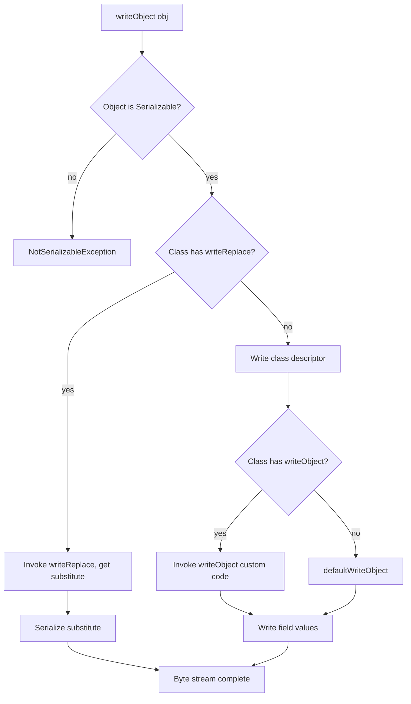

# File Watchers and Serialization

## Overview

This note brings together two loosely related topics that round out the Java I/O landscape: the `WatchService` API for reacting to file system events, and the Java serialization framework for converting objects to and from byte streams. The `WatchService` API, introduced in Java 7 as part of NIO.2, wraps platform-specific notification mechanisms such as Linux `inotify`, macOS `FSEvents`, and Windows `ReadDirectoryChangesW`, providing a uniform, polling-based API for detecting file creation, modification, deletion, and overflow events. Java serialization, introduced in Java 1.1, was for many years the standard way to persist and transmit Java objects, but its security vulnerabilities have led to its deprecation in modern code; JEP 154 formally deprecated serialization for removal, and the Java ecosystem is migrating to alternatives such as JSON, Protocol Buffers, and the serialization proxy pattern.

This note covers both topics in depth. We begin with `WatchService`: how to register a directory for events, how to poll for events with `take`, `poll`, and `poll(Duration)`, the four standard event kinds (`ENTRYCREATE`, `ENTRYMODIFY`, `ENTRYDELETE`, `OVERFLOW`), how to handle the `WatchKey` lifecycle, and the limitations of the API (no recursive watching, possible event loss, possible coalescing). We then turn to serialization: the `Serializable` marker interface, the `serialVersionUID` field, the `transient` keyword, the `ObjectInputStream` and `ObjectOutputStream` classes, custom `readObject` and `writeObject` methods, the `readResolve` and `writeReplace` hooks for substituting objects, the `Externalizable` interface for performance, the security risks of deserializing untrusted data, and the `ObjectInputFilter` defence mechanism introduced in Java 9. We finish with the serialization proxy pattern, which provides a clean, secure alternative to custom serialization. By the end of this note you will be able to write a `WatchService` event loop correctly, understand the security risks of Java serialization, and choose appropriate alternatives for new code.

## Background Knowledge

Before reading this note you should be comfortable with:

- The `Path` and `Files` classes, covered in notes 08.1 and 08.2. `WatchService` operates on `Path` instances.
- The try-with-resources construct. Both `WatchService` and `ObjectInputStream`/`ObjectOutputStream` are `Closeable`.
- Concurrency primitives such as `BlockingQueue` and `ExecutorService`. The `WatchService` API is conceptually a blocking queue of `WatchKey` events.
- The Java class loader and reflection mechanism, covered in note 09.4. Deserialization uses reflection to instantiate objects without calling constructors.
- The Java memory model and how `volatile` fields interact with object initialization. Deserialization bypasses constructors, which has subtle implications for final field initialization.

A file watcher is a notification mechanism that delivers events when files or directories change. The kernel maintains an event queue per watched directory; the JVM reads from this queue and translates events into Java `WatchEvent` instances. A serialized object is a binary representation of an object's state that can be stored in a file, sent over a network, or persisted in a database. The representation includes the class name, the serialVersionUID, the field names, and the field values. On deserialization, the JVM uses reflection to allocate a new instance without calling any constructor, then assigns each field directly from the stream.

## The WatchService API

The `WatchService` API provides event notifications when files and directories change. It is the modern replacement for the legacy `java.io.File` polling pattern in which you repeatedly called `lastModified` and `exists` to detect changes.

### Creating and Registering a WatchService

```java
import java.io.IOException;
import java.nio.file.*;
import java.time.Duration;

public class WatchServiceBasics {
    public static void main(String[] args) throws IOException, InterruptedException {
        try (WatchService watcher = FileSystems.getDefault().newWatchService()) {
            Path dir = Path.of("work/watch-basics");
            java.nio.file.Files.createDirectories(dir);

            // Register the directory for entry create, modify, and delete events.
            // The OVERFLOW event is implicitly always enabled.
            WatchKey key = dir.register(watcher,
                    StandardWatchEventKinds.ENTRYCREATE,
                    StandardWatchEventKinds.ENTRYMODIFY,
                    StandardWatchEventKinds.ENTRYDELETE);

            System.out.println("Watching " + dir.toAbsolutePath() + " for 30 seconds...");

            long deadline = System.currentTimeMillis() + 30000L;
            while (System.currentTimeMillis() < deadline) {
                // Poll with a timeout to allow periodic shutdown checks.
                WatchKey k = watcher.poll(Duration.ofSeconds(1));
                if (k == null) continue;

                for (WatchEvent<?> event : k.pollEvents()) {
                    Path context = (Path) event.context();
                    Path full = dir.resolve(context);
                    System.out.println(event.kind() + " -> " + full);

                    if (event.kind() == StandardWatchEventKinds.OVERFLOW) {
                        System.err.println("  (events may have been lost; rescan recommended)");
                        continue;
                    }
                }

                // Reset the key to receive future events. If reset returns false,
                // the key is no longer valid (directory was deleted or watcher closed).
                boolean valid = k.reset();
                if (!valid) {
                    System.out.println("Key no longer valid; exiting loop.");
                    break;
                }
            }
        }
    }
}
```

The `register` method accepts a varargs of `WatchEvent.Kind<?>` values. The four standard kinds are exposed as constants on `StandardWatchEventKinds`:

- `ENTRYCREATE` - a file or directory was created.
- `ENTRYMODIFY` - a file or directory was modified (contents or metadata).
- `ENTRYDELETE` - a file or directory was deleted.
- `OVERFLOW` - events were lost because the kernel's event buffer overflowed. This kind is always enabled, even if not explicitly requested.

The `event.context()` method returns the file name (a relative `Path`) of the file that triggered the event. The path is relative to the watched directory; you must call `dir.resolve(context)` to obtain the full path.

### Polling Methods

The `WatchService` interface exposes three polling methods:

- `take()` - blocks indefinitely until at least one key is ready, then returns it.
- `poll()` - returns a ready key immediately, or `null` if no key is ready.
- `poll(long, TimeUnit)` - blocks for up to the specified duration, then returns a ready key or `null`.
- `poll(Duration)` - Java 11+ variant that accepts a `java.time.Duration`.

For long-running services, prefer `poll(Duration.ofSeconds(N))` over `take()` because the periodic wake-up lets you check shutdown flags and other conditions. For one-shot watchers, `take()` is simpler.

### Recursive Watching

The `WatchService` API does not support recursive watching out of the box. To watch an entire directory tree, you must register each subdirectory explicitly. The standard pattern is to walk the tree once with `Files.walkFileTree`, register each directory, and then watch for `ENTRYCREATE` events on directories to register new subdirectories as they are created.

```java
import java.io.IOException;
import java.nio.file.*;
import java.nio.file.attribute.BasicFileAttributes;
import java.util.HashMap;
import java.util.Map;

public class RecursiveWatcher {
    private final WatchService watcher;
    private final Map<WatchKey, Path> keys = new HashMap<>();

    public RecursiveWatcher() throws IOException {
        watcher = FileSystems.getDefault().newWatchService();
    }

    public void registerAll(Path root) throws IOException {
        Files.walkFileTree(root, new SimpleFileVisitor<>() {
            @Override
            public FileVisitResult preVisitDirectory(Path dir, BasicFileAttributes attrs) throws IOException {
                WatchKey key = dir.register(watcher,
                        StandardWatchEventKinds.ENTRYCREATE,
                        StandardWatchEventKinds.ENTRYMODIFY,
                        StandardWatchEventKinds.ENTRYDELETE);
                keys.put(key, dir);
                return FileVisitResult.CONTINUE;
            }
        });
    }

    public void processEvents() {
        while (true) {
            WatchKey key;
            try {
                key = watcher.take();
            } catch (InterruptedException e) {
                return;
            }
            Path dir = keys.get(key);
            if (dir == null) continue;

            for (WatchEvent<?> event : key.pollEvents()) {
                if (event.kind() == StandardWatchEventKinds.OVERFLOW) continue;
                Path name = (Path) event.context();
                Path child = dir.resolve(name);

                System.out.println(event.kind() + " -> " + child);

                // If a new directory was created, register it recursively.
                if (event.kind() == StandardWatchEventKinds.ENTRYCREATE
                        && Files.isDirectory(child, java.nio.file.LinkOption.NOFOLLOWLINKS)) {
                    try { registerAll(child); } catch (IOException e) { /* log */ }
                }
            }
            boolean valid = key.reset();
            if (!valid) keys.remove(key);
        }
    }

    public static void main(String[] args) throws IOException {
        RecursiveWatcher rw = new RecursiveWatcher();
        rw.registerAll(Path.of("work/watch-recursive"));
        rw.processEvents();
    }
}
```

### Limitations of WatchService

1. **Only directories can be registered.** You cannot watch an individual file; register its parent directory and filter by `event.context()`.
2. **Events may be coalesced.** Multiple rapid modifications to a file may produce a single `ENTRYMODIFY` event.
3. **Events may be lost.** If the kernel's event buffer overflows, you receive an `OVERFLOW` event. You must rescan the directory to recover.
4. **Recursive watching must be implemented manually.** New subdirectories must be registered as they are created.
5. **Latency varies by platform.** Linux `inotify` delivers events in milliseconds; macOS `FSEvents` may coalesce events over several seconds; Windows `ReadDirectoryChangesW` typically delivers within a second.
6. **No information about the modifying process.** The event tells you what changed but not which process changed it.
7. **The event context is a relative path.** You must resolve it against the watched directory to obtain the full path.

## Java Serialization

Serialization is the process of converting an object's state into a byte stream; deserialization is the reverse. Java's built-in serialization, accessed through the `Serializable` marker interface and the `ObjectInputStream`/`ObjectOutputStream` classes, has been part of the platform since Java 1.1. It is convenient but has serious security implications that have led to its decline in modern code.

### The Serializable Marker Interface

```java
import java.io.*;

public class SerializationBasics {
    // A class is serializable if it implements java.io.Serializable.
    // Serializable is a marker interface: it declares no methods.
    public static class User implements Serializable {
        // Each serializable class should declare an explicit serialVersionUID.
        // If not declared, the compiler computes one based on the class structure,
        // which breaks compatibility when the class evolves.
        private static final long serialVersionUID = 1L;

        private String name;
        private int age;
        private transient String sessionToken;  // not serialized

        public User(String name, int age) {
            this.name = name;
            this.age = age;
            this.sessionToken = "initial";
        }

        @Override
        public String toString() {
            return "User{name='" + name + "', age=" + age + ", token='" + sessionToken + "'}";
        }
    }

    public static void main(String[] args) throws IOException, ClassNotFoundException {
        User original = new User("Alice", 30);

        // Serialize.
        ByteArrayOutputStream baos = new ByteArrayOutputStream();
        try (ObjectOutputStream out = new ObjectOutputStream(baos)) {
            out.writeObject(original);
        }
        byte[] bytes = baos.toByteArray();
        System.out.println("Serialized size: " + bytes.length + " bytes");

        // Deserialize.
        try (ObjectInputStream in = new ObjectInputStream(new ByteArrayInputStream(bytes))) {
            User restored = (User) in.readObject();
            System.out.println("Restored: " + restored);
            // sessionToken is null because it was marked transient.
        }
    }
}
```

The `Serializable` interface declares no methods; it is a marker that tells the JVM the class is willing to participate in serialization. The actual serialization logic is implemented by `ObjectOutputStream.writeObject` and `ObjectInputStream.readObject`, which use reflection to read and write fields.

### The serialVersionUID Field

Every serializable class has a version number called the `serialVersionUID`. If you do not declare one explicitly, the compiler computes one based on the class structure (field names, types, modifiers, method signatures). If the class changes (e.g., you add a field), the computed value changes, and deserialization of old data fails with `InvalidClassException`.

Always declare an explicit `serialVersionUID`:

```java
public class User implements Serializable {
    private static final long serialVersionUID = 1L;
    // ... fields ...
}
```

This lets you evolve the class (add fields, remove fields) while still being able to deserialize older data, as long as the changes are compatible. Incompatible changes include changing the type of a field, changing the class hierarchy, or removing a field whose value cannot be defaulted.

### The transient Keyword

A field marked `transient` is skipped during serialization. On deserialization, it receives the default value for its type (`null` for objects, `0` for numbers, `false` for booleans). Use `transient` for fields that should not be persisted: passwords, session tokens, cached values, references to non-serializable resources, and computed fields that can be reconstructed from other fields.

### Custom Serialization with readObject and writeObject

You can take control of serialization by defining `private void writeObject(ObjectOutputStream out)` and `private void readObject(ObjectInputStream in)` methods. These methods are called by the `ObjectOutputStream` and `ObjectInputStream` via reflection; their visibility must be `private`.

```java
import java.io.*;

public class CustomSerialization {
    public static class Password implements Serializable {
        private static final long serialVersionUID = 1L;
        private transient char[] password;   // not serialized by default

        public Password(String password) {
            this.password = password.toCharArray();
        }

        private void writeObject(ObjectOutputStream out) throws IOException {
            out.defaultWriteObject();        // write all non-transient fields
            // Encrypt the password before writing.
            out.writeInt(password.length);
            for (char c : password) {
                out.writeChar(c ^ 0x5A);    // trivial XOR for demonstration
            }
        }

        private void readObject(ObjectInputStream in) throws IOException, ClassNotFoundException {
            in.defaultReadObject();
            int len = in.readInt();
            password = new char[len];
            for (int i = 0; i < len; i++) {
                password[i] = (char) (in.readChar() ^ 0x5A);
            }
        }

        public boolean matches(String attempt) {
            char[] a = attempt.toCharArray();
            if (a.length != password.length) return false;
            boolean ok = true;
            for (int i = 0; i < a.length; i++) {
                if (a[i] != password[i]) ok = false;
            }
            return ok;
        }
    }

    public static void main(String[] args) throws IOException, ClassNotFoundException {
        Password p = new Password("secret");
        ByteArrayOutputStream baos = new ByteArrayOutputStream();
        try (ObjectOutputStream out = new ObjectOutputStream(baos)) {
            out.writeObject(p);
        }

        try (ObjectInputStream in = new ObjectInputStream(new ByteArrayInputStream(baos.toByteArray()))) {
            Password restored = (Password) in.readObject();
            System.out.println("Matches 'secret': " + restored.matches("secret"));
            System.out.println("Matches 'wrong': " + restored.matches("wrong"));
        }
    }
}
```

The `defaultWriteObject` and `defaultReadObject` methods handle the non-transient fields; you handle the rest. Always call them first so that the stream stays aligned with the standard format.

### readResolve and writeReplace

These methods let you substitute a different object during serialization or deserialization. They are commonly used to implement serialization-safe singletons and proxies.

```java
import java.io.*;

public class SingletonSerialization {
    public enum Singleton {
        INSTANCE;
        private int counter = 0;
        public void increment() { counter++; }
        public int getCounter() { return counter; }
    }

    // For a non-enum singleton, you need readResolve.
    public static class ClassicSingleton implements Serializable {
        private static final long serialVersionUID = 1L;
        public static final ClassicSingleton INSTANCE = new ClassicSingleton();
        private int counter = 0;
        private ClassicSingleton() {}
        public void increment() { counter++; }
        public int getCounter() { return counter; }

        // Without this, deserialization creates a new instance.
        private Object readResolve() {
            return INSTANCE;
        }
    }

    public static void main(String[] args) throws IOException, ClassNotFoundException {
        ClassicSingleton.INSTANCE.increment();
        ClassicSingleton.INSTANCE.increment();
        System.out.println("Before: " + ClassicSingleton.INSTANCE.getCounter());

        ByteArrayOutputStream baos = new ByteArrayOutputStream();
        try (ObjectOutputStream out = new ObjectOutputStream(baos)) {
            out.writeObject(ClassicSingleton.INSTANCE);
        }
        try (ObjectInputStream in = new ObjectInputStream(new ByteArrayInputStream(baos.toByteArray()))) {
            ClassicSingleton restored = (ClassicSingleton) in.readObject();
            System.out.println("After: " + restored.getCounter());   // 2, same instance
            System.out.println("Same instance: " + (restored == ClassicSingleton.INSTANCE));
        }
    }
}
```

For singletons, prefer the enum singleton pattern (Effective Java item 3): an enum with one constant is guaranteed by the JVM to have exactly one instance per classloader, and the JVM handles serialization correctly without any custom code.

### The Externalizable Interface

The `Externalizable` interface extends `Serializable` and requires the class to implement `writeExternal` and `readExternal` methods. The JVM does not use reflection; instead, it calls these methods directly. This is faster than the default serialization mechanism and produces smaller streams, at the cost of more code.

```java
import java.io.*;

public class ExternalizableDemo {
    public static class Point implements Externalizable {
        private int x;
        private int y;

        // Public no-arg constructor is REQUIRED for Externalizable.
        public Point() {}

        public Point(int x, int y) {
            this.x = x;
            this.y = y;
        }

        @Override
        public void writeExternal(ObjectOutput out) throws IOException {
            out.writeInt(x);
            out.writeInt(y);
        }

        @Override
        public void readExternal(ObjectInput in) throws IOException {
            this.x = in.readInt();
            this.y = in.readInt();
        }

        @Override
        public String toString() {
            return "Point(" + x + ", " + y + ")";
        }
    }

    public static void main(String[] args) throws IOException, ClassNotFoundException {
        Point p = new Point(3, 4);
        ByteArrayOutputStream baos = new ByteArrayOutputStream();
        try (ObjectOutputStream out = new ObjectOutputStream(baos)) {
            out.writeObject(p);
        }
        try (ObjectInputStream in = new ObjectInputStream(new ByteArrayInputStream(baos.toByteArray()))) {
            Point r = (Point) in.readObject();
            System.out.println(r);
        }
    }
}
```

A class implementing `Externalizable` must have a public no-arg constructor. The JVM uses this constructor to create the instance, then calls `readExternal` to populate the fields. If no public no-arg constructor exists, deserialization throws `InvalidClassException`.

### Security Risks of Deserialization

Deserializing untrusted data is one of the most dangerous operations in Java. The deserialization process invokes `readObject` (or `readExternal`) on the class being deserialized, and any code in those methods runs with full application privileges. Attackers have constructed "gadget chains" - sequences of classes whose `readObject` methods, when invoked in the right order, achieve arbitrary code execution. Famous examples include the Apache Commons Collections gadget (CVE-2015-8103), the Spring Framework gadget (CVE-2016-1000027), and the WebLogic gadget (CVE-2017-3248).



The mitigation strategies are:

1. **Do not deserialize untrusted data.** Use JSON, XML, or Protocol Buffers instead. These formats do not invoke arbitrary code during parsing.
2. **Use `ObjectInputFilter`** (Java 9+) to restrict the classes that can be deserialized. Set the filter globally with `-Djdk.serialFilter=...` or programmatically with `ObjectInputFilter.Config.setSerialFilter`.
3. **Use the serialization proxy pattern** described below.
4. **Remove `Serializable` from classes that do not need it.** Many classes implement `Serializable` for historical reasons; removing it can prevent gadget chains.

### ObjectInputFilter

```java
import java.io.*;

public class SafeDeserialization {
    public static void safeRead(byte[] data) throws IOException, ClassNotFoundException {
        try (ObjectInputStream in = new ObjectInputStream(new ByteArrayInputStream(data))) {
            // Allow only our own User class, reject everything else.
            in.setObjectInputFilter(info -> {
                Class<?> clazz = info.serialClass();
                if (clazz == null) return ObjectInputFilter.Status.UNDECIDED;
                return clazz.getName().equals("com.example.User")
                    ? ObjectInputFilter.Status.ALLOWED
                    : ObjectInputFilter.Status.REJECTED;
            });
            Object obj = in.readObject();
            System.out.println("Read: " + obj);
        }
    }
}
```

In Java 17+, you can set a global filter with the `jdk.serialFilter` system property:

```
-Djdk.serialFilter=com.example.User;!*
```

This allows only `com.example.User` and rejects all other classes.

### The Serialization Proxy Pattern

The serialization proxy pattern, popularised by Effective Java item 90, provides a clean, secure alternative to custom serialization. The idea is to define a static nested class that represents the serialised form of the outer class, and have the outer class implement `writeReplace` to substitute the proxy during serialization. The proxy implements `readResolve` to substitute the outer class during deserialization.

```java
import java.io.*;
import java.util.Objects;

public class SerializationProxyDemo {
    public static final class Period implements Serializable {
        private final java.time.LocalDate start;
        private final java.time.LocalDate end;

        public Period(java.time.LocalDate start, java.time.LocalDate end) {
            Objects.requireNonNull(start);
            Objects.requireNonNull(end);
            if (end.isBefore(start)) {
                throw new IllegalArgumentException("end before start");
            }
            this.start = start;
            this.end = end;
        }

        public java.time.LocalDate getStart() { return start; }
        public java.time.LocalDate getEnd() { return end; }

        // Substitute the proxy during serialization.
        private Object writeReplace() {
            return new SerializationProxy(this);
        }

        // Defensively reject direct deserialization of Period.
        private void readObject(ObjectInputStream stream) throws InvalidObjectException {
            throw new InvalidObjectException("Use the proxy");
        }

        // The proxy holds the serialised form.
        private static class SerializationProxy implements Serializable {
            private static final long serialVersionUID = 1L;
            private final java.time.LocalDate start;
            private final java.time.LocalDate end;

            SerializationProxy(Period p) {
                this.start = p.start;
                this.end = p.end;
            }

            // Substitute the Period during deserialization.
            private Object readResolve() {
                // The constructor validates invariants.
                return new Period(start, end);
            }
        }
    }

    public static void main(String[] args) throws IOException, ClassNotFoundException {
        Period p = new Period(java.time.LocalDate.of(2023, 1, 1),
                              java.time.LocalDate.of(2023, 12, 31));
        ByteArrayOutputStream baos = new ByteArrayOutputStream();
        try (ObjectOutputStream out = new ObjectOutputStream(baos)) {
            out.writeObject(p);
        }
        try (ObjectInputStream in = new ObjectInputStream(new ByteArrayInputStream(baos.toByteArray()))) {
            Period restored = (Period) in.readObject();
            System.out.println("Start: " + restored.getStart() + ", End: " + restored.getEnd());
        }
    }
}
```

The proxy pattern has several advantages over custom serialization:

1. **Invariants are validated.** The `readResolve` method calls the public constructor, which performs validation. An attacker cannot construct an invalid `Period` by manipulating the byte stream.
2. **No `readObject` method on the outer class.** The defensive `readObject` that throws `InvalidObjectException` prevents direct deserialization of the outer class, which would bypass the proxy.
3. **The proxy is a small, focused class.** It only holds the serialised fields; it does not need to maintain the invariants or behaviour of the outer class.
4. **The pattern works naturally with immutable classes.** Immutables can be serialized without breaking their immutability guarantees.

## Mermaid Diagrams





## Common Pitfalls

1. **Forgetting `key.reset()` in `WatchService` loops.** Without `reset`, the key never receives future events for the same directory. The loop should always end with `if (!key.reset()) break;`.
2. **Registering a file instead of a directory.** `WatchService` can only watch directories. Register the parent directory and filter by `event.context()`.
3. **Assuming `WatchService` events are reliable.** Events may be coalesced or lost; always handle the `OVERFLOW` event by rescanning.
4. **Forgetting `transient` on sensitive fields.** Passwords, session tokens, and private keys must be marked `transient` or excluded from serialization via custom `writeObject`.
5. **Relying on computed `serialVersionUID`.** Without an explicit `serialVersionUID`, the compiler computes one based on class structure. Any change to the class (including adding a method) breaks deserialization of old data.
6. **Deserializing untrusted data.** This is the most dangerous pitfall in Java serialization. Use `ObjectInputFilter` or avoid serialization entirely.
7. **Using default serialization for large object graphs.** Default serialization is slow and produces large streams. Use `Externalizable` or a different format (JSON, Protocol Buffers) for large data.
8. **Not handling `InvalidClassException`.** This exception is thrown when the `serialVersionUID` of the deserialised class does not match the one in the stream. Always test serialization across class versions.
9. **Forgetting the public no-arg constructor for `Externalizable`.** Without it, deserialization throws `InvalidClassException`.
10. **Storing the `WatchService` event context for later use.** The `Path` returned by `event.context()` is relative; you must resolve it against the watched directory before storing or using it elsewhere.

## Tips and Tricks

- Use `poll(Duration.ofSeconds(N))` instead of `take()` for long-running watchers; it lets you check shutdown flags periodically.
- For recursive watching, use `Files.walkFileTree` to register all existing directories, then watch for `ENTRYCREATE` events on directories to register new ones.
- Always handle the `OVERFLOW` event by rescanning the directory and reconciling your in-memory state.
- Always declare an explicit `serialVersionUID` on every `Serializable` class.
- Use `transient` for fields that should not be persisted: passwords, session tokens, cached values, references to non-serializable resources.
- For singletons, prefer the enum singleton pattern; it handles serialization correctly without custom code.
- For classes with invariants, use the serialization proxy pattern instead of custom `readObject`/`writeObject`.
- For high-performance serialization, use `Externalizable` or a third-party library such as Kryo.
- For new code, prefer JSON, Protocol Buffers, or another safe format over Java serialization.
- Use `ObjectInputFilter` to restrict deserialization to a known set of classes.

## Interview Questions

**Q1. What is `WatchService`?**
A: A Java 7 NIO.2 API that delivers event notifications when files and directories change. It wraps platform-specific mechanisms such as Linux `inotify`, macOS `FSEvents`, and Windows `ReadDirectoryChangesW`. The API is polling-based: you register a directory, then loop calling `take` or `poll` to receive events.

**Q2. What are the four standard event kinds?**
A: `ENTRYCREATE` (a file or directory was created), `ENTRYMODIFY` (a file or directory was modified), `ENTRYDELETE` (a file or directory was deleted), and `OVERFLOW` (events were lost because the kernel's event buffer overflowed). The `OVERFLOW` kind is always enabled, even if not explicitly requested.

**Q3. Why must you call `key.reset()` after processing events?**
A: Because the key is in a "signalled" state after events are delivered. Without `reset`, it never receives future events for the same directory. If `reset` returns false, the key is no longer valid (the directory was deleted or the watcher was closed).

**Q4. Does `WatchService` support recursive watching?**
A: No. You must register each subdirectory explicitly. The standard pattern is to walk the tree once with `Files.walkFileTree`, register each directory, then watch for `ENTRYCREATE` events on directories to register new subdirectories as they are created.

**Q5. What is the `OVERFLOW` event?**
A: A special event that indicates the kernel's event buffer overflowed and events were lost. When you receive it, you must rescan the watched directory to reconcile your in-memory state with the actual file system.

**Q6. What is `Serializable`?**
A: A marker interface that tells the JVM the class is willing to participate in serialization. It declares no methods. The actual serialization logic is implemented by `ObjectOutputStream.writeObject` and `ObjectInputStream.readObject`, which use reflection to read and write fields.

**Q7. What is `serialVersionUID`?**
A: A version number associated with each serializable class. If not declared explicitly, the compiler computes one based on class structure. If the class changes, the computed value changes, and deserialization of old data fails with `InvalidClassException`. Always declare an explicit `serialVersionUID`.

**Q8. What does `transient` do?**
A: It marks a field as not serializable. During serialization, the field is skipped. During deserialization, it receives the default value for its type. Use it for passwords, session tokens, cached values, and references to non-serializable resources.

**Q9. Why is deserializing untrusted data dangerous?**
A: Because the deserialization process invokes `readObject` (or `readExternal`) on the class being deserialized, and any code in those methods runs with full application privileges. Attackers have constructed "gadget chains" - sequences of classes whose `readObject` methods, when invoked in the right order, achieve arbitrary code execution.

**Q10. What is `ObjectInputFilter`?**
A: A Java 9+ API that restricts the classes that can be deserialized. You can set a filter on an individual `ObjectInputStream` or globally via the `jdk.serialFilter` system property. The filter receives the class name, array length, depth, and references count, and returns ALLOWED, REJECTED, or UNDECIDED.

**Q11. What is the serialization proxy pattern?**
A: A pattern where the outer class implements `writeReplace` to substitute a static nested proxy class during serialization. The proxy implements `readResolve` to substitute the outer class during deserialization. The proxy is a small, focused class that holds only the serialised fields; the outer class's constructor is called during `readResolve`, which validates invariants. This pattern is more secure than custom `readObject`/`writeObject`.

**Q12. What is `Externalizable`?**
A: An interface that extends `Serializable` and requires the class to implement `writeExternal` and `readExternal`. The JVM calls these methods directly without using reflection, which is faster than the default serialization mechanism and produces smaller streams. The class must have a public no-arg constructor.

**Q13. What is the difference between `readResolve` and `writeReplace`?**
A: `writeReplace` is called during serialization to substitute a different object for the one being serialised (e.g., a proxy). `readResolve` is called during deserialization to substitute a different object for the one just deserialised (e.g., the original outer class). Both are commonly used in the serialization proxy pattern.

**Q14. Why does deserialization bypass constructors?**
A: Because the JVM uses `unsafe.allocateInstance` (or an equivalent internal mechanism) to create the instance without calling any constructor, then assigns fields via reflection. This is why final fields are not guaranteed to be properly initialised after deserialization unless you use the serialization proxy pattern.

**Q15. How do you safely serialize a singleton?**
A: Prefer the enum singleton pattern: an enum with one constant is guaranteed by the JVM to have exactly one instance per classloader, and the JVM handles serialization correctly without any custom code. For non-enum singletons, implement `readResolve` to return the singleton instance.

## Summary

The `WatchService` API and Java serialization are two distinct features that round out the Java I/O landscape. `WatchService` provides event notifications for file system changes, with the caveat that it can only watch directories (not individual files), does not support recursive watching out of the box, and may lose events when the kernel's buffer overflows. Java serialization, despite its long history, has serious security vulnerabilities that make it unsuitable for untrusted data; modern code should prefer JSON, Protocol Buffers, or another safe format, and use `ObjectInputFilter` or the serialization proxy pattern when Java serialization is unavoidable.

The most important lessons from this note are: always call `key.reset()` after processing `WatchService` events; handle the `OVERFLOW` event by rescanning; always declare an explicit `serialVersionUID`; use `transient` for sensitive fields; never deserialize untrusted data without an `ObjectInputFilter`; prefer the serialization proxy pattern for classes with invariants; and prefer the enum singleton pattern for singletons. With these patterns, you can use `WatchService` and Java serialization safely and correctly in Java 21. This completes Phase 8 (Input Output) of the Java Developer Roadmap. The next phase, Phase 9 (JVM Internals), takes you inside the Java Virtual Machine to explore the heap, stack, metaspace, garbage collection, JIT compiler, and class loading.
