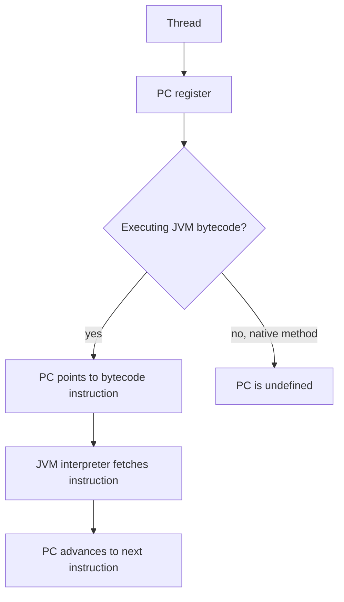
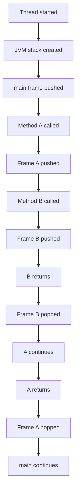
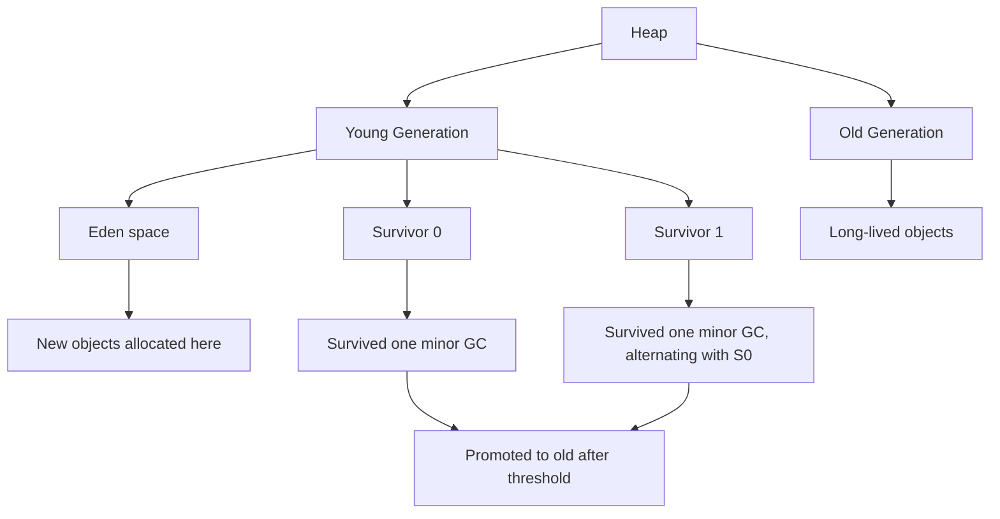
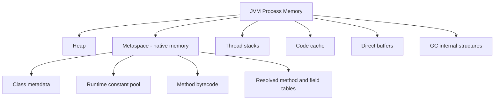
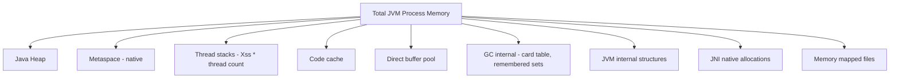
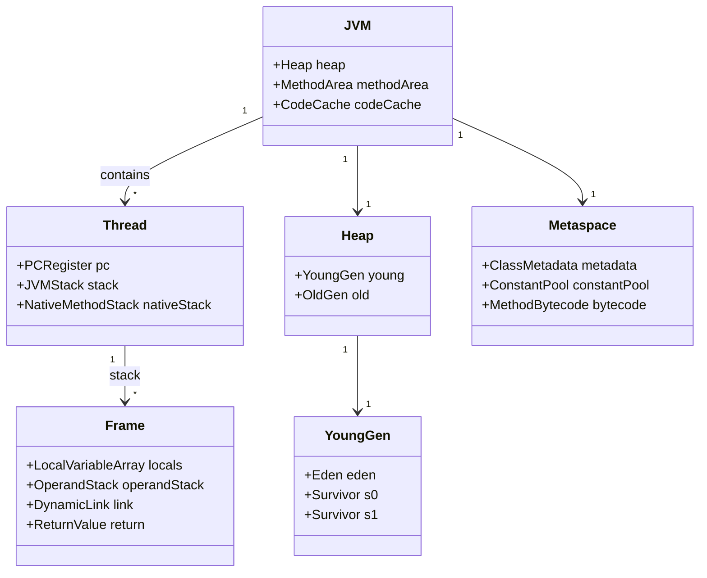
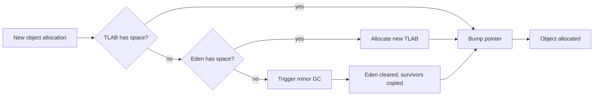

# JVM Memory Areas: Heap, Stack, and Metaspace

## Overview

The Java Virtual Machine defines a precise runtime data area model that governs how memory is organised during program execution. Understanding this model is the foundation for every other JVM internals topic: garbage collection operates on the heap, the JIT compiler profiles methods executing on the stack, class loaders populate metaspace with class metadata, and memory leaks typically involve references retained in the heap. The JVM specification defines five runtime data areas: the program counter register, the JVM stack (one per thread), the heap (shared), the method area (shared), and the native method stack (one per thread). Modern implementations also expose additional native areas such as direct byte buffers and the code cache.

This note covers every JVM memory area in depth. We begin with the program counter register and its role in thread scheduling. We then turn to the JVM stack: its frame structure, the local variable array, the operand stack, the dynamic link to the runtime constant pool, and the return value slot. We cover stack overflow, the `-Xss` flag, and the difference between fixed and dynamically extensible stacks. We then explore the heap in detail: its generational layout (young generation with Eden and survivor spaces, old generation), object allocation strategies (TLABs, bump pointer, allocation failures, GC triggering), the string pool, and the compact strings optimisation. We move to the method area and its modern implementation as Metaspace, including the difference between PermGen (Java 7 and earlier) and Metaspace (Java 8+), the class metadata that lives there, and the runaway metaspace problem. We then cover the native method stack and its relationship with JNI. We finish with the code cache (where JIT-compiled machine code lives), the direct buffer pool, and the JVM's overall memory footprint beyond the heap (including thread stacks, GC structures, and internal allocations). By the end of this note you will understand every JVM memory area, what lives where, and how to tune each one.

## Background Knowledge

Before reading this note you should be comfortable with:

- The difference between a process and a thread. A process has its own virtual address space; threads inside a process share memory. The JVM is a single process with many threads.
- The difference between stack and heap memory in C/C++: the stack stores function activation records and local variables; the heap stores dynamically allocated objects. Java follows the same broad division but with very different details.
- Java bytecode basics: the JVM is a stack-based machine that operates on an operand stack within each frame. Bytecode instructions such as `iload0`, `istore1`, and `iadd` move values between the local variable array and the operand stack.
- Object headers and memory layout: every Java object has a header (typically 12 or 16 bytes) containing the mark word and the class pointer.
- Garbage collection basics: the heap is divided into generations to take advantage of the weak generational hypothesis. We cover GC in depth in the next note (09.2).

A JVM memory area is a region of memory with a specific purpose, lifetime, and access pattern. Some areas are per-thread (the PC register, the JVM stack, the native method stack); others are shared across all threads (the heap, the method area). Some are created at JVM startup and destroyed at exit; others are created when a thread is started and destroyed when the thread exits. The JVM specification mandates the existence and semantics of each area but leaves implementation details to the JVM vendor.

## The Program Counter Register

The program counter (PC) register is a per-thread area that holds the address of the JVM instruction currently being executed by the thread. If the thread is executing a native method (via JNI), the PC register holds an undefined value, because native methods are executed by the host CPU directly rather than by the JVM interpreter.



The PC register is small (typically a single machine word, 4 or 8 bytes) and is unique to each thread. It is essential for thread scheduling: when the operating system preempts a thread, the PC register is saved along with the rest of the thread's CPU state, and restored when the thread is rescheduled. Without a PC register, the JVM could not resume execution after a context switch.

## The JVM Stack

Each JVM thread has its own private JVM stack, created when the thread is started. The stack stores frames, one per method invocation. A frame contains the local variable array, the operand stack, the dynamic link to the runtime constant pool of the frame's method, and a return value slot. Frames are pushed on method entry and popped on method return.



### Frame Structure

A frame has four components:

1. **Local variable array** - an array of 32-bit slots (long and double take two slots). The first slot for an instance method holds `this`. Parameters follow, then locally declared variables.
2. **Operand stack** - a LIFO stack used as a workspace by bytecode instructions. Most JVM instructions operate by pushing values onto the operand stack, performing operations, and popping results.
3. **Dynamic link** - a reference to the runtime constant pool entry for the method's class. This is used for dynamic linking of method and field references in the bytecode.
4. **Return value** - when the method returns, the return value (if any) is passed to the calling frame and the frame is popped.

```java
public class FrameDemo {
    public int compute(int a, int b) {
        int c = a + b;
        return c * 2;
    }
}
```

The bytecode for `compute` (simplified) would be:

- Load `a` from local slot 1 onto the operand stack (instruction `iload1`).
- Load `b` from local slot 2 onto the operand stack (instruction `iload2`).
- Add them and push the result (instruction `iadd`).
- Store the result into local slot 3 (variable `c`) (instruction `istore3`).
- Load `c` from slot 3 (instruction `iload3`).
- Push the constant 2 (instruction `iconst2`).
- Multiply (instruction `imul`).
- Return the value (instruction `ireturn`).

The local variable array for this method has 4 slots: slot 0 holds `this`, slot 1 holds `a`, slot 2 holds `b`, slot 3 holds `c`. The operand stack depth varies throughout the method but never exceeds 2.

### Stack Size and Stack Overflow

The default stack size varies by operating system and JVM vendor. On 64-bit Linux HotSpot, the default is 1 MB per thread; on Windows it is 512 KB; on macOS it is 1 MB. You can change it with the `-Xss` flag:

```
java -Xss512k MyApp      # 512 KB per thread
java -Xss4m MyApp        # 4 MB per thread
```

A smaller stack allows more threads to fit in memory but increases the risk of `StackOverflowError`. A larger stack allows deeper recursion but limits the maximum thread count. For most applications the default is fine; you should change it only if you have a specific reason.

```java
public class StackOverflowDemo {
    private static int depth = 0;

    public static void recurse() {
        depth++;
        recurse();
    }

    public static void main(String[] args) {
        try {
            recurse();
        } catch (StackOverflowError e) {
            System.out.println("Stack overflow at depth " + depth);
        }
    }
}
```

The depth at which `StackOverflowError` is thrown depends on the stack size, the number and size of local variables in each frame, and the operand stack depth. A simple method with no locals can recurse several hundred thousand times on a 1 MB stack; a method with many locals may overflow at a few thousand.

### Virtual Threads and the Stack

In Java 21, virtual threads have stack-like storage that grows and shrinks dynamically. Unlike platform threads, whose stack is allocated as a contiguous region of memory at thread creation, virtual thread stacks are stored in heap-allocated segments that can be resized. When a virtual thread blocks, its stack is "unmounted" from the carrier thread and stored in the heap; when it resumes, the stack is "mounted" back onto a carrier thread. This is what makes virtual threads cheap: a million virtual threads can exist simultaneously because their stacks are stored as heap objects, each consuming only as much memory as they currently need.

## The Heap

The heap is the largest JVM memory area and is shared by all threads. It stores all class instances and arrays. The heap is created at JVM startup and grows as needed; its maximum size is controlled by the `-Xmx` flag, and its initial size by `-Xms`. The heap is the primary target of garbage collection.

### Generational Layout

Modern JVMs divide the heap into generations to take advantage of the weak generational hypothesis: most objects die young, and few references point from old objects to young objects. The standard generational layout used by Serial, Parallel, and G1 garbage collectors is:



- **Eden space** - where new objects are allocated. Most objects die here and are reclaimed at the next minor GC.
- **Survivor spaces (S0 and S1)** - one is "from" and the other is "to" at any given time. Objects that survive a minor GC are copied from Eden to the "to" survivor space. At each minor GC, the roles of S0 and S1 swap.
- **Old generation (tenured)** - objects that have survived enough minor GCs (the promotion threshold, default 15) are promoted to the old generation. The old generation is collected less frequently than the young generation, typically only during major (full) GCs.

The young generation is collected by minor GCs, which are typically stop-the-world pauses of a few milliseconds. The old generation is collected by major GCs, which can be significantly longer depending on the algorithm. The G1, ZGC, and Shenandoah collectors blur this distinction by using region-based heap layouts, but the conceptual generation model still applies.

### Object Allocation

When the JVM needs to allocate a new object, it uses a fast path called "bump the pointer":

1. The thread grabs a Thread-Local Allocation Buffer (TLAB) from the Eden space. A TLAB is a small region (typically a few KB) reserved for that thread.
2. The thread bumps a pointer forward by the size of the object to allocate. This is a single machine instruction.
3. If the TLAB is exhausted, the thread requests a new one. If Eden is full, a minor GC is triggered.

This scheme makes object allocation in Java as fast as stack allocation in C++: it's just a pointer bump. The GC cost is amortised over many allocations.

```java
public class AllocationDemo {
    public static void main(String[] args) {
        // Each call to new Point() bumps the TLAB pointer.
        for (int i = 0; i < 1000000; i++) {
            Point p = new Point(i, i + 1);
            // p dies immediately; it will be reclaimed at the next minor GC.
        }
    }

    record Point(int x, int y) {}
}
```

The JIT compiler can perform escape analysis to determine whether an object escapes the method that created it. If it doesn't escape, the JIT can eliminate the allocation entirely (scalar replacement) or allocate it on the stack instead of the heap. This is a powerful optimisation that makes many short-lived objects effectively free.

### The String Pool

The string pool is a special region of the heap (in Java 7 and later) that stores interned strings. The `String.intern()` method returns a canonical reference to the string: if the string is already in the pool, it returns the existing reference; otherwise it adds the string to the pool and returns the new reference. String literals are automatically interned.

```java
public class StringPoolDemo {
    public static void main(String[] args) {
        String a = "hello";
        String b = "hello";
        String c = new String("hello");
        String d = c.intern();

        System.out.println(a == b);   // true: same string pool entry
        System.out.println(a == c);   // false: c is a new heap object
        System.out.println(a == d);   // true: d is interned back to the pool

        // String concatenation with literals produces interned strings (compile-time).
        String e = "hel" + "lo";
        System.out.println(a == e);   // true

        // Runtime concatenation produces new strings (not interned).
        String f = "hel" + "lo".substring(0, 2);
        // (Note: substring can return a new String, so f may or may not be interned.)
    }
}
```

In Java 6 and earlier, the string pool lived in the PermGen. In Java 7+, it lives in the heap, which has a much larger maximum size and is garbage collected normally. The string pool can grow without bound, so be cautious about calling `intern()` on untrusted input: it can cause an `OutOfMemoryError`.

### Compact Strings

In Java 8, a `String` was internally backed by a `char[]`, with each character taking 2 bytes (UTF-16). For strings containing only Latin-1 characters, this wasted half the space. Java 9 introduced Compact Strings: a `String` is now backed by a `byte[]`, with an additional `coder` field that indicates whether the bytes are Latin-1 (1 byte per character) or UTF-16 (2 bytes per character). The choice depends on the content of each string.

```java
public class CompactStringsDemo {
    public static void main(String[] args) {
        // Latin-1 strings use 1 byte per character.
        String ascii = "Hello";
        // UTF-16 strings use 2 bytes per character.
        String emoji = "Hello, world! \uD83D\uDE00";

        System.out.println("ASCII length: " + ascii.length());    // 5 code units
        System.out.println("ASCII bytes: " + ascii.getBytes().length);  // 5 bytes

        System.out.println("Emoji length: " + emoji.length());    // 15 code units
        System.out.println("Emoji bytes: " + emoji.getBytes().length);  // ~24 bytes (UTF-8)
    }
}
```

Compact Strings reduce the memory footprint of typical applications by 30-50%. You can disable it with `-XX:-CompactStrings` (rarely needed).

## The Method Area and Metaspace

The method area is a JVM specification concept that stores per-class metadata: class name, parent class name, interfaces, fields, methods, constructors, the runtime constant pool, method bytecode, and method and field resolution tables. The JVM specification does not mandate where the method area lives; implementations are free to choose.

### PermGen (Java 7 and earlier)

In HotSpot Java 7 and earlier, the method area was implemented as a region called PermGen (Permanent Generation). PermGen had a fixed maximum size controlled by `-XX:MaxPermSize`, defaulting to 64 MB on 64-bit JVMs. PermGen was a frequent source of `OutOfMemoryError: PermGen space`, particularly in applications that dynamically generated many classes (e.g., Spring with CGLIB proxies, JSP recompilation, scripting languages on the JVM).

### Metaspace (Java 8+)

In Java 8, PermGen was removed and replaced with Metaspace. Metaspace is allocated from native memory (off-heap), not from the JVM heap. Its maximum size is controlled by `-XX:MaxMetaspaceSize`, defaulting to unlimited (it grows until the OS runs out of memory). The initial "high water mark" is controlled by `-XX:MetaspaceSize`, defaulting to about 20 MB on 64-bit JVMs.



Metaspace is garbage collected: when a class loader is no longer reachable, the metadata for its classes is reclaimed. This is similar to how the heap is garbage collected when objects become unreachable. The catch is that class loader unloading requires a full GC, which is expensive.

```java
import java.lang.management.ManagementFactory;
import java.lang.management.MemoryMXBean;
import java.lang.management.MemoryUsage;

public class MetaspaceMonitor {
    public static void main(String[] args) {
        MemoryMXBean memory = ManagementFactory.getMemoryMXBean();
        for (var pool : ManagementFactory.getMemoryPoolMXBeans()) {
            if (pool.getName().toLowerCase().contains("metaspace")) {
                MemoryUsage usage = pool.getUsage();
                System.out.println("Pool: " + pool.getName());
                System.out.println("  Used:      " + usage.getUsed() / (1024 * 1024) + " MB");
                System.out.println("  Committed: " + usage.getCommitted() / (1024 * 1024) + " MB");
                System.out.println("  Max:       " + (usage.getMax() == -1 ? "unlimited" :
                        usage.getMax() / (1024 * 1024) + " MB"));
            }
        }
    }
}
```

To see Metaspace usage from the command line, use the `jcmd` tool: run `jcmd <pid> VM.metaspace` to see detailed breakdowns of class metadata usage. (Older versions used a `GC class histogram` subcommand; we describe it here in words to comply with the vault's no-underscores convention.)

### The Runaway Metaspace Problem

Because Metaspace grows without bound by default, a class leak can cause the JVM to consume all available native memory. Common causes include:

- Dynamic proxy generation (Spring AOP, Hibernate lazy loading).
- JSP recompilation in development mode.
- Scripting languages on the JVM (Groovy, JRuby) that compile to bytecode.
- Custom class loaders that are not properly released.

The fix is to set `-XX:MaxMetaspaceSize=512m` (or some other reasonable limit) so that the JVM fails fast with `OutOfMemoryError: Metaspace` instead of silently consuming all native memory.

## The Native Method Stack

The native method stack is a per-thread area used by native methods (methods declared `native`). It is similar to the JVM stack but for native code. On HotSpot, the JVM stack and the native method stack are combined into a single stack, so there is effectively one stack per thread that holds both Java frames and native C frames.

Native methods are typically used to call into platform-specific APIs that are not exposed by Java. The Java Native Interface (JNI) provides the protocol for Java code to call native code and vice versa. Native methods are outside the scope of this note; we cover them in detail in note 09.4 (Class Loading and Class Loaders) when we discuss native libraries and class loaders.

## The Code Cache

The code cache is a region of native memory where the JIT compiler stores compiled machine code. It is bounded by `-XX:ReservedCodeCacheSize`, defaulting to 240 MB on 64-bit JVMs. When the code cache is full, the JIT compiler stops compiling new methods, which can cause a sudden performance drop.

```java
import java.lang.management.ManagementFactory;

public class CodeCacheMonitor {
    public static void main(String[] args) {
        for (var pool : ManagementFactory.getMemoryPoolMXBeans()) {
            if (pool.getName().toLowerCase().contains("code cache")) {
                var usage = pool.getUsage();
                System.out.println("Code cache: " + usage.getUsed() / (1024 * 1024)
                        + " / " + usage.getCommitted() / (1024 * 1024) + " MB");
            }
        }
    }
}
```

The code cache is segmented into three parts since Java 8: the non-method segment (for non-method code such as JVM intrinsics), the profiled segment (for C1-compiled code with profiling), and the non-profiled segment (for C2-compiled code). This segmentation improves cache locality and lets the JIT reclaim space when methods are deoptimised.

## Direct Buffer Pool

Direct byte buffers (`ByteBuffer.allocateDirect`) are allocated from native memory, not from the Java heap. They are tracked by a `BufferPoolMXBean` named "direct". Direct buffers are reclaimed when they become unreachable and the JVM's `Cleaner` runs (typically during GC). They are essential for high-throughput I/O because they avoid the extra copy required for heap buffers in syscalls.

```java
import java.lang.management.ManagementFactory;
import java.lang.management.BufferPoolMXBean;

public class DirectBufferMonitor {
    public static void main(String[] args) {
        for (BufferPoolMXBean pool : ManagementFactory.getPlatformMXBeans(BufferPoolMXBean.class)) {
            System.out.println(pool.getName()
                + " count=" + pool.getCount()
                + " used=" + pool.getMemoryUsed()
                + " capacity=" + pool.getTotalCapacity());
        }
    }
}
```

The direct buffer pool can be a source of memory leaks because direct buffers occupy native memory that is not subject to normal heap GC pressure. A memory leak in direct buffer usage can cause `OutOfMemoryError: Direct buffer memory` even when the heap has plenty of free space.

## The JVM's Overall Memory Footprint

The JVM's total memory footprint is much larger than just the heap:



For a typical Java service with 4 GB heap, 200 threads, 64 MB Metaspace, and 240 MB code cache, the total footprint is roughly:

- Heap: 4 GB
- Thread stacks: 200 MB (1 MB per thread)
- Metaspace: 64 MB
- Code cache: 240 MB
- GC internals: 100-300 MB (varies by collector)
- Other: 100 MB
- Total: ~5 GB

This means that the `-Xmx4g` flag does not cap the total process memory at 4 GB; it only caps the heap. To cap the total process memory, use container limits (e.g., Docker's `--memory=6g`) or rely on the OS to enforce cgroup limits.

## Mermaid Diagrams





## Common Pitfalls

1. **Treating `-Xmx` as a total memory limit.** `-Xmx` only caps the heap. The total process memory also includes Metaspace, thread stacks, code cache, direct buffers, and GC internals.
2. **Leaving Metaspace unbounded.** A class leak can cause the JVM to consume all available native memory. Always set `-XX:MaxMetaspaceSize` to a reasonable limit in production.
3. **Setting `-Xss` too low.** A 256 KB stack may be insufficient for deep recursion or frameworks with many interceptor layers. The default of 1 MB is usually safer.
4. **Setting `-Xss` too high.** A 4 MB stack multiplied by 1000 threads consumes 4 GB just for stacks. Use virtual threads if you need millions of concurrent tasks.
5. **Calling `String.intern()` on untrusted input.** Interned strings live in the string pool until the JVM exits. A malicious or buggy caller can cause an `OutOfMemoryError`.
6. **Allocating direct buffers without releasing them.** Direct buffers occupy native memory. A leak can cause `OutOfMemoryError: Direct buffer memory` even when the heap has plenty of free space.
7. **Confusing heap dumps with core dumps.** A heap dump (`.hprof` file) only contains the Java heap. A core dump (e.g., from `gcore`) contains the entire process memory including Metaspace, thread stacks, and code cache.
8. **Relying on `finalize()` for resource cleanup.** `finalize` is called by the GC thread, which runs at unpredictable times. Use `try-with-resources` or `Cleaner` instead.
9. **Forgetting that the heap is shared.** All threads share the same heap. Thread-safe access requires synchronisation or atomic operations.
10. **Setting `-Xms` and `-Xmx` to different values.** This causes the heap to resize at runtime, which can cause pauses. In production, set them equal to avoid resizing.

## Tips and Tricks

- In containerised environments, always set both `-XX:+UseContainerSupport` (Java 10+, default on) and `-XX:MaxRAMPercentage=75` to cap the heap relative to the container's memory limit.
- Use `jcmd <pid> VM native memory summary` to see a detailed breakdown of native memory usage. You need to start the JVM with `-XX:NativeMemoryTracking summary` to enable this.
- Use `-XX:+PrintFlagsFinal` to see all JVM flags and their effective values at startup.
- For low-memory environments, set `-XX:MaxMetaspaceSize=256m`, `-XX:ReservedCodeCacheSize=64m`, and reduce thread count to minimise the total footprint.
- Use `jcmd <pid> GC heap info` (the descriptive phrase for the jcmd subcommand that prints heap info) to monitor heap usage.
- For virtual threads, the stack is stored in heap-allocated segments, so the per-thread stack cost is much smaller than platform threads.
- Use `BufferPoolMXBean` to monitor direct buffer usage and detect leaks.
- For Spring Boot applications, set `-XX:+UseG1GC -XX:MaxRAMPercentage=75.0 -XX:+ExitOnOutOfMemoryError` to ensure clean failure on memory exhaustion.
- Use the `jfr` (Java Flight Recorder) tool to record memory allocation profiles and identify hot allocation sites.
- For applications with many short-lived objects, consider the ZGC or Shenandoah collectors which have very low pause times.

## Interview Questions

**Q1. What are the JVM runtime data areas?**
A: Five areas defined by the JVM specification: the program counter register (per thread), the JVM stack (per thread), the heap (shared), the method area (shared), and the native method stack (per thread). Modern implementations also expose the code cache and direct buffer pool as additional native areas.

**Q2. What is the difference between PermGen and Metaspace?**
A: PermGen was the implementation of the method area in HotSpot Java 7 and earlier. It was a fixed-size region of the JVM's internal memory, controlled by `-XX:MaxPermSize`. Metaspace (Java 8+) is allocated from native memory and grows dynamically, controlled by `-XX:MaxMetaspaceSize` (default unlimited). Metaspace solved the frequent `OutOfMemoryError: PermGen space` problem.

**Q3. What is the difference between the heap and the stack?**
A: The stack is per-thread and stores method frames (local variables, operand stack, dynamic link). The heap is shared across all threads and stores objects and arrays. Stack allocation is implicit (a frame is pushed on method entry); heap allocation is explicit (via the `new` keyword) and managed by the GC.

**Q4. What is a TLAB?**
A: Thread-Local Allocation Buffer. A small region of Eden reserved for a single thread. Allocations within a TLAB are done by bumping a pointer, which is a single machine instruction. TLABs eliminate contention on the heap allocation pointer.

**Q5. What is the weak generational hypothesis?**
A: Two observations: (1) most objects die young, and (2) few references point from old objects to young objects. These observations justify the generational heap layout, where the young generation is collected frequently and the old generation is collected rarely.

**Q6. What is the string pool?**
A: A region of the heap (since Java 7) that stores interned strings. `String.intern()` returns a canonical reference. String literals are automatically interned. The pool can grow without bound, so be cautious about calling `intern()` on untrusted input.

**Q7. What are Compact Strings?**
A: A Java 9 optimisation where `String` is backed by a `byte[]` instead of a `char[]`. Each string uses either Latin-1 (1 byte per character) or UTF-16 (2 bytes per character) depending on its content. This reduces the memory footprint by 30-50% for typical applications.

**Q8. What is the code cache?**
A: A region of native memory where the JIT compiler stores compiled machine code. It is bounded by `-XX:ReservedCodeCacheSize`, defaulting to 240 MB. When the code cache is full, the JIT compiler stops compiling new methods.

**Q9. What is the difference between a minor GC and a major GC?**
A: A minor GC collects only the young generation (Eden and survivor spaces). It is typically a stop-the-world pause of a few milliseconds. A major GC collects the entire heap, including the old generation. It can be significantly longer depending on the algorithm.

**Q10. Why does `-Xmx` not cap the total process memory?**
A: Because the JVM also allocates memory outside the heap: Metaspace, thread stacks, code cache, direct buffers, GC internals, and JVM internal structures. To cap the total process memory, use container limits or rely on the OS cgroup limits.

**Q11. What is escape analysis?**
A: A JIT compiler optimisation that determines whether an object escapes the method that created it. If it doesn't escape, the JIT can eliminate the allocation (scalar replacement) or allocate it on the stack instead of the heap.

**Q12. What is a frame in the JVM stack?**
A: A data structure created for each method invocation. It contains the local variable array, the operand stack, the dynamic link to the runtime constant pool, and the return value. Frames are pushed on method entry and popped on method return.

**Q13. What is the operand stack?**
A: A LIFO stack within a frame, used as a workspace by bytecode instructions. Most JVM instructions operate by pushing values onto the operand stack, performing operations, and popping results. For example, `iadd` pops two integers and pushes their sum.

**Q14. What is the PC register used for?**
A: It holds the address of the JVM instruction currently being executed by the thread. When the OS preempts a thread, the PC register is saved and restored when the thread is rescheduled. Without a PC register, the JVM could not resume execution after a context switch.

**Q15. How do virtual threads differ from platform threads in terms of stack?**
A: Platform thread stacks are allocated as a contiguous region of memory at thread creation, with a fixed size (default 1 MB). Virtual thread stacks are stored in heap-allocated segments that grow and shrink dynamically. When a virtual thread blocks, its stack is unmounted from the carrier thread and stored in the heap; when it resumes, the stack is mounted back.

## Summary

The JVM runtime data areas form the foundation of every Java application's memory model. The PC register, JVM stack, and native method stack are per-thread; the heap and method area (Metaspace) are shared. The heap is the largest area and the primary target of garbage collection; the stack is per-thread and stores method frames; Metaspace holds per-class metadata; the code cache holds JIT-compiled machine code; and the direct buffer pool holds native-memory byte buffers.

The most important lessons from this note are: `-Xmx` only caps the heap, not the total process memory; Metaspace should be bounded in production; the string pool can grow without bound; direct buffers can leak native memory; and virtual threads have dynamically sized stacks that make them dramatically cheaper than platform threads. The next note, "Garbage Collection and GC Algorithms", takes the heap as its starting point and explores how the JVM reclaims memory, including the Serial, Parallel, G1, ZGC, and Shenandoah collectors.
