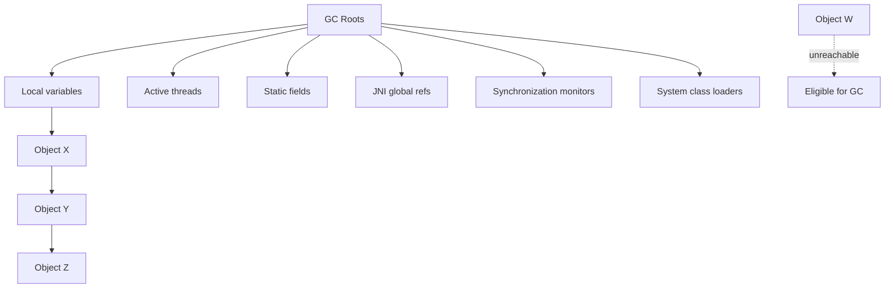
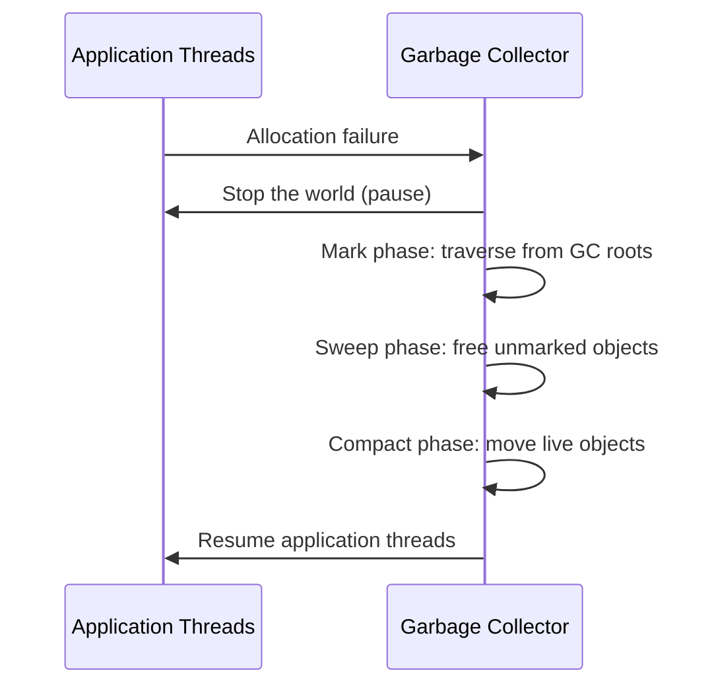
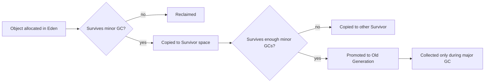
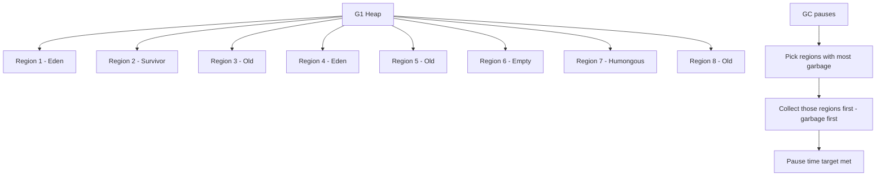
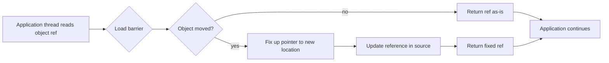
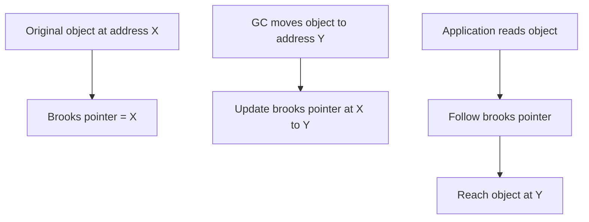
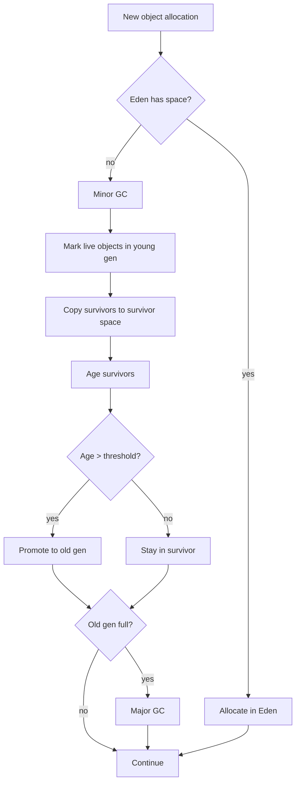
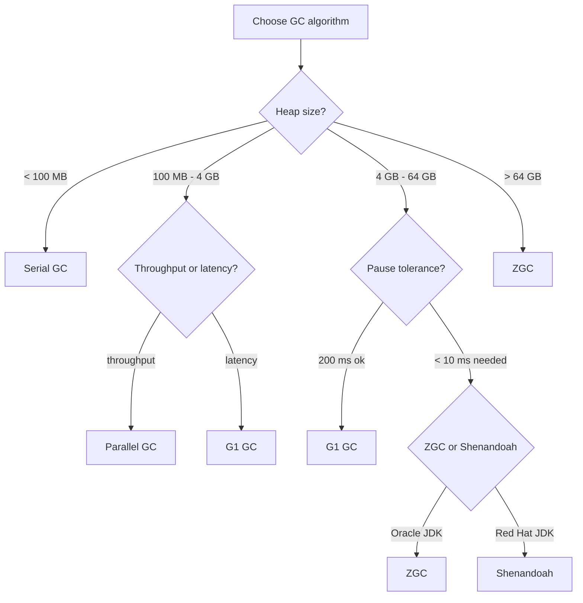

# Garbage Collection and GC Algorithms

## Overview

Garbage collection is the automatic reclamation of memory occupied by objects that are no longer reachable from the program. The JVM garbage collector runs in the background, periodically scanning the heap for unreachable objects and freeing their memory. This eliminates an entire class of bugs that plague C and C++ programs: memory leaks, double frees, use-after-free, and dangling pointers. Modern JVMs offer several garbage collection algorithms, each with different trade-offs between throughput, pause time, memory footprint, and CPU usage. Choosing the right collector and tuning it correctly can have a dramatic impact on application performance.

This note covers garbage collection in depth. We begin with the conceptual foundation: GC roots, reachability, the mark-sweep-compact algorithm, and the weak generational hypothesis. We then explore each collector in detail: Serial GC (single-threaded, for small heaps), Parallel GC (throughput-oriented, multi-threaded), CMS (concurrent mark-sweep, deprecated in Java 9 and removed in Java 14), G1 GC (region-based, pause-time target, the default since Java 9), ZGC (sub-millisecond pauses, ultra-low latency, production-ready in Java 15), and Shenandoah (Red Hat's concurrent collector, similar goals to ZGC). We compare them across throughput, pause time, memory overhead, and tuning complexity. We then cover GC tuning fundamentals: heap sizing, young/old generation ratios, pause time targets, and when to switch collectors. We finish with the `jstat` and `jcmd` tools for monitoring GC behaviour. By the end of this note you will understand every GC algorithm available in Java 21, how to choose between them, and how to tune them for your specific workload.

## Background Knowledge

Before reading this note you should be comfortable with:

- The JVM heap and its generational layout (young generation with Eden and survivor spaces, old generation), covered in note 09.1.
- The weak generational hypothesis: most objects die young, and few references point from old objects to young objects.
- The concept of a stop-the-world pause: a moment when all application threads are stopped so the GC can run.
- Object reachability: an object is reachable if it can be reached from a GC root via a chain of references. Unreachable objects are eligible for collection.
- Java reference types: strong, soft, weak, and phantom references, and how they interact with the GC.

A garbage collector's job is to identify unreachable objects and reclaim their memory. The fundamental algorithm is mark-sweep: mark every object reachable from GC roots, then sweep away the unmarked objects. This leaves holes in the heap, which can be compacted (moved together) to enable fast bump-pointer allocation. The mark-sweep-compact algorithm is conceptually simple but has performance issues at scale: marking the entire heap takes time proportional to the live object set, and compacting requires updating all references. Modern collectors use generational layouts, concurrent marking, and region-based heap organisation to minimise pause times.

## GC Roots and Reachability

A GC root is a reference that the GC treats as always reachable. The standard GC roots are:

1. **Local variables in active frames** - parameters and locals of methods currently executing on any thread.
2. **Active Java threads** - the thread objects themselves.
3. **Static fields of loaded classes** - references held in static fields.
4. **JNI global references** - references held by native code.
5. **Synchronisation monitors** - objects used as locks in `synchronized` blocks.
6. **System class loaders** - the bootstrap, platform, and application class loaders.

An object is reachable if there is a path of strong references from a GC root to it. An object is unreachable if no such path exists. Unreachable objects are eligible for collection (but may not be collected immediately).



## The Mark-Sweep-Compact Algorithm

The fundamental GC algorithm has three phases:

1. **Mark** - starting from GC roots, traverse all reachable objects and mark them as live. This phase takes time proportional to the live object set.
2. **Sweep** - scan the heap and free the memory occupied by unmarked objects. This phase takes time proportional to the heap size.
3. **Compact** - move live objects together to eliminate fragmentation. This requires updating all references to moved objects.



Pure mark-sweep-compact has two major drawbacks: it pauses the application for the entire duration, and it scans the entire heap. Modern collectors address these issues by dividing the heap into generations (so most collections only scan the young generation) and by performing marking concurrently with the application (so the pause is much shorter).

## The Weak Generational Hypothesis

The weak generational hypothesis is the empirical observation that:

1. **Most objects die young.** A typical application allocates many short-lived objects (intermediate values, temporary collections, request-scoped data) and few long-lived ones (caches, configuration, singleton services).
2. **Few references point from old objects to young objects.** Long-lived objects rarely reference short-lived ones; the reverse is common.

These observations justify the generational heap layout. The young generation is small and collected frequently; because most objects die young, most minor GCs reclaim most of the young generation. The old generation is large and collected rarely; because old objects rarely die, the effort is mostly wasted if we scan them every time.



To handle the rare case of old-to-young references, the JVM maintains a "card table": a bitmap where each card (typically 512 bytes) of the old generation is marked dirty when a reference inside it is written. During a minor GC, the GC scans only the dirty cards to find old-to-young references, avoiding a full scan of the old generation.

## GC Algorithms: A Comprehensive Tour

### Serial GC

The Serial GC is the simplest collector. It uses a single thread for both minor and major GCs. It is designed for small heaps (up to about 100 MB) and single-CPU machines.

```bash
java -XX:+UseSerialGC -Xms64m -Xmx128m MyApp
```

The Serial GC has low memory overhead (no concurrent data structures) and is useful for batch jobs, command-line tools, and embedded systems. Its stop-the-world pauses scale linearly with heap size, so it becomes impractical for heaps larger than a few hundred MB.

### Parallel GC

The Parallel GC (also called Parallel Scavenge) uses multiple threads for both minor and major GCs. It is throughput-oriented: it maximises the total amount of application work per unit time, at the cost of longer pause times.

```bash
java -XX:+UseParallelGC -Xms4g -Xmx4g -XX:MaxGCPauseMillis=200 MyApp
```

The Parallel GC was the default collector from Java 5 through Java 8. It is suitable for batch jobs, data processing, and applications that can tolerate pauses of several seconds. Its key tuning flags are:

- `-XX:MaxGCPauseMillis=N` - target maximum pause time (the GC adjusts young generation size to meet this).
- `-XX:GCTimeRatio=N` - target GC time as a fraction (1/(1+N)) of total time. Default 99 means 1% GC time.
- `-XX:UseAdaptiveSizePolicy` - enables adaptive sizing of young and old generations.

### CMS (Concurrent Mark-Sweep)

The CMS collector was introduced in Java 5 to provide low-pause collection for the old generation. It performed most of its work concurrently with the application threads, using brief stop-the-world pauses only for initial marking and remarking. CMS was deprecated in Java 9 and removed in Java 14.

CMS had several known issues:

1. **Fragmentation** - CMS did not compact the old generation, so over time the heap became fragmented. Eventually a "concurrent mode failure" would trigger a full stop-the-world compacting collection.
2. **Floating garbage** - objects that became unreachable during the concurrent mark phase were not collected until the next cycle.
3. **Tuning complexity** - CMS had dozens of tuning flags and was notoriously difficult to tune correctly.

Modern applications should use G1, ZGC, or Shenandoah instead of CMS.

### G1 GC (Garbage First)

The G1 GC was introduced in Java 7 and became the default collector in Java 9. It is designed for heaps ranging from 4 GB to 64 GB with pause times of 200 ms or less. G1 divides the heap into equal-sized regions (typically 1 MB to 32 MB each) and assigns each region to a generation dynamically.



G1's name comes from its collection strategy: during a pause, it picks the regions with the most garbage (the "garbage first" regions) and collects them, stopping when the pause time target is met. This lets G1 meet its pause time goal even on large heaps.

G1's collection cycle has several phases:

1. **Young GC** - collects Eden and survivor regions. This is a stop-the-world pause, typically 5-50 ms.
2. **Concurrent marking** - marks live objects in all regions. Runs concurrently with the application.
3. **Mixed GC** - collects young regions plus some old regions. The selection is based on garbage density and pause time target.
4. **Full GC** - a fallback single-threaded compacting collection. This is a sign of mis-tuning and should be avoided.

```bash
java -XX:+UseG1GC -Xms8g -Xmx8g \
     -XX:MaxGCPauseMillis=200 \
     -XX:G1HeapRegionSize=16m \
     -XX:InitiatingHeapOccupancyPercent=45 \
     MyApp
```

Key G1 tuning flags:

- `-XX:MaxGCPauseMillis=N` - target maximum pause time (default 200 ms).
- `-XX:G1HeapRegionSize=N` - region size (1, 2, 4, 8, 16, or 32 MB; auto-selected by default).
- `-XX:InitiatingHeapOccupancyPercent=N` - percentage of heap usage that triggers concurrent marking (default 45).
- `-XX:G1NewSizePercent=N` - minimum young generation size as a percentage of heap (default 5).
- `-XX:G1MaxNewSizePercent=N` - maximum young generation size as a percentage of heap (default 60).

G1 also supports string deduplication (`-XX:+UseStringDeduplication`), which identifies duplicate strings and points them to the same underlying byte array. This can save significant memory for applications with many duplicate strings.

### ZGC (Z Garbage Collector)

ZGC was introduced as an experimental feature in Java 11 and became production-ready in Java 15. It is designed for very large heaps (multi-TB) with sub-millisecond pause times. ZGC performs almost all of its work concurrently, including object relocation.

```bash
java -XX:+UseZGC -Xms16g -Xmx16g -XX:SoftMaxHeapSize=12g MyApp
```

ZGC's key innovations are:

1. **Coloured pointers** - ZGC uses bits in the 64-bit object pointer to encode metadata (marked, remapped, finalisable). This lets ZGC perform marking and relocation concurrently with the application.
2. **Load barriers** - when the application reads an object reference, a small piece of GC code (the "load barrier") is invoked to fix up the pointer if the object has been moved. This adds a few nanoseconds per read but enables concurrent relocation.
3. **Region-based heap** - ZGC divides the heap into dynamically-sized regions (small, medium, large) for efficient allocation and relocation.



ZGC's pauses are typically 0.1-1 ms regardless of heap size, making it suitable for latency-sensitive applications such as trading systems, real-time analytics, and interactive services. Its memory overhead is higher than G1 (around 10-15% of heap size for marking and forwarding tables), and its throughput is slightly lower than G1 for the same workload.

In Java 21, ZGC supports generational mode (`-XX:+ZGenerational`), which divides the heap into young and old generations. This reduces the marking work because most garbage is in the young generation. Generational ZGC is a major improvement for typical workloads.

### Shenandoah

Shenandoah is Red Hat's concurrent collector, developed independently of ZGC but with similar goals. It was introduced in Java 12 (Red Hat build) and became part of OpenJDK mainline in Java 15. Like ZGC, Shenandoah performs most of its work concurrently, including object relocation, and achieves sub-millisecond pause times.

```bash
java -XX:+UseShenandoahGC -Xms16g -Xmx16g MyApp
```

Shenandoah's key innovation is **brooks pointers**: every object has an extra word that points to itself (or to its forwarded copy). When the GC moves an object, it updates the brooks pointer of the original to point to the new copy. Application threads that read the object follow the brooks pointer transparently. This is conceptually simpler than ZGC's coloured pointers but adds one word of overhead per object.

Shenandoah's pauses are typically 1-10 ms regardless of heap size. Its memory overhead is similar to ZGC. The choice between Shenandoah and ZGC often comes down to which JVM distribution you use: Shenandoah is the default in Red Hat's OpenJDK builds; ZGC is the default in Oracle's builds.



### Comparison Table

| Collector | Since | Default | Pause time | Throughput | Memory overhead | Heap size |
|-----------|-------|---------|-----------|-----------|----------------|-----------|
| Serial | Java 1.1 | No | High (linear with heap) | Low | Low | < 100 MB |
| Parallel | Java 5 | Java 5-8 | Medium | High | Low | Up to 8 GB |
| CMS | Java 5 | No | Medium | Medium | Medium | Up to 32 GB |
| G1 | Java 7 | Java 9+ | Low (200 ms target) | Medium-High | Medium | 4-64 GB |
| ZGC | Java 11 | No | Ultra-low (< 1 ms) | Medium | High (10-15%) | Multi-TB |
| Shenandoah | Java 12 | No | Ultra-low (< 10 ms) | Medium | Medium-High | Multi-TB |

## Choosing a Collector

The choice of collector depends on the workload:

- **Single-threaded batch jobs with small heaps (< 100 MB)**: Serial GC. Lowest memory overhead, simplest tuning.
- **Multi-threaded batch jobs with medium heaps (up to 8 GB)**: Parallel GC. Highest throughput, simplest tuning.
- **Interactive services with medium heaps (4-64 GB) and 200 ms pause tolerance**: G1 GC. Default since Java 9, well-tuned by default.
- **Latency-sensitive services with large heaps (16 GB+)**: ZGC or Shenandoah. Sub-millisecond pauses, but slightly lower throughput.
- **Multi-TB heaps**: ZGC. Designed for this scale; G1 and Parallel GC are impractical.

A reasonable rule of thumb for new applications in Java 21: start with G1 GC (the default) and switch to ZGC only if pause times are a problem. For services where 10 ms pauses are unacceptable, start with ZGC.

## GC Tuning Fundamentals

### Heap Sizing

The most important GC tuning decision is heap sizing. Too small a heap causes frequent GCs and high CPU usage; too large a heap causes long pauses (for non-concurrent collectors) and wasted memory.

- Set `-Xms` and `-Xmx` to the same value to avoid heap resizing pauses.
- Set `-XX:MaxRAMPercentage=N` in containerised environments to size the heap relative to the container's memory limit. Default is 25%; 75% is more typical for dedicated Java services.
- Leave 25-30% of the container's memory for non-heap areas (Metaspace, thread stacks, code cache, direct buffers, GC internals).

### Young Generation Sizing

The young generation size controls the frequency of minor GCs. A larger young generation means fewer minor GCs but longer pauses; a smaller young generation means more frequent but shorter pauses.

- For G1: use `-XX:G1NewSizePercent` and `-XX:G1MaxNewSizePercent` to bound the young generation size.
- For Parallel GC: use `-XX:NewRatio=N` (young:old = 1:N) or `-XX:NewSize=N` and `-XX:MaxNewSize=N`.
- Default young generation is about 1/3 of the heap for Parallel GC, and dynamically sized for G1.

### Pause Time Target

For G1, ZGC, and Shenandoah, the pause time target is the primary tuning knob. Setting an aggressive target (e.g., 50 ms) reduces pause time but increases GC frequency and CPU usage. A typical target for interactive services is 100-200 ms.

### Common GC Tuning Mistakes

1. **Setting `-Xmx` too high.** A 32 GB heap on G1 can cause multi-second pauses during major GCs. Use ZGC or reduce the heap size.
2. **Setting `-Xms` and `-Xmx` to different values.** Heap resizing causes unnecessary pauses. Always set them equal in production.
3. **Over-tuning.** Modern collectors (especially G1 and ZGC) have good defaults. Don't add flags unless you've measured a specific problem.
4. **Using `-XX:+DisableExplicitGC` to silence `System.gc()` calls.** This can hide bugs in code that relies on GC for cleanup. Better to use `-XX:+ExplicitGCInvokesConcurrent` to make `System.gc()` trigger a concurrent cycle instead of a full STW GC.
5. **Ignoring `-XX:+ExitOnOutOfMemoryError`.** In production, an OOM often leaves the JVM in an inconsistent state. Crashing cleanly is better than continuing with corrupted state.

## Monitoring GC Behaviour

### jstat

`jstat` is a command-line tool that prints GC statistics for a running JVM. The most useful options are:

```bash
jstat -gcutil <pid> 1000 10    # Print GC percentages every 1 second, 10 times
jstat -gccause <pid> 1000     # Print GC cause and percentages
jstat -gcnew <pid>            # Print young generation statistics
```

The output includes the percentage of each generation that is used, the number of GCs of each type, and the total time spent in GC.

### jcmd

`jcmd` is a more powerful diagnostic tool. Useful subcommands (using descriptive phrases for any with underscores) include:

- `jcmd <pid> GC heap info` - print heap information (descriptive phrase for the subcommand that prints heap info).
- `jcmd <pid> GC.run` - trigger a GC.
- `jcmd <pid> GC class histogram` - print a histogram of class instances (descriptive phrase for the subcommand that prints class histograms).
- `jcmd <pid> VM.flags` - print JVM flags.
- `jcmd <pid> Thread.print` - print a thread dump.

### Java Flight Recorder (JFR)

JFR is a low-overhead profiling tool built into the JVM. It records detailed information about GC behaviour, allocation profiles, method execution, and lock contention. Enable it with:

```bash
java -XX:StartFlightRecording=duration=60s,filename=recording.jfr MyApp
```

Analyse the recording with JDK Mission Control (JMC) or the `jfr print` command-line tool.

### GC Logging

GC logging is enabled with the `-Xlog:gc*` flag (Java 9+):

```bash
java -Xlog:gc*:file=gc.log:time,uptime,level,tags:filecount=5,filesize=10m MyApp
```

This logs detailed GC information to `gc.log`, rotating through 5 files of 10 MB each. Analyse the log with tools such as GCViewer, gceasy.io, or the async-profiler's GC log viewer.

## Mermaid Diagrams





## Common Pitfalls

1. **Using Serial GC on a multi-CPU machine with a large heap.** Serial GC's single-threaded pauses scale linearly with heap size and become unacceptable above a few hundred MB.
2. **Setting `-XX:+UseParallelGC` for latency-sensitive services.** Parallel GC's stop-the-world pauses can be several seconds on large heaps.
3. **Using CMS in Java 14+.** CMS was removed in Java 14. Use G1 instead.
4. **Setting `-XX:MaxGCPauseMillis` too aggressively.** An aggressive target (e.g., 10 ms on G1) increases GC frequency and CPU usage without necessarily meeting the target.
5. **Forgetting to enable GC logging in production.** Without GC logs, you cannot diagnose pause problems. Always enable `-Xlog:gc*` in production.
6. **Setting `-XX:NewRatio=1` (50% young gen).** This is too large for most applications and causes long minor GC pauses. Use the default or set it to 2 (33%) or 3 (25%).
7. **Calling `System.gc()` in production code.** This triggers a full GC, which can pause the application for several seconds. If you must call it, use `-XX:+ExplicitGCInvokesConcurrent` to make it concurrent.
8. **Over-tuning before measuring.** Modern collectors have good defaults. Add flags only when you've measured a specific problem.
9. **Mixing collectors.** Don't combine `-XX:+UseG1GC` with `-XX:+UseZGC`; only one collector can be active at a time.
10. **Ignoring native memory.** GC tuning focuses on the heap, but native memory (Metaspace, direct buffers, thread stacks) can also cause OOMs. See note 09.5 for details.

## Tips and Tricks

- In containerised environments, use `-XX:+UseContainerSupport` (default on Java 10+) and `-XX:MaxRAMPercentage=75.0` instead of explicit `-Xmx`.
- For G1 with a 16 GB heap, start with `-XX:+UseG1GC -XX:MaxGCPauseMillis=200 -XX:G1HeapRegionSize=16m` and tune from there.
- For ZGC, use `-XX:+UseZGC -XX:SoftMaxHeapSize=N` to set a "soft" target that ZGC tries to stay under without forcing OOMs.
- Enable GC logging from day one in production. Use `-Xlog:gc*:file=gc.log:time,uptime,level,tags:filecount=5,filesize=10m`.
- Use JFR for in-depth profiling. The overhead is typically less than 1%.
- For Spring Boot applications, set `-XX:+ExitOnOutOfMemoryError -XX:+HeapDumpOnOutOfMemoryError -XX:HeapDumpPath=/var/dumps/` to capture a heap dump before the JVM exits.
- Use `-XX:+UseStringDeduplication` (G1 only) to reduce memory for applications with many duplicate strings.
- For low-latency trading systems, consider `-XX:+UseZGC -XX:+ZGenerational -XX:+UseNUMA` for the lowest possible pauses.
- Use `jcmd <pid> GC heap info` (descriptive phrase) regularly to monitor heap usage.
- For applications with bursty traffic, size the young generation large enough to absorb the burst without triggering minor GCs during the burst.

## Interview Questions

**Q1. What is the difference between a minor GC and a major GC?**
A: A minor GC collects only the young generation (Eden and survivor spaces). It is typically a stop-the-world pause of a few milliseconds. A major GC collects the entire heap, including the old generation, and can be significantly longer.

**Q2. What is the weak generational hypothesis?**
A: Two observations: (1) most objects die young, and (2) few references point from old objects to young objects. These observations justify the generational heap layout.

**Q3. What are GC roots?**
A: References that the GC treats as always reachable. The standard GC roots are local variables in active frames, active Java threads, static fields of loaded classes, JNI global references, synchronisation monitors, and system class loaders.

**Q4. What is the card table?**
A: A bitmap where each card (typically 512 bytes) of the old generation is marked dirty when a reference inside it is written. During a minor GC, the GC scans only the dirty cards to find old-to-young references, avoiding a full scan of the old generation.

**Q5. What is the difference between Serial GC and Parallel GC?**
A: Serial GC uses a single thread for GC; Parallel GC uses multiple threads. Serial GC is for small heaps (< 100 MB); Parallel GC is the throughput-oriented default for medium heaps (up to 8 GB).

**Q6. Why was CMS removed?**
A: CMS had several issues: fragmentation (no compaction), floating garbage (objects that became unreachable during concurrent mark were not collected until the next cycle), and tuning complexity (dozens of flags). G1 was a better replacement.

**Q7. What is G1's "garbage first" strategy?**
A: During a pause, G1 picks the regions with the most garbage and collects them first, stopping when the pause time target is met. This lets G1 meet its pause time goal even on large heaps.

**Q8. What is a load barrier in ZGC?**
A: A small piece of GC code that runs when the application reads an object reference. The barrier checks whether the object has been moved and fixes up the pointer if so. This enables concurrent relocation.

**Q9. What are coloured pointers in ZGC?**
A: ZGC uses bits in the 64-bit object pointer to encode metadata (marked, remapped, finalisable). This lets ZGC perform marking and relocation concurrently with the application without requiring an explicit barrier on every read.

**Q10. What are brooks pointers in Shenandoah?**
A: Every object has an extra word that points to itself (or to its forwarded copy). When the GC moves an object, it updates the brooks pointer of the original to point to the new copy. Application threads that read the object follow the brooks pointer transparently.

**Q11. When should you use ZGC over G1?**
A: When pause time matters more than throughput, and when the heap is large (16 GB+). ZGC's pauses are typically sub-millisecond regardless of heap size; G1's pauses grow with heap size.

**Q12. What is the difference between ZGC and Shenandoah?**
A: Both are concurrent collectors with similar goals. ZGC uses coloured pointers and load barriers; Shenandoah uses brooks pointers. ZGC is the default in Oracle JDK; Shenandoah is the default in Red Hat's OpenJDK.

**Q13. What is string deduplication?**
A: A G1 feature that identifies duplicate strings and points them to the same underlying byte array. This can save significant memory for applications with many duplicate strings. Enable with `-XX:+UseStringDeduplication`.

**Q14. What is generational ZGC?**
A: A Java 21 mode that divides the ZGC heap into young and old generations. This reduces marking work because most garbage is in the young generation. Enable with `-XX:+ZGenerational`.

**Q15. Why should you set `-Xms` and `-Xmx` to the same value in production?**
A: To avoid heap resizing pauses. When the heap grows, the JVM must allocate and zero-fill new memory, which can cause a pause. When it shrinks, the JVM must compact and release memory. Setting them equal avoids both.

## Summary

Garbage collection is one of the JVM's most important features. Modern collectors (G1, ZGC, Shenandoah) can collect multi-TB heaps with sub-millisecond pauses, eliminating the traditional trade-off between throughput and latency. The choice of collector depends on the workload: Serial for tiny heaps, Parallel for throughput, G1 for medium heaps with 200 ms pause tolerance, and ZGC or Shenandoah for large heaps with strict latency requirements.

The most important lessons from this note are: choose the right collector for your workload; set `-Xms` and `-Xmx` equal in production; enable GC logging from day one; don't over-tune before measuring; and use JFR for in-depth profiling. The next note, "JIT Compiler and Bytecode", dives into how the JVM translates bytecode into machine code, including the C1 and C2 compilers, tiered compilation, on-stack replacement, and deoptimisation.
