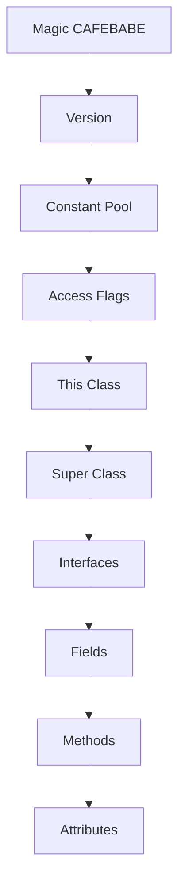
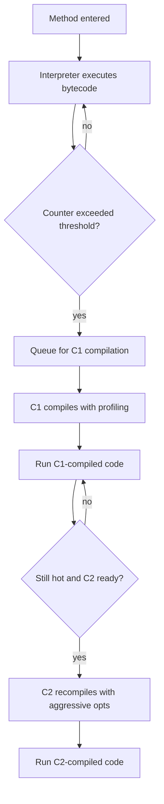

# JIT Compiler and Bytecode

## Overview

The Java platform is unique among production languages in that it ships a bytecode representation as the primary compilation output and then re-compiles the hottest methods into native machine code at runtime. The first stage is performed by `javac`, which translates Java source files into `.class` files containing JVM bytecode. The second stage is performed by the Just In Time (JIT) compiler inside the JVM, which observes the running program, profiles which methods are hot, and translates them into optimised machine code that runs directly on the host CPU. This two-stage pipeline is what gives Java its famous write once, run anywhere promise while still delivering performance competitive with ahead of time compiled languages like C++.

This note covers bytecode and the JIT compiler in depth. We begin with the structure of a class file: the magic number, version, constant pool, access flags, fields, methods, and attributes. We then dive into the bytecode instruction set: the operand stack machine model, the local variable array, the instruction categories (load, store, arithmetic, type conversion, object creation, method invocation, branching, exception handling), and the difference between interpreted and compiled execution. We move to the JIT compiler proper: the HotSpot tiered compilation model, the C1 (client) compiler, the C2 (server) compiler, the interpreter, and the role of the profiling collector. We cover the method entry counter, back edge counter, and compilation threshold. We explore the C2 compiler's aggressive optimisations: inlining, escape analysis, lock elision, scalar replacement, devirtualisation, loop unrolling, range check elimination, and constant folding. We explain on stack replacement (OSR), which lets a long-running method switch from interpreted to compiled mid-execution. We finish with the code cache, the JIT log, deoptimisation, and the most important JIT-related JVM flags. By the end of this note you will understand how Java source becomes machine code, what optimisations the JIT performs, and how to diagnose and tune compilation behaviour.

## Background Knowledge

Before reading this note you should be comfortable with:

- The JVM memory areas from note 09.1, especially the JVM stack, frames, the local variable array, and the operand stack. The bytecode instruction set operates directly on these structures.
- The class loading process from note 09.4 (or read that note afterwards). A class must be loaded and linked before its bytecode can be executed.
- The difference between Ahead Of Time (AOT) compilation (used by C, C++, Go) and Just In Time (JIT) compilation (used by Java, C#, JavaScript V8). AOT translates source to machine code once at build time; JIT translates hot methods to machine code at run time, using runtime information that an AOT compiler cannot see.
- CPU basics: registers, caches, branch prediction, superscalar execution. Many JIT optimisations exist to feed the CPU's pipelines more efficiently than the bytecode interpreter could.
- The Java bytecode verifier: at class load time the JVM verifies bytecode safety (stack underflow, type correctness, branch targets) before it is allowed to run.

The JVM is a stack-based virtual machine. Each method has an operand stack that bytecode instructions push to and pop from. There is no register file in the bytecode specification; the operand stack IS the register file. Real CPUs are register-based, so the JIT must map the operand stack onto physical registers as part of compilation. This is a one-way translation: source code goes to bytecode, bytecode goes to machine code, and at no point does the JVM reconstruct source from bytecode (decompilers can produce source-like output, but it is an approximation).

## The Class File Format

A `.class` file is a binary stream with a precisely defined layout. The JVM specification describes it as a sequence of u1, u2, and u4 values (unsigned 1, 2, and 4 byte integers). The structure is:

1. **Magic number** (4 bytes): always `0xCAFEBABE`. This identifies the file as a class file.
2. **Minor version** (2 bytes) and **major version** (2 bytes): the bytecode version. Java 21 is major version 65.
3. **Constant pool count** (2 bytes) and the **constant pool entries** themselves.
4. **Access flags** (2 bytes): `public`, `final`, `super`, `interface`, `abstract`, `synthetic`, `annotation`, `enum`.
5. **This class** (2 bytes): an index into the constant pool naming this class.
6. **Super class** (2 bytes): an index into the constant pool naming the superclass (or 0 for `java.lang.Object`).
7. **Interfaces count** (2 bytes) and the interface indices.
8. **Fields count** (2 bytes) and the field info entries.
9. **Methods count** (2 bytes) and the method info entries.
10. **Attributes count** (2 bytes) and the attribute info entries (such as `SourceFile`, `InnerClasses`, `BootstrapMethods`).



The constant pool is the heart of a class file. It is a table of constant entries that include class names, field names, method names, descriptors (type signatures), string literals, numeric constants, and method handle references. Every reference to a class, field, or method in the bytecode is an index into the constant pool. This indirection keeps bytecode compact (an index is 1 or 2 bytes; a UTF-8 string can be hundreds of bytes) and makes verification easier.

You can inspect a class file with `javap`:

```
javap -v -p MyClass.class
```

The `-v` flag produces verbose output (constant pool, bytecode, line numbers, local variable table). The `-p` flag includes private members.

## Bytecode Instruction Set

JVM bytecode is a stack machine instruction set. Each instruction is a single byte opcode (with a few prefixes that extend the opcode space), optionally followed by operands. There are roughly 200 opcodes. They fall into a handful of categories:

### Load and Store

Load instructions push a value from the local variable array onto the operand stack. Store instructions pop a value from the operand stack and write it into a local variable. There are typed variants for each primitive type:

- `iload0`, `iload1`, `iload2`, `iload3` push int locals at slots 0 to 3 (short forms).
- `iload` takes a 1-byte index; the wide prefix variant takes a 2-byte index (for methods with more than 255 locals).
- `lload`, `fload`, `dload`, `aload` for long, float, double, reference.
- `istore`, `lstore`, `fstore`, `dstore`, `astore` are the store counterparts.
- `iconst m1` (the value minus one) to `iconst5`, `lconst0`, `lconst1`, `fconst0` to `fconst2`, `dconst0`, `dconst1`, and the null reference constant push common constants.
- `bipush` pushes a 1-byte signed int; `sipush` pushes a 2-byte signed int; `ldc` pushes a constant pool entry (int, float, or String); the wide index variant of `ldc` and the 8-byte variant of `ldc` cover wider index or 8-byte constants.

### Arithmetic

Arithmetic instructions pop operands from the operand stack and push the result. There is no register form. Examples:

- `iadd`, `ladd`, `fadd`, `dadd` (addition).
- `isub`, `lsub`, `fsub`, `dsub` (subtraction).
- `imul`, `lmul`, `fmul`, `dmul` (multiplication).
- `idiv`, `ldiv`, `fdiv`, `ddiv` (division).
- `irem`, `lrem`, `frem`, `drem` (remainder).
- `ineg`, `lneg`, `fneg`, `dneg` (negation).
- `ishl`, `lshl`, `ishr`, `lshr`, `iushr`, `lushr` (shifts).
- `iand`, `land`, `ior`, `lor`, `ixor`, `lxor` (bitwise).
- `iinc` is special: it increments a local int variable in place, without going through the operand stack. This is the only arithmetic instruction that operates directly on a local.

### Type Conversion

The JVM is strongly typed even at the bytecode level. You cannot add an int and a long directly; you must widen the int to a long first. Conversion instructions include `i2l`, `i2f`, `i2d`, `l2f`, `l2d`, `f2d` (widening, lossless for ints), `l2i`, `f2i`, `f2l`, `d2i`, `d2l` (narrowing, may lose precision), `i2b`, `i2c`, `i2s` (narrowing int to byte, char, short).

### Object Creation and Manipulation

- `new` creates a new object of a class (named by a constant pool index) and pushes the reference.
- `newarray` creates a new array of primitive type.
- `anewarray` creates a new array of references.
- `multianewarray` creates multidimensional arrays.
- `getfield` and `putfield` read and write instance fields.
- `getstatic` and `putstatic` read and write static fields.
- `arraylength` pushes the length of an array.
- `aload`, `astore`, and their typed forms access array elements.
- `checkcast` checks whether an object is assignable to a type; throws `ClassCastException` if not.
- `instanceof` pushes 1 if the object is assignable to the type, 0 otherwise.

### Method Invocation

There are five method invocation instructions, each with different semantics:

- `invokevirtual` - dispatches based on the runtime type of the receiver (typical instance method).
- `invokespecial` - dispatches based on the compile-time type (constructors, `super.method()` calls, private methods).
- `invokestatic` - calls a static method.
- `invokeinterface` - calls a method through an interface reference; requires a runtime lookup of the implementation.
- `invokedynamic` - calls a method whose target is determined by a bootstrap method at first execution. This is the foundation of lambda expressions, string concatenation (Java 9+), and pattern matching switches.

### Control Flow

- The integer compare and branch family (`if icmpeq`, `if icmpne`, `if icmplt`, `if icmpge`, `if icmpgt`, `if icmple`) compares two ints and branches.
- `ifeq`, `ifne`, `iflt`, `ifge`, `ifgt`, `ifle` compare an int to zero.
- `ifnull`, `ifnonnull` compare a reference to null.
- The reference compare and branch instructions (`if acmpeq`, `if acmpne`) compare two references for identity.
- `goto` performs an unconditional branch; a wide variant handles larger offsets.
- `tableswitch` and `lookupswitch` implement switch statements (tableswitch for dense keys, lookupswitch for sparse).
- `jsr` and `ret` are deprecated (used to implement `finally` blocks before Java 6).

### Exception Handling

Exceptions are handled through exception tables in the method's `Code` attribute. Each entry has a start PC, end PC, handler PC, and catch type. When an exception is thrown, the JVM walks the exception table for the current method; if the throw PC falls in a try range and the catch type matches, control transfers to the handler PC. The `athrow` instruction throws an exception held on the operand stack.

```java
public class BytecodeDemo {
    public int max(int a, int b) {
        if (a > b) {
            return a;
        } else {
            return b;
        }
    }
}
```

Compiled bytecode for `max` (simplified):

- `iload1` - load `a` onto the operand stack.
- `iload2` - load `b` onto the operand stack.
- The integer compare and branch instruction (`if icmple 7`) - if `a <= b`, jump to PC 7 (the else branch).
- `iload1` - load `a`.
- `ireturn` - return `a`.
- `iload2` (PC 7) - load `b`.
- `ireturn` - return `b`.

## The Interpreter and the JIT

The JVM ships with both an interpreter and one or more JIT compilers. At startup every method is interpreted. The interpreter reads bytecode instructions one at a time, decodes them, and executes the equivalent operation on the operand stack. This is slow (typically 10 to 50 times slower than compiled code), but it has zero warmup cost and is highly memory efficient (a method's bytecode is small, while its compiled form can be many times larger).

The JIT compiler is invoked when a method becomes hot. Hotness is measured by two counters maintained by the interpreter:

1. **Method entry counter** - incremented each time a method is entered.
2. **Back edge counter** - incremented each time a backward branch (loop iteration) is taken.

When the sum of these counters exceeds a threshold, the method is queued for compilation. The default threshold in HotSpot is 10000 (controlled by `-XX:CompileThreshold`). With tiered compilation (the default since Java 8), the threshold is lower and more nuanced, because the C1 compiler kicks in earlier than the C2 compiler.



## Tiered Compilation

HotSpot has two JIT compilers, called C1 and C2:

- **C1 (client compiler)** is fast to compile, produces moderately optimised code. Designed for short-running applications where startup time matters.
- **C2 (server compiler)** is slow to compile, produces highly optimised code. Designed for long-running applications where peak performance matters.

Before Java 8 you chose one with `-client` or `-server`. Modern JVMs use tiered compilation, which combines both: methods start interpreted, get C1-compiled with profiling instrumentation, and finally get C2-compiled using the profile collected by C1. This gives fast startup AND high peak performance. Tiered compilation is on by default since Java 8.

There are five compilation tiers:

- **Tier 0**: interpreter only, with profiling.
- **Tier 1**: C1 compiled, no profiling.
- **Tier 2**: C1 compiled, with profiling.
- **Tier 3**: C1 compiled, with profiling and method data.
- **Tier 4**: C2 compiled, fully optimised.

A method's tier transitions are managed by the compilation policy based on counters, sample counts, and the size of the method.

## The C2 Compiler Optimisations

The C2 compiler performs a long list of aggressive optimisations. We will cover the most important ones:

### Inlining

Inlining copies the body of a called method into the caller, eliminating the call overhead and exposing further optimisations. Inlining is the single most valuable optimisation the JIT performs. Without it, every other optimisation is confined to a single method.

The inlining decision is based on the method's bytecode size (controlled by `-XX:MaxInlineSize` for trivial methods, default 35 bytes; and `-XX:FreqInlineSize` for hot methods, default 325 bytes), the receiver's type profile (the JIT tracks which concrete types a virtual call site sees), and the method's hotness.

If a call site is monomorphic (only one receiver type observed), the JIT inlines as if the call were static. If it is bimorphic (two types), the JIT generates a fast path for both. If it is megamorphic (three or more types), the JIT cannot easily inline and falls back to a virtual call. This is why avoiding unnecessary interface method counts in hot loops matters: a small number of implementations can be inlined, but many implementations defeat the inliner.

### Escape Analysis and Scalar Replacement

Escape analysis determines whether an object escapes the method that created it. If an object does not escape (it is local and not returned, stored in a field, or passed to a method that might let it escape), the JIT can perform scalar replacement: instead of allocating the object on the heap, it allocates its fields as separate variables, often in CPU registers. This eliminates the allocation entirely and removes pressure from the garbage collector.

```java
public long escapeDemo(int n) {
    long sum = 0;
    for (int i = 0; i < n; i++) {
        Point p = new Point(i, i + 1);
        sum += p.x() + p.y();
    }
    return sum;
}

record Point(int x, int y) {}
```

In this method, the `Point` instance does not escape the loop iteration. With escape analysis and scalar replacement enabled (default in modern HotSpot), no `Point` object is ever allocated on the heap; the JIT keeps `x` and `y` as register-resident ints.

### Lock Elision

If escape analysis proves that a lock is held by a single thread (because the locked object does not escape), the JIT can remove the `synchronized` block entirely. This is called lock elision.

```java
public StringBuffer build(String[] parts) {
    StringBuffer sb = new StringBuffer();
    for (String p : parts) {
        sb.append(p);
    }
    return sb.toString();
}
```

`StringBuffer.append` is synchronised. But the local `sb` does not escape this method, so the JIT can elide every lock. (If you used `StringBuilder` instead, no lock exists in the first place, but the elision optimisation lets older code that uses `StringBuffer` perform nearly as well.)

### Lock Coarsening

If two adjacent `synchronized` blocks lock the same object, the JIT can merge them into one larger block, saving two lock and unlock operations.

### Devirtualisation

A virtual call site that always sees the same receiver type can be devirtualised: the JIT replaces it with a direct call, which can then be inlined. The receiver type is tracked by the type profile collected at the call site.

### Loop Unrolling

A loop that runs many iterations can be unrolled: the loop body is duplicated several times, with the loop counter adjusted. This reduces the loop overhead (counter check, branch) per iteration and exposes instruction-level parallelism to the CPU.

```java
// Original
for (int i = 0; i < 1000; i++) {
    a[i] = i * 2;
}

// Unrolled by 4 (conceptually; the JIT does this in machine code)
for (int i = 0; i < 1000; i += 4) {
    a[i] = i * 2;
    a[i + 1] = (i + 1) * 2;
    a[i + 2] = (i + 2) * 2;
    a[i + 3] = (i + 3) * 2;
}
```

### Range Check Elimination

Every Java array access has an implicit bounds check that throws `ArrayIndexOutOfBoundsException` if the index is out of range. The JIT can eliminate these checks when it can prove they always succeed, such as in a loop where the index ranges over `0` to `array.length`. The pattern is so common that it has its own optimisation name.

### Constant Folding and Dead Code Elimination

If the JIT sees `int x = 2 + 3;` it folds the constant to `int x = 5;` at compile time. If it sees code that is unreachable or assigns to a never-read variable, it eliminates it.

### Branch Prediction Hints

The JIT's profiling data tells it which way branches usually go. It lays out machine code so that the common path is the fall-through path, which the CPU's branch predictor handles most efficiently.

## On Stack Replacement

On Stack Replacement (OSR) lets a method switch from interpreted to compiled execution while the method is running. Without OSR, a long-running method (a tight loop that runs for minutes) would never be JIT-compiled, because the method entry counter would never be incremented after the first entry.

OSR works by capturing the state of the interpreted frame (local variables, operand stack, PC) at the loop back edge, compiling the method, and resuming execution in the compiled frame at the equivalent PC. The compiled code starts at the loop entry rather than the method entry.

OSR-compiled code is often less optimised than a normal compilation, because the entry point is in the middle of the method. To get fully optimised code, the method should be re-entered after compilation. You can detect OSR by adding `-XX:+PrintCompilation` and looking for entries marked with `%`:

```
javac MyApp.java
java -XX:+PrintCompilation -Xbatch MyApp
```

OSR entries appear with a `%` character in the second column.

## The Code Cache

The code cache is the area of native memory where the JVM stores JIT-compiled machine code. Its size is controlled by `-XX:ReservedCodeCacheSize` (default 240 MB on most platforms). When the code cache fills, the JIT stops compiling, and the JVM falls back to interpretation for new hot methods. This causes a sudden performance cliff.

You can monitor the code cache with JConsole or `jcmd`:

```
jcmd <pid> Compiler.codecache
```

The output shows the total size, used size, and the boundaries of the code cache, plus the per-compiler segments.

## Deoptimisation

Sometimes the JIT makes an optimistic assumption that later turns out to be wrong. Examples:

- A call site was monomorphic and got inlined as a direct call; later, a new subclass is loaded that implements the call site's interface, making the call site megamorphic.
- A class was loaded and the JIT assumed no new subclasses would ever be loaded; later, a new subclass is loaded.
- The type profile predicted that a branch would rarely be taken; later, an unusual input makes it taken.

When the assumption is invalidated, the JIT must deoptimise: discard the compiled code and resume execution in the interpreter. The state of the compiled frame is reconstructed (local variables, operand stack, monitor state) and execution continues from the equivalent bytecode PC. The method may then be recompiled with the new information, or with less aggressive optimisations.

Deoptimisation is expensive but rare. If you see lots of `uncommon trap` entries in the JIT log (`-XX:+PrintCompilation`), the JIT is deoptimising frequently, which usually means your code defeats one of its optimistic assumptions (often the type profile is unstable).

There are two kinds of deoptimisation:

- **Unstable deoptimisation** (uncommon trap): a rare event triggers deoptimisation of one method.
- **Class unloading**: when a class is unloaded, any compiled code that referenced it must be discarded.

## Inspecting Compilation with javap and PrintCompilation

You can watch the JIT work with these flags:

```
java -XX:+PrintCompilation -XX:+UnlockDiagnosticVMOptions -XX:+PrintInlining com.example.MyApp
```

`PrintCompilation` prints a line each time a method is compiled or deoptimised. The columns are: timestamp, compile ID, attributes (n for native, s for synchronized, ! for exception handler, % for OSR, b for blocking, - for recompilation), level (0 to 4), size in bytes, method name, and deoptimisation reasons.

`PrintInlining` requires `-XX:+UnlockDiagnosticVMOptions` and prints inlining decisions, including reasons when an inlining was rejected (`hot`, `too big`, `executed < MinInliningThreshold`, `callee is too large`, `no static binding`, etc.). This is invaluable when a hot method is not getting the expected inlining.

## JIT-Related JVM Flags

The most important JIT flags:

- `-XX:+TieredCompilation` (default on since Java 8): enables tiered compilation.
- `-XX:CompileThreshold=10000`: the method invocation counter at which a method becomes eligible for compilation (without tiered).
- `-XX:ReservedCodeCacheSize=256m`: the maximum size of the code cache.
- `-XX:InitialCodeCacheSize=16m`: the initial size of the code cache.
- `-XX:+PrintCompilation`: prints a line each time the JIT compiles a method.
- `-XX:+UnlockDiagnosticVMOptions -XX:+PrintInlining`: prints inlining decisions.
- `-XX:+LogCompilation -XX:LogFile=jit.log`: writes a detailed XML log of all compilations.
- `-XX:+TraceClassLoading` and `-XX:+TraceClassUnloading`: trace class loading events.
- `-XX:-UseCompressedOops`: disables compressed ordinary object pointers (used for debugging only; compressed oops reduce memory footprint on 64-bit JVMs).
- `-XX:+DoEscapeAnalysis` (default on): enables escape analysis.
- `-XX:+EliminateAllocations` (default on): enables scalar replacement based on escape analysis.
- `-XX:+EliminateLocks` (default on): enables lock elision based on escape analysis.
- `-XX:MaxInlineSize=35`: the max bytecode size of a method that is always inlined (when small enough).
- `-XX:FreqInlineSize=325`: the max bytecode size of a frequently executed method that is inlined.
- `-XX:+UseCountedLoopSafepoints`: inserts safepoint polls in counted loops, preventing long pauses.

You can also force compilation of specific methods with `-XX:CompileCommand=compileonly,com.example.MyClass::myMethod` and `-XX:CompileCommand=dontinline,com.example.MyClass::myMethod`.

## The Graal Compiler

Graal is an alternative JIT compiler written in Java, available as a project (and as a JEP in OpenJDK). It uses the JVMCI (JVM Compiler Interface) introduced in Java 9 to plug into HotSpot as a top-tier compiler, replacing C2. Graal can perform more aggressive optimisations than C2 because it is written in a higher-level language and uses a more sophisticated intermediate representation. As of Java 21, Graal is not on by default but can be enabled with `-XX:+UseJVMCICompiler -XX:+UseGraalJVMCICompiler`. GraalVM (a separate distribution from Oracle) ships Graal as the default.

## Ahead Of Time Compilation with jaotc and Class Data Sharing

Java 9 introduced the `jaotc` tool that produced AOT-compiled native code for class files, stored in a shared library that the JVM loaded at startup to improve warmup. This was experimental and was removed in Java 17. Modern Java instead uses:

- **Class Data Sharing (CDS)**: extracts the parsed class metadata of a known set of classes into a shared archive that multiple JVMs can map read-only, saving class loading work.
- **Application Class Data Sharing (AppCDS)**: extends CDS to application classes.
- **Dynamic CDS**: introduced in Java 13, lets a JVM record the classes it loaded at runtime into a CDS archive automatically.
- **Project Leyden**: an ongoing effort to bring AOT compilation, CDS, and code caching together to reduce Java warmup time.

These techniques complement (rather than replace) the JIT. They reduce startup time, but the JIT is still responsible for peak performance.

## Common Pitfalls

- **Forcing the JIT to recompile.** Reloading classes (via custom class loaders or agent instrumentation) invalidates compiled code, which then has to be re-compiled and re-profiled. Application servers with frequent redeployments suffer from this.
- **Defeating escape analysis with a tiny leak.** A local object that is passed to a single method that lets it escape (for example, a logger call that uses varargs and the varargs array escapes) defeats scalar replacement for the entire object. Profile with `-XX:+UnlockDiagnosticVMOptions -XX:+PrintIdealGraph` or `-XX:+PrintInlining` to find the leak.
- **Megamorphic call sites in hot loops.** If you have a hot loop that calls an interface method on objects of 10 different types, the JIT cannot inline and falls back to a virtual call per iteration. Refactor to dispatch less, or use a sealed type and a switch on a type ID.
- **Long-running loops without safepoints.** Counted loops (a tight loop over an array of primitives) may not have safepoint polls in their body. If the loop runs for many seconds, other JVM operations (GC, deoptimisation) cannot interrupt it, causing long pauses. The flag `-XX:+UseCountedLoopSafepoints` (default since Java 18 for some loop shapes) addresses this.
- **Disabling tiered compilation.** Some old guides suggest `-XX:-TieredCompilation` for benchmarks. This was sometimes faster in Java 8 due to C2 being more efficient than tiered, but in modern Java 21 tiered compilation is essentially always better.
- **Reading the JIT log without context.** Lines in `PrintCompilation` output marked `made not entrant` are normal: they occur when a method is recompiled at a higher tier or deoptimised for a benign reason. They are not bugs.
- **Over-tuning CompileThreshold.** Lowering it speeds up warmup but produces less optimised code (C2 has less profile data). Raising it improves peak performance but slows warmup. Tune only with measurement.

## Tips and Tricks

- Use `-XX:+PrintCompilation -XX:+UnlockDiagnosticVMOptions -XX:+PrintInlining` when investigating why a hot method is slow. Look for `not inlined` reasons.
- Use JMH (Java Microbenchmark Harness) for any benchmark. JMH forks a fresh JVM per benchmark, waits for warmup, and reports consistent measurements. Hand-rolled benchmarks almost always measure warmup, JIT, or classloading instead of the code under test.
- For long-running services, the JFR (JDK Flight Recorder) event `jdk.Compilation` records every compilation with method, level, and time. JFR is the lowest-overhead way to monitor compilation in production.
- Remember that escape analysis works on local objects only. If you create an object inside a method and return it, it escapes and is allocated normally.
- If you see a method marked `made zombie` in the JIT log, it means the previous compiled version was reclaimed because no caller still references it. This is normal cleanup.
- For very large methods, the JIT may refuse to compile (the default max size is 8000 bytes, controlled by `-XX:HugeMethodLimit`). Split large methods.
- `invokedynamic` lets the JVM defer the choice of method implementation until first execution. Lambdas use this: a lambda creates a `CallSite` whose bootstrap method generates a class on demand (or uses a hidden class), without the historic inner-class generation of Java 7.
- Use `jol` (Java Object Layout) to inspect the actual layout of objects in memory, useful when reasoning about cache efficiency.
- The Graal compiler can give noticeable speedups on numerical code with complex control flow; benchmark on your workload before adopting.
- AOT compilation via CDS/AppCDS can dramatically reduce startup time for serverless and microservices. Build the archive at build time, ship it with the image, and pass `-XX:SharedArchiveFile=app.jsa` at runtime.

## Interview Questions

**Q1: What is the difference between the interpreter and the JIT compiler?**
A1: The interpreter executes bytecode one instruction at a time, decoding each opcode and operating on the operand stack. It has zero warmup cost but is slow. The JIT compiler translates hot methods into native machine code that runs directly on the CPU. Compiled code is much faster (often 10 to 50 times) but takes time to compile and uses more memory. Modern JVMs use both: a method starts interpreted, gets C1-compiled with profiling, and finally gets C2-compiled for peak performance.

**Q2: What is the role of the C1 and C2 compilers in tiered compilation?**
A2: C1 is the client compiler: fast to compile, moderately optimised. C2 is the server compiler: slow to compile, aggressively optimised. Tiered compilation (default since Java 8) uses both. Methods start interpreted, then are C1-compiled with profiling instrumentation, then finally C2-compiled using the profile C1 collected. This gives fast startup and high peak performance.

**Q3: What is on stack replacement (OSR) and why is it needed?**
A3: OSR is the ability to switch a running method from interpreted to compiled execution mid-execution, at a loop back edge. Without OSR, a long-running method (a tight loop that runs for minutes) would never be JIT-compiled, because the method entry counter would never be incremented after the first entry. OSR captures the state of the interpreted frame at the back edge, compiles the method, and resumes execution in the compiled frame at the equivalent PC.

**Q4: Explain escape analysis and scalar replacement.**
A4: Escape analysis determines whether an object escapes the method that created it. If an object does not escape (it is local, not returned, not stored in a field, not passed to a method that lets it escape), the JIT can perform scalar replacement: instead of allocating the object on the heap, it allocates its fields as separate local variables, often in CPU registers. This eliminates the allocation entirely and reduces GC pressure. This is why a tight loop creating many small short-lived objects can run without any heap allocation.

**Q5: What is lock elision and when does it apply?**
A5: Lock elision removes a `synchronized` block entirely when escape analysis proves that the locked object does not escape the current thread. This makes synchronised code that uses local objects (such as `StringBuffer` in a local scope) run as fast as the unsynchronised `StringBuilder`. It does not apply to locks on objects that may be shared across threads.

**Q6: What is the difference between `invokevirtual`, `invokespecial`, `invokestatic`, `invokeinterface`, and `invokedynamic`?**
A6: `invokevirtual` dispatches based on the receiver's runtime type (ordinary instance method). `invokespecial` dispatches based on the compile-time type (constructors, `super.method()`, private methods). `invokestatic` calls a static method. `invokeinterface` calls a method through an interface reference, requiring a runtime lookup. `invokedynamic` defers the choice of implementation to a bootstrap method, called once at first execution; lambdas, string concatenation, and pattern matching switches use it.

**Q7: Why does the JVM use a stack machine bytecode instead of a register machine bytecode?**
A7: A stack machine keeps bytecode compact (each instruction is one byte opcode plus a small operand) and verification simple (the verifier tracks the operand stack types statically). The downside is that real CPUs are register machines, so the bytecode must be JIT-compiled into register-based machine code for performance. The compact bytecode is good for class file size and verification speed, both important in the original Java design (download applets over slow networks, verify before running).

**Q8: What is deoptimisation and when does it happen?**
A8: Deoptimisation discards compiled code and resumes execution in the interpreter. It happens when an optimistic JIT assumption is invalidated. Examples: a call site that was monomorphic becomes megamorphic (a new subclass is loaded), a class that was assumed unextendable gets extended, an uncommon branch is taken. Deoptimisation is expensive but rare; if it happens often, the JIT log shows many `uncommon trap` entries.

**Q9: How does the JIT decide what to inline?**
A9: Based on the method's bytecode size (small methods are always inlined up to `MaxInlineSize`, hot methods up to `FreqInlineSize`), the receiver's type profile (monomorphic call sites inline as static, bimorphic generate a fast path for both, megamorphic fall back to virtual calls), and the method's hotness. The JIT cannot inline a recursive method infinitely; it inlines a few levels and then emits a call.

**Q10: What is the code cache and what happens when it fills?**
A10: The code cache is the native memory region where JIT-compiled machine code is stored. Its size is controlled by `-XX:ReservedCodeCacheSize` (default 240 MB). When it fills, the JIT stops compiling new methods and falls back to interpretation, causing a sudden performance cliff. Monitor with `jcmd <pid> Compiler.codecache` or JFR's `jdk.CodeCacheStatistics` event.

**Q11: How does the JVM verify bytecode safety?**
A11: At class load time, the bytecode verifier walks every method's bytecode and checks: stack underflow (no pop from empty operand stack), stack overflow (operand stack stays within declared max), type correctness (an `int` is not used as a reference), branch targets (jumps land at instruction boundaries and within the method), exception handler coverage, and `final` rules (no overriding of final methods, no assignment to final fields outside constructors). Verification prevents malformed class files from crashing the JVM.

**Q12: What is `invokedynamic` and why was it added?**
A12: `invokedynamic` (introduced in Java 7 for dynamic languages on the JVM, used heavily by Java 8 lambdas) defers the choice of method implementation until first execution. The bytecode references a `CallSite` and a bootstrap method. The bootstrap method is invoked once, returns a `MethodHandle` that becomes the permanent target of the call site. This lets language implementers (including Java itself for lambdas) generate code dynamically without committing to a specific implementation at compile time. Lambdas in Java 8 use `invokedynamic` to call a synthetic method on a generated class, which is more efficient than the Java 7 anonymous-inner-class approach.

**Q13: What is the difference between CDS, AppCDS, and AOT compilation?**
A13: Class Data Sharing (CDS) extracts the parsed class metadata of JDK classes into a shared archive that multiple JVMs can map read-only, saving class loading work and memory. Application CDS (AppCDS) extends this to application classes. Dynamic CDS (Java 13+) lets a JVM record classes it loaded at runtime into a CDS archive automatically. AOT compilation (the experimental `jaotc` tool, removed in Java 17) went further and compiled bytecode to native machine code at build time. Project Leyden is the modern effort to bring these together.

**Q14: Why is inlining so important for performance?**
A14: Inlining copies a called method's body into the caller, eliminating the call overhead (stack frame setup, argument passing, branch) and exposing further optimisations across the inlined boundary (constant folding, dead code elimination, scalar replacement of the inlined object's fields). Without inlining, every JIT optimisation is confined to a single method. The JIT's ability to inline aggressively based on the type profile is the single biggest reason Java performance approaches C++ in many workloads.

**Q15: How would you diagnose a method that is not being JIT-compiled?**
A15: Run with `-XX:+PrintCompilation -XX:+UnlockDiagnosticVMOptions -XX:+PrintInlining` and look for the method. If it never appears, it is not hot enough (raise the load, lower `-XX:CompileThreshold` for diagnosis). If it appears but with a low tier (1 or 2), C2 has not yet kicked in (give it more warmup). If it appears with `made not entrant` repeatedly, it is being deoptimised; check for unstable type profiles or uncommon traps. Use `-XX:+LogCompilation` for a detailed XML log and tools like JITWatch to visualise it. Confirm there are no `-XX:CompileCommand=dontinline` directives and that the method is not too large for the JIT (`HugeMethodLimit`, default 8000 bytes).

## Summary

Java bytecode is a stack-machine instruction set that the JVM interprets at startup and JIT-compiles into native machine code as methods become hot. The class file format (magic number, version, constant pool, fields, methods, attributes) is the unit of compilation and verification. The bytecode instruction set includes load and store, arithmetic, type conversion, object creation, method invocation (five variants), control flow, and exception handling instructions.

The HotSpot JVM uses tiered compilation: methods start at the interpreter, get C1-compiled with profiling, and finally get C2-compiled with aggressive optimisations including inlining, escape analysis, scalar replacement, lock elision, lock coarsening, devirtualisation, loop unrolling, range check elimination, and constant folding. On stack replacement (OSR) lets long-running methods switch from interpreted to compiled mid-execution. The code cache stores compiled code; deoptimisation discards compiled code when optimistic assumptions are invalidated.

The JIT can be inspected with `PrintCompilation`, `PrintInlining`, `LogCompilation`, and JFR's `jdk.Compilation` event. Tuning focuses on the code cache size, compile threshold, inlining sizes, and escape analysis flags. Modern Java adds CDS, AppCDS, dynamic CDS, and the Graal compiler as alternative paths to faster startup and higher peak performance. With these tools you can understand exactly how Java source becomes fast machine code, and you can diagnose and fix performance problems that arise from JIT behaviour.
