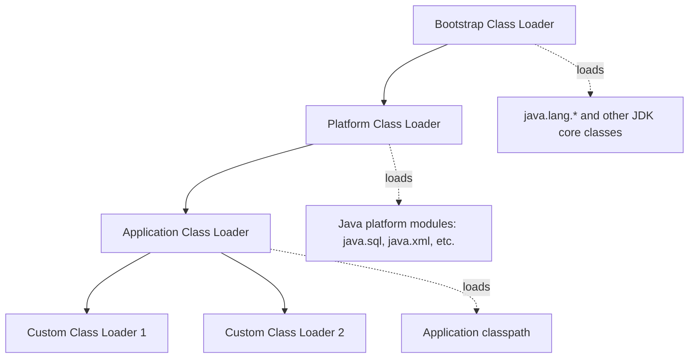
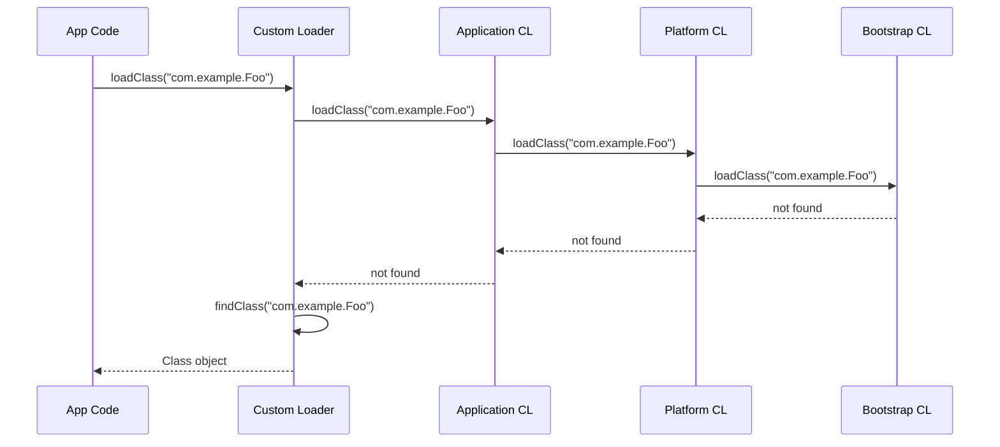
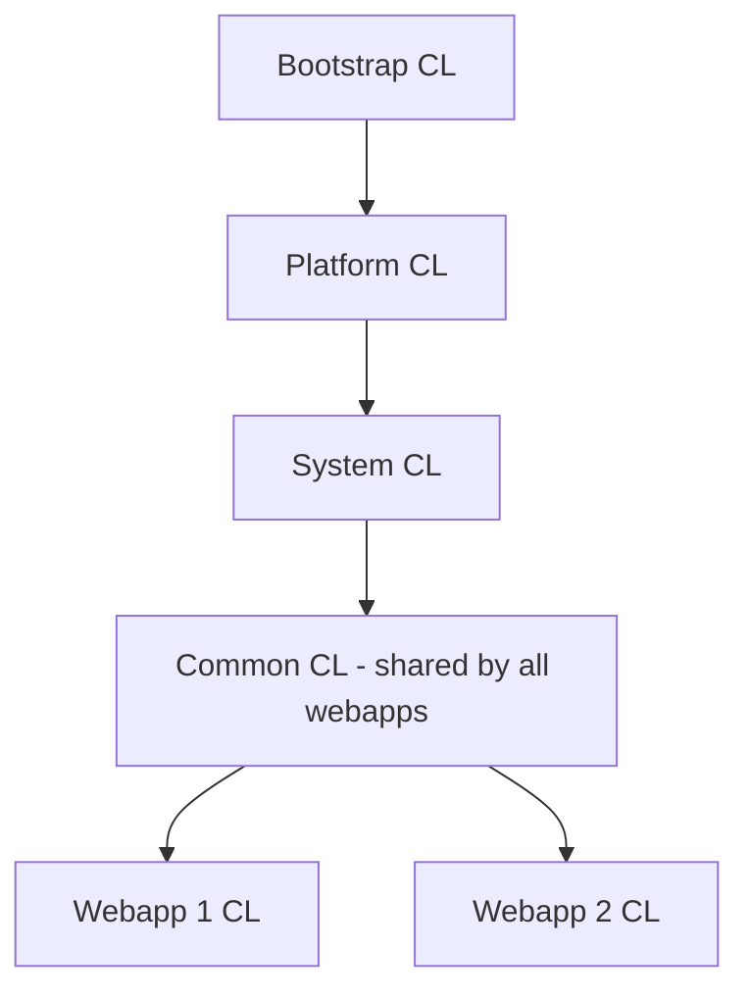

# Class Loading and Class Loaders

## Overview

Class loading is the process by which the JVM takes a `.class` file (or a stream of bytes conforming to the class file format) and turns it into a usable `Class` object inside the running JVM. This process is unique to Java among mainstream languages: classes are loaded on demand at runtime, by pluggable components called class loaders. The same class file loaded by two different class loaders produces two distinct `Class` objects that the JVM treats as different types. This single design choice gives Java its support for application servers hosting multiple applications, hot redeployment, module isolation (JPMS in Java 9+), dynamic code generation (lambdas, proxies, reflection), and security sandboxes that restrict which classes can be loaded.

This note covers class loading in depth. We begin with the class lifecycle: loading, linking (verification, preparation, resolution), initialisation, use, and unloading. We then explore the class loader delegation hierarchy: the bootstrap class loader (loads JDK core classes), the platform class loader (formerly the extension class loader, loads JDK extension and platform modules), and the application class loader (loads your application's classpath). We explain the parent delegation model and why it is critical for security. We cover class loader visibility, the dual class loader problem in early application servers, and the modern OSGi and JPMS solutions. We then dive into the `ClassLoader` API, including `loadClass`, `findClass`, `defineClass`, `resolveClass`, and the resource methods. We explain the bootstrap method mechanism (`invokedynamic`), hidden classes (Java 15+), and the modern `MethodHandles.Lookup.defineHiddenClass` API. We finish with class loading pitfalls (memory leaks through retained class loaders, deadlock in custom class loaders, version conflicts), tools (`jcmd` class loader histogram, JFR class loading events), and the most important JVM flags. By the end of this note you will understand how the JVM loads classes, how the delegation hierarchy works, and how to design custom class loaders safely.

## Background Knowledge

Before reading this note you should be comfortable with:

- The class file format from note 09.3 (magic number, version, constant pool, access flags, fields, methods, attributes). Class loading parses this binary format into an in-memory class representation.
- The JVM memory areas from note 09.1, especially Metaspace (where class metadata lives) and the method area (the logical area, implemented as Metaspace in HotSpot).
- Java bytecode basics: a class file contains bytecode for each method, which the bytecode verifier checks before execution.
- Reflection (`Class.forName`, `ClassLoader.loadClass`, `Method.invoke`): reflection triggers class loading if the class is not already loaded.
- Java modules (JPMS, Java 9+): the module system adds a layer of visibility and access control on top of the class loader hierarchy.

A class loader is an object whose job is to find the bytes of a class given its binary name (such as `java.lang.String` or `com.example.MyClass`) and feed those bytes to the JVM, which transforms them into a `Class` object. The JVM defines a delegation model: when asked to load a class, a class loader first asks its parent to load it; only if the parent cannot does the class loader attempt to load it itself. This ensures that core classes like `java.lang.String` are always loaded by the bootstrap class loader, regardless of which class loader the application requests them through.

## The Class Lifecycle

A class moves through several phases from when it is first needed to when it is unloaded. The JVM specification describes these phases:


### Loading

Loading is the process of finding the class file (typically on the classpath, but potentially from a network source, a database, or generated in memory) and parsing it into a `Class` object in the method area (Metaspace in HotSpot). The class loader creates a `Class` object that represents the loaded type. At this point the class's bytecode, field descriptors, method descriptors, and constant pool are stored in memory, but no field has been initialised and no static initialiser has run.

### Linking

Linking has three sub-phases:

1. **Verification** - the JVM checks the class file for safety: correct magic number, supported version, valid constant pool, well-formed bytecode, type-correct operand stack operations, valid branch targets, and proper exception handler coverage. Verification prevents malformed class files from crashing the JVM.
2. **Preparation** - the JVM allocates memory for the class's static fields and sets them to their default values (0 for int, 0L for long, null for reference, false for boolean, etc.). No user code runs yet.
3. **Resolution** - the JVM optionally resolves symbolic references in the constant pool (such as class names, field names, and method names) into direct references (memory addresses or offsets). Resolution can be eager (all at link time) or lazy (on first use). HotSpot is mostly lazy: a symbolic reference is resolved the first time the corresponding bytecode instruction executes.

### Initialisation

Initialisation runs the class's static initialisers (the `<clinit>` method, generated by the compiler from static field initialisers and `static {}` blocks). This is the first time user code runs for the class. The JVM ensures `<clinit>` runs exactly once per class loader, using an internal lock to handle concurrent initialisation.

A class is initialised immediately before its first active use, which is one of:

- An instance is created.
- A static method is called.
- A static field is assigned.
- A static field is read (if the field is not `final` or is a `final` reference type whose value is not a constant expression).
- It is the top-level class and an `assert` statement inside it is executed.
- It is a record, sealed, or pattern matching class that needs initialisation for reflection.

`Class.forName(name)` triggers initialisation; `Class.forName(name, false, loader)` does not. The `ClassLoader.loadClass(name)` method triggers loading and linking but NOT initialisation; initialisation happens only on first active use.

### Use

The class is now usable. Instances can be created, methods called, fields accessed.

### Unloading

A class is unloaded when its class loader is unreachable and no instances of the class remain. The JVM's garbage collector handles class unloading as part of Metaspace reclamation. This matters for application servers that hot-redeploy applications: the old class loader must become unreachable for the old classes to be unloaded.

## The Class Loader Hierarchy

HotSpot provides three built-in class loaders, organised in a parent-child hierarchy:



### Bootstrap Class Loader

The bootstrap class loader (also called the primordial class loader) is implemented in native code (C++ in HotSpot). It loads the JDK's core classes, such as `java.lang.Object`, `java.lang.String`, `java.lang.Thread`, and the contents of the `java.base` module. It has no Java object representation: `ClassLoader.getSystemClassLoader().getParent()` returns `null` to indicate the bootstrap class loader. You can pass additional bootstrap class path entries with `-Xbootclasspath/a:` (append) but this is rarely needed in modern Java.

### Platform Class Loader

The platform class loader (named `platform` in Java 9+) replaced the extension class loader (`ext`) from Java 8. It loads classes from the JDK's platform modules (such as `java.sql`, `java.xml`, `java.scripting`) and from any module on the upgrade module path. It can be obtained with `ClassLoader.getPlatformClassLoader()`. The platform class loader's parent is the bootstrap class loader.

The reason for the rename in Java 9 is that the extension mechanism (the `lib/ext` directory and the `ext` class loader) was removed in favour of modules. The platform class loader is the new home for classes that should be visible to all application code but are not part of the language core.

### Application Class Loader

The application class loader (also called the system class loader) loads classes from the application class path (`-cp` or the `CLASSPATH` environment variable) and from the application's modules. It is the default class loader for non-modular applications and the parent of any custom class loader that does not specify a parent. It can be obtained with `ClassLoader.getSystemClassLoader()`. The application class loader's parent is the platform class loader.

### The Parent Delegation Model

When a class loader is asked to load a class, it first asks its parent to load it. Only if the parent cannot does the child loader attempt to load it itself. The chain bottoms out at the bootstrap class loader, which has no parent.



The parent delegation model has two main benefits:

1. **Security.** Core classes like `java.lang.String` are always loaded by the bootstrap class loader, even if a custom class loader tries to load them. This prevents a malicious class loader from substituting a malicious `String` class that bypasses security checks.
2. **Uniqueness.** A class is identified by both its fully qualified name AND the class loader that loaded it. With parent delegation, the same class is always loaded by the same class loader, so all code sees the same `Class` object. Without parent delegation, you could end up with two `String` classes loaded by different loaders, neither assignable to the other.

You can break the parent delegation model by overriding `loadClass` to bypass the parent. This is rarely needed and is error-prone. The standard pattern is to override `findClass` instead, which is called by the default `loadClass` after parent delegation has failed.

## The ClassLoader API

The `ClassLoader` class is the abstract base for all class loaders. Its most important methods:

```java
public abstract class ClassLoader {
    public Class<?> loadClass(String name) throws ClassNotFoundException;
    protected Class<?> loadClass(String name, boolean resolve) throws ClassNotFoundException;
    protected Class<?> findClass(String name) throws ClassNotFoundException;
    protected final Class<?> defineClass(byte[] b, int off, int len);
    protected final Class<?> defineClass(String name, byte[] b, int off, int len);
    protected final void resolveClass(Class<?> c);
    public URL getResource(String name);
    public Enumeration<URL> getResources(String name) throws IOException;
    public InputStream getResourceAsStream(String name);
    public ClassLoader getParent();
    public static ClassLoader getSystemClassLoader();
    public static ClassLoader getPlatformClassLoader();
}
```

### loadClass

`loadClass(name)` is the entry point. The default implementation implements parent delegation:

1. Check if the class is already loaded (via `findLoadedClass`).
2. If not, ask the parent to load it (or the bootstrap class loader if parent is null).
3. If the parent throws `ClassNotFoundException`, call `findClass`.

Override `findClass`, not `loadClass`, when writing a custom class loader. Overriding `loadClass` is reserved for advanced cases where you genuinely need to break parent delegation (such as in application servers, OSGi, or hot redeployment).

### findClass

`findClass(name)` is called by `loadClass` after parent delegation has failed. Your custom class loader implements `findClass` to look up the class bytes (from a file, network, database, or memory), then calls `defineClass` to turn the bytes into a `Class` object.

### defineClass

`defineClass(name, bytes, offset, length)` is the magic method that takes raw class file bytes and produces a `Class` object. It is final because it invokes native JVM machinery. The class must be loaded into the same class loader for subsequent calls; you cannot define the same class twice in the same loader.

### resolveClass

`resolveClass(c)` forces the JVM to resolve all symbolic references in the class. This is optional; the JVM normally resolves lazily.

### Resource Methods

`getResource(name)` finds a resource (a non-class file, such as `application.properties`) using the same delegation model as class loading. `getResources(name)` returns an enumeration of all matching resources across the entire class loader hierarchy, which is useful when multiple jars on the classpath contain the same file (such as service definitions). `getResourceAsStream` is the convenience method that returns an `InputStream`.

### A Custom Class Loader Example

Here is a custom class loader that loads class files from a directory, breaking parent delegation only for classes in the `com.example` package:

```java
import java.io.IOException;
import java.nio.file.Files;
import java.nio.file.Path;

public class DirectoryClassLoader extends ClassLoader {
    private final Path baseDir;

    public DirectoryClassLoader(Path baseDir, ClassLoader parent) {
        super(parent);
        this.baseDir = baseDir;
    }

    @Override
    protected Class<?> findClass(String name) throws ClassNotFoundException {
        // Only handle com.example classes ourselves; delegate the rest.
        if (!name.startsWith("com.example.")) {
            throw new ClassNotFoundException(name);
        }
        String relativePath = name.replace('.', '/') + ".class";
        Path classFile = baseDir.resolve(relativePath);
        try {
            byte[] bytes = Files.readAllBytes(classFile);
            return defineClass(name, bytes, 0, bytes.length);
        } catch (IOException e) {
            throw new ClassNotFoundException(name, e);
        }
    }
}
```

To use it:

```java
ClassLoader loader = new DirectoryClassLoader(
    Path.of("/var/myapp/classes"),
    ClassLoader.getSystemClassLoader()
);
Class<?> klass = loader.loadClass("com.example.MyService");
Object instance = klass.getDeclaredConstructor().newInstance();
```

## Class Loader Equality and Identity

A class is identified by its fully qualified name AND the class loader that defined it. Two `Class` objects with the same name but defined by different class loaders are different types. Instances of one are not `instanceof` the other. This is the famous class loader identity problem that plagued early Java application servers.

```java
ClassLoader loader1 = new DirectoryClassLoader(dir, parent);
ClassLoader loader2 = new DirectoryClassLoader(dir, parent);
Class<?> c1 = loader1.loadClass("com.example.Foo");
Class<?> c2 = loader2.loadClass("com.example.Foo");
System.out.println(c1 == c2);              // false
System.out.println(c1.getName().equals(c2.getName()));  // true
Object foo1 = c1.getDeclaredConstructor().newInstance();
System.out.println(c2.isInstance(foo1));  // false
```

This is why application servers must use a single class loader for an application's classes (and a fresh class loader per redeploy): mixing loaders leads to `ClassCastException` even when the class names match.

## Class Loading in Java Modules (JPMS)

Java 9 introduced the Java Platform Module System (JPMS, sometimes called Jigsaw). A module is a named, versioned collection of packages and resources, declared in a `module-info.java` file. Modules add a layer of visibility and access control on top of the class loader hierarchy.

A module declares which packages it exports (visible to other modules) and which modules it requires. The `requires` directive can be `transitive` (re-exported) or `static` (required at compile time, optional at runtime). A module can also `opens` packages for deep reflection (used by frameworks like Spring and Hibernate).

```java
// module-info.java
module com.example.app {
    requires com.example.lib;
    requires transitive java.sql;
    exports com.example.app.api;
    opens com.example.app.model to org.hibernate.orm.core;
}
```

JPMS changes the class loading picture in two ways:

1. **Module-aware class loaders.** The application and platform class loaders are now `BuiltinClassLoader` instances that know about modules. A class loader has an associated `ModuleLayer`, which is a graph of modules loaded together.
2. **Class loader delegation.** When asked to load a class, the application class loader first checks whether the class belongs to a module in the current layer; if so, it loads it from that module's path. Otherwise it falls back to the classpath.

Module layers allow loading multiple versions of the same module in the same JVM, with each version in its own layer (and class loader). This is the JPMS-native alternative to OSGi-style versioning.

## Hidden Classes (Java 15+)

Hidden classes are a non-discoverable class loading mechanism introduced in Java 15. They are created by the JVM directly from bytes via `MethodHandles.Lookup.defineHiddenClass`, do not have a name visible to other code, and are not registered with any class loader. They cannot be found by `Class.forName` or by the class loader's `findClass`.

Hidden classes are useful for frameworks that generate classes at runtime: lambda metafactories, dynamic proxies, the JNI bridge code, and bytecode-rewriting frameworks. Before hidden classes, these frameworks created classes in the application class loader, which leaked memory when the framework was unloaded. Hidden classes can be unloaded independently of the application class loader.

```java
import java.lang.invoke.MethodHandles;
import java.lang.invoke.MethodHandles.Lookup;

byte[] classBytes = ... // generated bytes for a class
Lookup lookup = MethodHandles.lookup();
Lookup.ClassOption[] options = { Lookup.ClassOption.NESTMATE };
Class<?> hidden = lookup.defineHiddenClass(classBytes, true, options).lookupClass();
```

The `NESTMATE` option makes the hidden class a member of the lookup's nest, giving it access to private members of the nest host. The `STRONG` option (the default) makes the hidden class unloadable only when the lookup class loader is unreachable; without `STRONG`, the hidden class can be unloaded earlier if no instances remain.

## Service Loading and the ServiceLoader

The `ServiceLoader` API discovers service implementations on the classpath. A service is an interface or abstract class; a provider is an implementation. Providers are declared in `META-INF/services/<fully.qualified.ServiceName>` files (or in `module-info.java` via `provides ... with ...`).

```java
ServiceLoader<CipherProvider> loaders = ServiceLoader.load(CipherProvider.class);
for (CipherProvider provider : loaders) {
    if (provider.supports("AES-256")) {
        return provider;
    }
}
```

`ServiceLoader.load` uses the current thread's context class loader (or the application class loader if none is set) to scan for providers. Each provider is loaded by the class loader that found its declaration; this means providers from different class loaders can coexist.

## The Context Class Loader

Each thread has a context class loader, accessible via `Thread.currentThread().getContextClassLoader()` and settable with `setContextClassLoader`. The context class loader is a workaround for the fact that the parent delegation model does not let a parent class loader delegate to a child. Frameworks that load classes on behalf of application code (JNDI, JAXP, ServiceLoader) use the context class loader to find application-provided classes.

In modern Java, `ServiceLoader.load(type, classLoader)` lets you specify a class loader explicitly, which is preferred over the implicit context class loader.

## Common Class Loading Scenarios

### Web Application Servers

In a servlet container like Tomcat, each web application has its own class loader. The hierarchy is typically:



Each webapp class loader breaks parent delegation for servlet-spec classes (so each webapp can use its own version of a library) but follows parent delegation for JDK classes. When a webapp is redeployed, its class loader is discarded and a new one is created; the old one becomes unreachable and is eventually garbage collected, along with all its classes.

### OSGi

OSGi is a module system predating JPMS. Each OSGi bundle (a jar with extra metadata) has its own class loader. Bundles declare imported and exported packages; the OSGi framework wires bundles together based on these declarations. This allows multiple versions of the same library to coexist in the same JVM, a feature JPMS does not fully support.

### Java Agents

The `java.lang.instrument` package allows Java agents to transform class bytes at load time. An agent registers a `ClassFileTransformer` that the JVM calls for each class being loaded. The agent can return modified bytes, which the JVM uses to define the class. This is how APM tools (New Relic, AppDynamics), mocking frameworks (Mockito), and aspect-oriented frameworks work.

### Dynamic Proxies and Lambda Classes

`java.lang.reflect.Proxy.newProxyInstance` generates a class at runtime that implements one or more interfaces and delegates method calls to an `InvocationHandler`. The generated class is defined in the class loader of one of the interfaces (or a context class loader if specified). Since Java 8, lambdas use `invokedynamic` with a bootstrap method that calls `LambdaMetafactory.metafactory`, which in turn uses `MethodHandles.Lookup.defineHiddenClass` (in Java 15+) to create a hidden class implementing the functional interface.

## Common Pitfalls

- **Mixing class loaders and getting ClassCastException.** If two class loaders load the same class, instances of one are not assignable to the other. Use `Class.forName(name, true, classLoader)` with the same loader everywhere, or use `Class.forName(name)` which uses the caller's class loader.
- **Class loader memory leaks.** A class loader is unloaded only when it becomes unreachable. If anything in the JVM holds a reference to a class (or an instance of a class) loaded by a class loader, the class loader cannot be unloaded. This is a classic source of `OutOfMemoryError: Metaspace` in application servers. Common culprits: `ThreadLocal` instances, thread pools that did not reset the context class loader, static caches in frameworks, `Thread` objects that did not exit, and the JVM's `Proxy` cache.
- **Deadlocks in custom class loaders.** Custom class loading can deadlock if class loading is triggered from within `findClass` (for example, if your `findClass` calls `Class.forName` for a class in the same loader). Use `Class.forName(name, false, this)` to load without initialisation, or load classes with multi-threaded lock-ordering care.
- **Forgetting to set the parent class loader.** A custom class loader with no parent uses the bootstrap class loader as its parent, which means it cannot see any JDK classes outside `java.base`. Always pass `ClassLoader.getSystemClassLoader()` (or a more appropriate parent) when constructing a custom loader.
- **Loading the same class twice.** Calling `defineClass` twice for the same class name in the same class loader throws `LinkageError: attempted duplicate class definition`. Cache loaded classes via `findLoadedClass`.
- **Overriding loadClass instead of findClass.** Overriding `loadClass` breaks parent delegation and is rarely what you want. Override `findClass` instead; it is called by the default `loadClass` only after parent delegation has failed.
- **The `classpath` versus `module path`.** In Java 9+, classes on the classpath are in the unnamed module; classes on the module path are in named modules. The unnamed module can read all modules, but named modules cannot read the unnamed module unless they use `ALL-UNNAMED` in their `requires` or are opened via command-line flags. This is a frequent source of `IllegalAccessError` when migrating to modules.
- **Reflective access to JDK internals.** Since Java 9, the JDK's internal APIs (such as `sun.misc.Unsafe`) are not accessible by reflection unless explicitly opened with `--add-opens`. Many older frameworks (Hibernate 5, early Spring) required `--add-opens` flags; modern versions have been updated.
- **Custom class loader not handling resources.** `getResource` and `getResources` are part of the class loader contract. If your custom loader overrides `findClass` but not `findResource` and `findResources`, resource lookups silently fail.
- **Hidden class leaks.** Hidden classes are subject to the same reachability rules as regular classes. A hidden class holding a strong reference to its defining class loader prevents unloading of both.

## Tips and Tricks

- Use `jcmd <pid> VM.classloader stats` for a histogram of class loaders in the running JVM, including the number of classes loaded per loader and the bytes consumed.
- Use `jcmd <pid> VM.classloaders` to print the class loader hierarchy tree.
- Use `-verbose:class` to log every class load to stdout. Useful for diagnosing unexpected class loading (such as classes loaded from the wrong jar).
- Use `-Xlog:class+load=info` for the unified logging equivalent (Java 9+). Combine with `-Xlog:class+unload=info` to also see unloads.
- Use JFR's `jdk.ClassLoad` and `jdk.ClassUnload` events to record class loading in production with minimal overhead.
- For application servers, set `-XX:MetaspaceSize` and `-XX:MaxMetaspaceSize` to control metaspace growth and trigger GC when classes accumulate.
- For frameworks that generate many classes (dynamic proxies, lambdas, hidden classes), monitor the code cache and metaspace together.
- The `-XX:+TraceClassLoading` and `-XX:+TraceClassUnloading` flags (Java 8) or their `-Xlog` equivalents (Java 9+) are essential when debugging class loader leaks.
- For OSGi-like multiple-version scenarios in plain Java, use `Layer` and `Configuration` from `java.lang.module` to create a module layer with its own class loader.
- A leak detector like `ClassLoaderLeakDetector` (or a JFR recording that includes `jdk.ClassLoaderStatistics`) is invaluable for catching leaks early in development.
- When writing a custom class loader, always test under concurrent class loading (multiple threads triggering `loadClass` at the same time) to ensure your implementation is thread-safe.
- Hidden classes can be used as a modern, GC-friendly replacement for `defineClass` in frameworks that generate classes at runtime.

## Interview Questions

**Q1: What is the parent delegation model and why is it important?**
A1: When a class loader is asked to load a class, it first asks its parent to load it; only if the parent fails does it load the class itself. The chain bottoms out at the bootstrap class loader. Parent delegation has two key benefits: security (core classes are always loaded by the bootstrap loader, preventing malicious substitutions) and uniqueness (a class is always loaded by the same loader, so all code sees the same `Class` object). Override `findClass`, not `loadClass`, to participate in the model.

**Q2: What is the difference between the bootstrap, platform, and application class loaders?**
A2: The bootstrap class loader is implemented in native code, loads JDK core classes from `java.base`, and has no Java object representation. The platform class loader (called `ext` in Java 8, renamed `platform` in Java 9) loads JDK platform modules such as `java.sql`. The application class loader (also called the system class loader) loads classes from the classpath and the application's modules. They form a parent-child hierarchy: bootstrap is parent of platform, platform is parent of application.

**Q3: How is a class identified by the JVM?**
A3: A class is identified by its fully qualified name AND the class loader that defined it. Two `Class` objects with the same name but defined by different class loaders are different types, and instances of one are not assignable to the other. This is the famous class loader identity problem.

**Q4: What are the phases of class lifecycle?**
A4: Loading (find and parse the class file into a `Class` object), linking (verification, preparation, resolution), initialisation (run the static initialiser `<clinit>`), use, and unloading. Initialisation happens on first active use, which includes instance creation, static method calls, static field assignments, and non-constant static field reads.

**Q5: What is the difference between `Class.forName(name)` and `ClassLoader.loadClass(name)`?**
A5: `Class.forName(name)` triggers loading, linking, AND initialisation (it runs the static initialiser). `ClassLoader.loadClass(name)` triggers loading and linking but NOT initialisation; initialisation is deferred until the first active use. `Class.forName(name, false, loader)` skips initialisation.

**Q6: What is a hidden class and why was it introduced?**
A6: Hidden classes (Java 15+) are classes defined directly from bytes via `MethodHandles.Lookup.defineHiddenClass`, with no name visible to other code and not registered with any class loader. They cannot be found by `Class.forName`. They were introduced to support frameworks that generate classes at runtime (lambdas, dynamic proxies, bytecode-rewriting frameworks) without polluting the application class loader and without leaking memory when the framework is unloaded.

**Q7: How does class loading interact with Java modules (JPMS)?**
A7: Each module is loaded by a class loader associated with a module layer. When asked to load a class, the class loader first checks if the class belongs to a module in its layer; if so, it loads it from the module's path. Otherwise, it falls back to the classpath (the unnamed module). Module layers can be stacked, allowing multiple versions of the same module in the same JVM.

**Q8: What is a class loader memory leak and how do you detect it?**
A8: A class loader leak happens when something holds a reference to a class (or instance) defined by a class loader, preventing the loader from being garbage collected. The classes stay in Metaspace, eventually causing `OutOfMemoryError: Metaspace`. Common culprits are `ThreadLocal` instances, thread pools that did not reset the context class loader, static caches, and `Proxy` caches. Detect with `jcmd <pid> VM.classloader stats`, JFR's `jdk.ClassLoaderStatistics` event, or by monitoring Metaspace usage.

**Q9: What does the bytecode verifier check?**
A9: The verifier checks correct magic number, supported version, valid constant pool, well-formed bytecode (no stack underflow, no stack overflow beyond declared max), type-correct operand stack operations, valid branch targets (within the method, at instruction boundaries), proper exception handler coverage, and `final` rules (no overriding final methods, no assignment to final fields outside constructors). Verification prevents malformed class files from crashing the JVM.

**Q10: How would you implement a custom class loader that loads classes from a database?**
A10: Extend `ClassLoader`, pass an appropriate parent (typically `ClassLoader.getSystemClassLoader()`), and override `findClass` to query the database for the class bytes given the binary name, then call `defineClass`. Cache loaded classes via `findLoadedClass` (which is handled by the default `loadClass`). Do NOT override `loadClass` unless you need to break parent delegation. Ensure thread safety, because class loading can be concurrent.

**Q11: What is the context class loader and when should you use it?**
A11: Each thread has a context class loader, accessible via `Thread.currentThread().getContextClassLoader()`. It is a workaround for the fact that the parent delegation model does not let a parent class loader delegate to a child. Frameworks that load classes on behalf of application code (JNDI, JAXP, ServiceLoader) use it to find application-provided classes. In modern Java, prefer `ServiceLoader.load(type, classLoader)` with an explicit class loader.

**Q12: What is the difference between `getResource` and `getResources`?**
A12: `getResource(name)` returns the first resource found on the classpath (searching the class loader hierarchy from child to parent). `getResources(name)` returns an enumeration of ALL matching resources across the entire hierarchy, which is essential when multiple jars contain the same file (such as service declarations in `META-INF/services`).

**Q13: How does the JVM ensure a class's static initialiser runs exactly once?**
A13: The JVM uses an internal lock associated with the `Class` object. When a thread triggers initialisation, it acquires the lock, checks a state flag, and runs `<clinit>` if the flag indicates not-yet-initialised. Other threads that attempt to trigger initialisation while `<clinit>` is running block on the lock. After `<clinit>` completes, the state flag is set to initialised, and waiting threads proceed without re-running `<clinit>`. If `<clinit>` throws an exception, the state is set to error and subsequent attempts throw `NoClassDefFoundError`.

**Q14: What happens to a class loader when it becomes unreachable?**
A14: The class loader and all its classes become candidates for garbage collection. The JVM's Metaspace reclamation frees the memory occupied by the classes' metadata. Code cache compiled for those classes is also discarded (deoptimised). This is the basis of hot redeployment in application servers.

**Q15: What is `defineHiddenClass` with the `NESTMATE` option?**
A15: It defines a hidden class as a member of the lookup class's nest. Nest membership gives the hidden class access to the nest host's private fields and methods without needing synthetic accessor methods. This is used by lambda metafactories (so a lambda can call private methods of its enclosing class) and by other frameworks that generate helper classes.

## Summary

Class loading is the runtime process by which the JVM turns class file bytes into usable `Class` objects. A class moves through loading (finding and parsing the bytes), linking (verification, preparation, resolution), initialisation (running `<clinit>`), use, and unloading. The class loader hierarchy consists of the bootstrap loader (loads JDK core classes), the platform loader (loads JDK platform modules), and the application loader (loads your application). The parent delegation model ensures security and uniqueness by always delegating to the parent first.

Custom class loaders extend `ClassLoader` and override `findClass` (not `loadClass`, unless parent delegation must be broken). The `ClassLoader` API provides `loadClass`, `findClass`, `defineClass`, `resolveClass`, and resource methods. Classes are identified by name AND loader; two `Class` objects with the same name but different loaders are different types. Java 9 added JPMS, which adds module visibility and access control on top of the loader hierarchy. Java 15 added hidden classes, a non-discoverable class loading mechanism for frameworks that generate classes at runtime.

Class loader leaks are a common source of `OutOfMemoryError: Metaspace` in long-running applications, especially application servers. Detect them with `jcmd VM.classloader stats`, JFR's `jdk.ClassLoaderStatistics` event, and `-Xlog:class+load=info`. With these tools and an understanding of the delegation model, you can design safe custom class loaders and diagnose complex class loading problems.
