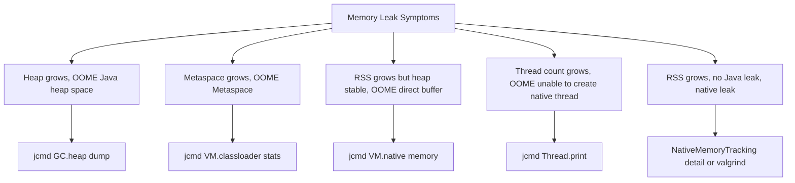

# Memory Leaks, Profiling, and JVM Flags

## Overview

Even though the JVM has a garbage collector, Java applications can and do leak memory. A memory leak in Java is not a missing `free` call (the GC handles that); it is a reference that the application retains to an object it no longer needs, preventing the GC from reclaiming the object. Such leaks accumulate slowly: the heap grows, GC works harder, pause times increase, throughput drops, and eventually the JVM throws `OutOfMemoryError: Java heap space`. Diagnosing and fixing these leaks requires a different skill set from writing the application code: you must know how to capture a heap dump, navigate it, identify the dominator tree, find the retained sizes of suspect objects, and trace the references back to a root. Then there is the related problem of GC tuning: choosing the right collector, sizing the heap and generations, and setting pause time targets. And underpinning both is the vast catalogue of JVM flags that control every aspect of memory, GC, JIT, class loading, and runtime behaviour.

This note covers memory leaks, profiling, and JVM flags in depth. We begin with the anatomy of a Java memory leak: the difference between a heap leak, a Metaspace leak, a direct buffer leak, a thread leak, and a native memory leak. We then walk through the diagnostic workflow: when to suspect a leak, how to capture a heap dump with `jcmd`, `jmap`, or `-XX:+HeapDumpOnOutOfMemoryError`, and how to analyse it with tools like Eclipse MAT, VisualVM, and JConsole. We cover the dominator tree, retained sizes, GC roots, and the path-to-roots technique. We then explore JDK Flight Recorder (JFR) and JDK Mission Control (JMC), the modern low-overhead profiling tools built into the JDK. We cover CPU profiling, allocation profiling, and the JFR event taxonomy. We move to GC tuning: choosing a collector (Serial, Parallel, G1, ZGC, Shenandoah), sizing the heap with `-Xms` and `-Xmx`, setting pause time targets, and reading GC logs. We finish with a comprehensive reference of the most important JVM flags, organised by category (memory, GC, JIT, class loading, runtime, diagnostic). By the end of this note you will be able to diagnose memory leaks, profile CPU and allocation hotspots, tune the GC, and navigate the JVM flag catalogue with confidence.

## Background Knowledge

Before reading this note you should be comfortable with:

- The JVM memory areas from note 09.1 (heap, Metaspace, code cache, direct buffers, thread stacks).
- The garbage collector algorithms from note 09.2 (Serial, Parallel, G1, ZGC, Shenandoah, generational layout, GC roots).
- The class loading process from note 09.4 (because Metaspace leaks are typically class loader leaks).
- The basics of object reachability: an object is reachable if there is a path of strong references from a GC root to it; unreachable objects are eligible for collection.
- The `java.lang.ref` package: `SoftReference`, `WeakReference`, `PhantomReference`, and `ReferenceQueue`, which let you build caches that the GC can reclaim.

A memory leak in a manual-memory language like C is a missing `free`. In a garbage collected language like Java, the equivalent is an unwanted reference: the application holds a reference to an object it no longer needs, the GC sees the object as reachable, and it is never collected. The leak is invisible in the source code (there is no explicit `malloc` to forget to `free`); it is visible only in heap analysis. This is why Java memory leak diagnosis requires tooling rather than code review.

## The Anatomy of a Java Memory Leak

Java memory leaks come in several forms, each with its own symptoms and diagnostic approach.

### Heap Leaks

A heap leak is the most common form: the application retains references to objects it no longer needs. Typical causes:

- **Unbounded caches.** A `HashMap` used as a cache with no eviction policy grows without bound.
- **Listener registration without removal.** A component adds itself as a listener to a long-lived object but never removes itself; the listener (and everything it references) stays in memory forever.
- **`ThreadLocal` not cleared.** A `ThreadLocal` set in a thread that is returned to a pool retains its value (and the class loader of that value) across requests.
- **Static collections.** A `static final List` that accumulates entries is a leak by definition: it lives as long as the class lives, which is as long as the class loader lives, which is the JVM's lifetime for core classes.
- **Unclosed resources.** `InputStream`, `Connection`, `PreparedStatement` held open retain native and heap memory.

The symptom is steadily growing heap usage, with each GC reclaiming less and less. Eventually the heap fills and the JVM throws `OutOfMemoryError: Java heap space`.

### Metaspace Leaks

Metaspace (the area where class metadata lives) can also leak. The typical cause is a class loader that is not garbage collected because something holds a reference to one of its classes. This is the classic application-server hot-redeploy leak: the old class loader should be discarded when the application is redeployed, but if any thread, `ThreadLocal`, static cache, or framework holds a reference to a class (or instance) from the old loader, the loader cannot be unloaded. The classes stay in Metaspace, and after enough redeploys the JVM throws `OutOfMemoryError: Metaspace`.

### Direct Buffer Leaks

Direct `ByteBuffer` instances (allocated with `ByteBuffer.allocateDirect`) live outside the heap in native memory. They are garbage collected when they become unreachable, but the GC tracks them via a `Cleaner` (formerly a `PhantomReference` and `ReferenceQueue`). If the application holds direct buffers without explicitly closing them, native memory grows without bound, even though the heap looks fine. The symptom is RSS (resident set size) growing much larger than the heap, eventually hitting the OS memory limit.

Since Java 9, direct buffers expose a `Cleaner` accessible via reflection or `sun.misc.Unsafe.invokeCleaner`; since Java 21 the `MemorySegment` API (Project Panama) provides a safer, auto-closeable alternative.

### Thread Leaks

Each thread consumes a thread stack (default 1 MB on Linux) plus JVM internal structures. An application that creates threads without bounds (such as one thread per request, without a thread pool) leaks thread stacks. The symptom is a steadily increasing thread count (visible in `jstack` or `jcmd Thread.print`) and eventual `OutOfMemoryError: unable to create new native thread`.

### Native Memory Leaks

Native memory leaks happen in JNI code, in the JVM itself, or in third-party native libraries (JNA, JNI bridges to C libraries, the JDK's own zlib or font rendering). They are diagnosed with native tools (`valgrind`, `gdb`, `tcmalloc` heap profilers) rather than Java tools. The JVM exposes `-XX:NativeMemoryTracking=detail` to track its own native allocations.



## The Diagnostic Workflow

When you suspect a memory leak, follow a systematic workflow rather than guessing.

### Step 1: Confirm the leak

Monitor the JVM's heap usage over time. Tools:

- `jcmd <pid> GC.heap info` prints the current heap usage and generation sizes.
- `jstat -gcutil <pid> 1000` prints GC statistics every 1 second: the percentage of Eden, survivor, old, and Metaspace used, plus the time spent in GC.
- JConsole or VisualVM provide real-time heap graphs.
- JFR recording with `jdk.GCHeapSummary` events shows heap usage at each GC.

A leak is confirmed if, after a full GC, the old generation usage is steadily higher than the previous full GC. If old gen is stable, you do not have a leak; you have a working set that does not fit in the heap (size the heap larger or revisit your data model).

### Step 2: Capture a heap dump

Once you confirm a leak, capture a heap dump. The dump is a snapshot of every live object in the heap: its class, its fields, and the references between objects. Heap dumps are typically in HPROF format (originally a Sun tool, now a de facto standard).

Ways to capture:

- `jcmd <pid> GC.heap dump /path/to/dump.hprof` (preferred in modern Java).
- `jmap -dump:format=b,file=/path/to/dump.hprof <pid>` (older tool, still works).
- `-XX:+HeapDumpOnOutOfMemoryError -XX:HeapDumpPath=/path/to/dumps/` (JVM flag: dumps automatically on first OOME).
- VisualVM or JConsole can take a heap dump interactively.
- JFR can include a heap dump as part of a recording.

Heap dumps are large (often larger than the live heap, because they include class metadata and reference graphs). Make sure you have disk space. Capture multiple dumps over time to compare the growth.

### Step 3: Analyse the heap dump

Open the dump in Eclipse Memory Analyzer Tool (MAT). MAT is the gold standard for Java heap analysis. Key concepts:

- **Dominator tree.** An object A dominates object B if every path from a GC root to B passes through A. The dominator tree shows, for each object, the set of objects it uniquely keeps alive. Objects high in the dominator tree with large retained sizes are leak suspects.
- **Retained size.** The retained size of an object is the total memory that would be freed if the object were garbage collected (the object itself plus all objects it dominates). Use retained size, not shallow size, to identify the biggest leaks.
- **Shallow size.** The shallow size is the object's own memory footprint (header plus fields). A `HashMap` with a million entries has a small shallow size (the map object itself) but a huge retained size.
- **Path to GC roots.** For a leak suspect, MAT can show the shortest path of references from a GC root to the suspect. This path is the chain of references keeping the object alive; fixing the leak means breaking one link in this chain.
- **Histogram.** The histogram shows the count and total shallow size of each class. Sort by retained size to find the biggest contributors.

MAT's "Leak Suspects Report" automates much of this analysis and produces a readable summary of the most likely leaks.

### Step 4: Identify the root cause

With the dominator tree and path to GC roots in hand, identify the reference that should have been removed. Common patterns:

- A `HashMap` field in a long-lived object accumulates entries that should have been evicted. Fix: replace with a `WeakHashMap`, a `Caffeine` cache, or add an eviction policy.
- A `Set<Listener>` field in a long-lived object holds listeners that should have been removed. Fix: remove listeners when the listener's lifecycle ends, or use `WeakReference` wrappers in the set.
- A `ThreadLocal` field retains a value across thread pool reuse. Fix: clear the `ThreadLocal` at the end of each request (use try-finally).
- A `static final List` accumulates entries. Fix: make it bounded, or use a cache with eviction.

## JDK Flight Recorder (JFR)

JDK Flight Recorder is a low-overhead profiling framework built into the JDK (open-sourced in Java 11). JFR records events from the JVM and the application: GC, class loading, method execution, allocation, thread parking, file I/O, socket I/O, lock contention, and more. The overhead is typically less than 1 per cent, so JFR can run continuously in production.

Ways to start a JFR recording:

- Start the JVM with `-XX:StartFlightRecording=duration=60s,filename=/path/to/recording.jfr`.
- Use `jcmd <pid> JFR.start duration=60s filename=/path/to/recording.jfr` on a running JVM.
- Use `jcmd <pid> JFR.start name=continuous settings=profile` for a continuous profile recording.

The recording is a binary file analysed by JDK Mission Control (JMC), a standalone GUI tool. JMC presents the events in a series of dashboards: GC, memory, compilation, class loading, threads, I/O, and method profiling. The method profiling view uses async-get-call-trace style sampling to show hot methods without instrumentation overhead.

JFR's most useful events for memory leak diagnosis:

- `jdk.GCHeapSummary`: heap usage at each GC, useful for confirming a leak.
- `jdk.ObjectCountInHeapDump` and `jdk.ObjectCount`: object count by type.
- `jdk.ClassLoaderStatistics`: class loader count and loaded class count.
- `jdk.JavaMonitorWait` and `jdk.ThreadPark`: lock contention and parking events.
- `jdk.FileRead` and `jdk.FileWrite`: file I/O hotspots.
- `jdk.SocketRead` and `jdk.SocketWrite`: socket I/O hotspots.

You can define custom JFR events with the `jdk.jfr.Event` API, useful for application-level tracing:

```java
import jdk.jfr.Event;
import jdk.jfr.Label;
import jdk.jfr.Category;

@Category("Application")
@Label("Order Processed")
public class OrderProcessedEvent extends Event {
    @Label("Order ID")
    long orderId;

    @Label("Customer ID")
    long customerId;

    @Label("Total Cents")
    long totalCents;
}

// Usage
OrderProcessedEvent event = new OrderProcessedEvent();
event.orderId = 12345;
event.customerId = 67890;
event.totalCents = 4999;
event.commit();
```

Custom events appear in JMC alongside the built-in ones, giving you an integrated view of application-level and JVM-level behaviour.

## Profiling CPU and Allocation

Beyond memory leaks, you often need to profile CPU usage and allocation hotspots.

### CPU Profiling

CPU profiling identifies which methods consume the most CPU time. Approaches:

- **Sampling profiler.** Periodically (every 10 ms or so) captures the stack traces of all running threads. Methods that appear in many samples are hot. Low overhead, but may miss short-lived methods. This is what JFR uses.
- **Instrumenting profiler.** Inserts bytecode at every method entry and exit to record timing. High accuracy but high overhead (often 10x slowdown). Async Profiler and honest profiler fall here.
- **Async Profiler.** A widely used open-source profiler that uses async-get-call-trace (a JVM TI extension) to sample stack traces with very low overhead and no safepoint bias. Produces flame graphs.

Hot methods in CPU profiles often turn out to be unintended work: redundant string concatenation, unnecessary boxing, redundant serialisation, or expensive operations in tight loops.

### Allocation Profiling

Allocation profiling identifies which methods allocate the most objects. Reducing allocations is one of the most effective Java performance optimisations, because every allocation eventually triggers GC. Tools:

- JFR's `jdk.ObjectAllocationSample` event (Java 21+): samples allocations above a threshold, recording the allocating method and the type.
- Async Profiler in allocation mode (`--alloc`): samples allocations and produces flame graphs.
- VisualVM's memory profiler: instruments allocation sites, with high overhead.

Allocation hotspots often reveal easy wins: replacing string concatenation with `StringBuilder`, reusing buffers, replacing `Stream.collect(toList())` with sized collection, replacing lambdas that capture state with static method references.

## GC Tuning

GC tuning is the art of choosing the right collector, sizing the heap, and setting pause time targets. Modern JVMs make this easier than ever, because the default collectors (G1 since Java 9, with ZGC and Shenandoah as alternatives) are self-tuning for most workloads. The general principles:

### Choose the collector

- **Serial GC** (`-XX:+UseSerialGC`): single-threaded, for small heaps (under 100 MB) and single-CPU machines. No reason to use on a modern server.
- **Parallel GC** (`-XX:+UseParallelGC`): multi-threaded, throughput-oriented, batch workloads. Default in Java 8. Long pauses but high throughput.
- **G1 GC** (`-XX:+UseG1GC`): region-based, pause-time target, default since Java 9. Best general-purpose collector.
- **ZGC** (`-XX:+UseZGC`): concurrent, sub-millisecond pauses even on multi-terabyte heaps. Production-ready in Java 15 (generational in Java 21). Best for ultra-low-latency workloads.
- **Shenandoah** (`-XX:+UseShenandoahGC`): Red Hat's concurrent collector, similar goals to ZGC. Production-ready in Java 15.

### Size the heap

- `-Xms<size>` and `-Xmx<size>` set the initial and maximum heap size. For production, set them equal to avoid heap resizing pauses.
- A common rule of thumb is to give the JVM half of the machine's RAM, leaving the other half for the OS, off-heap memory, and other processes.
- Avoid oversized heaps if your pause time target is strict: bigger heaps mean longer pauses for non-concurrent collectors (G1 has the pause-time target, but a 64 GB heap with a 200 ms target can still struggle).

### Set pause time targets

- `-XX:MaxGCPauseMillis=200` (G1, default 200): G1 tries to keep pauses under this target by adjusting the young generation size and the GC work per pause. The target is a hint, not a guarantee.
- ZGC and Shenandoah do not have a pause-time flag because their pauses are inherently bounded (typically under 1 ms regardless of heap size).

### Read GC logs

Enable GC logging with `-Xlog:gc*:file=/path/to/gc.log:time,uptime,level,tags` (Java 9+ unified logging). The log shows every GC pause: trigger, generations collected, before and after sizes, pause duration. Tools like GCEasy (gceasy.io) and GCViewer parse the log and produce charts.

Signs of a healthy GC:

- Young GCs are short (under 50 ms) and frequent.
- Old GCs are rare (less than one per minute) and short (under the pause-time target).
- Heap usage after a full GC returns to a stable baseline.

Signs of trouble:

- Old gen usage steadily increases after each full GC (leak).
- GC pauses consistently exceed the target.
- Time spent in GC exceeds 5 per cent of wall clock time.

## A Comprehensive JVM Flag Reference

The JVM has hundreds of flags. Most are diagnostic or experimental; the few that matter for production tuning are listed here by category.

### Memory flags

- `-Xms<size>`: initial heap size. Default is 1/64 of physical RAM.
- `-Xmx<size>`: maximum heap size. Default is 1/4 of physical RAM.
- `-Xss<size>`: thread stack size. Default is 1 MB on Linux, 512 KB on Windows.
- `-XX:MetaspaceSize=<size>`: the threshold at which the first Metaspace GC is triggered. Default is platform-dependent (often 20 MB).
- `-XX:MaxMetaspaceSize=<size>`: the maximum Metaspace size. Default is unbounded.
- `-XX:CompressedClassSpaceSize=<size>`: the size of the compressed class space (used for class pointers when compressed oops are on). Default 1 GB.
- `-XX:InitialCodeCacheSize=<size>` and `-XX:ReservedCodeCacheSize=<size>`: code cache sizing.
- `-XX:MaxDirectMemorySize=<size>`: the maximum total direct buffer memory. Default equals `-Xmx`.
- `-XX:StringTableSize=<n>`: the size of the String intern table (a hash table of interned strings). Default 65536 in modern Java.
- `-XX:+UseCompressedOops` (default on for heaps under 32 GB): uses 32-bit pointers for object references on 64-bit JVMs, saving memory. Disable only for testing.

### GC flags

- `-XX:+UseSerialGC`, `-XX:+UseParallelGC`, `-XX:+UseG1GC`, `-XX:+UseZGC`, `-XX:+UseShenandoahGC`: select the collector.
- `-XX:MaxGCPauseMillis=<ms>`: pause time target for G1.
- `-XX:G1HeapRegionSize=<size>`: G1 region size (1 MB to 32 MB, default chosen based on heap size).
- `-XX:InitiatingHeapOccupancyPercent=<n>`: the old gen occupancy at which G1 starts a concurrent cycle. Default 45.
- `-XX:ParallelGCThreads=<n>`: the number of threads used by the GC for parallel phases. Default is the number of CPUs, capped.
- `-XX:ConcGCThreads=<n>`: the number of threads used by the GC for concurrent phases. Default is roughly `ParallelGCThreads / 4`.
- `-XX:+ExplicitGCInvokesConcurrent`: makes `System.gc()` trigger a concurrent GC rather than a full STW GC.
- `-XX:+DisableExplicitGC`: ignores `System.gc()` calls entirely.
- `-XX:+UseStringDeduplication` (G1 only): deduplicates String char arrays, reducing heap usage.
- `-XX:+AlwaysPreTouch`: touches every heap page at startup, ensuring they are committed. Useful for predictable latency at the cost of slow startup.
- `-XX:+UseLargePages`: uses large memory pages (typically 2 MB instead of 4 KB), reducing TLB misses.
- `-XX:+UseNUMA`: enables NUMA-aware allocation. Useful on multi-socket machines.

### JIT flags

- `-XX:+TieredCompilation` (default on): enables tiered compilation.
- `-XX:CompileThreshold=<n>`: method invocation count for compilation (without tiered).
- `-XX:ReservedCodeCacheSize=<size>`: max code cache size.
- `-XX:+PrintCompilation`: prints a line per compilation.
- `-XX:+UnlockDiagnosticVMOptions -XX:+PrintInlining`: prints inlining decisions.
- `-XX:+LogCompilation -XX:LogFile=path`: writes a detailed XML log.
- `-XX:+DoEscapeAnalysis` (default on): enables escape analysis.
- `-XX:+EliminateAllocations` (default on): enables scalar replacement.
- `-XX:+EliminateLocks` (default on): enables lock elision.
- `-XX:MaxInlineSize=<n>`: max bytecode size of a small inlined method (default 35).
- `-XX:FreqInlineSize=<n>`: max bytecode size of a frequently executed inlined method (default 325).
- `-XX:CompileCommand=compileonly,com.example.MyClass::myMethod`: compiles only this method.
- `-XX:CompileCommand=dontinline,com.example.MyClass::myMethod`: disables inlining of this method.

### Class loading flags

- `-verbose:class` or `-Xlog:class+load=info`: logs every class load.
- `-Xlog:class+unload=info`: logs every class unload.
- `-XX:TraceClassLoading` and `-XX:TraceClassUnloading` (Java 8): same as above.
- `-XX:MaxMetaspaceSize=<size>`: max Metaspace.
- `--add-opens module/package=target-module` (Java 9+): opens a package for deep reflection.
- `--add-exports module/package=target-module` (Java 9+): exports a package to a module that is not declared in its `module-info`.
- `--patch-module module=path` (Java 9+): overrides or adds classes in a module.

### Diagnostic and runtime flags

- `-XX:+HeapDumpOnOutOfMemoryError -XX:HeapDumpPath=path`: dumps the heap on OOME.
- `-XX:OnError="command"`: runs a command when the JVM crashes.
- `-XX:ErrorFile=path`: writes the JVM fatal error log to this file (default is `hs err pid<pid>.log` in the working directory).
- `-XX:+PrintCommandLineFlags`: prints all flags that differ from default at startup.
- `-XX:+UnlockDiagnosticVMOptions`: unlocks diagnostic flags.
- `-XX:+UnlockExperimentalVMOptions`: unlocks experimental flags.
- `-XX:+PrintFlagsFinal`: prints all flags and their final values (after auto-tuning). Use with `-XX:+UnlockDiagnosticVMOptions` to see all flags.
- `-XX:NativeMemoryTracking=off|summary|detail`: enables native memory tracking for JVM internals.
- `-XX:+PrintNMTStatistics`: prints NMT statistics at JVM exit.
- `-XX:StartFlightRecording=...`: starts a JFR recording at JVM startup.
- `-XX:FlightRecorderOptions=...`: configures JFR (disk, maxage, maxsize).
- `-agentlib:jdwp=transport=dt socket,server=y,address=5005`: enables remote debugging.
- `-javaagent:/path/to/agent.jar`: loads a Java agent.
- `-Djava.awt.headless=true`: headless mode for servers without displays.
- `-Dfile.encoding=UTF-8`: default file encoding.
- `-Duser.timezone=UTC`: default timezone.

## A Worked Example: Diagnosing a Heap Leak

Let us walk through a leak diagnosis end to end.

The application: a web service that processes orders. Each order is stored in an in-memory cache keyed by customer ID. After a few hours of load, the JVM throws `OutOfMemoryError: Java heap space`.

### Step 1: Confirm the leak

Start the service with `-Xmx2g -Xlog:gc*:file=gc.log:time,uptime,level,tags`. Run load for one hour. Inspect `gc.log`: the old generation usage after each full GC grows from 200 MB to 800 MB to 1.4 GB to 1.9 GB. The full GC reclaims less each time. The leak is confirmed.

### Step 2: Capture a heap dump

Run `jcmd <pid> GC.heap dump /tmp/leak.hprof`. The dump is 2.1 GB. Make sure you have disk space.

### Step 3: Analyse with MAT

Open `leak.hprof` in MAT. Run the Leak Suspects Report. MAT reports:

> "One instance of `com.example.OrderService` keeps 1.6 GB of memory. The retained set is dominated by a `java.util.HashMap` field `ordersByCustomer` containing 4.2 million entries."

Open the dominator tree. The `OrderService` instance has a retained size of 1.6 GB. Drill in: the `ordersByCustomer` HashMap has 4.2 million entries, each holding a customer ID and a list of orders.

### Step 4: Path to GC roots

Right-click the HashMap, select "Path to GC roots" then "exclude weak/soft references". The path is:

```
Thread "http-nio-8080-exec-3" (active)
  -> local variable of Http11Processor
  -> OrderController
  -> OrderService
  -> HashMap ordersByCustomer
```

The `OrderService` is a singleton (held by the controller), so the HashMap lives forever. Each request adds entries but none are ever removed.

### Step 5: Fix

Replace the unbounded `HashMap` with a `Caffeine` cache configured with `maximumSize(10000)` and `expireAfterAccess(Duration.ofHours(1))`. Restart the service. Old gen usage now stays around 200 MB after each full GC; the leak is gone.

## Common Pitfalls

- **Treating the symptom, not the cause.** Increasing `-Xmx` to delay the OOME does not fix a leak; it just delays the crash. Always find the leak before sizing the heap.
- **Confusing a working set with a leak.** If old gen grows after deployment but then plateaus and stays stable, you have a working set, not a leak. Size the heap to fit the working set; do not hunt for a leak that does not exist.
- **Forgetting to set the heap dump path.** If `-XX:+HeapDumpOnOutOfMemoryError` is set without `-XX:HeapDumpPath`, the dump goes to the working directory, which may not have enough disk space.
- **Analysing a too-large dump.** A 32 GB heap dump can take hours to load in MAT. Capture the dump when the leak is just starting to show (a 2 GB dump is much faster to analyse).
- **Forgetting to set Metaspace limit.** Without `-XX:MaxMetaspaceSize`, the JVM uses unbounded native memory for class metadata, which can eventually trigger OS-level OOM or swap thrashing.
- **Setting `-Xms` and `-Xmx` different.** This causes the JVM to resize the heap during runtime, which costs CPU and can cause unexpected pauses. In production, set them equal.
- **Setting GC pause time too low.** `-XX:MaxGCPauseMillis=10` on a 32 GB heap with G1 will cause G1 to shrink the young generation so much that GCs run constantly, hurting throughput. Set realistic targets.
- **Disabling `System.gc()` then relying on it.** `-XX:+DisableExplicitGC` makes `System.gc()` a no-op. If your code or a library relies on `System.gc()` to clean up (rare but possible), disabling it causes leaks or `DirectMemory` exhaustion. Prefer `-XX:+ExplicitGCInvokesConcurrent` which makes `System.gc()` trigger a concurrent GC.
- **Running production without JFR.** JFR has near-zero overhead and invaluable diagnostics. Enable a continuous recording (`-XX:StartFlightRecording=maxsize=500M,maxage=24h,filename=/var/log/jfr/app.jfr`) on every production JVM. When something goes wrong, you have data.
- **Over-tuning.** The JVM's defaults are good for 90 per cent of applications. Tune only when you have measured a problem, and only with a benchmark to verify the improvement.
- **Using `-XX:+UseLargePages` without OS configuration.** Large pages require OS-level setup (huge pages on Linux, large pages on Windows). The flag alone does nothing if the OS is not configured.
- **Profiling with the wrong flags.** Disable tiered compilation, lower CompileThreshold, and disable escape analysis only for diagnostic purposes, never in production. Always revert diagnostic flags before deploying.

## Tips and Tricks

- Use `-XX:+PrintFlagsFinal -version` to print every JVM flag's final value. Pipe to `grep` for a specific flag.
- Use `jcmd <pid> VM.flags` to see the flags of a running JVM.
- Use `jcmd <pid> VM.system properties` to dump all system properties.
- Use `jcmd <pid> VM.native memory` (with `-XX:NativeMemoryTracking=summary` enabled) to see the JVM's native memory breakdown by category (heap, GC, class, thread, code, internal).
- Use `jcmd <pid> Thread.print` for a thread dump equivalent to `jstack`.
- Use `jcmd <pid> GC.class histogram` for a count of objects per class, useful for spotting which class is leaking.
- Use `jcmd <pid> GC.run finalization` to trigger finalisation (rarely needed but useful in diagnosis).
- Use `jcmd <pid> JFR.check` to see active JFR recordings, `JFR.dump` to dump a recording to a file, and `JFR.stop` to stop a recording.
- Always run with `-XX:+HeapDumpOnOutOfMemoryError -XX:HeapDumpPath=/var/log/heapdumps/` in production. The dump is your first clue when a leak hits.
- Always run with `-XX:+ExitOnOutOfMemoryError` (or `-XX:+CrashOnOutOfMemoryError`) if you want the JVM to exit (or crash with a core dump) on OOME rather than limp on in a degraded state. Pair with a process supervisor (systemd, supervisord) that restarts the JVM.
- For containerised applications, always set `-XX:MaxRAMPercentage=75.0` (or similar) instead of fixed `-Xmx`. This lets the JVM size itself based on the container's memory limit.
- Use `-XX:+UseContainerSupport` (default on since Java 10) to enable container awareness.
- For microservices and serverless, use `-XX:+UseSerialGC -Xss256k -XX:ReservedCodeCacheSize=64m` to minimise footprint, OR use AppCDS and CRaC (Coordinated Restore at Checkpoint) for instant startup.
- Use Async Profiler (`async-profiler.sh -d 60 -f profile.html <pid>`) for a flame graph of CPU or allocation with near-zero overhead.
- Use `jfr print --events jdk.GCHeapSummary recording.jfr` to extract specific events from a JFR recording on the command line.
- MAT can compare two heap dumps: open both, right-click one, select "Compare to Another Heap Dump". The diff shows what grew between the two dumps, pinpointing the leak.

## Interview Questions

**Q1: How do you diagnose a Java memory leak?**
A1: Confirm the leak by monitoring old gen usage after full GCs over time (`jcmd GC.heap info`, `jstat -gcutil`, or JFR's `jdk.GCHeapSummary`). Capture a heap dump with `jcmd GC.heap dump` or `-XX:+HeapDumpOnOutOfMemoryError`. Open the dump in Eclipse MAT, run the Leak Suspects Report, look at the dominator tree sorted by retained size, and trace the path to GC roots for the suspect. The path reveals the unwanted reference; fix it in code.

**Q2: What is the difference between shallow size and retained size?**
A2: Shallow size is the object's own footprint (header plus fields). Retained size is the total memory that would be freed if the object were garbage collected, including all objects it dominates (objects reachable only through it). A `HashMap` with a million entries has a small shallow size (the map object itself) but a huge retained size. Always use retained size when identifying leaks.

**Q3: What is the dominator tree?**
A3: The dominator tree is a re-arrangement of the object graph such that an object A is the parent of object B if every path from a GC root to B passes through A. The dominator tree lets you identify the biggest single contributors to memory usage, because each object's retained size is the sum of its children plus itself. It is the primary tool for leak analysis in MAT.

**Q4: How do you trigger a heap dump automatically on OOME?**
A4: Set `-XX:+HeapDumpOnOutOfMemoryError` and `-XX:HeapDumpPath=/path/to/dumps/`. The JVM writes an HPROF dump file at the path when the first `OutOfMemoryError` is thrown. Optionally pair with `-XX:+ExitOnOutOfMemoryError` (exit) or `-XX:+CrashOnOutOfMemoryError` (exit and produce a core dump).

**Q5: What are the different kinds of memory leaks in a Java application?**
A5: Heap leaks (unwanted references to heap objects), Metaspace leaks (class loaders that cannot be unloaded), direct buffer leaks (direct `ByteBuffer` instances that are not closed), thread leaks (threads that are not terminated, each consuming a thread stack), and native memory leaks (in JNI code or the JVM itself). Each has different symptoms: heap leaks cause `OOME: Java heap space`, Metaspace leaks cause `OOME: Metaspace`, direct buffer leaks cause RSS to grow without heap growth, thread leaks cause `OOME: unable to create new native thread`.

**Q6: What is JFR and why is it useful?**
A6: JDK Flight Recorder is a low-overhead profiling framework built into the JDK (open-sourced in Java 11). It records events from the JVM and the application: GC, class loading, method execution, allocation, thread parking, file I/O, socket I/O, lock contention. The overhead is typically under 1 per cent, so JFR can run continuously in production. Recordings are analysed with JDK Mission Control (JMC) or with the `jfr` command-line tool.

**Q7: How would you choose between G1, ZGC, and Shenandoah?**
A7: G1 is the default since Java 9 and the best general-purpose collector for heaps from 4 GB to 32 GB. ZGC and Shenandoah are concurrent collectors with sub-millisecond pauses even on multi-terabyte heaps, production-ready since Java 15. Choose ZGC or Shenandoah when you need ultra-low pause times (financial trading, real-time analytics, interactive services with strict SLAs). Choose G1 for general workloads. Do not use Serial GC (single-threaded) or Parallel GC (long pauses) unless you have a specific reason.

**Q8: What is the difference between `-Xms` and `-Xmx`?**
A8: `-Xms` is the initial heap size, `-Xmx` is the maximum heap size. The JVM grows the heap from `-Xms` towards `-Xmx` as needed, and may shrink it back. In production, set them equal to avoid resizing pauses. Defaults are 1/64 and 1/4 of physical RAM respectively.

**Q9: What does `-XX:+UseCompressedOops` do and when is it on?**
A9: Compressed ordinary object pointers use 32-bit references instead of 64-bit on 64-bit JVMs, saving memory (each reference is 4 bytes instead of 8). It is on by default when the heap is under 32 GB. Above 32 GB, compressed oops do not work, and reference size jumps to 8 bytes, often causing higher memory usage than a 31 GB heap. If you need more than 32 GB, consider switching to a collector like ZGC that handles large heaps well, or split the workload across multiple JVMs.

**Q10: How would you reduce Java startup time for a microservice?**
A10: Use Class Data Sharing (CDS) and Application CDS (AppCDS) to pre-load parsed class metadata. Use `-XX:+UseSerialGC -Xss256k -XX:ReservedCodeCacheSize=64m` for a small footprint. Use CRaC (Coordinated Restore at Checkpoint, Java 21) to snapshot the warmed-up JVM and restore it in milliseconds. Use GraalVM Native Image to compile to a standalone native binary with milliseconds startup (at the cost of losing the JIT's runtime profile-guided optimisations).

**Q11: What is `-XX:MaxGCPauseMillis` and how does G1 use it?**
A11: It is the pause time target for G1 (default 200 ms). G1 uses it to decide how much work to do per GC pause: it estimates how long each region collection will take and picks the set of regions that fits within the target. The target is a hint, not a guarantee: G1 will exceed it if the heap is too large for the target or if the live set is too large. Setting the target too low (e.g. 10 ms on a 32 GB heap) causes G1 to shrink the young generation so much that GCs run constantly, hurting throughput.

**Q12: How do you profile CPU usage in a Java application?**
A12: Use a sampling profiler like JFR (built into the JDK, low overhead) or Async Profiler (open source, near-zero overhead, produces flame graphs). Sampling profilers periodically capture stack traces; methods that appear in many samples are hot. Avoid instrumenting profilers in production (high overhead). Look for unintended work: redundant string concatenation, unnecessary boxing, expensive operations in tight loops.

**Q13: What is `NativeMemoryTracking` and when do you use it?**
A13: Native Memory Tracking (NMT) is a JVM feature that tracks native memory allocations by category (heap, GC, class metadata, thread stacks, code cache, internal). Enable with `-XX:NativeMemoryTracking=summary` (low overhead) or `=detail` (higher overhead). Query with `jcmd <pid> VM.native memory`. Use it when RSS grows but heap usage is stable, to identify which JVM subsystem is consuming native memory.

**Q14: How do you fix a `ThreadLocal` memory leak in a thread pool?**
A14: The leak happens because the `ThreadLocal` value is retained in the thread's `ThreadLocalMap` after the request completes, and the thread is reused. The fix is to call `ThreadLocal.remove()` in a `finally` block at the end of each request. Alternatively, use `ScopedValue` (Java 21+) which is bound to a dynamic scope and is automatically cleaned up when the scope exits.

**Q15: How would you set up a production JVM for a low-latency trading service?**
A15: Use `-XX:+UseZGC -XX:+AlwaysPreTouch -XX:+UseLargePages` for sub-millisecond pauses and pre-touched memory. Set `-Xms` and `-Xmx` equal. Disable `System.gc()` with `-XX:+DisableExplicitGC` or route it through ZGC with `-XX:+ExplicitGCInvokesConcurrent`. Enable JFR with a continuous rolling recording (`-XX:StartFlightRecording=maxsize=500M,maxage=24h,filename=...`). Enable `-XX:+HeapDumpOnOutOfMemoryError`. Pin the JVM to specific CPU cores with `taskset` or `numactl`. Disable biased locking (removed in Java 15 anyway). Avoid `synchronized` blocks in hot paths if pinning is a concern (use `ReentrantLock`). Use virtual threads (Java 21) for high-throughput I/O. Profile with JFR before deploying changes, and benchmark with JMH.

## Summary

Memory leaks in Java are unwanted references that prevent the GC from reclaiming objects. They come in several forms: heap leaks (most common), Metaspace leaks (class loader leaks), direct buffer leaks, thread leaks, and native memory leaks. The diagnostic workflow is to confirm the leak (monitor old gen after full GC), capture a heap dump (`jcmd GC.heap dump` or `-XX:+HeapDumpOnOutOfMemoryError`), analyse it in MAT (dominator tree, retained size, path to GC roots), and fix the unwanted reference in code.

JDK Flight Recorder (JFR) is the modern low-overhead profiling framework built into the JDK, recording JVM and application events for GC, allocation, CPU, I/O, and lock contention. JFR events are analysed with JDK Mission Control (JMC) or the `jfr` command-line tool. CPU profiling with JFR or Async Profiler identifies hot methods; allocation profiling identifies hot allocation sites.

GC tuning involves choosing the right collector (G1 default, ZGC or Shenandoah for ultra-low latency, Serial for tiny heaps, Parallel for batch throughput), sizing the heap (`-Xms` and `-Xmx` equal in production), and setting pause time targets (`-XX:MaxGCPauseMillis` for G1). GC logs (`-Xlog:gc*`) and tools like GCEasy and GCViewer help diagnose GC behaviour.

The JVM flag catalogue is large but most production tuning uses a small set: memory flags (`-Xms`, `-Xmx`, `-Xss`, `-XX:MetaspaceSize`, `-XX:MaxMetaspaceSize`, `-XX:MaxRAMPercentage`), GC flags (`-XX:+UseG1GC` / `-XX:+UseZGC` / `-XX:+UseShenandoahGC`, `-XX:MaxGCPauseMillis`, `-XX:+AlwaysPreTouch`), JIT flags (`-XX:+TieredCompilation`, `-XX:ReservedCodeCacheSize`, `-XX:+DoEscapeAnalysis`), class loading flags (`-Xlog:class+load=info`, `--add-opens`), and diagnostic flags (`-XX:+HeapDumpOnOutOfMemoryError`, `-XX:NativeMemoryTracking`, `-XX:+PrintFlagsFinal`, `-XX:StartFlightRecording`). With these tools and an understanding of the diagnostic workflow, you can find and fix memory leaks, profile CPU and allocation hotspots, and tune the GC for your specific workload.
