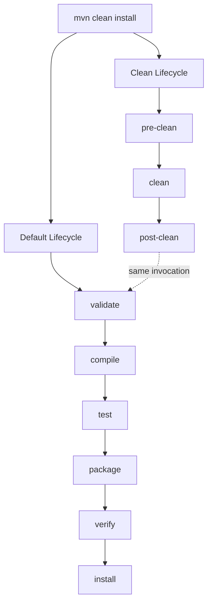
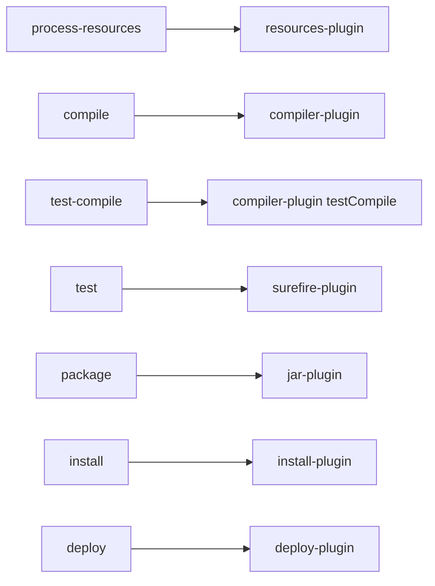
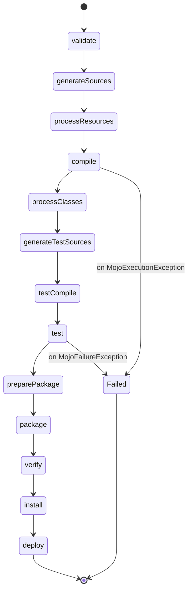
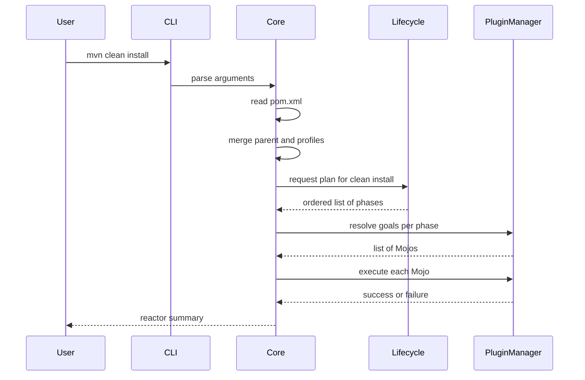

# Maven Lifecycle and Plugins

## Overview

Maven is a declarative build tool that abstracts away the imperative details of compiling, testing, packaging, and deploying Java projects. Instead of telling Maven **how** to build a project, you describe **what** the project is, and Maven figures out the rest through its lifecycle, phase, and plugin goal model. This philosophical shift from tasks to phases is the single most important concept for a Java engineer to internalize, because every Maven command you will ever type is anchored to that lifecycle.

This note takes you deep into Maven 3.9.x (the last 3.x line before Maven 4) and the underlying machinery that turns a Project Object Model file into a deployable artifact. You will learn the three built-in lifecycles (clean, default, site), the precise semantics of every default lifecycle phase, how plugin goals bind to phases, how to configure and write your own plugins, and how to debug the build when things go wrong. We will use Mermaid diagrams to visualize phase ordering and plugin binding, real XML snippets that you can paste into your own POM, and a battery of interview questions with model answers.

By the end you should be able to look at any Maven build log and confidently answer three questions: which lifecycle is running, which phase triggered which plugin goal, and what configuration that goal inherited from the POM.

## Background Knowledge

Before diving into lifecycles, make sure you have a working mental model of the following Maven primitives:

- **Project Object Model (POM)**: an XML document named `pom.xml` that describes a project's coordinates (`groupId`, `artifactId`, `version`), dependencies, plugins, and metadata. Maven reads it once at the start of every build and constructs an in memory `MavenProject` object.
- **Artifact**: the output of a build, typically a JAR, WAR, EAR, or ZIP file identified by its GAV coordinates.
- **Coordinates (GAV)**: the `groupId:artifactId:version` triple that uniquely identifies an artifact in any repository.
- **Plugin**: a collection of one or more goals (also called Mojos). Each goal is a Java class annotated with `@Mojo` that performs one specific unit of work, such as compiling sources or copying resources.
- **Goal (Mojо)**: the unit of execution. Goals are bound to lifecycle phases by default or explicitly through the `execution` element.
- **Phase**: a step in a lifecycle. Phases are ordered; running a phase runs every preceding phase in that lifecycle first.
- **Lifecycle**: an ordered sequence of phases. Maven ships with three lifecycles: `clean`, `default`, and `site`.

A useful analogy: a lifecycle is a train line, phases are stations along the line, and plugin goals are the trains that stop at those stations. When you say `mvn package`, Maven walks the default lifecycle from the first station up to `package`, letting every goal bound to each station do its work in order.

## The Three Built-in Lifecycles

Maven defines three lifecycles out of the box. Each is independent, but they can be combined on the command line.

### The Clean Lifecycle

The clean lifecycle is responsible for removing the output of previous builds. It contains three phases.

1. **pre-clean** - executes any processes needed before the actual cleaning.
2. **clean** - removes the `target` directory generated by the previous build.
3. **post-clean** - executes any processes needed to finalize the cleaning, such as restoring generated sources that should survive a clean.

Only the `clean` phase has a default binding, namely `maven-clean-plugin:clean`. The other two phases are empty by default and exist for you to bind custom goals to.

### The Default Lifecycle

The default lifecycle is the heart of Maven. It is the lifecycle that handles project compilation, testing, packaging, installation, and deployment. The default lifecycle contains the following phases, in execution order.

1. **validate** - validates that the project is correct and all required information is available.
2. **initialize** - initializes build state, such as setting properties or creating directories.
3. **generate-sources** - generates any source code for inclusion in compilation.
4. **process-sources** - processes the source code, for example filtering values into source files.
5. **generate-resources** - generate resources for inclusion in the package.
6. **process-resources** - copy and process the resources into the destination directory, ready for packaging.
7. **compile** - compile the source code of the project.
8. **process-classes** - post-process the generated files from compilation, for example bytecode enhancement on Java classes.
9. **generate-test-sources** - generate any test source code for inclusion in compilation.
10. **process-test-sources** - process the test source code, for example filtering values.
11. **generate-test-resources** - create resources for testing.
12. **process-test-resources** - copy and process the resources into the test destination directory.
13. **test-compile** - compile the test source code into the test destination directory.
14. **process-test-classes** - post-process the generated files from test compilation.
15. **test** - run tests using a suitable unit testing framework. These tests should not require the code to be packaged or deployed.
16. **prepare-package** - perform any operations necessary to prepare a package before the actual packaging. This often results in an unpacked, processed version of the package.
17. **package** - take the compiled code and package it in its distributable format, such as a JAR.
18. **verify** - run integration checks on results of integration tests to ensure quality criteria are met.
19. **install** - install the package into the local repository, for use as a dependency in other projects locally.
20. **deploy** - copies the final package to the remote repository for sharing with other developers and projects.

### The Site Lifecycle

The site lifecycle handles the generation and publication of project documentation sites.

1. **pre-site** - execute processes needed before the actual project site generation.
2. **site** - generate the project's site documentation.
3. **post-site** - execute processes needed to finalize the site generation, and to prepare for site deployment.
4. **site-deploy** - deploy the generated site documentation to the specified web server.



## Phase Execution Semantics

When you invoke a phase, Maven executes every phase up to and including the one you named, in order, in the same lifecycle. Invoking two phases from different lifecycles, such as `mvn clean install`, runs the clean lifecycle up to `clean`, then the default lifecycle up to `install`.

Important subtleties to remember:

- **No partial lifecycle runs.** You cannot run only the `test` phase without running `compile` first, because Maven always walks the lifecycle linearly from the start.
- **Phases are not goals.** A phase is a placeholder. If nothing is bound to it, it is a no-op. If multiple goals are bound to the same phase, they execute in declaration order.
- **Phases can be skipped at the goal level.** A plugin goal may choose to skip itself based on configuration (for example `maven.test.skip`), but the phase still executes.
- **Same phase, same name, different lifecycle.** The `site` phase in the site lifecycle is unrelated to any default lifecycle phase. Maven uses the lifecycle context to disambiguate.

## Plugin Goal Bindings

The default lifecycle is intentionally empty in the Maven core. All the actual work is done by plugins that ship with sensible default bindings depending on the `packaging` of the project. The `maven-core` artifact ships with a `default-bindings.xml` descriptor that lists which plugin goals are bound to which phases for each packaging type.

For a project with `packaging` set to `jar` (the default), the default bindings are as follows.

| Phase                  | Plugin Goal                                  |
|------------------------|----------------------------------------------|
| process-resources      | maven-resources-plugin:resources             |
| compile                | maven-compiler-plugin:compile                |
| process-test-resources | maven-resources-plugin:testResources         |
| test-compile           | maven-compiler-plugin:testCompile            |
| test                   | maven-surefire-plugin:test                   |
| package                | maven-jar-plugin:jar                         |
| install                | maven-install-plugin:install                 |
| deploy                 | maven-deploy-plugin:deploy                   |

For `packaging` set to `war`, additional goals like `maven-war-plugin:war` are bound to `package`, and for `maven-plugin` packaging, the `maven-plugin-plugin:descriptor` goal binds to `process-classes`.



## Configuring Plugins

Each plugin goal accepts parameters that influence its behavior. You configure them inside `<build><plugins>` in the POM. Here is a realistic example that pins the compiler plugin to Java 21 and configures Surefire to run tests in parallel.

```xml
<build>
  <plugins>
    <plugin>
      <groupId>org.apache.maven.plugins</groupId>
      <artifactId>maven-compiler-plugin</artifactId>
      <version>3.13.0</version>
      <configuration>
        <release>21</release>
        <compilerArgs>
          <arg>-Xlint:all</arg>
          <arg>-parameters</arg>
        </compilerArgs>
      </configuration>
    </plugin>
    <plugin>
      <groupId>org.apache.maven.plugins</groupId>
      <artifactId>maven-surefire-plugin</artifactId>
      <version>3.2.5</version>
      <configuration>
        <parallel>methods</parallel>
        <threadCount>4</threadCount>
        <forkCount>2</forkCount>
        <reuseForks>true</reuseForks>
      </configuration>
    </plugin>
  </plugins>
</build>
```

### Plugin Management vs Plugins

The `<pluginManagement>` element lives inside `<build>` and is used to share plugin configuration across a hierarchy of projects. A plugin declared in `<pluginManagement>` is **not** activated unless the same plugin is also declared in `<plugins>` somewhere in the hierarchy. This is the plugin equivalent of `<dependencyManagement>`, and it is the canonical pattern for multi-module builds.

```xml
<build>
  <pluginManagement>
    <plugins>
      <plugin>
        <groupId>org.apache.maven.plugins</groupId>
        <artifactId>maven-compiler-plugin</artifactId>
        <version>3.13.0</version>
        <configuration>
          <release>21</release>
        </configuration>
      </plugin>
    </plugins>
  </pluginManagement>
  <plugins>
    <plugin>
      <groupId>org.apache.maven.plugins</groupId>
      <artifactId>maven-compiler-plugin</artifactId>
      <!-- version and configuration inherited from pluginManagement -->
    </plugin>
  </plugins>
</build>
```

## Executions

An `execution` element binds a specific goal to a specific phase with its own configuration. This is how you run the same plugin multiple times with different parameters, or attach a goal to a non-default phase.

The following example runs the `wsdl2java` goal of the CXF plugin during the `generate-sources` phase and binds the Maven JAR plugin to also produce a sources JAR during `package`.

```xml
<plugin>
  <groupId>org.apache.cxf</groupId>
  <artifactId>cxf-codegen-plugin</artifactId>
  <version>4.0.3</version>
  <executions>
    <execution>
      <id>generate-sources-from-wsdl</id>
      <phase>generate-sources</phase>
      <goals>
        <goal>wsdl2java</goal>
      </goals>
      <configuration>
        <wsdlOptions>
          <wsdlOption>
            <wsdl>${project.basedir}/src/main/resources/contract.wsdl</wsdl>
          </wsdlOption>
        </wsdlOptions>
      </configuration>
    </execution>
  </executions>
</plugin>
<plugin>
  <groupId>org.apache.maven.plugins</groupId>
  <artifactId>maven-source-plugin</artifactId>
  <version>3.3.1</version>
  <executions>
    <execution>
      <id>attach-sources</id>
      <phase>package</phase>
      <goals>
        <goal>jar-no-fork</goal>
      </goals>
    </execution>
  </executions>
</plugin>
```

Key points about executions:

- The `id` must be unique within a plugin's executions list. Maven will warn at startup if you omit it.
- The `phase` is optional. If omitted, the goal binds to its default phase as declared by the plugin's `@Execute(phase = ...)` annotation.
- The `goals` element lists which Mojos of the plugin should run. You can list multiple goals.
- The `configuration` inside an execution overrides and merges with any configuration declared at the plugin level.

## Writing Your Own Plugin Goal

Maven plugins are just ordinary JAR artifacts that contain classes annotated with `@Mojo`. To create one, start with a project that has `packaging` set to `maven-plugin`. Here is a minimal Mojo that prints a greeting during the `initialize` phase.

```java
package com.example.mavenplugins;

import org.apache.maven.plugin.AbstractMojo;
import org.apache.maven.plugin.MojoExecutionException;
import org.apache.maven.plugins.annotations.LifecyclePhase;
import org.apache.maven.plugins.annotations.Mojo;
import org.apache.maven.plugins.annotations.Parameter;

@Mojo(name = "greet", defaultPhase = LifecyclePhase.INITIALIZE)
public class GreetMojo extends AbstractMojo {

    @Parameter(property = "greet.name", defaultValue = "World")
    private String name;

    @Override
    public void execute() throws MojoExecutionException {
        getLog().info("Hello, " + name + "!");
    }
}
```

The `@Parameter` annotation exposes a configurable parameter that can be set in the POM or overridden on the command line with `-Dgreet.name=Maven`. The `property` attribute makes the parameter overridable via system property; the `defaultValue` is used when neither the POM nor the command line sets a value.

Build and install the plugin locally, then reference it in another project.

```xml
<build>
  <plugins>
    <plugin>
      <groupId>com.example.mavenplugins</groupId>
      <artifactId>greeting-maven-plugin</artifactId>
      <version>1.0.0</version>
      <executions>
        <execution>
          <phase>initialize</phase>
          <goals>
            <goal>greet</goal>
          </goals>
          <configuration>
            <name>Engineer</name>
          </configuration>
        </execution>
      </executions>
    </plugin>
  </plugins>
</build>
```

Running `mvn initialize` will now log `Hello, Engineer!` before any other work happens.

## The Build Lifecycle as a State Machine

A useful mental model is to view the lifecycle as a state machine in which each phase transitions to the next only if every bound goal succeeded. If a goal throws a `MojoExecutionException`, Maven aborts the build with the `BUILD FAILURE` status. If a goal throws a `MojoFailureException`, Maven also aborts but interprets it as a soft failure (typically a test failure or an enforcer rule violation).



## Commonly Used Lifecycle Commands

- `mvn clean` - runs the clean lifecycle up to `clean`.
- `mvn compile` - runs the default lifecycle up to `compile`, producing `.class` files under `target/classes`.
- `mvn test` - runs up to `test`. Surefire executes unit tests under `src/test/java`.
- `mvn package` - runs up to `package`. Produces a JAR/WAR in `target/`.
- `mvn verify` - runs up to `verify`. Use this when you have integration tests bound via Failsafe.
- `mvn install` - runs up to `install`. The artifact lands in `~/.m2/repository`.
- `mvn deploy` - runs up to `deploy`. Requires a `<distributionManagement>` section.
- `mvn site` - generates project documentation site under `target/site/`.
- `mvn clean deploy` - typical release command. Runs clean, then full default lifecycle up to `deploy`.

You can also invoke plugin goals directly, bypassing the lifecycle entirely, by specifying their fully qualified coordinates: `mvn org.apache.maven.plugins:maven-compiler-plugin:3.13.0:compile`. This is rarely needed but useful for debugging.

## Common Pitfalls

### Forgetting that `clean` is a separate lifecycle

A frequent confusion is assuming that `mvn install` cleans the project first. It does not. If you changed source files in a way that breaks incremental compilation (for example deleting a class that other classes still reference), `mvn install` may produce stale or confusing output. Run `mvn clean install` whenever in doubt, especially before releases.

### Assuming phases always run goals

Engineers new to Maven often assume that running `mvn package` runs the JAR plugin twice, once at `package` and again at `install`. It does not. The JAR plugin is bound only to `package`; the `install` phase runs the `install-plugin:install` goal, which simply copies the already built JAR into the local repository.

### Mixing `maven.test.skip` and `skipTests`

These two properties behave differently and people conflate them.

- `skipTests` (Surefire property) skips the **execution** of unit tests, but the test sources are still compiled. Useful when you want fast feedback but your tests are broken.
- `maven.test.skip` (a core property understood by both Surefire and the compiler plugin) skips both test compilation and execution. Use this only when you genuinely do not want any test artifact in your build.

### Overriding plugin versions implicitly

If you declare a plugin without a `<version>`, Maven resolves it against the `pluginManagement` section of the super POM or your parent POM. This means the actual version can shift silently when you upgrade your parent POM. Always pin plugin versions explicitly in production builds, ideally through `<pluginManagement>` in a shared parent POM.

### Expecting `executions` to run in POM order across plugins

Within a single plugin, executions run in the order they are declared in the POM. Across plugins bound to the same phase, Maven uses the **plugin declaration order** in the POM as the tiebreaker. If you depend on a specific ordering, document it loudly, because subtle reorderings of plugins in the POM can change behavior.

### Not realizing that `deploy` requires configuration

The `deploy` phase does nothing useful unless you declare a `<distributionManagement>` block with a `repository` (and usually a `snapshotRepository`). Without it, Maven throws `"Deployment failed: repository element was not specified in the POM inside distributionManagement element"`.

## Tips and Tricks

- Use `mvn -X ...` to enable debug output and see the exact plugin versions, parameters, and classpaths Maven is using.
- Use `mvn help:effective-pom` to print the fully merged POM after inheritance and profile activation. This is invaluable for debugging why a plugin behaved unexpectedly.
- Use `mvn help:effective-settings` to print the effective `settings.xml`, including mirrors and servers resolved from the global file.
- Use `mvn dependency:tree` and `dependency:analyze` regularly to spot unused declared dependencies and undeclared transitive dependencies.
- Use `mvn versions:display-dependency-updates` to find newer versions of dependencies.
- Use `mvn enforcer:enforce` with the `requireMavenVersion` and `requireJavaVersion` rules to fail the build early when the environment is wrong.
- Combine `mvn -T 1C clean install` to build modules in parallel using one thread per CPU core. This can dramatically cut wall clock time for large multi-module projects.
- Pin the Maven version itself using the Maven Wrapper (`mvnw`). Running `mvn wrapper:wrapper -Dmaven=3.9.6` generates a `mvnw` script and a `maven-wrapper.properties` file that locks the build to a specific Maven version.

## Interview Questions

**Question:** What is the difference between a lifecycle, a phase, and a plugin goal in Maven?

**Answer:** A lifecycle is an ordered sequence of phases that represents a high-level workflow like building or cleaning a project. Maven ships with three lifecycles: clean, default, and site. A phase is a step within a lifecycle. When you invoke a phase, Maven runs every preceding phase in that lifecycle. A plugin goal (also called a Mojo) is the actual unit of work, implemented as a Java class annotated with `@Mojo`. Goals are bound to phases either by Maven's default bindings (which depend on the packaging type) or explicitly via `<execution>` elements in the POM. The phase itself does nothing; it merely provides a slot into which goals are scheduled.

**Question:** What happens when you run `mvn package`?

**Answer:** Maven walks the default lifecycle from `validate` up to `package`, executing every plugin goal bound to each phase in order. For a project with `jar` packaging, that means the resources plugin copies and filters resources, the compiler plugin compiles main sources and test sources, Surefire runs unit tests, and finally the JAR plugin packages the compiled classes and resources into a JAR under `target/`. Phases with no goals bound to them are skipped silently.

**Question:** Why does `mvn install` not produce a new JAR if you already ran `mvn package`?

**Answer:** Because the JAR is built once during the `package` phase by `maven-jar-plugin:jar`, and `install` simply copies that already built artifact into the local repository using `maven-install-plugin:install`. The `install` phase does not re-trigger packaging.

**Question:** How would you run a custom plugin goal during the `generate-sources` phase?

**Answer:** Declare the plugin in `<build><plugins>`, add an `<executions>` block with a unique `id`, set `<phase>generate-sources</phase>`, list the goal under `<goals>`, and provide any `<configuration>` needed. Maven will invoke the goal every time the `generate-sources` phase runs.

**Question:** What is the difference between `<plugins>` and `<pluginManagement>`?

**Answer:** `<plugins>` activates plugins immediately. `<pluginManagement>` only declares versions and configuration that are inherited when the same plugin is also declared in `<plugins>` (in the same project or any descendant). The pattern is to centralize versions and shared configuration in `<pluginManagement>` of a parent POM, then reference the plugin without a version in each child module that needs it.

**Question:** How do you skip tests without skipping test compilation?

**Answer:** Pass `-DskipTests` on the command line. Surefire will skip test execution but the compiler plugin still compiles test sources, producing `target/test-classes`. If you also want to skip test compilation, use `-Dmaven.test.skip=true`.

**Question:** Can two plugins bind to the same phase? If so, in what order do they run?

**Answer:** Yes. Maven allows multiple executions across plugins to bind to the same phase. Within a single plugin, executions run in declaration order. Across plugins, Maven uses the order in which plugins are declared in the POM as the tiebreaker. This is rarely a problem in practice, but it is the reason you should think carefully about plugin ordering in your POM when goals have side effects that interact.

**Question:** What is the Maven Wrapper and why should you use it?

**Answer:** The Maven Wrapper (`mvnw` and `mvnw.cmd` shell scripts plus a `.mvn/wrapper/maven-wrapper.properties` file) pins the Maven version used to build a project. When you run `./mvnw clean install`, the wrapper downloads the specified Maven version if it is not already present and then runs that exact version. This guarantees reproducible builds across machines and CI environments, regardless of which Maven version is installed system-wide.

## Lifecycle Customization and Profiles

Real-world projects rarely use the default lifecycle untouched. You often need to inject behavior conditionally based on environment, target platform, or release versus snapshot builds. Maven supports this through **profiles**. A profile is a partial POM that is merged into the effective POM when activated. Profiles can modify dependencies, plugins, properties, repositories, and even the `finalName` of the build.

Activation can be explicit (`-PprofileId` on the command line) or implicit based on JDK version, OS family, file presence, or system property. The example below shows a profile that activates only when running on JDK 21 or higher and that switches the compiler to emit preview features.

```xml
<profiles>
  <profile>
    <id>jdk21-preview</id>
    <activation>
      <jdk>[21,)</jdk>
    </activation>
    <build>
      <plugins>
        <plugin>
          <groupId>org.apache.maven.plugins</groupId>
          <artifactId>maven-compiler-plugin</artifactId>
          <configuration>
            <release>21</release>
            <enablePreview>true</enablePreview>
          </configuration>
        </plugin>
      </plugins>
    </build>
  </profile>
</profiles>
```

A second profile pattern is the release profile that bundles sources and Javadoc JARs and signs artifacts with GPG. The `maven-release-plugin` already creates a built-in `release-profiles` activation, but many teams prefer to define their own to keep control over the exact steps.

```xml
<profile>
  <id>release</id>
  <build>
    <plugins>
      <plugin>
        <groupId>org.apache.maven.plugins</groupId>
        <artifactId>maven-source-plugin</artifactId>
        <executions>
          <execution>
            <id>attach-sources</id>
            <goals><goal>jar-no-fork</goal></goals>
          </execution>
        </executions>
      </plugin>
      <plugin>
        <groupId>org.apache.maven.plugins</groupId>
        <artifactId>maven-javadoc-plugin</artifactId>
        <executions>
          <execution>
            <id>attach-javadocs</id>
            <goals><goal>jar</goal></goals>
          </execution>
        </executions>
      </plugin>
      <plugin>
        <groupId>org.apache.maven.plugins</groupId>
        <artifactId>maven-gpg-plugin</artifactId>
        <executions>
          <execution>
            <id>sign-artifacts</id>
            <phase>verify</phase>
            <goals><goal>sign</goal></goals>
          </execution>
        </executions>
      </plugin>
    </plugins>
  </build>
</profile>
```

## Advanced Plugin Concepts

### Mojo Annotations

Beyond `@Mojo`, plugin authors have a rich set of annotations to declare behavior. The most important ones are:

- `@Execute(phase = ...)` declares that the Mojo triggers another lifecycle phase before running its own logic. This is how `maven-surefire-plugin` ensures test compilation happens before test execution even when you call the goal directly.
- `@RequiresDependencyResolution(scope)` tells Maven to resolve a particular scope of dependencies before invoking the Mojo. The compiler plugin uses `COMPILE` scope; Surefire uses `TEST` scope.
- `@RequiresProject(false)` declares that the Mojo can run outside a project (without a POM). This is used by `mvn archetype:generate` so you can scaffold a new project anywhere.
- `@Parameter(defaultValue = "${project.build.directory}", readonly = true)` injects the build output directory into the Mojo without allowing the user to override it.

### Plugin Resolution and Class Loader Isolation

Maven loads each plugin in its own class loader, isolated from the project classpath and from other plugins. This isolation is what allows plugins to depend on conflicting library versions (for example, an older Guava) without affecting your project. When a Mojo needs to access project classes, it must declare `@RequiresDependencyResolution` and read them from the resolved classpath rather than from its own class loader.

The implication is that you cannot simply put a dependency on the project classpath and expect a plugin to see it. If a plugin needs a library at runtime, that library must be declared as a dependency of the plugin, not of the project.

### Build Extensions

A **build extension** is a special plugin that is loaded before the lifecycle begins, typically to add support for a new packaging type or a custom lifecycle. Extensions are declared under `<build><extensions>` instead of `<plugins>`. A classic example is the `docker-maven-plugin` extension, which adds a `docker` packaging type so that `mvn package` produces a Docker image instead of a JAR.

```xml
<build>
  <extensions>
    <extension>
      <groupId>io.fabric8</groupId>
      <artifactId>docker-maven-plugin</artifactId>
      <version>0.44.0</version>
    </extension>
  </extensions>
</build>
```

### Plugin Prefix Resolution

When you type `mvn spring-boot:run`, Maven resolves the `spring-boot` prefix to a full plugin coordinate. It does this by querying the `maven-metadata.xml` file of each configured repository, looking for a plugin matching that prefix. If multiple repositories define the same prefix, the first one in declaration order wins. This is why occasional "plugin prefix not found" errors usually indicate that you need to add the Spring repository or explicitly declare the plugin in your POM.

## Interlude: The Effective Build

When Maven starts, it assembles the effective POM by merging the super POM, your parent POM, your project POM, and any active profiles. The same merge happens for the build section: `<pluginManagement>` flows down from parents; `<plugins>` from children override matching entries from parents; `<execution>` elements are merged by `id`. Understanding this merge is essential when a plugin behaves differently in two modules of the same project.

Run `mvn help:effective-pom` to inspect the merged result. Look for the `<build>` section in particular; you will often find plugins inherited from a parent that you did not realize were active, which explains surprising behavior like automatic source JAR generation or license header enforcement.

## Practical Walkthrough: A Full Lifecycle Run

Let us trace through what Maven actually does when you run `mvn clean install` on a typical Java 21 library project with the standard layout.

1. **Parse the POM and merge with super POM and parent POM.** Maven reads `pom.xml`, resolves the parent if any, applies active profiles, and produces the effective POM in memory.
2. **Resolve properties.** Properties such as `${project.build.directory}` are resolved to their concrete values, in this case `target`.
3. **Build the lifecycle plan.** Maven asks the lifecycle executor to compute the sequence of phases to run for `clean install`, which expands to all phases of the clean lifecycle up to `clean`, followed by all phases of the default lifecycle up to `install`.
4. **Compute plugin bindings.** For each phase in the plan, Maven asks the plugin manager which goals are bound. For `jar` packaging, the `package` phase binds to `maven-jar-plugin:jar`.
5. **Resolve plugins and their dependencies.** Each plugin is resolved from the local repository or downloaded from a remote one. Plugin dependencies are resolved transitively.
6. **Execute the plan.** Maven walks each phase and invokes the goals in order, passing them the configured parameters.
7. **Report results.** Each goal logs to the console, and Maven prints a summary reactor table at the end showing the time spent in each module.



## Performance Considerations

Large multi-module builds can become slow if you treat Maven like a black box. A few techniques go a long way.

- **Parallel builds.** `mvn -T 1C clean install` builds independent modules in parallel using one thread per CPU core. Maven analyzes the reactor dependency graph and schedules modules that do not depend on each other concurrently.
- **Daemon mode.** Maven 4 introduces a daemon (`mvnd`) that keeps a warm JVM around to skip startup overhead. For Maven 3, you can install mvnd separately.
- **Avoid full reactor rebuilds.** Use `-pl` to build specific modules and `-am` to also build their dependencies upstream: `mvn -pl module-a -am install`.
- **Skip tests selectively.** `-DskipTests` keeps test compilation but skips execution. Combine with `-pl` for surgical rebuilds during development.
- **Lazy repository resolution.** Use `mvn -o` (offline) once your local repository has everything; this skips remote metadata lookups and is dramatically faster.

## Common Pitfalls

### Confusing `defaultPhase` with required execution

The `defaultPhase` attribute of `@Mojo` only matters when the goal is bound automatically by Maven (which is rare for custom plugins). For goals bound through `<executions>`, the `defaultPhase` is the fallback if you omit `<phase>` in the execution, but you should always set `<phase>` explicitly for clarity.

### Declaring plugins in `<reporting>` and expecting them to run during `package`

The `<reporting>` section configures plugins that generate documentation for the site lifecycle. It is unrelated to the default lifecycle. If you configure the Javadoc plugin only under `<reporting>`, `mvn package` will not produce a Javadoc JAR. You must declare an execution under `<plugins>` for that.

### Forgetting that `mvn deploy` is the only phase that publishes artifacts

Some engineers expect `mvn install` to push to a remote repository. It does not. `install` copies into the local repository under `~/.m2/repository`. Only `deploy` publishes to a remote repository defined in `<distributionManagement>`.

### Expecting transitive plugin dependencies to leak into the project classpath

A plugin's dependencies are isolated. Adding `guava` as a dependency of `maven-compiler-plugin` does not make Guava available to your code. Each plugin gets its own class loader.

## Tips and Tricks

- Use `mvn -DskipTests=true -Dmaven.javadoc.skip=true clean install` for fast feedback during active development.
- Use `mvn help:describe -Dplugin=org.springframework.boot:spring-boot-maven-plugin` to print a description of every goal the plugin exposes, along with its parameters.
- Use `mvn dependency:purge-local-repository` to delete and re-resolve the project's dependencies, useful when a local JAR has been corrupted.
- Use `mvn org.codehaus.mojo:versions-maven-plugin:2.16.2:set -DnewVersion=1.2.3` to set the version of every module in a multi-module reactor at once.
- Use `mvn enforcer:enforce -Drules=requireMavenVersion -Drules.mavenVersion=3.9.0` to fail builds on older Maven versions.
- Use `mvn -Dmaven.repo.local=/tmp/clean-m2 clean install` to build against a fresh local repository, useful for reproducing CI issues locally.

## Interview Questions

**Question:** What is the difference between `@Mojo` and `@Execute` annotations?

**Answer:** `@Mojo` declares that a class is a plugin goal and specifies its name, default phase, and other metadata like instantiation strategy. `@Execute` declares that the Mojo triggers an additional lifecycle execution before its own logic runs. For example, a Mojo that needs to package the project before inspecting the packaged JAR would use `@Execute(phase = LifecyclePhase.PACKAGE)`.

**Question:** How does Maven isolate plugin class loaders from the project classpath?

**Answer:** Maven uses a hierarchy of class loaders. The realm class loader of each plugin contains only the plugin's own classes and its declared dependencies, plus references to the Maven core API. Project dependencies are not visible to the plugin's class loader by default. When a Mojo needs project classes, it declares `@RequiresDependencyResolution` and reads them from the resolved classpath that Maven passes in, typically as a parameter of type `org.codehaus.plexus.classworlds.realm.ClassRealm` or by listing them as URLs.

**Question:** What is a build extension and when would you use one?

**Answer:** A build extension is a plugin loaded very early in the build, before the lifecycle starts. Extensions can register custom packaging types, custom lifecycles, or custom artifact handlers. You use one when you want to teach Maven a new kind of build output, such as building Docker images, GraalVM native binaries, or custom archive formats. The extension is declared under `<build><extensions>` instead of `<plugins>`.

**Question:** Explain what the Maven reactor is.

**Answer:** The reactor is the runtime structure Maven builds to model a multi-module project. It computes the dependency graph between modules, decides the build order, and orchestrates execution across modules. When you run `mvn -T 1C install`, the reactor schedules independent modules in parallel. The reactor summary printed at the end of every build reflects the order in which modules were built and how long each took.

**Question:** How would you make Maven fail the build if the JDK version is below 21?

**Answer:** Declare the Maven Enforcer plugin with the `requireJavaVersion` rule in your parent POM, bound to the `validate` phase. The plugin throws a `MojoFailureException` if the JDK version does not match the specified range, aborting the build before any compilation happens.

**Question:** What is the difference between `mvn install` and `mvn deploy`?

**Answer:** `mvn install` builds the project and copies the resulting artifact into your local repository at `~/.m2/repository`, so other projects on the same machine can use it as a dependency. `mvn deploy` does everything `install` does (minus copying locally, depending on configuration) and additionally uploads the artifact to a remote repository declared in `<distributionManagement>`, where it becomes available to other developers and CI systems.

## Summary

Maven's lifecycle-based design is what gives the tool its declarative power. Once you understand that `mvn package` is shorthand for "walk the default lifecycle up to the `package` phase and run every plugin goal bound to each preceding phase", most Maven behavior becomes predictable. The three lifecycles (clean, default, site) provide scaffolding; phases provide slots; plugins and their goals provide the actual work. Default bindings vary by packaging type, and you customize behavior through `<configuration>`, `<executions>`, and `<pluginManagement>`. Mastering this layer lets you read build logs fluently, write your own Mojos when needed, and choose the right phase for custom build logic instead of hacking around with shell scripts. In the next note we will look at dependency resolution, scopes, and multi-module builds, which build directly on the lifecycle and plugin foundation laid here.
