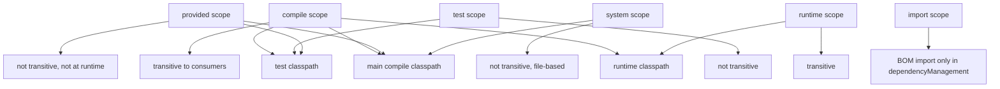
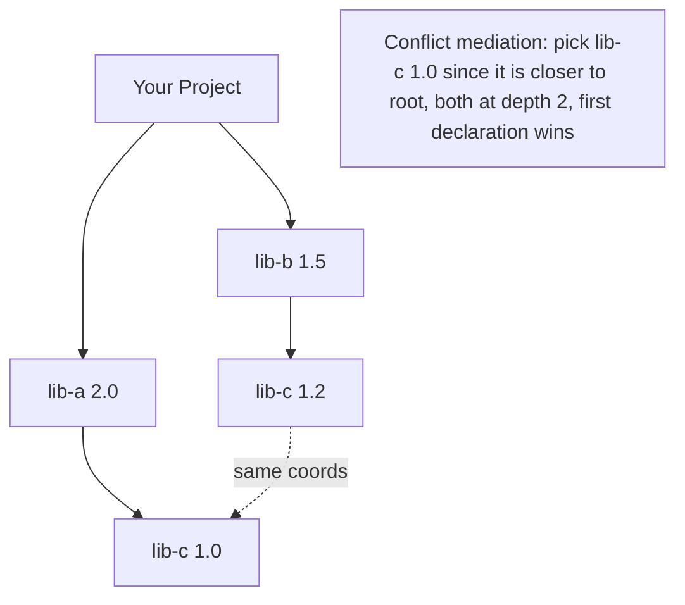
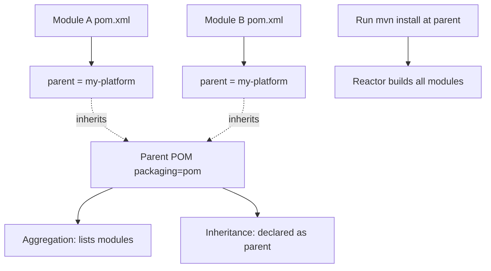
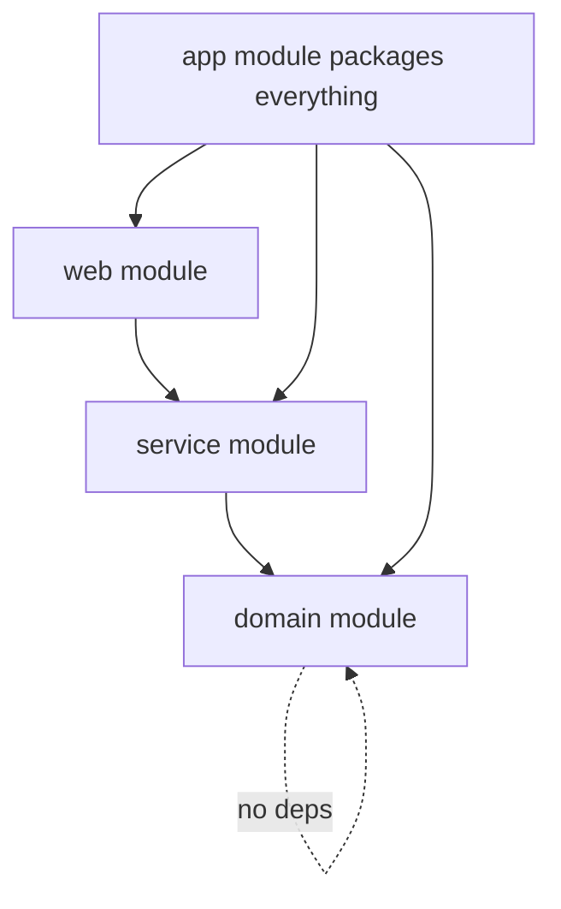

# Maven Dependencies and Multi Module Projects

## Overview

Dependencies are the connective tissue of any non-trivial Java application. They express what code your project needs to compile, what it needs at runtime, what it needs only for tests, and what it expects the deployment environment to provide. Maven's dependency model is powerful enough to express all of these distinctions, but with that power comes a notoriously tricky resolution algorithm that produces conflicts, version skew, and "NoSuchMethodError" surprises if you do not understand it.

This note covers Maven dependency mechanics in depth: declaration, scopes, transitive resolution, conflict mediation, optional and provided dependencies, the bill of materials (BOM) pattern, and dependency management. We then turn to multi-module projects, which let you decompose a large system into smaller Maven projects that share a common parent, share dependency versions, and build together as a reactor. You will see aggregation versus inheritance, the canonical layout, version alignment strategies, and the tooling commands that make large builds manageable.

After reading this note you should be able to look at any `mvn dependency:tree` output and explain exactly why Maven chose the version it did, design a multi-module reactor that builds fast and stays consistent, and apply advanced patterns like BOMs and import-scoped dependencies to keep your ecosystem coherent.

## Background Knowledge

Before we dive in, recall the following Maven primitives from the previous note:

- **Coordinates (GAV)**: the `groupId:artifactId:version` triple.
- **POM**: the project object model, defined in `pom.xml`.
- **Packaging**: the type of artifact produced, such as `jar`, `war`, `pom`, `ear`. The packaging `pom` means the project produces no JAR; it exists only as a parent or aggregator.
- **Local repository**: a directory under `~/.m2/repository` that caches downloaded artifacts.
- **Remote repository**: a server from which Maven downloads artifacts not yet in the local cache.

Dependencies are declared in the `<dependencies>` section of the POM. Each dependency element has at minimum a `groupId`, `artifactId`, and `version`, plus optional `scope`, `type`, `classifier`, `optional`, and `exclusions`.

```xml
<dependencies>
  <dependency>
    <groupId>org.springframework.boot</groupId>
    <artifactId>spring-boot-starter-web</artifactId>
    <version>3.3.0</version>
  </dependency>
  <dependency>
    <groupId>org.junit.jupiter</groupId>
    <artifactId>junit-jupiter</artifactId>
    <version>5.10.2</version>
    <scope>test</scope>
  </dependency>
</dependencies>
```

## Dependency Scopes

Scope is the most important attribute of a dependency after version, because it determines which classpaths the dependency appears on, and whether it is transitive. Maven defines six scopes.

### compile

This is the default scope. A `compile` dependency is available on the main compilation classpath, on the test compilation classpath, at runtime, and is propagated transitively to consumers of the project. Most production dependencies should use `compile`.

### test

A `test` dependency is available only on the test compilation and test execution classpaths. It is not propagated transitively, and it never reaches the runtime classpath. Use this for JUnit, Mockito, Testcontainers, and similar libraries.

### provided

A `provided` dependency is available at compile time and on the test classpath, but is **not** expected to be on the runtime classpath, because the runtime environment (the servlet container, the application server, the framework) supplies it. The dependency is not transitive. Use this for servlet APIs in WAR builds, for `jakarta.annotation` annotations when the runtime provides them, or for `lombok` if your IDE ships it.

### runtime

A `runtime` dependency is not needed for compilation but is needed at runtime. It is transitive. Use this for JDBC drivers: your code depends only on the JDBC API at compile time, but the actual driver implementation must be present at runtime.

### system

A `system` dependency is similar to `provided`, but you supply the JAR via an explicit file path with `<systemPath>`. It is never looked up in a repository. This scope is deprecated in Maven 3.x and forbidden in Maven 4. Avoid it in new projects; if you must use a local JAR, install it into your local repository with `mvn install:install-file` or vendor it via an in-repository layout.

### import

The `import` scope is special: it is used only inside `<dependencyManagement>` to import a BOM (bill of materials) POM. The imported BOM's `<dependencyManagement>` entries are merged into the current project's. We will cover this in detail below.



## Transitive Dependency Resolution

When you declare a dependency on `spring-boot-starter-web`, Maven downloads that artifact, reads its POM, and recursively resolves every dependency declared with a transitive-suitable scope. The result is a directed acyclic graph (DAG) of dependencies rooted at your project.

The transitive graph is not the whole story. Maven applies several filters and rules to it:

1. **Scope filtering.** A transitive dependency of `compile` scope propagates as `compile`. A transitive dependency of `runtime` scope propagates as `runtime`. A transitive dependency of `compile` scope whose parent is declared as `runtime` is downgraded to `runtime`. Transitive dependencies of `test` scope are dropped entirely, because `test` is not transitive.
2. **Conflict mediation.** When two paths through the graph lead to the same `groupId:artifactId` with different versions, Maven picks the version closest to the root of the graph. If both are at the same depth, the first declared wins.
3. **Optional dependencies.** A dependency marked `<optional>true</optional>` is not transitive. If project A depends on B and B has an optional dependency on C, A does not automatically get C. A must declare C explicitly if it needs it.
4. **Exclusions.** A consumer can exclude specific transitive dependencies with `<exclusions>`. Exclusions propagate: if A excludes X through B, then any consumer of A also does not see X via that path.
5. **Dependency management.** Versions declared in `<dependencyManagement>` of a project (or its parent) override the versions of transitive dependencies. This is the canonical way to enforce a single version of a library across the entire graph.



## Dependency Management and BOMs

`<dependencyManagement>` is a section in the POM that declares versions and configurations for dependencies without actually adding them to the dependency graph. Any `<dependency>` declared in `<dependencies>` that matches an entry in `<dependencyManagement>` inherits the version, scope, and exclusions from that entry. This is how you centralize versions in a multi-module project.

```xml
<dependencyManagement>
  <dependencies>
    <dependency>
      <groupId>org.springframework.boot</groupId>
      <artifactId>spring-boot-dependencies</artifactId>
      <version>3.3.0</version>
      <type>pom</type>
      <scope>import</scope>
    </dependency>
    <dependency>
      <groupId>org.junit.jupiter</groupId>
      <artifactId>junit-jupiter</artifactId>
      <version>5.10.2</version>
    </dependency>
  </dependencies>
</dependencyManagement>
<dependencies>
  <dependency>
    <groupId>org.springframework.boot</groupId>
    <artifactId>spring-boot-starter-web</artifactId>
    <!-- version inherited from the imported BOM -->
  </dependency>
  <dependency>
    <groupId>org.junit.jupiter</groupId>
    <artifactId>junit-jupiter</artifactId>
    <scope>test</scope>
    <!-- version inherited from dependencyManagement -->
  </dependency>
</dependencies>
```

A **BOM** is a POM with `packaging` set to `pom` that contains only a `<dependencyManagement>` section. Importing it via `<scope>import</scope>` brings all those managed dependencies into your project. The Spring Boot dependencies BOM, the Jackson BOM, the JUnit BOM, and the Quarkus BOM are all examples of this pattern. BOMs solve two problems at once: they enforce a consistent set of versions across an ecosystem (so you cannot accidentally mix Spring 6 with Spring Security 5), and they free consumers from having to specify versions at every dependency declaration.

### Multiple BOM Imports and Ordering

You can import multiple BOMs. They are processed in declaration order. Later imports override earlier ones for the same `groupId:artifactId` key. This is useful when you want a platform BOM like `spring-boot-dependencies` but want to override a single library version with a more recent one declared in your own BOM.

```xml
<dependencyManagement>
  <dependencies>
    <dependency>
      <groupId>org.springframework.boot</groupId>
      <artifactId>spring-boot-dependencies</artifactId>
      <version>3.3.0</version>
      <type>pom</type>
      <scope>import</scope>
    </dependency>
    <dependency>
      <groupId>com.example</groupId>
      <artifactId>my-platform</artifactId>
      <version>1.4.0</version>
      <type>pom</type>
      <scope>import</scope>
    </dependency>
  </dependencies>
</dependencyManagement>
```

## Exclusions and Optional Dependencies

### Exclusions

Exclusions are the surgical instrument for cutting a single transitive dependency out of the graph. They are most often used to remove a vulnerable or buggy transitive library, or to swap one implementation for another.

```xml
<dependency>
  <groupId>org.springframework.boot</groupId>
  <artifactId>spring-boot-starter-web</artifactId>
  <exclusions>
    <exclusion>
      <groupId>org.springframework.boot</groupId>
      <artifactId>spring-boot-starter-tomcat</artifactId>
    </exclusion>
  </exclusions>
</dependency>
<dependency>
  <groupId>org.springframework.boot</groupId>
  <artifactId>spring-boot-starter-undertow</artifactId>
</dependency>
```

This pattern replaces the default Tomcat starter with Undertow. Without the exclusion, both would be on the classpath, and Spring Boot would refuse to start due to multiple servlet containers.

Maven 3.2.1 supports wildcard exclusions via `<groupId>*</groupId>` and `<artifactId>*</artifactId>`, which excludes all transitive dependencies of a single direct dependency. This is rarely a good idea in production because it can break legitimate transitive needs, but it is useful for creating "thin" starters.

### Optional Dependencies

A dependency marked `<optional>true</optional>` is not transitive. This is the polite way to say "I happen to use this library, but consumers of my library should declare it themselves if they need it." Common examples include annotation processors like Lombok, or optional feature flags.

```xml
<dependency>
  <groupId>org.projectlombok</groupId>
  <artifactId>lombok</artifactId>
  <version>1.18.32</version>
  <optional>true</optional>
</dependency>
```

If your consumer wants Lombok to keep working, they must re-declare the dependency in their own POM.

## The dependency:tree Goal

`mvn dependency:tree` is your primary diagnostic tool. It prints the resolved graph in an indented format showing each direct dependency and its transitive subtree, with conflict resolution annotations in parentheses.

```
com.example:my-app:jar:1.0.0
+- org.springframework.boot:spring-boot-starter-web:jar:3.3.0:compile
|  +- org.springframework.boot:spring-boot-starter:jar:3.3.0:compile
|  |  \- org.springframework.boot:spring-boot:jar:3.3.0:compile
|  +- org.springframework.boot:spring-boot-starter-json:jar:3.3.0:compile
|  \- org.springframework.boot:spring-boot-starter-tomcat:jar:3.3.0:compile
+- org.junit.jupiter:junit-jupiter:jar:5.10.2:test
\- com.google.guava:guava:jar:32.1.3-jre:compile
   \- com.google.guava:failureaccess:jar:1.0.2:compile
```

Annotations you may see:

- `(version managed from X.Y.Z)` indicates that `<dependencyManagement>` overrode a transitive version.
- `(excluded)` indicates an exclusion applied.
- `(*)` indicates that the dependency was already shown elsewhere in the tree and is omitted for brevity.
- `(omitted for conflict with X.Y.Z)` indicates that conflict mediation chose a different version.

You can also filter the output: `mvn dependency:tree -Dincludes=com.google.guava:guava` shows only the paths to Guava.

## dependency:analyze

`mvn dependency:analyze` inspects your compiled classes to find:

- **Used undeclared dependencies**: dependencies that your code actually uses but that you did not declare directly (they came in transitively). These are ticking time bombs: an upstream change could remove them.
- **Unused declared dependencies**: dependencies you declared but your code does not appear to use. These can usually be removed, with the caveat that runtime-only dependencies (like JDBC drivers) and annotation processors will appear unused because they are not referenced in bytecode.

Run this goal regularly in CI. Treat used-undeclared warnings as bugs; treat unused-declared warnings as candidates for cleanup.

## Multi Module Projects

A multi-module project is a Maven project with `packaging` set to `pom` that declares one or more child modules under `<modules>`. Each module is a subdirectory containing its own `pom.xml` and is a fully-fledged Maven project in its own right.

```xml
<project>
  <modelVersion>4.0.0</modelVersion>
  <groupId>com.example</groupId>
  <artifactId>my-platform</artifactId>
  <version>1.0.0</version>
  <packaging>pom</packaging>

  <modules>
    <module>my-platform-api</module>
    <module>my-platform-core</module>
    <module>my-platform-web</module>
    <module>my-platform-app</module>
  </modules>
</project>
```

### Aggregation versus Inheritance

Two related but distinct concepts:

- **Aggregation**: a parent POM lists `<modules>`. Running a build in the parent runs the build in every child. Aggregation alone does not give children any inheritance; each child POM must declare its own `<parent>` to inherit.
- **Inheritance**: a child POM declares a `<parent>`. The child inherits dependencies, dependency management, plugin management, properties, and repositories from the parent. Inheritance works even without aggregation.

The two usually go together: the same POM is both the aggregator (lists modules) and the parent (is declared as `<parent>` in each child). But they are conceptually separate. You can have an aggregator that is not a parent, or a parent that is not an aggregator.



### The Canonical Layout

A typical multi-module project on disk looks like this:

```
my-platform/
  pom.xml
  my-platform-api/
    pom.xml
    src/main/java/...
  my-platform-core/
    pom.xml
    src/main/java/...
  my-platform-web/
    pom.xml
    src/main/java/...
  my-platform-app/
    pom.xml
    src/main/java/...
```

The parent POM declares `<modules>` with paths relative to the parent directory. Child POMs declare `<parent>` with the parent's GAV coordinates and a `<relativePath>` that defaults to `../pom.xml`.

### The Parent POM Template

A well-structured parent POM centralizes everything that should be uniform across modules: Java version, plugin versions, dependency versions, encoding, compiler flags, and repository configuration. Here is a realistic example.

```xml
<project>
  <modelVersion>4.0.0</modelVersion>
  <groupId>com.example</groupId>
  <artifactId>my-platform</artifactId>
  <version>1.0.0</version>
  <packaging>pom</packaging>

  <modules>
    <module>my-platform-api</module>
    <module>my-platform-core</module>
    <module>my-platform-web</module>
    <module>my-platform-app</module>
  </modules>

  <properties>
    <maven.compiler.release>21</maven.compiler.release>
    <project.build.sourceEncoding>UTF-8</project.build.sourceEncoding>
    <spring-boot.version>3.3.0</spring-boot.version>
    <junit.version>5.10.2</junit.version>
  </properties>

  <dependencyManagement>
    <dependencies>
      <dependency>
        <groupId>org.springframework.boot</groupId>
        <artifactId>spring-boot-dependencies</artifactId>
        <version>${spring-boot.version}</version>
        <type>pom</type>
        <scope>import</scope>
      </dependency>
      <dependency>
        <groupId>org.junit.jupiter</groupId>
        <artifactId>junit-jupiter</artifactId>
        <version>${junit.version}</version>
        <scope>test</scope>
      </dependency>
      <dependency>
        <groupId>com.example</groupId>
        <artifactId>my-platform-api</artifactId>
        <version>${project.version}</version>
      </dependency>
      <dependency>
        <groupId>com.example</groupId>
        <artifactId>my-platform-core</artifactId>
        <version>${project.version}</version>
      </dependency>
    </dependencies>
  </dependencyManagement>

  <build>
    <pluginManagement>
      <plugins>
        <plugin>
          <groupId>org.apache.maven.plugins</groupId>
          <artifactId>maven-compiler-plugin</artifactId>
          <version>3.13.0</version>
          <configuration>
            <release>${maven.compiler.release}</release>
            <compilerArgs>
              <arg>-Xlint:all</arg>
              <arg>-parameters</arg>
            </compilerArgs>
          </configuration>
        </plugin>
        <plugin>
          <groupId>org.apache.maven.plugins</groupId>
          <artifactId>maven-surefire-plugin</artifactId>
          <version>3.2.5</version>
        </plugin>
        <plugin>
          <groupId>org.apache.maven.plugins</groupId>
          <artifactId>maven-failsafe-plugin</artifactId>
          <version>3.2.5</version>
        </plugin>
      </plugins>
    </pluginManagement>
  </build>
</project>
```

A child module then becomes very terse.

```xml
<project>
  <modelVersion>4.0.0</modelVersion>
  <parent>
    <groupId>com.example</groupId>
    <artifactId>my-platform</artifactId>
    <version>1.0.0</version>
  </parent>
  <artifactId>my-platform-core</artifactId>

  <dependencies>
    <dependency>
      <groupId>com.example</groupId>
      <artifactId>my-platform-api</artifactId>
    </dependency>
    <dependency>
      <groupId>org.springframework.boot</groupId>
      <artifactId>spring-boot-starter-web</artifactId>
    </dependency>
    <dependency>
      <groupId>org.junit.jupiter</groupId>
      <artifactId>junit-jupiter</artifactId>
    </dependency>
  </dependencies>
</project>
```

Notice that no versions appear in the child. Everything is inherited from the parent's `<dependencyManagement>` and the imported Spring Boot BOM. This is the gold standard for maintainable multi-module projects.

## The Reactor and Build Order

When Maven builds a multi-module project, it computes the dependency graph between modules and builds them in an order that respects dependencies. The result is the **reactor order**, printed at the start of every multi-module build:

```
Reactor Build Order:
  my-platform
  my-platform-api
  my-platform-core
  my-platform-web
  my-platform-app
```

If module A depends on module B, then B is built first. Circular dependencies between modules are detected and reported as errors.

You can override the reactor with the `-pl`, `-am`, and `-amd` flags:

- `mvn -pl my-platform-core install` builds only the `my-platform-core` module. It will fail if its dependencies on sibling modules are not already in the local repository.
- `mvn -pl my-platform-core -am install` also builds the modules `my-platform-core` depends on (the "also make" flag).
- `mvn -pl my-platform-api -amd install` builds `my-platform-api` and every module that depends on it (the "also make dependents" flag).

## Version Skew and the Release Plugin

In a multi-module reactor, modules depend on each other by version. If module `core` depends on `api:1.0.0`, then `api` must be at version `1.0.0` for the build to work. The classic problem is updating versions across all modules simultaneously, which the `maven-release-plugin` automates with its `prepare` and `perform` goals.

For projects not using the release plugin, the `versions-maven-plugin` is the modern alternative:

- `mvn versions:set -DnewVersion=1.1.0 -DprocessAllModules=true` updates the version of every module in the reactor and the parent reference in each child.
- `mvn versions:commit` removes the backup POMs.
- `mvn versions:revert` restores them.

## SNAPSHOT Versions

A version ending in `-SNAPSHOT` (for example `1.0.0-SNAPSHOT`) is a development version. Maven treats snapshots specially: when resolving a snapshot, it queries the remote repository for a newer timestamped build, downloading it if available. This allows teams to publish intermediate builds without bumping the version.

In production deployments, never depend on a SNAPSHOT from another team unless you have a strong reason. Snapshots can change at any time, breaking your build unpredictably. Release versions (without the `-SNAPSHOT` suffix) are immutable: once `1.0.0` is published, it must never be overwritten.

## Common Pitfalls

### Forgetting to declare versions in dependencyManagement

When versions are scattered across module POMs, upgrading a library means editing dozens of files. Always centralize versions in the parent's `<dependencyManagement>` and reference dependencies without versions in children.

### Mixing dependency declarations in the parent `<dependencies>`

If you put a dependency in the parent's `<dependencies>` (not `<dependencyManagement>`), every child inherits it unconditionally. This is sometimes desired (a logging dependency everyone needs), but more often it leads to surprising classpath pollution. Put shared dependencies in `<dependencyManagement>` and let each module opt in by declaring them in its own `<dependencies>`.

### Confusing `optional` and `provided`

Both scopes effectively keep a dependency off the runtime classpath of consumers, but for different reasons. `optional` says "I use this, but my consumers might not." `provided` says "I use this, but the runtime environment provides it." Use `optional` for things like Lombok; use `provided` for servlet APIs in WAR builds.

### Believing dependency management overrides direct declarations

`<dependencyManagement>` provides default versions for dependencies that are declared without a version. If a child explicitly declares a version, that explicit version wins, even if it differs from the managed version. Maven logs a warning in this case ("is overwritten in parent"), but the build proceeds.

### Assuming transitive dependency updates are safe

If your direct dependency bumps one of its transitive dependencies, the new version lands on your classpath unless you manage it. This can introduce breaking changes. Audit `mvn dependency:tree` after every dependency upgrade.

### Truncating the reactor with `-pl` and forgetting `-am`

Running `mvn -pl my-module install` without `-am` will fail if sibling dependencies are not yet installed in the local repository. Always add `-am` when building a single module of a freshly cloned reactor.

## Tips and Tricks

- Use `mvn dependency:tree -Dverbose` to see every path to every dependency, including the ones Maven omitted due to conflict mediation. The verbose output is the only way to debug diamond conflicts.
- Use `mvn dependency:tree -DoutputFile=tree.txt` to write the tree to a file for review or diffing.
- Use `mvn versions:display-dependency-updates` to see which dependencies have newer versions available in the repositories.
- Use `mvn versions:display-plugin-updates` to see which Maven plugins have newer versions.
- Use `mvn enforcer:enforce -Drules=dependencyConvergence` to fail the build if any dependency appears at two different versions in the resolved graph. This is the strongest guard against version skew.
- Use `mvn enforcer:enforce -Drules=requireUpperBoundDeps` for a slightly more lenient variant that only fails when the conflict mediation would actually pick a lower version than what was requested.
- Use the Maven dependency plugin's `mvn dependency:go-offline` to pre-fetch everything needed for an offline build, useful in Docker layering.
- Use `mvn dependency:copy -Dartifact=com.google.guava:guava:32.1.3-jre -DoutputDirectory=./libs` to download a single artifact.

## Interview Questions

**Question:** What is the difference between `<dependencies>` and `<dependencyManagement>`?

**Answer:** `<dependencies>` declares dependencies that are actually added to the project's classpath. `<dependencyManagement>` declares versions and configurations that are inherited only when the same dependency is also declared in `<dependencies>`. The pattern is to put versions in `<dependencyManagement>` of a parent POM and reference dependencies without versions in children, ensuring a single source of truth for versions.

**Question:** How does Maven resolve version conflicts in transitive dependencies?

**Answer:** Maven uses a "nearest wins" rule. For each `groupId:artifactId` coordinate, Maven walks the dependency graph and picks the version that is closest to the root. If two versions are at the same depth, the first declared wins. Versions declared in `<dependencyManagement>` override this rule entirely. Exclusions can remove specific transitive paths. The result is a single resolved version per coordinate, which is what ends up on the classpath.

**Question:** What is a BOM and how do you use it?

**Answer:** A BOM (bill of materials) is a POM with `packaging=pom` that contains only a `<dependencyManagement>` section. You import it into your project by declaring it with `<type>pom</type>` and `<scope>import</scope>` inside your own `<dependencyManagement>`. This merges the BOM's managed dependencies into your project, allowing you to omit versions when declaring those dependencies. The Spring Boot dependencies BOM is the canonical example.

**Question:** What is the difference between a `provided` dependency and an `optional` one?

**Answer:** A `provided` dependency is on the compile and test classpath but is expected to be supplied by the runtime environment, so Maven does not include it in the package. It is not transitive. An `optional` dependency is a regular dependency that is not propagated transitively to consumers. `provided` is about who supplies the artifact at runtime; `optional` is about whether your consumers should inherit it.

**Question:** What does `mvn dependency:analyze` tell you and why is it useful?

**Answer:** It inspects your compiled bytecode to find dependencies your code actually uses. It reports two categories: used undeclared dependencies (which your code uses but you did not declare directly, meaning they came in transitively and could disappear on an upgrade), and unused declared dependencies (which you declared but your code does not appear to use). Used-undeclared warnings are bugs in waiting; unused-declared warnings are cleanup candidates, with the caveat that runtime-only dependencies will appear unused because they are not referenced in bytecode.

**Question:** How does a Maven multi-module reactor decide build order?

**Answer:** Maven computes a directed graph of inter-module dependencies based on the `<dependencies>` declared in each module's POM. It then performs a topological sort to find an order in which every module is built before the modules that depend on it. Circular dependencies cause a build error. The reactor order is printed at the start of every multi-module build and is what enables parallel builds with `-T` and partial builds with `-pl`.

**Question:** What is the difference between aggregation and inheritance in multi-module Maven projects?

**Answer:** Aggregation is the parent POM listing `<modules>`; running a build at the parent triggers builds in every module. Inheritance is a child POM declaring a `<parent>`; the child inherits dependencies, dependency management, plugin management, properties, and repositories from the parent. They usually go together but are conceptually independent. You can have an aggregator that is not a parent, or a parent that is not an aggregator.

**Question:** Why should SNAPSHOT versions never be used in production releases?

**Answer:** Snapshots are mutable: Maven can resolve a snapshot to a different artifact each time it queries the remote repository, because snapshots are timestamped and overwritten. This makes builds non-reproducible and can introduce unexpected changes at any time. Release versions are immutable; once published, they must never be overwritten, ensuring that a build done today produces the same artifact as a build done six months from now.

**Question:** How would you build only one module of a multi-module reactor along with its upstream dependencies?

**Answer:** Use `mvn -pl my-module -am install`. The `-pl` flag limits the reactor to the specified module, and `-am` (also make) tells Maven to also include any modules in the reactor that the specified module depends on. Without `-am`, the build would fail unless those upstream modules were already installed in the local repository.

## Advanced Multi-Module Patterns

### Layered Architectures

A common pattern is to split a backend application into a `domain` module, a `service` module, and a `web` module, each depending on the previous one. This mirrors the layers of a clean architecture and lets you enforce dependency direction at the build tool level: the `domain` module has zero dependencies on Spring or the web layer, because the reactor simply will not let it declare them (assuming you keep them out of its POM).



### Shared Test Fixtures

When multiple modules share test fixtures (mock data builders, testcontainers wrappers, custom assertions), extract those into a `test-support` module with its own `pom.xml`. Declare its dependencies on the test-support module with `<type>test-jar</type>` so other modules can reuse the test classes.

```xml
<!-- In the test-support module -->
<plugin>
  <groupId>org.apache.maven.plugins</groupId>
  <artifactId>maven-jar-plugin</artifactId>
  <executions>
    <execution>
      <goals>
        <goal>test-jar</goal>
      </goals>
    </execution>
  </executions>
</plugin>

<!-- In a consumer module -->
<dependency>
  <groupId>com.example</groupId>
  <artifactId>my-platform-test-support</artifactId>
  <version>${project.version}</version>
  <type>test-jar</type>
  <scope>test</scope>
</dependency>
```

### Bill of Materials for Internal Libraries

When you publish a set of internal libraries used by other teams, publish a BOM alongside them. The BOM lists every published artifact with its current version. Consumers import the BOM and get every artifact at the matching version without having to track each one individually.

```xml
<project>
  <modelVersion>4.0.0</modelVersion>
  <groupId>com.example</groupId>
  <artifactId>my-platform-bom</artifactId>
  <version>1.0.0</version>
  <packaging>pom</packaging>

  <dependencyManagement>
    <dependencies>
      <dependency>
        <groupId>com.example</groupId>
        <artifactId>my-platform-api</artifactId>
        <version>1.0.0</version>
      </dependency>
      <dependency>
        <groupId>com.example</groupId>
        <artifactId>my-platform-core</artifactId>
        <version>1.0.0</version>
      </dependency>
      <dependency>
        <groupId>com.example</groupId>
        <artifactId>my-platform-web</artifactId>
        <version>1.0.0</version>
      </dependency>
    </dependencies>
  </dependencyManagement>
</project>
```

### Spring Boot Multi Module Applications

A typical Spring Boot multi-module application has a `core` module with the business logic, a `web` module with controllers, and an `app` module that contains the main application class and the Spring Boot Maven plugin. The plugin repackage goal runs only in the `app` module, producing an executable JAR that bundles every dependency.

```xml
<!-- In my-platform-app/pom.xml -->
<build>
  <plugins>
    <plugin>
      <groupId>org.springframework.boot</groupId>
      <artifactId>spring-boot-maven-plugin</artifactId>
      <executions>
        <execution>
          <goals>
            <goal>repackage</goal>
          </goals>
        </execution>
      </executions>
    </plugin>
  </plugins>
</build>
```

Other modules do not invoke the repackage goal, so their JARs remain "plain" and consumable by sibling modules at compile time.

### Property Substitution Across Modules

Properties declared in the parent POM are inherited by every module. This is the canonical way to share version numbers, encoding, and other configuration. Use the `maven.flatten-plugin` if you want to publish POMs that already have properties resolved to literal values, which simplifies consumption by tools that do not understand Maven property interpolation.

```xml
<plugin>
  <groupId>org.codehaus.mojo</groupId>
  <artifactId>flatten-maven-plugin</artifactId>
  <version>1.6.0</version>
  <configuration>
    <flattenMode>oss</flattenMode>
  </configuration>
  <executions>
    <execution>
      <id>flatten</id>
      <phase>process-resources</phase>
      <goals>
        <goal>flatten</goal>
      </goals>
    </execution>
    <execution>
      <id>flatten.clean</id>
      <phase>clean</phase>
      <goals>
        <goal>clean</goal>
      </goals>
    </execution>
  </executions>
</plugin>
```

The plugin produces a flattened `pom.xml` in `target/` that Maven uses for `deploy` instead of the original, while the original remains in the source tree for development.

## Common Pitfalls

### Declaring sibling module dependencies without `<dependencyManagement>`

If module `web` depends on module `core` and you hardcode the version in `web`'s POM, you will have to update that version in every consumer whenever the reactor version changes. Instead, declare the sibling in `<dependencyManagement>` of the parent with `${project.version}`, then reference it without a version in each child.

### Publishing the parent POM to a private repository and forgetting to also publish it

When a child POM declares a `<parent>`, Maven must be able to resolve that parent from a repository. If you publish only the child module and not the parent, downstream consumers will see "Non-resolvable parent POM" errors. Always `deploy` the parent module separately or as part of the reactor.

### Letting the reactor grow too large

A reactor with hundreds of modules becomes unwieldy: build times balloon, IDE indexing slows down, and the reactor order becomes hard to reason about. If you find yourself in this situation, split the monorepo into a few smaller reactors connected by released artifacts and BOMs.

### Failing to use the enforcer for dependency convergence

Without `dependencyConvergence` or `requireUpperBoundDeps`, your classpath can silently include two versions of the same library, leading to `NoSuchMethodError` at runtime. Enable one of these rules in your parent POM.

## Tips and Tricks

- Use `mvn -pl :my-platform-core -am -amd install` to rebuild a single module and everything that depends on it upstream and downstream, which is useful when you changed an API and want to verify the entire chain.
- Use `mvn help:effective-pom -pl my-module` to inspect the merged POM of a single module, including inherited dependency management from the parent and BOMs.
- Use `mvn versions:use-latest-versions -Dincludes=com.example:*` to bump every internal artifact to its latest version.
- Use `mvn enforcer:enforce -Drules=reactorModuleConvergence` to catch the subtle bug where a module appears in the reactor twice under different paths.
- Use `mvn clean install -DskipTests -T1C` for fast iterative rebuilds of large reactors on developer machines.
- Use `mvn dependency:tree -Dincludes=com.example:my-platform-core` to see all the places a specific internal library is used in your reactor.

## Summary

Maven's dependency model is rich, sometimes frustratingly so, but once you internalize the rules it becomes a powerful tool for managing complex graphs of libraries. Scopes (`compile`, `test`, `provided`, `runtime`, `system`, `import`) determine where a dependency appears and whether it propagates. Transitive resolution applies nearest-wins conflict mediation, optional dependencies drop out of the transitive graph, and exclusions let you cut specific paths. `<dependencyManagement>` and BOM imports are the professional way to enforce consistent versions across an entire reactor. Multi-module projects use aggregation (the `<modules>` element) and inheritance (the `<parent>` element) to share configuration, and the reactor computes a build order that respects inter-module dependencies. With these tools in hand, you can build systems of any size without losing control of versions or classpaths. The next note moves one level up to repositories, mirrors, and the structure of the POM hierarchy itself.
