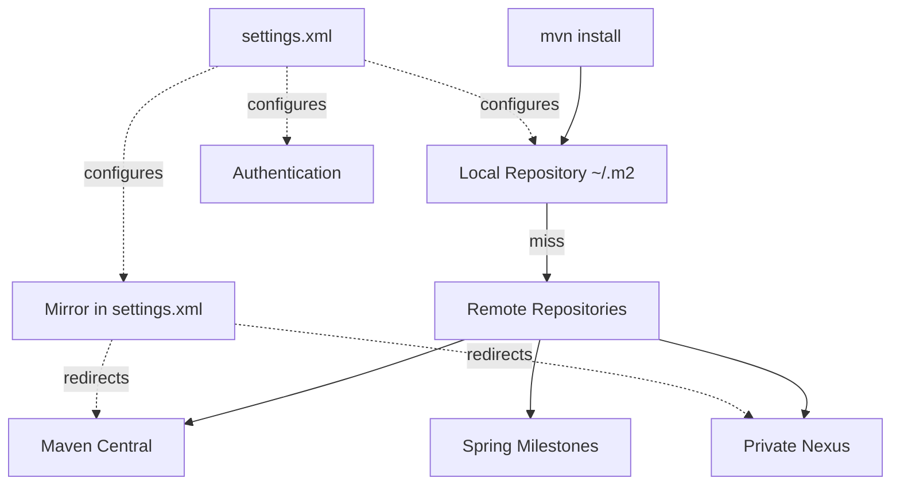
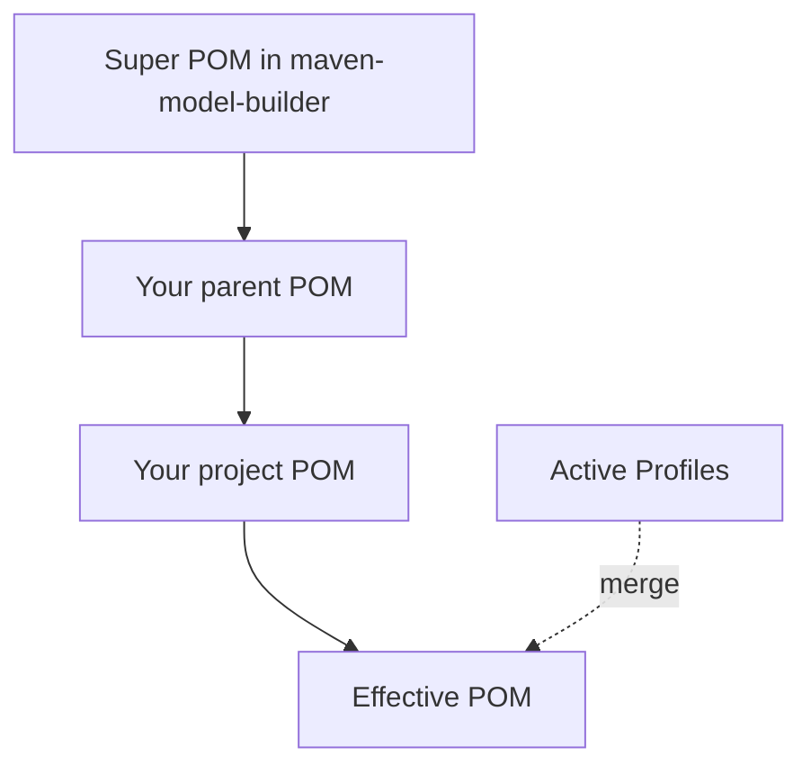
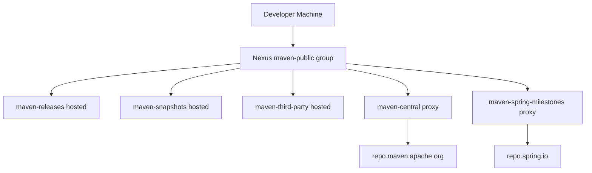

# Maven Repositories and POM Files

## Overview

Every Maven build depends on a hidden ecosystem of repositories and POM files. Repositories are where Maven looks for artifacts to download; POM files are the metadata that describe artifacts. The interplay between these two layers is what makes Maven a true package manager rather than just a build script. A clean local repository cache can resolve a thousand transitive dependencies in seconds, while a misconfigured repository can leave a build hanging on a 404 that no one understands.

This note covers repositories in depth: local, remote, central, mirrors, authentication, snapshots, releases, and the settings.xml file that configures them. We then turn to the POM hierarchy: the super POM that ships with Maven itself, the parent POM you declare in your project, the effective POM that Maven computes by merging them all, and the minimal POM that is technically valid. We will also cover the structure of a published POM (the consumer POM) versus the developer POM, the role of metadata files like `maven-metadata.xml` and `_remote.repositories`, and the way Maven signs and validates artifacts.

After this note you should be able to set up Maven for an enterprise environment, debug repository access problems, and explain exactly which POM Maven is reading at any moment.

## Background Knowledge

Recall these primitives from the previous notes:

- **Artifact**: a JAR, WAR, POM, or other file identified by GAV coordinates.
- **Local repository**: a directory under `~/.m2/repository` that caches artifacts Maven has already downloaded.
- **Remote repository**: a server Maven contacts to download artifacts not in the local cache.
- **POM**: the `pom.xml` file that describes a project.
- **Effective POM**: the merged result of the super POM, parent POM, project POM, and active profiles.

## Repository Types

### The Local Repository

The local repository is a directory on your machine where Maven stores every artifact it has ever downloaded or installed. The default location is `~/.m2/repository`, but you can override it in `settings.xml` or with the `-Dmaven.repo.local` command line flag.

The local repository has the same layout as a remote repository:

```
~/.m2/repository/
  org/
    apache/
      maven/
        plugins/
          maven-compiler-plugin/
            3.13.0/
              maven-compiler-plugin-3.13.0.jar
              maven-compiler-plugin-3.13.0.pom
              maven-compiler-plugin-3.13.0.jar.sha1
            maven-metadata-local.xml
```

Each artifact lives in a directory derived from its `groupId` (with dots replaced by slashes), then its `artifactId`, then its `version`. Inside the version directory are the artifact file itself, its POM, checksum files, and (for snapshots) timestamped builds.

### The Central Repository

Maven Central (`https://repo.maven.apache.org/maven2`) is the default public repository. It is hosted by Sonatype and mirrored by CDN providers globally. Anyone can publish to Central via the OSSRH (OSS Repository Hosting) service, now replaced by the Central Portal. Central contains hundreds of thousands of open source artifacts and is the implicit remote repository Maven queries when no other repository matches.

You should never configure Central explicitly in a project POM if you can avoid it; the super POM already declares it, and configuring it again can cause subtle issues with HTTPS versus HTTP redirects.

### Remote Repositories

Beyond Central, you can declare any number of remote repositories in your POM or in `settings.xml`. Common examples include:

- **Spring Milestones** (`https://repo.spring.io/milestone`) for early-access Spring releases.
- **JFrog Artifactory** or **Sonatype Nexus** instances for private corporate artifacts.
- **JitPack** (`https://jitpack.io`) for building artifacts directly from GitHub tags.
- **JBoss Maven Repository** (`https://repository.jboss.org/nexus/content/repositories/releases/`) for JBoss-specific artifacts.

```xml
<repositories>
  <repository>
    <id>spring-milestones</id>
    <name>Spring Milestones</name>
    <url>https://repo.spring.io/milestone</url>
    <snapshots>
      <enabled>false</enabled>
    </snapshots>
  </repository>
  <repository>
    <id>internal-releases</id>
    <name>Internal Releases</name>
    <url>https://nexus.example.com/repositories/maven-releases</url>
    <releases>
      <enabled>true</enabled>
    </releases>
    <snapshots>
      <enabled>false</enabled>
    </snapshots>
  </repository>
  <repository>
    <id>internal-snapshots</id>
    <name>Internal Snapshots</name>
    <url>https://nexus.example.com/repositories/maven-snapshots</url>
    <releases>
      <enabled>false</enabled>
    </releases>
    <snapshots>
      <enabled>true</enabled>
      <updatePolicy>always</updatePolicy>
    </snapshots>
  </repository>
</repositories>
```

The `<updatePolicy>` element controls how often Maven checks for new versions: `always`, `daily` (the default), `interval:X` (every X minutes), or `never`. The `<checksumPolicy>` element controls what Maven does when checksum verification fails: `fail`, `warn`, or `ignore`.

### Plugin Repositories

Plugin repositories are declared separately under `<pluginRepositories>`. By default, plugin resolution uses the same repositories as dependencies, but explicit declaration lets you tune them independently. This matters in enterprises where the Central mirror is allow-listed but a private plugin repository is also needed.



## Mirrors

A mirror is a redirect: it tells Maven "whenever you would have contacted repository X, contact mirror Y instead." Mirrors are declared in `settings.xml`, not in the project POM, because they are an environment-level concern.

```xml
<settings>
  <mirrors>
    <mirror>
      <id>internal-mirror</id>
      <name>Internal Nexus Mirror</name>
      <url>https://nexus.example.com/repository/maven-public/</url>
      <mirrorOf>*</mirrorOf>
    </mirror>
  </mirrors>
</settings>
```

The `<mirrorOf>` element specifies which repository IDs this mirror intercepts:

- `*` intercepts all repositories.
- `central` intercepts only Central.
- `external:http:*` intercepts all HTTP repositories (useful for forcing HTTPS).
- `*,!internal-snapshots` intercepts everything except the snapshot repository.
- Comma-separated lists are also allowed.

A common enterprise pattern is to declare a single Nexus or Artifactory virtual repository that proxies Central, Spring milestones, JCenter, and any private repositories, then mirror everything to it:

```xml
<mirror>
  <id>nexus</id>
  <mirrorOf>*</mirrorOf>
  <url>https://nexus.example.com/repository/maven-public/</url>
</mirror>
```

Once this is in place, every Maven build in the organization goes through the corporate proxy, which caches downloads, enforces license policies, and blocks malicious packages.

## Authentication

Credentials for repositories are declared in `settings.xml` under `<servers>`. The `<id>` of the `<server>` element must match the `<id>` of the repository (or mirror) it authenticates.

```xml
<settings>
  <servers>
    <server>
      <id>internal-releases</id>
      <username>${env.NEXUS_USER}</username>
      <password>${env.NEXUS_PASS}</password>
    </server>
    <server>
      <id>internal-snapshots</id>
      <username>${env.NEXUS_USER}</username>
      <password>${env.NEXUS_PASS}</password>
    </server>
    <server>
      <id>gpg.passphrase</id>
      <passphrase>${env.GPG_PASSPHRASE}</passphrase>
    </server>
  </servers>
</settings>
```

Property substitution (such as `${env.NEXUS_USER}`) lets you read credentials from environment variables, which is essential for CI systems where secrets must never be committed to source control. For more sophisticated setups, use the `settings-security.xml` file to encrypt master passwords, then encrypt individual server passwords with `mvn --encrypt-password`.

## The settings.xml File

`settings.xml` is the user-level or global-level Maven configuration. It contains settings that are not project-specific: local repository location, mirrors, servers, proxies, profiles, and active profiles.

There are two `settings.xml` files, processed in this order:

1. **Global**: `${maven.home}/conf/settings.xml` (or `/etc/maven/settings.xml` on Linux package installs).
2. **User**: `~/.m2/settings.xml`.

User settings override global settings. The merge is field by field, with user values taking precedence on conflict.

A typical user `settings.xml` looks like this:

```xml
<settings xmlns="http://maven.apache.org/SETTINGS/1.2.0">
  <localRepository>/Users/me/.m2/repository</localRepository>

  <servers>
    <server>
      <id>internal-releases</id>
      <username>${env.NEXUS_USER}</username>
      <password>${env.NEXUS_PASS}</password>
    </server>
  </servers>

  <mirrors>
    <mirror>
      <id>nexus</id>
      <mirrorOf>*</mirrorOf>
      <url>https://nexus.example.com/repository/maven-public/</url>
    </mirror>
  </mirrors>

  <profiles>
    <profile>
      <id>internal</id>
      <repositories>
        <repository>
          <id>internal-releases</id>
          <url>https://nexus.example.com/repository/maven-releases/</url>
          <releases><enabled>true</enabled></releases>
          <snapshots><enabled>false</enabled></snapshots>
        </repository>
      </repositories>
    </profile>
  </profiles>

  <activeProfiles>
    <activeProfile>internal</activeProfile>
  </activeProfiles>
</settings>
```

Use `mvn help:effective-settings` to print the merged result. This is invaluable for debugging "Maven cannot find this artifact" errors.

## The POM Hierarchy

Every project POM inherits from a chain of parent POMs, terminating at the **super POM** that ships inside Maven itself. Maven merges them all (along with active profiles) to produce the **effective POM** that drives the build.



### The Super POM

The super POM is bundled inside the `maven-model-builder` JAR. You can find it at `org/apache/maven/model/pom-4.0.0.xml` inside that JAR. It defines defaults that every Maven project inherits:

- The central repository at `https://repo.maven.apache.org/maven2`.
- The default `<build><directory>` of `target`.
- The default output directories `target/classes` and `target/test-classes`.
- The default source directories `src/main/java` and `src/test/java`.
- The default resource directories `src/main/resources` and `src/test/resources`.
- A small `<pluginManagement>` section pinning versions of core plugins like `maven-compiler-plugin`, `maven-surefire-plugin`, and `maven-jar-plugin`.

You rarely need to look at the super POM, but knowing it exists explains why your project compiles even when you do not declare a compiler plugin: the super POM's `<pluginManagement>` provides a default version, which is bound to the `compile` phase by the default lifecycle mapping for `jar` packaging.

### The Parent POM

The parent POM is declared in your project's `pom.xml` with the `<parent>` element. It can be your own corporate parent, a framework parent like `spring-boot-starter-parent`, or a library parent like `junit-bom`.

```xml
<parent>
  <groupId>org.springframework.boot</groupId>
  <artifactId>spring-boot-starter-parent</artifactId>
  <version>3.3.0</version>
  <relativePath/>
</parent>
```

The `<relativePath>` element tells Maven where to look for the parent POM on disk before checking repositories. The default is `../pom.xml`, which is appropriate for multi-module projects. An empty `<relativePath/>` tells Maven to skip the filesystem lookup and go straight to the repository, which is what you want when the parent is a published artifact like `spring-boot-starter-parent`.

### The Project POM

The project POM is the `pom.xml` in your project root. It declares the GAV coordinates, the packaging, the dependencies, the plugins, the properties, and (optionally) the modules.

### The Effective POM

The effective POM is the merged result of the super POM, the parent POM, the project POM, and any active profiles. Maven uses it internally for every computation. You can print it with `mvn help:effective-pom`.

The merge rules are:

- Scalars (like `<version>`) from the child override the parent.
- Lists (like `<dependencies>`) are concatenated, with child entries appended after parent entries.
- Maps (like `<properties>`) merge key by key, with child keys overriding parent keys.
- `<dependencyManagement>` entries merge by `groupId:artifactId` key, with child entries overriding parent entries.
- `<pluginManagement>` and `<plugins>` merge by `groupId:artifactId`, with the child's `<configuration>` and `<executions>` merged into the parent's.

### The Minimal POM

The smallest valid `pom.xml` is:

```xml
<project>
  <modelVersion>4.0.0</modelVersion>
  <groupId>com.example</groupId>
  <artifactId>minimal</artifactId>
  <version>1.0.0</version>
</project>
```

Everything else has a default inherited from the super POM: packaging defaults to `jar`, the repository defaults to Central, the build directory defaults to `target`, and so on.

## Distribution Management

`<distributionManagement>` declares where Maven should upload artifacts when you run `mvn deploy`. It has two main parts: `repository` for releases and `snapshotRepository` for snapshots.

```xml
<distributionManagement>
  <repository>
    <id>internal-releases</id>
    <name>Internal Releases</name>
    <url>https://nexus.example.com/repository/maven-releases/</url>
  </repository>
  <snapshotRepository>
    <id>internal-snapshots</id>
    <name>Internal Snapshots</name>
    <url>https://nexus.example.com/repository/maven-snapshots/</url>
  </snapshotRepository>
  <site>
    <id>internal-site</id>
    <url>scp://site.example.com/var/www/projects/my-project/</url>
  </site>
</distributionManagement>
```

The `<id>` of each repository must match a `<server>` entry in `settings.xml` so Maven can authenticate. Without `<distributionManagement>`, `mvn deploy` fails with `"Deployment failed: repository element was not specified in the POM inside distributionManagement element"`.

## Repository Metadata Files

When Maven resolves an artifact, it consults several metadata files in the repository.

### maven-metadata.xml

This file lives in the `artifactId` directory (for listing versions) or the `artifactId/version` directory (for snapshots). It lists the available versions and, for snapshots, the latest timestamped build.

```xml
<metadata>
  <groupId>com.example</groupId>
  <artifactId>my-library</artifactId>
  <versioning>
    <latest>1.4.0</latest>
    <release>1.4.0</release>
    <versions>
      <version>1.0.0</version>
      <version>1.1.0</version>
      <version>1.2.0</version>
      <version>1.3.0</version>
      <version>1.4.0</version>
    </versions>
    <lastUpdated>20240515123000</lastUpdated>
  </versioning>
</metadata>
```

Maven uses this to resolve version ranges like `[1.0,1.5)` and to find the latest snapshot build.

### The remote.repositories Marker File

A marker file inside an artifact's version directory records which repository the artifact was downloaded from. The filename is literally `remote.repositories` (with a leading underscore in the actual filename, written here in code formatting). It is used by the enforcer plugin and by some enterprise policies to verify that artifacts came from the expected source. The file is local to your machine and is not published.

### The maven.repositories Marker File

Similar to the `remote.repositories` marker, but records all repositories (local and remote) that contributed to the artifact's presence in the local repository. The actual filename starts with an underscore. Useful for debugging "where did this JAR come from?" questions.

### sha1 and md5 checksums

Every artifact published to a repository is accompanied by `.sha1` and `.md5` checksum files. Maven downloads them and verifies the artifact's integrity. If verification fails, Maven either fails the build (default), warns (`<checksumPolicy>warn</checksumPolicy>`), or ignores the failure (`ignore`).

### .lastUpdated files

When Maven fails to download an artifact (because it does not exist, or because the repository is unreachable), it writes a `<artifact>.lastUpdated` file in the local repository. This file records the timestamp of the failed attempt. For the next 24 hours (by default), Maven will not retry the download, even if the network has been fixed. This is the source of many "Maven is not picking up my newly published artifact" complaints. Delete the `.lastUpdated` files or run `mvn -U` to force an update.

## Snapshot Resolution

When Maven resolves a snapshot version (anything ending in `-SNAPSHOT`), it does the following:

1. Looks up `maven-metadata.xml` in the snapshot's version directory on each remote repository.
2. Compares the `<lastUpdated>` timestamp with the local copy.
3. If the remote has a newer timestamped build, downloads it.

The downloaded file is named `artifact-version-yyyyMMdd.HHmmss-N.jar` and is symlinked in the local repository as `artifact-version-SNAPSHOT.jar` so consumers can reference it by the simple name.

You can force snapshot updates with `mvn -U clean install`. Without `-U`, Maven uses the cached snapshot until the `<updatePolicy>` interval expires.

## Published POMs: Consumer versus Developer

When you publish an artifact, the POM that goes with it can differ from the one you develop with. The published POM is the **consumer POM**, while the one in your source tree is the **developer POM**.

The consumer POM should be:

- Fully merged (parent and properties resolved).
- Free of build logic that depends on the source tree (relative paths).
- Free of `<plugin>` declarations that the consumer does not need.

Tools like the `flatten-maven-plugin` produce a clean consumer POM by stripping the `<build>` section, resolving properties, and inlining the parent's `<dependencyManagement>`.

```xml
<plugin>
  <groupId>org.codehaus.mojo</groupId>
  <artifactId>flatten-maven-plugin</artifactId>
  <version>1.6.0</version>
  <configuration>
    <flattenMode>oss</flattenMode>
  </configuration>
  <executions>
    <execution>
      <id>flatten</id>
      <phase>process-resources</phase>
      <goals>
        <goal>flatten</goal>
      </goals>
    </execution>
    <execution>
      <id>flatten.clean</id>
      <phase>clean</phase>
      <goals>
        <goal>clean</goal>
      </goals>
    </execution>
  </executions>
</plugin>
```

This is especially important when your developer POM has a `<parent>` pointing to a corporate parent that is not available outside your network. The flattened POM replaces the parent reference with the inlined values, so external consumers can build without access to your corporate parent.

## Artifact Signing

For open source releases to Maven Central, artifacts must be signed with GPG. The `maven-gpg-plugin` handles signing during the `verify` phase.

```xml
<plugin>
  <groupId>org.apache.maven.plugins</groupId>
  <artifactId>maven-gpg-plugin</artifactId>
  <version>3.2.4</version>
  <executions>
    <execution>
      <id>sign-artifacts</id>
      <phase>verify</phase>
      <goals>
        <goal>sign</goal>
      </goals>
      <configuration>
        <keyname>${env.GPG_KEYNAME}</keyname>
        <passphraseServerId>gpg.passphrase</passphraseServerId>
      </configuration>
    </execution>
  </executions>
</plugin>
```

The `passphraseServerId` element tells the plugin to look up the passphrase in `settings.xml` under the `<server>` with id `gpg.passphrase`. This keeps secrets out of source control and lets CI inject them via environment variables.

## Common Pitfalls

### Configuring Maven Central explicitly in the POM

Engineers sometimes add Central to `<repositories>` in their POM, expecting faster downloads. This is unnecessary because the super POM already declares Central, and adding it again can cause Maven to query it twice, double-counting downloads and slowing builds.

### Declaring mirrors in the POM instead of settings.xml

Mirrors are environment-level configuration. Putting them in the POM means every developer who clones the project gets the same mirror, which may not be reachable from their network. Always put mirrors in `settings.xml`.

### Forgetting to activate profiles in settings.xml

A `<profile>` in `settings.xml` is not active unless you list it under `<activeProfiles>` or activate it via `-P` on the command line. Engineers frequently declare a profile with private repositories but forget to activate it, leading to "cannot resolve artifact" errors.

### Using HTTP instead of HTTPS for repositories

Maven 3.8.1 and later block HTTP repositories by default. If your enterprise still uses an HTTP-only Nexus instance, you must either upgrade Nexus or add an `<blockedMirrors>` exemption, neither of which is recommended. Migrate to HTTPS.

### Not pinning plugin versions

When you omit `<version>` for a plugin, Maven resolves it from the super POM or from `<pluginManagement>` in your parent. This means the version can shift when you upgrade Maven or your parent. Always pin plugin versions explicitly.

### Leaving `.lastUpdated` files blocking downloads

When Maven fails to download an artifact, it writes a `.lastUpdated` marker and refuses to retry for 24 hours. If you have just published an artifact and Maven cannot find it, run `mvn -U` to bypass the cache or delete the marker file manually.

## Tips and Tricks

- Use `mvn help:effective-settings` to print the merged settings.xml with all global and user settings applied.
- Use `mvn help:effective-pom` to print the merged POM with all inheritance and profiles applied.
- Use `mvn help:system` to print all system properties and environment variables Maven can see.
- Use `mvn -X ...` to enable debug logging; Maven prints every repository URL it queries, every checksum it verifies, and every property it resolves.
- Use `mvn -U clean install` to force snapshot updates, useful when you know a remote artifact has changed.
- Use `mvn -o clean install` to build offline; this fails fast if any artifact is missing from the local repository, which is a great way to verify that a build is fully reproducible.
- Use the `maven-dependency-plugin`'s `mvn dependency:purge-local-repository` to delete and re-resolve every dependency, useful when you suspect local repository corruption.
- Use the `nexus-staging-maven-plugin` instead of `maven-deploy-plugin` for releases to Sonatype OSSRH; it manages the staging repository lifecycle and lets you drop or release a staging build from the command line.

## Interview Questions

**Question:** What is the difference between the super POM, the parent POM, and the effective POM?

**Answer:** The super POM ships inside Maven itself and defines defaults like the central repository and the `target` build directory. The parent POM is declared in your project's `<parent>` element and provides shared configuration like dependency versions and plugin settings. The effective POM is the merged result of the super POM, your parent POM, your project POM, and any active profiles. Maven uses the effective POM internally for every computation. You can print it with `mvn help:effective-pom`.

**Question:** How do mirrors differ from repositories in Maven?

**Answer:** A repository is a place where Maven looks for artifacts. A mirror is a redirect: it tells Maven "whenever you would have contacted repository X, contact mirror Y instead." Mirrors are declared in `settings.xml` (environment-level configuration), while repositories are typically declared in the POM (project-level configuration). A mirror of `*` intercepts every repository, which is the standard enterprise pattern for routing all traffic through a corporate Nexus or Artifactory.

**Question:** Why does Maven sometimes refuse to download a freshly published artifact, and how do you fix it?

**Answer:** When Maven fails to download an artifact, it writes a `.lastUpdated` marker file in the local repository and refuses to retry for a default of 24 hours. This is meant to avoid hammering unreachable repositories, but it also blocks legitimate retries after a publish. Run `mvn -U` to force updates, which bypasses the `.lastUpdated` cache. Alternatively, delete the marker file or the entire artifact directory from the local repository.

**Question:** What is `settings.xml` and where does it live?

**Answer:** `settings.xml` is the Maven user-level or global configuration file. It contains environment-level settings that are not project-specific: local repository location, mirrors, servers (credentials), proxies, profiles, and active profiles. There are two `settings.xml` files: the global one at `${maven.home}/conf/settings.xml` and the user one at `~/.m2/settings.xml`. User settings override global settings. Both are merged at startup; the result is printed by `mvn help:effective-settings`.

**Question:** What is `<distributionManagement>` for?

**Answer:** `<distributionManagement>` declares the repositories Maven uploads to when you run `mvn deploy`. It has two main sub-elements: `repository` for release versions and `snapshotRepository` for snapshots. Each repository's `<id>` must match a `<server>` entry in `settings.xml` so Maven can authenticate. Without `<distributionManagement>`, `mvn deploy` fails immediately.

**Question:** How are snapshot versions different from release versions in terms of repository storage?

**Answer:** Release versions are stored once at a fixed path, such as `my-library/1.0.0/my-library-1.0.0.jar`, and must never be overwritten. Snapshot versions are stored as timestamped builds, such as `my-library/1.0.0-SNAPSHOT/my-library-1.0.0-20240515.123000-1.jar`, alongside a `maven-metadata.xml` that records the latest timestamped build. Maven resolves `-SNAPSHOT` to the latest timestamped build at download time, which is why snapshots can change without a version bump.

**Question:** How do you secure credentials for private Maven repositories in CI?

**Answer:** Declare `<server>` entries in `settings.xml` with property placeholders like `${env.NEXUS_USER}` and `${env.NEXUS_PASS}`. Inject the actual values via CI environment variables. For extra security, use `mvn --encrypt-password` to produce an encrypted password, store it in `settings.xml`, and store the master password in `settings-security.xml` (or inject it via environment variable). This way secrets never appear in source control or build logs.

**Question:** What is the flatten-maven-plugin and why would you use it?

**Answer:** The flatten-maven-plugin produces a simplified consumer POM at build time, replacing the developer POM that lives in source control. It strips build logic, resolves properties, and inlines `<dependencyManagement>` from the parent so that downstream consumers do not need access to the parent POM. This is essential when your developer POM has a corporate parent that is not available outside your network, or when you want to publish a clean POM that contains only the dependencies consumers actually need.

**Question:** What is the role of `maven-metadata.xml`?

**Answer:** `maven-metadata.xml` lists the available versions of an artifact and, for snapshots, the latest timestamped build. Maven uses it to resolve version ranges like `[1.0,1.5)`, to find the latest release, and to pick the newest snapshot build. The file lives in the `artifactId` directory (for listing all versions) or the `artifactId/version` directory (for snapshots). Each remote repository maintains its own copy.

## Enterprise Repository Setup Walkthrough

Setting up Maven for an enterprise environment typically involves a Nexus Repository Manager or JFrog Artifactory instance that proxies Central, hosts internal artifacts, and exposes a single virtual repository that hides the underlying complexity from developers. This section walks through the canonical setup.

### Step 1: Provision a Repository Manager

Install Nexus Repository Manager 3 (or Artifactory) on a server with sufficient disk space (start with 500GB, expect to grow). Configure it for HTTPS with a real certificate; HTTP-only Nexus instances are blocked by modern Maven versions.

### Step 2: Create Repository Topology

Create the following hosted repositories on Nexus:

- `maven-releases` for internal release versions (immutable artifacts).
- `maven-snapshots` for internal snapshot versions (timestamped and mutable).
- `maven-third-party` for any third-party artifacts not on Central (proprietary vendor JARs).

Create these proxy repositories:

- `maven-central` proxying `https://repo.maven.apache.org/maven2`.
- `maven-spring-milestones` proxying `https://repo.spring.io/milestone`.
- `maven-jboss` proxying `https://repository.jboss.org/nexus/content/repositories/releases/`.

Finally, create a group repository called `maven-public` that aggregates all of the above in order, with hosted repositories first (so internal artifacts are preferred over proxied ones) and the central proxy last.

### Step 3: Configure settings.xml

Every developer machine and CI runner uses the same `settings.xml`:

```xml
<settings>
  <mirrors>
    <mirror>
      <id>nexus</id>
      <mirrorOf>*</mirrorOf>
      <url>https://nexus.example.com/repository/maven-public/</url>
    </mirror>
  </mirrors>

  <servers>
    <server>
      <id>nexus</id>
      <username>${env.NEXUS_USER}</username>
      <password>${env.NEXUS_PASS}</password>
    </server>
    <server>
      <id>nexus-releases</id>
      <username>${env.NEXUS_USER}</username>
      <password>${env.NEXUS_PASS}</password>
    </server>
    <server>
      <id>nexus-snapshots</id>
      <username>${env.NEXUS_USER}</username>
      <password>${env.NEXUS_PASS}</password>
    </server>
  </servers>

  <profiles>
    <profile>
      <id>nexus</id>
      <repositories>
        <repository>
          <id>central</id>
          <url>https://nexus.example.com/repository/maven-public/</url>
          <releases><enabled>true</enabled></releases>
          <snapshots><enabled>true</enabled></snapshots>
        </repository>
      </repositories>
    </profile>
  </profiles>

  <activeProfiles>
    <activeProfile>nexus</activeProfile>
  </activeProfiles>
</settings>
```

The mirror intercepts every repository lookup, including those declared by the super POM, so all traffic flows through Nexus. The `central` repository declared in the profile is mostly redundant because of the mirror, but it ensures that even plugins that bypass the mirror (rare but possible) still route correctly.

### Step 4: Configure Distribution Management

In each project's parent POM, declare the release and snapshot repositories:

```xml
<distributionManagement>
  <repository>
    <id>nexus-releases</id>
    <url>https://nexus.example.com/repository/maven-releases/</url>
  </repository>
  <snapshotRepository>
    <id>nexus-snapshots</id>
    <url>https://nexus.example.com/repository/maven-snapshots/</url>
  </snapshotRepository>
</distributionManagement>
```

### Step 5: Cache and Cleanup

Configure cleanup policies on Nexus to delete snapshots older than 30 days and to keep only the latest 5 snapshot builds per version. This prevents the snapshot repository from growing without bound. Configure the central proxy cache to expire entries after 24 hours so new releases propagate quickly.



## Repository Resolution Algorithm

When Maven resolves a dependency, it consults repositories in this order:

1. **Local repository.** If the artifact is present and not stale (for snapshots), use it.
2. **Repositories declared in the POM.** Each repository is tried in declaration order, but Maven also consults `<mirror>` settings to redirect.
3. **Central.** The fallback defined by the super POM.

For each repository, Maven constructs the URL by translating the artifact's coordinates into a path: `groupId` with dots replaced by slashes, then `artifactId`, then `version`, then the artifact filename. For `com.example:my-library:1.0.0` of type `jar`, the URL is `com/example/my-library/1.0.0/my-library-1.0.0.jar`. If the URL returns 404, Maven tries the next repository. If all repositories fail, Maven writes a `.lastUpdated` marker and reports the failure.

## Common Pitfalls

### Setting `<mirrorOf>external:http:*</mirrorOf>` and forgetting HTTPS-only Nexus

The `external:http:*` mirror intercepts all HTTP repositories and is useful for forcing HTTPS. But if your internal Nexus is itself HTTP-only, the mirror rule also intercepts your own internal repository and you end up with no traffic reaching Nexus. Either upgrade Nexus to HTTPS or use a more specific `<mirrorOf>` like `central`.

### Mixing `<id>` values between settings.xml and the POM

The `<id>` of a `<server>` in `settings.xml` must match the `<id>` of the `<repository>` in the POM (or `<distributionManagement>`). A common bug is naming the server `nexus` and the repository `nexus-releases`. Maven fails to authenticate and reports a 401.

### Publishing to a release repository that already has the version

Release repositories are immutable: you cannot overwrite an existing version. If you try to deploy `1.0.0` a second time, Nexus rejects the upload with a 400 error. Bump the version or use a snapshot.

### Declaring repositories in child modules instead of the parent

When each module declares its own repositories, builds become inconsistent and slow. Always centralize repository declarations in the parent POM or, better, in `settings.xml` via profiles.

## Tips and Tricks

- Use `mvn deploy -DaltDeploymentRepository=...` to override the deployment target on the command line, useful for staging builds.
- Use `mvn deploy -Dmaven.deploy.skip=true` to skip deployment for a specific module while still running the rest of the lifecycle.
- Use the `nexus-staging-maven-plugin` to deploy to a staging repository on Sonatype OSSRH, then promote or drop the staging build from the command line.
- Use `mvn install:install-file -Dfile=vendor.jar -DgroupId=com.vendor -DartifactId=vendor-lib -Dversion=1.0 -Dpackaging=jar` to install a vendor JAR into your local repository when you cannot publish it to Nexus.
- Use `mvn dependency:get -Dartifact=com.google.guava:guava:32.1.3-jre` to download an artifact into the local repository without adding it as a dependency.

## Interview Questions

**Question:** Walk me through how you would set up Maven for an enterprise with a Nexus Repository Manager.

**Answer:** Provision Nexus over HTTPS, create hosted repositories for releases and snapshots, create proxy repositories for Central and any other public repositories you need, and create a group repository that aggregates them. Configure `settings.xml` on every developer machine and CI runner to mirror everything to the group repository and to provide credentials via environment variables. In the parent POM, declare `<distributionManagement>` pointing to the hosted release and snapshot repositories with IDs that match the server entries in `settings.xml`. Set cleanup policies on Nexus to age out old snapshots. This routes all traffic through Nexus, gives you a single point of audit and policy enforcement, and makes internal artifact publication straightforward.

**Question:** What happens behind the scenes when Maven resolves `com.google.guava:guava:32.1.3-jre`?

**Answer:** Maven first checks the local repository at `~/.m2/repository/com/google/guava/guava/32.1.3-jre/guava-32.1.3-jre.jar`. If the artifact is missing or stale (for snapshots), Maven consults the configured repositories in declaration order, applying any `<mirror>` redirects. For each repository, Maven constructs the URL by translating the coordinates into a path and issues an HTTP GET. On a 200 response, Maven also downloads the `.sha1` checksum and verifies integrity. On a 404, Maven tries the next repository. If all repositories fail, Maven writes a `.lastUpdated` marker file and reports the failure. The downloaded POM is then parsed to resolve transitive dependencies recursively.

## Summary

Repositories and POM files form the substrate on which every Maven build runs. The local repository caches artifacts; remote repositories supply them; mirrors route traffic through corporate proxies; `settings.xml` configures environment-level concerns; the POM hierarchy (super, parent, project, effective) layers configuration cleanly. Snapshot resolution adds timestamped metadata so development builds can change without a version bump. The `flatten-maven-plugin` produces a clean consumer POM for downstream use, and the `maven-gpg-plugin` signs artifacts for publication to Maven Central. Master this layer and you can debug any Maven repository issue, set up an enterprise Nexus in an afternoon, and publish libraries that any team in the world can consume without friction. The next note pivots to Gradle, the other dominant JVM build tool, and shows how its Groovy DSL approaches the same problems from a different angle.
