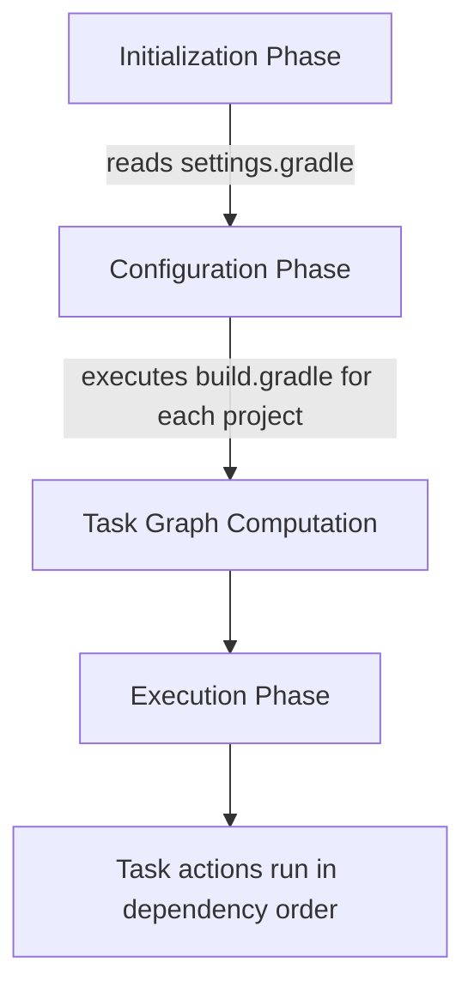
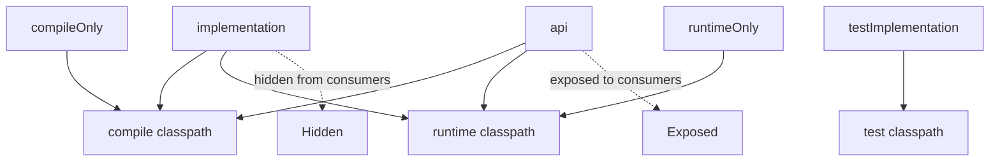
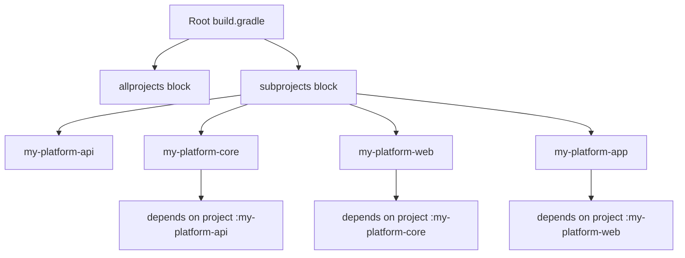
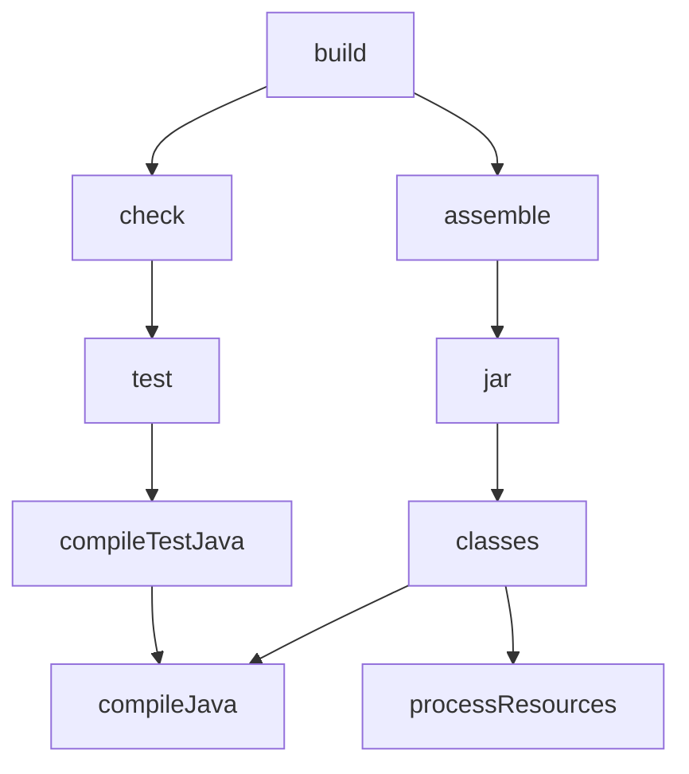

# Gradle Groovy DSL

## Overview

Gradle is the second dominant build tool in the JVM ecosystem. Where Maven is declarative and lifecycle-centric, Gradle is a programmatic build tool: your build script is actual code, executed by Gradle against a rich object model. This gives Gradle enormous flexibility and performance characteristics that Maven struggles to match, at the cost of a steeper learning curve and more rope with which to hang yourself.

This note covers Gradle 8.x and its Groovy DSL, the original and still widely-used syntax for `build.gradle` files. We will cover the project model, the plugin system, task definition, dependency declarations, configuration avoidance, repositories, and the build lifecycle. We will use Mermaid diagrams to visualize the task graph, Groovy code snippets you can paste into your own build, and a battery of interview questions with model answers.

By the end you should be able to read any Gradle Groovy build script fluently, understand the difference between configuration and execution phases, write tasks that participate in dependency ordering, and apply the modern best practices that keep Gradle builds fast and maintainable.

## Background Knowledge

Before diving in, recall a few Gradle primitives:

- **Project**: the top-level object representing your build. Every `build.gradle` file is executed against a `Project` instance, and its methods and properties become available without qualification.
- **Task**: a unit of work. Tasks have actions (closures that run when the task executes) and dependencies (other tasks that must run first).
- **Plugin**: a bundle of tasks and conventions that you apply to a project. The `java` plugin, for example, adds compilation, test, and packaging tasks.
- **Configuration**: a named bucket of dependencies. The `implementation`, `api`, `testImplementation`, and `runtimeOnly` configurations are created by the JVM plugins.
- **Dependency**: an external artifact, declared with a coordinate string like `org.springframework.boot:spring-boot-starter-web:3.3.0`.
- **Properties**: build variables, either declared in `gradle.properties`, in the build script, or passed via the command line with `-P`.

## A Minimal Gradle Groovy Build

Here is the smallest meaningful Gradle build for a Java library.

```groovy
plugins {
    id 'java'
}

group = 'com.example'
version = '1.0.0'

repositories {
    mavenCentral()
}

dependencies {
    implementation 'org.springframework.boot:spring-boot-starter-web:3.3.0'
    testImplementation 'org.junit.jupiter:junit-jupiter:5.10.2'
}

java {
    toolchain {
        languageVersion = JavaLanguageVersion.of(21)
    }
}

test {
    useJUnitPlatform()
}
```

Run `gradle build` and Gradle compiles `src/main/java`, runs tests in `src/test/java`, and produces a JAR in `build/libs`. The `java` plugin provides all of this out of the box; you only customize what you need.

## The Gradle Build Lifecycle

Every Gradle build goes through three phases:

1. **Initialization.** Gradle determines which projects are part of the build. For a single-project build, this is trivial. For a multi-project build, Gradle reads `settings.gradle` to discover the projects.
2. **Configuration.** Gradle executes every `build.gradle` file against its `Project` object. This is where plugins are applied, tasks are defined, and dependencies are declared. Code in this phase runs every time you invoke Gradle, even if you only want to run a single task.
3. **Execution.** Gradle computes the task graph (which tasks are requested, what they depend on), then executes each task's actions in dependency order.



The distinction between configuration and execution is critical. A closure that you pass to a task's `doLast` block does not run during configuration; it runs during execution. But any code at the top level of a `build.gradle` file runs during configuration, on every invocation. This is why expensive operations like file I/O or network calls should always be deferred into task actions.

## The Plugin System

Plugins are the primary extension mechanism. You apply them with the `plugins {}` block:

```groovy
plugins {
    id 'java'
    id 'org.springframework.boot' version '3.3.0'
    id 'io.spring.dependency-management' version '1.1.5'
}
```

The short identifier `java` is a core plugin bundled with Gradle. The longer identifiers like `org.springframework.boot` are community plugins, resolved from the Gradle Plugin Portal at `https://plugins.gradle.org/`.

A plugin can do three things:

1. **Add tasks.** The `java` plugin adds `compileJava`, `processResources`, `classes`, `jar`, `compileTestJava`, `test`, `build`, `clean`, and many more.
2. **Add configurations.** The `java` plugin adds `implementation`, `api`, `compileOnly`, `runtimeOnly`, `testImplementation`, and so on.
3. **Apply conventions.** The `java` plugin assumes your sources are in `src/main/java`, tests in `src/test/java`, resources in `src/main/resources`, and outputs go to `build/`.

You can extend or override any of these. For example, to add a new source set for integration tests:

```groovy
sourceSets {
    integrationTest {
        java {
            srcDirs = ['src/integration-test/java']
        }
        resources {
            srcDirs = ['src/integration-test/resources']
        }
    }
}

configurations {
    integrationTestImplementation.extendsFrom testImplementation
    integrationTestRuntimeOnly.extendsFrom testRuntimeOnly
}

task integrationTest(type: Test) {
    testClassesDirs = sourceSets.integrationTest.output.classesDirs
    classpath = sourceSets.integrationTest.runtimeClasspath
    useJUnitPlatform()
    shouldRunAfter test
}

check.dependsOn integrationTest
```

## Task Definition and Dependencies

Tasks are the workhorses of Gradle. Define one with the `task` keyword:

```groovy
task sayHello {
    doLast {
        println 'Hello, Gradle!'
    }
}
```

Run `gradle sayHello` and Gradle prints `Hello, Gradle!`. The `doLast` block is an action appended to the task; it runs during execution, not configuration.

Tasks can declare dependencies on other tasks:

```groovy
task compile {
    doLast { println 'Compiling...' }
}

task test {
    dependsOn compile
    doLast { println 'Testing...' }
}

task buildAll {
    dependsOn test
    doLast { println 'Building...' }
}
```

Running `gradle buildAll` runs `compile`, then `test`, then `buildAll`.

You can also use `finalizedBy` to make a task run after another regardless of success:

```groovy
task startDatabase {
    doLast { println 'Database up' }
}

task stopDatabase {
    doLast { println 'Database down' }
}

startDatabase.finalizedBy stopDatabase
```

## Configuration Avoidance

Modern Gradle (5.0 and later) prefers lazy task creation. Instead of eagerly creating tasks at configuration time, you register them and they are only configured when needed. This dramatically reduces configuration time for large builds.

```groovy
tasks.register('generateReport') {
    doLast {
        println 'Generating report...'
    }
}
```

The `register` method returns a `TaskProvider`, which is a lazy reference. The task is created only if Gradle determines it is needed for the requested build. To reference an existing task lazily:

```groovy
tasks.named('test') {
    useJUnitPlatform()
    testLogging {
        events 'passed', 'skipped', 'failed'
    }
}
```

Use `register` and `named` instead of `task` and direct accessors wherever possible. This is the single biggest performance win for Gradle builds.

## Dependency Declarations

Gradle uses configurations to bucket dependencies. The JVM plugins create these configurations:

- **implementation**: dependencies needed at compile time and runtime, but not exposed to consumers of your library. This is the modern, preferred scope for most dependencies.
- **api**: dependencies that are part of your library's public API. Consumers of your library can see these on their compile classpath. Available only when the `java-library` plugin is applied.
- **compileOnly**: dependencies needed only at compile time, not at runtime. Use for annotation processors that produce code but are not needed to run it.
- **runtimeOnly**: dependencies needed only at runtime, not at compile time. Use for JDBC drivers.
- **testImplementation**: dependencies needed to compile and run tests.
- **testCompileOnly**: test-scope compile-only dependencies.
- **testRuntimeOnly**: test-scope runtime-only dependencies.

```groovy
dependencies {
    implementation 'org.springframework.boot:spring-boot-starter-web:3.3.0'
    implementation platform('org.springframework.boot:spring-boot-dependencies:3.3.0')
    implementation 'org.springframework.boot:spring-boot-starter-data-jpa'
    compileOnly 'org.projectlombok:lombok:1.18.32'
    annotationProcessor 'org.projectlombok:lombok:1.18.32'
    runtimeOnly 'org.postgresql:postgresql:42.7.3'
    testImplementation 'org.springframework.boot:spring-boot-starter-test'
    testImplementation 'org.junit.jupiter:junit-jupiter:5.10.2'
    testRuntimeOnly 'org.junit.platform:junit-platform-launcher'
}
```

The `platform` declaration imports a BOM (bill of materials) analogous to Maven's `<dependencyManagement>` with `<scope>import</scope>`. After applying a platform, you can omit versions from individual dependencies and they inherit the version declared in the BOM.



## Repositories

Gradle supports Maven, Ivy, and flat directory repositories.

```groovy
repositories {
    mavenLocal()
    mavenCentral()
    maven {
        url = uri('https://nexus.example.com/repository/maven-public/')
        credentials {
            username = System.env.NEXUS_USER
            password = System.env.NEXUS_PASS
        }
        authentication {
            basic(BasicAuthentication)
        }
    }
    maven {
        url = uri('https://repo.spring.io/milestone')
    }
    ivy {
        url = uri('https://my.ivy.repo/')
        patternLayout {
            artifact '[organisation]/[module]/[revision]/[artifact]-[revision].[ext]'
            ivy '[organisation]/[module]/[revision]/ivy.xml'
        }
    }
    flatDir {
        dirs 'libs'
    }
}
```

`mavenLocal()` reads from `~/.m2/repository`, useful if you also use Maven on the same machine. `mavenCentral()` is a shortcut for the Maven Central repository. Custom `maven {}` blocks accept credentials and authentication schemes.

Order matters: Gradle tries repositories in declaration order. Put your fastest, most-local repositories first.

## Properties and the gradle.properties File

Gradle properties can be declared in three places:

1. **`gradle.properties`** in the project root or in `~/.gradle/gradle.properties`. These are plain key-value pairs.
2. **Command line** with `-Pname=value` for project properties and `-Dname=value` for system properties.
3. **Environment variables** prefixed with `ORG_GRADLE_PROJECT_`, automatically mapped to project properties.

```properties
# gradle.properties
org.gradle.jvmargs=-Xmx4g -XX:+UseG1GC
org.gradle.parallel=true
org.gradle.caching=true
org.gradle.configuration-cache=true
springBootVersion=3.3.0
```

In your build script, reference these as `springBootVersion` or `project.springBootVersion`:

```groovy
dependencies {
    implementation "org.springframework.boot:spring-boot-starter-web:${springBootVersion}"
}
```

System properties like `org.gradle.parallel` configure Gradle itself, not your build logic.

## Multi-Project Builds

A Gradle multi-project build has a `settings.gradle` file at the root that lists the subprojects:

```groovy
rootProject.name = 'my-platform'

include 'my-platform-api'
include 'my-platform-core'
include 'my-platform-web'
include 'my-platform-app'
```

The root `build.gradle` configures all subprojects:

```groovy
plugins {
    id 'java-library' apply false
    id 'io.spring.dependency-management' version '1.1.5' apply false
    id 'org.springframework.boot' version '3.3.0' apply false
}

allprojects {
    group = 'com.example'
    version = '1.0.0'

    repositories {
        mavenCentral()
    }
}

subprojects {
    apply plugin: 'java-library'
    apply plugin: 'io.spring.dependency-management'

    java {
        toolchain {
            languageVersion = JavaLanguageVersion.of(21)
        }
    }

    dependencies {
        testImplementation 'org.junit.jupiter:junit-jupiter:5.10.2'
        testRuntimeOnly 'org.junit.platform:junit-platform-launcher'
    }

    test {
        useJUnitPlatform()
    }
}
```

Each subproject can have its own `build.gradle` for project-specific configuration:

```groovy
// my-platform-core/build.gradle
dependencies {
    implementation project(':my-platform-api')
    implementation 'org.springframework.boot:spring-boot-starter-data-jpa'
}
```

The `project(':my-platform-api')` syntax declares a dependency on another subproject. Gradle computes the inter-project dependency graph and builds them in the right order.



## Task Configuration Avoidance in Multi-Project Builds

In multi-project builds, the rule "use `register` instead of `task`" becomes critical. With many subprojects, eagerly configuring every task in every subproject becomes a noticeable tax. By using `register` and `named`, you ensure that only tasks that actually need to run are configured.

The `tasks.withType(Test)` and similar collection filters can be wrapped in `configureEach` to defer configuration:

```groovy
subprojects {
    tasks.withType(Test).configureEach {
        useJUnitPlatform()
        testLogging {
            events 'passed', 'skipped', 'failed'
        }
    }
}
```

`configureEach` is the lazy equivalent of `all`. Use it everywhere in favor of `all`.

## The Java Plugin's Default Tasks

The `java` plugin adds these tasks (among others):

- **clean** - deletes the `build` directory.
- **compileJava** - compiles main Java sources.
- **processResources** - copies and filters main resources.
- **classes** - an aggregate task that depends on `compileJava` and `processResources`.
- **compileTestJava** - compiles test sources.
- **processTestResources** - copies test resources.
- **testClasses** - aggregate task for test compilation.
- **test** - runs unit tests via JUnit Platform.
- **jar** - assembles the main JAR.
- **javadoc** - generates Javadoc.
- **build** - aggregate task that runs `check` and `assemble`.
- **check** - runs all verification tasks, including `test`.
- **assemble** - aggregates all archive tasks, including `jar`.



## Custom Tasks with Inputs and Outputs

Gradle's incremental build feature is built on task inputs and outputs. If you declare a task's inputs and outputs, Gradle skips the task on subsequent runs if nothing has changed.

```groovy
abstract class GreetingTask extends DefaultTask {
    @Input
    String message = 'Hello'

    @InputDirectory
    File sourceDir

    @OutputFile
    File outputFile

    @TaskAction
    def generate() {
        outputFile.text = "${message}\nGenerated from ${sourceDir.name}"
    }
}

tasks.register('generateGreeting', GreetingTask) {
    message = 'Welcome to Gradle'
    sourceDir = file('src/main/java')
    outputFile = file("${buildDir}/greeting.txt")
}
```

When you run `gradle generateGreeting` twice in a row without changing inputs, the second run reports `UP-TO-DATE` and skips the task. This is the foundation of Gradle's performance advantage: only the work that needs to happen, happens.

## Build Caching

Beyond incremental builds, Gradle supports a build cache that stores task outputs across builds and even across machines. Enable it in `gradle.properties`:

```properties
org.gradle.caching=true
```

Tasks that declare their inputs and outputs are eligible for caching. Gradle computes a hash of the inputs and, if a matching output exists in the cache, copies it into place instead of running the task. The cache can be local (in `~/.gradle/caches/build-cache-1`) or remote (HTTP).

```groovy
buildCache {
    local {
        enabled = true
    }
    remote(HttpBuildCache) {
        url = uri('https://cache.example.com/cache/')
        credentials {
            username = System.env.CACHE_USER
            password = System.env.CACHE_PASS
        }
    }
}
```

Combined with configuration caching, this can make Gradle builds dramatically faster than Maven for large codebases.

## Common Pitfalls

### Eagerly configuring every task

Using `tasks.create` or `task myTask { ... }` eagerly configures the task on every build, even when it is not needed. Use `tasks.register` instead.

### Running expensive code at configuration time

Any code at the top level of a `build.gradle` runs during configuration, on every invocation. If you need to compute something expensive (like reading a file or calling an external service), wrap it in a task action or use a `Provider`.

### Using `apply plugin: 'java'` instead of the `plugins {}` block

The `apply plugin:` syntax is the legacy way to apply plugins and cannot take advantage of version pinning or the plugin marker artifacts. Use the `plugins {}` block instead.

### Forgetting to declare task inputs and outputs

Tasks without declared inputs and outputs cannot participate in incremental builds or build caching. They run every time, defeating Gradle's performance advantage. Always annotate custom tasks with `@Input`, `@OutputFile`, and friends.

### Putting credentials directly in build.gradle

Credentials in `build.gradle` end up in source control, which is a security incident waiting to happen. Read them from environment variables or from a separate, gitignored `gradle.properties` file.

### Mixing Groovy and Kotlin DSL in the same project

Gradle supports both `build.gradle` (Groovy) and `build.gradle.kts` (Kotlin), but a single project cannot use both at the same level. Pick one and stick with it across the entire multi-project build.

## Tips and Tricks

- Use `gradle tasks` to list all available tasks in a project, and `gradle tasks --all` to include subproject tasks.
- Use `gradle dependencies` to print the resolved dependency tree, and `gradle dependencyInsight --dependency com.google.guava:guava` to inspect a single dependency.
- Use `gradle build --scan` to publish a build scan, a free web UI that visualizes task timing, dependency resolution, and performance bottlenecks.
- Use `gradle properties` to print every property available in the build, useful for debugging variable substitution issues.
- Use `gradle --parallel` to build subprojects in parallel.
- Use `gradle --configuration-cache` to enable configuration caching, which skips the configuration phase for repeated builds.
- Use `gradle --continuous build` to rebuild automatically when source files change.
- Use `./gradlew` (the Gradle Wrapper) instead of a system-installed Gradle to ensure reproducible builds across machines.

## Interview Questions

**Question:** What are the three phases of a Gradle build?

**Answer:** Initialization, configuration, and execution. During initialization, Gradle determines which projects are part of the build by reading `settings.gradle`. During configuration, Gradle executes every `build.gradle` file against its `Project` object, applying plugins, defining tasks, and declaring dependencies. During execution, Gradle computes the task graph (which tasks are requested and what they depend on) and runs each task's actions in dependency order. Code at the top level of a build script runs in configuration; code inside `doLast` blocks runs in execution.

**Question:** What is the difference between `implementation` and `api` dependencies?

**Answer:** `implementation` dependencies are on the compile and runtime classpath of the current project but are not exposed to consumers. If your library uses Guava internally, you would declare it as `implementation` so that consumers of your library do not see Guava on their compile classpath. `api` dependencies are on the compile and runtime classpath and are exposed to consumers; if your library exposes Guava types in its public API, you would declare it as `api` so that consumers can compile against those types. The `api` configuration is available only when the `java-library` plugin is applied, not the plain `java` plugin.

**Question:** What is configuration avoidance and why does it matter?

**Answer:** Configuration avoidance is the practice of using `tasks.register` instead of `tasks.create` and `tasks.named('x')` instead of `tasks.x` to defer task creation and configuration until they are actually needed. This matters because Gradle configures every task in every project on every build, even if you only run a single task. By registering tasks lazily, Gradle can skip configuring tasks that are not part of the requested task graph, dramatically reducing configuration time for large builds.

**Question:** How does Gradle know whether to skip a task as up to date?

**Answer:** Gradle inspects the task's declared inputs and outputs. It computes a hash of all input files (their contents and paths), input properties, and output file paths. On each run, it recomputes the input hash and compares it to the previous run. If the hash matches and the output files still exist with the same content, Gradle marks the task `UP-TO-DATE` and skips its actions. Tasks without declared inputs and outputs cannot participate in this optimization and always run.

**Question:** What is the Gradle Wrapper and why should you use it?

**Answer:** The Gradle Wrapper is a small set of files (`gradlew`, `gradlew.bat`, and `gradle/wrapper/gradle-wrapper.properties` plus a `gradle-wrapper.jar`) that pins the Gradle version used to build a project. When you run `./gradlew build`, the wrapper downloads the specified Gradle version if it is not already present and then runs that exact version. This guarantees reproducible builds across machines and CI environments, regardless of which Gradle version is installed system-wide.

**Question:** How do you share configuration across multiple subprojects?

**Answer:** Two main mechanisms: the `allprojects` and `subprojects` blocks in the root `build.gradle`, and the `conventions` plugin pattern. The `subprojects` block applies configuration to every subproject, which works well for small builds but becomes unwieldy for large ones. The conventions plugin pattern extracts shared configuration into a buildSrc or included build plugin that each subproject applies explicitly, which is more modular and easier to reason about.

**Question:** What is the difference between `dependsOn` and `finalizedBy`?

**Answer:** `dependsOn` declares that a task requires another task to run first, as a prerequisite. If task A depends on task B, Gradle runs B before A. `finalizedBy` declares that a task should run after another task regardless of whether the other task succeeds or fails. If task A is finalized by task B, Gradle runs B after A, even if A throws an exception. Use `finalizedBy` for cleanup tasks like stopping a database container started by the main task.

**Question:** How does Gradle's build cache differ from incremental builds?

**Answer:** Incremental builds skip a task when its inputs have not changed since the last run on the same machine. The build cache extends this across builds and across machines by storing task outputs in a cache keyed by the input hash. If a different build (or a different developer's machine) produces the same input hash, Gradle copies the cached output instead of running the task. The cache can be local (in `~/.gradle/caches/build-cache-1`) or remote (an HTTP server shared by the team).

**Question:** What is the role of `gradle.properties`?

**Answer:** `gradle.properties` is a plain key-value file in the project root or in `~/.gradle/` that defines properties available in your build script. It is used for two main purposes: configuring Gradle itself (system properties like `org.gradle.parallel=true`), and defining project properties (like `springBootVersion=3.3.0`) that you can reference in your build script. Command-line properties (`-P`) and environment variables (`ORG_GRADLE_PROJECT_`) override values in the file.

## Advanced Task Patterns

### File Collections and Providers

Gradle provides lazy file collections and providers that defer evaluation until the task actually runs. This is critical for performance and correctness, because eagerly resolving files at configuration time can produce stale results if other tasks have not yet modified the file system.

```groovy
def resourcesDir = layout.projectDirectory.dir('src/main/resources')
def configFile = resourcesDir.file('application.yaml')

tasks.register('printConfig') {
    inputs.file configFile
    doLast {
        configFile.get().asFile.eachLine { line ->
            println line
        }
    }
}
```

The `layout` API exposes `projectDirectory`, `buildDirectory`, and other well-known locations as `DirectoryProperty` and `RegularFileProperty` objects. These are `Provider` instances, which means they are computed lazily and can be wired into task inputs and outputs.

### Custom Plugins in buildSrc

When you have configuration that is repeated across multiple subprojects, the cleanest solution is to extract it into a custom plugin. The `buildSrc` directory is a special location that Gradle compiles automatically and adds to the build script classpath.

```
my-platform/
  build.gradle
  settings.gradle
  buildSrc/
    build.gradle
    src/main/groovy/
      com/example/JavaConventionsPlugin.groovy
```

The `buildSrc/build.gradle` declares the dependencies needed to compile the plugin:

```groovy
plugins {
    id 'groovy-gradle-plugin'
}

dependencies {
    implementation 'org.springframework.boot:spring-boot-gradle-plugin:3.3.0'
}
```

The plugin itself is a class implementing `Plugin<Project>`:

```groovy
package com.example

import org.gradle.api.Plugin
import org.gradle.api.Project
import org.gradle.api.plugins.JavaPluginExtension
import org.gradle.jvm.toolchain.JavaLanguageVersion

class JavaConventionsPlugin implements Plugin<Project> {
    @Override
    void apply(Project project) {
        project.plugins.apply('java-library')
        project.plugins.apply('io.spring.dependency-management')

        project.extensions.configure(JavaPluginExtension) {
            toolchain {
                languageVersion = JavaLanguageVersion.of(21)
            }
        }

        project.repositories {
            mavenCentral()
        }

        project.dependencies {
            testImplementation 'org.junit.jupiter:junit-jupiter:5.10.2'
            testRuntimeOnly 'org.junit.platform:junit-platform-launcher'
        }

        project.tasks.withType(Test).configureEach {
            useJUnitPlatform()
        }
    }
}
```

Each subproject then applies the convention plugin:

```groovy
// my-platform-core/build.gradle
plugins {
    id 'com.example.java-conventions'
}

dependencies {
    implementation project(':my-platform-api')
    implementation 'org.springframework.boot:spring-boot-starter-data-jpa'
}
```

This pattern is the modern way to share build logic across subprojects. It is far cleaner than the `subprojects {}` block because each subproject explicitly opts in to the conventions it wants.

### Included Builds

For very large codebases, Gradle supports **included builds**, where independent Gradle builds are composed into a single logical build. Unlike subprojects, included builds have their own settings and configuration. They are useful for splitting a monorepo into independently versionable components.

```groovy
// settings.gradle
rootProject.name = 'my-platform'

includeBuild '../shared-library'
includeBuild '../common-utils'
```

Tasks in included builds can be referenced as if they were in the same build, with Gradle automatically building the included build first if needed.

## The Java Toolchain

Modern Gradle builds use the Java toolchain feature to declare which JDK should compile and run the code, independent of the JDK that runs Gradle itself. This is a major improvement over Maven, which uses whatever JDK is on the PATH.

```groovy
java {
    toolchain {
        languageVersion = JavaLanguageVersion.of(21)
        vendor = JvmVendorSpec.ADOPTIUM
    }
}
```

Gradle automatically downloads the requested JDK via the Foojay toolchain resolver plugin if it is not already installed:

```groovy
plugins {
    id 'org.gradle.toolchains.foojay-resolver-convention' version '0.8.0'
}
```

This makes builds truly reproducible: a developer with Java 17 installed can build a project that requires Java 21 without manually installing it.

## Test Configuration

The `test` task is highly configurable. You can filter tests, set system properties, configure JVM args, and parallelize execution.

```groovy
tasks.named('test') {
    useJUnitPlatform {
        includeTags 'fast'
        excludeTags 'slow'
    }

    systemProperty 'spring.profiles.active', 'test'
    systemProperty 'log.level', 'DEBUG'

    jvmArgs '-XX:+UseG1GC', '-Xmx1g'

    maxParallelForks = Runtime.runtime.availableProcessors().intdiv(2) ?: 1
    forkEvery = 100

    testLogging {
        events 'passed', 'skipped', 'failed'
        exceptionFormat = 'full'
        showStandardStreams = false
    }

    reports {
        html.required = true
        junitXml.required = true
    }
}
```

The `forkEvery` property controls how many test classes run in each forked JVM before recycling. Setting it to a small number is useful for tests that leak state (such as Spring contexts that cannot be cleanly closed).

## Common Pitfalls

### Calling `project()` inside a `doLast` block

The `Project` object is only valid during the configuration phase. Inside a `doLast` block (execution phase), you should capture any project state you need before the action runs. Calling `project.dependencies` inside a task action throws an exception.

### Forgetting that `tasks.named('x')` returns a provider

`tasks.named('x')` returns a `TaskProvider`, not the task itself. If you try to call task methods on it, you get a compilation error. Use `tasks.named('x').configure { ... }` to configure, or `tasks.named('x').get()` to retrieve the actual task (which forces configuration).

### Using `gradle.properties` for sensitive credentials

`gradle.properties` files in the project directory are typically committed to source control. Do not put credentials there. Use a gitignored `~/.gradle/gradle.properties` or environment variables instead.

### Defining tasks with reserved names

Tasks named `clean`, `build`, `test`, or `jar` clash with the tasks the `java` plugin already defines. Use a different name or extend the existing task instead of redefining it.

## Tips and Tricks

- Use `gradle help --task <name>` to print a description of a task, its group, and its dependencies.
- Use `gradle --dry-run` to print the task execution plan without actually running any tasks.
- Use `gradle --info` for verbose output and `gradle --debug` for very verbose output.
- Use `gradle --refresh-dependencies` to force Gradle to re-download SNAPSHOT and changing dependencies.
- Use `gradle --write-locks` to generate dependency lock files for reproducible builds.
- Use the `idea` or `eclipse` plugins to generate IDE project files, or import the project directly into IntelliJ which has native Gradle support.
- Use `gradle wrapper --gradle-version 8.7` to update the Gradle version pinned by the wrapper.

## Interview Questions

**Question:** How do you make a Gradle build reproducible across machines?

**Answer:** Use the Gradle Wrapper (`gradlew` and `gradle-wrapper.properties`) to pin the Gradle version. Use the Java toolchain feature to declare which JDK should compile and run the code, and apply the Foojay resolver plugin so Gradle downloads the JDK automatically. Use dependency lock files (`gradle --write-locks`) to pin transitive dependency versions. Enable the build cache and configuration cache to keep build times stable. Store credentials in environment variables rather than in committed files.

**Question:** What is the difference between `buildSrc` and an included build?

**Answer:** `buildSrc` is a special directory whose Groovy or Kotlin code is compiled and added to the build script classpath automatically. It is ideal for convention plugins shared within a single repository. An included build is a separate Gradle build that is composed into a parent build via `includeBuild` in `settings.gradle`. It maintains its own settings and configuration, which makes it suitable for splitting a monorepo into independently versionable components.

**Question:** How does the Java toolchain feature improve build reproducibility?

**Answer:** The Java toolchain lets you declare which JDK version (and optionally vendor) should compile and run the code, independent of the JDK that runs Gradle. With the Foojay resolver plugin, Gradle automatically downloads the requested JDK if it is not already installed. This means a developer with Java 17 installed can build a project that requires Java 21 without manually installing it, and CI runners can be standardized on a single Gradle version while still building projects that target different Java versions.

**Question:** When would you use `finalizedBy` instead of `dependsOn`?

**Answer:** Use `dependsOn` when one task is a prerequisite for another and must succeed first. Use `finalizedBy` when a task should always run after another task, regardless of whether the first task succeeds or fails. The canonical example is starting and stopping a test database: the stop task should run even if the tests fail, so the database does not leak. The start task is `finalizedBy` the stop task.

## Summary

Gradle's Groovy DSL is a powerful, programmatic way to express JVM builds. Its three-phase lifecycle (initialization, configuration, execution) cleanly separates build structure from build behavior. The plugin system provides reusable bundles of tasks and conventions; the configuration-avoidance APIs (`register`, `named`, `configureEach`) keep large builds fast; declared task inputs and outputs unlock incremental builds and the build cache. Multi-project builds scale to hundreds of modules with `allprojects`, `subprojects`, and project-to-project dependencies. Dependencies are organized into configurations (`implementation`, `api`, `compileOnly`, `runtimeOnly`, `testImplementation`) that precisely express what is needed where. With these foundations, Gradle builds can be both expressive and fast. The next note moves to the Kotlin DSL, which offers the same power with stronger type safety, and to version catalogs, which bring centralized dependency management to both DSLs.
