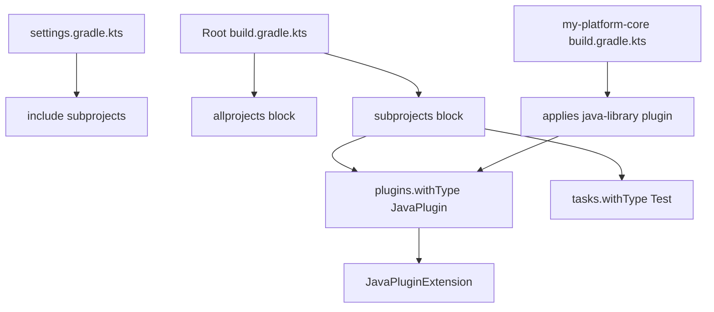
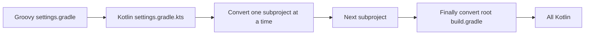
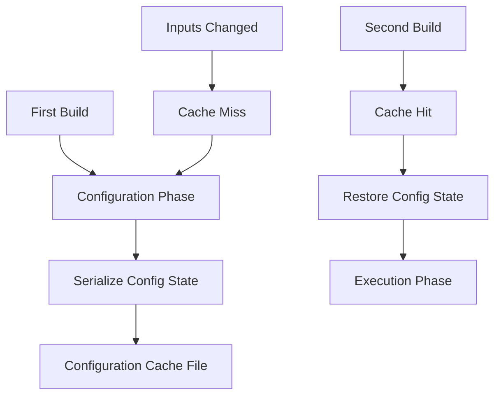

# Gradle Kotlin DSL and Version Catalogs

## Overview

Gradle's Kotlin DSL replaces Groovy with Kotlin as the language for `build.gradle.kts` files. The motivation is straightforward: Kotlin is statically typed, has first-class IDE support with autocomplete and refactoring, and surfaces configuration errors at compile time rather than at runtime. For engineers who already use Kotlin in production, the Kotlin DSL is the obvious choice; even for Java-only teams, the type safety and tooling make it worth the slightly more verbose syntax.

Alongside the Kotlin DSL, Gradle introduced **version catalogs**, a TOML-based centralized dependency management format that replaces the ad hoc pattern of declaring versions as properties in `gradle.properties`. Version catalogs are language-agnostic: they work with both the Groovy and Kotlin DSLs and provide a single source of truth for dependency coordinates and versions across an entire multi-project build.

This note covers the Kotlin DSL syntax, idiomatic differences from Groovy, the structure of a `libs.versions.toml` file, how to reference catalog entries from both DSLs, how to share catalogs across builds, and how to migrate an existing Groovy build to Kotlin. We will use Mermaid diagrams, real Kotlin code, TOML snippets, and a battery of interview questions with model answers.

By the end you should be able to write idiomatic `build.gradle.kts` files, design a version catalog that scales to dozens of modules, and migrate a Groovy build with confidence.

## Background Knowledge

Before reading further, make sure you understand the Gradle fundamentals from the previous note:

- **Project, Task, Plugin, Configuration**: the four core Gradle primitives.
- **Three build phases**: initialization, configuration, execution.
- **Configuration avoidance**: `register` and `named` instead of `task` and direct accessors.
- **Dependency configurations**: `implementation`, `api`, `compileOnly`, `runtimeOnly`, `testImplementation`.

You should also be familiar with Kotlin basics: top-level functions, extension functions, lambda syntax with the implicit `it` parameter, and trailing-lambda call conventions.

## Why the Kotlin DSL

The Groovy DSL has two long-running weaknesses. First, it is dynamically typed, which means typos in property names or task configuration only surface at runtime. Second, IDE support is limited: autocomplete works for well-known extensions but not for custom plugin contributions. The Kotlin DSL solves both problems by compiling build scripts as Kotlin code.

Benefits of the Kotlin DSL:

- **Compile-time checking.** Typos and type mismatches surface during the configuration phase, often as compile errors before any task runs.
- **First-class IDE support.** IntelliJ IDEA provides precise autocomplete, refactoring, and navigation for `build.gradle.kts` files.
- **Documented API.** The Gradle Kotlin DSL exposes its full API surface, including extension functions and property delegates, which makes the source of every configuration option discoverable.
- **Migration path.** Existing Groovy builds can be migrated file by file, with Gradle supporting a mix of Groovy and Kotlin scripts at different levels of a multi-project build.

Tradeoffs:

- **More verbose syntax.** Kotlin requires explicit type declarations in some places where Groovy infers them.
- **Slower first build.** Kotlin compilation is slower than Groovy parsing, which makes the initial configuration of a Kotlin DSL build slower. Subsequent builds are fast due to Kotlin's incremental compilation and script caching.
- **Steeper learning curve for engineers who do not know Kotlin.**

## A Minimal Kotlin DSL Build

Here is the smallest meaningful Kotlin DSL build for a Java library:

```kotlin
plugins {
    java
}

group = "com.example"
version = "1.0.0"

repositories {
    mavenCentral()
}

dependencies {
    implementation("org.springframework.boot:spring-boot-starter-web:3.3.0")
    testImplementation("org.junit.jupiter:junit-jupiter:5.10.2")
}

java {
    toolchain {
        languageVersion.set(JavaLanguageVersion.of(21))
    }
}

tasks.test {
    useJUnitPlatform()
}
```

The differences from Groovy are subtle but pervasive:

- Plugin IDs use the unquoted form (`java`) for core plugins and the quoted form (`id("org.springframework.boot") version "3.3.0"`) for community plugins.
- Strings use double quotes, since single quotes are character literals in Kotlin.
- Method calls use parentheses: `implementation("...")` instead of `implementation '...'`.
- Properties use `=` for assignment: `group = "com.example"` instead of `group = 'com.example'`.
- Mutable properties use `.set(...)` for lazy assignment: `languageVersion.set(JavaLanguageVersion.of(21))` instead of `languageVersion = JavaLanguageVersion.of(21)`.

## Plugins Block Syntax

Core plugins are referenced by their short name without quotes:

```kotlin
plugins {
    java
    `java-library`
    application
}
```

For plugins whose ID contains a hyphen, you must use backticks (Kotlin raw identifiers). For community plugins, use the full `id(...)` syntax:

```kotlin
plugins {
    java
    id("org.springframework.boot") version "3.3.0"
    id("io.spring.dependency-management") version "1.1.5"
}
```

## Dependency Declarations

The Kotlin DSL uses the same configurations as Groovy but with parenthesized call syntax:

```kotlin
dependencies {
    implementation(platform("org.springframework.boot:spring-boot-dependencies:3.3.0"))
    implementation("org.springframework.boot:spring-boot-starter-web")
    implementation("org.springframework.boot:spring-boot-starter-data-jpa")
    compileOnly("org.projectlombok:lombok:1.18.32")
    annotationProcessor("org.projectlombok:lombok:1.18.32")
    runtimeOnly("org.postgresql:postgresql:42.7.3")
    testImplementation("org.springframework.boot:spring-boot-starter-test")
    testImplementation("org.junit.jupiter:junit-jupiter:5.10.2")
    testRuntimeOnly("org.junit.platform:junit-platform-launcher")
}
```

The `platform(...)` function declares a BOM dependency, equivalent to Maven's `<dependencyManagement>` import. After applying a platform, you can omit versions from individual dependencies and they inherit the version from the BOM.

## Task Configuration

Configuring existing tasks uses the same `tasks.named` pattern as Groovy:

```kotlin
tasks.named<Test>("test") {
    useJUnitPlatform()
    testLogging {
        events("passed", "skipped", "failed")
        exceptionFormat = TestExceptionFormat.FULL
    }
    jvmArgs("-XX:+UseG1GC", "-Xmx1g")
}
```

The reified type parameter `<Test>` lets Kotlin know the task's concrete type, so methods like `useJUnitPlatform()` are available without casting. This is a significant readability win over Groovy, where you would need to cast or use `tasks.named("test", Test)`.

Registering new tasks:

```kotlin
tasks.register("generateReport") {
    doLast {
        println("Generating report...")
    }
}
```

For typed custom tasks:

```kotlin
abstract class GreetingTask : DefaultTask() {
    @get:Input
    val message: Property<String> = project.objects.property(String::class.java)

    @get:InputDirectory
    val sourceDir: DirectoryProperty = project.objects.directoryProperty()

    @get:OutputFile
    val outputFile: RegularFileProperty = project.objects.fileProperty()

    @TaskAction
    fun generate() {
        outputFile.get().asFile.writeText("${message.get()}\nGenerated from ${sourceDir.get().asFile.name}")
    }
}

tasks.register<GreetingTask>("generateGreeting") {
    message.set("Welcome to Gradle Kotlin DSL")
    sourceDir.set(layout.projectDirectory.dir("src/main/java"))
    outputFile.set(layout.buildDirectory.file("greeting.txt"))
}
```

Note the `@get:Input` annotation: Kotlin requires this target specification because its default property accessors do not match JavaBeans conventions. The `project.objects.property(...)` factory creates a `Property<T>`, which is Gradle's lazy, mutable holder for configuration values.

## Multi-Project Builds

The `settings.gradle.kts` file lists subprojects:

```kotlin
rootProject.name = "my-platform"

include("my-platform-api")
include("my-platform-core")
include("my-platform-web")
include("my-platform-app")
```

The root `build.gradle.kts` configures all subprojects:

```kotlin
plugins {
    java
    id("org.springframework.boot") version "3.3.0" apply false
    id("io.spring.dependency-management") version "1.1.5" apply false
}

allprojects {
    group = "com.example"
    version = "1.0.0"

    repositories {
        mavenCentral()
    }
}

subprojects {
    plugins.withType<JavaPlugin> {
        extensions.configure<JavaPluginExtension> {
            toolchain {
                languageVersion.set(JavaLanguageVersion.of(21))
            }
        }
    }

    dependencies {
        "testImplementation"("org.junit.jupiter:junit-jupiter:5.10.2")
        "testRuntimeOnly"("org.junit.platform:junit-platform-launcher")
    }

    tasks.withType<Test>().configureEach {
        useJUnitPlatform()
    }
}
```

The `plugins.withType<JavaPlugin>` pattern is the Kotlin-idiomatic way to defer configuration until a plugin is applied, which is necessary because the `java` plugin is applied at the subproject level rather than the root level.



## Version Catalogs

A **version catalog** is a TOML file that centralizes dependency declarations. The default location is `gradle/libs.versions.toml`, which Gradle automatically detects and exposes as a `libs` accessor in build scripts.

Here is a realistic catalog for a Spring Boot application:

```toml
[versions]
springBoot = "3.3.0"
springDependencyManagement = "1.1.5"
junit = "5.10.2"
postgresql = "42.7.3"
lombok = "1.18.32"
guava = "32.1.3-jre"
kotlin = "1.9.24"

[libraries]
spring-boot-starter-web = { module = "org.springframework.boot:spring-boot-starter-web", version.ref = "springBoot" }
spring-boot-starter-data-jpa = { module = "org.springframework.boot:spring-boot-starter-data-jpa", version.ref = "springBoot" }
spring-boot-starter-test = { module = "org.springframework.boot:spring-boot-starter-test", version.ref = "springBoot" }
spring-boot-dependencies = { module = "org.springframework.boot:spring-boot-dependencies", version.ref = "springBoot" }
junit-jupiter = { module = "org.junit.jupiter:junit-jupiter", version.ref = "junit" }
junit-platform-launcher = { module = "org.junit.platform:junit-platform-launcher", version = "1.10.2" }
postgresql = { module = "org.postgresql:postgresql", version.ref = "postgresql" }
lombok = { module = "org.projectlombok:lombok", version.ref = "lombok" }
guava = { module = "com.google.guava:guava", version.ref = "guava" }

[plugins]
spring-boot = { id = "org.springframework.boot", version.ref = "springBoot" }
spring-dependency-management = { id = "io.spring.dependency-management", version.ref = "springDependencyManagement" }
kotlin-jvm = { id = "org.jetbrains.kotlin.jvm", version.ref = "kotlin" }

[bundles]
spring-boot = ["spring-boot-starter-web", "spring-boot-starter-data-jpa", "spring-boot-starter-test"]
```

The catalog has four sections:

- **`[versions]`** declares version aliases that can be referenced by `version.ref`.
- **`[libraries]`** declares dependency aliases with their GAV coordinates.
- **`[plugins]`** declares plugin aliases with their IDs and versions.
- **`[bundles]`** declares named groups of libraries that can be added together.

### Referencing the Catalog from Kotlin

```kotlin
plugins {
    java
    alias(libs.plugins.spring.boot)
    alias(libs.plugins.spring.dependency.management)
}

dependencies {
    implementation(platform(libs.spring.boot.dependencies))
    implementation(libs.spring.boot.starter.web)
    implementation(libs.spring.boot.starter.data.jpa)
    implementation(libs.guava)
    compileOnly(libs.lombok)
    annotationProcessor(libs.lombok)
    runtimeOnly(libs.postgresql)
    testImplementation(libs.spring.boot.starter.test)
    testImplementation(libs.junit.jupiter)
    testRuntimeOnly(libs.junit.platform.launcher)
}
```

The `libs` accessor is generated by Gradle at configuration time. Each alias becomes a property on `libs`: dashes in the alias become dots in the accessor. So `spring-boot-starter-web` becomes `libs.spring.boot.starter.web`.

For bundles, the syntax is the same:

```kotlin
dependencies {
    implementation(libs.bundles.spring.boot)
}
```

This single line adds every library in the `spring-boot` bundle to the `implementation` configuration.

### Referencing the Catalog from Groovy

The catalog works identically with Groovy DSL builds:

```groovy
plugins {
    id 'java'
    alias(libs.plugins.spring.boot)
    alias(libs.plugins.spring.dependency.management)
}

dependencies {
    implementation platform(libs.spring.boot.dependencies)
    implementation libs.spring.boot.starter.web
    implementation libs.spring.boot.starter.data.jpa
    implementation libs.guava
    compileOnly libs.lombok
    annotationProcessor libs.lombok
    runtimeOnly libs.postgresql
    testImplementation libs.spring.boot.starter.test
    testImplementation libs.junit.jupiter
    testRuntimeOnly libs.junit.platform.launcher
}
```

This language-agnostic design is one of the strongest arguments for adopting version catalogs: you can migrate from Groovy to Kotlin DSL (or vice versa) without rewriting any dependency declarations.

## Sharing Catalogs Across Builds

For an organization with many independent Gradle builds, you can publish a version catalog as a regular artifact and consume it from each build. In the catalog project:

```kotlin
// settings.gradle.kts
dependencyResolutionManagement {
    versionCatalogs {
        create("libs") {
            from(files("gradle/libs.versions.toml"))
        }
    }
}
```

Publish the catalog itself:

```kotlin
plugins {
    `version-catalog`
}

catalog {
    versionCatalog {
        from(files("gradle/libs.versions.toml"))
    }
}
```

After `publishing`, the catalog is available as `com.example:my-platform-catalog:1.0.0`. Consume it from another build:

```kotlin
// settings.gradle.kts
dependencyResolutionManagement {
    versionCatalogs {
        create("libs") {
            from("com.example:my-platform-catalog:1.0.0")
        }
    }
}
```

This pattern lets a platform team curate the dependency versions for an entire organization, with consumers automatically picking up updates when they bump their catalog version.

## The dependencyResolutionManagement Block

The `dependencyResolutionManagement` block in `settings.gradle.kts` is also where you centralize repository declarations:

```kotlin
dependencyResolutionManagement {
    repositoriesMode.set(RepositoriesMode.FAIL_ON_PROJECT_REPOS)
    repositories {
        mavenCentral()
        maven {
            url = uri("https://nexus.example.com/repository/maven-public/")
            credentials {
                username = System.getenv("NEXUS_USER")
                password = System.getenv("NEXUS_PASS")
            }
        }
    }
}
```

The `RepositoriesMode.FAIL_ON_PROJECT_REPOS` setting causes Gradle to fail if any subproject declares its own repositories. This forces all repository configuration to live in one place, which is the canonical pattern for enterprise builds.

## Property Delegates

Kotlin DSL exposes Gradle's `Property<T>` types, which are lazy holders. You set them with `.set(...)` and read them with `.get()`. To make this more idiomatic, Gradle provides property delegates:

```kotlin
val springBootVersion: String by settings
val enablePreview: Boolean by project

tasks.named<JavaCompile>("compileJava") {
    options.compilerArgs.add("--enable-preview")
}
```

The `by settings` and `by project` delegates look up properties in the `Settings` and `Project` scopes respectively, throwing a helpful error if the property is missing. Use them in preference to `findProperty` for required configuration.

## Migration from Groovy to Kotlin

Migrating an existing Groovy build to Kotlin DSL is a mechanical but careful process. The recommended approach:

1. Start with `settings.gradle`, converting it to `settings.gradle.kts`. Remove the original `settings.gradle` so Gradle only sees one.
2. Convert one subproject's `build.gradle` to `build.gradle.kts` at a time. Gradle supports mixed Groovy and Kotlin scripts in the same multi-project build, so you can migrate incrementally.
3. Replace single-quoted strings with double-quoted strings.
4. Add parentheses to method calls: `implementation 'x'` becomes `implementation("x")`.
5. Replace `=` for property assignment where Groovy allowed it; use `.set(...)` for `Property<T>` types.
6. Add explicit type parameters where needed: `tasks.named<Test>("test")` instead of `tasks.named("test")`.
7. Convert plugin IDs: `id 'java-library'` becomes `java-library` (with backticks) or `id("java-library")`.
8. Use IntelliJ IDEA's built-in converter as a starting point, but review every change manually.



## Common Pitfalls

### Using `=` instead of `.set()` for Property types

Gradle's `Property<T>` types are not regular Kotlin properties. Setting them with `=` does not compile. Use `.set(...)` instead, or the property delegate syntax.

### Forgetting the type parameter on `tasks.named`

Without `tasks.named<Test>("test")`, Kotlin treats the task as the abstract `Task` type and you cannot call `useJUnitPlatform()` on it. Either supply the type parameter or cast inside the configuration block.

### Mixing `plugins {}` and `apply plugin:`

The `plugins {}` block must be the first statement in the file (after the package declaration if any). You cannot mix it with `apply plugin:` calls elsewhere in the script. Apply all plugins through the `plugins {}` block.

### Declaring catalog aliases with non-identifier characters

Catalog aliases must be valid identifiers when transformed into property accessors. Avoid dots, spaces, and most punctuation. Dashes and underscores are allowed but become dots in the accessor. Avoid leading digits and reserved Kotlin keywords.

### Forgetting to import Kotlin types

The Kotlin DSL does not import everything by default. You often need to import `org.gradle.api.tasks.testing.Test`, `org.gradle.jvm.toolchain.JavaLanguageVersion`, and similar types. IntelliJ IDEA can add these imports automatically.

### Expecting version catalog accessors to exist before Gradle has generated them

The `libs` accessor is generated by Gradle at configuration time. If you have a syntax error in your `libs.versions.toml`, the accessor generation fails and your build script will not compile. Always validate the TOML file first.

## Tips and Tricks

- Use `./gradlew buildEnvironment` to print the resolved dependency hierarchy for the build script classpath itself.
- Use `./gradlew dependencies` to print the resolved project dependency tree.
- Use `./gradlew dependencyInsight --dependency com.google.guava:guava` to see exactly which configuration pulls in a given dependency.
- Use `./gradlew --write-locks` to generate lockfiles for reproducible builds.
- Use the Kotlin DSL by default for new projects; the type safety and IDE support are worth the slightly steeper learning curve.
- Use the IntelliJ IDEA "Kotlin DSL: Convert to Kotlin DSL" action on a Groovy `build.gradle` to get a starting point for migration, then fix the inevitable errors manually.
- Run `./gradlew kotlinDslAccessorsSnapshot` to update the accessors snapshot, which improves IDE performance for large builds.
- Keep the version catalog small and focused. If it grows past a few hundred entries, split it into multiple catalogs.

## Interview Questions

**Question:** What are the main advantages of the Kotlin DSL over the Groovy DSL?

**Answer:** The Kotlin DSL offers compile-time type checking, first-class IDE support with autocomplete and refactoring, and a documented public API surface. Typos and type mismatches surface as compile errors during configuration, rather than as runtime failures. The tradeoffs are slightly more verbose syntax (parentheses for method calls, explicit type parameters), a slower initial build due to Kotlin compilation, and a steeper learning curve for engineers who do not know Kotlin.

**Question:** What is a version catalog and what problem does it solve?

**Answer:** A version catalog is a TOML file (`gradle/libs.versions.toml`) that centralizes dependency declarations: versions, library coordinates, plugin coordinates, and bundles. It solves the problem of dependency versions being scattered across `gradle.properties`, multi-line strings, and individual module build scripts. With a catalog, you have a single source of truth for every version and coordinate, accessible from both Groovy and Kotlin DSL builds via generated type-safe accessors.

**Question:** How do you reference a library declared in a version catalog from a Kotlin DSL build?

**Answer:** Gradle generates a `libs` accessor at configuration time. Each alias in the catalog becomes a property on `libs`. For example, an alias `spring-boot-starter-web` becomes `libs.spring.boot.starter.web` (dashes in the alias become dots in the accessor). You use it in a dependencies block like `implementation(libs.spring.boot.starter.web)`. For plugins, use the `alias(libs.plugins.spring.boot)` syntax in the `plugins {}` block.

**Question:** How do you share a version catalog across multiple independent Gradle builds?

**Answer:** Publish the catalog as a regular Gradle artifact using the `version-catalog` plugin and the `catalog { versionCatalog { from(files("gradle/libs.versions.toml")) } }` configuration. After publishing, consume it from another build by declaring `create("libs") { from("com.example:my-platform-catalog:1.0.0") }` in the `dependencyResolutionManagement` block of `settings.gradle.kts`. This lets a platform team curate dependency versions for an entire organization.

**Question:** What is `dependencyResolutionManagement` and why is it useful?

**Answer:** `dependencyResolutionManagement` is a block in `settings.gradle.kts` that centralizes repository configuration and version catalog access across all subprojects. With `repositoriesMode.set(RepositoriesMode.FAIL_ON_PROJECT_REPOS)`, Gradle fails the build if any subproject declares its own repositories, forcing all repository configuration to live in one place. This is the canonical pattern for enterprise builds because it prevents accidental repository leakage and makes the build easier to audit.

**Question:** What is the difference between `tasks.named<Test>("test")` and `tasks.named("test")`?

**Answer:** `tasks.named<Test>("test")` returns a `TaskProvider<Test>`, which gives you typed access to the `Test` task's methods like `useJUnitPlatform()` inside the configuration block. Without the type parameter, Kotlin treats the task as the abstract `Task` type, and you must cast it explicitly. Always supply the type parameter when configuring a known task type, both for readability and for compile-time safety.

**Question:** Why do you need `@get:Input` instead of `@Input` on a Kotlin property?

**Answer:** Kotlin's default property accessors do not match JavaBeans conventions, so a plain `@Input` annotation on a Kotlin `val` property is applied to the backing field rather than the getter. Gradle expects annotations on the getter, so you must use the `@get:Input` target specification to tell Kotlin to apply the annotation to the getter. The same applies to `@get:InputFile`, `@get:OutputFile`, and other Gradle annotations.

**Question:** How would you migrate an existing Groovy build to Kotlin DSL?

**Answer:** Incrementally, one file at a time. Start with `settings.gradle`, converting it to `settings.gradle.kts` and removing the original. Then convert one subproject's `build.gradle` at a time. Gradle supports mixed Groovy and Kotlin scripts in the same multi-project build. For each file: replace single quotes with double quotes, add parentheses to method calls, use `.set(...)` for `Property<T>` types, add type parameters on `tasks.named`, and convert plugin IDs. Use IntelliJ IDEA's converter as a starting point, but review every change manually. Finish with the root `build.gradle`.

## Advanced Kotlin DSL Patterns

### Custom Extensions and DSL Builders

One of the most powerful features of the Kotlin DSL is the ability to write your own extensions that read like first-class Gradle syntax. For example, you can write an extension that configures a Spring Boot application:

```kotlin
fun Project.springBootApplication(configuration: SpringBootExtension.() -> Unit) {
    plugins.apply("org.springframework.boot")
    extensions.configure<SpringBootExtension> {
        configuration()
    }
}
```

Then in your build script:

```kotlin
springBootApplication {
    mainClass.set("com.example.Application")
    buildInfo()
}
```

This pattern is how the Spring Boot Gradle plugin itself works, and you can apply the same technique to your own internal conventions.

### Precompiled Script Plugins

A precompiled script plugin is a `.gradle.kts` file in `buildSrc/src/main/kotlin/` that Gradle compiles into a regular plugin. They are the modern, idiomatic way to share build logic across modules.

```
my-platform/
  buildSrc/
    build.gradle.kts
    settings.gradle.kts
    src/main/kotlin/
      com.example.java-conventions.gradle.kts
      com.example.spring-boot-conventions.gradle.kts
```

The `buildSrc/build.gradle.kts` enables the `kotlin-dsl` plugin:

```kotlin
plugins {
    `kotlin-dsl`
}

repositories {
    mavenCentral()
    gradlePluginPortal()
}

dependencies {
    implementation("org.springframework.boot:spring-boot-gradle-plugin:3.3.0")
    implementation("io.spring.gradle:dependency-management-plugin:1.1.5")
}
```

The convention script itself:

```kotlin
// com.example.java-conventions.gradle.kts
plugins {
    java
    id("io.spring.dependency-management")
}

java {
    toolchain {
        languageVersion.set(JavaLanguageVersion.of(21))
    }
}

repositories {
    mavenCentral()
}

dependencies {
    testImplementation(libs.junit.jupiter)
    testRuntimeOnly(libs.junit.platform.launcher)
}

tasks.withType<Test>().configureEach {
    useJUnitPlatform()
}
```

Each subproject applies the convention plugin by its ID:

```kotlin
plugins {
    id("com.example.java-conventions")
}
```

Precompiled script plugins are easier to read than Kotlin plugin classes because the syntax is the same as a regular `build.gradle.kts`. They are the canonical way to share build logic in modern Gradle.

### Type-Safe Accessors for Custom Configurations

When you create a custom configuration, Gradle generates type-safe accessors for it only if it is created in a plugin applied through the `plugins {}` block. Configurations created at runtime via `configurations.create(...)` do not get accessors. This is rarely a problem in practice, but it explains why `implementation` is accessible as a method while `integrationTestImplementation` requires string-based access.

```kotlin
configurations {
    create("integrationTestImplementation") {
        extendsFrom(configurations.getByName("testImplementation"))
    }
}

dependencies {
    "integrationTestImplementation"("org.springframework.boot:spring-boot-starter-test")
}
```

### Using Kotlin Coroutines in Task Actions

Gradle's Worker API supports running tasks in parallel using Kotlin coroutines. This is an advanced pattern for tasks that perform I/O-bound work like downloading files or making HTTP requests.

```kotlin
import kotlinx.coroutines.*
import kotlin.coroutines.CoroutineContext

abstract class ParallelDownloader : DefaultTask() {
    @get:Input
    val urls: ListProperty<String> = project.objects.listProperty(String::class.java)

    @get:OutputDirectory
    val outputDir: DirectoryProperty = project.objects.directoryProperty()

    @TaskAction
    fun download() = runBlocking {
        urls.get().map { url ->
            async(Dispatchers.IO) {
                val file = outputDir.get().file(url.substringAfterLast("/")).asFile
                file.writeBytes(java.net.URL(url).readBytes())
            }
        }.awaitAll()
    }
}
```

The Worker API also supports running tasks in separate JVM processes, which is useful for tasks that load incompatible library versions.

## Version Catalog Deep Dive

### Aliases with Version References

The `version.ref` syntax lets you share a single version across multiple libraries:

```toml
[versions]
jackson = "2.17.1"

[libraries]
jackson-databind = { module = "com.fasterxml.jackson.core:jackson-databind", version.ref = "jackson" }
jackson-core = { module = "com.fasterxml.jackson.core:jackson-core", version.ref = "jackson" }
jackson-annotations = { module = "com.fasterxml.jackson.core:jackson-annotations", version.ref = "jackson" }
```

All three Jackson libraries share the same version, ensuring they stay in sync.

### Rich Version Constraints

Version catalogs support Gradle's rich version constraints, including `require`, `strictly`, `prefer`, and `reject`:

```toml
[libraries]
guava = { module = "com.google.guava:guava", version = { require = "[32.0,34.0)", prefer = "32.1.3-jre" } }
```

This declares that any version in the range 32.0 (inclusive) to 34.0 (exclusive) is acceptable, with 32.1.3-jre preferred. Rich constraints are powerful but should be used sparingly, as they can produce surprising resolution results when combined with transitive dependencies.

### Bundles for Cohesive Groups

Bundles let you declare groups of libraries that are typically used together:

```toml
[bundles]
testing = ["junit-jupiter", "mockito-core", "assertj-core", "spring-boot-starter-test"]
```

Reference the bundle in your build:

```kotlin
dependencies {
    testImplementation(libs.bundles.testing)
}
```

This is particularly useful for testing stacks, logging stacks, and any set of libraries that must always be added together.

### Plugin Versions in the Catalog

Plugin versions are declared in the `[plugins]` section:

```toml
[plugins]
spring-boot = { id = "org.springframework.boot", version.ref = "springBoot" }
```

Reference them with the `alias` syntax in the `plugins {}` block:

```kotlin
plugins {
    java
    alias(libs.plugins.spring.boot)
}
```

This is the modern, recommended way to declare plugin versions, replacing the older pattern of hardcoding versions in each module's build script.

### Programmatic Catalog Creation

You can also create catalogs programmatically in `settings.gradle.kts`:

```kotlin
dependencyResolutionManagement {
    versionCatalogs {
        create("libs") {
            version("springBoot", "3.3.0")
            library("spring-boot-starter-web", "org.springframework.boot", "spring-boot-starter-web").versionRef("springBoot")
            library("junit-jupiter", "org.junit.jupiter", "junit-jupiter").version("5.10.2")
            bundle("testing", listOf("junit-jupiter"))
            plugin("spring-boot", "org.springframework.boot").versionRef("springBoot")
        }
    }
}
```

This is useful when generating catalogs from external data sources like a corporate catalog service.

## Configuration Cache Compatibility

The configuration cache is Gradle's most aggressive performance optimization. It serializes the configuration state after the first build and reuses it on subsequent builds, skipping the configuration phase entirely. To benefit from it, your build must be configuration-cache compatible.

Common incompatibilities include:

- Calling `System.currentTimeMillis()` or `java.util.Date()` at configuration time.
- Reading environment variables or system properties at configuration time without using the `Provider` API.
- Calling external services (HTTP, database) at configuration time.
- Using `project.rootProject` to access another project's state, which breaks the cache's project isolation.

To make a build cache-compatible, replace eager property access with `Provider` types:

```kotlin
// Bad: eagerly reads at configuration time
val apiKey = System.getenv("API_KEY")

// Good: lazily reads when needed
val apiKey = providers.environmentVariable("API_KEY")

tasks.register("callApi") {
    doLast {
        val key = apiKey.get()
        // use key
    }
}
```

The `providers` API is the canonical way to access external state lazily. Use it for environment variables, system properties, configuration files, and command-line properties.



## Common Pitfalls

### Forgetting to enable the configuration cache

Many teams adopt Gradle 8 but never enable the configuration cache. They miss out on significant performance improvements. Enable it in `gradle.properties`:

```properties
org.gradle.configuration-cache=true
org.gradle.configuration-cache.problems=warn
```

The `warn` setting logs incompatibilities without failing the build, so you can fix them incrementally. Once everything is compatible, change it to `fail`.

### Mixing version catalog accessors with hardcoded versions

If you reference `libs.guava` in one module and `"com.google.guava:guava:32.1.3-jre"` in another, you defeat the purpose of the catalog. Always reference dependencies through the catalog.

### Declaring plugin versions in both the catalog and the plugins block

If you declare a plugin in the catalog with `alias(libs.plugins.spring.boot)` and also hardcode its version in the `plugins {}` block, the catalog version is ignored. Use one or the other, not both.

### Using `by project` for properties that may be absent

The `by project` delegate throws an exception if the property is missing. Use `findProperty("name") as String?` for optional properties, or `providers.gradleProperty("name").orElse("default")` for properties with defaults.

## Tips and Tricks

- Use `./gradlew kotlinDslAccessorsSnapshot` to refresh accessors after adding new extensions or configurations.
- Use the `kotlin-dsl` plugin in `buildSrc` to enable Kotlin DSL precompiled script plugins.
- Use `./gradlew --configuration-cache` to test configuration cache compatibility without enabling it globally.
- Use `./gradlew help --configuration-cache` to print a report of configuration cache problems after a build.
- Use the `gradle.properties` setting `org.gradle.configuration-cache.max-problems=10` to limit the number of cache problems reported, useful for incremental migration.
- Use the `--watch-fs` flag to enable file system watching, which dramatically reduces the time Gradle spends checking for changed inputs.
- Use `./gradlew build --scan` to publish a build scan that visualizes configuration cache hits and misses.

## Interview Questions

**Question:** What is a precompiled script plugin and how does it differ from a regular plugin?

**Answer:** A precompiled script plugin is a `.gradle.kts` file in `buildSrc/src/main/kotlin/` that Gradle compiles into a regular plugin. It uses the same syntax as a regular `build.gradle.kts` file, which makes it much easier to read and write than a Kotlin plugin class. It is the modern, idiomatic way to share build logic across modules. The `kotlin-dsl` plugin in `buildSrc/build.gradle.kts` enables this feature. Subprojects apply the plugin by its ID, which is derived from the filename.

**Question:** What is the Gradle configuration cache and what makes a build compatible with it?

**Answer:** The configuration cache serializes the configuration state after the first build and reuses it on subsequent builds, skipping the configuration phase entirely. A build is compatible if it avoids calling external services, reading environment variables eagerly, or using `System.currentTimeMillis()` at configuration time. Instead, use the `providers` API (`providers.environmentVariable(...)`, `providers.gradleProperty(...)`, `providers.systemProperty(...)`) to access external state lazily. Enable the cache with `org.gradle.configuration-cache=true` in `gradle.properties`, and use `org.gradle.configuration-cache.problems=warn` to discover incompatibilities without failing the build.

**Question:** How do rich version constraints work in version catalogs?

**Answer:** A version entry can be either a string (interpreted as a strict requirement) or an object with `require`, `strictly`, `prefer`, and `reject` keys. `require` accepts any version in the given range. `strictly` rejects any version outside the range, even when transitive dependencies bring in a different version. `prefer` hints Gradle toward a specific version when multiple versions satisfy the `require` range. `reject` excludes specific versions. Use rich constraints sparingly, as they can produce surprising resolution results when combined with transitive dependencies.

**Question:** Why are bundles useful in version catalogs?

**Answer:** Bundles let you declare groups of libraries that are typically used together, so you can add all of them with a single line. This is particularly useful for testing stacks (JUnit, Mockito, AssertJ, Spring Boot Test), logging stacks (SLF4J, Logback), and any set of libraries that must always be added together to avoid partial configurations. The `testImplementation(libs.bundles.testing)` syntax is more readable and less error-prone than listing each library individually.

## Summary

Gradle's Kotlin DSL brings static typing, first-class IDE support, and compile-time error checking to Gradle builds. The syntax differs from Groovy in several details: double quotes, parenthesized method calls, explicit type parameters, and `.set(...)` for property assignment. Version catalogs add centralized dependency management via a TOML file, with generated type-safe accessors that work identically from both Groovy and Kotlin DSLs. Catalogs can be published and shared across independent builds, making them the canonical way for platform teams to curate dependency versions for an organization. The `dependencyResolutionManagement` block centralizes repository configuration and forces all repository declarations to live in one place. Migrating from Groovy to Kotlin is incremental and mechanical, but each step requires careful review. With these tools, Gradle builds can be both fast and maintainable at any scale. The final note in this phase covers publishing libraries with both Maven and Gradle, then compares the two tools head to head.
