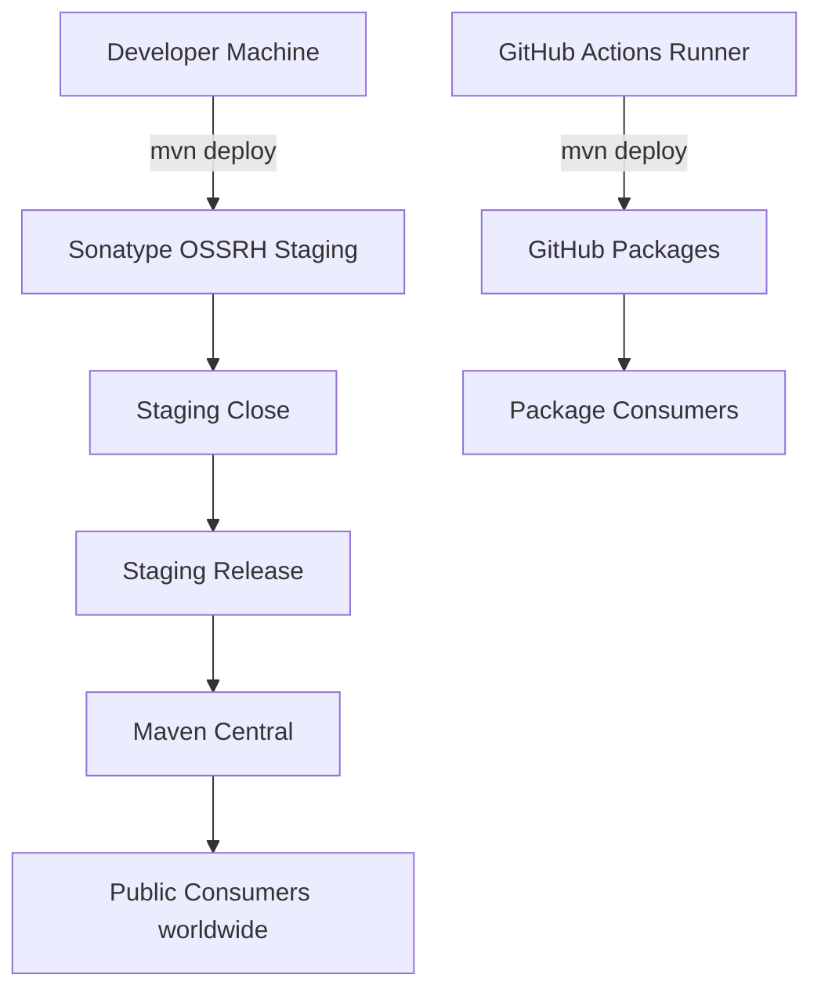
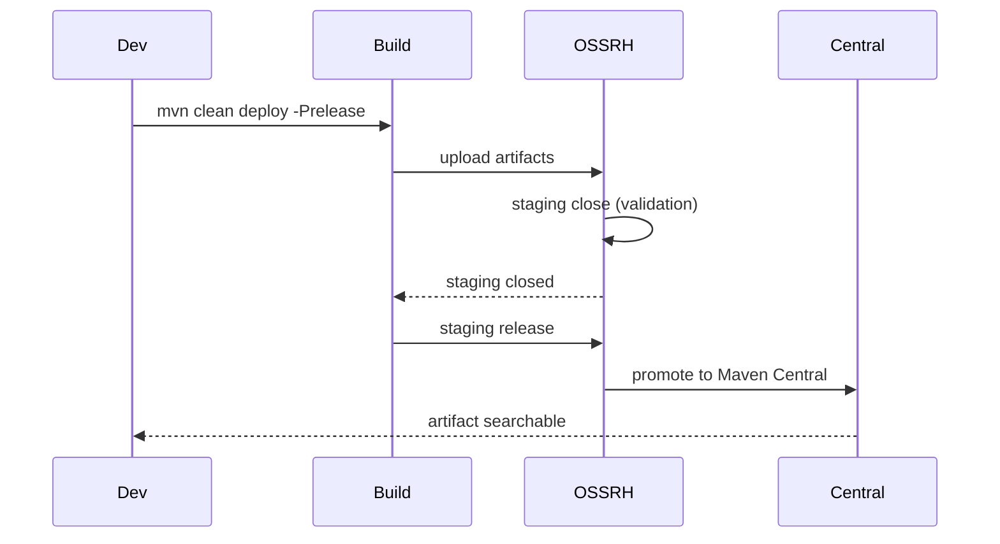
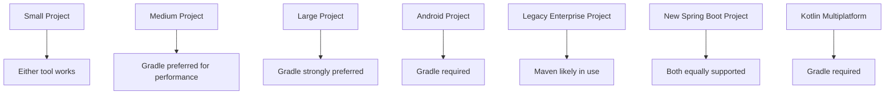

# Publishing Libraries and Build Tool Comparison

## Overview

Building a library is only half the job. The other half is publishing it to a repository where other engineers and CI systems can consume it. Maven and Gradle approach publishing differently, reflecting their underlying philosophies: Maven treats publishing as one phase of its lifecycle, configured primarily in the POM; Gradle treats publishing as a task graph problem, configured through the `maven-publish` and `ivy-publish` plugins. Both tools ultimately produce the same artifacts (JAR, POM, checksums, signatures) and upload them to the same kinds of repositories (Maven Central, Sonatype OSSRH, Nexus, Artifactory, GitHub Packages).

This note covers publishing with both tools in depth. We will walk through configuring the `maven-deploy-plugin` for Maven, the `maven-publish` plugin for Gradle, signing artifacts with GPG, generating source and Javadoc JARs, publishing to Sonatype OSSRH (the staging workflow used for Maven Central), publishing to GitHub Packages, and publishing to a private Nexus. We then compare Maven and Gradle head to head across eleven dimensions: build philosophy, performance, dependency management, multi-module support, plugin ecosystem, learning curve, IDE support, scripting flexibility, ecosystem adoption, build reproducibility, and suitability for different project sizes.

After reading this note you should be able to publish a JVM library to any repository with either tool, choose the right tool for a new project with clear reasons, and defend your choice in an architecture review.

## Background Knowledge

Recall the following from earlier notes in this phase:

- **Maven lifecycle**: the `deploy` phase uploads artifacts via the `maven-deploy-plugin`.
- **Maven `<distributionManagement>`**: declares the release and snapshot repositories.
- **Gradle publications**: the `maven-publish` plugin's `MavenPublication` object defines what to publish.
- **BOM**: a POM with `packaging=pom` that contains only `<dependencyManagement>`.
- **GPG signing**: required for Maven Central releases.
- **Sonatype OSSRH**: the staging repository infrastructure that gates publication to Maven Central.

## Publishing with Maven

### Configuring Distribution Management

The `maven-deploy-plugin` reads `<distributionManagement>` to know where to upload artifacts. A minimal configuration for Sonatype OSSRH looks like this:

```xml
<distributionManagement>
  <snapshotRepository>
    <id>ossrh</id>
    <url>https://s01.oss.sonatype.org/content/repositories/snapshots</url>
  </snapshotRepository>
  <repository>
    <id>ossrh</id>
    <url>https://s01.oss.sonatype.org/service/local/staging/deploy/maven2/</url>
  </repository>
</distributionManagement>
```

The `<id>` must match a `<server>` entry in `settings.xml`:

```xml
<servers>
  <server>
    <id>ossrh</id>
    <username>${env.OSSRH_USER}</username>
    <password>${env.OSSRH_PASS}</password>
  </server>
  <server>
    <id>gpg.passphrase</id>
    <passphrase>${env.GPG_PASSPHRASE}</passphrase>
  </server>
</servers>
```

### Source and Javadoc JARs

Maven Central requires source and Javadoc JARs alongside the main artifact. Bind the `maven-source-plugin` and `maven-javadoc-plugin` to run during the `package` phase:

```xml
<plugin>
  <groupId>org.apache.maven.plugins</groupId>
  <artifactId>maven-source-plugin</artifactId>
  <version>3.3.1</version>
  <executions>
    <execution>
      <id>attach-sources</id>
      <goals><goal>jar-no-fork</goal></goals>
    </execution>
  </executions>
</plugin>
<plugin>
  <groupId>org.apache.maven.plugins</groupId>
  <artifactId>maven-javadoc-plugin</artifactId>
  <version>3.6.3</version>
  <executions>
    <execution>
      <id>attach-javadocs</id>
      <goals><goal>jar</goal></goals>
    </execution>
  </executions>
</plugin>
```

### GPG Signing

Bind the `maven-gpg-plugin` to the `verify` phase:

```xml
<plugin>
  <groupId>org.apache.maven.plugins</groupId>
  <artifactId>maven-gpg-plugin</artifactId>
  <version>3.2.4</version>
  <executions>
    <execution>
      <id>sign-artifacts</id>
      <phase>verify</phase>
      <goals><goal>sign</goal></goals>
      <configuration>
        <keyname>${env.GPG_KEYNAME}</keyname>
        <passphraseServerId>gpg.passphrase</passphraseServerId>
      </configuration>
    </execution>
  </executions>
</plugin>
```

### The nexus-staging-maven-plugin

The plain `maven-deploy-plugin` uploads to the OSSRH staging repository but does not manage the staging lifecycle. The `nexus-staging-maven-plugin` does both: it deploys to a staging repository, then either auto-releases it or holds it for manual inspection.

```xml
<plugin>
  <groupId>org.sonatype.plugins</groupId>
  <artifactId>nexus-staging-maven-plugin</artifactId>
  <version>1.7.0</version>
  <extensions>true</extensions>
  <configuration>
    <serverId>ossrh</serverId>
    <nexusUrl>https://s01.oss.sonatype.org/</nexusUrl>
    <autoReleaseAfterClose>true</autoReleaseAfterClose>
  </configuration>
</plugin>
```

With `autoReleaseAfterClose` set to true, running `mvn clean deploy` produces a fully released artifact on Maven Central within a few minutes. Set it to false if you want to inspect or test the staging repository before releasing it; you can then release via the Sonatype web UI or via `mvn nexus-staging:release`.

### The Full Release Profile

Putting it all together in a release profile that activates with `-Prelease`:

```xml
<profiles>
  <profile>
    <id>release</id>
    <build>
      <plugins>
        <plugin>
          <groupId>org.apache.maven.plugins</groupId>
          <artifactId>maven-source-plugin</artifactId>
          <version>3.3.1</version>
          <executions>
            <execution>
              <id>attach-sources</id>
              <goals><goal>jar-no-fork</goal></goals>
            </execution>
          </executions>
        </plugin>
        <plugin>
          <groupId>org.apache.maven.plugins</groupId>
          <artifactId>maven-javadoc-plugin</artifactId>
          <version>3.6.3</version>
          <executions>
            <execution>
              <id>attach-javadocs</id>
              <goals><goal>jar</goal></goals>
            </execution>
          </executions>
        </plugin>
        <plugin>
          <groupId>org.apache.maven.plugins</groupId>
          <artifactId>maven-gpg-plugin</artifactId>
          <version>3.2.4</version>
          <executions>
            <execution>
              <id>sign-artifacts</id>
              <phase>verify</phase>
              <goals><goal>sign</goal></goals>
              <configuration>
                <keyname>${env.GPG_KEYNAME}</keyname>
                <passphraseServerId>gpg.passphrase</passphraseServerId>
              </configuration>
            </execution>
          </executions>
        </plugin>
        <plugin>
          <groupId>org.sonatype.plugins</groupId>
          <artifactId>nexus-staging-maven-plugin</artifactId>
          <version>1.7.0</version>
          <extensions>true</extensions>
          <configuration>
            <serverId>ossrh</serverId>
            <nexusUrl>https://s01.oss.sonatype.org/</nexusUrl>
            <autoReleaseAfterClose>true</autoReleaseAfterClose>
          </configuration>
        </plugin>
      </plugins>
    </build>
  </profile>
</profiles>
```

To release, run:

```
mvn clean deploy -Prelease
```

### Publishing to GitHub Packages

GitHub Packages is a Maven repository that lives alongside your GitHub repository. The repository URL has the form `https://maven.pkg.github.com/OWNER/REPOSITORY`, and authentication uses a GitHub Personal Access Token.

```xml
<distributionManagement>
  <repository>
    <id>github</id>
    <name>GitHub Packages</name>
    <url>https://maven.pkg.github.com/example/my-library</url>
  </repository>
</distributionManagement>
```

```xml
<servers>
  <server>
    <id>github</id>
    <username>${env.GITHUB_ACTOR}</username>
    <password>${env.GITHUB_TOKEN}</password>
  </server>
</servers>
```

In GitHub Actions, the `GITHUB_TOKEN` is provided automatically, so publishing from CI is straightforward.



## Publishing with Gradle

### The maven-publish Plugin

Gradle's modern publishing story is the `maven-publish` plugin. It introduces the `publishing {}` extension, where you declare publications (what to publish) and repositories (where to publish).

```groovy
plugins {
    id 'java-library'
    id 'maven-publish'
    id 'signing'
}

group = 'com.example'
version = '1.0.0'

java {
    withSourcesJar()
    withJavadocJar()
}

publishing {
    publications {
        mavenJava(MavenPublication) {
            from components.java
            pom {
                name = 'My Library'
                description = 'A useful Java library.'
                url = 'https://github.com/example/my-library'
                licenses {
                    license {
                        name = 'The Apache License, Version 2.0'
                        url = 'https://www.apache.org/licenses/LICENSE-2.0.txt'
                    }
                }
                developers {
                    developer {
                        id = 'example'
                        name = 'Example Team'
                        email = 'team@example.com'
                    }
                }
                scm {
                    connection = 'scm:git:git://github.com/example/my-library.git'
                    developerConnection = 'scm:git:ssh://github.com/example/my-library.git'
                    url = 'https://github.com/example/my-library'
                }
            }
        }
    }
    repositories {
        maven {
            url = uri('https://s01.oss.sonatype.org/service/local/staging/deploy/maven2/')
            credentials {
                username = System.env.OSSRH_USER
                password = System.env.OSSRH_PASS
            }
        }
    }
}
```

The `from components.java` line is the key: it publishes the JAR produced by the `java` plugin along with its dependencies and metadata. The `pom {}` block generates the published POM with project metadata required by Maven Central.

### Signing

```groovy
signing {
    sign publishing.publications.mavenJava
    useInMemoryPgpKeys(
        System.env.GPG_PRIVATE_KEY,
        System.env.GPG_PASSPHRASE
    )
}
```

The `useInMemoryPgpKeys` method is preferred for CI because it does not require a GPG keyring file. You export your GPG private key with `gpg --export-secret-keys --armor` and store it as a secret.

### The nexus-publish-plugin

Gradle has its own equivalent of the `nexus-staging-maven-plugin`: the `nexus-publish-plugin` from Gradle Nexus. It manages the staging lifecycle in the same way.

```groovy
plugins {
    id 'io.github.gradle-nexus.publish-plugin' version '2.0.0'
}

nexusPublishing {
    repositories {
        sonatype {
            nexusUrl = uri('https://s01.oss.sonatype.org/service/local/')
            snapshotRepositoryUrl = uri('https://s01.oss.sonatype.org/content/repositories/snapshots/')
            username = System.env.OSSRH_USER
            password = System.env.OSSRH_PASS
        }
    }
}
```

Run `./gradlew publishToSonatype closeAndReleaseSonatypeStagingRepository` to publish, close, and release in one go.

### Publishing to GitHub Packages with Gradle

```groovy
publishing {
    repositories {
        maven {
            name = 'GitHubPackages'
            url = uri('https://maven.pkg.github.com/example/my-library')
            credentials {
                username = System.env.GITHUB_ACTOR
                password = System.env.GITHUB_TOKEN
            }
        }
    }
}
```

Run `./gradlew publishGitHubPackagesPublicationToGitHubPackagesRepository` to publish.

### The Kotlin DSL Equivalent

The same configuration in Kotlin:

```kotlin
plugins {
    `java-library`
    `maven-publish`
    signing
}

group = "com.example"
version = "1.0.0"

java {
    withSourcesJar()
    withJavadocJar()
}

publishing {
    publications {
        create<MavenPublication>("mavenJava") {
            from(components["java"])
            pom {
                name.set("My Library")
                description.set("A useful Java library.")
                url.set("https://github.com/example/my-library")
                licenses {
                    license {
                        name.set("The Apache License, Version 2.0")
                        url.set("https://www.apache.org/licenses/LICENSE-2.0.txt")
                    }
                }
                developers {
                    developer {
                        id.set("example")
                        name.set("Example Team")
                        email.set("team@example.com")
                    }
                }
                scm {
                    connection.set("scm:git:git://github.com/example/my-library.git")
                    developerConnection.set("scm:git:ssh://github.com/example/my-library.git")
                    url.set("https://github.com/example/my-library")
                }
            }
        }
    }
    repositories {
        maven {
            url = uri("https://s01.oss.sonatype.org/service/local/staging/deploy/maven2/")
            credentials {
                username = System.getenv("OSSRH_USER")
                password = System.getenv("OSSRH_PASS")
            }
        }
    }
}

signing {
    sign(publishing.publications["mavenJava"])
    useInMemoryPgpKeys(
        System.getenv("GPG_PRIVATE_KEY"),
        System.getenv("GPG_PASSPHRASE")
    )
}
```

## The Staging Workflow for Maven Central

Publishing to Maven Central via OSSRH is a multi-step process:

1. **Prepare your namespace.** Claim your `groupId` on Sonatype by creating a support ticket. Sonatype verifies that you own the domain (for `com.example`) or the GitHub account (for `io.github.example`).
2. **Configure GPG.** Generate a key pair, distribute the public key to a keyserver like `https://keys.openpgp.org`, and export the private key for CI.
3. **Configure credentials.** Store OSSRH username and password, GPG key name, and GPG passphrase in CI secrets.
4. **Deploy to staging.** Run `mvn clean deploy -Prelease` (or the Gradle equivalent). Sonatype creates a staging repository containing your artifacts.
5. **Close the staging repository.** Sonatype runs validation rules (sources present, Javadoc present, signatures valid, POM metadata correct). If validation passes, the staging repository is closed and immutable.
6. **Release the staging repository.** The artifacts are promoted to Maven Central, typically within 30 minutes.
7. **Verify.** Search for your artifact on `https://search.maven.org`.



## Common Pitfalls

### Forgetting the POM metadata required by Maven Central

Maven Central requires every published POM to have a `<name>`, `<description>`, `<url>`, `<licenses>`, `<developers>`, and `<scm>` section. Missing any of these fails the staging validation. Configure them in the `pom {}` block (Gradle) or directly in the POM (Maven).

### Releasing with an unconfigured GPG key

If your GPG key is not published to a public keyserver, the staging validation cannot verify your signature. Run `gpg --keyserver keys.openpgp.org --send-keys KEY_ID` to publish it.

### Trying to overwrite a released version

Release repositories are immutable. If you try to redeploy version `1.0.0`, Sonatype rejects the upload. Bump the version (e.g., `1.0.1`) or use a snapshot (`1.0.1-SNAPSHOT`).

### Publishing SNAPSHOT versions to a release repository

Snapshots must go to a snapshot repository; releases must go to a release repository. Mixing them up results in HTTP 400 errors.

### Forgetting to set `autoReleaseAfterClose` to false for inspection

If you want to test your staging repository before releasing it to the world, set `autoReleaseAfterClose=false`. Otherwise, the staging repository releases automatically as soon as it closes, with no chance to drop it.

## Tips and Tricks

- Use the `maven-deploy-plugin`'s `skip` property (`-Dmaven.deploy.skip=true`) to skip deployment for a specific module while still running the rest of the lifecycle.
- Use the `flatten-maven-plugin` to publish a clean consumer POM that does not depend on your corporate parent POM.
- Use the Gradle `maven-publish` plugin's `versionMapping` feature to control how dependency versions appear in the published POM (e.g., use the resolved version rather than the declared version).
- Use the `nexus-publish-plugin` to release staging repositories from the command line or CI without leaving the terminal.
- Use the Central Portal (the new Sonatype interface) for new projects; it has a simpler API and unified namespace management.
- Use GitHub Actions' `GITHUB_TOKEN` for GitHub Packages publishing without configuring additional secrets.
- Use the `semantic-release` tool or `release-please` to automate version bumps and changelog generation.

## Maven versus Gradle: A Head to Head Comparison

Now that you have seen how both tools handle publishing, let us compare them across the dimensions that matter for production projects.

### 1. Build Philosophy

Maven is declarative and lifecycle-centric. You describe what your project is, and Maven walks a fixed lifecycle to build it. Customization happens through plugins bound to phases. The advantage is predictability: any Maven engineer can read any Maven build and understand it. The disadvantage is rigidity: anything outside the standard lifecycle requires awkward workarounds.

Gradle is programmatic and task-centric. You describe how your project is built, in code. Customization happens through task configuration and arbitrary Groovy or Kotlin code. The advantage is flexibility: anything is possible. The disadvantage is that anything is possible, including bad patterns.

### 2. Performance

Gradle is generally faster than Maven for large builds, thanks to:

- **Incremental builds.** Gradle tracks task inputs and outputs and skips up-to-date tasks automatically. Maven's incremental compilation is more limited.
- **Build cache.** Gradle's local and remote build caches can skip tasks across builds and machines.
- **Configuration cache.** Gradle can serialize the configuration state and skip the configuration phase on subsequent builds.
- **Daemon.** Gradle keeps a warm JVM around, eliminating startup overhead. Maven 4 introduces a daemon (`mvnd`), but for Maven 3 you need to install it separately.
- **Parallel execution.** Both tools support parallel builds, but Gradle's task graph is more granular than Maven's module graph, allowing more parallelism.

For small projects, the difference is negligible. For large multi-module builds, Gradle can be two to ten times faster.

### 3. Dependency Management

Maven's dependency management is mature and well-understood. Scopes (`compile`, `test`, `provided`, `runtime`) are clear, and the `<dependencyManagement>` section provides centralized version control. BOMs (`<scope>import</scope>`) are the standard way to share versions across an ecosystem.

Gradle's dependency management is more flexible but also more complex. Configurations (`implementation`, `api`, `compileOnly`, `runtimeOnly`) are more granular, allowing you to express precisely what is exposed to consumers. The `platform(...)` function and version catalogs provide equivalent power to Maven's BOMs. Gradle's `dependencyLocking` feature provides reproducible builds by locking transitive versions.

### 4. Multi-Module Support

Both tools support multi-module builds well. Maven uses `<modules>` and the reactor. Gradle uses `include(...)` in `settings.gradle` and project dependencies. Gradle's `includeBuild` for composite builds is more powerful than anything Maven offers, allowing independent builds to be composed into a single logical build.

### 5. Plugin Ecosystem

Maven's plugin ecosystem is vast and battle-tested. Most Java libraries ship with a Maven plugin. Plugins are configured through XML, which is verbose but predictable.

Gradle's plugin ecosystem is younger but growing fast. The Gradle Plugin Portal hosts thousands of plugins. Plugins are configured through Groovy or Kotlin, which is more concise and type-safe (in the Kotlin DSL). Writing a Gradle plugin is easier than writing a Maven plugin because you can use any JVM language.

### 6. Learning Curve

Maven has a steeper initial learning curve because of its lifecycle and XML configuration, but it caps out quickly: once you understand the lifecycle, POM hierarchy, and dependency scopes, you can read any Maven build.

Gradle has a shallower initial learning curve for simple builds, but a much steeper curve for advanced features. Understanding the configuration cache, task inputs and outputs, and the `Provider` API takes significant time. The flexibility of Gradle means there are many ways to do the same thing, which can be confusing.

### 7. IDE Support

Both tools are well supported by IntelliJ IDEA and Eclipse. Gradle's Kotlin DSL has the best IDE support of any build tool, with precise autocomplete and refactoring. Maven's IDE support is good but less interactive because XML configuration is parsed rather than compiled.

### 8. Scripting Flexibility

Gradle is far more flexible than Maven. Any Groovy or Kotlin code can run in a build script, which means you can implement arbitrarily complex build logic without writing a plugin. Maven requires custom logic to be in a plugin, which adds friction.

This flexibility is a double-edged sword. It makes Gradle builds more powerful but also more prone to the "every build is a unique snowflake" problem, where one engineer's Gradle build is incomprehensible to another.

### 9. Ecosystem Adoption

Maven remains the dominant build tool in the enterprise Java world. Most legacy codebases use Maven, and most Java libraries provide first-class Maven support. Spring Boot's starter POM is a Maven-first artifact.

Gradle is the dominant build tool for Android and is increasingly adopted for new Java and Kotlin projects. Spring Boot supports both tools equally. Kotlin multiplatform projects use Gradle exclusively.

### 10. Build Reproducibility

Both tools can produce reproducible builds, but they require different configurations:

- Maven: pin plugin versions in `<pluginManagement>`, use the Maven Wrapper, and use `<dependencyManagement>` to enforce consistent versions.
- Gradle: use the Gradle Wrapper, enable the configuration cache, enable dependency locking, and use the Java toolchain feature to pin the JDK version.

Gradle's Java toolchain feature is a notable advantage: it lets you declare the JDK version independently of the JDK that runs Gradle, with automatic downloading via the Foojay resolver.

### 11. Suitability for Different Project Sizes

For small projects (a few modules, standard Java), both tools work well. Maven's predictability is an advantage; Gradle's performance is irrelevant.

For medium projects (10 to 50 modules, multiple teams), Gradle's performance and flexibility start to pay off. The configuration cache and build cache can dramatically cut build times.

For large projects (50+ modules, multiple repositories, complex release pipelines), Gradle is the better choice in most cases. Its composite builds, build cache, and configuration cache are essential at that scale. Maven can work, but build times become a bottleneck.



## Decision Matrix

| Criterion                              | Maven | Gradle |
|----------------------------------------|-------|--------|
| Predictability                         | High  | Medium |
| Flexibility                            | Low   | High   |
| Build performance for large projects   | Low   | High   |
| IDE support (Groovy DSL)               | Medium| Medium |
| IDE support (Kotlin DSL)               | N/A   | High   |
| Multi-module support                   | High  | High   |
| Composite builds                       | None  | High   |
| Build cache                            | None (3.x) | High |
| Configuration cache                    | None  | High   |
| Plugin ecosystem maturity              | High  | Medium |
| Learning curve (basic)                 | Steep | Shallow|
| Learning curve (advanced)              | Flat  | Steep  |
| Android support                        | None  | Required |
| Kotlin Multiplatform support           | None  | Required |
| Enterprise legacy codebase share       | High  | Medium |

## Common Pitfalls

### Choosing Gradle for a Maven-heavy organization

If every other team in your organization uses Maven, choosing Gradle for a new project creates friction. Other teams cannot easily consume your snapshots, share build logic, or contribute to your codebase. Choose the tool that fits the organization, not the one that is technically superior in isolation.

### Choosing Maven for a new Android project

Android's official build tool is Gradle. There is no Maven support for Android. Trying to use Maven for Android will fail.

### Mixing both tools in the same monorepo

Some monorepos contain Maven and Gradle projects side by side. This is sometimes unavoidable (when acquiring a company that uses a different tool), but it doubles the cognitive load for engineers and complicates CI. Pick one tool per monorepo whenever possible.

### Forgetting to enable the build cache when migrating to Gradle

Many teams migrate to Gradle for performance but never enable the build cache or configuration cache. They see no improvement and conclude that "Gradle is not faster than Maven." Always enable both caches after migrating.

## Tips and Tricks

- Use `mvn deploy -DskipTests -DskipITs` to skip both unit and integration tests during deployment while still producing artifacts.
- Use `./gradlew publishToMavenLocal` to publish to your local Maven repository for testing without uploading to a remote repository.
- Use `mvn install` (not `deploy`) to publish to your local repository for the same purpose.
- Use `./gradlew publishDryRun` to print the publications that would be uploaded without actually uploading them.
- Use `git tag` and `git push --tags` to trigger releases via CI when a new tag is pushed.
- Use the `release-please` GitHub Action to automate version bumps, changelog generation, and release PRs.
- Use JReleaser for cross-tool release automation that works with both Maven and Gradle.

## Interview Questions

**Question:** Walk me through how you would publish a Java library to Maven Central.

**Answer:** First, claim your `groupId` on Sonatype by creating a support ticket and verifying ownership of your domain or GitHub account. Generate a GPG key pair, publish the public key to a keyserver, and store the private key as a CI secret. Configure `<distributionManagement>` in your POM to point to the OSSRH staging URL, with credentials in `settings.xml`. Add the `maven-source-plugin`, `maven-javadoc-plugin`, and `maven-gpg-plugin` to your release profile, bound to the `package` and `verify` phases respectively. Use the `nexus-staging-maven-plugin` to manage the staging lifecycle. Run `mvn clean deploy -Prelease`. Sonatype creates a staging repository, validates it (sources, Javadoc, signatures, POM metadata), closes it, and releases it to Maven Central within 30 minutes. Verify by searching for your artifact on `search.maven.org`.

**Question:** How does Gradle's `maven-publish` plugin differ from Maven's `maven-deploy-plugin`?

**Answer:** The `maven-deploy-plugin` is a Maven plugin bound to the `deploy` phase of the default lifecycle. It reads `<distributionManagement>` from the POM and uploads artifacts at the end of every `deploy` invocation. The `maven-publish` plugin is a Gradle plugin that introduces a `publishing {}` extension. You declare publications (what to publish, including the component, POM metadata, and any extra artifacts) and repositories (where to publish). Publishing happens only when you explicitly run `./gradlew publish`. The Gradle plugin is more flexible because you can declare multiple publications (for example, a library JAR and a test-fixtures JAR) and publish to multiple repositories in a single build.

**Question:** When would you choose Maven over Gradle for a new project?

**Answer:** I would choose Maven when the organization is already Maven-heavy and adopting Gradle would create friction, when the project is small enough that Gradle's performance advantage is irrelevant, when the team has no Kotlin or Groovy expertise, or when the project depends on libraries whose Maven plugins are more mature than their Gradle equivalents. I would also lean toward Maven for projects that require maximum predictability and minimal customization, because Maven's lifecycle is harder to bend in unfortunate directions.

**Question:** When would you choose Gradle over Maven?

**Answer:** I would choose Gradle for Android projects (where Maven is not an option), for Kotlin Multiplatform projects (which require Gradle), for large multi-module projects where build performance is a bottleneck, and for projects that need complex build logic that does not fit cleanly into Maven's lifecycle. I would also choose Gradle for new Spring Boot projects that use Kotlin as the primary language, because the Kotlin DSL provides better IDE support than XML configuration.

**Question:** What is the Gradle build cache and how does it differ from Maven's incremental compilation?

**Answer:** The Gradle build cache stores task outputs keyed by a hash of all task inputs (file contents, paths, and properties). If a subsequent build (or a different build on a different machine) produces the same input hash, Gradle copies the cached output instead of running the task. The cache can be local (in `~/.gradle/caches/build-cache-1`) or remote (an HTTP server shared by the team). Maven's incremental compilation is more limited: it tracks which source files have changed and recompiles only those, but it does not cache compilation outputs across builds or machines. Gradle's approach is more general and more powerful, especially for CI where multiple machines can share a remote cache.

**Question:** How do you sign artifacts with GPG for Maven Central?

**Answer:** In Maven, add the `maven-gpg-plugin` to your release profile, bound to the `verify` phase. Configure the `keyname` from an environment variable and the `passphraseServerId` to reference a `<server>` entry in `settings.xml` that holds the passphrase. In Gradle, apply the `signing` plugin, call `sign(publishing.publications.mavenJava)` to sign all artifacts in the publication, and use `useInMemoryPgpKeys(privateKey, passphrase)` to load the key from environment variables without requiring a GPG keyring file. The private key must be exported with `gpg --export-secret-keys --armor` and stored as a CI secret. The public key must be published to a keyserver like `keys.openpgp.org` so Sonatype can verify the signatures.

**Question:** What is the difference between `autoReleaseAfterClose=true` and `false` on the nexus-staging-maven-plugin?

**Answer:** With `autoReleaseAfterClose=true`, the staging repository is automatically released to Maven Central as soon as Sonatype's validation rules pass. There is no chance to inspect or test the staging repository before it goes public. With `autoReleaseAfterClose=false`, the staging repository remains in the closed state after validation, and you must explicitly release it (via the Sonatype web UI or `mvn nexus-staging:release`) before it appears on Maven Central. Use `false` for first releases of a new library or for major version bumps where you want to verify the staging repository before going public.

**Question:** Why might a team publish a BOM alongside their library?

**Answer:** A BOM (bill of materials) is a POM with `packaging=pom` that contains only `<dependencyManagement>` entries. Consumers import the BOM with `<scope>import</scope>` and inherit every managed version. This is useful when a library consists of multiple artifacts that must be used together at compatible versions (Spring Boot, Jackson, Dropwizard). Without the BOM, consumers would have to track each artifact version manually; with the BOM, they import one POM and get every artifact at the matching version. This is the canonical pattern for ecosystem coordination in Maven, and Gradle's `platform(...)` function provides the same capability.

## Summary

Publishing JVM libraries is a well-trodden path with both Maven and Gradle. Maven uses the `maven-deploy-plugin` bound to the `deploy` phase, with `<distributionManagement>` declaring target repositories. Gradle uses the `maven-publish` plugin with publications and repositories declared in the `publishing {}` block. Both tools can sign artifacts with GPG, produce source and Javadoc JARs, and publish to Sonatype OSSRH for distribution to Maven Central. The staging workflow (deploy, close, release) is the same in both cases, controlled by the `nexus-staging-maven-plugin` for Maven and the `nexus-publish-plugin` for Gradle.

Comparing the two tools, Maven wins on predictability, ecosystem maturity, and enterprise legacy share. Gradle wins on performance, flexibility, IDE support (especially with the Kotlin DSL), and is required for Android and Kotlin Multiplatform. For small projects and Maven-heavy organizations, Maven is the safe choice. For large projects, performance-sensitive builds, and Kotlin-first teams, Gradle is the better choice. The right tool depends on the project, the team, and the organization, not on a single absolute ranking. With the contents of this phase, you should be able to set up either tool for any project, publish artifacts to any repository, debug any build issue, and defend your tool choice with concrete reasons. The next phase of the roadmap moves on to testing, where build tooling meets test framework configuration in interesting ways.
