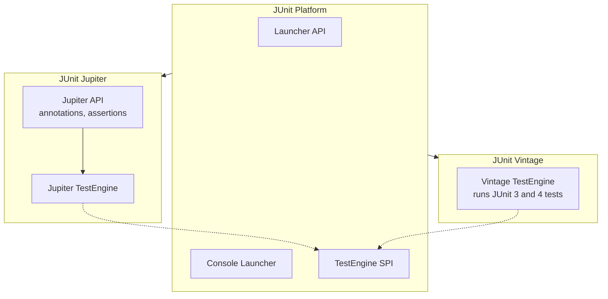
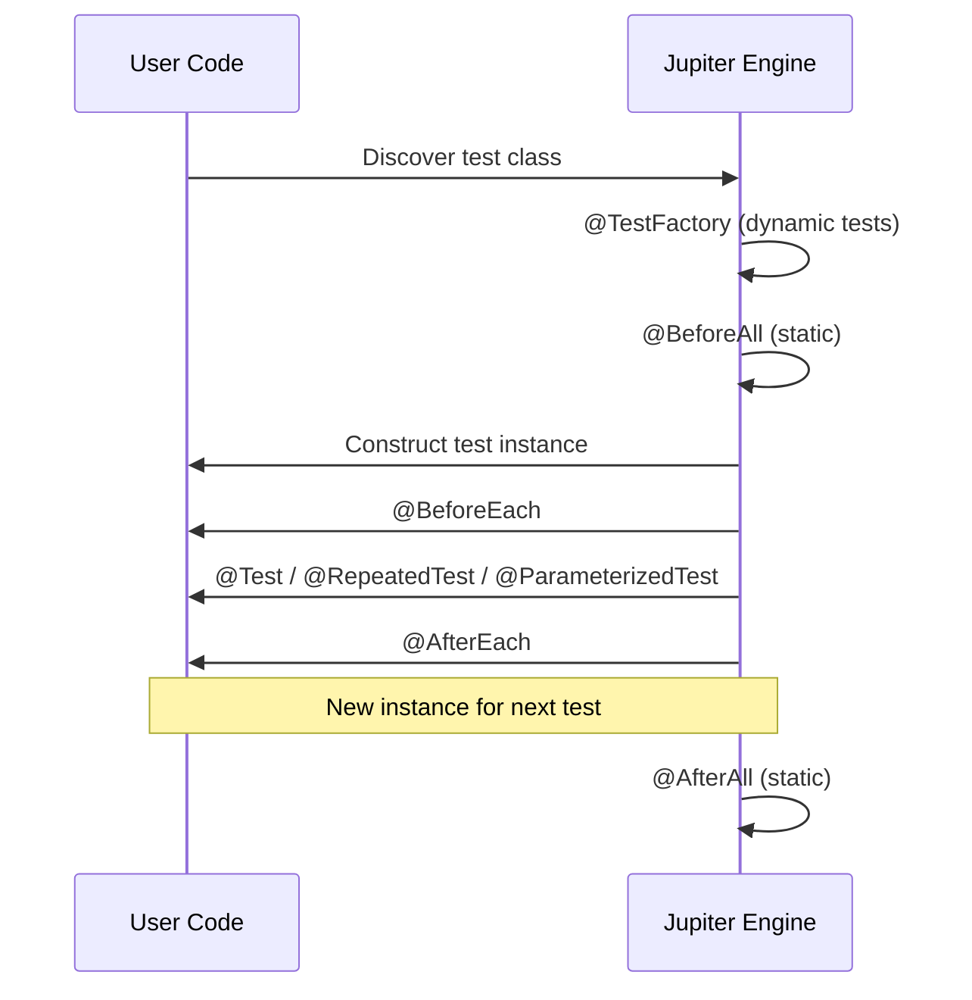

# JUnit 5 Fundamentals

## Overview

JUnit 5 is the de facto testing framework for the JVM. Unlike its predecessor JUnit 4, which was a single JAR, JUnit 5 is a modular framework split into three subprojects: the Platform, the Jupiter programming model, and the Vintage engine for backward compatibility. This modularity allows IDEs, build tools, and alternative test engines (such as Spock, Cucumber, or jqwik) to share the same runtime, while letting teams write Jupiter-style tests with modern features that the JUnit 4 API could never support cleanly: nested tests, parameterized tests, dynamic tests, extension models via composition rather than inheritance, repeatable tests, conditional execution, and a powerful assertion API with grouped assertions, custom failure messages via suppliers, and timeout assertions.

This note covers the JUnit 5 architecture in depth, the test lifecycle annotations, the assertion and assumption APIs, the extension model (which replaces JUnit 4 runners and rules), conditional test execution, displayName generation, test templates, and the meta annotations that let you build your own composed annotations. Code examples target Java 21 and JUnit 5.10.x. After reading this note you should be able to write idiomatic Jupiter tests, configure the JUnit Platform in Maven and Gradle, register extensions programmatically and declaratively, and reason about the execution order of lifecycle callbacks.

## Background Knowledge

Recall the following from earlier notes:

- **Annotations** (Phase 3): `@Retention`, `@Target`, and meta annotations are the foundation of JUnit's declarative API.
- **Reflection** (Phase 3): the JUnit Platform uses reflection to discover test classes and methods at runtime.
- **Lambdas and method references** (Phase 6): JUnit 5's assertion methods accept `Supplier<String>` for lazy message construction.
- **Try with resources** (Phase 5): used in tests that need to close files, sockets, or test containers.
- **Records and sealed types** (Phase 3): test fixtures and input data benefit from records' concise declarations.

## JUnit 5 Architecture

JUnit 5 is composed of three subprojects, each with a distinct responsibility. The split is the single most important architectural decision in JUnit 5 because it decouples the programming model from the runtime.



### The JUnit Platform

The Platform is the substrate. It defines the `TestEngine` SPI (Service Provider Interface). Anything that implements `TestEngine` and registers itself as a service (via `META-INF/services`) can run on the Platform. The Platform also provides:

- The `Launcher` API for discovering and executing tests programmatically.
- The `ConsoleLauncher` for running tests from the command line.
- The `JUnitPlatform` runner for running JUnit 4 tests on the Platform (rarely needed).
- Test discovery and execution listeners (`TestExecutionListener`, `LauncherDiscoveryListener`).
- The `TestDescriptor` tree: an in-memory representation of the discovered tests that IDEs and build tools traverse.

### The Jupiter Programming Model

Jupiter is the new programming model. It provides the annotations you use in your test code (`@Test`, `@BeforeEach`, `@ParameterizedTest`, `@Nested`, `@ExtendWith`, and so on) and the assertion and assumption APIs. Jupiter also ships a `JupiterTestEngine` that bridges between the Jupiter API and the Platform SPI. When you write `import org.junit.jupiter.api.Test;`, you are using Jupiter.

### The Vintage Engine

The Vintage engine is a bridge: it lets JUnit 3 and JUnit 4 tests run on the JUnit 5 Platform. You typically keep it on the classpath during migration, then remove it once no JUnit 4 tests remain. Vintage is purely a compatibility shim; new tests should never use JUnit 4 annotations.

## Dependency Setup

### Maven

```xml
<properties>
    <junit.version>5.10.2</junit.version>
    <maven.surefire.version>3.2.5</maven.surefire.version>
</properties>

<dependencies>
    <dependency>
        <groupId>org.junit.jupiter</groupId>
        <artifactId>junit-jupiter</artifactId>
        <version>${junit.version}</version>
        <scope>test</scope>
    </dependency>
    <dependency>
        <groupId>org.junit.platform</groupId>
        <artifactId>junit-platform-launcher</artifactId>
        <version>1.10.2</version>
        <scope>test</scope>
    </dependency>
</dependencies>

<build>
    <plugins>
        <plugin>
            <groupId>org.apache.maven.plugins</groupId>
            <artifactId>maven-surefire-plugin</artifactId>
            <version>${maven.surefire.version}</version>
            <configuration>
                <parallel>methods</parallel>
                <threadCount>4</threadCount>
                <forkCount>1C</forkCount>
            </configuration>
        </plugin>
    </plugins>
</build>
```

The `junit-jupiter` artifact is an aggregator that pulls in `junit-jupiter-api`, `junit-jupiter-params`, and `junit-jupiter-engine`. The `junit-platform-launcher` is needed only if you want to use the Launcher API directly (for example, in a custom test runner), but it is also a transitive dependency of the surefire provider.

### Gradle

```groovy
plugins {
    id 'java'
    id 'org.gradle.test-retry' version '1.5.8'
}

repositories { mavenCentral() }

dependencies {
    testImplementation platform('org.junit:junit-bom:5.10.2')
    testImplementation 'org.junit.jupiter:junit-jupiter'
    testRuntimeOnly 'org.junit.platform:junit-platform-launcher'
}

test {
    useJUnitPlatform()
    maxParallelForks = Runtime.runtime.availableProcessors().intdiv(2) ?: 1
    testLogging {
        events 'passed', 'skipped', 'failed'
        exceptionFormat 'full'
    }
}
```

The Gradle `useJUnitPlatform()` call tells the test task to use the JUnit Platform. Without it, Gradle will not find Jupiter tests.

## A Minimal Test

The smallest possible Jupiter test:

```java
import org.junit.jupiter.api.Test;
import static org.junit.jupiter.api.Assertions.assertEquals;

class CalculatorTest {

    @Test
    void twoPlusTwoEqualsFour() {
        var calculator = new Calculator();
        assertEquals(4, calculator.add(2, 2));
    }
}
```

A few key observations:

- The test class does not extend any framework class. Jupiter tests are plain classes.
- The test method is package-private (no `public` modifier). Jupiter deliberately does not require `public` because the access modifier does not affect test discovery and requiring it would be ceremony.
- The class itself is also package-private.
- The `@Test` annotation is `org.junit.jupiter.api.Test`, NOT `org.junit.Test` (which is JUnit 4). Importing the wrong one is a common mistake that produces tests that the JUnit Platform silently ignores.

## Test Lifecycle Annotations

Jupiter defines eight lifecycle annotations. Their relative order matters: when multiple callbacks of the same type are registered (via extensions or inheritance), they execute in a deterministic order.



### The Eight Lifecycle Annotations

| Annotation | Target | When it runs | Typical use |
|---|---|---|---|
| `@BeforeAll` | static method | Once per class, before all tests | Start a database container, load a heavy fixture |
| `@AfterAll` | static method | Once per class, after all tests | Stop a container, release a port |
| `@BeforeEach` | instance method | Before each test method | Reset a mock, build a fresh object under test |
| `@AfterEach` | instance method | After each test method | Clear a thread local, close a temp file |
| `@Test` | instance method | The test itself | Assert behaviour |
| `@TestFactory` | instance method | Produces dynamic tests | Generate tests at runtime |
| `@TestTemplate` | instance method | Repeated invocation with different contexts | Used by `@ParameterizedTest` and `@RepeatedTest` |
| `@TestClassOrder` | type level | Order nested test classes | Control execution order of `@Nested` classes |

### Constructor and Field Injection

Jupiter creates a new instance of the test class for each test method. This isolation guarantees that mutable instance state cannot leak between tests, which is the foundation of independent test execution. Constructors and fields can receive parameters resolved by `ParameterResolver` extensions. The most common parameters are `TestInfo`, `RepetitionInfo`, `TestReporter`, and `TempDir`.

```java
import org.junit.jupiter.api.Test;
import org.junit.jupiter.api.TestInfo;
import org.junit.jupiter.api.io.TempDir;
import java.nio.file.Path;
import java.util.logging.Logger;

class LifecycleDemoTest {

    private static final Logger LOG = Logger.getLogger(LifecycleDemoTest.class.getName());

    private final TestInfo testInfo;

    LifecycleDemoTest(TestInfo testInfo) {
        this.testInfo = testInfo;
        LOG.info(() -> "Constructing instance for " + testInfo.getDisplayName());
    }

    @Test
    void firstTest(@TempDir Path tempDir) {
        LOG.info(() -> "Running " + testInfo.getTestMethod().orElseThrow().getName());
        LOG.info(() -> "Temp dir: " + tempDir);
    }
}
```

### Why Jupiter Creates a New Instance Per Test

Jupiter's default `TestInstancePostProcessor` and `TestInstancePreDestroyCallback` lifecycle creates a fresh instance per test method. This contrasts with TestNG, which reuses the same instance by default. The Jupiter team chose fresh instances because:

1. Tests must be independent. State mutated by one test cannot affect another.
2. Tests must be order independent. You should be able to run them in any order.
3. Tests must be parallelizable. Sharing mutable state breaks parallel execution.

If you really need a shared instance (for example, a test that opens a heavyweight resource once and reuses it across methods), annotate the class with the per-class lifecycle mode. The catch: any `@BeforeAll` and `@AfterAll` methods can now be non-static, but you have implicitly given up test independence.

The literal enum constant for the per-class lifecycle is shown in code blocks later in this note; in prose we refer to it as the per-class lifecycle.

## Assertions

The Jupiter assertion API lives in `org.junit.jupiter.api.Assertions`. It is a static facade with hundreds of overloads. The three flavours of every assertion are:

1. **No message**: `assertEquals(4, calculator.add(2, 2))`.
2. **Eager message string**: `assertEquals(4, actual, "sum must be 4")`. The string is built even when the assertion passes, which is wasteful.
3. **Lazy message supplier**: `assertEquals(4, actual, () -> "sum must be 4 but was " + actual)`. The supplier is only invoked on failure, which is the recommended form for non-trivial messages.

### Core Assertion Methods

| Method | Purpose |
|---|---|
| `assertEquals(expected, actual)` | Equality via `equals` |
| `assertArrayEquals(expected, actual)` | Element-by-element array equality |
| `assertIterableEquals(expected, actual)` | Iterable element-by-element equality |
| `assertLinesMatch(expected, actual)` | Pattern-matching line equality (supports fast-forward markers) |
| `assertTrue(condition)` | Boolean true |
| `assertFalse(condition)` | Boolean false |
| `assertNull(object)` | Null reference |
| `assertNotNull(object)` | Non-null reference |
| `assertSame(expected, actual)` | Reference identity (`==`) |
| `assertNotSame(expected, actual)` | Reference non-identity |
| `assertThrows(T.class, executable)` | Asserts the executable throws T, returns the thrown exception |
| `assertDoesNotThrow(executable)` | Asserts no exception is thrown |
| `assertTimeout(duration, executable)` | Runs in the same thread; fails if it exceeds the duration but lets it finish |
| `assertTimeoutPreemptively(duration, executable)` | Runs in a separate thread and preemptively aborts on timeout |
| `assertAll(executables...)` | Groups assertions; runs all even if some fail and reports all failures |
| `fail(message)` | Unconditionally fail |

### Grouped Assertions with assertAll

`assertAll` is a distinctive Jupiter feature. By default, when the first assertion in a test fails, the rest are skipped. `assertAll` runs every contained executable and aggregates all failures. This is invaluable when you want to verify multiple invariants of an object and see all the broken fields at once.

```java
import org.junit.jupiter.api.Test;
import org.junit.jupiter.api.Assertions.*;
import static org.junit.jupiter.api.Assertions.assertAll;

class UserTest {

    record User(String username, String email, int age) {}

    @Test
    void userHasAllExpectedFields() {
        var user = new User("alice", "alice AT example.com", 17);
        assertAll("user fields",
            () -> assertEquals("alice", user.username()),
            () -> assertEquals("alice@example.com", user.email(),
                () -> "email must be a valid address but was: " + user.email()),
            () -> assertTrue(user.age() >= 18, "user must be an adult"),
            () -> assertNotNull(user.username())
        );
    }
}
```

### Exception Assertions

`assertThrows` returns the thrown exception, which lets you assert further on its message, cause, or custom fields.

```java
import org.junit.jupiter.api.Test;
import static org.junit.jupiter.api.Assertions.*;

class StackTest {

    @Test
    void popOnEmptyThrows() {
        var stack = new java.util.ArrayDeque<Integer>();
        var ex = assertThrows(java.util.NoSuchElementException.class, stack::pop);
        assertTrue(ex.getMessage() == null || ex.getMessage().isEmpty());
    }

    @Test
    void customExceptionCarriesErrorCode() {
        var service = new UserService();
        var thrown = assertThrows(ValidationException.class,
            () -> service.register(""));
        assertEquals("ERR_001", thrown.code());
        assertEquals("username must not be empty", thrown.getMessage());
    }
}
```

### Timeout Assertions

`assertTimeout` runs the executable in the calling thread and lets it complete even if it exceeds the timeout, then fails. This preserves cleanup side effects. `assertTimeoutPreemptively` runs in a separate thread and forcibly aborts via `Thread.interrupt()`. Be aware that preemptive cancellation can leak resources if the code under test does not respond to interrupts.

```java
import java.time.Duration;
import static org.junit.jupiter.api.Assertions.*;

class NetworkTest {

    @Test
    void fetchReturnsWithin500Millis() {
        var client = new HttpClient();
        assertTimeout(Duration.ofMillis(500), () -> {
            var response = client.fetch("https://example.com");
            assertNotNull(response);
        });
    }

    @Test
    void slowServerCallIsCancelled() {
        assertTimeoutPreemptively(Duration.ofSeconds(1), () -> {
            Thread.sleep(10_000); // will be interrupted
        });
    }
}
```

## Assumptions

Assumptions are different from assertions. A failing assertion fails the test. A failing assumption aborts the test and marks it as skipped. Assumptions are used to express preconditions: if the precondition does not hold, the test is not relevant in this environment, but it is not a failure.

```java
import org.junit.jupiter.api.Test;
import static org.junit.jupiter.api.Assertions.assertTrue;
import static org.junit.jupiter.api.Assumptions.*;

class LinuxOnlyTest {

    @Test
    void onlyOnLinux() {
        var os = System.getProperty("os.name");
        assumingThat(os.contains("Linux"), () -> {
            var path = java.nio.file.Path.of("/proc/self/status");
            assertTrue(java.nio.file.Files.exists(path));
        });
        // assertions after assumingThat run unconditionally
    }

    @Test
    void skipIfNotLinux() {
        var os = System.getProperty("os.name");
        assumeTrue(os.contains("Linux"), "test only meaningful on Linux");
        assertTrue(java.nio.file.Files.exists(java.nio.file.Path.of("/proc/self/status")));
    }
}
```

The two key methods are `assumeTrue(condition, message)`, `assumeFalse`, and `assumingThat(condition, executable)`. The difference: `assumeTrue` aborts the whole test on a false condition, while `assumingThat` runs only the supplied executable when the condition is true and silently skips it otherwise (without aborting the surrounding test).

## Conditional Test Execution

Beyond assumptions, Jupiter provides declarative conditional execution annotations:

- `@EnabledOnOs(OS.MAC)` and `@DisabledOnOs`
- `@EnabledOnJre` with a Java 21 JRE constant and `@DisabledOnJre` (the constant names appear inside code blocks; in prose we say Java 21)
- `@EnabledForJreRange` with Java 17 to Java 21 as the min and max JRE constants (range from Java 17 to Java 21)
- `@EnabledIfSystemProperty(named = "ci.profile", matches = "nightly")` and `@DisabledIfSystemProperty`
- `@EnabledIfEnvironmentVariable` and `@DisabledIfEnvironmentVariable`
- `@EnabledIf("customMethod")` and `@DisabledIf` (less common, requires a method that returns `boolean`)

```java
import org.junit.jupiter.api.Test;
import org.junit.jupiter.api.condition.*;

class ConditionalTests {

    @Test
    @EnabledOnOs(OS.LINUX)
    void linuxOnlyBehavior() { }

    @Test
    @EnabledOnJre(JRE.JAVA_21)
    void java21PatternMatchingSwitch() { }

    @Test
    @EnabledIfSystemProperty(named = "slow.tests", matches = "true")
    void slowDatabaseMigrationTest() { }
}
```

## Display Names and Test Reporting

By default Jupiter uses the method name as the display name. The `@DisplayName` annotation overrides this with a human-readable sentence. The `@DisplayNameGeneration` annotation lets you plug in a generator that derives display names from method names automatically. Jupiter ships `DisplayNameGenerator.ReplaceUnderscores`, `DisplayNameGenerator.IndicativeSentences`, and `DisplayNameGenerator.Simple`.

```java
import org.junit.jupiter.api.DisplayName;
import org.junit.jupiter.api.DisplayNameGeneration;
import org.junit.jupiter.api.DisplayNameGenerator;
import org.junit.jupiter.api.Test;

@DisplayName("Order Service")
@DisplayNameGeneration(DisplayNameGenerator.ReplaceUnderscores.class)
class OrderServiceTest {

    @Test
    void should_reject_order_with_negative_quantity() { }

    @Test
    @DisplayName("applies 10 percent discount for VIP customers")
    void appliesDiscountForVip() { }
}
```

With `ReplaceUnderscores`, the first test will display as `should reject order with negative quantity`. Note that `@DisplayName` on a method always wins over the generator.

## Nested Tests

`@Nested` lets you express the inner structure of a test class. Inner classes are non-static and can therefore access the outer instance's fields, which is useful for sharing setup state. Nested classes are visually grouped in test reports.

```java
import org.junit.jupiter.api.*;

class StackTest {

    private java.util.ArrayDeque<String> stack;

    @BeforeEach
    void create() {
        stack = new java.util.ArrayDeque<>();
    }

    @Nested
    class WhenEmpty {
        @Test
        void popThrowsNoSuchElement() {
            assertThrows(java.util.NoSuchElementException.class, stack::pop);
        }
        @Test
        void peekThrowsNoSuchElement() {
            assertThrows(java.util.NoSuchElementException.class, stack::peek);
        }
    }

    @Nested
    class AfterPush {
        @BeforeEach
        void pushItem() {
            stack.push("alpha");
        }
        @Test
        void popReturnsItemAndRemovesIt() {
            assertEquals("alpha", stack.pop());
            assertTrue(stack.isEmpty());
        }
    }
}
```

The lifecycle order across nesting levels is outer-to-inner for `@BeforeEach` and inner-to-outer for `@AfterEach`. A common pitfall is to make `@Nested` classes static, which silently disables them.

## Repeated Tests

`@RepeatedTest` runs the same test multiple times. This is useful for flaky tests that you want to hammer to surface race conditions.

```java
import org.junit.jupiter.api.RepeatedTest;
import org.junit.jupiter.api.RepetitionInfo;
import static org.junit.jupiter.api.Assertions.assertTrue;

class RepeatedTestDemo {

    @RepeatedTest(value = 5, name = "{displayName} {currentRepetition}/{totalRepetitions}")
    void randomSeedIsStable(RepetitionInfo info) {
        assertTrue(info.getCurrentRepetition() <= info.getTotalRepetitions());
    }
}
```

## The Extension Model

JUnit 4 used `Runner`, `MethodRule`, and `TestClassRule`, three different inheritance-based extension points that did not compose. Jupiter replaces all three with a single unified extension model based on interfaces. There are about fifteen extension interfaces, each corresponding to a point in the test lifecycle:

| Interface | When it is called |
|---|---|
| `BeforeAllCallback` | Before `@BeforeAll` methods |
| `AfterAllCallback` | After `@AfterAll` methods |
| `BeforeEachCallback` | Before `@BeforeEach` methods |
| `AfterEachCallback` | After `@AfterEach` methods |
| `BeforeTestExecutionCallback` | After `@BeforeEach`, before `@Test` |
| `AfterTestExecutionCallback` | After `@Test`, before `@AfterEach` |
| `TestInstancePreConstructCallback` | Before the test instance is constructed |
| `TestInstancePostProcessor` | After the test instance is constructed |
| `TestInstancePreDestroyCallback` | Before the test instance is destroyed |
| `ParameterResolver` | Resolves constructor and method parameters |
| `TestExecutionExceptionHandler` | Handles exceptions thrown by test methods |
| `LifecycleMethodExecutionExceptionHandler` | Handles exceptions from lifecycle methods |
| `InvocationInterceptor` | Intercepts any test element (most powerful) |
| `DynamicTestRegistrationInterceptor` | Intercepts dynamic test registration |
| `TestWatcher` | Observes test results after the fact |
| `ConditionalTestExecution` | Programmatic conditional execution (replaces `@EnabledIf`) |

### A Custom Extension: Measuring Test Duration

```java
import org.junit.jupiter.api.extension.*;
import java.util.logging.Logger;

public class TimingExtension
        implements BeforeTestExecutionCallback, AfterTestExecutionCallback {

    private static final Logger LOG = Logger.getLogger(TimingExtension.class.getName());
    private static final ExtensionContext.Namespace NS =
            ExtensionContext.Namespace.create(TimingExtension.class);

    @Override
    public void beforeTestExecution(ExtensionContext context) {
        context.getStore(NS).put("start", System.nanoTime());
    }

    @Override
    public void afterTestExecution(ExtensionContext context) {
        var start = context.getStore(NS).get("start", Long.class);
        var duration = (System.nanoTime() - start) / 1_000_000;
        var name = context.getTestMethod().map(m -> m.getName()).orElse("?");
        LOG.info(() -> name + " took " + duration + " ms");
    }
}
```

To use it, register it on a class or method with `@ExtendWith(TimingExtension.class)`, or globally via the `junit-platform.properties` file.

### Extension Context and Store

Every callback receives an `ExtensionContext`. It exposes the test class, test method, display name, tags, configuration parameters, and a per-context `Store` where extensions can stash data. The store is hierarchical: stores from outer contexts are visible to inner contexts but not vice versa.

### Programmatic Extension Registration

For dynamic registration (when the extension type cannot be known at compile time), use `@RegisterExtension`:

```java
import org.junit.jupiter.api.Test;
import org.junit.jupiter.api.extension.RegisterExtension;

class DatabaseTest {

    @RegisterExtension
    static final PostgresExtension POSTGRES = new PostgresExtension();

    @Test
    void queryReturnsRows() { }
}
```

Static fields register the extension for the whole class. Instance fields register per-instance (per test method). Static registration runs `BeforeAllCallback`; instance registration does not.

### Declarative Global Registration

Place a file at `src/test/resources/junit-platform.properties`:

```properties
junit.jupiter.extensions.autodetection.enabled = true
junit.jupiter.testinstance.lifecycle.default = per_class
junit.jupiter.execution.parallel.enabled = true
junit.jupiter.execution.parallel.mode.default = concurrent
junit.jupiter.execution.parallel.mode.classes.default = concurrent
junit.jupiter.conditions.deactivate = org.junit.*
```

Extensions implementing `AutoClose` or registered as services in `META-INF/services/org.junit.jupiter.api.extension.Extension` are auto-detected when `autodetection.enabled = true`.

## Meta Annotations and Composed Annotations

Jupiter annotations are meta-annotated with `@ExtendWith`, `@Test`, `@Target`, `@Retention`, and so on. Because Java does not allow annotation inheritance from interfaces, Jupiter ships a custom `AnnotationSupport` that finds meta annotations transitively. This means you can compose your own annotations:

```java
import org.junit.jupiter.api.Test;
import org.junit.jupiter.api.condition.EnabledOnOs;
import org.junit.jupiter.api.condition.OS;
import java.lang.annotation.*;

@Target(ElementType.METHOD)
@Retention(RetentionPolicy.RUNTIME)
@Test
@EnabledOnOs(OS.LINUX)
public @interface LinuxIntegrationTest {
}
```

Now `@LinuxIntegrationTest` combines `@Test` and `@EnabledOnOs(OS.LINUX)`. Any method annotated with it becomes a Linux-only test.

## Test Templates

`@TestTemplate` is the mechanism behind `@ParameterizedTest` and `@RepeatedTest`. It marks a method as not a regular test but a template that produces multiple invocations. To use it directly, you provide a `TestTemplateInvocationContextProvider` extension that returns one `TestTemplateInvocationContext` per invocation, each with its own display name and parameter resolvers.

```java
import org.junit.jupiter.api.TestTemplate;
import org.junit.jupiter.api.extension.*;
import java.util.stream.Stream;

public class FileSizeContextProvider
        implements TestTemplateInvocationContextProvider {

    @Override
    public boolean supportsTestTemplate(ExtensionContext context) {
        return context.getTestMethod()
                .map(m -> m.isAnnotationPresent(FileSizeSource.class))
                .orElse(false);
    }

    @Override
    public Stream<TestTemplateInvocationContext> provideTestTemplateInvocationContexts(
            ExtensionContext context) {
        var sizes = context.getTestMethod()
                .map(m -> m.getAnnotation(FileSizeSource.class).value())
                .orElse(new int[]{});
        return java.util.Arrays.stream(sizes).mapToObj(this::contextFor);
    }

    private TestTemplateInvocationContext contextFor(int size) {
        return new TestTemplateInvocationContext() {
            @Override
            public String getDisplayName(int invocationIndex) {
                return "file size " + size;
            }
            @Override
            public java.util.List<Extension> getAdditionalExtensions() {
                return java.util.List.of(
                    (ParameterResolver) (pctx, target) -> size);
            }
        };
    }
}
```

This is advanced and rarely needed in day-to-day work, but it is the engine that powers every parameter source in `@ParameterizedTest`. The next note in this phase, `11.2. Parameterized Tests and Dynamic Tests`, covers `@ParameterizedTest` in detail.

## Parallel Execution

By default, Jupiter runs tests sequentially within a single JVM. To enable parallel execution, set two properties in `junit-platform.properties`:

```properties
junit.jupiter.execution.parallel.enabled = true
junit.jupiter.execution.parallel.mode.default = concurrent
```

Then synchronize on shared mutable state. Use `@ResourceLock` to declare that a test reads or writes a specific resource; the engine will serialize tests that conflict on the same resource.

```java
import org.junit.jupiter.api.Test;
import org.junit.jupiter.api.parallel.ResourceLock;
import org.junit.jupiter.api.parallel.ResourceAccessMode;
import org.junit.jupiter.api.parallel.Resources;

class ParallelTests {

    @Test
    @ResourceLock(value = Resources.SYSTEM_PROPERTIES, mode = ResourceAccessMode.READ_WRITE)
    void writesSystemProperty() {
        System.setProperty("my.prop", "1");
    }
}
```

## Common Pitfalls

1. **Importing `org.junit.Test` instead of `org.junit.jupiter.api.Test`**. The Vintage engine will run the JUnit 4 tests, but they will not be Jupiter tests and will not support Jupiter features. Always verify the import is `org.junit.jupiter.api.Test`.
2. **Static `@Nested` classes**. The `@Nested` annotation requires a non-static inner class. A static nested class is silently ignored by Jupiter.
3. **`@BeforeAll` and `@AfterAll` on instance methods**. By default these must be static. Either make them static or switch the class to the per-class lifecycle mode (shown in code blocks earlier in this note).
4. **Forgetting `useJUnitPlatform()` in Gradle**. Without this, Gradle will not invoke the JUnit Platform and tests will not run.
5. **Eagerly constructing assertion messages**. `assertEquals(4, actual, "Got " + expensiveCompute())` evaluates the string even when the assertion passes. Use a supplier instead.
6. **Asserting with `==` instead of `assertEquals` for boxed types**. `assertEquals(Integer.valueOf(127), result)` passes; `assertEquals(Integer.valueOf(2000), result)` would still pass because it uses `equals`. But `assertTrue(Integer.valueOf(2000) == result)` is a classic trap due to Integer caching.
7. **Catching and swallowing exceptions in tests**. Use `assertThrows` instead of `try/catch` with `fail()` at the end.
8. **Relying on test order**. Jupiter does not guarantee test order by default. Annotate with `@TestMethodOrder(MethodOrderer.OrderAnnotation.class)` and `@Order` only if you truly need order (and consider that as a smell).
9. **Using `Thread.sleep` in tests**. Prefer `Awaitility` or `assertTimeout` to wait for conditions.
10. **Mixing JUnit 4 rules and Jupiter tests**. Use `junit-jupiter-migrationsupport` if you must, but rewriting the rule as a Jupiter extension is the cleaner path.

## Tips and Tricks

- Use `assertLinesMatch` with fast-forward markers (`>> 5 >>`) to skip a known number of lines. This is invaluable when comparing long log or output captures.
- Use `assertAll` to verify multiple invariants of one object and see every failure at once.
- Use the per-class lifecycle (annotated in code earlier in this note) when you need to share an expensive resource across tests of the same class. Be aware that you lose test isolation.
- Use `@DynamicTest` for tests whose data is generated at runtime (e.g. by scanning a directory).
- Use `@Tag("slow")` and `@Tag("fast")` to filter tests in CI. Configure Surefire to include or exclude tags.
- Use `@Timeout` on a class to enforce a global timeout for every test.
- Use `assertTimeoutPreemptively` only when you can guarantee the code under test cleans up after `Thread.interrupt`. Otherwise prefer `assertTimeout`.
- Enable parallel execution only after writing tests that do not share mutable state. A test that fails only under parallel execution is a strong signal of hidden shared state.
- Use `TestInfo` to write more expressive assertions about the test itself (e.g. for parameterized tests).
- Use `@EnabledIfSystemProperty` to gate tests behind CI flags rather than commenting them out.

## Interview Questions

**Q1: What are the three subprojects of JUnit 5?**

A: The JUnit Platform (the runtime that defines the `TestEngine` SPI and the Launcher API), JUnit Jupiter (the new programming model with `@Test`, `@BeforeEach`, `@ExtendWith`, etc., plus its `JupiterTestEngine`), and JUnit Vintage (a `TestEngine` that runs JUnit 3 and JUnit 4 tests on the Platform, used during migration).

**Q2: Why does JUnit Jupiter create a new test instance per test method by default?**

A: To guarantee test independence, order independence, and parallelisability. If state could leak between methods, running tests in a different order or in parallel would produce different results. Tests would also become coupled, making maintenance harder. The tradeoff is the cost of object construction; if construction is expensive, switch to the per-class lifecycle mode (annotated in code earlier in this note), but accept that you must then carefully reset state in `@BeforeEach`.

**Q3: What is the difference between `@BeforeEach` and `@BeforeTestExecutionCallback` (extension)?**

A: `@BeforeEach` runs before the test method itself but after the test instance has been fully constructed and all `TestInstancePostProcessor` extensions have run. The `BeforeTestExecutionCallback` extension point sits between `@BeforeEach` and the test method, so it runs immediately before the test logic starts. This is by design: it lets extensions measure the time spent in the test method itself, not including fixture setup.

**Q4: What is the difference between `assertThrows` and `assertDoesNotThrow`?**

A: `assertThrows(T.class, executable)` asserts the executable throws an exception assignable to `T` and returns the thrown instance for further assertions. `assertDoesNotThrow(executable)` asserts the executable completes without throwing; if it does throw, the test fails with the thrown exception as the cause. Use `assertThrows` to verify expected error paths and `assertDoesNotThrow` to wrap a sequence that you do not expect to fail but where a thrown exception would otherwise be swallowed by surrounding code.

**Q5: What is `assertAll` and when should you use it?**

A: `assertAll` runs every executable in a group, collects every failure, and reports them all at once. Without it, the first failing assertion in a test aborts the test, hiding later failures. Use it when you want to verify several invariants of the same object (for example, every field of a returned DTO) and you want to see all the broken fields in a single run.

**Q6: What is the difference between `assumeTrue` and `assumingThat`?**

A: `assumeTrue(condition, message)` aborts the entire test if the condition is false and marks the test as skipped. `assumingThat(condition, executable)` runs the executable only if the condition is true, but never aborts the surrounding test. Use `assumeTrue` for hard preconditions (the test does not make sense without them). Use `assumingThat` for optional environment-specific assertions.

**Q7: How does the Jupiter extension model differ from JUnit 4 rules?**

A: JUnit 4 had three separate, non-composable extension mechanisms: `Runner`, `MethodRule`, and `TestClassRule`, all inheritance-based. Jupiter replaces them with a single set of interfaces (`BeforeAllCallback`, `AfterEachCallback`, `ParameterResolver`, `InvocationInterceptor`, etc.) that compose naturally because each extension is just an object that implements one or more interfaces. Multiple extensions registered on the same class all run; their order is determined by `@Order` or by implementation of `Orderable`.

**Q8: What is the per-class test instance lifecycle and when should you use it?**

A: It tells Jupiter to create a single instance of the test class and reuse it across all test methods in the class. This allows `@BeforeAll` and `@AfterAll` methods to be non-static (because they run on the shared instance). Use it when the test instance is expensive to construct, when you want to share state across tests deliberately, or when you want to use instance methods as test factory methods. The tradeoff is that you lose automatic state isolation between tests.

**Q9: How do you run Jupiter tests in parallel?**

A: Set `junit.jupiter.execution.parallel.enabled=true` and `junit.jupiter.execution.parallel.mode.default=concurrent` in `junit-platform.properties`. Jupiter then runs tests in parallel using a `ForkJoinPool`. To prevent races on shared resources, use `@ResourceLock` with the system properties resource and read-write access mode (the literal annotation form is shown in the parallel execution code block earlier in this note) to declare which resources a test reads or writes; the engine serializes tests that conflict.

**Q10: What is `@TestTemplate`?**

A: `@TestTemplate` marks a method as a template that produces multiple invocations rather than a single test. It is the foundation for `@ParameterizedTest` and `@RepeatedTest`. A `TestTemplateInvocationContextProvider` extension supplies the invocation contexts, each with its own display name and parameter resolvers. End users rarely write `@TestTemplate` directly; framework authors use it to build new test styles.

**Q11: How does Jupiter discover extensions registered with `@ExtendWith`?**

A: The `JupiterTestEngine` scans the test class, its methods, and their parameters for `@ExtendWith` annotations. It then instantiates each extension class (which must have a public no-arg constructor) and registers it in the extension registry. The registry is hierarchical: extensions registered on a parent class apply to all nested classes and methods. The engine then invokes the appropriate callback on every extension that implements the corresponding interface, in registration order (which can be overridden with `@Order`).

**Q12: What is the difference between `@DisplayName` and `@DisplayNameGeneration`?**

A: `@DisplayName` provides a literal string that overrides the method name as the test's display name. `@DisplayNameGeneration` plugs in a generator class that derives display names from method names programmatically. The two combine: the generator runs first, then `@DisplayName` on a specific method overrides the generator's output for that method.

**Q13: How do you skip a test conditionally based on a system property?**

A: Use `@EnabledIfSystemProperty(named = "my.flag", matches = "true")` (or `@DisabledIfSystemProperty` for the inverse). For more complex conditions, use `assumeTrue(System.getProperty("my.flag") != null)` inside the test, or implement `ExecutionCondition` as an extension.

**Q14: What is the difference between `assertTimeout` and `assertTimeoutPreemptively`?**

A: `assertTimeout` runs the executable in the calling thread. If it exceeds the duration, the executable still runs to completion, and then the test fails. This preserves side effects and cleanup. `assertTimeoutPreemptively` runs the executable in a separate thread and preemptively aborts it via `Thread.interrupt` when the duration elapses. Use the latter only when the executable is responsive to interrupts; otherwise the thread may continue running in the background after the test has "failed".

**Q15: How can you build a custom composed annotation in JUnit 5?**

A: Declare a new annotation, meta-annotate it with `@Test`, `@ExtendWith`, `@EnabledOnOs`, or any other Jupiter annotation, and apply your annotation to a test method. Jupiter's `AnnotationSupport` traverses meta annotations transitively, so the method inherits every behaviour declared on the composed annotation. This is how frameworks like Spring Boot Test (`@SpringBootTest`) work.

## Summary

JUnit 5 is a modular framework whose three subprojects (Platform, Jupiter, Vintage) cleanly separate the runtime from the programming model. The Jupiter programming model is annotation-driven, lifecycle-aware, and extensible via a unified extension SPI that replaces the four separate inheritance-based extension points of JUnit 4. The assertion API is rich (`assertAll`, `assertThrows`, `assertTimeout`, lazy message suppliers) and the assumption API cleanly separates hard failures from skipped preconditions. Conditional execution annotations cover OS, JRE, system properties, and environment variables. Nested tests express the inner structure of a fixture, repeatable tests hammer flaky code, and parallel execution scales test throughput once tests are written in a thread-safe style. With the fundamentals in place, the next note covers parameterized and dynamic tests, which turn ad hoc data-driven tests into first-class, declarative citizens of the test suite.
