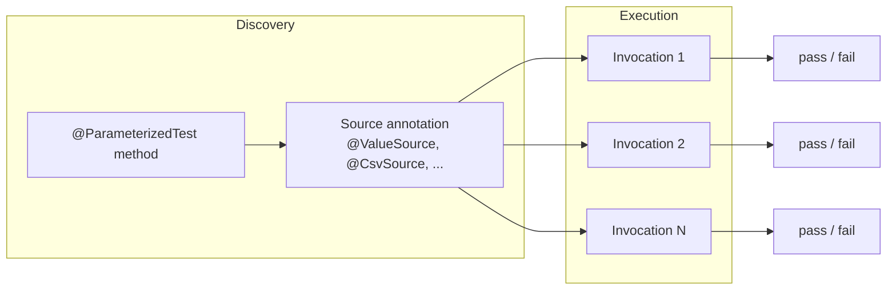
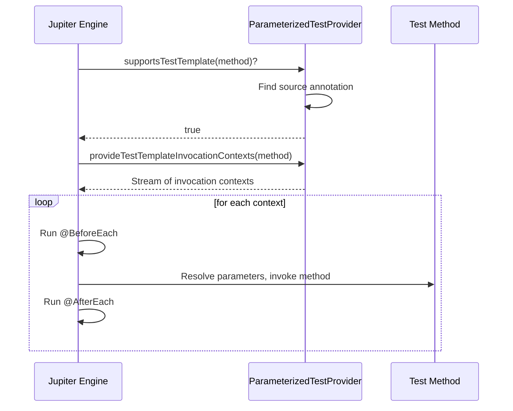
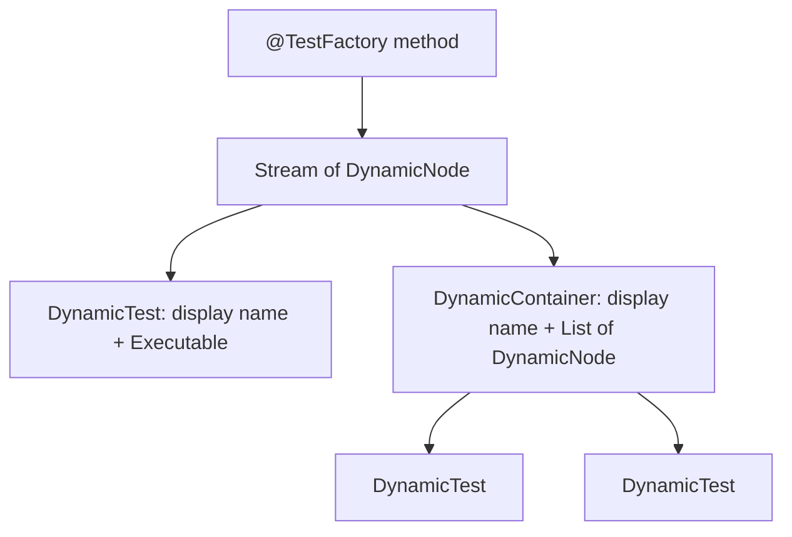

# Parameterized Tests and Dynamic Tests

## Overview

Plain `@Test` methods are great for one-off assertions, but most production code has dozens of edge cases that should exercise the same logic with different inputs. Copy-pasting a test method twenty times produces brittle, noisy tests and misses the underlying truth that you really want to express: for every input in a dataset, the system under test must produce the corresponding output. JUnit 5 exposes two complementary mechanisms for this. The first is `@ParameterizedTest`, which is a declarative annotation that runs the same test method once per row of a data source. The second is dynamic tests via `@TestFactory`, which is an imperative API that produces test instances at runtime, allowing the test set to be built from arbitrary Java code (database queries, directory scans, REST responses, generators, property-based testing strategies).

This note covers both mechanisms exhaustively. For `@ParameterizedTest`, we walk through every built-in source annotation (`@ValueSource`, `@EnumSource`, `@MethodSource`, `@CsvSource`, `@CsvFileSource`, `@ArgumentsSource`, `@EmptySource`, `@NullSource`, `@NullAndEmptySource`), argument conversion and explicit converters, argument aggregators, named arguments for readable display names, the `ParameterizedTestInvocationContext`, and the `junit-platform.properties` knobs that govern display name patterns and parallel execution. For dynamic tests, we cover the `DynamicTest` factory API, the `DynamicContainer` for grouping, the lifecycle gap (no `@BeforeEach` for individual dynamic tests), and how to bridge that gap with a custom extension or a helper method. We then look at property-based testing with `jqwik` and quickcheck-style generators running on the JUnit Platform, plus a worked example of a CSV-driven test for a tax calculator that you can lift verbatim into your own codebase.

## Background Knowledge

Recall the following from earlier notes:

- **JUnit 5 architecture** (previous note): `@ParameterizedTest` is implemented as a `@TestTemplate` plus a `TestTemplateInvocationContextProvider` extension shipped in `junit-jupiter-params`.
- **Records** (Phase 3): ideal carriers for parameterized test rows because they provide structural equality, concise constructors, and component accessors.
- **Streams** (Phase 6): `@MethodSource` returns a `Stream` of `Arguments`; understanding stream laziness is essential when the source queries a database.
- **Text blocks** (Phase 3): great for inlining CSV data without escaping.
- **Sealed types and pattern matching** (Phase 3): combine with `@EnumSource` to exhaustively cover every constant of a sealed type.

## Dependency Setup

The `junit-jupiter` aggregator already includes `junit-jupiter-params`, but if you depend only on `junit-jupiter-api` you must add `params` explicitly.

```xml
<dependency>
    <groupId>org.junit.jupiter</groupId>
    <artifactId>junit-jupiter-params</artifactId>
    <version>5.10.2</version>
    <scope>test</scope>
</dependency>
```

```groovy
testImplementation 'org.junit.jupiter:junit-jupiter-params:5.10.2'
```

## Parameterized Tests: The Mental Model



A `@ParameterizedTest` method is a template. The Jupiter engine asks each registered `TestTemplateInvocationContextProvider` whether it supports the method. The parameterized test provider checks for any of the source annotations. If found, it returns one `TestTemplateInvocationContext` per row of data. Each context has its own display name, its own `ParameterResolver` that supplies the row's arguments to the method, and its own lifecycle callbacks (a fresh `@BeforeEach` runs before every invocation).



## Source Annotations

### ValueSource

The simplest source. It supplies an array of literals of a single type: `String`, `int`, `long`, `double`, `float`, `boolean`, `char`, or `Class`.

```java
import org.junit.jupiter.params.ParameterizedTest;
import org.junit.jupiter.params.provider.ValueSource;
import static org.junit.jupiter.api.Assertions.*;

class StringUtilsTest {

    @ParameterizedTest
    @ValueSource(strings = {"", "  ", "a", "ab", "abc"})
    void isNotBlankReturnsFalseForBlankOrShort(String input) {
        assertFalse(StringUtils.isNotBlank(input) && input.trim().length() > 3);
    }

    @ParameterizedTest
    @ValueSource(ints = {0, 1, 2, 3, 5, 8, 13})
    void fibonacciReturnsPositiveForSeed(int n) {
        assertTrue(Fibonacci.compute(n) >= 0);
    }

    @ParameterizedTest
    @ValueSource(classes = {String.class, Integer.class, java.util.List.class})
    void classHasSimpleName(Class<?> type) {
        assertNotNull(type.getSimpleName());
    }
}
```

`@ValueSource` is convenient but limited: it can only supply one argument per invocation. For multi-argument tests you need `@CsvSource`, `@MethodSource`, or `@ArgumentsSource`.

### Null and Empty Sources

`@NullSource` adds a single `null` argument. `@EmptySource` adds an empty value of the appropriate type (empty `String`, empty array, empty `List`, empty `Map`, etc.). `@NullAndEmptySource` is a shorthand for both. These are typically combined with `@ValueSource`:

```java
import org.junit.jupiter.params.ParameterizedTest;
import org.junit.jupiter.params.provider.NullAndEmptySource;
import org.junit.jupiter.params.provider.ValueSource;
import static org.junit.jupiter.api.Assertions.assertTrue;

class IsBlankTest {

    @ParameterizedTest
    @NullAndEmptySource
    @ValueSource(strings = {"  ", "\t", "\n"})
    void isBlankReturnsTrueForNullOrWhitespace(String input) {
        assertTrue(StringUtils.isBlank(input));
    }
}
```

The combination produces four invocations: `null`, `""`, `"  "`, `"\t"`, `"\n"`. The order is null first, then empty, then the value source entries.

### EnumSource

`@EnumSource` supplies every constant of an enum, with optional filtering by name pattern and explicit inclusion or exclusion lists.

```java
import org.junit.jupiter.params.ParameterizedTest;
import org.junit.jupiter.params.provider.EnumSource;
import org.junit.jupiter.params.provider.EnumSource.Mode;
import static org.junit.jupiter.api.Assertions.*;

class TimeUnitTest {

    enum Mode { READ, WRITE, APPEND, DELETE }

    @ParameterizedTest
    @EnumSource(Mode.class)
    void everyModeConvertsToString(Mode mode) {
        assertNotNull(mode.toString());
    }

    @ParameterizedTest
    @EnumSource(value = Mode.class, names = {"READ", "WRITE"})
    void safeModesDoNotRequireLock(Mode mode) {
        assertFalse(Mode.requiresLock(mode));
    }

    @ParameterizedTest
    @EnumSource(value = Mode.class, mode = Mode.EXCLUDE, names = {"DELETE"})
    void nonDeleteModesAreSafe(Mode mode) {
        assertNotEquals(Mode.DELETE, mode);
    }

    @ParameterizedTest
    @EnumSource(value = Mode.class, mode = Mode.MATCH_ALL, names = "^[A-Z]+$")
    void allModeNamesAreUppercase(Mode mode) {
        assertTrue(mode.name().matches("^[A-Z]+$"));
    }
}
```

The `Mode` enum here has four constants; the match-all mode applies the regex to the constant name and keeps only those that match.

### MethodSource

The most flexible source. It references a static method (or, under the per-class lifecycle, an instance method) that returns a `Stream`, `Iterable`, `Iterator`, or array of `Arguments`. Each `Arguments` instance carries the parameters for one invocation.

```java
import org.junit.jupiter.params.ParameterizedTest;
import org.junit.jupiter.params.provider.Arguments;
import org.junit.jupiter.params.provider.MethodSource;
import java.util.stream.Stream;
import static org.junit.jupiter.api.Assertions.assertEquals;

class TaxCalculatorTest {

    record Bracket(int lower, int upper, double rate) {}

    static Stream<Arguments> brackets() {
        return Stream.of(
            Arguments.of(0, 10_000, 0.10),
            Arguments.of(10_001, 50_000, 0.20),
            Arguments.of(50_001, 200_000, 0.30),
            Arguments.of(200_001, Integer.MAX_VALUE, 0.40)
        );
    }

    @ParameterizedTest
    @MethodSource("brackets")
    void bracketAppliesCorrectRate(int lower, int upper, double rate) {
        var calc = new TaxCalculator();
        assertEquals(rate, calc.rateFor(lower), 0.0001);
        assertEquals(rate, calc.rateFor(upper), 0.0001);
    }
}
```

If the method name matches the test method name, the `@MethodSource` value can be omitted:

```java
@ParameterizedTest
@MethodSource
void bracketAppliesCorrectRate(int lower, int upper, double rate) { }

static Stream<Arguments> bracketAppliesCorrectRate() {
    return Stream.of(/* ... */);
}
```

You can also reference methods on other classes with the fully-qualified form:

```java
@ParameterizedTest
@MethodSource("com.example.fixtures.TaxFixtures#brackets")
void bracketAppliesCorrectRate(int lower, int upper, double rate) { }
```

### CsvSource

`@CsvSource` lets you inline CSV rows as strings. The default delimiter is a comma; you can override it with `delimiter` or `delimiterString`. Each column is parsed into the corresponding method parameter via Jupiter's implicit conversion.

```java
import org.junit.jupiter.params.ParameterizedTest;
import org.junit.jupiter.params.provider.CsvSource;
import static org.junit.jupiter.api.Assertions.assertEquals;

class StringRepeatTest {

    @ParameterizedTest
    @CsvSource({
        "hello, 2, hellohello",
        "abc,    3, abcabcabc",
        "'',     5, ''",
        "x,      0, ''"
    })
    void repeatConcatenatesNTimes(String input, int times, String expected) {
        assertEquals(expected, input.repeat(times));
    }
}
```

Note the use of single quotes to escape commas and the empty string literal. Use `ignoreLeadingAndTrailingWhitespace = false` to preserve whitespace in columns. Use `nullValues = {"", "N/A"}` to map specific cell values to `null`.

### CsvFileSource

`@CsvFileSource` reads CSV from a classpath or filesystem resource. Useful when the data is large or maintained by a non-developer (for example, a business analyst editing a spreadsheet).

```java
import org.junit.jupiter.params.ParameterizedTest;
import org.junit.jupiter.params.provider.CsvFileSource;
import java.nio.charset.StandardCharsets;

class ZipCodeValidatorTest {

    @ParameterizedTest(name = "[{index}] {0} should be valid: {1}")
    @CsvFileSource(
        resources = "/zip-codes.csv",
        numLinesToSkip = 1,
        encoding = "UTF-8",
        delimiter = ','
    )
    void validateZipCode(String zip, boolean expected) {
        assertEquals(expected, ZipCodeValidator.isValid(zip));
    }
}
```

The CSV file lives at `src/test/resources/zip-codes.csv`. The first line is the header; `numLinesToSkip = 1` skips it.

### ArgumentsSource

`@ArgumentsSource` is the escape hatch. You implement `ArgumentsProvider` and supply it directly. This is how custom sources like `@RandomSource`, `@FileSource`, or `@JsonFileSource` are built.

```java
import org.junit.jupiter.api.extension.ExtensionContext;
import org.junit.jupiter.params.provider.Arguments;
import org.junit.jupiter.params.provider.ArgumentsProvider;
import org.junit.jupiter.params.provider.ArgumentsSource;
import java.util.stream.Stream;
import java.util.random.RandomGenerator;
import java.util.random.RandomGeneratorFactory;

public class RandomIntProvider implements ArgumentsProvider {
    @Override
    public Stream<? extends Arguments> provideArguments(ExtensionContext context) {
        var seed = context.getConfigurationParameter("random.seed")
                .map(Long::parseLong)
                .orElse(42L);
        var rng = RandomGeneratorFactory.getDefault().create(seed);
        return Stream.generate(() -> Arguments.of(rng.nextInt(1, 101)))
                     .limit(20);
    }
}

class RandomIntTest {
    @ParameterizedTest
    @ArgumentsSource(RandomIntProvider.class)
    void isPositiveForRandomPositiveInt(int value) {
        assertTrue(value > 0);
    }
}
```

## Argument Conversion

Jupiter applies implicit conversions when a source argument's runtime type does not match the parameter type:

| Source type | Target type | Conversion |
|---|---|---|
| `String` | `boolean` | `"true"` to true (case insensitive) |
| `String` | `int`, `long`, `double`, etc. | `Integer.parseInt` etc. |
| `String` | `char` | first character |
| `String` | `java.time.LocalDate` | `LocalDate.parse` |
| `String` | `java.time.LocalDateTime` | `LocalDateTime.parse` |
| `String` | `java.time.Duration` | `Duration.parse` |
| `String` | `java.time.Period` | `Period.parse` |
| `String` | `java.util.UUID` | `UUID.fromString` |
| `String` | `java.io.File` | `new File(s)` |
| `String` | `java.nio.file.Path` | `Path.of(s)` |
| `String` | `java.net.URL`, `URI` | `new URL(s)`, `URI.create(s)` |
| `String` | `Class` | `Class.forName(s)` |
| `String` | enum | `Enum.valueOf` |
| `String` | `BigDecimal`, `BigInteger` | constructor |

For full control, implement `ArgumentConverter` and register it with `@ConvertWith`:

```java
import org.junit.jupiter.params.converter.SimpleArgumentConverter;
import org.junit.jupiter.params.converter.ConvertWith;

class MoneyConverter extends SimpleArgumentConverter {
    @Override
    protected Object convert(Object source, Class<?> targetType) {
        if (source instanceof String s && targetType == Money.class) {
            var parts = s.split(" ");
            return new Money(java.util.Currency.getInstance(parts[0]),
                             java.math.BigDecimal.valueOf(Double.parseDouble(parts[1])));
        }
        throw new IllegalArgumentException("Cannot convert " + source);
    }
}

class PaymentTest {
    @ParameterizedTest
    @CsvSource({
        "USD 100.00, USD 100.00",
        "EUR 50.25, EUR 50.25"
    })
    void moneyParsesCorrectly(@ConvertWith(MoneyConverter.class) Money actual,
                              @ConvertWith(MoneyConverter.class) Money expected) {
        assertEquals(expected, actual);
    }
}
```

## Argument Aggregation

When your CSV has many columns and you would rather receive a row object than positional parameters, use `@AggregateWith` with `ArgumentsAggregator`:

```java
import org.junit.jupiter.params.aggregator.AggregateWith;
import org.junit.jupiter.params.aggregator.ArgumentsAccessor;
import org.junit.jupiter.params.aggregator.ArgumentsAggregator;
import org.junit.jupiter.params.ParameterizedTest;
import org.junit.jupiter.params.provider.CsvSource;

record Person(String name, int age, String email) {}

class PersonAggregator implements ArgumentsAggregator {
    @Override
    public Object aggregateArguments(ArgumentsAccessor accessor, Class<?> targetType) {
        return new Person(
            accessor.getString(0),
            accessor.getInteger(1),
            accessor.getString(2)
        );
    }
}

class PersonRepositoryTest {
    @ParameterizedTest
    @CsvSource({
        "Alice, 30, alice@example.com",
        "Bob,   25, bob@example.com"
    })
    void savePersistsPerson(@AggregateWith(PersonAggregator.class) Person person) {
        var repo = new PersonRepository();
        repo.save(person);
        assertEquals(person, repo.findByName(person.name()));
    }
}
```

Jupiter also ships `ArgumentsAccessor` directly as a parameter type, in which case the engine injects the accessor without a custom aggregator:

```java
@ParameterizedTest
@CsvSource({ "Alice, 30", "Bob, 25" })
void savePersistsPerson(ArgumentsAccessor accessor) {
    var person = new Person(accessor.getString(0), accessor.getInteger(1), "");
    // ...
}
```

## Named Arguments for Readable Display Names

By default, parameterized test invocations are displayed as `[1] arg1, arg2`, `[2] arg1, arg2`, and so on. You can change this with the `name` attribute of `@ParameterizedTest`. The available placeholders are:

- `{displayName}`: the method's display name
- `{index}`: the one-based invocation index
- `{arguments}`: the comma-separated arguments
- `{argumentsWithNames}`: the arguments prefixed by parameter name
- `{0}`, `{1}`, ...: individual arguments by position

```java
import org.junit.jupiter.params.ParameterizedTest;
import org.junit.jupiter.params.provider.CsvSource;
import static org.junit.jupiter.api.Assertions.assertEquals;

class DisplayNameExampleTest {

    @ParameterizedTest(name = "[{index}] {0} x {1} = {2}")
    @CsvSource({
        "2, 3, 6",
        "4, 5, 20",
        "0, 9, 0"
    })
    void multiplicationWorks(int a, int b, int expected) {
        assertEquals(expected, a * b);
    }
}
```

For even richer names, return `Named` instances from a `@MethodSource`:

```java
import org.junit.jupiter.params.ParameterizedTest;
import org.junit.jupiter.params.provider.Arguments;
import org.junit.jupiter.params.provider.MethodSource;
import org.junit.jupiter.params.provider.Named;
import java.util.stream.Stream;
import static org.junit.jupiter.api.Assertions.assertTrue;

class NamedArgumentsTest {

    static Stream<Arguments> cases() {
        return Stream.of(
            Arguments.of(Named.of("empty string", "")),
            Arguments.of(Named.of("single space", " ")),
            Arguments.of(Named.of("tab only", "\t"))
        );
    }

    @ParameterizedTest(name = "[{index}] {0}")
    @MethodSource("cases")
    void isBlankForEdgeCases(String input) {
        assertTrue(input == null || input.isBlank());
    }
}
```

The display name becomes `[1] empty string`, `[2] single space`, and so on.

## Dynamic Tests

`@TestFactory` methods produce dynamic tests at runtime. The factory must return a `Stream`, `Iterable`, `Iterator`, or array of `DynamicNode` instances. Each `DynamicTest` has a display name and an `Executable` (a no-arg lambda that runs the assertions). `DynamicContainer` groups related tests under a name.



```java
import org.junit.jupiter.api.DynamicTest;
import org.junit.jupiter.api.TestFactory;
import java.util.stream.Stream;
import static org.junit.jupiter.api.Assertions.assertEquals;
import static org.junit.jupiter.api.DynamicTest.dynamicTest;

class DynamicTestsDemo {

    @TestFactory
    Stream<DynamicTest> squareRootTests() {
        var data = java.util.Map.of(
            4.0, 2.0,
            9.0, 3.0,
            16.0, 4.0,
            25.0, 5.0
        );
        return data.entrySet().stream()
            .map(e -> dynamicTest(
                "sqrt(" + e.getKey() + ") = " + e.getValue(),
                () -> assertEquals(e.getValue(), Math.sqrt(e.getKey()), 0.0001)
            ));
    }
}
```

### DynamicContainer for Grouping

```java
import org.junit.jupiter.api.DynamicContainer;
import org.junit.jupiter.api.DynamicTest;
import org.junit.jupiter.api.TestFactory;
import java.util.List;
import java.util.stream.Stream;
import static org.junit.jupiter.api.DynamicTest.dynamicTest;
import static org.junit.jupiter.api.DynamicContainer.dynamicContainer;

class GroupedDynamicTest {

    @TestFactory
    Stream<DynamicContainer> fileParserTests() {
        return Stream.of("csv", "json", "xml").stream()
            .map(format -> dynamicContainer(format + " parser",
                List.of(
                    dynamicTest("parses valid input",
                        () -> assertTrue(parse(format, "valid").success())),
                    dynamicTest("rejects malformed input",
                        () -> assertFalse(parse(format, "garbage").success()))
                )
            ));
    }

    private ParseResult parse(String format, String input) {
        return new ParseResult(format.length() > 0 && input.equals("valid"));
    }
    record ParseResult(boolean success) {}
}
```

### The Lifecycle Gap

`@BeforeEach` and `@AfterEach` run once per `@TestFactory` method, NOT once per dynamic test. This is a deliberate design choice: dynamic tests are intentionally lightweight and the Jupiter team did not want to imply lifecycle guarantees that they could not deliver cleanly. The workaround is to wrap each `Executable` in a helper that does setup and teardown:

```java
import org.junit.jupiter.api.*;
import java.util.stream.Stream;
import static org.junit.jupiter.api.DynamicTest.dynamicTest;

class DynamicTestLifecycle {

    private Counter counter;

    @BeforeEach
    void resetCounter() {
        counter = new Counter();
    }

    private Executable withSetup(Runnable body) {
        return () -> {
            counter.reset();  // per-test setup
            body.run();
            counter.close();  // per-test teardown
        };
    }

    @TestFactory
    Stream<DynamicTest> counterIncrements() {
        return java.util.stream.IntStream.range(1, 6).mapToObj(i ->
            dynamicTest("increment " + i + " times",
                withSetup(() -> {
                    for (int n = 0; n < i; n++) counter.inc();
                    Assertions.assertEquals(i, counter.value());
                })
            )
        );
    }

    static class Counter {
        int v;
        void reset() { v = 0; }
        void inc() { v++; }
        int value() { return v; }
        void close() {}
    }
}
```

For more elaborate lifecycle handling, you can register an `InvocationInterceptor` extension that wraps dynamic test execution, but the helper approach is sufficient for most cases.

## Property-Based Testing with jqwik

`jqwik` is an alternative test engine that implements property-based testing on the JUnit Platform. Instead of enumerating inputs, you declare a property and let jqwik generate random inputs from type-driven arbitraries, shrinking failing cases to the smallest reproducer.

```xml
<dependency>
    <groupId>net.jqwik</groupId>
    <artifactId>jqwik</artifactId>
    <version>1.8.4</version>
    <scope>test</scope>
</dependency>
```

```java
import net.jqwik.api.*;
import static org.junit.jupiter.api.Assertions.assertTrue;

class StringProperties {

    @Property
    void everyStringHasNonNegativeLength(@ForAll String s) {
        assertTrue(s.length() >= 0);
    }

    @Property
    void concatenationLengthIsSumOfParts(
            @ForAll String a, @ForAll String b) {
        assertTrue((a + b).length() == a.length() + b.length());
    }

    @Property
    void sortedListIsNonDecreasing(@ForAll("listOfInts") java.util.List<Integer> list) {
        var sorted = new java.util.ArrayList<>(list);
        java.util.Collections.sort(sorted);
        for (int i = 1; i < sorted.size(); i++) {
            Assertions.assertTrue(sorted.get(i - 1) <= sorted.get(i));
        }
    }

    @Provide
    Arbitrary<java.util.List<Integer>> listOfInts() {
        return Arbitraries.integers().between(-100, 100).list().ofMinSize(0).ofMaxSize(50);
    }
}
```

jqwik discovers `@Property` methods via its own `TestEngine` and runs them alongside Jupiter tests. It will run a default of 1000 attempts per property and shrink failures.

## Display Name Pattern Configuration

You can globally set the parameterized test display name pattern in `junit-platform.properties`:

```properties
junit.jupiter.params.displayname.default = {index}: {0}
```

The default is `{displayname} [{index}] {argumentsWithNames}`. Override only if you have a strong preference; the default is generally the most informative.

## Parallel Execution of Parameterized Tests

By default, parameterized test invocations run sequentially in the same thread. To run them in parallel, set:

```properties
junit.jupiter.execution.parallel.enabled = true
junit.jupiter.execution.parallel.mode.default = concurrent
junit.jupiter.params.invocation.parallel.enabled = true
```

The third property unlocks parallel invocation of individual parameter rows. Be careful: tests that mutate shared state will break under parallel execution. If you must share state, use `@ResourceLock`.

## Common Pitfalls

1. **Forgetting `static` on `@MethodSource` methods**. Under the per-method lifecycle (the default), source methods must be static. The compiler will not catch this; Jupiter will fail at runtime with a `JUnitException`. Either make the method static or switch the class to the per-class lifecycle.
2. **Mixing `@ParameterizedTest` and `@Test` on the same method**. Jupiter treats them as conflicting annotations and the behavior is undefined. Pick one.
3. **Returning the wrong type from `@MethodSource`**. The method must return `Stream<? extends Arguments>`, `Iterable`, `Iterator`, or an array. Returning a `List<String>` works (it is an `Iterable`) but each element becomes the single argument; to pass multiple arguments, wrap each in `Arguments.of(...)`.
4. **CSV columns with commas**. Either quote the column with single quotes (`'hello, world'`) or use a different delimiter via `delimiterString = "|"`.
5. **Implicit conversion surprises**. `@ValueSource(strings = {"true", "false"})` on a `boolean` parameter works because of the string-to-boolean converter. But `@ValueSource(strings = {"yes", "no"})` will throw a `ArgumentConversionException` because the converter only accepts `"true"` and `"false"`.
6. **Relying on invocation order**. The order of invocations is deterministic for `@ValueSource` and `@CsvSource` (declaration order) but you should never write tests that depend on it. If you need a specific order, control it with `@Order` on a list of `DynamicTest`.
7. **Forgetting `numLinesToSkip` for `@CsvFileSource`**. If your CSV has a header row and you skip 0 lines, the first invocation will try to parse the header, which usually fails.
8. **Renaming a `@MethodSource` method without updating the annotation**. If you omit the value, the source name must match the test method name exactly (case sensitive).
9. **Heavy work in a `@MethodSource`**. Because the source is a `Stream`, lazy operations are only evaluated when the engine pulls them. If the source queries a database, that connection will be held open for the entire duration of the parameterized test. Materialize the data first if the query is short.
10. **Expecting `@BeforeEach` to run per dynamic test**. It does not. Use the helper-wrapping pattern shown above.

## Tips and Tricks

- Use `Named.of(...)` to give each parameterized invocation a human-readable label. Test reports become dramatically more useful.
- Combine `@NullAndEmptySource` with `@ValueSource` to make boundary tests explicit.
- Use records as the parameter type with `@AggregateWith`. This is the cleanest pattern for multi-column CSV rows.
- For large datasets that change rarely, prefer `@CsvFileSource` over `@MethodSource`. Non-developers can edit the CSV.
- Use `@MethodSource` referencing a method on a separate fixture class to share test data across multiple test classes.
- Set `@ParameterizedTest(name = "[{index}] {0}")` for short display names; the default `{argumentsWithNames}` can be very long.
- For property-based testing, reach for `jqwik` rather than ad hoc random loops in a `@Test`. The shrinking alone is worth the dependency.
- Use `@CsvSource` with `textBlockDelimiterString = "$$$"` to embed multi-line CSV cells in a text block.
- When a parameter source throws an exception during production of arguments, the entire parameterized test is reported as failed (not skipped). Use this to your advantage: if the database is unreachable, the test fails loudly.
- For tests that need to consume a generator that returns a `Stream` of unknown length (such as reading lines from a file), wrap it in a `@MethodSource` and let the stream close itself via try-with-resources inside the source method.

## Interview Questions

**Q1: What is the difference between `@ParameterizedTest` and `@TestFactory`?**

A: `@ParameterizedTest` is declarative: you annotate a method and provide a source annotation (`@ValueSource`, `@CsvSource`, `@MethodSource`, etc.); the engine invokes the method once per row. `@TestFactory` is imperative: you write a method that returns a stream of `DynamicTest` or `DynamicNode` objects; the engine executes each. Use `@ParameterizedTest` when the data fits one of the built-in source formats and the test body is the same per row. Use `@TestFactory` when the test bodies themselves differ, when the data must be computed at runtime by complex Java code, or when you need to group tests dynamically.

**Q2: What are the built-in source annotations in `junit-jupiter-params`?**

A: `@ValueSource`, `@NullSource`, `@EmptySource`, `@NullAndEmptySource`, `@EnumSource`, `@MethodSource`, `@CsvSource`, `@CsvFileSource`, and `@ArgumentsSource`. They are mutually exclusive on a single method; you can however compose `@NullAndEmptySource` with `@ValueSource`.

**Q3: How do you pass multiple arguments to a parameterized test?**

A: Three ways. (1) `@MethodSource` returning `Stream<Arguments>` where each `Arguments.of(...)` carries multiple values. (2) `@CsvSource` (or `@CsvFileSource`) where each row supplies multiple columns. (3) `@ArgumentsSource` with a custom `ArgumentsProvider`. The method signature must have one parameter per argument.

**Q4: What does the `{index}` placeholder mean in `@ParameterizedTest(name = ...)`?**

A: It is the one-based invocation index, starting at 1. The first invocation has index 1, the second index 2, and so on. Other placeholders are `{displayName}` (the method's display name), `{arguments}` (comma-separated argument values), `{argumentsWithNames}` (arguments prefixed by parameter name), and `{0}`, `{1}`, ... (positional argument values).

**Q5: How does implicit argument conversion work?**

A: When the source supplies a value whose runtime type does not match the parameter type, Jupiter attempts to convert it. It has built-in converters from `String` to all primitive wrapper types, `char`, `boolean`, `LocalDate`, `LocalDateTime`, `Duration`, `Period`, `UUID`, `URL`, `URI`, `File`, `Path`, `Class`, `BigDecimal`, `BigInteger`, and any enum type. For full control, implement `ArgumentConverter` and register it with `@ConvertWith`.

**Q6: How does `@AggregateWith` differ from positional parameters?**

A: With positional parameters, the engine maps each CSV column to one method parameter by position and type. With `@AggregateWith`, you write an `ArgumentsAggregator` that receives an `ArgumentsAccessor` for the row and produces a single object (often a record). This is cleaner when a row has many columns and you want to group them into a domain object before the test body sees them. You can mix: some parameters positional, one aggregated.

**Q7: What is the lifecycle of a `@ParameterizedTest` invocation?**

A: Each invocation behaves like a full test. The engine creates a fresh test instance (under the default per-method lifecycle), runs every `@BeforeEach`, runs the invocation, runs every `@AfterEach`, and reports a separate pass or fail. `@BeforeAll` and `@AfterAll` run once for the whole parameterized method, not per invocation.

**Q8: Can `@MethodSource` reference a non-static method?**

A: Only if the test class uses the per-class lifecycle (annotated in code earlier in this note). Under the default per-method lifecycle, the source method must be static because there is no instance to invoke it on at discovery time.

**Q9: What is the difference between the include, exclude, match-all, and match-any modes of `@EnumSource`?**

A: Include keeps only constants whose names appear in the `names` array. Exclude keeps only constants whose names do not appear. Match-all keeps only constants whose names match every regex in `names` (treated as a conjunction). Match-any keeps constants whose names match at least one regex (a disjunction). The default mode is include with an empty `names` array, which keeps every constant.

**Q10: How do you parameterize with a list of complex objects that cannot be expressed as CSV?**

A: Use `@MethodSource` returning a `Stream<Arguments>` where each `Arguments.of(...)` carries an instance of your complex object. Or implement a custom `ArgumentsProvider` and register it with `@ArgumentsSource`. The provider can load the data from JSON, YAML, a database, or any other source.

**Q11: What is `Named.of(...)` and why is it useful?**

A: `Named.of(label, value)` wraps an argument with a display label. When you return `Arguments.of(Named.of("empty string", ""))` from a `@MethodSource`, the invocation's display name uses the label rather than the value. This makes test reports dramatically more readable, especially for values like empty strings, `null`, or opaque object references.

**Q12: How does `@TestFactory` interact with `@BeforeEach`?**

A: `@BeforeEach` runs once per `@TestFactory` method, NOT once per produced dynamic test. This is by design. To get per-dynamic-test setup, wrap each `Executable` in a helper that performs setup and teardown before delegating to the actual assertions.

**Q13: What is `DynamicContainer`?**

A: `DynamicContainer` is a `DynamicNode` that groups other `DynamicNode` instances under a display name. It lets you build a tree of tests in the test report, mirroring the structure of the data. For example, you can group all tests for the CSV parser under one container, all tests for the JSON parser under another, and so on.

**Q14: How do you enable parallel execution of parameterized test invocations?**

A: Set three properties in `junit-platform.properties`: `junit.jupiter.execution.parallel.enabled=true`, `junit.jupiter.execution.parallel.mode.default=concurrent`, and `junit.jupiter.params.invocation.parallel.enabled=true`. The third property is the one that unlocks parallel invocations of individual rows. Use `@ResourceLock` to declare shared-resource dependencies and avoid races.

**Q15: What is property-based testing and how does it relate to parameterized testing?**

A: Parameterized testing enumerates a finite, pre-known set of inputs. Property-based testing declares an invariant (a property) and lets the engine generate many random inputs of the right type, checking the invariant on each. On failure, the engine shrinks the failing input to the smallest reproducer. `jqwik` is a JUnit Platform engine that implements this style. The two styles complement each other: parameterized tests cover known edge cases explicitly; property-based tests explore the input space automatically and often find bugs the author did not think to test.

## Summary

`@ParameterizedTest` and `@TestFactory` turn ad hoc data-driven tests into first-class citizens of the Jupiter test suite. The built-in source annotations cover the common cases: `@ValueSource` for single-argument literal lists, `@EnumSource` for exhaustive enum coverage, `@CsvSource` and `@CsvFileSource` for tabular data, `@MethodSource` for arbitrary Java-computed arguments, and `@ArgumentsSource` for pluggable providers. Implicit argument conversion handles most type coercion needs; explicit `@ConvertWith` and `@AggregateWith` cover the rest. Named arguments make test reports readable. Dynamic tests via `@TestFactory` cover the cases where the test body itself must vary or where the test set is built by imperative Java code. `DynamicContainer` groups tests hierarchically. The lifecycle gap (no per-dynamic-test `@BeforeEach`) is intentional and can be bridged with a small helper. With parameterized and dynamic tests in your toolkit, you can express exhaustive coverage concisely. The next note moves up a level to integration testing with Testcontainers, where the inputs are real databases, caches, and message brokers running in Docker containers.
