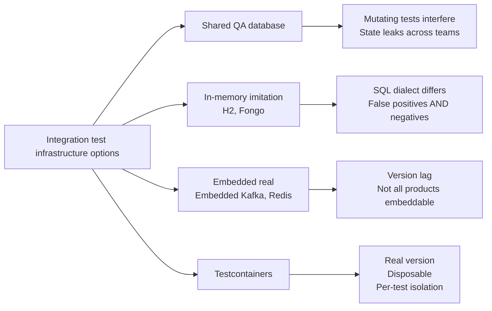
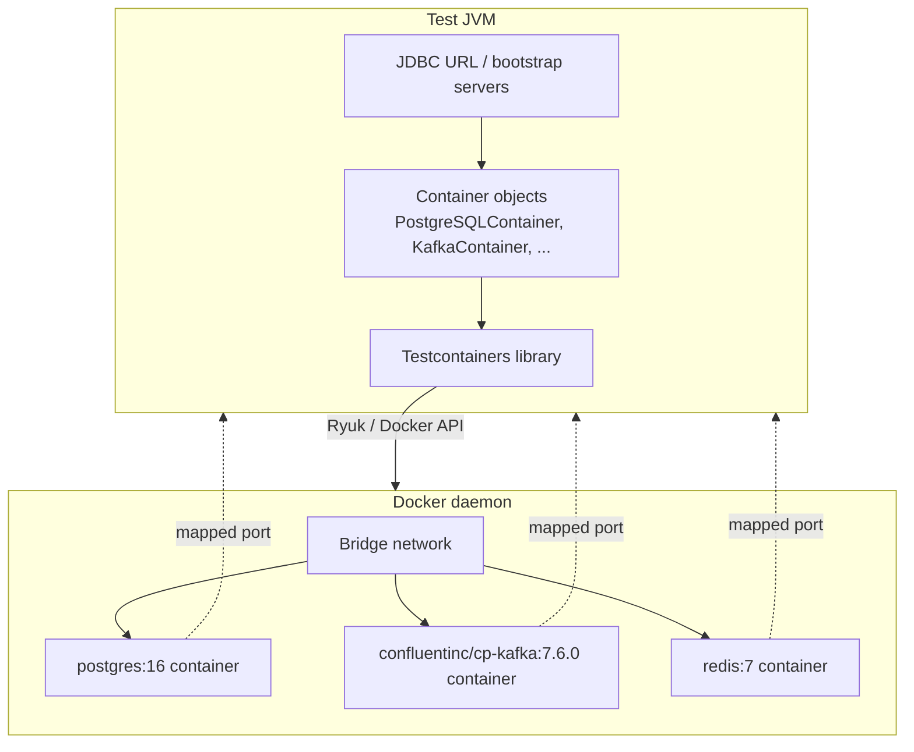
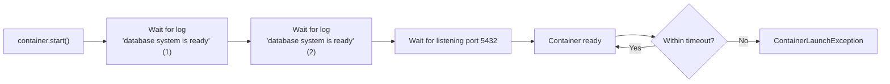
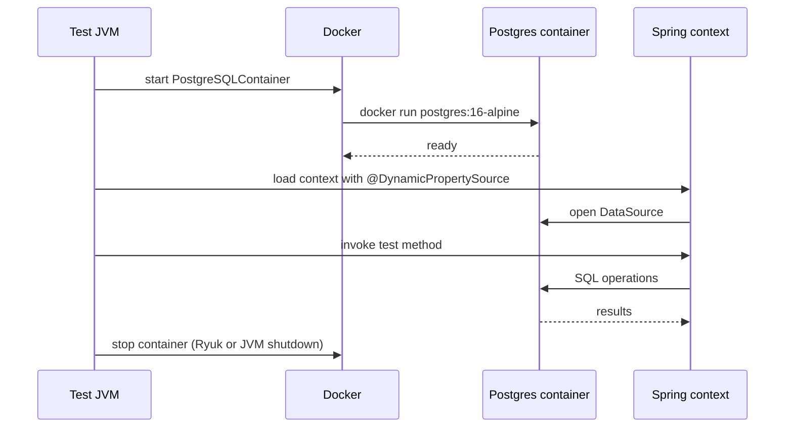

# Integration Testing and Test Containers

## Overview

Unit tests with mocks tell you whether each class behaves in isolation. They do not tell you whether your SQL works against a real database, whether your Kafka producer actually delivers messages, whether your Redis serialization round trips, or whether your database migration scripts leave the schema in the shape your code expects. Integration tests fill that gap by exercising multiple components together, ideally against the real infrastructure. The challenge historically was that real infrastructure is heavy: installing PostgreSQL on every developer's machine, sharing a flaky QA database, or running an in-memory imitation that subtly differs from production.

Testcontainers solves this. It is a Java library that wraps the Docker API and gives you disposable, programmatically-controlled containers for PostgreSQL, MySQL, MongoDB, Redis, Kafka, LocalStack (AWS), Elasticsearch, ClickHouse, and many more. Each test class can spin up the exact version of the database it needs, run its tests, and tear the container down. Because the container is real software, bugs in SQL, JPA mappings, schema migrations, and serialization surface in CI rather than in production.

This note covers the Testcontainers Java API, the JUnit 5 integration via `@Testcontainers` and `@Container`, lifecycle management with singleton containers, the specialized container classes (PostgreSQL, Redis, Kafka, LocalStack, GenericContainer), network aliases for multi-container topologies, wait strategies, Docker Compose support, the test data patterns that keep integration tests fast, and the Spring Boot integration via `@DynamicPropertySource`. After reading this note you should be able to write integration tests that exercise your real database, cache, and message broker in seconds per test class.

## Background Knowledge

Recall the following from earlier notes:

- **JUnit 5 lifecycle** (Phase 11.1): `@BeforeAll`, `@AfterAll`, and the per-class test instance lifecycle (annotated in code in the previous note) for sharing a container across tests.
- **Try with resources** (Phase 5): `GenericContainer` implements `AutoCloseable` and can be used in a try-with-resources block.
- **JDBC** (Phase 8): the database containers expose a JDBC URL that you pass to your `DataSource`.
- **Virtual threads** (Phase 7.9): useful when integration tests need to fire many concurrent requests at a container.
- **Records** (Phase 3): ideal for test fixtures and expected rows.

## Why Testcontainers

The alternatives to Testcontainers all have serious drawbacks:



A shared QA database quickly becomes a bottleneck. Tests interfere with each other, schema drift breaks tests unpredictably, and parallel CI runs collide. In-memory imitations like H2 have a different SQL dialect from PostgreSQL; tests pass against H2 and fail in production against real Postgres. Embedded variants of real software exist for some products (Embedded Kafka, Embedded Redis) but they lag behind the production version, behave subtly differently, and require adding non-trivial dependencies to your build.

Testcontainers gives you the real product, in the exact version you want, isolated to your test run, disposed of automatically. The cost is a Docker daemon on the build machine, which is standard in modern CI environments.

## Dependency Setup

```xml
<dependency>
    <groupId>org.testcontainers</groupId>
    <artifactId>testcontainers</artifactId>
    <version>1.19.7</version>
    <scope>test</scope>
</dependency>
<dependency>
    <groupId>org.testcontainers</groupId>
    <artifactId>junit-jupiter</artifactId>
    <version>1.19.7</version>
    <scope>test</scope>
</dependency>
<dependency>
    <groupId>org.testcontainers</groupId>
    <artifactId>postgresql</artifactId>
    <version>1.19.7</version>
    <scope>test</scope>
</dependency>
<dependency>
    <groupId>org.testcontainers</groupId>
    <artifactId>kafka</artifactId>
    <version>1.19.7</version>
    <scope>test</scope>
</dependency>
<dependency>
    <groupId>org.testcontainers</groupId>
    <artifactId>testcontainers-redis</artifactId>
    <version>1.0.1</version>
    <scope>test</scope>
</dependency>
```

For Gradle:

```groovy
testImplementation 'org.testcontainers:testcontainers:1.19.7'
testImplementation 'org.testcontainers:junit-jupiter:1.19.7'
testImplementation 'org.testcontainers:postgresql:1.19.7'
testImplementation 'org.testcontainers:kafka:1.19.7'
```

## Architecture



The Testcontainers library talks to the Docker daemon via the Docker API. Each container object in your test JVM corresponds to a real container in Docker. The library maps a random host port to the container's exposed port so that tests can connect without port conflicts. A sidecar container called Ryuk cleans up any leftover containers after the JVM exits, which is essential for CI hygiene.

## Container Lifecycle with JUnit 5

### Per-test Container

Annotate a field with `@Container` and Testcontainers will start it before each test and stop it after. This is the simplest pattern but also the slowest because each test pays the full container startup cost.

```java
import org.junit.jupiter.api.Test;
import org.testcontainers.containers.PostgreSQLContainer;
import org.testcontainers.junit.jupiter.Container;
import org.testcontainers.junit.jupiter.Testcontainers;
import java.sql.Connection;
import java.sql.DriverManager;
import java.sql.ResultSet;
import static org.junit.jupiter.api.Assertions.assertTrue;

@Testcontainers
class PerTestContainerTest {

    @Container
    private final PostgreSQLContainer<?> postgres =
        new PostgreSQLContainer<>("postgres:16-alpine");

    @Test
    void canSelectOne() throws Exception {
        try (Connection conn = DriverManager.getConnection(
                postgres.getJdbcUrl(),
                postgres.getUsername(),
                postgres.getPassword());
             var stmt = conn.createStatement();
             ResultSet rs = stmt.executeQuery("SELECT 1")) {
            assertTrue(rs.next());
        }
    }
}
```

### Shared Container with `@Container` Static Field

Make the field `static` and Testcontainers starts it once for the whole class, sharing it across all tests. This is the recommended pattern for integration tests because it amortises startup cost.

```java
import org.junit.jupiter.api.Test;
import org.testcontainers.containers.PostgreSQLContainer;
import org.testcontainers.junit.jupiter.Container;
import org.testcontainers.junit.jupiter.Testcontainers;

@Testcontainers
class SharedContainerTest {

    @Container
    static final PostgreSQLContainer<?> POSTGRES =
        new PostgreSQLContainer<>("postgres:16-alpine")
            .withDatabaseName("testdb")
            .withUsername("test")
            .withPassword("test")
            .withReuse(true);

    @Test
    void firstTest() { /* use POSTGRES */ }

    @Test
    void secondTest() { /* use POSTGRES */ }
}
```

### The Singleton Container Pattern

When multiple test classes need the same container, the cleanest approach is a singleton holder. Each test class that needs the container references the singleton. The JVM shuts the container down via a shutdown hook when the test JVM exits.

```java
import org.testcontainers.containers.PostgreSQLContainer;

public abstract class AbstractIntegrationTest {

    static final PostgreSQLContainer<?> POSTGRES =
        new PostgreSQLContainer<>("postgres:16-alpine")
            .withDatabaseName("appdb")
            .withReuse(true);

    static {
        POSTGRES.start();
    }

    protected String jdbcUrl()   { return POSTGRES.getJdbcUrl(); }
    protected String dbUser()    { return POSTGRES.getUsername(); }
    protected String dbPassword() { return POSTGRES.getPassword(); }
}
```

```java
class UserRepositoryIT extends AbstractIntegrationTest {

    @Test
    void savePersistsUser() throws Exception {
        try (var conn = java.sql.DriverManager.getConnection(
                jdbcUrl(), dbUser(), dbPassword())) {
            var repo = new UserRepository(conn);
            repo.save(new User("alice", "alice@example.com"));
            var found = repo.findByName("alice");
            assertTrue(found.isPresent());
        }
    }
}
```

The `withReuse(true)` call enables container reuse across test runs (when `~/.testcontainers.properties` contains `testcontainers.reuse.enable=true`), which can shave tens of seconds off local development loops.

## Wait Strategies

Containers do not become ready the instant they start. A database is ready when it accepts connections, not when the Docker container is running. Testcontainers ships `WaitStrategy` implementations and applies sensible defaults for known container types. For `GenericContainer`, you must specify the strategy explicitly.

```java
import org.testcontainers.containers.GenericContainer;
import org.testcontainers.containers.wait.strategy.Wait;
import java.time.Duration;

GenericContainer<?> slowService = new GenericContainer<>("myregistry.io/slow-service:1.2.3")
    .withExposedPorts(8080)
    .waitingFor(Wait.forHttp("/health")
        .forStatusCode(200)
        .withStartupTimeout(Duration.ofSeconds(60)));
```

Built-in wait strategies:

| Strategy | When ready |
|---|---|
| `Wait.forLogMessage(regex, count)` | Container log matches `regex` `count` times |
| `Wait.forHttp(path)` | HTTP GET on `path` returns 200 |
| `Wait.forHttp(path).forStatusCode(204)` | Specific status code |
| `Wait.forListeningPort()` | Port is listening (TCP) |
| `Wait.forHealthcheck()` | Docker healthcheck passes |
| `Wait.defaultWaitStrategy()` | Log message + listening port |

## PostgreSQL Container

The PostgreSQL container is the workhorse of integration tests. It exposes the JDBC URL, username, password, and database name. You can also run init scripts or mount SQL files.

```java
import org.junit.jupiter.api.Test;
import org.testcontainers.containers.PostgreSQLContainer;
import org.testcontainers.junit.jupiter.Container;
import org.testcontainers.junit.jupiter.Testcontainers;
import java.sql.Connection;
import java.sql.DriverManager;
import static org.junit.jupiter.api.Assertions.assertEquals;

@Testcontainers
class PostgresInitScriptTest {

    @Container
    static final PostgreSQLContainer<?> POSTGRES =
        new PostgreSQLContainer<>("postgres:16-alpine")
            .withInitScript("schema.sql")
            .withDatabaseName("appdb");

    @Test
    void schemaIsInitialised() throws Exception {
        try (Connection conn = DriverManager.getConnection(
                POSTGRES.getJdbcUrl(),
                POSTGRES.getUsername(),
                POSTGRES.getPassword());
             var stmt = conn.createStatement();
             var rs = stmt.executeQuery(
                 "SELECT count(*) FROM information_schema.tables " +
                 "WHERE table_schema = 'public' AND table_name = 'users'")) {
            rs.next();
            assertEquals(1, rs.getInt(1));
        }
    }
}
```

The `schema.sql` file lives at `src/test/resources/schema.sql`. For multi-file migrations, mount a directory using the classpath resource mapping method (the call inside the code block above passes the path `migrations` to the container path `/docker-entrypoint-initdb.d` with read-only bind mode).

### Using Testcontainers JDBC Driver

Testcontainers also ships a special JDBC URL prefix that starts a container on demand. Replace the JDBC URL with `jdbc:tc:postgresql:16-alpine:///databasename` and the driver starts a fresh container for the duration of the JDBC connection.

```java
import java.sql.DriverManager;
import java.sql.Connection;

String url = "jdbc:tc:postgresql:16-alpine:///appdb?TC_INITSCRIPT=schema.sql";
try (Connection conn = DriverManager.getConnection(url)) {
    // use the connection; container is started lazily and stopped on close
}
```

This is convenient for tests that only need a single connection. For tests that need to coordinate multiple connections to the same container, use the explicit container object pattern.

## Spring Boot Integration

Spring Boot tests typically load an `ApplicationContext` and configure `DataSource` beans from `application.properties`. With Testcontainers, you need to override the `DataSource` properties at runtime with the container's mapped port. The `@DynamicPropertySource` annotation does exactly this.

```java
import org.junit.jupiter.api.Test;
import org.springframework.beans.factory.annotation.Autowired;
import org.springframework.boot.test.context.SpringBootTest;
import org.springframework.test.context.DynamicPropertyRegistry;
import org.springframework.test.context.DynamicPropertySource;
import org.testcontainers.containers.PostgreSQLContainer;
import org.testcontainers.junit.jupiter.Container;
import org.testcontainers.junit.jupiter.Testcontainers;
import static org.junit.jupiter.api.Assertions.assertEquals;

@SpringBootTest
@Testcontainers
class UserRepositorySpringIT {

    @Container
    static PostgreSQLContainer<?> postgres =
        new PostgreSQLContainer<>("postgres:16-alpine");

    @DynamicPropertySource
    static void props(DynamicPropertyRegistry registry) {
        registry.add("spring.datasource.url",      postgres::getJdbcUrl);
        registry.add("spring.datasource.username", postgres::getUsername);
        registry.add("spring.datasource.password", postgres::getPassword);
    }

    @Autowired
    private UserRepository repository;

    @Test
    void saveAndFind() {
        repository.save(new User("alice", "alice@example.com"));
        var found = repository.findByName("alice");
        assertEquals("alice@example.com", found.getEmail());
    }
}
```

`@DynamicPropertySource` is invoked after the container has started but before the Spring context initializes, so the mapped port is already known.

### Spring Boot 3.1 `@ServiceConnection`

Spring Boot 3.1 introduced `@ServiceConnection`, which eliminates `@DynamicPropertySource` for many container types. Annotate the container field and Spring Boot auto-configures the `DataSource` from it.

```java
import org.springframework.boot.test.autoconfigure.service.ServiceConnection;
import org.springframework.boot.testcontainers.service.connection.ServiceConnection;
import org.testcontainers.containers.PostgreSQLContainer;

@SpringBootTest
@Testcontainers
class UserRepositorySpringBoot3IT {

    @Container
    @ServiceConnection
    static PostgreSQLContainer<?> postgres =
        new PostgreSQLContainer<>("postgres:16-alpine");

    @Test
    void saveAndFind(@Autowired UserRepository repository) {
        repository.save(new User("alice", "alice@example.com"));
        // ...
    }
}
```

The same pattern works for Redis, Kafka, MongoDB, RabbitMQ, and many others via Spring Boot's `@ServiceConnection` auto-detection.

## Redis Container

```java
import org.junit.jupiter.api.Test;
import org.testcontainers.containers.GenericContainer;
import org.testcontainers.junit.jupiter.Container;
import org.testcontainers.junit.jupiter.Testcontainers;
import redis.clients.jedis.Jedis;
import static org.junit.jupiter.api.Assertions.assertEquals;

@Testcontainers
class RedisCacheTest {

    @Container
    static final GenericContainer<?> REDIS =
        new GenericContainer<>("redis:7-alpine")
            .withExposedPorts(6379)
            .waitingFor(Wait.forLogMessage(".*Ready to accept connections.*\\n", 1));

    @Test
    void cacheStoresAndRetrieves() {
        try (var jedis = new Jedis(REDIS.getHost(), REDIS.getMappedPort(6379))) {
            jedis.set("user:1", "alice");
            assertEquals("alice", jedis.get("user:1"));
        }
    }
}
```

For a typed Redis container with sensible defaults, use `com.redis.testcontainers.RedisContainer` from the `testcontainers-redis` artifact:

```java
import com.redis.testcontainers.RedisContainer;

@Container
static final RedisContainer REDIS =
    new RedisContainer("redis:7-alpine");
```

## Kafka Container

Kafka is more involved because a Kafka broker needs ZooKeeper (in older versions) or runs in KRaft mode (modern versions). The Testcontainers `KafkaContainer` handles both, defaulting to KRaft in recent versions.

```java
import org.apache.kafka.clients.consumer.ConsumerRecords;
import org.apache.kafka.clients.consumer.KafkaConsumer;
import org.apache.kafka.clients.producer.KafkaProducer;
import org.apache.kafka.clients.producer.ProducerRecord;
import org.junit.jupiter.api.Test;
import org.testcontainers.containers.KafkaContainer;
import org.testcontainers.junit.jupiter.Container;
import org.testcontainers.junit.jupiter.Testcontainers;
import org.testcontainers.utility.DockerImageName;
import java.time.Duration;
import java.util.List;
import java.util.Map;
import java.util.stream.StreamSupport;
import static org.junit.jupiter.api.Assertions.assertEquals;

@Testcontainers
class KafkaEventIT {

    @Container
    static final KafkaContainer KAFKA =
        new KafkaContainer(DockerImageName.parse("confluentinc/cp-kafka:7.6.0"));

    private Map<String, Object> producerProps() {
        return Map.of(
            "bootstrap.servers", KAFKA.getBootstrapServers(),
            "key.serializer",   "org.apache.kafka.common.serialization.StringSerializer",
            "value.serializer", "org.apache.kafka.common.serialization.StringSerializer",
            "acks",             "all"
        );
    }

    private Map<String, Object> consumerProps(String group) {
        return Map.of(
            "bootstrap.servers",  KAFKA.getBootstrapServers(),
            "key.deserializer",   "org.apache.kafka.common.serialization.StringDeserializer",
            "value.deserializer", "org.apache.kafka.common.serialization.StringDeserializer",
            "group.id",           group,
            "auto.offset.reset",  "earliest",
            "enable.auto.commit", "false"
        );
    }

    @Test
    void producedMessageIsConsumable() {
        var topic = "users";
        try (var producer = new KafkaProducer<String, String>(producerProps())) {
            producer.send(new ProducerRecord<>(topic, "1", "alice"));
            producer.flush();
        }
        try (var consumer = new KafkaConsumer<String, String>(consumerProps("test-group"))) {
            consumer.subscribe(List.of(topic));
            var records = consumer.poll(Duration.ofSeconds(5));
            var values = StreamSupport.stream(records.spliterator(), false)
                .map(r -> r.value())
                .toList();
            assertEquals(List.of("alice"), values);
        }
    }
}
```

For schema registry integration, use `ConfluentKafkaContainer` from the `confluent` Testcontainers module.

## LocalStack for AWS

LocalStack is a fully functional local AWS cloud stack. With Testcontainers you can spin it up and test code that talks to S3, SQS, SNS, DynamoDB, Kinesis, and more, without touching real AWS.

```java
import org.junit.jupiter.api.Test;
import org.testcontainers.containers.localstack.LocalStackContainer;
import org.testcontainers.junit.jupiter.Container;
import org.testcontainers.junit.jupiter.Testcontainers;
import org.testcontainers.utility.DockerImageName;
import software.amazon.awssdk.auth.credentials.AwsBasicCredentials;
import software.amazon.awssdk.auth.credentials.StaticCredentialsProvider;
import software.amazon.awssdk.regions.Region;
import software.amazon.awssdk.services.s3.S3Client;
import software.amazon.awssdk.services.s3.model.CreateBucketRequest;
import static org.junit.jupiter.api.Assertions.assertTrue;

@Testcontainers
class S3UploadIT {

    @Container
    static final LocalStackContainer LOCALSTACK =
        new LocalStackContainer(DockerImageName.parse("localstack/localstack:3.0.2"))
            .withServices(LocalStackContainer.Service.S3);

    @Test
    void uploadObjectSucceeds() {
        var creds = AwsBasicCredentials.create(LOCALSTACK.getAccessKey(),
                                               LOCALSTACK.getSecretKey());
        try (var s3 = S3Client.builder()
                .endpointOverride(LOCALSTACK.getEndpointOverride(LocalStackContainer.Service.S3))
                .credentialsProvider(StaticCredentialsProvider.create(creds))
                .region(Region.of(LOCALSTACK.getRegion()))
                .build()) {
            s3.createBucket(CreateBucketRequest.builder().bucket("test-bucket").build());
            s3.putObject(b -> b.bucket("test-bucket").key("hello.txt"),
                         software.amazon.awssdk.core.sync.RequestBody.fromString("hello"));
            var exists = s3.headObject(b -> b.bucket("test-bucket").key("hello.txt")).sdkHttpResponse().isSuccessful();
            assertTrue(exists);
        }
    }
}
```

## Network and Multi-Container Topologies

When tests need multiple containers that talk to each other (for example, an application container that talks to a database container), you must connect them on the same Docker network and reference them by network alias. Testcontainers exposes `Network` for this.

```java
import org.junit.jupiter.api.Test;
import org.testcontainers.containers.GenericContainer;
import org.testcontainers.containers.Network;
import org.testcontainers.containers.PostgreSQLContainer;
import static org.junit.jupiter.api.Assertions.assertTrue;

class MultiContainerTest {

    @Test
    void appCanReachDatabase() {
        try (var network = Network.newNetwork();
             var postgres = new PostgreSQLContainer<>("postgres:16-alpine")
                 .withNetwork(network)
                 .withNetworkAliases("db");
             var app = new GenericContainer<>("myregistry.io/myapp:1.0.0")
                 .withNetwork(network)
                 .withNetworkAliases("app")
                 .withEnv("DB_URL", "jdbc:postgresql://db:5432/test")
                 .withEnv("DB_USER", "test")
                 .withEnv("DB_PASSWORD", "test")
                 .withExposedPorts(8080)
                 .waitingFor(Wait.forHttp("/health").forStatusCode(200))) {

            assertTrue(app.isRunning());
        }
    }
}
```

Inside the Docker network, the app container reaches the database at `jdbc:postgresql://db:5432/test` because `db` is the network alias. From outside Docker (your test JVM), you reach the app at `app.getHost():app.getMappedPort(8080)`.

## Docker Compose Support

For tests where composing multiple containers via Java code becomes verbose, Testcontainers can drive an existing `docker-compose.yml` file via the `DockerComposeContainer` class.

```java
import org.junit.jupiter.api.Test;
import org.testcontainers.containers.DockerComposeContainer;
import java.io.File;
import static org.junit.jupiter.api.Assertions.assertTrue;

class ComposeIT {

    static final DockerComposeContainer<?> ENV =
        new DockerComposeContainer<>(new File("src/test/resources/compose-test.yml"))
            .withExposedService("postgres", 5432)
            .withExposedService("redis", 6379)
            .withLocalCompose(true);

    static { ENV.start(); }

    @Test
    void servicesAreReachable() {
        var pgHost = ENV.getServiceHost("postgres", 5432);
        var pgPort = ENV.getServicePort("postgres", 5432);
        assertTrue(pgPort > 0);
    }
}
```

The compose file lives at `src/test/resources/compose-test.yml`. Use this when your team already maintains a compose file for local development and you want the tests to use the same definition.

## Wait Strategies in Depth

The default wait strategy for `PostgreSQLContainer` is `Wait.forLogMessage(".*database system is ready to accept connections.*\\n", 2)`. The `2` is because Postgres prints this message twice during startup (once after initialisation, once after ready). Knowing this is essential when you debug a flaky container startup.



## Image Pull and Tag Strategy

Always pin the image tag explicitly. `new PostgreSQLContainer<>("postgres:16-alpine")` is repeatable; `new PostgreSQLContainer<>("postgres:latest")` is not, because `latest` shifts over time and a test that passed yesterday may fail today when the upstream image is rebuilt with a different default configuration. For team projects, prefer a `ImageNameSubstitutor` configured in `~/.testcontainers.properties` to redirect public images to an internal mirror for faster pulls in CI.

```properties
docker.image.name.substitutor=com.example.MySubstitutor
testcontainers.reuse.enable=true
```

## Performance Tuning

Container startup is the dominant cost in integration tests. Strategies to keep it manageable:

1. **Use alpine variants.** `postgres:16-alpine` starts in roughly 3 seconds, while `postgres:16` takes 6 to 8 seconds because the image is larger and the entrypoint does more work.
2. **Share containers across test classes.** Use the singleton pattern; one container start per JVM, not per class.
3. **Enable container reuse.** Set `testcontainers.reuse.enable=true` in `~/.testcontainers.properties` and call `.withReuse(true)` on the container. The container survives the JVM exit and is reused on the next run.
4. **Parallelise independent tests.** With `junit.jupiter.execution.parallel.enabled=true`, multiple test classes can run in parallel, each against the shared container. Use `@ResourceLock` only if tests mutate shared state.
5. **Use Flyway or Liquibase for schema setup.** They are faster than mounting many init scripts and produce exactly the production schema.
6. **Roll back between tests instead of recreating the schema.** For JPA tests, annotate with `@Transactional` and let Spring roll back after each test. For raw JDBC tests, wrap each test in a transaction and roll back manually.
7. **Use `@Sql` for per-test data setup.** Spring's `@Sql` annotation loads SQL fixtures before each test method, much faster than dropping and recreating tables.

## Test Data Patterns

### Builder Pattern for Fixtures

```java
public final class UserFactory {
    private UserFactory() {}
    public static User alice() {
        return new User("alice", "alice@example.com", 30);
    }
    public static User bob() {
        return new User("bob", "bob@example.com", 25);
    }
    public static User random() {
        var id = java.util.UUID.randomUUID().toString().substring(0, 8);
        return new User(id, id + "@example.com", 20);
    }
}
```

### Sequence Diagram of a Typical Integration Test



## Common Pitfalls

1. **Forgetting `@Testcontainers` on the test class.** Without it, `@Container` fields are ignored and the container never starts. The test then fails to connect because there is no database.
2. **Using non-static `@Container` fields with `@DynamicPropertySource` (which is always static).** The static `@DynamicPropertySource` method runs before any instance field is initialised, so the container must be static too. The compiler will not catch this.
3. **Pulling `:latest` tags.** Tests pass on Monday and fail on Tuesday because the upstream image changed. Always pin to a specific version, ideally an immutable digest.
4. **Using H2 in tests for a PostgreSQL application.** The SQL dialects differ enough that H2 tests are nearly meaningless as integration tests. Use the real Postgres container.
5. **Not using `withReuse(true)` in local development.** Each test run pays 3 to 8 seconds of container startup. Multiply by dozens of test classes per day and the cost is significant.
6. **Assuming the container port is fixed.** It is not: Testcontainers maps a random host port to the container port. Always use `getMappedPort(5432)` or the JDBC URL getter, never hardcode `5432`.
7. **Leaking containers in CI.** If a test JVM is killed, Ryuk should clean up, but if Ryuk itself is misconfigured, leftover containers accumulate. Set the Ryuk connection timeout and reconnection timeout properties in the testcontainers config file if you see this.
8. **Running tests that mutate the schema in parallel.** Two test classes both running `CREATE TABLE users` will collide. Either sequence them with `@ResourceLock("schema")` or use separate schemas per test class.
9. **Forgetting to flush Kafka producers.** A test that produces a message and immediately closes the producer may not have flushed. Always call `producer.flush()` or use `producer.send(...).get()` to wait for the ack.
10. **Using Docker Desktop on macOS with limited CPU.** Docker Desktop on macOS runs in a VM with default 2 CPUs. Bump it to at least 4 CPUs and 4 GB of RAM, otherwise container startup is slow.

## Tips and Tricks

- Keep a static `Network` field in your base test class for tests that need multiple containers to talk to each other.
- Use `withCopyToContainerWithFilePermissions` to mount a single config file into a container without writing a Dockerfile.
- Use the `withCommand` method with arguments like `"postgres"`, `"-c"`, `"max connections=200"` (replacing the underscore in the Postgres parameter name with a space, which Postgres accepts) to override the container's default command-line arguments.
- Use `org.testcontainers.utility.MountableFile.forClasspathResource("schema.sql")` to mount a classpath resource.
- For tests that need many containers, start them in parallel using `Startables.deepStart(postgres, redis, kafka).join()`. They start concurrently and the call blocks until all are ready.
- For Spring Boot 3.1+, prefer `@ServiceConnection` over `@DynamicPropertySource`. It eliminates boilerplate and supports a wide range of containers.
- Use `docker run --rm -v /var/run/docker.sock:/var/run/docker.sock testcontainers/ryuk:0.7.0` to manually verify Ryuk is functional.
- For Kafka tests, use the `KafkaHelper` class pattern (a small static utility) to centralise producer and consumer config. Each test then calls `KafkaHelper.producer(kafka)` and `KafkaHelper.consumer(kafka, "group")`.
- For tests that need to verify a side effect asynchronously (for example, that a Kafka consumer has processed an event), use Awaitility: `await().atMost(5, SECONDS).until(() -> consumedMessages.contains("alice"))`.
- Pin the Docker image version in a central constant. Upgrading a container image becomes a one-line change, not a sweep through every test class.

## Interview Questions

**Q1: What is Testcontainers and what problem does it solve?**

A: Testcontainers is a Java library that wraps the Docker API and lets tests programmatically start and stop containers for real infrastructure (PostgreSQL, Kafka, Redis, etc.). It solves the problem of integration testing against real services without the cost and flakiness of a shared QA environment. Each test class can spin up the exact version of the service it needs, isolated from other tests, and dispose of it when done. The result is integration tests that are reproducible, fast enough to run on every commit, and faithful to production behaviour.

**Q2: What is the role of Ryuk?**

A: Ryuk is a sidecar container that Testcontainers starts alongside the test containers. It watches the Docker daemon for containers that belong to the test JVM and removes them when the JVM exits, even if the JVM crashes. Without Ryuk, a killed test JVM would leave orphan containers running, consuming disk and memory on the Docker host. Ryuk is configurable via `~/.testcontainers.properties` and can be disabled, though this is rarely advisable.

**Q3: What is the difference between `@Container` on an instance field and on a static field?**

A: An instance field is started before each test method and stopped after, giving full isolation but at the cost of a container start per test. A static field is started once per test class and shared across all test methods. The static pattern is the recommended default for integration tests because container startup is the dominant cost; per-test isolation is usually better achieved by cleaning the database state in `@BeforeEach` rather than by restarting the container.

**Q4: How does `@DynamicPropertySource` work in Spring tests?**

A: `@DynamicPropertySource` marks a static method that receives a `DynamicPropertyRegistry`. The method is called by Spring after the container has started but before the `ApplicationContext` is refreshed. The method registers property suppliers (typically method references to the container's getters) into the registry, and Spring resolves those properties when constructing beans. This lets you inject the container's random host port and credentials into Spring configuration without hardcoding them.

**Q5: What does `@ServiceConnection` do in Spring Boot 3.1+?**

A: It eliminates the need for `@DynamicPropertySource` for many container types. When you annotate a container field with `@ServiceConnection`, Spring Boot inspects the container type at context initialization time and auto-configures the corresponding Spring bean (DataSource, RedisConnectionFactory, KafkaTemplate, etc.) with the container's connection details. It is a metadata-driven shortcut that knows about PostgreSQL, MySQL, MongoDB, Redis, Kafka, RabbitMQ, and others.

**Q6: Why should you pin Docker image tags rather than using `latest`?**

A: `latest` shifts over time. A test that passed yesterday may fail today because the upstream image was rebuilt with a different default configuration, a different minor version of the database, or a different startup log message that breaks your wait strategy. Pinning to a specific tag (ideally an immutable digest) makes tests reproducible. When you do want to upgrade, you do it deliberately as a one-line change with a clear commit message.

**Q7: What is a wait strategy and why is it necessary?**

A: A wait strategy is the rule Testcontainers uses to decide when a container is ready to accept connections. Without one, the test JVM would try to connect to the container before the service inside it has finished starting, causing connection failures. Built-in strategies include waiting for a log message, waiting for a port to be listening, waiting for an HTTP endpoint to return a specific status code, and waiting for the Docker healthcheck to pass. The right strategy depends on the service: databases typically wait for a log message, web services wait for an HTTP health endpoint.

**Q8: How does container reuse work?**

A: When you call `.withReuse(true)` on a container AND set `testcontainers.reuse.enable=true` in `~/.testcontainers.properties`, Testcontainers hashes the container's configuration (image, env, ports, command, etc.) and checks whether a matching container is already running. If so, it reuses it instead of starting a new one. The container survives the JVM exit and is reused on the next run. This dramatically speeds up local development loops. Reuse is opt-in and disabled by default to prevent surprising state leakage.

**Q9: How do you connect two containers so that they can talk to each other?**

A: Create a `Network` via `Network.newNetwork()` (or use `Network.SHARED`), then attach each container with `.withNetwork(network)` and give each a network alias with `.withNetworkAliases("db")`. Inside the Docker network, containers reach each other by their network alias on the container's exposed port (not the host-mapped port). The test JVM, which is outside the Docker network, reaches each container by `container.getHost()` and `container.getMappedPort(...)`.

**Q10: What is the difference between `GenericContainer` and the specialized container classes like `PostgreSQLContainer`?**

A: `GenericContainer` is the bare wrapper around any Docker image. You must configure the exposed ports, environment variables, wait strategy, and connection details yourself. The specialized classes (`PostgreSQLContainer`, `KafkaContainer`, `RedisContainer`, etc.) extend `GenericContainer` with sensible defaults: they know the default image name, the default exposed port, the right wait strategy, and they expose convenience getters like `getJdbcUrl()`, `getBootstrapServers()`, and so on. Use the specialized class whenever one exists; reach for `GenericContainer` only for in-house services.

**Q11: How does the Testcontainers JDBC driver work?**

A: You use a JDBC URL of the form `jdbc:tc:postgresql:16-alpine:///databasename` instead of the normal PostgreSQL URL. The `tc` prefix is recognised by the Testcontainers JDBC driver, which is on the classpath. On the first connection, the driver starts a PostgreSQL container and routes the connection to it. On connection close, the container is stopped (or reused if reuse is enabled). This is convenient for tests that need a single connection without configuring a container field. It does not work for tests that need multiple coordinated connections or shared state across tests, because each JDBC URL creates a fresh container.

**Q12: How do you start multiple containers in parallel?**

A: Use `Startables.deepStart(containerA, containerB, containerC).join()`. The `deepStart` method starts all the supplied containers concurrently and returns a `CompletableFuture` that completes when all are ready. The `join()` call blocks. This is much faster than starting them sequentially.

**Q13: What is `LocalStackContainer` and when would you use it?**

A: `LocalStackContainer` runs the LocalStack image, which provides a fully functional local emulation of many AWS services (S3, SQS, SNS, DynamoDB, Kinesis, Lambda, and more). Use it for integration tests that exercise code which talks to AWS, without needing real AWS credentials, network access, or incurring cost. The AWS SDK can be pointed at the LocalStack endpoint override and will treat it as a real AWS service.

**Q14: How do you run a Spring Boot integration test against Testcontainers without `@ServiceConnection`?**

A: Use `@DynamicPropertySource`. Annotate a static method that takes a `DynamicPropertyRegistry` and register each property the Spring context needs (datasource URL, username, password, Redis host and port, Kafka bootstrap servers, etc.) by calling `registry.add("property.name", container::getter)`. The container must be static and started before the Spring context refreshes, which Testcontainers handles for static `@Container` fields.

**Q15: How do you keep integration tests fast?**

A: Five techniques in order of impact: (1) Share containers across test classes via the singleton pattern, so the JVM pays startup cost once. (2) Enable container reuse so subsequent test runs skip startup entirely. (3) Use alpine image variants, which are smaller and start faster. (4) Run independent test classes in parallel with `junit.jupiter.execution.parallel.enabled=true`. (5) Reset state between tests with `@Transactional` rollback or `@Sql` rather than recreating the schema.

## Summary

Testcontainers brings real infrastructure to integration tests with the disposability of mocks. The JUnit 5 integration via `@Testcontainers` and `@Container` makes container lifecycle declarative; the singleton pattern lets you share a container across an entire test JVM. Specialized container classes for PostgreSQL, Redis, Kafka, and LocalStack ship with sensible defaults and convenient connection getters. Wait strategies make container readiness explicit and reproducible. Spring Boot 3.1's `@ServiceConnection` eliminates the boilerplate of `@DynamicPropertySource`. The result is integration tests that catch SQL bugs, schema migration issues, serialization mismatches, and Kafka producer configuration errors before they reach production, all while running fast enough for every commit. The next note moves on to test coverage measurement with JaCoCo and mocking with Mockito, completing the testing toolkit.
