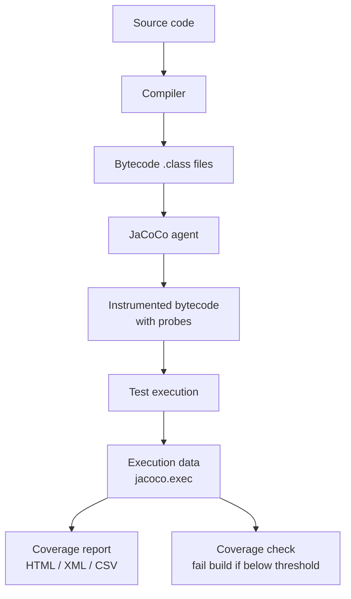
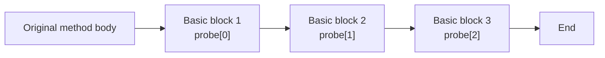
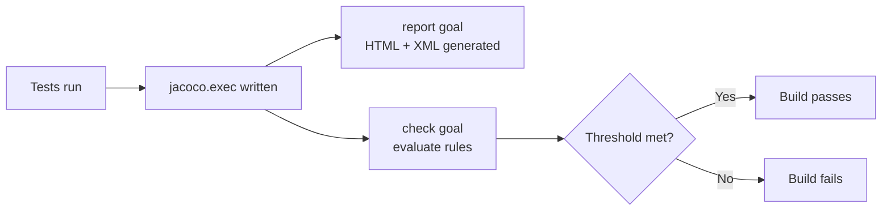
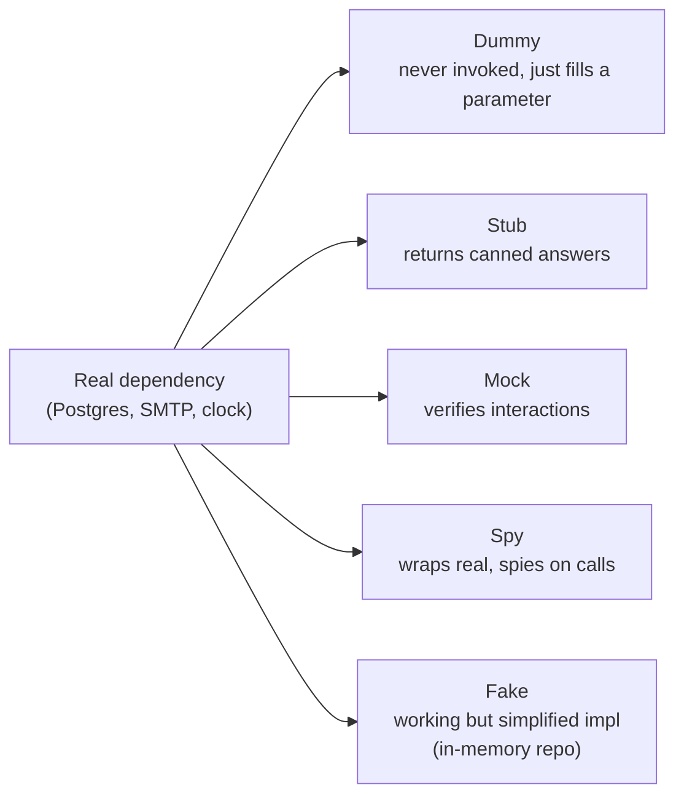

# Test Coverage and Mocking

## Overview

Two questions dominate test suite quality: are you testing enough of the code, and are you testing the right thing? Code coverage answers the first question by instrumenting bytecode and recording which lines, branches, methods, and classes were executed during the test run. Mocking answers the second by letting you replace a real dependency with a controllable stand-in, so that the test can focus on the unit under test without dragging in a database, a remote API, or a clock. JaCoCo is the standard coverage tool for the JVM; Mockito is the standard mocking library. Both are mature, both integrate cleanly with JUnit 5 and the Maven and Gradle build tools, and both have idioms and pitfalls that every Java developer should know.

This note covers JaCoCo in depth: how it instruments bytecode with on-the-fly and offline modes, the difference between line, branch, method, and instruction coverage, the report formats (HTML, XML, CSV), coverage rule enforcement with `jacoco:check` and `CoverageExclude` patterns, multi-module aggregation, and integration with SonarQube and Codecov. We then cover Mockito: the mock and spy APIs, the stubbing DSL (`when().thenReturn()` versus the argument-matcher form), verification (`verify`, `times`, `atLeast`, `never`, `timeout`), argument capture, the inline mock maker that supports final and static methods, the strict stubbing mode that catches unused stubs, and the integration with Spring Boot Test via `@MockBean` and `@SpyBean`. We finish with a comparison of mocks, stubs, spies, and fakes, and a worked example that uses JaCoCo and Mockito together on a payment service.

## Background Knowledge

Recall the following from earlier notes:

- **Bytecode** (Phase 9): JaCoCo instruments `.class` files by inserting probe instructions that record execution.
- **Class loading** (Phase 9.4): the JaCoCo agent attaches to the JVM via `-javaagent` and instruments classes as they are loaded.
- **Reflection** (Phase 3): Mockito uses reflection to create subclass proxies at runtime.
- **Lambda expressions** (Phase 6): mock argument matchers and stubbing are fluent APIs backed by lambda-friendly interfaces.
- **JUnit 5 extensions** (Phase 11.1): Mockito integrates with Jupiter via `@ExtendWith(MockitoExtension.class)`.

## Test Coverage Concepts

### What Is Coverage

Coverage is the ratio of executed code elements to total code elements. The element can be a line, a branch, a method, or a single bytecode instruction. Different metrics give different numbers because they count different things.



### Coverage Metrics

| Metric | What it counts | When to use |
|---|---|---|
| Line coverage | Executable source lines | Quick feedback for developers |
| Branch coverage | Each branch of every if, switch, ternary | The minimum acceptable metric for serious projects |
| Method coverage | Methods that were entered at least once | Coarse overview |
| Class coverage | Classes that were loaded | Even coarser overview |
| Instruction coverage | Individual bytecode instructions | Most fine-grained, used by SonarQube |
| Complexity coverage | Branches weighted by cyclomatic complexity | Highlights complex uncovered code |

Line coverage is the easiest to read but it can mislead. A line that contains `if (x > 0) return foo(); else return bar();` counts as covered even if only one branch was taken. Branch coverage requires both branches to be exercised. The industry standard for a non-trivial Java project is at least 80 percent branch coverage on production code; 100 percent is rarely achievable or worth the cost.

## JaCoCo Setup

### Maven

```xml
<build>
    <plugins>
        <plugin>
            <groupId>org.jacoco</groupId>
            <artifactId>jacoco-maven-plugin</artifactId>
            <version>0.8.12</version>
            <executions>
                <execution>
                    <id>prepare-agent</id>
                    <goals><goal>prepare-agent</goal></goals>
                </execution>
                <execution>
                    <id>report</id>
                    <phase>test</phase>
                    <goals><goal>report</goal></goals>
                </execution>
                <execution>
                    <id>check</id>
                    <goals><goal>check</goal></goals>
                    <configuration>
                        <rules>
                            <rule>
                                <element>BUNDLE</element>
                                <limits>
                                    <limit>
                                        <counter>BRANCH</counter>
                                        <value>COVEREDRATIO</value>
                                        <minimum>0.80</minimum>
                                    </limit>
                                </limits>
                            </rule>
                        </rules>
                    </configuration>
                </execution>
            </executions>
        </plugin>
    </plugins>
</build>
```

The `prepare-agent` goal adds the `-javaagent` JVM argument to the surefire and failsafe configurations. The `report` goal turns the `jacoco.exec` binary execution data into an HTML report at `target/site/jacoco/index.html`. The `check` goal enforces coverage rules and fails the build if any rule is violated.

### Gradle

```groovy
plugins {
    id 'jacoco'
}

jacoco {
    toolVersion = '0.8.12'
}

test {
    finalizedBy jacocoTestReport
    finalizedBy jacocoTestCoverageVerification
}

jacocoTestReport {
    dependsOn test
    reports {
        xml.required = true
        html.required = true
        csv.required = false
    }
}

jacocoTestCoverageVerification {
    violationRules {
        rule {
            limit {
                counter = 'BRANCH'
                value = 'COVEREDRATIO'
                minimum = 0.80
            }
        }
    }
}
```

### Excluding Classes from Coverage

Some classes should not be counted: generated code (such as Lombok-generated equals and hashCode, MapStruct mappers, JPA metamodels), configuration classes, application entry points, and DTOs that have no behaviour. Configure exclusions with `<excludes>` on the report goal:

```xml
<configuration>
    <excludes>
        <exclude>com/example/generated/**</exclude>
        <exclude>com/example/dto/*</exclude>
        <exclude>com/example/**/Application.*</exclude>
    </excludes>
</configuration>
```

The exclusion pattern matches the fully-qualified class name with `*` wildcards. Note that classes are still instrumented (so they appear in the report) but excluded from the coverage ratio calculation. To exclude classes from instrumentation entirely, use the `excludes` configuration of the `prepare-agent` goal, which accepts the same pattern.

### Multi-Module Aggregation

For a multi-module Maven project, you want a single report that aggregates coverage across all modules. Use the `report-aggregate` goal in a dedicated `coverage` module that depends on every other module:

```xml
<plugin>
    <groupId>org.jacoco</groupId>
    <artifactId>jacoco-maven-plugin</artifactId>
    <version>0.8.12</version>
    <executions>
        <execution>
            <id>aggregate</id>
            <goals><goal>report-aggregate</goal></goals>
            <phase>verify</phase>
        </execution>
    </executions>
</plugin>
```

The `coverage` module's POM declares dependencies on every other module (compile scope is enough). The `report-aggregate` goal reads each module's `jacoco.exec` file (which must be published as a build artifact) and produces a combined HTML report.

## How JaCoCo Instruments Bytecode

JaCoCo inserts probe instructions at every basic block boundary. A probe is a single boolean array write: `probe[n] = true`. The agent maintains a per-class boolean array sized to the number of probes in the class. When the test JVM exits, the agent dumps the array to `jacoco.exec`.



A basic block is a maximal sequence of bytecode instructions with no jumps in or out except at the boundaries. By inserting one probe per basic block, JaCoCo can compute line, branch, and instruction coverage from the same execution data. The probes are inserted at the start of each block, so they execute before the block's first instruction.

### On-the-fly versus Offline Instrumentation

On-the-fly instrumentation is the default. The JaCoCo agent hooks into the classloader and instruments classes as they are loaded. The test sees the instrumented bytecode but the source on disk is untouched. This is the right choice for almost all projects.

Offline instrumentation modifies `.class` files on disk before they are packaged into a JAR. This is needed for environments where the agent cannot attach (some Android runtimes, some embedded JVMs) or when the test JVM is launched by a third-party tool that does not support `-javaagent`. It is rare in server-side Java.

## Reading a JaCoCo Report

The HTML report shows classes with red, yellow, and green highlights:

- Red: no instruction in the line was executed.
- Yellow: some but not all branches in the line were taken.
- Green: every instruction and every branch in the line was covered.
- No colour: the line is not executable (blank, comment, brace).

Clicking into a class shows the source code with the same colouring, plus a column on the right showing missed instructions, missed branches, missed lines, and missed complexity.

## Coverage as a Quality Gate



The `check` goal enforces rules at the granularity you choose: BUNDLE (the whole module), PACKAGE, CLASS, METHOD, SOURCEFILE, or COUNTER. A typical setup enforces 80 percent branch coverage on the BUNDLE and 100 percent method coverage on each CLASS.

```xml
<rules>
    <rule>
        <element>BUNDLE</element>
        <limits>
            <limit><counter>BRANCH</counter><value>COVEREDRATIO</value><minimum>0.80</minimum></limit>
            <limit><counter>LINE</counter><value>COVEREDRATIO</value><minimum>0.85</minimum></limit>
        </limits>
    </rule>
    <rule>
        <element>CLASS</element>
        <limits>
            <limit><counter>METHOD</counter><value>COVEREDRATIO</value><minimum>1.00</minimum></limit>
        </limits>
        <excludes>
            <exclude>com.example.config.*</exclude>
        </excludes>
    </rule>
</rules>
```

## Mocking Fundamentals

### The Test Double Spectrum



- **Dummy**: a placeholder object passed but never used.
- **Stub**: returns canned answers to method calls. The Mockito `when(mock.foo()).thenReturn(bar)` form is a stub.
- **Mock**: a stub that also records calls so the test can verify them. The Mockito `mock(Foo.class)` returns a mock.
- **Spy**: wraps a real object. Calls go to the real object by default, but the test can stub specific methods and verify interactions. Created with `spy(new RealFoo())`.
- **Fake**: a real implementation that is simpler or faster than production. An in-memory `UserRepository` is a fake. Fakes are preferred to mocks when the dependency has non-trivial behaviour that the test needs to exercise (for example, a stateful repository).

### Mockito Setup

```xml
<dependency>
    <groupId>org.mockito</groupId>
    <artifactId>mockito-core</artifactId>
    <version>5.11.0</version>
    <scope>test</scope>
</dependency>
<dependency>
    <groupId>org.mockito</groupId>
    <artifactId>mockito-junit-jupiter</artifactId>
    <version>5.11.0</version>
    <scope>test</scope>
</dependency>
```

### Creating Mocks and Spies

```java
import org.junit.jupiter.api.Test;
import org.junit.jupiter.api.extension.ExtendWith;
import org.mockito.InjectMocks;
import org.mockito.Mock;
import org.mockito.junit.jupiter.MockitoExtension;
import static org.mockito.Mockito.*;
import static org.junit.jupiter.api.Assertions.*;

@ExtendWith(MockitoExtension.class)
class OrderServiceTest {

    @Mock
    private PaymentGateway paymentGateway;

    @Mock
    private InventoryService inventoryService;

    @InjectMocks
    private OrderService orderService;

    @Test
    void placeOrderChargesAndReserves() {
        when(paymentGateway.charge(any(), eq(java.math.BigDecimal.TEN)))
            .thenReturn(true);
        when(inventoryService.reserve("SKU-1", 2)).thenReturn(true);

        var result = orderService.placeOrder(new Order("alice", "SKU-1", 2, java.math.BigDecimal.TEN));

        assertTrue(result.success());
        verify(paymentGateway).charge(any(), eq(java.math.BigDecimal.TEN));
        verify(inventoryService).reserve("SKU-1", 2);
    }
}
```

`@Mock` creates a mock field. `@Spy` creates a spy wrapping a real instance. `@InjectMocks` constructs an instance of the test subject, injecting the mock fields via constructor injection, setter injection, or field injection (in that order of preference). Constructor injection is the only fully satisfactory approach because it works with `final` fields; the other two require mutable fields.

### Manual Mock Creation

```java
import static org.mockito.Mockito.*;

class ManualMockTest {
    @Test
    void manualMock() {
        var gateway = mock(PaymentGateway.class);
        when(gateway.charge(any(), any())).thenReturn(true);
        var service = new OrderService(gateway, mock(InventoryService.class));
        // ...
    }
}
```

Manual creation is verbose but explicit. Use `@Mock` for the common case and manual creation when you need fine-grained control (for example, mocks with different names so verification error messages are clearer).

## Stubbing

### Returning a Value

```java
when(mock.findUser("alice")).thenReturn(Optional.of(new User("alice")));
when(mock.findUser("bob")).thenReturn(Optional.empty());
when(mock.findUser(eq("admin"))).thenThrow(new RuntimeException("admin not allowed"));
```

### Returning Different Values on Successive Calls

```java
when(mock.poll()).thenReturn("a", "b", "c", (String) null);
```

The first call returns `"a"`, the second `"b"`, the third `"c"`, and every subsequent call returns `null`.

### Throwing Exceptions

```java
when(mock.findUser("missing")).thenThrow(new UserNotFoundException("missing"));
when(mock.findUser("db-down")).thenThrow(RuntimeException.class);
```

### Answering with Logic

```java
import static org.mockito.ArgumentMatchers.*;
import org.mockito.invocation.InvocationOnMock;
import org.mockito.stubbing.Answer;

when(mock.save(any(User.class))).thenAnswer((Answer<User>) invocation -> {
    User u = invocation.getArgument(0);
    u.setId(java.util.UUID.randomUUID().toString());
    return u;
});
```

`Answer` lets the stub compute the return value from the invocation arguments. Use this when the canned-answer form is insufficient, for example when the stub needs to mutate its argument.

### The `doXxx` Family

`when(...)` does not work for void methods (because you cannot pass a void return to `when`). Use the `doThrow`, `doAnswer`, `doNothing`, and `doReturn` family instead:

```java
doThrow(new RuntimeException("db down")).when(mock).delete(any(String.class));
doAnswer(invocation -> {
    var id = invocation.getArgument(0);
    callbacks.add(id);
    return null;
}).when(mock).onDelete(any(String.class));
```

`doReturn(value).when(mock).method(...)` is also useful when `when(mock.method(...)).thenReturn(value)` would fail because `mock.method(...)` itself throws before Mockito can intercept it. This happens with spies whose real method has side effects.

## Verification

```java
import static org.mockito.Mockito.*;

verify(mock).findUser("alice");                            // called exactly once
verify(mock, times(2)).findUser("alice");                  // called exactly twice
verify(mock, never()).findUser("eve");                     // never called
verify(mock, atLeastOnce()).findUser("bob");               // called one or more times
verify(mock, atMost(3)).findUser("bob");                   // called at most three times
verify(mock, timeout(100)).asyncCallback(any());           // called within 100ms
verifyNoMoreInteractions(mock);                            // no calls other than those verified
verifyNoInteractions(mock, mock2);                         // no calls at all
```

`verifyNoMoreInteractions` is a strong assertion that is useful but also brittle. If the test only cares that a specific call happened, do not call `verifyNoMoreInteractions`; it couples the test to every internal call the implementation happens to make.

## Argument Capture

When the test needs to assert on the arguments passed to a mock, use `ArgumentCaptor`:

```java
import org.mockito.ArgumentCaptor;
import static org.mockito.Mockito.*;

class EmailServiceTest {
    @Test
    void welcomeEmailIsSentWithCorrectContent(@Mock EmailSender sender) {
        var service = new UserService(sender);
        service.register("alice", "alice@example.com");

        ArgumentCaptor<Email> captor = ArgumentCaptor.forClass(Email.class);
        verify(sender).send(captor.capture());

        Email sent = captor.getValue();
        assertEquals("alice@example.com", sent.to());
        assertTrue(sent.body().contains("Welcome"));
    }
}
```

`captor.getValue()` returns the last captured value; `captor.getAllValues()` returns every captured value across all calls. Use the latter when the mock was invoked multiple times.

## Argument Matchers

Matchers let you verify or stub with looser argument constraints:

```java
import static org.mockito.ArgumentMatchers.*;

when(mock.findUser(anyString())).thenReturn(Optional.empty());
when(mock.findUser(eq("admin"))).thenReturn(Optional.of(adminUser));
when(mock.findUser(startsWith("guest-"))).thenReturn(Optional.of(guestUser));
when(mock.save(any(User.class))).thenReturn(true);
when(mock.charge(any(), anyDouble())).thenReturn(true);
when(mock.charge(any(), gt(100.0))).thenReturn(false);   // charges over 100 fail
```

When you use any matcher for one argument, every argument must be a matcher. The `eq(...)` matcher exists for this purpose: `when(mock.transfer(eq("alice"), any(), eq(100))).thenReturn(true)`.

Built-in matchers cover primitives, strings, collections, and so on. For custom logic, implement `ArgumentMatcher`:

```java
import org.mockito.ArgumentMatcher;
import static org.mockito.ArgumentMatchers.argThat;

when(mock.save(argThat((ArgumentMatcher<User>) u ->
        u.age() >= 18 && u.email() != null))).thenReturn(true);
```

## Spies

```java
import static org.mockito.Mockito.*;

class SpyTest {
    @Test
    void spyWrapsRealObject() {
        var list = spy(new java.util.ArrayList<String>());
        list.add("alpha");
        list.add("beta");

        assertEquals(2, list.size());
        verify(list).add("alpha");
        verify(list).add("beta");

        // Override a single method
        when(list.size()).thenReturn(100);
        assertEquals(100, list.size());
    }
}
```

Spies are useful when you want to test a real object but stub one method (for example, a service that calls `clock.instant()` and you want to fix the clock). They are dangerous because the real method runs on every unstubbed call, which can have side effects.

## Strict Stubbing

The `MockitoExtension` enables strict stubbing by default. Strict stubbing fails the test if a stub is configured but never used, which catches typos in argument matchers and leftover stubs from refactoring:

```java
@ExtendWith(MockitoExtension.class)
class StrictStubbingTest {
    @Mock PaymentGateway gateway;
    @Test
    void unusedStubFails() {
        when(gateway.charge(any(), any())).thenReturn(true);  // unused
        // test body does not call gateway.charge
        // -> PotentialStubbingProblem or UnnecessaryStubbingException
    }
}
```

To disable strict stubbing for a single test, use `@MockitoSettings(strictness = Strictness.LENIENT)`. To disable it for a class, annotate the class. Lenient mode is rarely the right choice; if a stub is unused, the test should be fixed rather than the strictness relaxed.

## Mocking Final and Static Methods

Mockito 5 uses the inline mock maker by default, which can mock final classes and methods, static methods, and constructors. No extra dependency is required.

```java
import static org.mockito.Mockito.*;

class FinalClassMockTest {
    @Test
    void mockFinalClass() {
        var mock = mock(java.time.Clock.class);   // Clock is abstract but has final subclasses
        var fixedInstant = java.time.Instant.parse("2024-01-01T00:00:00Z");
        when(mock.instant()).thenReturn(fixedInstant);

        var service = new TimeService(mock);
        assertEquals(fixedInstant, service.now());
    }

    @Test
    void mockStaticMethod() {
        try (var mocked = mockStatic(java.util.UUID.class)) {
            mocked.when(UUID::randomUUID).thenReturn(java.util.UUID.fromString("00000000-0000-0000-0000-000000000000"));
            var result = new TokenService().generate();
            assertTrue(result.startsWith("00000000"));
        }
    }
}
```

Mocking static methods should be a last resort. The fact that you need to mock a static method usually means the design has a hidden coupling that should be extracted into an injectable dependency.

## Spring Boot Test Integration

Spring Boot Test ships `@MockBean` and `@SpyBean`, which replace beans in the Spring application context with Mockito mocks and spies:

```java
import org.springframework.boot.test.context.SpringBootTest;
import org.springframework.boot.test.mock.mockito.MockBean;
import org.springframework.boot.test.mock.mockito.SpyBean;
import org.junit.jupiter.api.Test;
import static org.mockito.Mockito.*;

@SpringBootTest
class PaymentServiceSpringTest {

    @MockBean
    private PaymentGateway paymentGateway;

    @SpyBean
    private AuditLogger auditLogger;

    @Test
    void chargeIsLoggedAndAudited() {
        when(paymentGateway.charge(any(), eq(java.math.BigDecimal.TEN))).thenReturn(true);

        // invoke via HTTP or by injecting the service

        verify(auditLogger).log(any());
    }
}
```

`@MockBean` is convenient but expensive: it replaces a bean in the application context, which forces Spring to recreate the context (and cache the variant) the next time a different mock configuration is needed. For tests that need many mocks, prefer plain `@ExtendWith(MockitoExtension.class)` and `@InjectMocks` over `@MockBean` to avoid the Spring context overhead.

## Worked Example: Payment Service

```java
public record Order(String userId, String sku, int quantity, java.math.BigDecimal amount) {}

public interface PaymentGateway {
    boolean charge(String userId, java.math.BigDecimal amount);
}

public interface InventoryService {
    boolean reserve(String sku, int quantity);
    void release(String sku, int quantity);
}

public class PaymentService {
    private final PaymentGateway gateway;
    private final InventoryService inventory;
    public PaymentService(PaymentGateway gateway, InventoryService inventory) {
        this.gateway = gateway;
        this.inventory = inventory;
    }
    public boolean checkout(Order order) {
        if (!inventory.reserve(order.sku(), order.quantity())) return false;
        try {
            boolean ok = gateway.charge(order.userId(), order.amount());
            if (!ok) inventory.release(order.sku(), order.quantity());
            return ok;
        } catch (RuntimeException ex) {
            inventory.release(order.sku(), order.quantity());
            throw ex;
        }
    }
}
```

### The Tests

```java
import org.junit.jupiter.api.Test;
import org.junit.jupiter.api.extension.ExtendWith;
import org.mockito.InjectMocks;
import org.mockito.Mock;
import org.mockito.junit.jupiter.MockitoExtension;
import java.math.BigDecimal;
import static org.junit.jupiter.api.Assertions.*;
import static org.mockito.Mockito.*;

@ExtendWith(MockitoExtension.class)
class PaymentServiceTest {

    @Mock PaymentGateway gateway;
    @Mock InventoryService inventory;

    @InjectMocks PaymentService service;

    private final Order order = new Order("alice", "SKU-1", 2, BigDecimal.TEN);

    @Test
    void checkoutSucceedsWhenInventoryAndChargeSucceed() {
        when(inventory.reserve("SKU-1", 2)).thenReturn(true);
        when(gateway.charge("alice", BigDecimal.TEN)).thenReturn(true);

        assertTrue(service.checkout(order));

        verify(inventory, never()).release(any(), anyInt());
    }

    @Test
    void checkoutFailsWhenInventoryCannotReserve() {
        when(inventory.reserve("SKU-1", 2)).thenReturn(false);

        assertFalse(service.checkout(order));

        verify(gateway, never()).charge(any(), any());
        verify(inventory, never()).release(any(), anyInt());
    }

    @Test
    void checkoutReleasesInventoryWhenChargeFails() {
        when(inventory.reserve("SKU-1", 2)).thenReturn(true);
        when(gateway.charge("alice", BigDecimal.TEN)).thenReturn(false);

        assertFalse(service.checkout(order));

        verify(inventory).release("SKU-1", 2);
    }

    @Test
    void checkoutReleasesInventoryAndRethrowsWhenGatewayThrows() {
        when(inventory.reserve("SKU-1", 2)).thenReturn(true);
        when(gateway.charge("alice", BigDecimal.TEN)).thenThrow(new RuntimeException("network down"));

        var ex = assertThrows(RuntimeException.class, () -> service.checkout(order));
        assertEquals("network down", ex.getMessage());

        verify(inventory).release("SKU-1", 2);
    }
}
```

These four tests achieve 100 percent branch coverage of `PaymentService.checkout`. The JaCoCo report for this class will show every line green and every branch covered, with no missed instructions.

## Common Pitfalls

1. **Chasing 100 percent coverage**. Coverage measures whether code was executed, not whether it was verified. A test that calls a method without asserting anything still counts as covered. Use coverage as a floor (you should not ship code that is untested), not a ceiling (100 percent is not a meaningful goal).
2. **Using `verifyNoMoreInteractions` liberally**. It couples the test to every internal call the implementation makes. A refactor that adds a logging call breaks the test even though behaviour is unchanged.
3. **Mocking value objects**. Mocking a `Money` or `User` record is almost always wrong. Use a real instance. Mocks are for dependencies with side effects, not for data.
4. **Mocking concrete classes when you should mock interfaces**. Mocking an interface decouples the test from the implementation; mocking a concrete class couples the test to the specific class. Always mock the interface if one exists.
5. **Stubbing then not using the stub**. With strict stubbing this fails the test. Without strict stubbing it silently rots. Enable strict stubbing everywhere.
6. **Using `any()` for primitives**. `any()` matches only object types. For primitives use `anyInt()`, `anyLong()`, `anyDouble()`, and so on.
7. **Mixing matchers and raw values**. `when(mock.transfer("alice", any(), 100))` throws `InvalidUseOfMatchersException`. Once you use a matcher for one argument, every argument must be a matcher.
8. **Forgetting that mock fields are reset between tests**. With `MockitoExtension`, mocks are reset before each test. If you configure a stub in `@BeforeEach`, it is also reset, so configure stubs inside each test method or in `@BeforeEach` only when the stub applies to every test.
9. **Stubbing in `@BeforeAll`**. `@BeforeAll` runs once per class but mock state is reset per test, so the stub is gone before any test runs.
10. **Treating coverage as a substitute for assertions**. A test that runs the code without assertions inflates coverage without verifying behaviour. Review tests for assertion density, not just coverage.

## Tips and Tricks

- Set the coverage threshold to 80 percent branch coverage as a starting point. Raise it gradually as the suite matures.
- Use the JaCoCo XML report (not the HTML) for CI integrations with SonarQube, Codecov, or Coveralls. The XML is parseable; the HTML is for humans.
- Configure excludes for generated code, DTOs, and configuration classes. They distort coverage ratios without adding value.
- Use `@InjectMocks` with constructor injection. The constructor itself becomes part of the test, ensuring the production class can be wired up.
- Use `ArgumentCaptor` rather than verifying with matchers when you need to assert on multiple fields of the argument.
- Use `lenient()` only when a stub is shared across multiple tests but a particular test does not exercise it. This is rare; usually the test should be split.
- For tests that need a clock, inject `java.time.Clock` (which is mockable with the inline mock maker) rather than calling `Instant.now()` directly.
- For tests that need randomness, inject `RandomGenerator` (also mockable). Never call `Math.random()` directly in production code.
- Combine Mockito with AssertJ for fluent assertions on captured arguments. AssertJ's `assertThat(captor.getValue()).extracting(Email::to).isEqualTo("alice@example.com")` is far more readable than the JUnit equivalent.
- Run coverage locally with `mvn test jacoco:report` and open `target/site/jacoco/index.html` in a browser. The report is the most efficient way to find untested branches.

## Interview Questions

**Q1: What is the difference between line coverage and branch coverage?**

A: Line coverage measures the percentage of executable source lines that were executed. Branch coverage measures the percentage of branches (true and false outcomes of every `if`, `switch` case, ternary operator) that were taken. A line can be 100 percent line-covered but only 50 percent branch-covered if only one branch of an `if` on that line was taken. Branch coverage is the more meaningful metric and should be the minimum standard for non-trivial projects.

**Q2: How does JaCoCo instrument bytecode?**

A: JaCoCo inserts a probe (a single boolean array write) at the start of every basic block. A basic block is a maximal sequence of bytecode instructions with no jumps in or out except at the boundaries. The probes are stored in a per-class boolean array. When the JVM exits, the agent writes the array to a `jacoco.exec` file. The report generation phase combines the probe data with the source files and the bytecode to produce line, branch, and instruction coverage. There are two modes: on-the-fly (the agent hooks the classloader and instruments as classes are loaded, source on disk untouched) and offline (the `.class` files on disk are modified). On-the-fly is the default and preferred mode.

**Q3: What is the difference between `prepare-agent`, `report`, and `check` in the JaCoCo Maven plugin?**

A: `prepare-agent` runs in the `initialize` phase and adds the `-javaagent` argument to the surefire and failsafe configurations so that test execution produces `jacoco.exec`. `report` runs in the `test` (or `verify`) phase and turns `jacoco.exec` into an HTML, XML, or CSV report. `check` enforces coverage rules and fails the build if any rule is violated. The three goals form a pipeline: collect data, render a report, enforce thresholds.

**Q4: Why might coverage of 100 percent be misleading?**

A: Coverage measures whether code was executed, not whether its behaviour was verified. A test that calls a method without asserting anything still counts as covered. A test that asserts only one of several edge cases still counts every executed line as covered. 100 percent coverage with shallow tests is no guarantee of quality. Coverage is a floor that catches untested code; it is not a ceiling that proves correctness.

**Q5: What is the difference between a mock, a stub, a spy, and a fake?**

A: A stub returns canned answers to method calls but does not record interactions. A mock is a stub that also records calls so the test can verify them. A spy wraps a real object; calls go to the real implementation by default but specific methods can be stubbed and interactions verified. A fake is a real implementation that is simpler or faster than production (for example, an in-memory repository). The boundary is fuzzy in everyday usage; Mockito's `mock()` creates a mock, `spy()` creates a spy, and a fake is hand-written.

**Q6: What is strict stubbing and why does it matter?**

A: Strict stubbing fails the test when a stub is configured but never invoked. It catches two classes of bug: typos in argument matchers (the stub does not match because the matcher is wrong) and leftover stubs from refactoring (the production code no longer calls the stubbed method but the test still configures the stub). Strict stubbing is enabled by default with `MockitoExtension`. Use `@MockitoSettings(strictness = Strictness.LENIENT)` only when you have a genuine reason to share a stub across multiple tests where some do not exercise it.

**Q7: How does Mockito mock final classes and static methods?**

A: Since Mockito 5, the inline mock maker is the default. It uses the ByteBuddy agent to instrument bytecode at runtime, which allows mocking final classes and methods, static methods, and constructors. No extra dependency is required; the agent is bundled. For projects still on Mockito 4, the `mockito-inline` artifact enables the same capability. Mocking static methods should be a last resort; it usually indicates a hidden coupling that should be extracted into an injectable dependency.

**Q8: What is `ArgumentCaptor` and when would you use it?**

A: `ArgumentCaptor` captures the actual arguments passed to a mock method so the test can assert on them after the fact. It is preferred over verifying with matchers when you need to assert on multiple fields of the argument or when the argument is built inside the production code and the test cannot construct an expected instance in advance. `captor.getValue()` returns the last captured value; `captor.getAllValues()` returns every captured value across all calls.

**Q9: What is the rule about mixing matchers and raw values in Mockito?**

A: Once you use any argument matcher for one argument, every argument must be a matcher. `when(mock.transfer("alice", any(), 100))` throws `InvalidUseOfMatchersException` because `"alice"` and `100` are raw values while `any()` is a matcher. Use `eq("alice")` and `eq(100)` to wrap them. The reason is implementation detail: matchers are recorded on a stack, and Mockito expects the stack to be empty after each argument is processed; mixing raw values breaks the stack invariant.

**Q10: What is the difference between `@Mock` and `@MockBean`?**

A: `@Mock` is a Mockito annotation that creates a mock field. It works with `@ExtendWith(MockitoExtension.class)` and is the standard way to create mocks in plain Jupiter tests. `@MockBean` is a Spring Boot Test annotation that replaces a bean in the Spring application context with a Mockito mock. It is convenient for Spring tests but forces Spring to recreate the context (and cache the variant) when the mock configuration changes. For tests that need many mocks, plain `@Mock` with `@InjectMocks` is faster.

**Q11: How do you exclude classes from coverage?**

A: Configure the `excludes` element on the JaCoCo plugin. The pattern matches the fully-qualified class name with `*` wildcards. Note that excluded classes are still instrumented (they appear in the report) but excluded from the coverage ratio calculation. To exclude from instrumentation entirely, configure the `excludes` on the `prepare-agent` goal. Typical exclusions are generated code, DTOs, configuration classes, and the application entry point.

**Q12: How do you aggregate coverage across a multi-module Maven project?**

A: Create a dedicated `coverage` module that declares dependencies on every other module. Configure the `report-aggregate` goal of the JaCoCo plugin in the `verify` phase of that module. The goal reads each module's `jacoco.exec` file (which must be published as a build artifact via the `jacoco:prepare-agent` configuration `<append>true</append>` and a `jar` packaging of the exec file) and produces a combined HTML report.

**Q13: What is `verifyNoMoreInteractions` and when should you use it?**

A: `verifyNoMoreInteractions(mock)` asserts that no calls other than those already verified were made on the mock. It is useful in narrow unit tests where you want to ensure the production code did not make any unexpected calls (for example, calling `save` twice when it should be called once). It is brittle in broader tests because any internal refactor that adds a logging or metrics call breaks the test even though behaviour is unchanged. Use it sparingly.

**Q14: How does Mockito's `@InjectMocks` decide which injection strategy to use?**

A: It tries constructor injection first. If the test subject has a constructor whose parameter types match the available mock fields, that constructor is used. If not, it tries setter injection: for each mock field, it looks for a setter method whose parameter type matches. If no setter is found, it falls back to field injection: for each mock field, it looks for an instance field of the same type on the test subject and assigns it reflectively. Constructor injection is the only fully satisfactory approach because it works with `final` fields and is verified at compile time.

**Q15: What is the role of `@SpyBean` versus `@MockBean` in Spring Boot tests?**

A: `@MockBean` replaces a bean in the Spring context with a Mockito mock that has no real behaviour. `@SpyBean` wraps the real bean in a Mockito spy: real methods are called by default, but the test can stub specific methods and verify interactions. Use `@SpyBean` when you want the real implementation to run but want to override or observe one method (for example, a service that calls `clock.instant()` and you want to fix the clock). Use `@MockBean` when you want to completely replace the dependency with a stub.

## Summary

Coverage and mocking are complementary tools. JaCoCo measures how much of the production code is exercised by the test suite and lets you enforce thresholds as a quality gate. The right metric is branch coverage, the right starting threshold is 80 percent, and the right exclusions are generated code, DTOs, and configuration classes. Mockito provides the test doubles that let unit tests focus on the unit under test without dragging in heavy dependencies. The inline mock maker supports final and static mocking, but the right design is to inject dependencies rather than mock their concrete classes. Strict stubbing catches typos and leftover stubs. `ArgumentCaptor` captures arguments for post-hoc assertion. Spring Boot's `@MockBean` and `@SpyBean` integrate mocks into the Spring context at the cost of context recreation. With JaCoCo and Mockito in hand, the testing toolkit for the Java Developer Roadmap is complete; the next phase moves on to logging, where the runtime observability story begins.
