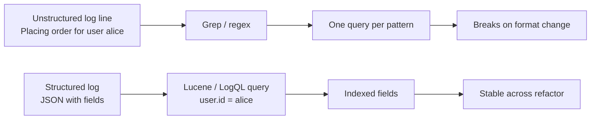
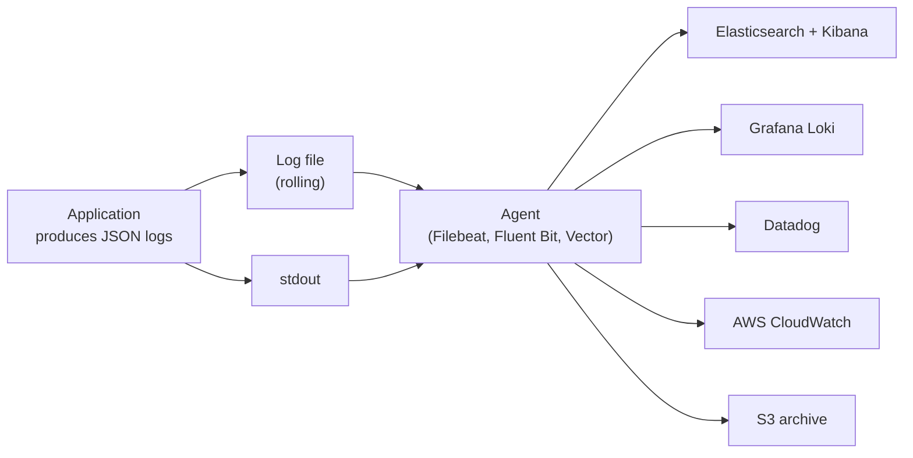

# Structured Logging and JSON Logs

## Overview

A traditional log line is a string formatted for a human reader: `2024-05-20 14:32:11.456 INFO  OrderService  - Placing order for user alice sku SKU-1`. A human glancing at the log can read it; a machine cannot. To extract the user ID, you would write a regex that breaks the moment someone changes the message format. Structured logging flips this: each log event is a JSON document with named fields, and the message is just one field among many. The user ID, the SKU, the quantity, the request ID, the trace ID, the duration, the error code, and any other contextual data are first-class fields that downstream systems (Elasticsearch, Loki, Datadog, Splunk, CloudWatch) can index, filter, and aggregate without parsing.

This note covers structured logging from the ground up: what it is, why it matters, how it differs from unstructured logging, and how to implement it in Java with SLF4J 2.0's fluent API, Logback's `LogstashEncoder`, and Log4j 2's `JsonLayout` and `JsonTemplateLayout`. We then cover the MDC as a structured-logging channel, the `StructuredDataMessage` pattern, log shipping to ELK / Loki / Datadog, the JSON schema conventions that make downstream parsing reliable, and the OpenTelemetry log bridge that unifies structured logs with traces and metrics. We finish with a worked example that produces JSON logs ready for ingestion by Loki, plus a troubleshooting playbook for the most common structured logging failures.

## Background Knowledge

Recall the following from earlier notes:

- **SLF4J and the MDC** (Phase 12.1): the MDC is a per-thread key-value map that the framework includes in every log line. It is the natural carrier for request-scoped structured fields.
- **Records** (Phase 3): ideal for representing log event payloads because they have concise constructors and built-in accessors.
- **JSON** (Phase 8): the dominant wire format for structured logs.
- **Try with resources** (Phase 5): the structured logging pattern benefits from try-with-resources for MDC scope.
- **Virtual threads** (Phase 7.9): the MDC works correctly per virtual thread but must be propagated manually across structured task scopes.

## Why Structured Logging



Unstructured logging forces the consumer (you, your log aggregator, your alerting system) to parse strings. Parsing is brittle: a one-character change in the message breaks every downstream query. Structured logging eliminates parsing by emitting each field as a separate JSON property. The message is still there for humans, but every machine-readable fact is a field.

### The Concrete Difference

Unstructured:

```
2024-05-20T14:32:11.456Z INFO  c.e.OrderService  - Placing order for user alice sku SKU-1 quantity 2 amount 10.00
```

Structured (pretty-printed for readability; in production it is one line):

```json
{
  "@timestamp": "2024-05-20T14:32:11.456Z",
  "level": "INFO",
  "logger": "com.example.OrderService",
  "thread": "http-nio-8080-exec-1",
  "message": "Placing order",
  "user.id": "alice",
  "order.sku": "SKU-1",
  "order.quantity": 2,
  "order.amount": "10.00",
  "request.id": "a1b2c3",
  "trace.id": "4f8e9a7b6c5d4e3f"
}
```

With structured logs, the query "show me all orders from alice in the last hour with amount > 100" becomes a Lucene query: `user.id:alice AND order.amount:>100 AND @timestamp:[now-1h TO now]`. With unstructured logs, the same query requires a regex that matches the message format and may produce false positives when the message changes.

## SLF4J 2.0 Fluent API for Structured Logging

SLF4J 2.0 introduced the fluent API, which supports key-value pairs via `addKeyValue`:

```java
import org.slf4j.Logger;
import org.slf4j.LoggerFactory;

public class OrderService {

    private static final Logger LOG = LoggerFactory.getLogger(OrderService.class);

    public void placeOrder(Order order) {
        LOG.atInfo()
           .setMessage("Placing order")
           .addKeyValue("user.id", order.userId())
           .addKeyValue("order.sku", order.sku())
           .addKeyValue("order.quantity", order.quantity())
           .addKeyValue("order.amount", order.amount().toString())
           .log();
    }
}
```

The `addKeyValue` method takes a `String` key and an `Object` value. The value's `toString` is called when the message is rendered. For complex values, supply a `Supplier` to defer evaluation:

```java
LOG.atInfo()
   .setMessage("Order processed")
   .addKeyValue("order.id", order.id())
   .addKeyValue("processing.duration.ms", () -> System.currentTimeMillis() - start)
   .log();
```

The key-value pairs flow through to the backend's encoder, which can render them as JSON fields.

## Logback with LogstashEncoder

The `logstash-logback-encoder` library is the de facto standard for structured logging with Logback. It produces JSON with the standard fields (`@timestamp`, `level`, `logger`, `thread`, `message`) plus any MDC entries, markers, and key-value pairs.

### Dependency

```xml
<dependency>
    <groupId>net.logstash.logback</groupId>
    <artifactId>logstash-logback-encoder</artifactId>
    <version>7.4</version>
</dependency>
```

### Configuration

```xml
<configuration>
    <appender name="JSON" class="ch.qos.logback.core.ConsoleAppender">
        <encoder class="net.logstash.logback.encoder.LogstashEncoder">
            <customFields>{"app":"order-service","env":"prod"}</customFields>
            <fieldNames>
                <timestamp>@timestamp</timestamp>
                <message>message</message>
                <level>level</level>
                <logger>logger</logger>
                <thread>thread</thread>
            </fieldNames>
            <throwableConverter class="net.logstash.logback.stacktrace.ShortenedThrowableConverter">
                <maxDepthPerThrowable>30</maxDepthPerThrowable>
                <shortenedClassNameLength>20</shortenedClassNameLength>
            </throwableConverter>
        </encoder>
    </appender>

    <root level="INFO">
        <appender-ref ref="JSON"/>
    </root>
</configuration>
```

The `customFields` element adds static fields to every log event (application name, environment). The `fieldNames` element renames the standard fields to your preferred convention. The `throwableConverter` controls how stack traces are formatted (as a JSON array of frames rather than a single multi-line string).

### Output

With the configuration above, the earlier `OrderService.placeOrder` produces:

```json
{"@timestamp":"2024-05-20T14:32:11.456Z","level":"INFO","logger":"com.example.OrderService","thread":"http-nio-8080-exec-1","message":"Placing order","app":"order-service","env":"prod","user.id":"alice","order.sku":"SKU-1","order.quantity":2,"order.amount":"10.00"}
```

One line per event. The downstream log aggregator (Loki, Elasticsearch, Datadog) ingests the JSON, indexes every field, and exposes them as queryable.

### MDC Fields

The `LogstashEncoder` automatically includes every MDC entry as a JSON field. Combined with the request-scoped MDC pattern from the previous note, every log event from the same HTTP request carries the same `request.id`, `trace.id`, and `user.id`.

```java
import org.slf4j.MDC;

try (var ignored = MDC.putCloseable("request.id", requestId)) {
    LOG.atInfo()
       .setMessage("Placing order")
       .addKeyValue("order.sku", order.sku())
       .log();
    // MDC fields appear in every log line within this block
}
```

### StructuredArguments

The `StructuredArguments.kv` and `StructuredArguments.entries` helpers produce fields that the encoder treats as JSON properties rather than as message arguments:

```java
import static net.logstash.logback.argument.StructuredArguments.kv;
import static net.logstash.logback.argument.StructuredArguments.entries;

LOG.info("Order placed {} {}", kv("order.sku", order.sku()), kv("order.quantity", order.quantity()));

var orderMap = new java.util.LinkedHashMap<String, Object>();
orderMap.put("user.id", order.userId());
orderMap.put("order.sku", order.sku());
LOG.info("Order details {}", entries(orderMap));
```

The `kv` helper produces a single key-value field; the `entries` helper flattens a map into multiple fields. Both are useful when you cannot use the fluent API (for example, in a codebase still on SLF4J 1.7.x).

## Log4j 2 with JsonLayout and JsonTemplateLayout

Log4j 2 ships two JSON encoders. The legacy `JsonLayout` produces a complete JSON object per event. The newer `JsonTemplateLayout` (introduced in 2.14) uses a JSON template with placeholders, which is more efficient and supports the Elastic Common Schema (ECS) out of the box.

### JsonLayout Configuration

```xml
<Console name="JSON" target="SYSTEM_OUT">
    <JsonLayout compact="true" eventEol="true" properties="true" locationInfo="false">
        <KeyValuePair key="app" value="order-service"/>
        <KeyValuePair key="env" value="prod"/>
    </JsonLayout>
</Console>
```

The `compact` attribute produces one line per event. The `properties` attribute includes the MDC entries. `KeyValuePair` adds static fields.

### JsonTemplateLayout Configuration (recommended)

```xml
<Console name="JSON" target="SYSTEM_OUT">
    <JsonTemplateLayout eventTemplateUri="classpath:EcsLayout.json"/>
</Console>
```

The `JsonTemplateLayout` is significantly faster than `JsonLayout` because it pre-compiles the template into a sequence of field resolvers that write directly to the output buffer. The ECS template produces events that match the Elastic Common Schema, which is the standard field naming convention for the Elastic stack.

### ECS Output

```json
{"@timestamp":"2024-05-20T14:32:11.456Z","log.level":"INFO","log.logger":"com.example.OrderService","process.thread.name":"http-nio-8080-exec-1","message":"Placing order","service.name":"order-service","user.id":"alice","order.sku":"SKU-1","order.quantity":2}
```

The ECS field names use dotted notation (`log.level`, `process.thread.name`, `service.name`) which Elastic indexes naturally. The schema is documented at https://www.elastic.co/guide/en/ecs/current/ecs-reference.html.

## Field Naming Conventions

A structured logging schema is a contract between the application and the downstream consumers. Inconsistent field names break queries. Adopt a convention and enforce it. Common conventions:

| Convention | Example | When to use |
|---|---|---|
| Flat underscore | `user id` style with underscore separator, e.g. `user id` written as `user id` in code | Simple, lowercase, easy to type. Common in older systems. |
| Dotted | `user.id`, `order.sku` | Hierarchical, matches Elastic Common Schema. Recommended. |
| Camel case | `userId`, `orderSku` | Matches Java field names. Common but mixes with dotted fields awkwardly. |
| Prefix per service | `orders.user.id`, `payments.amount` | Multi-service log streams where the same field name may mean different things. |

Recommendation: adopt the Elastic Common Schema (ECS) for standard fields (`@timestamp`, `log.level`, `service.name`, `user.id`, `trace.id`) and add custom fields with dotted notation that includes a service prefix.

## The MDC as a Structured Logging Channel

The MDC is the right place for request-scoped context that should appear on every log event from the same request. The pattern is:

1. Set MDC fields at the start of the request (in a servlet filter, a Spring interceptor, or a gRPC interceptor).
2. Log normally throughout the request; every event includes the MDC fields.
3. Clear the MDC at the end of the request.

```java
import jakarta.servlet.*;
import jakarta.servlet.http.*;
import org.slf4j.MDC;
import org.slf4j.Logger;
import org.slf4j.LoggerFactory;
import java.io.IOException;
import java.util.UUID;

public class StructuredLoggingFilter implements Filter {

    private static final Logger LOG = LoggerFactory.getLogger(StructuredLoggingFilter.class);

    @Override
    public void doFilter(ServletRequest req, ServletResponse res, FilterChain chain)
            throws IOException, ServletException {
        var httpRequest = (HttpServletRequest) req;
        var requestId = firstNonBlank(httpRequest.getHeader("X-Request-Id"),
                                     UUID.randomUUID().toString());
        var traceId = firstNonBlank(httpRequest.getHeader("traceparent"),
                                    UUID.randomUUID().toString());
        var userId = extractUserId(httpRequest);

        long start = System.nanoTime();
        try (var r = MDC.putCloseable("request.id", requestId);
             var t = MDC.putCloseable("trace.id", traceId);
             var u = MDC.putCloseable("user.id", userId)) {
            chain.doFilter(req, res);
        } finally {
            long durationMs = (System.nanoTime() - start) / 1_000_000;
            int status = ((HttpServletResponse) res).getStatus();
            LOG.atInfo()
               .setMessage("Request completed")
               .addKeyValue("http.method", httpRequest.getMethod())
               .addKeyValue("http.path", httpRequest.getRequestURI())
               .addKeyValue("http.status", status)
               .addKeyValue("http.duration.ms", durationMs)
               .log();
        }
    }

    private String firstNonBlank(String a, String b) {
        return (a != null && !a.isBlank()) ? a : b;
    }
    private String extractUserId(HttpServletRequest req) {
        var auth = req.getHeader("Authorization");
        if (auth == null || !auth.startsWith("Bearer ")) return "anonymous";
        return parseUserId(auth.substring(7));
    }
    private String parseUserId(String jwt) { /* parse JWT subject */ return "alice"; }
}
```

Every log event within the filter's scope automatically includes `request.id`, `trace.id`, and `user.id`. The summary log at the end of the request adds the HTTP-specific fields. Downstream, you can query `trace.id:4f8e9a7b6c5d4e3f` to retrieve every log event from that request.

## StructuredDataMessage and Event Messages

Some log events are not free-text messages but structured events: an order was placed, a payment was refunded, a user was created. These deserve first-class treatment as typed objects rather than as formatted strings.

### Pattern: A Log Event as a Record

```java
public record OrderPlacedEvent(String userId, String sku, int quantity,
                               java.math.BigDecimal amount, java.time.Instant at) {}

public class OrderService {
    private static final Logger LOG = LoggerFactory.getLogger(OrderService.class);

    public void placeOrder(Order order) {
        var event = new OrderPlacedEvent(order.userId(), order.sku(), order.quantity(),
                                         order.amount(), java.time.Instant.now());
        LOG.atInfo()
           .setMessage("order.placed")
           .addKeyValue("event.type", "order.placed")
           .addKeyValue("user.id", event.userId())
           .addKeyValue("order.sku", event.sku())
           .addKeyValue("order.quantity", event.quantity())
           .addKeyValue("order.amount", event.amount().toString())
           .addKeyValue("event.at", event.at().toString())
           .log();
    }
}
```

The `event.type` field lets downstream systems filter by event type without parsing the message. The `order.placed` message itself is now a constant string (the event type), so the message format never changes and downstream queries are stable.

### The Marker-Based Alternative

Some teams use Markers to tag events rather than a field:

```java
import org.slf4j.Marker;
import org.slf4j.MarkerFactory;

private static final Marker ORDER_PLACED = MarkerFactory.getMarker("order.placed");

LOG.info(ORDER_PLACED, "Order placed for user {}", order.userId());
```

This works but mixes the event type with the marker mechanism, which was designed for routing rather than typing. The `event.type` field approach is more flexible and works better with JSON encoders that may or may not include markers.

## Log Shipping

Producing JSON logs is half the job. The other half is shipping them to a centralised system where they can be searched and alerted on.

### Common Destinations



The two dominant architectures are:

1. **Application writes to file; an agent ships the file.** This decouples the application from the log infrastructure. The application writes JSON to a rolling file; a sidecar agent (Filebeat, Fluent Bit, Vector) tails the file and ships to the destination. The application does not block on the network.

2. **Application writes to stdout; the container runtime captures stdout.** This is the standard pattern for containerised applications (Kubernetes, ECS). The container runtime captures stdout and routes it to the log driver (json-file, journald, fluentd). A daemon-set agent collects from every node and ships to the destination.

### Direct Shipping via Appender

For applications where the agent is not available (or for low-volume logs), a direct appender that writes to the destination avoids the intermediate hop. Examples:

- The `logstash-logback-encoder` ships an `appender` that writes directly to Logstash via TCP or HTTP.
- The `log4j2-loki-appender` writes directly to Grafana Loki.
- AWS CloudWatch has a Log4j 2 appender in the `amazon-cloudwatch-log4j2` library.

The tradeoff is that a direct appender makes the application depend on the destination's availability. If the destination is down, logs are dropped (or buffered, depending on the appender's configuration). The agent-based approach decouples the application from the destination.

## ELK Stack

The ELK stack (Elasticsearch, Logstash, Kibana) is the dominant log aggregation system. Filebeat ships logs to Logstash (or directly to Elasticsearch); Logstash parses and enriches; Elasticsearch indexes; Kibana queries and visualises.

With structured JSON logs, Logstash's role shrinks to a thin router because no parsing is needed: the JSON is already structured. The Filebeat configuration is minimal:

```yaml
filebeat.inputs:
  - type: log
    paths:
      - /var/log/app/*.log
    json.keys_under_root: true
    json.overwrite_keys: true

output.elasticsearch:
  hosts: ["http://elasticsearch:9200"]
  indices:
    - index: "app-logs-%{[agent][version]}-%{+yyyy.MM.dd}"
```

The `keys under root` option (refer to the Filebeat YAML code block above; the option key uses underscore-separated words) flattens the JSON into the top-level event. Every field becomes queryable.

## Grafana Loki

Loki is a horizontally scalable, highly available log aggregation system inspired by Prometheus. Unlike Elasticsearch, Loki does not index the full content of every log line; it indexes only a small set of labels (typically the application name, the environment, the trace ID). The log content itself is stored compressed and is queried on demand.

Loki is much cheaper to operate than Elasticsearch because the index is small. The tradeoff is that queries that filter on un-indexed fields are slower because Loki must scan the log content.

The Loki log4j2 appender or the Logback appender writes directly to Loki via HTTP push. With JSON logs, you can use LogQL (Loki's query language) with JSON parsing:

```
{app="order-service"} | json | order.amount > "100" | line_format "{{.message}}"
```

The `| json` stage parses the log line as JSON. Subsequent stages can filter on any field.

## Datadog and Other SaaS Log Aggregators

SaaS log aggregators (Datadog, Splunk, Sumo Logic, New Relic) generally accept JSON via their agent or via HTTP. The agent tails the log file (or captures stdout) and ships to the SaaS. The JSON fields become facets that you can filter and aggregate on in the SaaS's UI.

The field naming convention matters more for SaaS aggregators because they often provide out-of-the-box dashboards that expect specific field names. Datadog's standard attributes include `host`, `service`, `env`, `version`, the trace and span ID fields (often written with an underscore separator inside Datadog's own UI), `http.method`, the HTTP status code field, and `http.url`. Adopting these names gives you the dashboards for free.

## OpenTelemetry Log Bridge

OpenTelemetry is the CNCF standard for observability. It defines three pillars: traces, metrics, and logs. The log bridge is the newest addition (stable as of 2023) and provides a `LogRecordEmitter` API that backends can implement. The key benefit is that logs emitted via the OpenTelemetry log bridge automatically include the active trace and span IDs, so log events appear inline with the trace in observability UIs.

```java
import io.opentelemetry.api.logs.Logger;
import io.opentelemetry.api.logs.Severity;
import io.opentelemetry.api.GlobalOpenTelemetry;
import io.opentelemetry.context.Context;

public class OrderService {

    private static final Logger LOGGER =
        GlobalOpenTelemetry.getLogsBridge()
            .loggerBuilder("com.example.OrderService")
            .build();

    public void placeOrder(Order order, Context context) {
        var record = LOGGER.logRecordBuilder()
            .setSeverity(Severity.INFO)
            .setBody("Placing order")
            .setAttribute("user.id", order.userId())
            .setAttribute("order.sku", order.sku())
            .setAttribute("order.quantity", order.quantity())
            .setContext(context)
            .emit();
    }
}
```

The `setContext(context)` call attaches the active trace context to the log record. The downstream backend (Jaeger, Tempo, Datadog, Honeycomb) renders the log event inline with the trace.

In practice, the OpenTelemetry log bridge is used by the SLF4J 2.0 OTel appender, which intercepts SLF4J log events and forwards them as OTel log records. Application code stays against SLF4J; the OTel appender is added as a dependency and configured once.

## Worked Example: A Complete Structured Logging Setup

### pom.xml

```xml
<dependencies>
    <dependency>
        <groupId>org.slf4j</groupId>
        <artifactId>slf4j-api</artifactId>
        <version>2.0.13</version>
    </dependency>
    <dependency>
        <groupId>ch.qos.logback</groupId>
        <artifactId>logback-classic</artifactId>
        <version>1.5.6</version>
    </dependency>
    <dependency>
        <groupId>net.logstash.logback</groupId>
        <artifactId>logstash-logback-encoder</artifactId>
        <version>7.4</version>
    </dependency>
</dependencies>
```

### logback.xml

```xml
<configuration>
    <appender name="JSON" class="ch.qos.logback.core.ConsoleAppender">
        <encoder class="net.logstash.logback.encoder.LogstashEncoder">
            <customFields>{"app":"order-service","env":"prod"}</customFields>
            <fieldNames>
                <timestamp>@timestamp</timestamp>
                <version>[ignore]</version>
                <levelValue>[ignore]</levelValue>
            </fieldNames>
        </encoder>
    </appender>
    <root level="INFO">
        <appender-ref ref="JSON"/>
    </root>
</configuration>
```

### The Service

```java
public record Order(String userId, String sku, int quantity, java.math.BigDecimal amount) {}

public class OrderService {
    private static final Logger LOG = LoggerFactory.getLogger(OrderService.class);

    public Order placeOrder(Order order) {
        LOG.atInfo()
           .setMessage("order.placed")
           .addKeyValue("event.type", "order.placed")
           .addKeyValue("user.id", order.userId())
           .addKeyValue("order.sku", order.sku())
           .addKeyValue("order.quantity", order.quantity())
           .addKeyValue("order.amount", order.amount().toString())
           .log();
        return order;
    }
}
```

### The Output

```json
{"@timestamp":"2024-05-20T14:32:11.456Z","level":"INFO","logger":"com.example.OrderService","thread":"main","message":"order.placed","app":"order-service","env":"prod","event.type":"order.placed","user.id":"alice","order.sku":"SKU-1","order.quantity":2,"order.amount":"10.00"}
```

### Downstream Query (Loki LogQL)

```
{app="order-service"} | json | event_type = "order.placed" | order_quantity > 1
```

Note: Loki uses underscores in field names by default because JSON field names with dots can be ambiguous in LogQL. Either use underscore-separated field names (preferred for Loki) or wrap dotted names in quotes (`"order.sku"`).

## Common Pitfalls

1. **Mixing structured and unstructured appenders**. If some appenders in your configuration use the JSON encoder and others use a pattern layout, downstream consumers get a mix and cannot rely on either format. Pick one format per environment and stick with it.
2. **Logging sensitive data**. The structured encoder faithfully includes every MDC field and every key-value pair. If your MDC contains `Authorization` headers or password fields, they end up in the log file. Audit every MDC field.
3. **Using `toString()` on large objects**. `addKeyValue("order", order)` calls `order.toString()`. If `order` is a JPA entity with lazy-loaded associations, this triggers a database query. Use specific fields or a custom `toString` that excludes associations.
4. **Field name inconsistency**. One team logs the user ID under an underscore-separated name, another under a camel-case name, another under the dotted `user.id` form. Downstream queries break. Adopt a convention before the first line of structured logging code is written.
5. **Forgetting the MDC clear**. With thread pool reuse, the next request inherits the previous request's MDC. The audit log will show the wrong user ID. Always use `MDC.putCloseable` or `MDC.clear()` in a `finally`.
6. **Stack traces as single strings**. The default encoder writes the stack trace as a single multi-line `string` field, which downstream systems may struggle to parse. Use `ShortenedThrowableConverter` to write it as a JSON array of frames.
7. **Not pinning the schema version**. When you change the field names or add new fields, downstream queries that depend on the old names break. Use a schema version field (`schema.version: 2`) and document breaking changes.
8. **Asking the application to ship logs synchronously**. If the JSON appender writes to a network destination synchronously, every log call blocks the application thread. Always use an async appender and bound the queue.
9. **Not testing log output in CI**. The first time you see the actual JSON output should not be in production. Write a test that captures log output and asserts the JSON structure.
10. **Logging every event at INFO**. With structured logging, the temptation is to log everything because the fields are useful. Resist it. The volume of logs drives storage cost and query latency. Use DEBUG for diagnostic events that are disabled in production; reserve INFO for events an operator should see.

## Tips and Tricks

- Use the SLF4J 2.0 fluent API for any new log statement. The traditional `info(format, args)` API is still supported but does not compose with key-value pairs as cleanly.
- Pin a `service.name`, `service.version`, and `env` field on every event. These three fields let you filter by service and version, which is essential for debugging deployments.
- Use the ECS field names for standard fields. You get the Elastic dashboards for free and the names are familiar to anyone who has used the Elastic stack.
- Configure the `LogstashEncoder` with `<includeMdc>true</includeMdc>` (the default) and `<includeKeyValue>true</includeKeyValue>` so both channels flow into the JSON.
- For high-cardinality fields (user IDs, order IDs), consider whether they should be indexed. Elasticsearch indexes every field by default, which can blow up the index size for high-cardinality fields. Use a dynamic template to disable indexing on specific field patterns.
- Use a `ThrowableProxy` converter that writes the stack trace as a JSON array of frames. Each frame has `class`, `method`, `file`, `line`. This is much easier to query than a multi-line string.
- Adopt the OpenTelemetry log appender even if you do not yet use distributed tracing. When you do adopt tracing, your logs will automatically correlate without code changes.
- Write a unit test that captures log output using a `ListAppender` and asserts on the JSON structure. This catches regressions in field names before they reach production.
- For multi-service log streams, prefix custom fields with the service name (`orders.user.id`, `payments.amount`). This avoids collisions when logs from multiple services land in the same index.
- Use the Loki `json` stage and a Grafana dashboard with a `logs` panel for live tailing. Filter by `trace.id` to see every event from one request across every service.

## Interview Questions

**Q1: What is structured logging and how does it differ from unstructured logging?**

A: Structured logging emits each log event as a structured document (typically JSON) with named fields rather than as a free-text string. The message is one field among many; user IDs, request IDs, trace IDs, durations, and any other contextual data are separate fields. The difference is that downstream systems (Elasticsearch, Loki, Datadog) can index, filter, and aggregate on fields without parsing strings. Unstructured logging forces consumers to parse with regex, which breaks when the message format changes. Structured logging produces a stable schema that survives refactoring.

**Q2: How does SLF4J 2.0's fluent API support structured logging?**

A: The fluent API (`LOG.atInfo().setMessage(...).addKeyValue(...).log()`) lets you attach key-value pairs to each log event. The pairs flow through to the backend encoder, which renders them as JSON fields. The traditional `info(format, args)` API substitutes arguments into the message string but does not expose them as separate fields. The fluent API also supports `addArgument(Supplier)` for lazy evaluation and `addMarker` for routing.

**Q3: What is the role of the MDC in structured logging?**

A: The MDC carries request-scoped context that should appear on every log event from the same request. The application sets MDC fields at the start of a request (request ID, trace ID, user ID) and clears them at the end. The structured encoder includes every MDC entry as a JSON field on every log event within the scope. This means a developer does not have to remember to add `request.id` to every log statement; the filter does it once for the whole request.

**Q4: What is the LogstashEncoder and what does it produce?**

A: `LogstashEncoder` is a Logback encoder from the `logstash-logback-encoder` library. It produces JSON with the standard fields (`@timestamp`, `level`, `logger`, `thread`, `message`) plus every MDC entry, every key-value pair added via the fluent API or `StructuredArguments`, every marker, and the stack trace of any throwable. It is the de facto standard for structured logging with Logback. It is highly configurable: you can rename fields, add static fields, control stack trace formatting, and include or exclude specific channels.

**Q5: What is the Elastic Common Schema (ECS) and why does it matter?**

A: ECS is a standardised field naming convention defined by Elastic. It specifies names for common fields: `@timestamp`, `log.level`, `service.name`, `user.id`, `trace.id`, `http.method`, the HTTP response status code field (a dotted ECS field under the `http.response` namespace), and so on. Adopting ECS gives you out-of-the-box dashboards in Kibana, compatibility with other ECS-compliant tools, and a documented schema that other teams can reference. Log4j 2's `JsonTemplateLayout` ships an ECS template that produces ECS-compliant events.

**Q6: What is the difference between `JsonLayout` and `JsonTemplateLayout` in Log4j 2?**

A: `JsonLayout` is the legacy JSON encoder. It produces a complete JSON object per event but builds it via reflection and string concatenation, which is slow. `JsonTemplateLayout` (introduced in Log4j 2.14) uses a JSON template with placeholders that are resolved by pre-compiled field resolvers. It is significantly faster and supports the Elastic Common Schema out of the box via a built-in template. Use `JsonTemplateLayout` for any new project.

**Q7: How do you ensure MDC fields are cleaned up when a thread is reused?**

A: Use `MDC.putCloseable(key, value)` which returns an `AutoCloseable` that removes the key when closed in a try-with-resources block. For multiple keys, set them all and call `MDC.clear()` in a `finally` block. The pattern is essential in servlet filters, Spring interceptors, and any thread-pool-executed task. Without cleanup, the next request on the same thread inherits the previous request's MDC, which produces misleading audit logs.

**Q8: What is log shipping and what are the two main architectures?**

A: Log shipping is the process of moving logs from the application to a centralised system for storage and querying. The two architectures are: (1) application writes to a file, an agent (Filebeat, Fluent Bit, Vector) tails the file and ships to the destination; (2) application writes to stdout, the container runtime captures stdout and routes it to the log driver, a daemon-set agent collects from every node. The first decouples the application from the destination and survives destination outages. The second is the standard pattern for containerised applications and requires no application-side configuration.

**Q9: How does Grafana Loki differ from Elasticsearch for log storage?**

A: Elasticsearch indexes the full content of every log line, which makes arbitrary field queries fast but expensive (large index, high memory). Loki indexes only a small set of labels (typically application, environment, trace ID) and stores the log content compressed, querying it on demand. Loki is much cheaper to operate because the index is small. The tradeoff is that queries filtering on un-indexed fields must scan the log content, which is slower. Choose Loki for cost-sensitive deployments where the typical query is "show me logs for this trace ID"; choose Elasticsearch for full-text search.

**Q10: How does the OpenTelemetry log bridge correlate logs with traces?**

A: The OTel log bridge attaches the active trace context (trace ID and span ID) to every log record. When the backend renders a trace, it shows the log events inline with the spans, so you can see exactly what happened at each step of a distributed request. In practice, the OTel SLF4J 2.0 appender intercepts SLF4J log events, reads the active trace context from the OTel context, and forwards the log record with the trace and span IDs attached. Application code stays against SLF4J; the OTel appender is added as a dependency and configured once.

**Q11: What is the `event.type` pattern and why use it?**

A: The `event.type` field is a constant string that identifies the kind of event (`order.placed`, `payment.refunded`, `user.created`). The message itself becomes the event type, so it never changes; downstream queries filter on `event.type:order.placed` rather than parsing the message. This pattern turns free-text log messages into typed events, which is the foundation of event-driven observability. The pattern is most useful for business events that downstream systems (analytics, billing) consume.

**Q12: How do you prevent sensitive data from leaking into structured logs?**

A: Three layers of defence. (1) Never put secrets in the MDC. Audit every MDC field. (2) Implement a custom `Converter` or `JsonProvider` that masks known-sensitive field names (password, token, authorization) by replacing their values with `***`. (3) Configure the structured encoder with a deny-list of field names that are excluded from the JSON output. None of these is a substitute for not logging the secret in the first place; they are backstops.

**Q13: What is the performance impact of structured logging versus unstructured?**

A: Structured logging is generally faster than unstructured because the JSON encoder writes directly to a byte buffer with no string interpolation. The dominant cost is the MDC copy and the field serialisation, both of which are O(1) per event. For high-throughput applications, the Log4j 2 `JsonTemplateLayout` with async loggers can sustain millions of events per second on a single core. The main performance risk is the `toString()` call on large object arguments; defer with `Supplier` or log only specific fields.

**Q14: How do you test structured log output?**

A: Use a `ListAppender` (Logback) or a custom appender that captures events into a list. In the test, configure the appender with the JSON encoder, log an event, then assert on the JSON output. Parse the JSON with Jackson and assert on specific fields. This catches regressions in field names and structure before they reach production. For integration tests, capture stdout and parse the JSON lines.

**Q15: What are the tradeoffs of direct appender shipping versus agent-based shipping?**

A: Direct shipping (the application writes to the destination via an appender) is simpler: no agent to install or configure. It is appropriate for low-volume logs or for environments where the agent is not available (serverless functions). The tradeoff is that the application depends on the destination's availability; if the destination is down, logs are dropped or buffered. Agent-based shipping (the application writes to a file or stdout; an agent ships to the destination) decouples the application from the destination and survives destination outages. It is the standard pattern for long-running server-side applications.

## Summary

Structured logging replaces free-text log lines with JSON documents that have named fields. SLF4J 2.0's fluent API supports key-value pairs that flow through to the backend encoder. Logback's `LogstashEncoder` and Log4j 2's `JsonTemplateLayout` produce JSON with the standard fields plus every MDC entry, key-value pair, and marker. The MDC is the natural channel for request-scoped context. The `event.type` pattern turns free-text messages into typed events. The OpenTelemetry log bridge correlates logs with traces by attaching the active trace context to every log record. Log shipping moves logs from the application to a centralised system, either via an agent (Filebeat, Fluent Bit) that tails a file or stdout, or via a direct appender. Field naming conventions (preferably Elastic Common Schema) make downstream queries stable across refactoring. With structured logging in place, the next note covers log levels, performance, and distributed tracing, which together complete the observability story.
