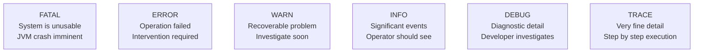
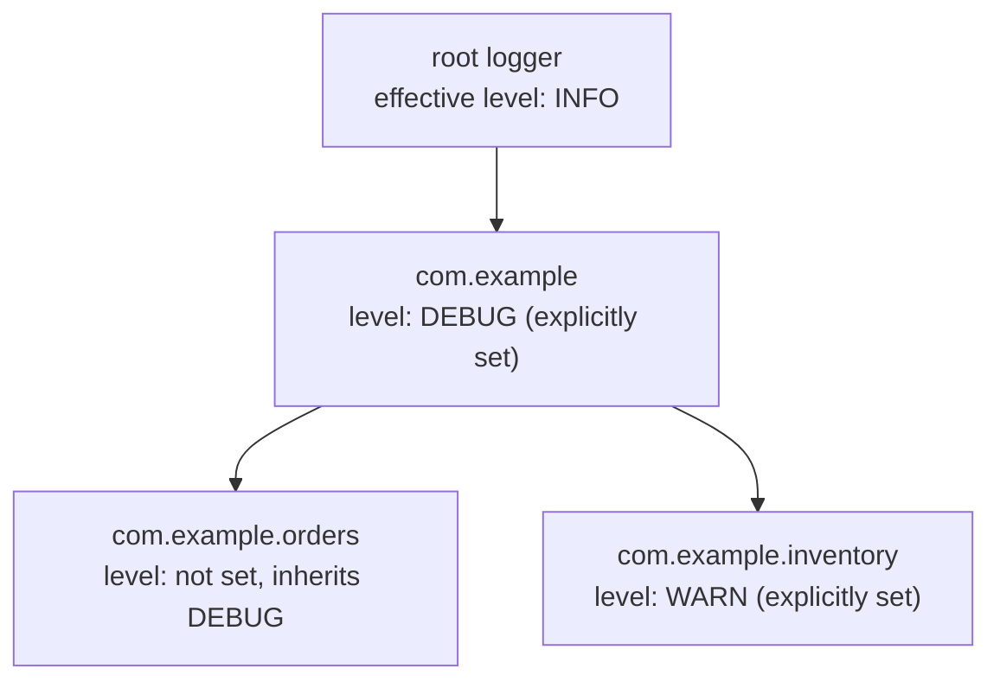
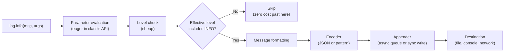
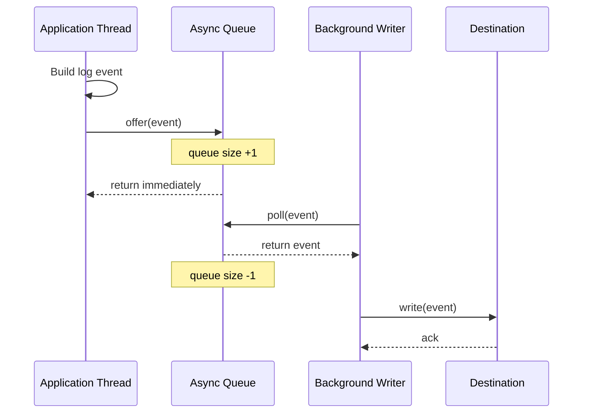
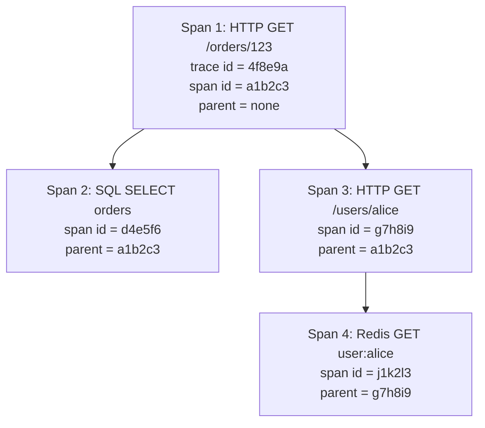
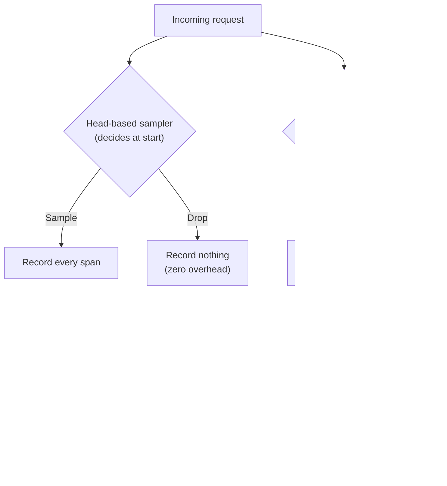
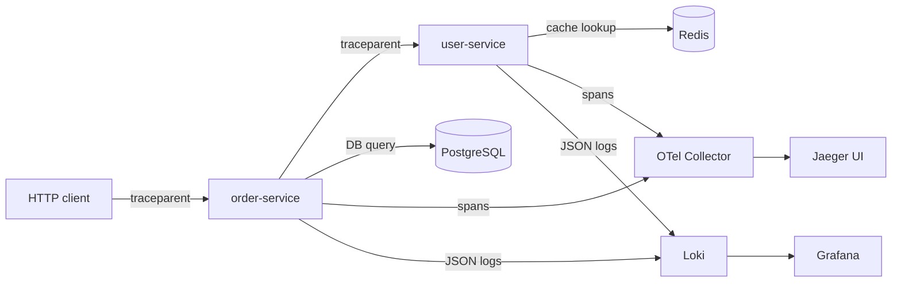

# Log Levels Performance and Tracing

## Overview

Logging is a critical observability tool, but it is also a critical performance factor. A naive logging strategy can consume single-digit percentages of CPU, hundreds of megabytes of disk per hour, and several percent of network bandwidth. A thoughtful strategy produces the same observability at a fraction of the cost. The levers are: log levels (which messages are emitted), performance (how efficiently they are emitted), and tracing (how a single request is followed across service boundaries). Each lever interacts with the others: lowering the log level reduces volume but may hide the trace context; async appenders improve throughput but may drop events under load; distributed tracing requires propagating context, which adds overhead to every log line.

This note covers the standard log levels (TRACE, DEBUG, INFO, WARN, ERROR, FATAL) and when to use each. It then covers the performance characteristics of logging: the cost of parameter evaluation, the cost of string concatenation, the cost of MDC propagation, the cost of disk I/O, and the patterns that minimise them (lazy evaluation, async appenders, the LMAX Disruptor, ring buffers, batched writes). It then covers distributed tracing in depth: trace IDs and span IDs, the W3C Trace Context header, OpenTelemetry's tracer and span APIs, automatic and manual instrumentation, sampling (head-based versus tail-based), the integration between tracing and logging, and Spring Cloud Sleuth (now superseded by Micrometer Tracing). The note closes with a worked example that produces correlated logs and traces across two services.

## Background Knowledge

Recall the following from earlier notes:

- **SLF4J and the MDC** (Phase 12.1): the MDC carries request-scoped context that the framework includes in every log line.
- **Structured logging** (Phase 12.2): JSON logs with named fields are the foundation of machine-readable observability.
- **Virtual threads** (Phase 7.9): the MDC must be propagated manually across structured task scopes.
- **CompletableFuture** (Phase 7.3): tracing context must be propagated explicitly across async boundaries.
- **Lambda expressions** (Phase 6): SLF4J 2.0's fluent API uses `Supplier` for lazy evaluation.

## Log Levels

### The Six Standard Levels



| Level | When to use | Example |
|---|---|---|
| ERROR | An operation failed and the system cannot recover without intervention. The on-call engineer should be paged. | "Failed to charge payment for order 1234: gateway timeout" |
| WARN | Something unexpected happened but the system recovered. The on-call engineer should investigate during business hours. | "Retried DB query 3 times before succeeding" |
| INFO | A significant business or operational event. The on-call engineer should see it in the log but does not need to act. | "Order 1234 placed by user alice for 10.00 USD" |
| DEBUG | Diagnostic detail useful during development or for troubleshooting a known issue. Disabled in production. | "Querying user repo with filter: name = alice" |
| TRACE | Very fine-grained detail, typically per-step execution. Disabled in production; enabled only when reproducing a specific bug. | "Row 1 fetched: User{id=1, name=alice}" |
| FATAL | The system is about to crash or is in an unrecoverable state. Rare; in modern Java this is usually folded into ERROR. | "Out of memory, attempting to dump heap and exit" |

### Choosing a Level

The right level for a log statement is the level the on-call engineer would want to see it at. If a log line describes a business event that the engineer cares about during a normal day, it is INFO. If it describes a problem the engineer must address now, it is ERROR. If it describes a problem the engineer should investigate soon, it is WARN. If it is useful only during development or for reproducing a known bug, it is DEBUG. If it is per-step execution detail, it is TRACE.

A common mistake is to log every exception at ERROR. Many exceptions are recoverable: a network blip that the retry mechanism handled, a validation failure that the user was shown. These should be WARN or even DEBUG. Reserve ERROR for situations that need human attention right now.

### Effective Level

Each logger has an effective level: the level of the logger itself, or the level of the nearest ancestor that has a level set, or the root level. The effective level determines whether a log statement at a given level is emitted.



If you set `com.example` to DEBUG, every logger under that package inherits DEBUG unless overridden. Setting `com.example.inventory` to WARN raises it back to WARN. The root logger's level applies to every logger that does not have an explicit ancestor level.

### Per-Environment Levels

A typical configuration:

| Environment | Root level | Application level | Framework level |
|---|---|---|---|
| Local development | DEBUG | DEBUG | INFO |
| CI / test | INFO | INFO | WARN |
| Staging | INFO | INFO | WARN |
| Production | INFO | INFO | WARN |

DEBUG in production is rare because the volume is too high. The exception is a specific logger for a known issue: set `com.example.orders.checkout` to DEBUG temporarily while debugging a checkout bug, then revert. Some teams use a runtime log level API (Spring Boot's `LoggingSystem` or Logback's `JMXConfigurator`) to change levels without redeploying.

## Performance Characteristics of Logging

### The Cost Components

Every log statement has five cost components:

1. **Parameter evaluation**: the cost of evaluating the arguments passed to the log method. `LOG.info("Got {}", expensiveCompute())` evaluates `expensiveCompute()` eagerly.
2. **Level check**: the cost of comparing the log level to the logger's effective level. A few nanoseconds.
3. **Message formatting**: the cost of substituting parameters into the format string. Deferred until the message is emitted.
4. **Encoder cost**: the cost of formatting the log event (JSON, pattern). Dominated by string operations.
5. **Appender cost**: the cost of writing to the destination (console, file, network). Dominated by I/O.



### Lazy Parameter Evaluation

Even when the level filter rejects the message, the parameters are evaluated. With the classic API:

```java
// Anti-pattern: expensiveCompute() runs even if DEBUG is disabled
LOG.debug("Result: {}", expensiveCompute());

// Classic guard: works but verbose
if (LOG.isDebugEnabled()) {
    LOG.debug("Result: {}", expensiveCompute());
}

// Modern SLF4J 2.0: supplier defers evaluation
LOG.atDebug().addArgument(() -> expensiveCompute()).log("Result: {}");
// Or:
LOG.atDebug().log(() -> "Result: " + expensiveCompute());
```

The supplier form is preferred for new code. The classic guard is still useful when multiple log statements share the same expensive precondition.

### String Concatenation versus Parameterised Messages

```java
// Bad: string is built even if INFO is disabled
LOG.info("Order " + order.getId() + " placed");

// Good: parameters are substituted only if INFO is enabled
LOG.info("Order {} placed", order.getId());
```

The parameterised form defers the substitution. The cost of building the argument array (passing `order.getId()` to the varargs method) is much less than the cost of concatenating the strings.

### MDC Propagation Cost

The MDC is a `ThreadLocal<Map<String, String>>`. The cost of an MDC `put` is the cost of a `HashMap.put` plus the cost of a `ThreadLocal` lookup, typically tens of nanoseconds. The cost of including the MDC in a log event is the cost of copying the map, which is O(n) in the number of MDC entries. For typical configurations (3 to 5 MDC entries), this is negligible. The cost grows linearly with the number of MDC entries; keep the MDC small.

### Console Appender versus File Appender

Console output (stdout) is buffered by the JVM but flushed on every newline in many configurations. Under high volume, the JVM can spend significant time in `BufferedWriter.write` and the OS can spend significant time in `write(2)` to the terminal or to the container runtime's log driver. For production, prefer a file appender with an async wrapper.

### Synchronous versus Asynchronous Appenders

A synchronous appender writes to the destination on the calling thread. The application thread blocks until the write completes. For a file appender, this is the disk I/O latency (microseconds on SSD, milliseconds on spinning disk). For a network appender, this is the network round trip (milliseconds). Under high volume, this is unacceptable.

An asynchronous appender queues events on a `BlockingQueue` (Logback) or a `Disruptor` ring buffer (Log4j 2) and writes them from a single background thread. The application thread pays only the cost of enqueuing (a few hundred nanoseconds). The tradeoff is that events may be dropped if the queue fills up and the policy is to drop rather than block.



### The LMAX Disruptor

Log4j 2's true async loggers use the LMAX Disruptor, a lock-free ring buffer designed for ultra-low-latency inter-thread messaging. The Disruptor avoids the lock contention of `BlockingQueue` by using a single-writer, single-reader ring buffer with sequence numbers. Multiple producer threads each claim a slot in the ring by atomically incrementing a sequence counter; the single consumer thread reads slots in sequence order. This achieves tens of millions of messages per second on a single core.

The tradeoff is the Disruptor dependency (an extra JAR) and configuration complexity. For most applications, Logback's `AsyncAppender` is sufficient; reach for the Disruptor only when logging is a measured bottleneck.

### Ring Buffer and Backpressure

Both `BlockingQueue` and the Disruptor have a fixed-size buffer. When the buffer is full, the appender must decide: block the producer (potentially stalling the application), drop the event (potentially losing important logs), or signal backpressure (which the application must handle). Logback's `AsyncAppender` defaults to dropping DEBUG and TRACE events when the queue is 80 percent full (`discardingThreshold`). Set `neverBlock=true` to always drop rather than block; this protects the application but loses events. Log4j 2's async loggers default to blocking the producer, which is safer for completeness but risks application stalls.

### Batched Writes

Some appenders batch writes: they accumulate events in an in-memory buffer and flush to the destination periodically or when the buffer reaches a size threshold. This reduces the per-event I/O cost because the destination is written once per batch rather than once per event. The Kafka appender in `log4j2-kafka` and the Elasticsearch appender in `log4j2-elasticsearch` both support batching. The tradeoff is latency: an event sits in the batch buffer until the flush, which can be hundreds of milliseconds.

## Distributed Tracing

### What Is a Trace

A trace is a tree of spans that represents the execution of a single request across multiple services. Each span has a name, a start time, a duration, a set of attributes, and a parent span ID. The root span represents the entire request; child spans represent sub-operations (a database query, an HTTP call to another service, a cache lookup).



The trace ID is the same for every span in the trace. The span ID is unique per span. The parent span ID links a child span to its parent. Together these three IDs reconstruct the tree.

### The W3C Trace Context Header

The W3C Trace Context specification defines the `traceparent` header that propagates the trace context across service boundaries:

```
traceparent: 00-4f8e9a7b6c5d4e3f2a1b0c9d8e7f6a5b-a1b2c3d4e5f60718-01
```

The format is `00-{trace-id}-{span-id}-{trace-flags}`. The `trace-id` is a 32-character hex string (16 bytes); the `span-id` is a 16-character hex string (8 bytes); the `trace-flags` is a 2-character hex string where the least significant bit indicates whether the trace is sampled. A downstream service that receives this header starts new spans as children of the parent span, propagating the same trace ID.

The companion `tracestate` header carries vendor-specific trace state in a comma-separated list of `key=value` pairs. It is rarely used directly by application code.

### OpenTelemetry Tracer and Span APIs

OpenTelemetry is the CNCF standard for observability. Its tracer API is the standard way to create and manage spans in modern Java applications.

```java
import io.opentelemetry.api.GlobalOpenTelemetry;
import io.opentelemetry.api.trace.Tracer;
import io.opentelemetry.api.trace.Span;
import io.opentelemetry.api.trace.StatusCode;
import io.opentelemetry.context.Scope;

public class OrderService {

    private static final Tracer TRACER =
        GlobalOpenTelemetry.getTracer("com.example.orders", "1.0.0");

    public Order getOrder(String orderId) {
        Span span = TRACER.spanBuilder("OrderService.getOrder")
            .setAttribute("order.id", orderId)
            .startSpan();
        try (Scope scope = span.makeCurrent()) {
            var order = repository.findById(orderId);
            if (order == null) {
                span.setStatus(StatusCode.ERROR, "Order not found");
                throw new OrderNotFoundException(orderId);
            }
            span.setAttribute("order.amount", order.amount().toString());
            return order;
        } catch (Exception e) {
            span.recordException(e);
            span.setStatus(StatusCode.ERROR, e.getMessage());
            throw e;
        } finally {
            span.end();
        }
    }
}
```

The pattern is: start a span, make it the current span (so children inherit), do work, record exceptions, set status, end the span. The `try-with-resources` on `Scope` ensures the span is restored to the parent when the block exits. The `finally` block ensures the span is ended even on exception.

### Automatic Instrumentation

Manually instrumenting every method is impractical. The OpenTelemetry Java agent (`opentelemetry-javaagent.jar`) attaches to the JVM via `-javaagent` and instruments bytecode at runtime. It automatically creates spans for HTTP requests, JDBC queries, Kafka producer and consumer calls, Redis commands, and many other libraries. The agent is the recommended approach for production applications: zero code changes, comprehensive coverage, and consistent attribute naming.

```bash
java -javaagent:opentelemetry-javaagent.jar \
     -Dotel.service.name=order-service \
     -Dotel.exporter.otlp.endpoint=http://otel-collector:4317 \
     -Dotel.traces.exporter=otlp \
     -jar order-service.jar
```

The agent ships the spans to an OpenTelemetry Collector, which forwards to Jaeger, Tempo, Datadog, Honeycomb, or any other OTLP-compatible backend.

### Manual Instrumentation

For spans that the agent cannot create automatically (business-logic spans), use the tracer API directly. Wrap the relevant method in a span as shown above. Use `setAttribute` to record business-relevant fields (order ID, user ID, amount). These attributes appear in the trace UI alongside the auto-instrumented spans.

### The @WithSpan Annotation

The OpenTelemetry Java agent ships the `opentelemetry-annotations` library, which provides the `@WithSpan` annotation. Annotate a method and the agent creates a span for it automatically:

```java
import io.opentelemetry.instrumentation.annotations.WithSpan;
import io.opentelemetry.instrumentation.annotations.SpanAttribute;

public class OrderService {

    @WithSpan("OrderService.getOrder")
    public Order getOrder(@SpanAttribute("order.id") String orderId) {
        return repository.findById(orderId);
    }
}
```

The `@WithSpan` annotation tells the agent to start a span when the method is entered and end it when the method returns. The `@SpanAttribute` annotation records the parameter as a span attribute. This is much more concise than the manual try-catch-finally pattern and is the recommended approach for business-logic spans.

### Sampling

A trace generates one or more spans per request. At high traffic, recording every trace is expensive: the backend must store and index them, and the application must pay the overhead of creating and exporting them. Sampling reduces the volume by recording only a fraction of traces.

Two sampling strategies:



**Head-based sampling** decides at the start of the request whether to sample. The decision is propagated via the `traceparent` header so that every service in the chain makes the same decision. The advantage is zero overhead for non-sampled traces (spans are not even created). The disadvantage is that you cannot decide based on the outcome: you sample a request before you know whether it succeeded or failed.

**Tail-based sampling** records every span in memory and decides at the end of the request whether to keep the trace. This lets you sample based on the outcome: keep 100 percent of error traces, 10 percent of slow traces, 1 percent of normal traces. The disadvantage is the memory cost (every span is buffered until the decision) and the latency (the trace is not visible in the backend until the request completes).

OpenTelemetry supports both. Head-based sampling is configured on the application via an OpenTelemetry agent property whose key is `otel.traces.sampler` (shown in the agent configuration code block earlier). Tail-based sampling is configured on the OpenTelemetry Collector via its tail-sampling processor (whose processor name in the collector YAML uses underscore-separated words), with policies for status code, latency, and ratio.

### Span Attributes versus Log Fields

Span attributes are part of the trace; log fields are part of the log event. The two should overlap but not duplicate. Put business-relevant identifiers (order ID, user ID, amount) in both, so that a trace can be found by a business identifier and a log event can be found by a trace ID. Put fine-grained detail (every SQL parameter, every cache hit or miss) only in the logs; traces should be a high-level summary.

### Correlating Logs and Traces

The integration between logging and tracing is the trace ID. Every log event from a request should carry the same trace ID as the trace. When a developer sees a slow span in the trace UI, they can copy the trace ID and paste it into the log aggregator to see every log event from that request.

The OpenTelemetry SLF4J 2.0 appender (`opentelemetry-logback-appender` or the auto-instrumented logback MDC) puts the trace ID and span ID into the MDC automatically. The structured encoder includes them as JSON fields. With this in place, every log event carries `trace.id` and `span.id` fields that downstream systems can correlate.

```java
import org.slf4j.MDC;

// The OpenTelemetry agent automatically puts the current trace and span IDs into the MDC
// under the keys "trace_id" and "span_id" (configurable via otel.instrumentation.logback-
// mdc.add-context-properties). No application code change is needed.

LOG.atInfo()
   .setMessage("Order placed")
   .addKeyValue("order.id", order.id())
   .log();
// Output JSON includes trace.id and span.id fields automatically
```

In the trace UI, you can see the log events inline with the spans. In the log aggregator, you can filter by `trace.id` to see every event from that trace.

### Spring Cloud Sleuth and Micrometer Tracing

Spring Cloud Sleuth was Spring's distributed tracing solution for many years. As of Spring Boot 3.0, Sleuth has been superseded by Micrometer Tracing, which is a thin abstraction over OpenTelemetry (or Brave, the older Zipkin client). The migration is largely automatic: depend on `micrometer-tracing-bridge-otel` and you get OpenTelemetry tracing with Spring Boot's auto-configuration.

```xml
<dependency>
    <groupId>io.micrometer</groupId>
    <artifactId>micrometer-tracing-bridge-otel</artifactId>
    <version>1.2.5</version>
</dependency>
<dependency>
    <groupId>io.opentelemetry</groupId>
    <artifactId>otlp-exporter</artifactId>
    <version>1.37.0</version>
</dependency>
```

In `application.properties`:

```properties
logging.pattern.level=%5p [${spring.application.name:},%X{traceId:-},%X{spanId:-}]
management.tracing.sampling.probability=1.0
management.endpoints.web.exposure.include=health,info,metrics,prometheus
management.otlp.tracing.endpoint=http://otel-collector:4318/v1/traces
```

The `logging.pattern.level` config adds the trace ID and span ID to every log line (via the MDC). The `management.tracing.sampling.probability` sets the head-based sampling probability (1.0 means sample everything; for production use 0.01 to 0.1). The `management.otlp.tracing.endpoint` configures where spans are exported.

## Worked Example: Two Services with Correlated Logs and Traces

### Architecture



The client sends a request to the order service. The order service queries Postgres and calls the user service to enrich the response. The user service looks up a cached user in Redis. Every span is exported to the OTel Collector, which forwards to Jaeger. Every log line is JSON with the trace ID, exported to Loki. In Grafana, you can pivot between the trace view (in Jaeger) and the log view (in Loki) by the trace ID.

### Order Service Handler

```java
import org.slf4j.Logger;
import org.slf4j.LoggerFactory;
import org.springframework.web.bind.annotation.*;
import org.springframework.web.client.RestClient;

@RestController
@RequestMapping("/orders")
public class OrderController {

    private static final Logger LOG = LoggerFactory.getLogger(OrderController.class);
    private final OrderRepository repo;
    private final RestClient userClient;

    public OrderController(OrderRepository repo, RestClient userClient) {
        this.repo = repo;
        this.userClient = userClient;
    }

    @GetMapping("/{id}")
    public OrderResponse getOrder(@PathVariable String id) {
        var order = repo.findById(id).orElseThrow();
        var user = userClient.get()
            .uri("/users/{name}", order.userId())
            .retrieve()
            .body(UserResponse.class);
        LOG.atInfo()
           .setMessage("Order retrieved")
           .addKeyValue("order.id", order.id())
           .addKeyValue("user.id", order.userId())
           .addKeyValue("order.amount", order.amount().toString())
           .log();
        return new OrderResponse(order, user);
    }
}
```

The Spring Boot auto-configuration (via Micrometer Tracing) propagates the `traceparent` header from the incoming request to the outgoing HTTP call to the user service. The OpenTelemetry agent instruments the JDBC call and the Redis call (in the user service) automatically. The `LOG.atInfo()` call produces a JSON log event that includes the trace ID (via the MDC, which the OTel appender populates).

### User Service Handler

```java
@RestController
@RequestMapping("/users")
public class UserController {

    private static final Logger LOG = LoggerFactory.getLogger(UserController.class);
    private final UserRepository repo;

    public UserController(UserRepository repo) { this.repo = repo; }

    @GetMapping("/{name}")
    public UserResponse getUser(@PathVariable String name) {
        var user = repo.findByName(name).orElseThrow();
        LOG.atInfo()
           .setMessage("User retrieved")
           .addKeyValue("user.id", user.id())
           .addKeyValue("user.name", user.name())
           .log();
        return new UserResponse(user);
    }
}
```

The user service receives the `traceparent` header from the order service, extracts the trace context, and starts its span as a child. Every log event from this request carries the same trace ID.

### The Resulting Trace in Jaeger

The trace shows the full call tree: the root span is the HTTP GET to `/orders/123`; its children are the JDBC query and the HTTP GET to `/users/alice`; the latter has a child span for the Redis lookup. Each span's attributes (order ID, user ID, amount) are visible in the trace detail. Each span's logs are visible inline (if the OTel log appender is configured to export logs as span events).

### The Resulting Logs in Loki

The Loki query filtering on the trace ID field (whose key in Loki uses an underscore separator by default) returns every log event from that trace, across both services, in time order. The query joins the trace view (which spans are there, what their durations are) with the log view (what each service logged at each point).

## Common Pitfalls

1. **Logging every exception at ERROR**. Most exceptions are recoverable. Reserve ERROR for situations that need immediate attention. Recovered exceptions should be WARN or DEBUG.
2. **DEBUG in production**. The volume of DEBUG logs is typically 10x the volume of INFO. Storage cost and query latency scale with volume. Use targeted DEBUG on a specific logger for a known issue, not globally.
3. **Synchronous network appenders**. A synchronous appender that writes to Kafka or Elasticsearch blocks the application thread on every log event. Always wrap a network appender in an async wrapper.
4. **Not testing the async appender's overflow behaviour**. Under load, the async queue may fill. The default policy (drop DEBUG and TRACE) may lose important diagnostic events. Test with realistic load and verify that critical events (ERROR, WARN) are not dropped.
5. **Forgetting to propagate the MDC across async boundaries**. `CompletableFuture.supplyAsync(...)` runs on a different thread; the MDC is empty there. Use `MDC.getCopyOfContextMap()` and `MDC.setContextMap(...)` to propagate manually, or use a custom `Executor` that wraps each task with MDC propagation.
6. **Not propagating the trace context across async boundaries**. The same problem applies to the OpenTelemetry context. Use `Context.current().wrap(...)` to wrap a `Runnable` or `Supplier` so that the OTel context propagates.
7. **Head-based sampling that drops error traces**. With head-based sampling at 1 percent, you sample only 1 percent of error traces too. Use tail-based sampling (in the OTel Collector) to keep 100 percent of error traces.
8. **Span explosion**. Creating a span per loop iteration or per database row creates enormous traces that are hard to read and expensive to store. Create spans at the operation level, not the iteration level.
9. **Span attributes that contain sensitive data**. Span attributes are stored in the tracing backend and may be visible to anyone with access. Audit every `setAttribute` call for credentials, PII, or other sensitive data.
10. **Not exporting logs and traces to the same backend**. If logs go to Loki and traces go to Jaeger, developers must pivot between two UIs to debug a problem. Use a single backend (Grafana with Loki and Tempo, or Datadog) that integrates the two.

## Tips and Tricks

- Set the root logger to INFO in production. Set individual package loggers to DEBUG only for known issues, and revert when the issue is resolved.
- Use the SLF4J 2.0 fluent API with `Supplier` arguments for any log statement that involves an expensive computation. The supplier is only invoked if the level is enabled.
- Wrap every file and network appender in an async wrapper. Tune the queue size to absorb bursts without blocking the application.
- Use the LMAX Disruptor (Log4j 2's async loggers) when logging is a measured bottleneck. Otherwise, Logback's `AsyncAppender` is sufficient.
- Set `totalSizeCap` on every rolling file appender. Without it, log files grow unbounded.
- Set the OpenTelemetry agent's sampler to the parent-based trace-ID-ratio-based sampler (whose value name uses underscore-separated words in the OTel configuration) with a ratio of 0.01 to 0.1 in production. Use tail-based sampling in the OTel Collector to keep 100 percent of error traces.
- Use `@WithSpan` and `@SpanAttribute` for business-logic spans. The agent handles the try-catch-finally boilerplate.
- Use Micrometer Tracing (not Spring Cloud Sleuth) for new Spring Boot 3+ projects. It is the supported path.
- Configure the log pattern to include the trace ID and span ID. In Spring Boot, `logging.pattern.level=%5p [${spring.application.name:},%X{traceId:-},%X{spanId:-}]` does this.
- Write a single dashboard that combines traces and logs filtered by trace ID. The ability to pivot between the two by a single identifier is the most valuable observability workflow you can build.

## Interview Questions

**Q1: What are the six standard log levels and when should each be used?**

A: TRACE for very fine-grained per-step detail, typically only when reproducing a specific bug. DEBUG for diagnostic detail useful during development or troubleshooting, disabled in production. INFO for significant business or operational events that the on-call engineer should see. WARN for recoverable problems that the on-call engineer should investigate during business hours. ERROR for failures that need immediate human attention. FATAL for situations where the system is about to crash or is in an unrecoverable state, rarely used in modern Java (folded into ERROR). The right level is the level the on-call engineer would want to see it at.

**Q2: What is the cost of a log statement when the level is disabled?**

A: The cost of the level check (a few nanoseconds) plus the cost of evaluating the arguments. With the classic SLF4J API, the arguments are evaluated eagerly even when the message is filtered: `LOG.debug("Got {}", expensiveCompute())` calls `expensiveCompute()` regardless of the level. The parameterised message form defers string concatenation but not argument evaluation. To defer argument evaluation, use the SLF4J 2.0 fluent API with `Supplier` arguments: `LOG.atDebug().addArgument(() -> expensiveCompute()).log("Got {}")` invokes the supplier only if DEBUG is enabled.

**Q3: Why is `LOG.info("Order " + order.getId() + " placed")` an anti-pattern?**

A: Because the string concatenation happens before the log method is called, regardless of whether INFO is enabled. Even if the level filter rejects the message, the JVM has already built the concatenated string, which is the dominant cost of logging. The parameterised form `LOG.info("Order {} placed", order.getId())` defers the substitution until after the level check, so the cost is only the argument evaluation (a method call) when the message is filtered.

**Q4: What is the difference between a synchronous and an asynchronous appender?**

A: A synchronous appender writes to the destination on the calling thread; the application thread blocks until the write completes. For a file appender this is disk I/O latency (microseconds on SSD); for a network appender this is the network round trip (milliseconds). An asynchronous appender queues events on an in-memory buffer and writes them from a background thread. The application thread pays only the cost of enqueuing (a few hundred nanoseconds). The tradeoff is that events may be dropped if the buffer fills and the policy is to drop rather than block.

**Q5: What is the LMAX Disruptor and why does Log4j 2 use it?**

A: The Disruptor is a lock-free ring buffer designed for ultra-low-latency inter-thread messaging. Multiple producer threads each claim a slot by atomically incrementing a sequence counter; a single consumer thread reads slots in sequence order. The Disruptor avoids the lock contention of `BlockingQueue`, which is the bottleneck of Logback's `AsyncAppender` under high concurrency. Log4j 2's true async loggers use the Disruptor to achieve tens of millions of messages per second on a single core. The tradeoff is the Disruptor dependency (an extra JAR) and configuration complexity.

**Q6: What is the MDC and how does it affect performance?**

A: The MDC (Mapped Diagnostic Context) is a per-thread map of key-value pairs that the logging framework includes in every log event. It is backed by `ThreadLocal<Map<String, String>>`. The cost of an MDC `put` is tens of nanoseconds (a `HashMap.put` plus a `ThreadLocal` lookup). The cost of including the MDC in a log event is O(n) in the number of entries (the encoder copies the map). For typical configurations (3 to 5 entries) this is negligible; the cost grows linearly with the number of entries, so keep the MDC small.

**Q7: What is a trace, a span, and a trace ID?**

A: A trace is a tree of spans that represents the execution of a single request across multiple services. A span is a single operation within a trace: an HTTP request, a database query, a cache lookup. Each span has a name, a start time, a duration, a set of attributes, and a parent span ID. The trace ID is the same for every span in the trace; the span ID is unique per span; the parent span ID links a child span to its parent. Together these three IDs reconstruct the trace tree.

**Q8: What is the W3C Trace Context header?**

A: It is a standard HTTP header (`traceparent`) that propagates the trace context across service boundaries. The format is `00-{trace-id}-{span-id}-{trace-flags}`. The trace ID is a 32-character hex string; the span ID is a 16-character hex string; the trace flags is a 2-character hex string where the least significant bit indicates whether the trace is sampled. A downstream service that receives the header starts new spans as children of the parent span, propagating the same trace ID. The companion `tracestate` header carries vendor-specific trace state.

**Q9: What is the difference between head-based and tail-based sampling?**

A: Head-based sampling decides at the start of the request whether to sample. The decision is propagated via the `traceparent` header so every service makes the same decision. The advantage is zero overhead for non-sampled traces. The disadvantage is that the decision cannot depend on the outcome (you sample before knowing whether the request succeeded). Tail-based sampling records every span in memory and decides at the end whether to keep the trace. This lets you keep 100 percent of error traces and 1 percent of normal traces. The disadvantage is the memory cost (every span is buffered) and the latency (the trace is not visible until the request completes).

**Q10: How does OpenTelemetry correlate logs with traces?**

A: Via the trace ID. The OpenTelemetry SLF4J 2.0 appender (or the auto-instrumented logback MDC) puts the current trace ID and span ID into the MDC on every log event. The structured encoder includes them as JSON fields. When a developer sees a slow span in the trace UI, they can copy the trace ID and query the log aggregator for every log event with that trace ID. Some tracing backends (Tempo, Datadog) show log events inline with the trace, blurring the line between the two views.

**Q11: What is the `@WithSpan` annotation and when would you use it?**

A: `@WithSpan` is an OpenTelemetry annotation that tells the agent to start a span when the annotated method is entered and end it when the method returns. The `@SpanAttribute` annotation records a method parameter as a span attribute. Use `@WithSpan` for business-logic spans that the agent cannot create automatically (it instruments HTTP, JDBC, Kafka, and Redis, but not your business methods). It is more concise than the manual try-catch-finally pattern with `Span` and `Scope`.

**Q12: How do you propagate the MDC across an async boundary?**

A: Capture the MDC map on the calling thread via `MDC.getCopyOfContextMap()`, then set it on the worker thread via `MDC.setContextMap(copiedMap)` and clear it in a `finally` block. For `CompletableFuture`, use a custom `Executor` that wraps each task with this propagation. For virtual threads in a structured task scope, fork the child after copying the parent's MDC and have the child set the copy on its own thread. Spring's `MdcTaskDecorator` does this for `TaskExecutor` instances.

**Q13: How do you propagate the OpenTelemetry context across an async boundary?**

A: Use `Context.current().wrap(Runnable)` to wrap the task with the current OTel context. The wrapped `Runnable` restores the context on the worker thread for the duration of the task. For `CompletableFuture`, supply the wrapped `Runnable` to `CompletableFuture.supplyAsync(wrapped, executor)`. For virtual threads in a structured task scope, the OTel context propagates automatically if you use `ScopedContext` or the `Context.wrap` pattern on the forked task.

**Q14: What is Micrometer Tracing and how does it relate to Spring Cloud Sleuth?**

A: Micrometer Tracing is a thin abstraction over OpenTelemetry (or Brave, the older Zipkin client) that is the supported tracing solution for Spring Boot 3+. It replaced Spring Cloud Sleuth, which was Spring's previous tracing solution and is now in maintenance mode. Micrometer Tracing auto-configures the OTel tracer, propagates the trace context via Spring's HTTP client and server integrations, and puts the trace ID and span ID into the MDC for log correlation. To migrate from Sleuth, depend on `micrometer-tracing-bridge-otel` instead of `spring-cloud-starter-sleuth`.

**Q15: What are the key performance tuning knobs for a high-throughput logging setup?**

A: (1) Use async appenders everywhere; never block the application thread on I/O. (2) Use the LMAX Disruptor (Log4j 2 async loggers) when logging is a measured bottleneck. (3) Use the SLF4J 2.0 fluent API with `Supplier` arguments for expensive log statements. (4) Set the log level to INFO in production; do not enable DEBUG globally. (5) Use a rolling file appender with `totalSizeCap` to bound disk usage. (6) Use JSON encoders that write directly to a byte buffer rather than building intermediate strings. (7) Batch network writes (Kafka, Elasticsearch) to amortise the per-event overhead. (8) Keep the MDC small (3 to 5 entries) to minimise the per-event copy cost. (9) Disable caller location information (`%file`, `%line`) unless you genuinely need it; capturing it requires a stack walk on every event. (10) Use head-based sampling for traces at 1 to 10 percent in production, combined with tail-based sampling in the OTel Collector to keep 100 percent of error traces.

## Summary

Log levels, performance, and tracing are the three levers that determine the cost and value of observability. The six standard levels (TRACE, DEBUG, INFO, WARN, ERROR, FATAL) communicate intent to the on-call engineer; choosing the right level for each statement is a discipline that produces a signal-rich log stream. Performance is dominated by parameter evaluation, message formatting, encoding, and I/O; the SLF4J 2.0 fluent API with `Supplier` arguments defers parameter evaluation, async appenders (with Logback's `AsyncAppender` or Log4j 2's Disruptor-backed async loggers) decouple the application from I/O, and bounded rolling policies prevent disk exhaustion. Distributed tracing via OpenTelemetry (or Micrometer Tracing in Spring Boot 3+) reconstructs the call tree across service boundaries via the W3C Trace Context header; head-based sampling keeps overhead low, tail-based sampling preserves error traces; the OTel log appender correlates logs with traces via the trace ID. Together, these three levers produce an observability stack where a developer can pivot from a slow span in the trace UI to every log event from that request in the log aggregator, across every service the request touched, by a single identifier. With logging and tracing mastered, the Java Developer Roadmap's observability story is complete; the next phases cover monitoring and metrics, containerisation, and deployment.
