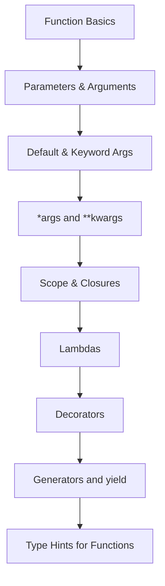
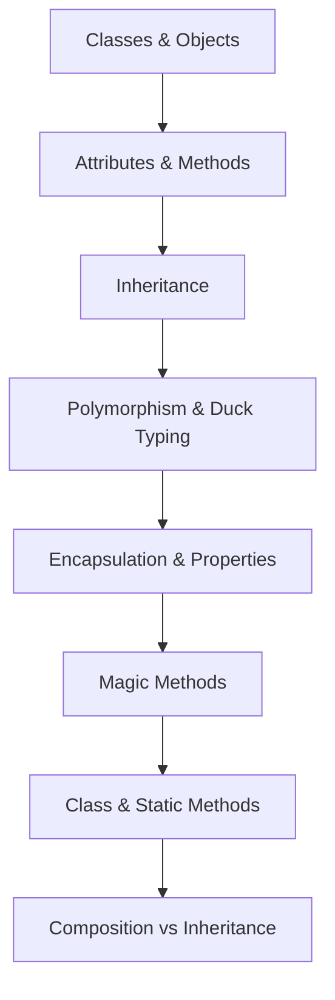
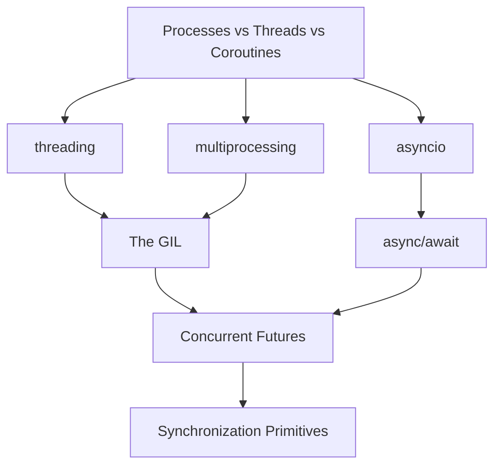
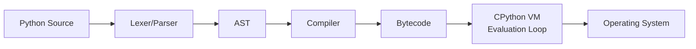
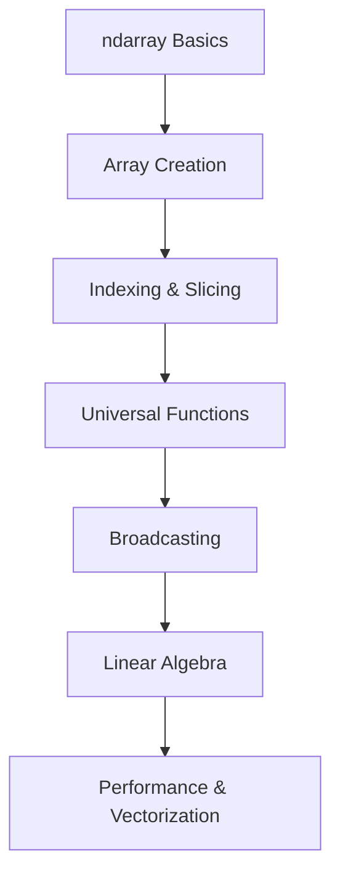
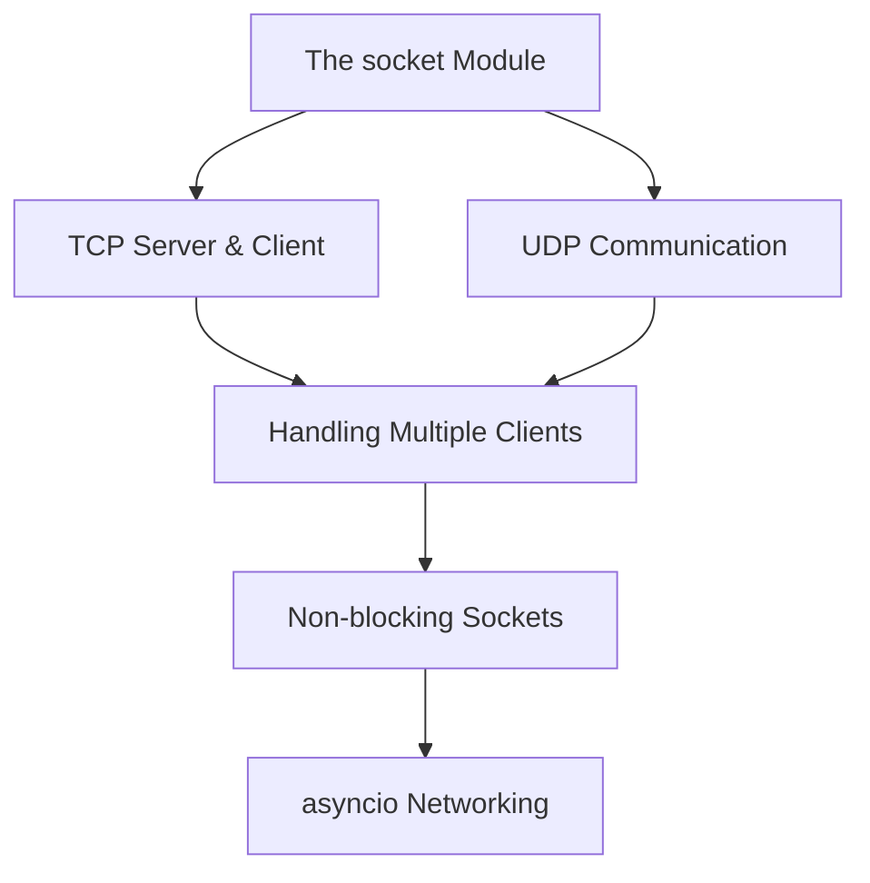

# Python Roadmap

This is the master roadmap for the Python track. The structure intentionally avoids the common trap of jumping from "loops and functions" straight into "Django and TensorFlow" — there is an enormous amount of Python knowledge in between that most roadmaps skip.

## The Big Picture

```mermaid
flowchart TD
    P1[1. Python Fundamentals] --> P2[2. Control Flow]
    P2 --> P3[3. Functions]
    P3 --> P4[4. Data Structures]
    P4 --> P5[5. Error Handling]
    P5 --> P6[6. Files and Serialization]
    P6 --> P7[7. Modules and Packages]
    P7 --> P8[8. OOP]
    P8 --> P9[9. Standard Library]
    P9 --> P10[10. Pythonic Programming]
    P10 --> P11[11. Type Hinting]
    P11 --> P12[12. Testing]
    P12 --> P13[13. Logging]
    P13 --> P14[14. Concurrency]
    P14 --> P15[15. Memory and Performance]
    P15 --> P16[16. Python Internals]
    P16 --> P17[17. Metaprogramming]
    P17 --> P18[18. Advanced OOP]
    P18 --> P19[19. Functional Python]
    P19 --> P20[20. Advanced Async]
    P20 --> P21[21. Packaging and Distribution]
    P21 --> P22[22. Native Extensions]
    P22 --> P23[23. NumPy]
    P23 --> P24[24. Pandas]
    P24 --> P25[25. Matplotlib]
    P25 --> P26[26. Image Processing]
    P26 --> P27[27. Networking and Sockets]
    P27 --> P28[28. Software Engineering Practices]
    P28 --> P29[29. Notebooks and Interactive Computing]
    P29 --> P30[30. ML and AI Libraries]
    P30 --> P31[31. Projects]

    style P1 fill:#e1f5ff,stroke:#0288d1
    style P8 fill:#fff4e1,stroke:#f57c00
    style P14 fill:#fce4ec,stroke:#c2185b
    style P16 fill:#e8f5e9,stroke:#388e3c
    style P22 fill:#f3e5f5,stroke:#7b1fa2
    style P31 fill:#fff9c4,stroke:#fbc02d
```

## Why This Order?

1. **Fundamentals (Ch. 1-2)** — atoms of every Python program.
2. **Functions (Ch. 3)** — the first unit of decomposition. Decorators and generators live here because they are functions.
3. **Data Structures (Ch. 4)** — the workhorses. You must know `list`/`dict`/`set`/`tuple` cold before anything else.
4. **Error Handling (Ch. 5)** — robust programs need this before they grow.
5. **Files (Ch. 6)** — most real programs read and write data.
6. **Modules (Ch. 7)** — at this point your code is too big for one file. You need packages and venvs.
7. **OOP (Ch. 8)** — classes, inheritance, magic methods. Required before any library explanation makes sense.
8. **Standard Library (Ch. 9)** — most Python developers underuse the stdlib. Mastery here separates professionals from beginners.
9. **Pythonic Programming (Ch. 10)** — comprehensions, generators, EAFP. The idiom layer.
10. **Type Hinting (Ch. 11)** — modern Python is typed. mypy is part of professional workflows.
11. **Testing (Ch. 12)** — pytest.
12. **Logging (Ch. 13)** — `logging`, not `print`.
13. **Concurrency (Ch. 14)** — threading, multiprocessing, asyncio, and the GIL.
14. **Memory and Performance (Ch. 15)** — reference counting, GC, profiling.
15. **Python Internals (Ch. 16)** — CPython, bytecode, the execution model.
16. **Metaprogramming (Ch. 17)** — `__dict__`, metaclasses, descriptors.
17. **Advanced OOP (Ch. 18)** — ABCs, Protocols, mixins, dataclasses.
18. **Functional Python (Ch. 19)** — `functools`, `partial`, `singledispatch`.
19. **Advanced Async (Ch. 20)** — event loops, async generators, task groups.
20. **Packaging (Ch. 21)** — wheels, build systems, publishing.
21. **Native Extensions (Ch. 22)** — ctypes, Cython, Numba, pybind11.
22. **NumPy / Pandas / Matplotlib (Ch. 23-25)** — the scientific Python stack.
23. **Image Processing (Ch. 26)** — Pillow, OpenCV.
24. **Networking (Ch. 27)** — sockets, asyncio networking.
25. **Software Engineering (Ch. 28)** — patterns, SOLID, project structure.
26. **Notebooks (Ch. 29)** — Jupyter, Colab, Kaggle comparison.
27. **ML/AI Libraries (Ch. 30)** — Scikit-Learn, PyTorch, TensorFlow fundamentals.
28. **Projects (Ch. 31)** — apply everything.

---

## Chapter 1. Python Fundamentals

Files:
- `1. Introduction to Python.md`
- `2. Variables and Data Types.md`
- `3. Operators.md`
- `4. Input and Output.md`
- `5. Type Conversion.md`
- `6. Comments and Documentation.md`
- `7. Basic Syntax and Style.md`

---

## Chapter 2. Control Flow

Files:
- `1. if-elif-else.md`
- `2. Match-Case (Python 3.10+).md`
- `3. while Loops.md`
- `4. for Loops and Iterables.md`
- `5. break, continue, pass.md`
- `6. Comprehensions.md`

---

## Chapter 3. Functions

Files:
- `1. Function Basics.md`
- `2. Parameters and Arguments.md`
- `3. Default and Keyword Arguments.md`
- `4. args and kwargs.md`
- `5. Scope and Closures.md`
- `6. Lambda Functions.md`
- `7. Decorators.md`
- `8. Generators and yield.md`
- `9. Type Hinting for Functions.md`

---

## Chapter 4. Data Structures

Files:
- `1. Lists Deep Dive.md`
- `2. List Operations and Complexity.md`
- `3. Tuples and Named Tuples.md`
- `4. Sets and Frozen Sets.md`
- `5. Dictionaries Deep Dive.md`
- `6. Strings Deep Dive.md`
- `7. collections Module.md`
- `8. heapq and bisect.md`

---

## Chapter 5. Error Handling

Files:
- `1. try-except-finally.md`
- `2. raise and Custom Exceptions.md`
- `3. Exception Hierarchy.md`
- `4. Context Managers.md`

---

## Chapter 6. Files and Serialization

Files:
- `1. Reading and Writing Files.md`
- `2. Path Handling with pathlib.md`
- `3. CSV and JSON.md`
- `4. Pickle and Serialization.md`
- `5. Working with Binary Files.md`

---

## Chapter 7. Modules and Packages

Files:
- `1. Modules and import.md`
- `2. Packages and init.py.md`
- `3. Virtual Environments.md`
- `4. pyproject.toml and Packaging.md`
- `5. Dependency Management.md`

---

## Chapter 8. Object-Oriented Programming

Files:
- `1. Classes and Objects.md`
- `2. Attributes and Methods.md`
- `3. Inheritance.md`
- `4. Polymorphism and Duck Typing.md`
- `5. Encapsulation and Properties.md`
- `6. Magic Methods.md`
- `7. Class Methods and Static Methods.md`
- `8. Composition vs Inheritance.md`

---

## Chapter 9. Standard Library Deep Dive

Files:
- `1. os and sys.md`
- `2. pathlib and shutil.md`
- `3. datetime and time.md`
- `4. collections.md`
- `5. itertools.md`
- `6. functools.md`
- `7. logging.md`
- `8. argparse.md`
- `9. re (Regular Expressions).md`
- `10. typing.md`

---

## Chapter 10. Pythonic Programming

Files:
- `1. Comprehensions Deep Dive.md`
- `2. Generators and Iterators.md`
- `3. Context Managers.md`
- `4. Decorators Deep Dive.md`
- `5. Closures.md`
- `6. Higher Order Functions.md`
- `7. EAFP and Duck Typing.md`

---

## Chapter 11. Type Hinting

Files:
- `1. Basic Type Hints.md`
- `2. Generics and TypeVar.md`
- `3. Protocols and Structural Typing.md`
- `4. TypedDict and Literal.md`
- `5. mypy and pyright.md`

---

## Chapter 12. Testing

Files:
- `1. Testing Concepts.md`
- `2. unittest.md`
- `3. pytest.md`
- `4. Fixtures and Parameterization.md`
- `5. Mocking with unittest.mock.md`
- `6. Coverage and CI.md`

---

## Chapter 13. Logging

Files:
- `1. The logging Module.md`
- `2. Log Levels and Handlers.md`
- `3. Structured Logging.md`

---

## Chapter 14. Concurrency

Files:
- `1. Processes vs Threads vs Coroutines.md`
- `2. threading Module.md`
- `3. multiprocessing Module.md`
- `4. asyncio Basics.md`
- `5. async-await.md`
- `6. The GIL.md`
- `7. Concurrent Futures.md`
- `8. Synchronization Primitives.md`

---

## Chapter 15. Memory and Performance

Files:
- `1. Python Memory Model.md`
- `2. Reference Counting and GC.md`
- `3. Memory Profiling.md`
- `4. cProfile and timeit.md`
- `5. Optimization Techniques.md`
- `6. Caching.md`

---

## Chapter 16. Python Internals

Files:
- `1. CPython Architecture.md`
- `2. Bytecode and the dis Module.md`
- `3. The Execution Model.md`
- `4. The Object Model.md`
- `5. The C API.md`

---

## Chapter 17. Metaprogramming

Files:
- `1. dict and Attribute Access.md`
- `2. getattr, setattr, hasattr.md`
- `3. type and Dynamic Class Creation.md`
- `4. Metaclasses.md`
- `5. Descriptors.md`

---

## Chapter 18. Advanced OOP

Files:
- `1. Abstract Base Classes.md`
- `2. Protocols.md`
- `3. Mixins.md`
- `4. Dataclasses.md`
- `5. Descriptors Deep Dive.md`

---

## Chapter 19. Functional Python

Files:
- `1. functools Deep Dive.md`
- `2. partial and singledispatch.md`
- `3. Immutable Patterns.md`
- `4. map, filter, reduce.md`

---

## Chapter 20. Advanced Async

Files:
- `1. Event Loops.md`
- `2. Async Generators.md`
- `3. Async Context Managers.md`
- `4. Task Groups (Python 3.11+).md`

---

## Chapter 21. Packaging and Distribution

Files:
- `1. Wheels and Build Systems.md`
- `2. Publishing Packages.md`
- `3. Dependency Resolution.md`

---

## Chapter 22. Native Extensions

Files:
- `1. ctypes.md`
- `2. cffi.md`
- `3. Cython.md`
- `4. Numba.md`
- `5. pybind11.md`

---

## Chapter 23. NumPy

Files:
- `1. NumPy Basics.md`
- `2. Array Creation.md`
- `3. Indexing and Slicing.md`
- `4. Universal Functions.md`
- `5. Broadcasting.md`
- `6. Linear Algebra.md`
- `7. Performance and Vectorization.md`

---

## Chapter 24. Pandas

Files:
- `1. Pandas Basics.md`
- `2. Series and DataFrame.md`
- `3. Indexing and Selection.md`
- `4. Data Cleaning.md`
- `5. GroupBy Operations.md`
- `6. Time Series.md`
- `7. IO and File Formats.md`

---

## Chapter 25. Matplotlib

Files:
- `1. Matplotlib Basics.md`
- `2. Line Plots and Styling.md`
- `3. Bar, Scatter, Histogram.md`
- `4. Subplots and Layouts.md`
- `5. Advanced Visualization.md`

---

## Chapter 26. Image Processing

Files:
- `1. Pillow Basics.md`
- `2. Image Operations.md`
- `3. OpenCV Basics.md`
- `4. Color Spaces and Thresholding.md`
- `5. Contours and Edge Detection.md`
- `6. Morphological Operations.md`
- `7. NumPy for Images.md`

---

## Chapter 27. Networking and Sockets

Files:
- `1. The socket Module.md`
- `2. TCP Server and Client.md`
- `3. UDP Communication.md`
- `4. Handling Multiple Clients.md`
- `5. Non-blocking Sockets.md`
- `6. asyncio Networking.md`

---

## Chapter 28. Software Engineering Practices

Files:
- `1. Project Structure.md`
- `2. Design Patterns in Python.md`
- `3. SOLID Principles.md`
- `4. Code Quality Tools.md`
- `5. Documentation.md`

---

## Chapter 29. Notebooks and Interactive Computing

Files:
- `1. Jupyter Notebook.md`
- `2. Google Colab.md`
- `3. Kaggle.md`
- `4. Comparison and Workflows.md`

---

## Chapter 30. ML and AI Libraries

Files:
- `1. Scikit-Learn.md`
- `2. PyTorch Fundamentals.md`
- `3. TensorFlow Fundamentals.md`

---

## Chapter 31. Projects

Files:
- `1. Build a CLI Tool.md`
- `2. Build a Web Scraper.md`
- `3. Build an Async Chat Server.md`
- `4. Build an Image Pipeline.md`
- `5. Build a Data Analysis Pipeline.md`

---

## Active Recall — Vault-Wide Self-Test

After completing the Python track, you should be able to answer:

1. Why is Python slow? Name three architectural reasons.
2. Explain the GIL. Why does it exist? When does it matter?
3. What is the difference between `is` and `==`? Why does `a = 256; b = 256; a is b` return `True` but `a = 257; b = 257; a is b` return `False`?
4. Trace what happens when Python executes `x = [1, 2, 3]`. How many objects are created?
5. What is the difference between `@staticmethod`, `@classmethod`, and an instance method?
6. Explain the descriptor protocol. How do `property`, `classmethod`, and `staticmethod` use it?
7. Why is `__init__` not a constructor? What is?
8. How does a generator differ from a list? When would you use each?
9. What is the difference between `asyncio.gather` and `asyncio.create_task`?
10. When would you use `multiprocessing` instead of `threading`?

---

## Next Steps

Once you have completed the Python track, return to the [[Shared/readme|master index]]. If you also completed the C++ track, consider building a project that uses both languages together — see [[21. C++ and Python Interoperability]] in the C++ track for inspiration.
