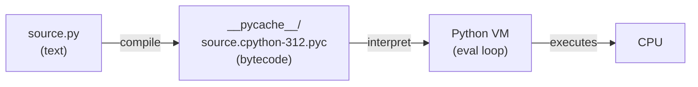
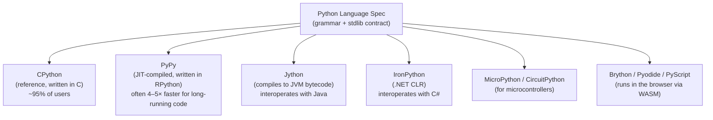

# 1. Introduction to Python

## Why This Matters

Before you write a single line of Python, you need to know **what kind of language Python is, why it looks the way it does, and where it fits in the broader programming landscape**. Many beginners treat Python as "just a scripting language" and miss the deliberate engineering trade-offs baked into its design. Understanding those trade-offs — dynamic typing, indentation-as-syntax, batteries-included standard library, the reference interpreter vs. alternative implementations — will explain *why* later chapters behave the way they do.

If you have come from a C++ or Java background, you will be surprised by what Python *omits* (no braces, no manual memory management, no header files, no compile step you can see). If you come from JavaScript or Ruby, you will be surprised by what Python *enforces* (significant whitespace, one obvious way to do things, explicit `self`). This note grounds you in the history, philosophy, ecosystem, and runtime model so that every later chapter has a stable foundation.

---

## Background

### A Brief History

Python was conceived in the **late days of December 1989** by **Guido van Rossum** at the Dutch National Research Institute for Mathematics and Computer Science (CWI) in Amsterdam. He was looking for a hobby project to keep busy during the Christmas break and decided to write an interpreter for a new scripting language that would be a successor to the ABC language — a teaching language with a clean syntax but poor extensibility.

The name "Python" does **not** come from the snake. It comes from the British comedy series *Monty Python's Flying Circus*. Guido wanted a name that was short, unique, and slightly mysterious. The snake mascot was retrofitted later, which is why community terminology mixes both (we say "Pythonic," but the package manager is `pip` — "Pip Installs Packages," though originally just the sidekick in *Great Expectations*).

Key release milestones:

| Version | Year | Highlight |
|---------|------|-----------|
| 0.9.0   | 1991 | First public release (on alt.sources) |
| 1.0     | 1994 | `lambda`, `map`, `filter`, `reduce` |
| 2.0     | 2000 | List comprehensions, garbage collector, Unicode strings |
| 3.0     | 2008 | Backwards-incompatible cleanup (strings are Unicode, `print` is a function) |
| 3.6     | 2016 | f-strings, format string literals, variable annotations |
| 3.10    | 2021 | Structural pattern matching (`match`/`case`) |
| 3.11    | 2022 | 10–60% faster than 3.10 ("Faster CPython" project) |
| 3.12    | 2023 | Per-interpreter GIL groundwork, better error messages |
| 3.13    | 2024 | Experimental free-threaded mode (no GIL), experimental JIT |

> [!info] Python 2 EOL
> Python 2 reached **end-of-life on January 1, 2020**. There will be no more security fixes. Every modern project uses Python 3. If you ever see Python 2 code in the wild (e.g., legacy DevOps scripts), treat it as a museum piece — port it to Python 3.

Guido van Rossum served as the language's **Benevolent Dictator For Life (BDFL)** until July 2018, when he stepped down and Python's direction shifted to an elected **Steering Council** governed by PEP 13. Decisions about the language are still made through **PEPs (Python Enhancement Proposals)** — design documents numbered and reviewed publicly.

---

## The Zen of Python

Type `import this` at any Python prompt and you get a 19-line poem called *The Zen of Python*, written by Tim Peters. It is not a joke — it is the design philosophy of the language:

```python
import this
```

The most cited aphorisms:

- **Beautiful is better than ugly.**
- **Explicit is better than implicit.**
- **Simple is better than complex.**
- **Readability counts.**
- **There should be one — and preferably only one — obvious way to do it.** (This is a deliberate counter-statement to Perl's "There's More Than One Way To Do It.")
- **Although practicality beats purity.**
- **If the implementation is hard to explain, it's a bad idea.**
- **In the face of ambiguity, refuse the temptation to guess.**

These principles show up everywhere: in the choice of `len(x)` over `x.length()`, in the refusal to chain constructors, in `import this`, in the fact that `bool` is a subclass of `int`, and in PEP 8 style rules.

---

## Core Language Characteristics

### Interpreted (with bytecode compilation)

Python source code is not compiled to native machine code in the traditional C/C++ sense. Instead, it is **compiled to bytecode** at runtime and executed by a virtual machine.



You can see the bytecode with the `dis` module:

```python
import dis
def add(a, b):
    return a + b
dis.dis(add)
```

The `.pyc` files in `__pycache__/` are cached bytecode. They are skipped on the next run if the source hasn't changed, which is why Python programs start up faster after the first run.

### Dynamically Typed

Variables in Python are **names bound to objects**. The name has no type; the object does.

```python
x = 42          # x is bound to an int object
x = "hello"     # now x is bound to a str object — perfectly legal
```

This is fundamentally different from C++ or Java where `int x = 42; x = "hello";` would be a compile error. We explore the full consequences in [[2. Variables and Data Types]].

### Strongly (but dynamically) Typed

Python is sometimes called "strongly typed" because it does **not** silently coerce incompatible types. `"5" + 5` raises `TypeError`, whereas JavaScript would return `"55"`. This makes Python safer than many scripting languages, while still flexible.

### Garbage Collected

You never call `free()` or `delete` in Python. Objects are reclaimed automatically when their reference count drops to zero, or, in the case of reference cycles, by a **cyclic garbage collector** that runs periodically.

```python
import gc
print(gc.get_threshold())   # (700, 10, 10) by default
```

### Multi-Paradigm

Python supports procedural, object-oriented, and functional programming. Functions are first-class objects; classes are first-class; you can mix and match freely.

### Batteries Included

The standard library is enormous: `os`, `sys`, `re`, `json`, `csv`, `datetime`, `pathlib`, `collections`, `itertools`, `functools`, `urllib`, `http`, `asyncio`, `multiprocessing`, `sqlite3`, `logging`, `argparse`, `unittest` — and that's just the top of the list. Most everyday tasks can be done without third-party packages.

---

## Python 2 vs. Python 3

If you read older tutorials or stackoverflow answers, you may encounter Python 2 idioms that no longer work. The differences that matter:

| Concern | Python 2 | Python 3 |
|---------|----------|----------|
| `print` | `print "hi"` (statement) | `print("hi")` (function) |
| String literals | `bytes` (ASCII) | `str` is Unicode; `bytes` is separate |
| Integer division | `5 / 2 == 2` | `5 / 2 == 2.5`; use `5 // 2 == 2` for floor |
| `range()` | Returns a list | Returns a lazy range object |
| `dict.keys()` | Returns a list | Returns a view object |
| `xrange()` | Lazy range | Removed (use `range`) |
| `except E, e:` | Comma syntax | `except E as e:` |
| `unicode()` | Built-in | Removed (strings are Unicode) |
| `input()` | Evaluates input as code | Returns string (safer) |

> [!danger] Never use `input()`'s old Python 2 semantics
> In Python 2, `input()` called `eval()` on the typed text, which was a massive security hole. Python 3's `input()` simply returns a string. The old behaviour is gone for good.

---

## Implementations of Python

"Python" is technically a *language specification*, not a single program. The reference implementation is **CPython** (written in C), but several other implementations exist for different purposes.



| Implementation | Written in | Target | When to use |
|----------------|-----------|--------|-------------|
| **CPython**    | C         | Native | Default. The only implementation that supports the C-API; libraries with C extensions (NumPy, Pandas, psycopg2) usually require it. |
| **PyPy**       | RPython   | JIT    | Long-running CPU-bound programs where startup time is amortised. |
| **Jython**     | Java      | JVM    | You need to call Java libraries from Python. (Stale; tracks Python 2.7.) |
| **IronPython** | C#        | .NET   | You need to call .NET from Python. (Tracks Python 3.4.) |
| **MicroPython**| C         | Embedded | Microcontrollers (ESP32, RP2040) with kilobytes of RAM. |
| **Pyodide**    | C + WASM  | Browser | CPython compiled to WebAssembly; powers PyScript. |

> [!tip] The implementation matters for C extensions
> If you `import numpy`, you are using a CPython C extension. It will not work on Jython or IronPython. PyPy has a compatibility layer (cpyext) but it is slower. When in doubt, **CPython is the safe choice**.

---

## Where Python Is Used

Python's reach is unusual: it is simultaneously a beginner language, a glue language, and a serious production language.

- **Web development** — Django, Flask, FastAPI, Starlette. Instagram, Pinterest, Reddit, Dropbox all use Python heavily in the backend.
- **Data science & ML** — NumPy, Pandas, scikit-learn, PyTorch, TensorFlow, JAX. Almost every ML paper ships a Python reference implementation.
- **Scripting / DevOps** — Ansible modules are Python; SaltStack is Python; many AWS Lambda functions are Python.
- **Scientific computing** — SciPy, AstroPy, Biopython.
- **Education** — The most common first language in universities worldwide.
- **Desktop GUIs** — Tkinter (built-in), PyQt, PySide, Kivy.
- **Game tooling** — Blender scripting, Maya scripting, many game engines expose Python.
- **Embedded** — MicroPython on ESP32, Raspberry Pi GPIO scripting.
- **Browser** — PyScript, Pyodide, Brython.

Python is **rarely** the right tool for: hard real-time systems, kernel drivers, AAA game engines, ultra-low-latency trading (where C++/Rust dominate), or memory-constrained embedded (where C still rules). But for almost everything else — and especially for the 90% of code that is "glue" between systems — Python is a sensible default.

---

## Installing Python

### From python.org

The canonical installer. Download from <https://www.python.org/downloads/>. On Windows, **check the box "Add python.exe to PATH"** during install — this is the single most common beginner mistake.

### Via system package manager

```bash
# Debian/Ubuntu
sudo apt install python3 python3-pip python3-venv

# macOS (Homebrew)
brew install python

# Fedora
sudo dnf install python3
```

> [!warning] macOS system Python is deprecated
> macOS ships with an ancient Python (Apple removed it entirely in macOS 12.3). Use Homebrew, pyenv, or python.org installer.

### Via conda (Anaconda / Miniconda)

Conda is a package manager popular in data science. It handles non-Python dependencies (C libraries, CUDA, geospatial libs) better than pip. Use **Miniconda** (small, command-line only) over Anaconda (huge default install).

### Via pyenv (recommended for serious developers)

`pyenv` lets you install multiple Python versions side-by-side and switch per-project via a `.python-version` file. Combined with `pyenv-virtualenv`, it is the cleanest way to manage versions on Linux/macOS.

```bash
pyenv install 3.12.4
pyenv install 3.11.9
pyenv local 3.12.4   # creates .python-version
```

### Verifying the install

```bash
python --version     # Python 3.12.4
python3 --version    # on Linux/macOS, often the explicit name
pip --version
which python
```

If `python` opens the Microsoft Store on Windows, you hit a known alias — disable it in Settings → Apps → Advanced app settings → App execution aliases.

---

## The REPL

The **Read-Eval-Print Loop** is the interactive Python shell. Start it with `python` (no arguments). You get the `>>>` prompt for single statements and `...` for continuation lines.

```python
$ python
Python 3.12.4 (main, Jun  6 2024, 18:26:15) [GCC 11.4.0] on linux
Type "help", "copyright", "credits" or "license" for more information.
>>> 2 + 2
4
>>> for i in range(3):
...     print(i)
...
0
1
2
>>>
```

Powerful REPL tricks:

| Command | Effect |
|---------|--------|
| `_` | Holds the last result |
| `help(obj)` | Show docstring |
| `dir(obj)` | List attributes of `obj` |
| `quit()` or `Ctrl-D` | Exit |
| `Ctrl-R` | Reverse history search (readline) |
| `import readline` | Enables arrow-key editing on minimal builds |

> [!tip] Upgrade your REPL
> For daily use, install **IPython** (`pip install ipython`) or **bpython**. Better yet, install **ptpython** for auto-completion, syntax highlighting, and multi-line editing. For data work, **JupyterLab** gives you a notebook interface.

---

## Your First Program

Create a file called `hello.py`:

```python
"""Print a friendly greeting to standard output."""
import sys

def greet(name: str) -> str:
    return f"Hello, {name}!"

if __name__ == "__main__":
    name = sys.argv[1] if len(sys.argv) > 1 else "World"
    print(greet(name))
```

Run it:

```bash
python hello.py           # Hello, World!
python hello.py Alice     # Hello, Alice!
```

Even this trivial program already uses: a module docstring, a type hint, an f-string, the `__name__` guard (so the file is also importable), `sys.argv` argument parsing, and a default value via a ternary. These topics all get their own notes in this chapter and the next.

---

## Common Pitfalls

### 1. Confusing `python` and `python3`

On many Linux systems, `python` still points to Python 2 (or to nothing). Always use `python3` on the command line, or set up an alias. Inside virtual environments, `python` always refers to the env's interpreter — that is the safe time to type `python`.

### 2. Modifying the system Python

On Linux distributions, `/usr/bin/python3` is owned by the package manager and used by system tools (`apt`, `dnf`, `gnome-tweak-tool`). If you `pip install --break-system-packages something_incompatible`, you can break your OS. Always use virtual environments (see [[7. Modules and Packages]]-style topics).

### 3. Forgetting that `pip` installs globally by default

Without a virtualenv, `pip install foo` writes to `/usr/lib/python3.x/site-packages` (or `~/.local/lib/...` on Debian). Two projects needing two versions of the same library will collide. Use `python -m venv` or `pipx` for CLI tools.

### 4. Treating `.pyc` as source

The `.pyc` files in `__pycache__/` are caches. Never edit them; never copy them between Python versions. If you see weird "magic number" errors on import, delete the `__pycache__/` directory.

### 5. Expecting Python to be slow because it is "interpreted"

Python's per-line performance is slower than C, but most real Python programs spend their time in C extensions (NumPy, Pandas) or in I/O. Slow Python is usually slow because of bad data structures or unnecessary work — not because of the language. Profile before optimizing.

---

## Tips and Tricks

- **Read PEPs.** PEP 8 (style), PEP 20 (Zen), PEP 257 (docstrings), PEP 484 (type hints), PEP 519 (path-like). They are short, well-written, and authoritative.
- **Use `python -i script.py`** to run a script and then drop into an interactive REPL with all its names loaded. Excellent for debugging.
- **Use `python -c "import this"`** to print the Zen without opening a REPL.
- **`python -m http.server`** serves the current directory on port 8000 — a 2-second static file server.
- **`python -m json.tool file.json`** pretty-prints and validates JSON from the shell.
- **`python -m pdb script.py`** runs the script under the built-in debugger.
- **Bookmark `https://docs.python.org/3/`** — the official documentation is exceptional and includes tutorial, library reference, language reference, and how-tos.
- **`dir()` and `help()` in the REPL** let you explore any object without leaving the terminal.

---

## Active Recall

1. Who created Python, in what year, and what was the original inspiration for the language's name?
2. What does `import this` print, and what is the document called?
3. Explain the difference between a strongly typed language and a statically typed language. Which one is Python?
4. Why does Python produce `.pyc` files, and where are they stored?
5. Name three implementations of Python other than CPython and one use case for each.
6. When did Python 2 reach end-of-life, and what does that mean in practice?
7. Why is the GIL (Global Interpreter Lock) sometimes controversial, and what does Python 3.13 introduce in this area?
8. What is the difference between `python` and `python3` on a typical Ubuntu system, and why?
9. List at least four major domains in which Python is a leading language.
10. Why is the `if __name__ == "__main__":` guard idiomatic in Python scripts?

---

## Next Steps

- Continue to [[2. Variables and Data Types]] to learn how Python binds names to objects and the full type hierarchy.
- Then read [[3. Operators]] to see every operator and how Python's operator overloading works.
- See [[7. Basic Syntax and Style]] for PEP 8 conventions and tooling.
- Eventually you will want [[1. if-elif-else]] in Chapter 2 for control flow, and [[1. Function Basics]] in Chapter 3 for the next major building block.
- For the big picture, see [[0. Python Roadmap]].
