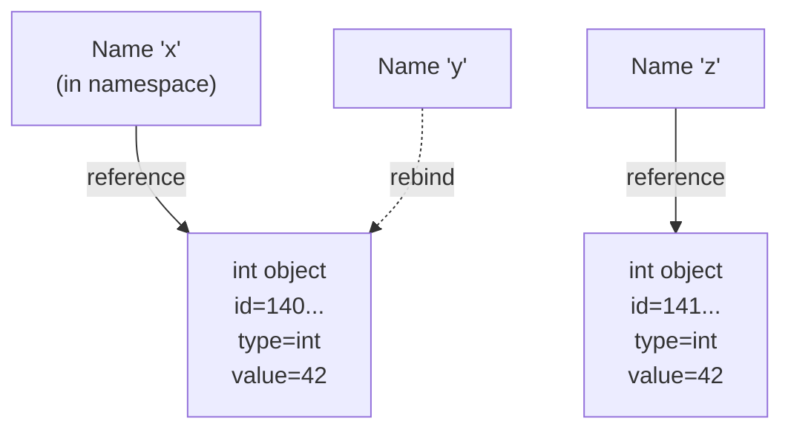
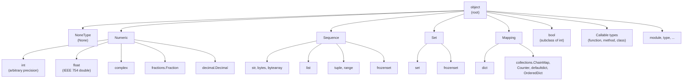
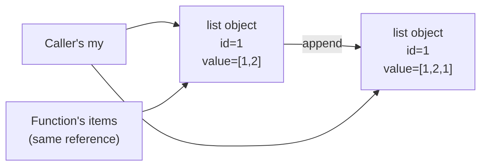

# 2. Variables and Data Types

## Why This Matters

Variables and types are the atoms of every program. But Python's model of variables is so different from C, C++, or Java that **misunderstanding it is the single most common source of beginner bugs**. In C, `int x = 5;` allocates 4 bytes named `x` and writes 5 into them. In Python, `x = 5` *binds a name to an existing int object*. The distinction sounds academic — until you see two variables "mysteriously" change together, or a default argument mutate across calls.

This note grounds you in Python's object model: identity, type, value, mutability, reference counting, the entire type hierarchy, and the surprising places where Python's design choices (everything is an object, including `int` and `class`) make the language both elegant and occasionally surprising. Once this clicks, the rest of Python — scoping rules, default argument pitfalls, `is` vs. `==`, decorators, even generators — becomes far more intuitive.

---

## Background: The Python Object Model

### Variables Are Names, Not Boxes

In languages like C, a variable is a **box** that holds a value. In Python, a variable is a **label** (a name in a namespace) tied to an object by a reference. Multiple names can point to the same object.

```python
a = [1, 2, 3]
b = a             # b is now another label for the same list object
b.append(4)
print(a)          # [1, 2, 3, 4]  — a "changed" because a and b are the same object
```

This is the most important concept in the entire language. Internalise it now, or spend years debugging "Python is weird" bugs that are actually just shared-reference bugs.

### Everything Is an Object

In Python, **everything is an object** — including numbers, strings, functions, classes, modules, and even `None`. Every object has:

- An **identity** (its memory address, accessible via `id()`).
- A **type** (accessible via `type()`).
- A **value** (the data it carries).

```python
x = 42
print(id(x))      # 140234567890 — the address
print(type(x))    # <class 'int'>
print(x)          # 42 — the value

def f(): pass
print(type(f))               # <class 'function'>
print(type(int))             # <class 'type'>   — the class int is itself an object
print(type(type))            # <class 'type'>   — type is its own metaclass
```



Even operators like `+` are objects:

```python
import operator
print(type(operator.add))   # <class 'builtin_function_or_method'>
```

### `id()` and `type()`

- **`id(obj)`** returns the object's identity — an integer that is unique for the object's lifetime. In CPython, this is the memory address. Do **not** rely on it being an address; it is an opaque identity token.
- **`type(obj)`** returns the object's class. Use `isinstance(x, int)` rather than `type(x) is int` because `isinstance` honours subclassing (and `bool` is a subclass of `int`).

```python
print(isinstance(True, int))    # True  — bool is a subclass of int!
print(type(True) is int)        # False — exact type check
```

### `is` vs `==`

- **`is`** compares *identity* (are these the same object?).
- **`==`** compares *value* (do these objects report themselves equal?).

```python
a = [1, 2, 3]
b = [1, 2, 3]
print(a == b)   # True  — same contents
print(a is b)   # False — different objects

c = a
print(a is c)   # True  — same object
```

> [!tip] The right use of `is`
> Use `is` only for sentinel comparisons: `if x is None`, `if x is True`, `if x is NotImplemented`. Never use `is` to compare numbers or strings — small-int caching may make it appear to work, then fail unexpectedly.

### Small-Int and String Interning (CPython quirk)

CPython pre-caches small integers (typically -5 to 256) and interns short, identifier-like strings. This is purely an optimisation — never rely on it for correctness.

```python
a = 256
b = 256
print(a is b)   # True — cached

a = 257
b = 257
print(a is b)   # False (usually) — not cached, separate objects
```

---

## The Type Hierarchy



### NoneType

`None` is the **null** sentinel. There is exactly one instance of `None` in a Python process. Always compare with `is None` or `is not None`.

```python
x = None
print(x is None)         # True
print(x == None)         # True — works, but PEP 8 says use `is`
```

### Numeric Types

#### `int` — Arbitrary Precision

Python `int` is **not** a fixed-width type. It grows to hold any value, limited only by available memory.

```python
print(2 ** 1000)         # a 302-digit integer, no overflow
# 10715086071862673209484250490600018105614048117055336074437503883703510511249362
# 241849411312837...
```

This is in stark contrast to C++'s `int` (32-bit, wraps at 2³¹). The cost: Python ints are objects on the heap, so arithmetic is ~100× slower than native int math. That's why NumPy exists.

Literals can be written in different bases:

```python
0b1010   # binary  → 10
0o12     # octal   → 10
0x0A     # hex     → 10
10_000_000   # underscores as digit separators (PEP 515)
```

#### `float` — IEEE 754 Double (64-bit)

Python floats are C doubles. Precision: about 15–17 significant digits. Same floating-point surprises you get in every language:

```python
0.1 + 0.2          # 0.30000000000000004
0.1 + 0.2 == 0.3   # False
```

For money, use `decimal.Decimal`. For exact rationals, use `fractions.Fraction`.

```python
from decimal import Decimal, getcontext
getcontext().prec = 28
print(Decimal("0.1") + Decimal("0.2"))   # 0.3 exactly

from fractions import Fraction
print(Fraction(1, 3) + Fraction(1, 6))   # 1/2
```

#### `complex`

Built-in: `complex(real, imag)` or `2 + 3j`. Supports the usual arithmetic. Used in scientific computing.

```python
z = 3 + 4j
print(z.real, z.imag, abs(z))   # 3.0 4.0 5.0
```

#### `bool` — Subclass of `int`

`True` is literally `1` and `False` is literally `0` — but with a nicer repr.

```python
print(True + True)        # 2
print(False * 7)          # 0
print(isinstance(True, int))   # True
print(int(True))          # 1
```

This subtlety matters: `sum([True, False, True])` returns `2`, not `True`. It also means `if 1:` works (because 1 is truthy) and `True == 1` is `True`. Beware of accidentally using a bool as an int counter.

### Sequence Types

#### `str` — Immutable text

Python 3 strings are **sequences of Unicode code points**, not bytes. A character like `é` may be one or two code points depending on normalisation; an emoji like  is a single code point but may render as multiple "grapheme clusters" when combined with skin-tone modifiers.

```python
s = "héllo, "
print(len(s))           # 8  — 8 code points
print(s[0])             # 'h'
print(s[-1])            # ''
print("abc" * 3)        # 'abcabcabc'
print("abc"[::-1])      # 'cba'  — slice with negative step reverses
```

Strings are **immutable** — every "modification" creates a new string. Concatenating many strings in a loop is O(n²); use `"".join(parts)` instead.

#### `list` — Mutable ordered sequence

The workhorse container. Heterogeneous (can hold any objects). Backed by an array of pointers.

```python
xs = [1, "two", 3.0, [4]]
xs.append(5)
xs.extend([6, 7])
xs.insert(0, 0)
xs.pop()              # 7
xs.remove(3.0)
del xs[0]
print(xs)             # ['two', [4], 5, 6]
```

Common gotcha: `[[]] * 3` creates a list of three references to the **same** inner list. Use a comprehension instead: `[[] for _ in range(3)]`.

#### `tuple` — Immutable ordered sequence

Like `list` but immutable. Used for fixed records and as dictionary keys (lists cannot be keys because they are unhashable).

```python
point = (3, 4)
x, y = point            # unpacking
print(x, y)             # 3 4

singleton = (42,)       # comma makes a 1-tuple (parens alone don't)
empty = ()
```

A subtle fact: tuples are *immutable in structure* but their elements may be mutable. `t = ([1, 2],)` cannot be reassigned (`t[0] = 7` raises), but `t[0].append(3)` works fine.

#### `range` — Lazy integer sequence

`range(10)` is not a list; it is a small object that produces integers on demand.

```python
r = range(0, 10, 2)    # start, stop, step
print(list(r))         # [0, 2, 4, 6, 8]
print(7 in r)          # False — computed, no list built
print(len(r))          # 5
```

`range` membership checks (`x in range(...)`) are O(1), not O(n) — Python does the arithmetic.

### Set Types

#### `set` — Unordered collection of hashable items

```python
s = {1, 2, 3, 2}      # {1, 2, 3} — duplicates removed
s.add(4); s.discard(99)
print(2 in s)          # True

a = {1, 2, 3}
b = {2, 3, 4}
print(a | b)           # {1, 2, 3, 4}  union
print(a & b)           # {2, 3}        intersection
print(a - b)           # {1}           difference
print(a ^ b)           # {1, 4}        symmetric difference
```

Items must be **hashable** — i.e., have `__hash__` and `__eq__`. Lists, dicts, and sets are not hashable; tuples *are* (if all their elements are).

#### `frozenset` — Immutable set

`frozenset({1, 2, 3})` is hashable, so it can be a dict key or a set member. Use it when you need a "constant set" that must not change.

### Mapping Types

#### `dict` — Mutable hash table

Insertion-ordered since Python 3.7 (and CPython 3.6 as an implementation detail). Keys must be hashable; values can be anything.

```python
d = {"a": 1, "b": 2}
d["c"] = 3
d.get("z", 0)             # 0 — default for missing keys
d.setdefault("z", 0)      # returns 0, also sets d["z"] = 0
print(d.keys(), d.values(), d.items())   # view objects, not lists

for k, v in d.items():
    print(k, v)
```

Python 3.9+ supports merging with `|` and update-with `|=`:

```python
{"a": 1} | {"b": 2}      # {'a': 1, 'b': 2}
d = {"a": 1}
d |= {"a": 9, "b": 2}    # {'a': 9, 'b': 2}
```

Specialised dicts in `collections`: `defaultdict`, `OrderedDict` (less needed now), `Counter`, `ChainMap`.

---

## Mutable vs Immutable — Deep Dive

The distinction is critical. **Immutable** objects cannot be changed after creation; **mutable** ones can.

| Immutable | Mutable |
|-----------|---------|
| `int`, `float`, `complex`, `bool` | `list` |
| `str`, `bytes` | `bytearray` |
| `tuple`, `frozenset`, `range` | `set` |
| `None` | `dict` |

What does immutability actually mean? It means *the object's value cannot change*. Operations that look like modifications actually return a new object:

```python
x = 5
print(id(x))    # 1407...
x = x + 1       # creates a new int object, rebinds x
print(id(x))    # different id

s = "abc"
s = s + "d"     # new string, old "abc" is unreferenced
print(s)        # "abcd"

t = (1, 2, 3)
t[0] = 9        # TypeError: 'tuple' object does not support item assignment
```

Compare with mutable:

```python
xs = [1, 2, 3]
print(id(xs))   # 1407...
xs.append(4)    # same object, value mutated
print(id(xs))   # same id as before
```

### Why this matters: aliasing

```python
def add_one(items):
    items.append(1)

my = [1, 2]
add_one(my)
print(my)       # [1, 2, 1] — the caller's list was modified!
```

If `items` had been an immutable tuple, you would have been forced to return a new tuple, which would have avoided the surprise. Mutability is a power; with great power comes shared-state bugs.



### Why mutable objects cannot be dict keys

A dict key is located via its hash. If a mutable object (like a list) were used as a key and then mutated, its hash would change and the dict would lose the entry. Python forbids this by requiring hashability — and mutable objects are not hashable by default.

```python
{[1, 2]: "x"}   # TypeError: unhashable type: 'list'
{(1, 2): "x"}   # works — tuples are hashable (if their items are)
```

### Copying: shallow vs deep

```python
import copy
xs = [[1, 2], [3, 4]]
shallow = xs.copy()              # new outer list, same inner lists
deep    = copy.deepcopy(xs)      # new outer list and new inner lists
xs[0].append(99)
print(shallow)                   # [[1, 2, 99], [3, 4]] — inner shared
print(deep)                      # [[1, 2], [3, 4]]      — fully independent
```

---

## Annotated Code Examples

### Example 1: Object identity

```python
a = [1, 2, 3]
b = a[:]
c = a
print(a is b, a is c)        # False True
print(a == b, a == c)        # True True
```

### Example 2: Integer caching surprised

```python
def same(x, y): return x is y
print(same(100, 100))        # True  — usually (small-int cache)
print(same(100000, 100000))  # False — different objects, same value
```

### Example 3: Tuple of mutable list

```python
t = ([1, 2],)
t[0].append(3)
print(t)                     # ([1, 2, 3],)
t[0] = [9]                   # TypeError — cannot rebind tuple element
```

### Example 4: Dict as a counter via `defaultdict`

```python
from collections import defaultdict
words = "the cat sat on the mat".split()
counts = defaultdict(int)
for w in words:
    counts[w] += 1
print(counts["the"])         # 2
```

### Example 5: Frozen set as dict key

```python
edges = {frozenset({"a", "b"}): 1, frozenset({"b", "c"}): 2}
print(edges[frozenset({"b", "a"})])   # 1 — order-independent lookup
```

---

## Common Pitfalls

### 1. `is` instead of `==`

```python
if name is "Alice":    #  may fail; use ==
if name == "Alice":    #  correct
```

### 2. Default mutable arguments

```python
def add_item(item, items=[]):   #  shared across all calls
    items.append(item)
    return items
print(add_item(1))   # [1]
print(add_item(2))   # [1, 2] — surprise!
```

Fix: use `None` sentinel.

```python
def add_item(item, items=None):
    if items is None:
        items = []
    items.append(item)
    return items
```

This is so important it gets its own discussion in [[3. Default and Keyword Arguments]].

### 3. `[[0]*3]*3` shared-row bug

```python
grid = [[0]*3]*3
grid[0][0] = 9
print(grid)   # [[9, 0, 0], [9, 0, 0], [9, 0, 0]]  — three rows are one object
```

Fix: `[[0]*3 for _ in range(3)]`.

### 4. Mutating while iterating

```python
xs = [1, 2, 3, 4, 5]
for x in xs:
    if x % 2 == 0:
        xs.remove(x)         # skips elements!
# xs is [1, 3, 5] — wrong
```

Fix: build a new list or iterate over a copy.

### 5. Float equality

```python
if 0.1 + 0.2 == 0.3:        # False — never true
    ...
```

Fix: use `math.isclose(a, b)`.

### 6. Chained comparison surprise

```python
1 < 2 < 3        # True  — equivalent to (1 < 2) and (2 < 3)
1 < 2 > 0        # True  — legal but confusing; avoid
```

### 7. Confusing `not in` operator precedence

```python
"x" not in "ax"        # True
not "x" in "ax"        # True — equivalent, but uglier
```

---

## Tips and Tricks

- **Use `sys.getsizeof(obj)`** to see the memory footprint of an object — handy for understanding why Python is "fat" compared to C.
- **Use `id()` only for debugging**, never for production logic.
- **`isinstance(x, (int, float, complex))`** accepts a tuple of types — shorter than chaining `or`.
- **`bool(seq)`** is the cleanest "is non-empty" check: `if items:` instead of `if len(items) > 0:`.
- **`dict.fromkeys(keys, default)`** builds a dict without duplicates: `dict.fromkeys([1, 1, 2, 3], 0)`.
- **`tuple(x for x in range(5))`** for an immutable snapshot.
- **`frozenset` is hashable** — use it to memoise computations keyed by a set.
- **Avoid `eval()`** for parsing; use `ast.literal_eval` for safe literal evaluation.
- **Use `__slots__`** in classes to prevent attribute dict creation — saves memory for many small objects.
- **Cache hash values** for immutable-ish classes by overriding `__hash__` to return a precomputed value.

---

## Active Recall

1. Explain the difference between a *variable* in C and a *name* in Python. Why does it matter?
2. What do `id()`, `type()`, and `value` mean for a Python object?
3. Distinguish `is` from `==`. When should each be used?
4. Why does `bool` count as a subclass of `int`? Show one consequence.
5. List the four numeric types and one specific reason to use each.
6. Why does `2 ** 1000` not overflow in Python, and what is the downside?
7. Explain why `t = ([1, 2],); t[0].append(3)` works but `t[0] = 7` raises.
8. Why can a `tuple` be a dict key but a `list` cannot?
9. Demonstrate the shared-row bug with `[[0]*3]*3` and explain the fix.
10. Describe the difference between shallow and deep copy, and name the function for each.
11. Why does `0.1 + 0.2 != 0.3`, and what should you use instead?
12. What does "hashable" mean, and which built-in types are not hashable?

---

## Next Steps

- Move on to [[3. Operators]] to see how Python's operators manipulate these types and how operator overloading works via dunder methods.
- Then [[4. Input and Output]] for printing, f-strings, and the streams.
- See [[5. Type Conversion]] for implicit and explicit conversions.
- The mutable-default-argument pitfall appears again in [[3. Default and Keyword Arguments]] of Chapter 3.
- For a deeper look at containers, see Chapter 4 ([[1. Lists]] and friends) once you finish the fundamentals.
