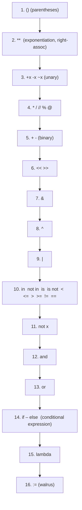

# 3. Operators

## Why This Matters

Operators are how a language lets you combine values into new values. Python's operator set looks familiar on the surface — `+`, `-`, `*`, `<` — but there are subtle rules about **precedence, associativity, short-circuit evaluation, chained comparisons, and the difference between `is` and `==`** that catch even experienced programmers. Add Python-specific operators like the walrus `:=`, the matrix `@`, and the floor-division `//`, plus a dunder-based overloading model that lets any class redefine what `+` means, and you have a topic that deserves a careful read.

If you skip this note, you will write code that "works by accident" — for instance, you will use `is` where you meant `==`, or chain `not a == b` thinking it means `not (a == b)` (it does), or assume integer division truncates toward zero (it doesn't; it floors). Understanding each operator's contract now will save you hours of debugging later.

---

## Background

Every operator in Python is **syntactic sugar for a dunder method call**. When you write `a + b`, Python translates that to `a.__add__(b)` (and, if that returns `NotImplemented`, it tries `b.__radd__(a)`). This is why `+` works on ints, strings, lists, and any custom class that defines `__add__`. The same applies to `<` (`__lt__`), `in` (`__contains__`), `len()` (`__len__`), indexing `[i]` (`__getitem__`), and so on.

This means Python has only a handful of *true* operators — the rest are method dispatches. Even `and`, `or`, and `not` have to interact with `__bool__`. Knowing this unlocks the whole language: you can make your objects support `+`, `<`, `in`, `len()`, indexing, iteration, and more just by implementing dunders.

---

## Arithmetic Operators

| Operator | Name | Example | Notes |
|----------|------|---------|-------|
| `+`      | Addition | `2 + 3 == 5` | Also concatenates strings, lists, tuples |
| `-`      | Subtraction | `5 - 2 == 3` | Unary: `-x` |
| `*`      | Multiplication | `2 * 3 == 6` | Also repeats sequences: `"ab" * 3 == "ababab"` |
| `/`      | True division | `5 / 2 == 2.5` | Always returns float, even on ints |
| `//`     | Floor division | `5 // 2 == 2`, `-5 // 2 == -3` | Floors toward negative infinity, not zero |
| `%`      | Modulo | `5 % 2 == 1` | Result sign follows divisor |
| `**`     | Exponentiation | `2 ** 10 == 1024` | Right-associative; `2 ** 3 ** 2 == 512` |
| `@`      | Matrix multiplication | `A @ B` | PEP 465; used by NumPy; needs `__matmul__` |

### Floor Division vs Integer Division

In C/C++, integer division truncates toward zero: `-5 / 2 == -2`. In Python, `//` floors toward negative infinity:

```python
print(5 // 2)      # 2
print(-5 // 2)     # -3   ← floors down, not toward zero
print(5 // -2)     # -3
print(-5 // -2)    # 2
```

This is consistent with `%`:

```python
print(5 % 2)       # 1
print(-5 % 2)      # 1   ← not -1!
print(5 % -2)      # -1
```

The identity `(a // b) * b + (a % b) == a` always holds. If you need C-style truncation, use `int(a / b)` or `math.trunc(a / b)`.

### Exponentiation is right-associative

```python
2 ** 3 ** 2    # 2 ** (3 ** 2) == 2 ** 9 == 512, not (2 ** 3) ** 2 == 64
```

### Augmented assignment

`x += 1` is in-place — for mutable objects, it may mutate rather than rebind:

```python
xs = [1, 2]
xs_id = id(xs)
xs += [3]            # mutates the same list
print(id(xs) == xs_id)   # True
xs = xs + [4]       # creates a new list, then rebinds
print(id(xs) == xs_id)   # False
```

This subtle distinction matters when `xs` is shared with another name.

---

## Comparison Operators

| Operator | Meaning |
|----------|---------|
| `==`     | Equal (value comparison via `__eq__`) |
| `!=`     | Not equal |
| `<`      | Less than |
| `>`      | Greater than |
| `<=`     | Less than or equal |
| `>=`     | Greater than or equal |
| `is`     | Same object (identity) |
| `is not` | Different object |
| `in`     | Membership in container |
| `not in` | Not in container |

All comparison operators return a `bool`. They can be **chained**:

```python
1 < x < 10           # equivalent to (1 < x) and (x < 10), but x is evaluated once
"a" in "cat"         # True
3 in [1, 2, 3]       # True
3 in {1, 2, 3}       # True — set membership is O(1)
3 in (1, 2, 3)       # True
"k" in {"k": 1}      # True — checks keys, not values
```

### `is` vs `==`

Already covered in [[2. Variables and Data Types]] — `is` compares identity, `==` compares value. The PEP 8 rule: use `is` only for sentinels (`None`, `True`, `False`, `NotImplemented`, `Ellipsis`).

### Mixed-type comparison

Python 3 does not allow ordering comparisons across unrelated types:

```python
"5" < 5        # TypeError: '<' not supported between instances of 'str' and 'int'
{1: 2} < {1: 3}  # TypeError — dicts support == and !=, but not <, >
```

But numeric types cross-compare: `1 < 1.5` works, and `True < 2` works (bool is a subclass of int).

---

## Logical Operators: `and`, `or`, `not`

Python's logical operators are **short-circuiting** and return **operand values, not booleans**.

```python
print(0 or "default")       # "default" — 0 is falsy, so `or` returns second operand
print(5 or "default")       # 5 — 5 is truthy, so `or` returns it without evaluating second
print(0 and 1)              # 0 — short-circuits at first falsy
print(5 and 1)              # 1 — both truthy, returns last
print(not 0)                # True
print(not "hi")             # False
```

### Short-circuit evaluation

```python
def expensive_check():
    print("called")
    return True

if False and expensive_check():     # not called
    pass

if True or expensive_check():       # not called
    pass
```

This is the idiomatic way to guard against `None` or empty containers:

```python
if user and user.is_admin:          # only checks is_admin if user is truthy
    ...

name = provided_name or "anonymous"  # fallback default
config = user_config or default_config
```

### Truthiness

Every object can be tested for truth. The following are **falsy**:

- `False`
- `None`
- `0`, `0.0`, `0j`
- Empty sequences: `""`, `[]`, `()`, `b""`, `range(0)`
- Empty mappings: `{}`
- Custom objects whose `__bool__` returns `False` or whose `__len__` returns 0

Everything else is truthy. Note that **`0.0` is falsy** and **NaN is truthy** (because NaN does not equal anything, including itself, but `bool(float("nan"))` is `True`).

---

## Bitwise Operators

| Operator | Name | Example |
|----------|------|---------|
| `&`      | AND | `0b1100 & 0b1010 == 0b1000` |
| `\|`     | OR  | `0b1100 \| 0b1010 == 0b1110` |
| `^`      | XOR | `0b1100 ^ 0b1010 == 0b0110` |
| `~`      | NOT (one's complement) | `~0 == -1` |
| `<<`     | Left shift | `1 << 4 == 16` |
| `>>`     | Right shift | `16 >> 2 == 4` |

Bitwise operators work on two's-complement integers of arbitrary width. The `~` operator returns `-(x+1)`:

```python
print(~0)      # -1
print(~5)      # -6
print(bin(5))  # '0b101'
print(bin(~5)) # '-0b110'
```

For low-level bit-twiddling, use the `bitarray` library or NumPy's fixed-width integer types.

> [!info] Sets overload bitwise operators
> `set & set` is intersection, `set | set` is union, `set ^ set` is symmetric difference. This is not a coincidence — sets are conceptually bit-vectors of arbitrary elements.

---

## Assignment Operators

| Operator | Notes |
|----------|-------|
| `=`      | Bind name to object (rebind, never copies) |
| `+=` `-=``*=``/=``//=``%=``**=``@=` `&=` `\|=` `^=` `<<=` `>>=` | Augmented assignment — may mutate (mutable types) or rebind (immutable types) |
| `:=`     | **Walrus operator** (PEP 572, Python 3.8+) — assignment expression |

### The Walrus Operator `:=`

The walrus lets you **assign a value as part of an expression**, returning the assigned value. It saves duplication when the same computed value is used in a condition and a body.

```python
# Without walrus
line = input()
while line:
    process(line)
    line = input()

# With walrus
while (line := input()):
    process(line)
```

Another classic use — list comprehension with a side computation:

```python
# Filter, then transform — but you need the computed value
results = [y for x in data if (y := f(x)) is not None]
```

Without the walrus, you would have to compute `f(x)` twice (once in the condition, once in the result). With it, you compute once and reuse.

> [!warning] Walrus requires parentheses in some contexts
> `if (x := f()) > 0:` works. `if x := f() > 0:` parses as `if x := (f() > 0):` — not what you want.

---

## Operator Precedence (highest to lowest)



A few non-obvious points:

- `**` binds tighter than unary `-`: `-2 ** 2 == -4`, not `4`. Use `(-2) ** 2`.
- `not` binds tighter than `and`, which binds tighter than `or`: `not a and b or c` parses as `((not a) and b) or c`.
- Comparison operators all bind looser than arithmetic, so `1 + 1 < 3` is `(1 + 1) < 3`.
- `lambda` is the lowest-precedence expression form — its entire body is one expression.

> [!tip] When in doubt, parenthesise
> Explicit parentheses are clearer than precedence tables. Code is read more than written.

---

## Chained Comparisons

Python allows chained comparisons that read like mathematics:

```python
if 0 < x < 100:
    ...

# equivalent to
if 0 < x and x < 100:
    ...
```

Each operand is evaluated at most once. This is convenient and avoids accidental double evaluation:

```python
def f():
    print("f called")
    return 5

1 < f() < 10    # f called once
```

You can chain more than two:

```python
if 0 < x < y < 10:
    ...
```

But avoid mixing types in chains; it can be confusing.

---

## Operator Overloading via Dunder Methods

Every operator maps to a dunder method. To make `+` work on your class:

```python
class Vector:
    def __init__(self, x, y):
        self.x, self.y = x, y

    def __add__(self, other):
        if not isinstance(other, Vector):
            return NotImplemented    # try other.__radd__
        return Vector(self.x + other.x, self.y + other.y)

    def __eq__(self, other):
        if not isinstance(other, Vector):
            return NotImplemented
        return self.x == other.x and self.y == other.y

    def __repr__(self):
        return f"Vector({self.x}, {self.y})"

    def __len__(self):
        return 2

    def __bool__(self):
        return self.x != 0 or self.y != 0

    def __contains__(self, item):
        return item in (self.x, self.y)

v1 = Vector(1, 2)
v2 = Vector(3, 4)
print(v1 + v2)          # Vector(4, 6)
print(v1 == v2)         # False
print(len(v1))          # 2
print(1 in v1)          # True
```

Common dunders for operators:

| Operator | Dunder |
|----------|--------|
| `+`      | `__add__`, `__radd__`, `__iadd__` |
| `-`      | `__sub__`, `__rsub__`, `__isub__` |
| `*`      | `__mul__`, `__rmul__`, `__imul__` |
| `/`      | `__truediv__` |
| `//`     | `__floordiv__` |
| `%`      | `__mod__` |
| `**`     | `__pow__` |
| `@`      | `__matmul__` |
| `==`     | `__eq__` |
| `<`      | `__lt__` |
| `<=`     | `__le__` |
| `>`      | `__gt__` |
| `>=`     | `__ge__` |
| `!=`     | `__ne__` (defaults to `not __eq__` if undefined) |
| `in`     | `__contains__` (defaults to iteration if undefined) |
| `[]`     | `__getitem__`, `__setitem__`, `__delitem__` |
| `len(x)` | `__len__` |
| `abs(x)` | `__abs__` |
| `bool(x)`| `__bool__` (falls back to `__len__`) |
| `~x`     | `__invert__` |
| `<<` `>>`| `__lshift__`, `__rshift__` |

When you return `NotImplemented` from a dunder, Python falls back to the reflected method on the other operand (`__radd__`). This is how `1 + your_obj` works even though `int.__add__` doesn't know your type — `int.__add__` returns `NotImplemented`, then Python calls `your_obj.__radd__(1)`.

To get all six comparison dunders in one shot, use `functools.total_ordering`:

```python
from functools import total_ordering

@total_ordering
class Money:
    def __init__(self, cents): self.cents = cents
    def __eq__(self, o): return self.cents == o.cents
    def __lt__(self, o): return self.cents < o.cents
    # __le__, __gt__, __ge__ auto-generated
```

---

## Annotated Code Examples

### Example 1: Floor division and modulo consistency

```python
for a, b in [(7, 3), (-7, 3), (7, -3), (-7, -3)]:
    q, r = a // b, a % b
    assert q * b + r == a, (a, b, q, r)
    print(f"{a} // {b} = {q}, {a} % {b} = {r}")
#  7 //  3 = 2,  7 %  3 = 1
# -7 //  3 = -3, -7 %  3 = 2
#  7 // -3 = -3,  7 % -3 = -2
# -7 // -3 = 2, -7 % -3 = -1
```

### Example 2: Short-circuit defaults

```python
def get_name():
    return None

name = get_name() or "Anonymous"     # "Anonymous"
```

### Example 3: Chained comparison in a guard

```python
def is_normal(score):
    return 0 <= score <= 100
```

### Example 4: Walrus in a comprehension

```python
data = ["1", "abc", "42", "x"]
parsed = [n for s in data if (n := s.isdigit())]
# Same as `[s for s in data if s.isdigit()]` but exposes the bool as `n` (rarely useful here)
```

A more realistic use:

```python
blocks = [block for line in lines if (block := transform(line))]
```

### Example 5: Bitwise permission flags

```python
READ, WRITE, EXEC = 1, 2, 4
perm = READ | WRITE
print(perm & READ)   # 1 — has READ
print(perm & EXEC)   # 0 — no EXEC
print(bool(perm & READ))   # True
```

### Example 6: Operator overloading — Vector

```python
class Vector:
    __slots__ = ("x", "y")
    def __init__(self, x, y): self.x, self.y = x, y
    def __add__(self, o): return Vector(self.x + o.x, self.y + o.y)
    def __sub__(self, o): return Vector(self.x - o.x, self.y - o.y)
    def __mul__(self, k):   return Vector(self.x * k, self.y * k)   # scalar
    def __rmul__(self, k):  return self * k                          # 2 * v
    def __eq__(self, o):    return (self.x, self.y) == (o.x, o.y)
    def __repr__(self):     return f"Vector({self.x}, {self.y})"
    def __abs__(self):      return (self.x**2 + self.y**2) ** 0.5

v = Vector(1, 2) + Vector(3, 4)
print(v, abs(v))     # Vector(4, 6) 7.2111...
print(2 * v)         # Vector(8, 12)
```

---

## Common Pitfalls

### 1. `is` instead of `==`

```python
if x is None: ...       #  correct
if x is []: ...         #  never true; use `if not x:`
if x == None: ...       # works, but PEP 8 says use `is`
```

### 2. `-2 ** 2` is `-4`, not `4`

```python
-2 ** 2     # -4 — exponentiation binds tighter than unary minus
(-2) ** 2   # 4
```

### 3. Floor division does not truncate toward zero

```python
-7 // 2     # -4 in C, but -3 in Python
```

If you need C semantics, use `int(-7 / 2)` or `math.trunc(-7 / 2)`.

### 4. Modulo with negative numbers

```python
-7 % 3      # 2 in Python (sign follows divisor), -1 in C
```

This is intentional and useful for circular buffers, but trips up ported C code.

### 5. Chaining `is`

```python
a is b is c   # means (a is b) and (b is c) — probably not what you meant
```

### 6. `and`/`or` returning operands

```python
x = 5 or 0       # x is 5, not True
x = 0 or 5       # x is 5, not True
x = 5 and 3      # x is 3, not True
```

If you need a real bool, wrap with `bool(...)`. But usually the operand is what you want.

### 7. Mutating during augmented assignment

```python
xs = [1, 2]
ys = xs
xs += [3]
print(ys)         # [1, 2, 3] — augmented on a mutable object mutates in place
```

### 8. Walrus without parens in conditions

```python
if x := f() > 0:    # parses as if x := (f() > 0)
    ...
```

Always parenthesise: `if (x := f()) > 0:`.

---

## Tips and Tricks

- **`a < b < c` reads naturally** — prefer it over `a < b and b < c`.
- **Use `and`/`or` for defaults**: `name = provided or "anonymous"`.
- **Use `:=` to avoid recomputation** in list comprehensions with side effects.
- **`divmod(a, b)`** returns `(a // b, a % b)` in one call.
- **`round()` uses banker's rounding** — `round(0.5) == 0`, `round(1.5) == 2`. Use the `decimal` module for non-banker rounding.
- **`math.isclose(a, b)`** for float comparison; never `==`.
- **`functools.total_ordering`** saves boilerplate for rich comparison.
- **`operator` module** exposes operators as functions: `operator.add(a, b)`, `operator.itemgetter(1)`, `operator.attrgetter("name")`. Useful in `sorted`, `map`, `reduce`.
- **Avoid `eval`/`exec`** — they're operators in spirit, but security landmines.

---

## Active Recall

1. List the seven arithmetic operators and what each does.
2. Why does `-5 // 2` equal `-3` and not `-2`? What's the rule?
3. What is the difference between `is` and `==`, and when should you use each?
4. Explain short-circuit evaluation. Give one idiomatic use of `or`.
5. What is the walrus operator, what PEP introduced it, and what problem does it solve?
6. What is operator precedence between `**`, unary `-`, and `*`? Show a counter-intuitive example.
7. How does Python handle `1 < x < 10`? Is `x` evaluated once or twice?
8. Map `+`, `==`, `<`, `in`, `[]`, `len()` to their dunder methods.
9. What does `NotImplemented` (not `NotImplementedError`) do in a dunder?
10. Why does `~0 == -1`?
11. Show how `functools.total_ordering` reduces boilerplate.
12. Why is `0.1 + 0.2 == 0.3` `False`, and what should you use instead?

---

## Next Steps

- Read [[4. Input and Output]] to see how `print()`, f-strings, and streams use these operators.
- See [[5. Type Conversion]] for how operands get coerced.
- Chapter 3's [[6. Lambda Functions]] uses operator-like callbacks heavily; [[2. Parameters and Arguments]] covers how Python passes objects to functions (hint: it's tied to the model from [[2. Variables and Data Types]]).
- For advanced operator overloading, see [[1. Object-Oriented Programming]] chapters and dunder deep-dives in [[18. Advanced OOP]].
