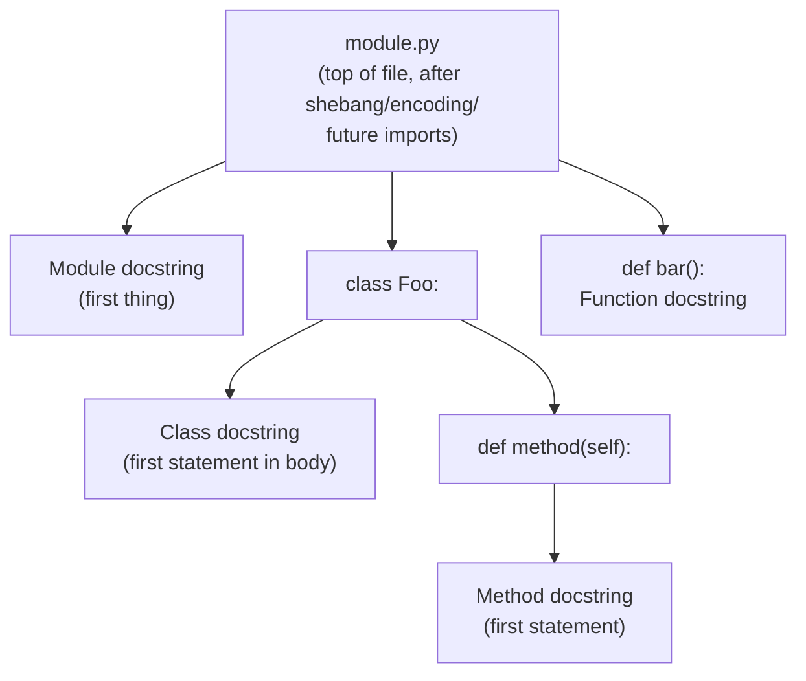

# 6. Comments and Documentation

## Why This Matters

Code is read far more often than it is written. Comments and documentation are how you communicate intent to your future self, your teammates, your reviewers, and your users. Python gives you **three levels of communication**: single-line `#` comments, multi-line docstrings (`"""..."""`), and external documentation (READMEs, Sphinx sites, type hints). Each has a distinct role.

Get this wrong and you produce one of two failures: **under-commented code** where readers must reverse-engineer intent from the implementation, or **over-commented code** where the comments merely paraphrase the code ("`x = x + 1  # increment x`") and rot out of sync. This note shows you the conventions: PEP 257 docstring style, where to place docstrings (module, class, function, method), how `__doc__` is exposed at runtime, how `doctest`, `pydoc`, and Sphinx consume docstrings, and the modern shift toward **type hints + docstrings** as a unified specification.

---

## Background

Python distinguishes **comments** (text the interpreter ignores) from **docstrings** (string literals at specific syntactic positions that the interpreter captures into `__doc__`). Comments are for developers reading the source; docstrings are for tools (help systems, documentation generators, IDE tooltips) and are part of the program's runtime metadata.

This split is unusual — most languages have only comments. Python's design treats docstrings as **executable documentation**: they are reachable via `help()`, `obj.__doc__`, and `inspect`, and they can even contain runnable examples (doctests).

---

## Comments

### Single-line comments with `#`

Anything from `#` to the end of the line is a comment:

```python
# This is a full-line comment
x = 5  # This is an inline comment
```

PEP 8 says:

- Inline comments should be **separated by at least two spaces** from the code.
- They should start with `#` and a single space.
- They should be **used sparingly** — if the code is hard to understand, rewrite it before commenting.
- **Avoid obvious comments**: `x = x + 1  # increment x` is noise.

### When to comment

- **Why, not what.** Code shows *what*; comments show *why*.
- **Gotchas and non-obvious decisions.** Why this magic number? Why this algorithm?
- **TODOs and FIXMEs** with attribution: `# TODO(alice, 2024-09): switch to async client`.
- **Workarounds** for bugs in third-party libraries, with a link to the issue.

### When NOT to comment

- Don't repeat the code in English.
- Don't comment out dead code — delete it; git remembers.
- Don't write essays — extract to a docstring or a README.

### Multi-line strings as "block comments"?

Some people use:

```python
"""
This is a multi-line string used as a comment.
It's not really a comment — it's an unused string literal.
"""
```

This is legal but **not idiomatic**. The interpreter creates a string object and discards it. It also pollutes `__doc__` if it appears at the top of a module/function. Use `#` for each line instead.

---

## Docstrings (PEP 257)

A **docstring** is a string literal that appears as the **first statement** of a module, class, function, or method. It is captured into the object's `__doc__` attribute and is accessible via `help(obj)` and `inspect.getdoc(obj)`.

### Placement



### Format

- Use **triple double quotes** `"""..."""` even for one-line docstrings (PEP 257).
- One-line docstring: a single sentence ending with a period, fitting on one line, with the closing `"""` on the same line.
- Multi-line docstring: a summary line, a blank line, then more detail.

```python
def add(a, b):
    """Return the sum of a and b."""
    return a + b
```

```python
def send_email(to, subject, body):
    """Send a transactional email to a recipient.

    Uses the configured SMTP relay. Retries up to 3 times with exponential
    backoff. Raises SendError if all retries fail.

    Args:
        to:       Recipient email address.
        subject:  Subject line (max 78 chars recommended).
        body:     Plain-text body. HTML is not supported.

    Returns:
        The message-id assigned by the SMTP server.

    Raises:
        SendError: If delivery fails after all retries.
    """
    ...
```

### Common docstring conventions

There are several "styles" of docstring formatting:

| Style | Summary line | Args section | Used by |
|-------|--------------|--------------|---------|
| **Google**  | Yes | `Args:` / `Returns:` / `Raises:` | Sphinx napoleon, many projects |
| **NumPy**   | Yes | Underlined `Parameters` / `Returns` sections | SciPy ecosystem |
| **reST**    | Yes | `:param x: description` | Sphinx autodoc default |
| **One-line only** | Yes | (none) | Trivial functions |

Example, Google style:

```python
def fetch(url, timeout=10):
    """Fetch a URL and return the response body as text.

    Args:
        url: URL to fetch.
        timeout: Timeout in seconds. Defaults to 10.

    Returns:
        Response body as a string.

    Raises:
        TimeoutError: If the request exceeds ``timeout``.
    """
    ...
```

Pick one style and stick with it across your project.

### Accessing docstrings

```python
import math
print(math.sqrt.__doc__)
# 'Return the square root of x.'

help(math.sqrt)
# Prints the docstring formatted nicely

import inspect
print(inspect.getdoc(math.sqrt))
# Cleans up indentation
```

### Module docstrings

The very first statement in a `.py` file should be a docstring:

```python
"""Utilities for parsing Markdown files into ASTs.

This module exposes:
    - parse(text) -> Document
    - Document.to_html() -> str

See https://example.com/docs for the full specification.
"""
import re
from dataclasses import dataclass

# ...
```

`help(your_module)` displays this docstring.

### Class docstrings

```python
class BankAccount:
    """A simple bank account with deposit and withdraw.

    Attributes:
        balance: Current balance in account currency.
        owner:   Name of the account holder.
    """

    def __init__(self, owner, balance=0):
        self.owner = owner
        self.balance = balance
```

### Method docstrings

- `__init__` should have a docstring (PEP 257).
- `__str__`, `__repr__`, `__eq__` typically don't (they're standard dunder behaviour).
- Override dunder docstring only if your semantics deviate.

---

## Doctest

Docstrings can contain **runnable examples** in the form of REPL sessions. The `doctest` module executes them as tests:

```python
def factorial(n):
    """Return n!.

    >>> factorial(0)
    1
    >>> factorial(5)
    120
    >>> factorial(-1)
    Traceback (most recent call last):
        ...
    ValueError: n must be non-negative
    """
    if n < 0:
        raise ValueError("n must be non-negative")
    return 1 if n == 0 else n * factorial(n - 1)
```

Run with:

```bash
python -m doctest -v mymodule.py
```

Or in code:

```python
if __name__ == "__main__":
    import doctest
    doctest.testmod()
```

Doctest is excellent for:

- Ensuring examples in your docs stay correct.
- Test-driven documentation: each function's docstring demonstrates its contract.
- Catching regression when refactoring.

But it's **not** a replacement for `unittest` or `pytest` — use it for documentation-grade examples, not for exhaustive testing.

---

## Type Hint Comments (legacy)

Before type hints (PEP 484) became first-class syntax in Python 3.5, the convention was to put types in comments:

```python
def greet(name):  # type: (str) -> str
    return f"Hello, {name}"
```

This is still supported by mypy for code that must run on ancient Python versions. For new code, use real annotations:

```python
def greet(name: str) -> str:
    return f"Hello, {name}"
```

We cover the modern syntax in [[9. Type Hinting for Functions]] of Chapter 3.

---

## External Documentation

### `pydoc`

Built-in. Generates documentation from docstrings:

```bash
python -m pydoc mymodule
python -m pydoc -p 8080    # serve docs on http://localhost:8080
python -m pydoc -w mymodule  # write HTML to mymodule.html
```

### Sphinx + autodoc

Sphinx is the de facto standard for Python documentation (the official Python docs use it). With the `autodoc` extension, it pulls docstrings from your code:

```python
# In conf.py
extensions = ['sphinx.ext.autodoc', 'sphinx.ext.napoleon']
```

Then in your `.rst`:

```rst
.. automodule:: mypackage.mymodule
   :members:
```

The **napoleon** extension lets you use Google or NumPy style docstrings; Sphinx translates them to reST.

### MkDocs + mkdocstrings

A lighter alternative: Markdown-based docs with auto-extracted docstrings. Popular with FastAPI, Pydantic, and modern projects.

### README, CHANGELOG, CONTRIBUTING

- **README.md** — project overview, install, quick-start.
- **CHANGELOG.md** — semantic versioning, breaking changes.
- **CONTRIBUTING.md** — how to contribute, test, lint.

These are not Python-specific, but every serious Python project has them.

---

## Annotated Code Examples

### Example 1: A well-documented function

```python
from typing import Iterable

def mean(values):
    """Compute the arithmetic mean of a sequence of numbers.

    Args:
        values: An iterable of int or float. May be empty.

    Returns:
        The arithmetic mean as a float. Returns 0.0 if ``values``
        is empty (avoids ZeroDivisionError).

    Raises:
        TypeError: If any element is not a number.

    Example:
        >>> mean([1, 2, 3, 4])
        2.5
        >>> mean([])
        0.0
    """
    items = list(values)
    if not items:
        return 0.0
    if not all(isinstance(x, (int, float)) for x in items):
        raise TypeError("all elements must be numeric")
    return sum(items) / len(items)
```

### Example 2: A class with full docstrings

```python
class Counter:
    """A simple counter that emits events on threshold.

    Attributes:
        count:   Number of times ``tick`` has been called.
        threshold: Fires ``on_threshold`` when ``count`` reaches this value.

    Example:
        >>> c = Counter(threshold=3)
        >>> c.tick(); c.tick(); c.tick()
        Threshold reached
    """

    def __init__(self, threshold=10):
        """Initialise the counter.

        Args:
            threshold: Count at which to fire the callback. Default 10.
        """
        self.count = 0
        self.threshold = threshold

    def tick(self):
        """Increment the counter and fire callback if threshold reached."""
        self.count += 1
        if self.count == self.threshold:
            print("Threshold reached")
```

### Example 3: Doctest in a module

```python
"""
Lightweight geometry helpers.

Example:
    >>> from geometry import area_of_circle
    >>> area_of_circle(2)
    12.566370614359172
"""
import math

def area_of_circle(radius):
    """Return the area of a circle with the given radius.

    >>> area_of_circle(0)
    0.0
    >>> area_of_circle(1)
    3.141592653589793
    """
    return math.pi * radius * radius

if __name__ == "__main__":
    import doctest
    doctest.testmod()
```

### Example 4: `help()` output

```python
import json
help(json.dumps)
# Help on function dumps in module json:
# dumps(obj, *, skipkeys=False, ensure_ascii=True, ...)
#     Serialize ``obj`` to a JSON formatted ``str``.
#     ...
```

---

## PEP 257 — The Docstring Conventions

PEP 257 is the canonical docstring style guide. Key rules:

1. **Use `"""triple double quotes"""`** even for one-line docstrings.
2. **One-line docstrings**: a single sentence ending in a period, fitting on one line, with the closing `"""` on the same line.
3. **Multi-line docstrings**: summary line, blank line, then detailed description.
4. **Module docstrings**: at the top of the file, before any code (except shebang/encoding).
5. **Class docstrings**: first statement in the class body.
6. **Function docstrings**: first statement in the function body.
7. **`__init__` should have a docstring**; most other dunders don't need one.
8. **Use imperative mood** for the first line: "Return the sum" not "Returns the sum".

### What goes in a docstring

A good function docstring answers:

1. **What does this function do?** (one sentence)
2. **What are the arguments?** (name, type, meaning)
3. **What does it return?**
4. **What exceptions does it raise?**
5. **Side effects?** (mutates inputs, writes to disk, etc.)
6. **Example usage?** (doctest)

Not every function needs all six. Trivial functions need only #1. Public APIs need all six.

### Docstrings and type hints

With modern type hints, the docstring doesn't need to repeat types:

```python
def fetch(url: str, timeout: float = 10.0) -> str:
    """Fetch a URL and return the response body as text.

    Args:
        url: URL to fetch.
        timeout: Timeout in seconds. Defaults to 10.

    Returns:
        Response body as a string.

    Raises:
        TimeoutError: If the request exceeds ``timeout``.
    """
    ...
```

The types are in the signature; the docstring describes meaning. This is cleaner than older docstrings that duplicated type information.

## Common Pitfalls

### 1. Commenting out code instead of deleting

```python
# old_x = compute_old_way(data)
# keep for reference, just in case
x = compute_new_way(data)
```

Git already remembers. Delete it. If you need a paper trail, reference the commit SHA in a real comment.

### 2. Comments that contradict the code

```python
# add 1 to x
x = x + 2
```

This is worse than no comment — readers trust the comment and get confused by the code. Always update comments when you change the code.

### 3. Module docstring after `import`

```python
import os
"""My module."""     # ← this is NOT a docstring; it's an unused string
```

The docstring must be the **first statement**. Imports first will shadow it.

### 4. Forgetting `"""` for one-line docstrings

```python
def f():
    'does something'    # legal but non-idiomatic; use triple quotes
    pass
```

PEP 257 mandates triple-double-quotes even for one-liners.

### 5. Docstrings that are just type signatures

```python
def f(x, y):
    """(int, int) -> int"""
    ...
```

Use type hints instead — they're checkable, not just descriptive.

### 6. Doctests that depend on dict order or random

```python
>>> {'a': 1, 'b': 2}
{'a': 1, 'b': 2}
```

This worked since Python 3.7 (insertion-ordered dicts), but if your output contains set iteration or float results, doctests will fail on different platforms. Use `# doctest: +ELLIPSIS` or `# doctest: +NORMALIZE_WHITESPACE`.

### 7. Forgetting to call `doctest.testmod()`

If you don't, the doctests in your file are not executed. Add it under `if __name__ == "__main__":` or wire up via `pytest --doctest-modules`.

---

## Tips and Tricks

- **`help(obj)` is your friend** in the REPL. It works on any object with a `__doc__`.
- **`inspect.getdoc(obj)`** cleans up indentation, unlike `obj.__doc__`.
- **`functools.wraps`** preserves docstrings when you write decorators — see [[7. Decorators]].
- **Use `# fmt: off` / `# fmt: on`** to disable `black` formatting in specific regions (e.g., aligned tables).
- **Use `# type: ignore`** sparingly to silence mypy on a specific line — always with a comment explaining why.
- **`pydoc -p 8080`** serves all your installed packages' docs locally — a great way to explore the stdlib.
- **Google-style docstrings + Sphinx napoleon** is the most common professional setup.
- **Add `>>>` examples to public functions** — they double as tests via doctest.
- **Document the why, not the what** — the code already says what.
- **Use `__doc__` in metaprogramming** — you can generate docs from your code at runtime.

---

## Active Recall

1. What is the difference between a comment and a docstring in Python?
2. Where must a docstring appear for it to be captured as `__doc__`?
3. What does PEP 257 say about one-line docstrings?
4. Name three common docstring styles and the project types they suit.
5. How do you access an object's docstring programmatically?
6. What is doctest, and how do you run it from the command line?
7. Why should you avoid using multi-line strings as block comments?
8. What is the role of `inspect.getdoc`, and how does it differ from `obj.__doc__`?
9. List the four major external documentation tools for Python and one feature of each.
10. What is the legacy "type hint comment" syntax, and what should you use instead?
11. Why is `# increment x` next to `x = x + 1` a code smell?
12. How does `functools.wraps` relate to docstrings?

---

## Next Steps

- Read [[7. Basic Syntax and Style]] for PEP 8 conventions on comments and spacing.
- See [[9. Type Hinting for Functions]] in Chapter 3 for the modern alternative to type comments.
- For decorator-related docstring preservation, see [[7. Decorators]].
- For professional documentation pipelines, see Chapter 28 ([[1. Software Engineering Practices]]-style topics) and Chapter 22 ([[1. Packaging and Distribution]]).
