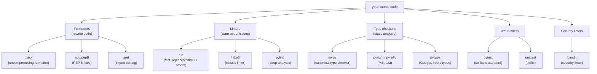

# 7. Basic Syntax and Style

## Why This Matters

Python is unusual among mainstream languages in that **whitespace is syntactically significant**. Indentation defines blocks — there are no `{}` braces. This choice has consequences: code is forced to look similar across teams, but a stray space or tab can change semantics invisibly. Combined with PEP 8 — Python's style guide — and the modern tooling ecosystem (`black`, `ruff`, `flake8`, `mypy`, `isort`), Python has arguably the most consistent source-code appearance of any language in wide use.

This note covers the **lexical structure** of Python (indentation, line continuation, multi-statement lines, string literal variants), the **PEP 8 conventions** that govern naming, spacing, and layout, and the **tooling ecosystem** that automates enforcement. Mastering this lets you read any Python file fluently and write code that looks "Pythonic" to experienced reviewers.

---

## Background

Python's designers chose significant indentation deliberately. From the Zen: *There should be one — and preferably only one — obvious way to do it.* Braces are an obvious source of style wars (K&R style vs. Allman style vs. Whitesmiths style). By making indentation the syntax, Python eliminates the war: blocks must be indented, period. The cost is that copy-paste can silently break indentation, and mixing tabs and spaces produces cryptic errors.

PEP 8 was written in 2001 by Guido van Rossum, Barry Warsaw, and Nick Coghlan. It is the canonical style guide for the CPython standard library and most major projects. It is not enforced by the language, but it is enforced by every serious project's CI.

---

## Lexical Structure

### Indentation

A **block** begins with a colon (`:`) at the end of a compound statement (`if`, `for`, `while`, `def`, `class`, `with`, `try`, `except`, `finally`, `match`, `else`, `elif`). The block body is the next set of indented lines. The block ends when indentation returns to the previous level.

```python
if x > 0:
    print("positive")    # ← inside if-block
    print("still inside")
print("after")           # ← outside if-block
```

PEP 8 mandates **4 spaces per indent level**. Tabs are allowed only if used consistently (and not mixed with spaces), but the de facto standard is spaces-only.

> [!danger] Never mix tabs and spaces
> Python 3 raises `TabError: inconsistent use of tabs and spaces in indentation`. Configure your editor to insert spaces when you press Tab (the "soft tab" setting).

### Line continuation

Long lines can be broken in two ways:

**Implicit continuation** inside `()`, `[]`, `{}`:

```python
result = some_function(
    arg1,
    arg2,
    arg3,
)

values = [
    "first",
    "second",
    "third",
]

config = {
    "host": "localhost",
    "port": 8080,
}
```

Implicit continuation is **preferred** because it doesn't require a backslash and is robust to whitespace.

**Explicit continuation** with `\`:

```python
total = first_value + \
        second_value + \
        third_value
```

This works outside parentheses but is fragile: a space after `\` silently breaks it. Prefer parentheses.

### Multi-statement lines with `;`

You can put multiple statements on one line separated by `;`:

```python
x = 1; y = 2; print(x + y)
```

PEP 8 says: **don't**. It's occasionally useful in shell one-liners (`python -c "import this; print('done')"`), never in real code.

### Compound statements on one line

```python
if x > 0: print("positive")
```

Also discouraged by PEP 8. Reserve for the shortest of cases (e.g., early-return guards in scripts).

### String literal variants

| Syntax | Type | Notes |
|--------|------|-------|
| `"..."` | str | Double quotes |
| `'...'` | str | Single quotes (interchangeable) |
| `"""..."""` | str | Triple-quoted; can span multiple lines |
| `'''...'''` | str | Triple-quoted with single quotes |
| `r"..."` | str | Raw string — backslashes literal |
| `b"..."` | bytes | Bytes literal |
| `f"..."` | str | f-string (Python 3.6+) |
| `rb"..."`, `fr"..."`, etc. | str/bytes | Combined prefixes |

```python
path = r"C:\Users\Alice"      # raw string, no escape needed
unicode_str = "héllo "      # str is Unicode by default
multiline = """line 1
line 2
line 3"""
```

> [!tip] Pick one quote style and stick with it
> PEP 8 doesn't mandate single vs double. Many projects default to double (matching f-string prevalence in C# and Java). `black` doesn't change quote style; use a linter like `flake8-quotes` if you want to enforce.

### Encoding and source declarations

By default, Python 3 source files are UTF-8. You can declare another encoding:

```python
# -*- coding: latin-1 -*-
```

This must be the first or second line (after the shebang). Rarely needed in 2024; UTF-8 is universal.

### Shebang

```python
#!/usr/bin/env python3
"""Module docstring."""
```

The `#!` line tells Unix-like systems to execute the file with `python3` (found via `env`). Required only for executable scripts.

---

## PEP 8 Highlights

### Naming conventions

| Type | Convention | Example |
|------|-----------|---------|
| Variables, functions, methods | `snake_case` | `user_name`, `fetch_data()` |
| Classes | `PascalCase` (UpperCamel) | `HttpClient`, `BankAccount` |
| Constants | `UPPER_SNAKE_CASE` | `MAX_RETRIES`, `DEFAULT_TIMEOUT` |
| Modules, packages | `lowercase` (no underscores if short) | `os`, `sys`, `datetime` |
| Private (convention) | leading underscore | `_internal`, `_Helper` |
| Name-mangled private | double leading underscore (in class) | `__value` |
| Magic names | double leading + trailing underscore | `__init__`, `__name__` |
| Type variables | often `T`, `T_co`, `_T` | `T = TypeVar("T")` |

> [!info] Name mangling
> A name like `__value` *inside a class body* is rewritten to `_ClassName__value`. This prevents accidental overrides in subclasses. It is not security — just disambiguation. Single underscore `_value` is a convention only; nothing prevents access.

### Line length

PEP 8 recommends **79 characters** for code, 72 for comments/docstrings. Many projects relax this to **99 or 100**. The 79 limit is a holdover from terminal widths; modern projects often use 88 (the `black` default) or 100.

### Blank lines

- **Two blank lines** between top-level functions and classes.
- **One blank line** between methods inside a class.
- Use blank lines sparingly inside functions to separate logical sections.

### Whitespace in expressions

```python
# Yes
x = 5
y = x + 1
spam(ham[1], {eggs: 2})
if x == 4: print(x, y); x, y = y, x

# No
x=5
y = x +1
spam( ham[ 1 ], { eggs: 2 } )
if x == 4 : print(x , y) ; x , y = y , x
```

Rules:

- No space immediately inside parentheses, brackets, or braces.
- No space immediately before a comma, semicolon, or colon.
- One space around binary operators (=, +, -, etc.), but be consistent.
- No space around `=` in keyword arguments or default parameter values: `def f(a=1, b=2):` not `def f(a = 1, b = 2):`.

### Imports

- One import per line.
- Imports at the top of the file.
- Order: stdlib → third-party → local (with a blank line between groups).
- Use absolute imports (`from package.module import name`) for clarity.
- Avoid wildcard imports (`from module import *`) — they pollute the namespace and break tooling.

```python
# Standard library
import os
import sys
from pathlib import Path

# Third-party
import requests
from flask import Flask, request

# Local
from myproject.utils import format_date
from myproject.models import User
```

`isort` and `ruff` automate this.

### Other rules

- Avoid trailing whitespace (invisible but causes diff noise).
- Files end with a single newline.
- Use `is`/`is not` for None, never `==`/`!=`.
- Use `startswith`/`endswith` instead of slicing when checking prefixes/suffixes.
- Compare to `None` like this: `if x is None:` — not `if x == None:`.
- Use `isinstance()`, not `type() ==`.
- Booleans: `if foo:` rather than `if foo == True:`.

---

## The Tooling Ecosystem



### `black` — the uncompromising formatter

`black` reformats your code automatically with no options (mostly). It enforces:

- Double quotes for strings.
- 88-character line length (configurable).
- Specific spacing rules.
- Trailing commas in multi-line collections.

Install and run:

```bash
pip install black
black mymodule.py
black src/       # format a whole directory
```

Pre-commit hook:

```yaml
# .pre-commit-config.yaml
repos:
  - repo: https://github.com/psf/black
    rev: 24.3.0
    hooks:
      - id: black
```

> [!tip] Black's philosophy
> "Any color you like, as long as it's black." By removing choice, `black` ends all formatting arguments in code review. Even if you disagree with a specific choice, consistency wins.

### `ruff` — the fast linter

`ruff` (written in Rust) is replacing `flake8`, `isort`, `pyupgrade`, `bandit`, and many others — often 100× faster. It also has a `--fix` mode that rewrites code.

```bash
pip install ruff
ruff check src/             # lint
ruff check --fix src/       # auto-fix
ruff format src/            # format (black-compatible)
```

Configure in `pyproject.toml`:

```toml
[tool.ruff]
line-length = 100
target-version = "py312"

[tool.ruff.lint]
select = ["E", "F", "I", "UP", "B", "SIM"]
ignore = ["E501"]   # line too long (handled by formatter)
```

### `flake8` — the classic linter

`flake8` wraps `pycodestyle` (PEP 8), `pyflakes` (unused imports/variables), and McCabe (complexity). Pre-dates `ruff`. Still used in many projects, but migrating to `ruff`.

### `mypy` — the type checker

`mypy` is the canonical static type checker for Python, written by the same team that designed PEP 484. It catches type errors at "compile time" without running the code.

```bash
pip install mypy
mypy src/
```

Configure in `pyproject.toml`:

```toml
[tool.mypy]
strict = true
```

We discuss type hints in depth in [[9. Type Hinting for Functions]].

### `isort` — import sorter

Already covered; usually replaced by `ruff`'s `I` rule set.

### `pylint` — deep linter

`pylint` analyses code more thoroughly than `flake8`/`ruff` (e.g., detecting similar code blocks, design issues). Noisy by default; requires configuration. Useful for large codebases.

### Pre-commit

`pre-commit` runs hooks (formatters, linters) on every commit. The standard Python setup includes `black`, `ruff`, `mypy`, and often `check-merge-conflict`, `trailing-whitespace`, `end-of-file-fixer`.

### `pyproject.toml` — the modern config hub

Since PEP 518, `pyproject.toml` is the canonical place for build configuration. It centralises settings for `black`, `ruff`, `mypy`, `pytest`, `coverage`, `setuptools`/`poetry`/`hatch` in one file.

```toml
[project]
name = "mypackage"
version = "1.0.0"
requires-python = ">=3.11"

[tool.black]
line-length = 100
target-version = ["py312"]

[tool.ruff]
line-length = 100
target-version = "py312"

[tool.mypy]
strict = true

[tool.pytest.ini_options]
testpaths = ["tests"]
```

---

## Annotated Code Examples

### Example 1: Good vs bad naming

```python
# Bad
def calc(x, y, z):
    return x * y + z

# Good
def total_price(unit_price, quantity, shipping_fee):
    return unit_price * quantity + shipping_fee
```

### Example 2: Properly formatted multi-line call

```python
# Good
result = requests.post(
    url,
    headers={"Content-Type": "application/json"},
    data=json.dumps(payload),
    timeout=30,
)

# Bad
result = requests.post(url, headers={"Content-Type":"application/json"}, data=json.dumps(payload), timeout=30)
```

### Example 3: Properly structured module

```python
"""My package's main module.

A longer description goes here.
"""

# Standard library imports
import os
import sys
from pathlib import Path

# Third-party imports
import requests
from dotenv import load_dotenv

# Local imports
from .utils import format_date
from .models import User

# Constants
DEFAULT_TIMEOUT = 30
MAX_RETRIES = 3

# Module-level state
load_dotenv()


def fetch_user(user_id: int) -> User:
    """Fetch a user from the API by ID."""
    response = requests.get(
        f"{os.environ['API_URL']}/users/{user_id}",
        timeout=DEFAULT_TIMEOUT,
    )
    response.raise_for_status()
    return User(**response.json())


def main() -> None:
    """CLI entry point."""
    user = fetch_user(1)
    print(user.name)


if __name__ == "__main__":
    main()
```

### Example 4: Clean class layout

```python
class Account:
    """A bank account."""

    # Class attributes (constants)
    INTEREST_RATE = 0.05

    # __init__ and other dunders first
    def __init__(self, owner, balance=0):
        self.owner = owner
        self.balance = balance

    def __repr__(self):
        return f"Account({self.owner!r}, {self.balance})"

    # Public methods
    def deposit(self, amount):
        self.balance += amount

    def withdraw(self, amount):
        if amount > self.balance:
            raise ValueError("insufficient funds")
        self.balance -= amount

    # Private methods last
    def _log(self, message):
        print(f"[Account] {message}")
```

---

## Common Pitfalls

### 1. Mixing tabs and spaces

```python
if x:
	print("tab")
        print("spaces")    # TabError
```

Configure your editor to "use spaces for tabs" and never look back.

### 2. Wrong indentation level after a colon

```python
if x > 0:
print("positive")    # IndentationError
```

### 3. Single statement after colon with multi-line body

```python
if x > 0:
    y = 1
    z = 2
    print(y, z)          # OK
else:
    print("non-positive")
```

Don't try to cram this on one line with `;` for non-trivial bodies.

### 4. Inconsistent line length

Pick a limit (88 for `black`, 100 for many teams, 79 for purists) and stick with it. Configure your editor's ruler.

### 5. Wildcard imports

```python
from os import *        #  pollutes namespace, hides origin
from os.path import join, exists    #  explicit
```

### 6. Missing trailing newline

Some tools (POSIX) expect files to end with a newline. Configure your editor to insert one. `ruff`/`black` will add it for you.

### 7. Trailing whitespace

Invisible, but creates noise in diffs and Git conflicts. Most editors strip it on save; `ruff` will fix it.

### 8. Inconsistent quote style

`black` will normalise to double quotes for you — let it.

### 9. Using `type(x) == int`

```python
type(x) == int    #  doesn't handle bool (subclass of int)
isinstance(x, int)   # 
```

### 10. Comparing to True/False

```python
if active == True:    # 
if active:            # 
```

---

## Tips and Tricks

- **Run `black` on save** in your editor — you'll never think about formatting again.
- **Run `ruff check --fix` in pre-commit** to catch issues early.
- **Use `mypy --strict` from day one** of a new project — adopting later is painful.
- **Configure `pyproject.toml`** for all tools; centralises config.
- **Set your editor's ruler** to your line length.
- **Use `# noqa: E501`** sparingly to suppress specific lints on specific lines.
- **Use `# fmt: off`/`# fmt: on`** to disable `black` on tables or aligned data.
- **Read PEP 8 once a year** — you'll always find a rule you've been violating.
- **Read other people's code** — `requests`, `flask`, `attrs`, `rich` are exemplars.
- **Don't fight the formatter** — let `black` and `ruff` do their job; argue in code review only about real issues.

---

## Active Recall

1. Why does Python use indentation for blocks instead of braces? Cite the relevant Zen aphorism.
2. What is PEP 8's recommendation for indentation width, line length, and blank lines?
3. List the two ways to continue a long line in Python. Which is preferred and why?
4. What naming convention does Python use for: variables, classes, constants, modules, private members?
5. What is name mangling, and how does it differ from a single leading underscore?
6. List four major Python linters/formatters and one feature of each.
7. What does `black` do, and why is its inflexibility considered a feature?
8. How does `ruff` differ from `flake8`?
9. Where should project configuration for tools like `black` and `mypy` live in a modern Python project?
10. Why are wildcard imports discouraged?
11. What's the difference between `type(x) == int` and `isinstance(x, int)`?
12. Write a properly formatted Python module that includes a docstring, imports, constants, and a `main()` function guarded by `__name__`.

---

## Next Steps

- Move to Chapter 2 ([[1. if-elif-else]]) to apply these conventions to control flow.
- Read [[6. Comments and Documentation]] for the companion topic of docstrings.
- See [[9. Type Hinting for Functions]] in Chapter 3 for the type-hint syntax that `mypy` checks.
- For packaging and project setup, see Chapter 22 ([[1. Packaging and Distribution]]).
- For tooling in teams, see Chapter 28 ([[1. Software Engineering Practices]]).
