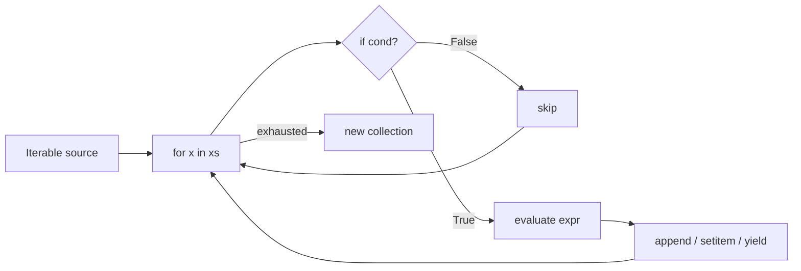
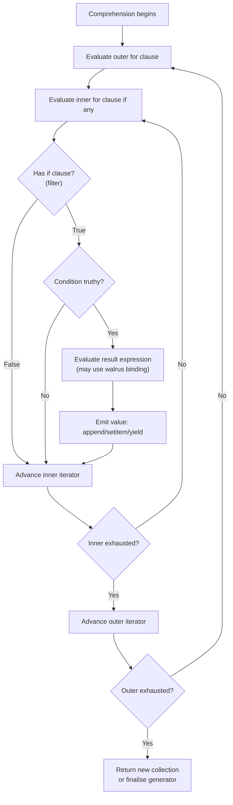
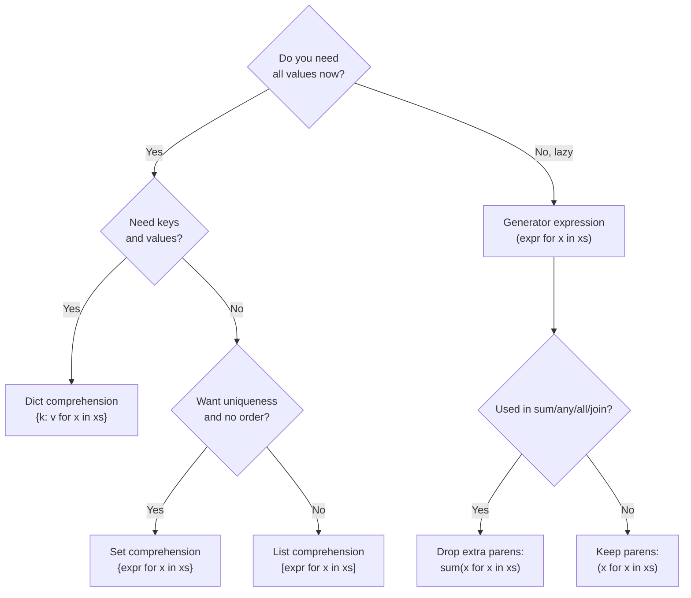

# 1. Comprehensions Deep Dive

> [!note] Why this note exists
> Comprehensions are one of Python's signature features — the most concise, readable, and often fastest way to build a new collection by transforming or filtering an iterable. They appear trivial at first glance, but underneath sit a private function scope, an implicit `append`/`__setitem__` protocol, the walrus operator, nested `for` clauses, and conditional expressions. This note goes past "list comp 101" into the full surface: list, dict, set, and generator comprehensions; multiple `for` clauses; conditional filtering versus conditional expressions; the `:=` walrus operator; performance comparisons against `for` loops, `map`, and `filter`; and — crucially — when **not** to use a comprehension.

## Why It Matters

Comprehensions collapse five or six lines of boilerplate into a single readable expression. They are the difference between:

```python
squares = []
for x in range(10):
    if x % 2 == 0:
        squares.append(x * x)
```

and:

```python
squares = [x * x for x in range(10) if x % 2 == 0]
```

Beyond brevity, comprehensions are **typically faster** than the equivalent `for` loop because the bytecode for `[... for x in it]` calls the list's `append` method through a dedicated `LIST_APPEND` opcode, avoiding the attribute lookup and method-resolution overhead of `squares.append(...)` on every iteration. Comprehensions also have their **own local scope** — names like `x` do not leak into the surrounding scope (this changed in Python 3, breaking from Python 2 behaviour), which prevents one of the classic "where did this variable come from?" bugs.

But comprehensions are not free. A complex nested comprehension with side effects becomes harder to read than a `for` loop, and a 200-element list comprehension that you can't fit on the screen defeats the purpose. Knowing the boundary between "elegant" and "clever" is what makes this a *Pythonic* topic, not just a syntactic one.

## Background

A comprehension is a **declarative expression** that builds a collection by iterating over one or more iterables and applying an optional filter and a transformation. The general form for a list comprehension is:

```
[ <expression> for <target> in <iterable> if <condition> ]
```

You can chain additional `for` and `if` clauses:

```
[ <expression> for x in xs for y in ys if cond(x, y) ]
```

The four comprehension flavours are:

| Comprehension | Produces | Syntax |
| --- | --- | --- |
| List | `list` | `[expr for x in xs]` |
| Dict | `dict` | `{k: v for x in xs}` |
| Set | `set` | `{expr for x in xs}` |
| Generator | generator object | `(expr for x in xs)` |

All four share the same evaluation model; only the surrounding brackets differ. See [[2. Generators and Iterators]] for the lazy-evaluation story of generator expressions.



## List Comprehensions

The simplest case transforms every element of an iterable:

```python
nums = [1, 2, 3, 4, 5]
squares = [n * n for n in nums]
# [1, 4, 9, 16, 25]
```

Add a filter with `if`:

```python
evens = [n for n in nums if n % 2 == 0]
# [2, 4]
```

The `if` here is a **filter**, not a ternary. It comes *after* the `for` and is evaluated before the result expression.

You can use a conditional expression in the result position instead, which produces a value for every iteration:

```python
labels = ["even" if n % 2 == 0 else "odd" for n in nums]
# ['odd', 'even', 'odd', 'even', 'odd']
```

The two forms can be combined:

```python
mixed = [n if n % 2 == 0 else -n for n in nums if n > 1]
# [-2, 3, -4, 5]
```

Read this right-to-left: iterate over `nums`, keep only items where `n > 1`, then for each kept item evaluate `n if n % 2 == 0 else -n`.

### Calling functions

The result expression can be any expression, including a function call:

```python
words = ["hello", "world", "python"]
uppered = [w.upper() for w in words]
lengths = [len(w) for w in words]
```

If the expression grows beyond one statement, switch to a `for` loop or extract a named helper function.

## Dict Comprehensions

Build a dictionary by writing `key: value` as the expression:

```python
pairs = [("a", 1), ("b", 2), ("c", 3)]
d = {k: v for k, v in pairs}
# {'a': 1, 'b': 2, 'c': 3}
```

Swap keys and values:

```python
inverted = {v: k for k, v in d.items()}
# {1: 'a', 2: 'b', 3: 'c'}
```

Compute values:

```python
squares = {n: n * n for n in range(5)}
# {0: 0, 1: 1, 2: 4, 3: 9, 4: 16}
```

> [!warning] Duplicate keys silently overwrite
> If two iterations produce the same key, the later one wins, just like `dict[k1] = v1; dict[k1] = v2`. There is no error.

## Set Comprehensions

Build a set (deduplicated, unordered):

```python
words = "the quick brown fox jumps over the lazy dog".split()
unique_first_letters = {w[0] for w in words}
# {'t', 'q', 'b', 'f', 'j', 'o', 'l', 'd'}
```

Set comprehensions are great when you need distinct values without caring about order.

## Generator Expressions

A generator expression is a comprehension surrounded by parentheses instead of brackets. It does **not** build a list — it returns a lazy generator object that produces items on demand:

```python
gen = (n * n for n in range(10))
print(gen)               # <generator object <genexpr> at 0x...>
print(next(gen))         # 0
print(next(gen))         # 1
print(list(gen))         # [4, 9, 16, 25, 36, 49, 64, 81]  — generator exhausted
```

Because nothing is materialised until requested, generator expressions are memory-friendly for huge iterables. They are also the natural argument form for `sum`, `any`, `all`, `min`, `max`, `sorted`, `list`, `dict`, `set`, and `''.join`:

```python
total = sum(n * n for n in range(1_000_000))     # no list allocated
has_match = any(line.startswith("ERROR") for line in open("app.log"))
```

Notice the generator expression doesn't need its own parens when it's the sole argument of a call. Two or more arguments, and you need explicit parens: `sorted((n*n for n in xs), reverse=True)`.

See [[2. Generators and Iterators]] for the full lazy-evaluation story.

## Multiple `for` Clauses (Nested Comprehensions)

You can iterate over multiple iterables in one comprehension. The order of `for` clauses matches the order of nested `for` loops you would write:

```python
# Nested loops
pairs = []
for x in range(3):
    for y in range(3):
        if x != y:
            pairs.append((x, y))

# Equivalent comprehension
pairs = [(x, y) for x in range(3) for y in range(3) if x != y]
# [(0, 1), (0, 2), (1, 0), (1, 2), (2, 0), (2, 1)]
```

Flatten a matrix:

```python
matrix = [[1, 2, 3], [4, 5, 6], [7, 8, 9]]
flat = [cell for row in matrix for cell in row]
# [1, 2, 3, 4, 5, 6, 7, 8, 9]
```

Cartesian product:

```python
suits = ""
ranks = "A23456789TJQK"
deck = [(r, s) for r in ranks for s in suits]
# 52 cards
```

> [!tip] Reading nested comprehensions
> Read the `for`/`if` clauses left-to-right as nested scopes. The leftmost `for` is the outermost loop.

## Conditional Filtering vs Conditional Expression

This is the single most common source of confusion. There are two distinct "if" positions:

1. **Filter clause** — placed *after* a `for`, controls whether the iteration contributes to the result.
2. **Conditional expression** — placed *in the result position*, produces a value for every kept iteration.

```python
# Filter: only even numbers contribute
evens_doubled = [n * 2 for n in range(10) if n % 2 == 0]
# [0, 4, 8, 12, 16]

# Conditional expression: every number contributes, but odd ones get None
labelled = [n * 2 if n % 2 == 0 else None for n in range(10)]
# [0, None, 4, None, 8, None, 12, None, 16, None]
```

You can mix them:

```python
# Only even numbers contribute, and they're tagged
tagged = [n * 2 if n > 5 else n for n in range(10) if n % 2 == 0]
# [0, 4, 12, 16]
```

The filter `if` always follows a `for`. The conditional expression's `if`/`else` lives inside the result expression and is a normal Python ternary.

## The Walrus Operator (`:=`) in Comprehensions

Python 3.8 introduced the **assignment expression** `:=`, nicknamed the walrus operator. It lets you bind a name *as part of an expression*, which is handy in comprehensions when you compute a value that you want to both filter on and use:

```python
# Without walrus — compute f(x) twice
results = [f(x) for x in xs if f(x) > threshold]

# With walrus — compute once
results = [y for x in xs if (y := f(x)) > threshold]
```

Real-world example: filtering and collecting non-empty lines from a file:

```python
with open("data.txt") as fh:
    stripped = [line for raw in fh if (line := raw.strip())]
```

Here `line` is bound to the stripped string inside the filter, and the same value is appended. Without the walrus you'd either call `strip()` twice or fall back to a `for` loop.

Another classic pattern — first match in a list of computed values:

```python
if any((match := pattern.search(p)) is not None for p in paths):
    print("found:", match.group())
```

Without `:=`, `any()` returning `True` would leave you with no reference to the matching element; you'd have to loop again.

## When NOT to Use a Comprehension

Comprehensions shine when the transformation is a single, readable expression. They hurt when:

1. **The expression has side effects.** Don't use a comprehension to call functions whose effects matter; the result list is wasteful and the intent is hidden.
   ```python
   # Bad
   [print(x) for x in range(10)]   # builds a list of Nones nobody uses

   # Good
   for x in range(10):
       print(x)
   ```

2. **The logic has multiple steps or intermediate variables.** If you need `:=` three times to make a comprehension work, a `for` loop will be clearer.

3. **You're nesting more than two `for` clauses.** A three-level nested comprehension is a maze. Switch to a loop, extract a helper, or use `itertools.product`.

4. **The comprehension is wider than your editor.** If you have to wrap a list comp across five lines, a `for` loop with a clear variable name is friendlier to readers.

5. **You're mutating external state.** Comprehensions should build a new collection. Use them to *transform*, not to *mutate*.

6. **Exception handling is needed.** You can't put `try`/`except` inside a comprehension's filter or expression. If a transformation might raise, use a loop.

> [!danger] Don't confuse comprehension with side-effectful iteration
> A list comprehension's job is to **build a list**, not to execute actions. If the list you'd build is unused, you're misusing the feature.

## Performance: Comprehension vs `for` Loop vs `map`/`filter`

Comprehensions are usually the fastest pure-Python option for building a transformed list. The reason is bytecode: `[expr for x in xs]` uses `LIST_APPEND`, which is a single opcode that appends to the list being built, bypassing the method-lookup cost of `lst.append(...)`.

A rough comparison (numbers vary by Python version and CPU):

```python
import timeit

xs = list(range(10_000))

def for_loop():
    out = []
    for x in xs:
        out.append(x * x)
    return out

def comprehension():
    return [x * x for x in xs]

def map_call():
    return list(map(lambda x: x * x, xs))

# Typical results (Python 3.11, relative timings)
# for_loop:      1.00x
# comprehension: 0.65x   ← fastest
# map_call:      0.95x
```

Notes on the comparison:

- `map` with a **built-in** function (e.g. `map(str.upper, words)`) can beat the comprehension, because the C-level call has no Python-frame overhead.
- `map` with a **lambda** is usually slower than the comprehension, because each call still pays for a Python function call.
- Generator expressions are *not* faster than list comprehensions for full materialisation; their win is **memory**, not speed.
- `filter` followed by `map` builds intermediate iterators; a comprehension does both in one pass.

> [!tip] Optimise for readability first
> Reach for comprehensions for clarity and idiomatic style. Only switch to `map`/`filter` if profiling shows a real, measurable win — usually only with C-level callables like `str.upper`, `int`, or `len`.

## Mermaid: Comprehension Evaluation Flow



## Mermaid: Choosing Between Comprehension Styles



## Common Pitfalls

1. **Using `if` in the wrong position.** `[x for x in xs if cond]` filters; `[x if cond else y for x in xs]` is a ternary expression. Mixing them up produces surprising results.

2. **Building a list you immediately throw away.** `[print(x) for x in xs]` is a code smell. Use a `for` loop.

3. **Forgetting that generator expressions are single-use.** You can't iterate a generator twice:
   ```python
   g = (x for x in range(3))
   list(g)   # [0, 1, 2]
   list(g)   # []  — exhausted
   ```

4. **Reusing the loop variable name.** `[x for x in xs for x in ys]` shadows `x` in the inner loop and is a maintenance nightmare.

5. **Duplicate dict keys.** `{k: v for k, v in pairs}` silently overwrites if `pairs` has duplicate keys. Validate first if that's a concern.

6. **Mutating while iterating.** Comprehensions read from an iterable; mutating the iterable mid-comprehension leads to undefined behaviour (especially for dicts and sets).

7. **Order of nested `for` clauses.** `[a + b for a in A for b in B]` is `for a in A: for b in B:`, not the reverse. People commonly write the loops in the wrong order.

8. **Walrus scope leaks outwards.** `y := f(x)` inside a comprehension binds `y` in the *enclosing* scope (since 3.8). That's surprising if you expected comprehension-local scoping.

9. **Calling expensive functions twice.** `[f(x) for x in xs if f(x) > threshold]` calls `f` twice per element. Use the walrus to call once.

10. **Confusing `list` of generators with list of values.** `[f(x) for x in xs]` where `f` returns a generator produces a list of generator objects, not a flat list. Use a nested comprehension or `itertools.chain.from_iterable`.

11. **Trusting order in set and dict comprehensions before 3.7.** Since Python 3.7 (and an implementation detail in 3.6), dict iteration order is insertion order, and sets preserve insertion order in CPython 3.7+. Don't rely on it for older versions.

12. **Memory blow-ups.** `[x for x in huge_iterable]` materialises the whole list. If you only need to scan, use a generator expression or a `for` loop.

## Tips and Tricks

- **Use `dict.fromkeys` for uniqueness-with-order:** `list(dict.fromkeys(xs))` is the canonical Python 3.7+ deduplication that preserves order. A set comprehension loses order.
- **Generator expression for short-circuit scans:** `any(predicate(x) for x in xs)` stops at the first `True`, never scanning the rest.
- **Prefer `dict` comprehension over `dict(zip(...))`:** `{k: v for k, v in zip(ks, vs)}` lets you transform or filter inline.
- **Walrus to share computed values between filter and result:** `[y for x in xs if (y := f(x)) > 0]` is the canonical pattern.
- **`itertools.chain.from_iterable` for flatten-one-level:** faster and clearer than a nested comprehension when you have a list of lists.
- **Profile, don't guess:** comprehensions are usually faster, but the difference is small unless you're in a hot loop.
- **Don't chain more than two `for` clauses.** Past that, readability collapses.
- **Use `tuple(...)` on a generator expression to materialise a tuple:** `tuple(x * x for x in range(5))`.
- **`sorted(gen, reverse=True)` for top-N-style sorts** without materialising an intermediate list.
- **Comprehension + `itertools.product` is usually clearer than triple-nested `for` clauses.**

## Active Recall

1. Write a list comprehension that produces the squares of all even numbers from 0 to 9.
2. Convert `result = []; for x in xs: if x: result.append(f(x))` into a comprehension.
3. What is the difference between `[x if c else y for x in xs]` and `[x for x in xs if c]`?
4. Why does `[n * n for n in range(10)]` typically beat the equivalent `for` loop with `append`?
5. Write a dict comprehension that swaps keys and values of `{"a": 1, "b": 2}`.
6. What does `{w[0] for w in words}` produce, and what type is the result?
7. When would you prefer a generator expression over a list comprehension?
8. Use the walrus operator to write a comprehension that filters non-empty stripped lines from a file and stores them.
9. Rewrite `[f(x) for x in xs if f(x) > 0]` to call `f` only once per element.
10. What happens if you iterate a generator expression twice?
11. Flatten `[[1, 2], [3, 4], [5, 6]]` using a single comprehension.
12. Why is `[print(x) for x in range(5)]` considered a misuse?
13. What is the evaluation order of `[a + b for a in A for b in B if a != b]`?
14. Name three situations in which a `for` loop is preferable to a comprehension.
15. How do you build a 52-card deck from `ranks` and `suits` strings in one line?
16. What is the scope of the loop variable in a list comprehension — does it leak to the enclosing scope?
17. Convert `map(lambda x: x.upper(), words)` to a comprehension. Which is faster in CPython? Why might the answer differ for `map(str.upper, words)`?
18. Write a comprehension using walrus to find the first file in `paths` whose size exceeds 1 MB.
19. What does `{v: k for k, v in [("a", 1), ("b", 1)]}` produce, and why?
20. How would you deduplicate a list while preserving order in Python 3.7+?

## Next Steps

- [[2. Generators and Iterators]] — what generator expressions actually do at runtime and how to write full generator functions with `yield`.
- [[6. Higher Order Functions]] — when to reach for `map`/`filter`/`reduce` instead of a comprehension.
- [[5. Closures]] — the closure mechanics that make `walrus` and nested comprehensions behave the way they do.
- [[4. Decorators Deep Dive]] — comprehensions meet decorator factories when building registries.
- [[1. Comprehensions Deep Dive]] — this note; consider re-reading after the Generators note, because the lazy evaluation story reframes generator expressions.
